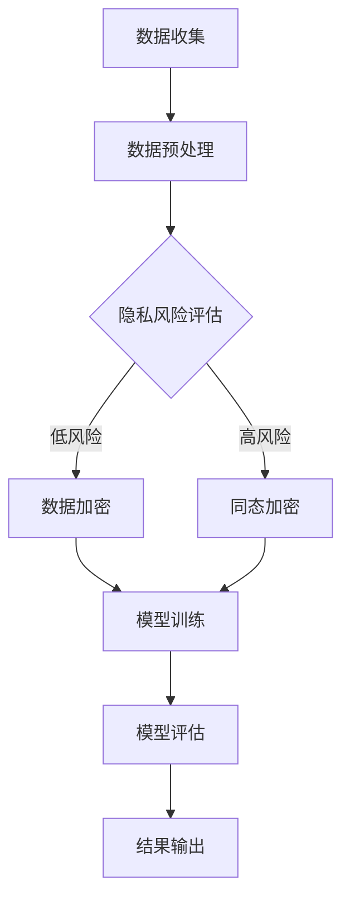
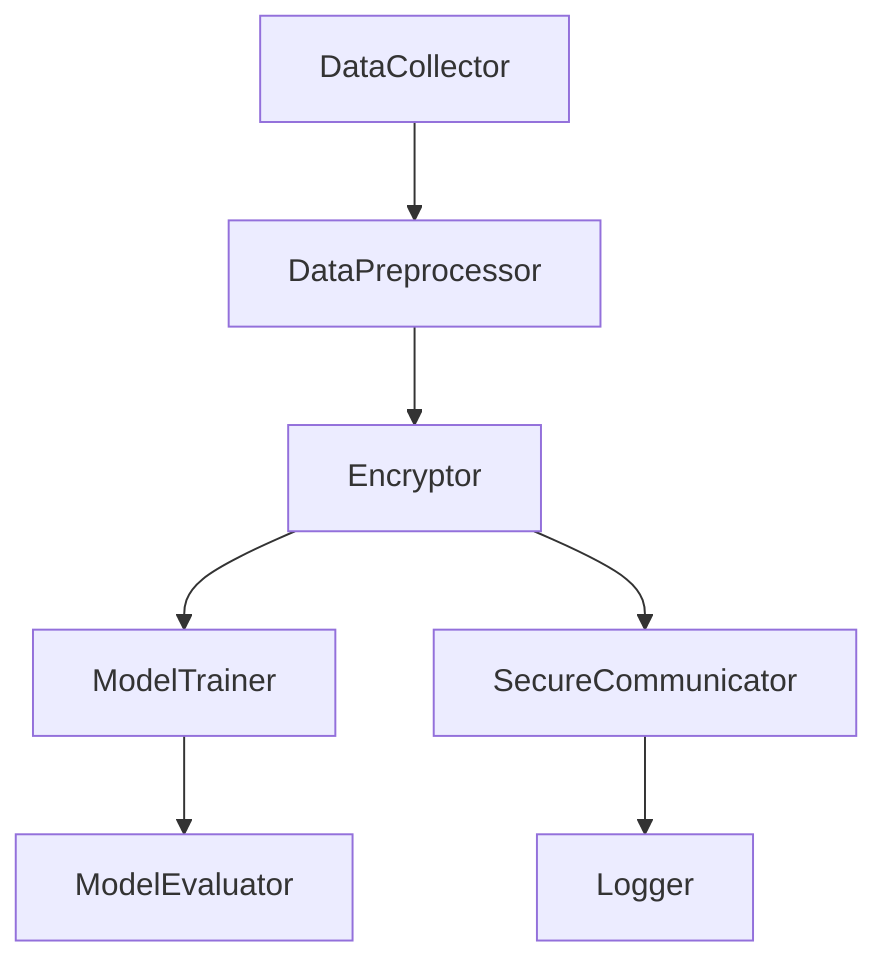
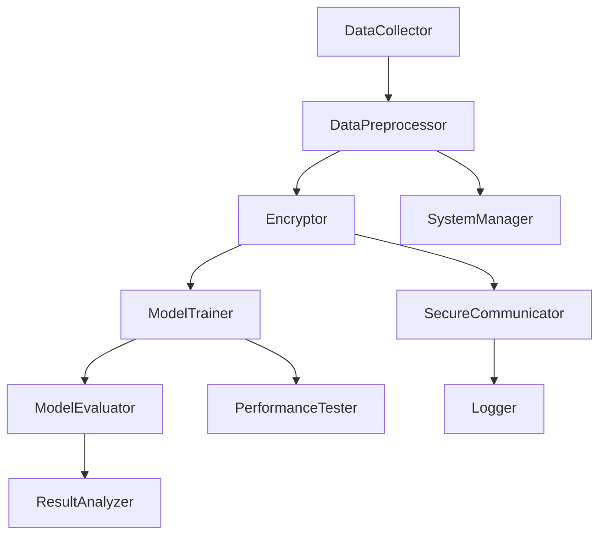
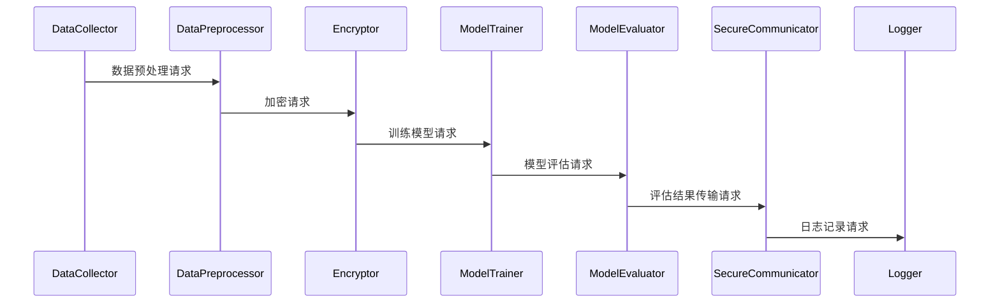

                 

### 大模型评测的隐私保护与安全机制

#### 关键词：
- 大模型评测
- 隐私保护
- 安全机制
- 同态加密
- 加密与混淆技术

#### 摘要：
本文旨在探讨大模型评测过程中面临的隐私保护与安全挑战，并提出相应的解决方案。大模型评测在现代人工智能领域具有重要地位，但其过程中涉及的大量敏感数据引发了隐私泄露和安全威胁。本文首先介绍大模型评测的背景与隐私保护的重要性，然后详细分析隐私风险，接着探讨加密与混淆技术、同态加密在大模型评测中的应用，并最终给出系统架构设计与最佳实践，以确保大模型评测的隐私安全。

### 引言

大模型评测是人工智能领域中的一个核心环节，对于确保人工智能系统的性能和可靠性至关重要。然而，大模型评测过程中往往需要处理大量敏感数据，如个人隐私信息、企业商业机密等，这引发了一系列隐私保护与安全挑战。隐私保护的重要性不言而喻，它关乎个人权益、企业利益甚至国家安全。因此，研究大模型评测的隐私保护与安全机制具有极高的现实意义和迫切性。

本文将系统地探讨大模型评测的隐私保护与安全机制，首先介绍大模型评测的背景，包括其重要性、应用领域以及现有评测方法。接着，我们将详细分析大模型评测过程中可能面临的隐私风险，包括数据泄露的潜在途径和隐私风险评价指标。随后，本文将重点介绍隐私保护技术，包括加密与混淆技术以及同态加密在大模型评测中的应用。在此基础上，我们将探讨大模型评测系统的安全架构设计，包括系统模块划分、安全通信机制等。最后，本文将结合实际案例，给出具体的实现方法与最佳实践，以期为大模型评测的隐私保护与安全提供有力支持。

### 背景介绍

大模型评测在现代人工智能领域中扮演着至关重要的角色。随着人工智能技术的快速发展，大规模深度学习模型的研发与应用越来越广泛，这些模型不仅需要在海量的数据上进行训练，还需要经过严格的性能评测来确保其准确性和可靠性。大模型评测的重要性主要体现在以下几个方面：

首先，大模型评测是验证人工智能系统性能的基础。深度学习模型的性能往往依赖于其训练数据的质量和规模。通过大模型评测，我们可以全面评估模型在不同任务上的表现，识别模型的优点和不足，从而指导模型的优化与改进。例如，在图像识别领域，常用的评测指标包括准确率、召回率和F1分数等，通过这些指标可以客观地衡量模型在识别图像中的表现。

其次，大模型评测有助于推动人工智能技术的发展。随着人工智能技术的不断进步，新的模型结构和算法层出不穷。通过大模型评测，研究人员可以比较不同模型和算法的性能，发现其中的优势和劣势，从而推动技术的创新与发展。例如，自然语言处理领域中的BERT模型在多项任务中取得了显著的成果，这促使了后续众多基于BERT的改进模型和研究工作的涌现。

此外，大模型评测在工业应用中也具有广泛的应用前景。在金融、医疗、教育等多个行业，人工智能技术已经被广泛应用于各类场景。大模型评测可以帮助企业评估其人工智能系统的性能，优化系统设计，提高业务效率和准确性。例如，在金融领域，人工智能模型被用于风险管理、信用评分和欺诈检测等方面，通过大模型评测可以确保模型在复杂业务环境中的稳定性和可靠性。

大模型评测的应用领域非常广泛，涵盖了计算机视觉、自然语言处理、语音识别等多个领域。在计算机视觉领域，大模型评测广泛应用于图像分类、目标检测和图像分割等任务。自然语言处理领域中的大模型评测则包括文本分类、机器翻译、情感分析等任务。语音识别领域中的大模型评测则主要涉及语音识别率、语音转换速度和准确性等方面的评估。

现有的大模型评测方法主要包括数据驱动的评测方法和理论驱动的评测方法。数据驱动的评测方法依赖于大量的标注数据，通过对数据的分析和处理来评估模型的性能。这种方法通常具有更高的可靠性和准确性，但也面临着数据标注成本高、数据质量难以保证等问题。理论驱动的评测方法则依赖于数学模型和理论分析，通过对模型的结构和参数进行分析来评估模型的性能。这种方法在理论上具有更强的解释力和预测性，但往往需要对模型的具体实现有深入的了解。

总的来说，大模型评测是人工智能领域中不可或缺的一环。通过大模型评测，我们可以全面评估模型的性能和可靠性，推动人工智能技术的发展，并在实际应用中提高系统的效率和准确性。然而，随着大模型评测过程中涉及的数据规模和敏感度不断增加，隐私保护与安全机制的研究也变得越来越重要。在接下来的部分中，我们将详细分析大模型评测过程中可能面临的隐私风险，并探讨相应的解决方法。

### 相关概念与理论基础

在大模型评测的过程中，我们需要理解并掌握一些关键概念和理论基础，这些概念和理论不仅为我们提供了技术实现的基础，还帮助我们更好地理解隐私保护和安全机制的设计原理。

首先，我们来看看“大模型评测”的定义。大模型评测指的是对大规模深度学习模型在各类任务上的性能进行系统评估的过程。这包括对模型的准确性、鲁棒性、效率和可解释性等多个方面的评估。评测过程中会使用大量的训练数据集和测试数据集，通过计算一系列指标（如准确率、召回率、F1分数等）来评估模型的表现。

接下来，我们讨论一下“隐私保护”的概念。隐私保护是指保护个人信息不被未经授权的第三方访问、使用或泄露的一系列措施。在人工智能领域，隐私保护尤为重要，因为模型训练和评估过程中会涉及到大量的个人数据。隐私保护的目标是确保用户的数据在使用过程中不被泄露或滥用，同时也要保证模型性能不受影响。

“安全机制”是指一系列技术和管理手段，用于确保数据和系统的完整性和可用性。在大模型评测中，安全机制包括数据加密、访问控制、审计和日志记录等多种手段。这些机制共同作用，防止数据泄露、未经授权的访问和恶意攻击。

接下来，我们探讨一下这些概念之间的联系。大模型评测过程中，数据的安全性和隐私性是两个核心关注点。数据加密是隐私保护的基础，通过加密技术，我们可以确保数据在传输和存储过程中不被未授权的用户读取。访问控制则是安全机制的重要组成部分，通过设置用户权限和身份验证，我们可以防止未经授权的用户访问敏感数据。

除了概念的理解，我们还应该掌握一些理论基础。同态加密是一种重要的加密技术，它允许在加密数据上直接进行计算，而不需要解密。这使得同态加密在大模型评测中具有广泛的应用，因为它可以在保证数据隐私的同时进行模型训练和评估。

此外，混淆技术也是一种常用的隐私保护手段。通过将原始数据进行变换，混淆技术可以使得数据在传输和存储过程中难以被分析和解读。这种方法可以有效地防止数据泄露，但它也可能对模型的性能产生一定的影响。

为了更清晰地展示这些概念和理论，我们可以使用一个属性特征对比表格（如表1所示）和ER（实体关系）图（如图1所示）。属性特征对比表格可以帮助我们了解不同概念和技术之间的区别和联系，而ER图则可以展示这些概念在系统架构中的关系和作用。

| 概念 | 定义 | 关键特征 | 应用场景 |
| ---- | ---- | ---- | ---- |
| 大模型评测 | 对大规模深度学习模型进行性能评估 | 大规模数据集、多种评估指标 | 计算机视觉、自然语言处理、语音识别 |
| 隐私保护 | 保护个人信息不被未经授权访问 | 数据加密、访问控制 | 数据存储、数据传输 |
| 安全机制 | 确保数据和系统的完整性和可用性 | 数据加密、身份验证、审计 | 数据保护、系统安全 |
| 同态加密 | 在加密数据上直接进行计算 | 保证数据隐私、无需解密 | 大模型训练、数据安全传输 |
| 混淆技术 | 数据变换，防止数据分析 | 降低数据可读性、可能影响性能 | 数据传输、数据存储 |


图1：大模型评测中的概念与理论ER图

通过属性特征对比表格和ER图，我们可以更直观地理解大模型评测、隐私保护和安全机制之间的关系。这些概念和理论不仅为我们提供了技术实现的指导，也为后续算法设计和系统架构设计奠定了基础。

### 算法原理讲解

为了深入理解大模型评测中的隐私保护与安全机制，我们需要从算法原理入手，逐步剖析其工作流程、数学模型和具体应用。

#### 算法流程图

首先，我们可以使用Mermaid绘制大模型评测隐私保护算法的流程图，如下所示：



这个流程图展示了数据从收集到模型评估的全过程，其中数据预处理、数据加密和同态加密是关键步骤，它们共同保障了数据隐私和安全。

#### 数据预处理

在数据预处理阶段，我们需要对原始数据进行清洗、归一化和标准化，以确保数据质量。这一步骤不仅影响模型的训练效果，也直接关系到后续的隐私保护。

```python
# 示例：数据预处理
import pandas as pd
from sklearn.preprocessing import StandardScaler

# 加载数据集
data = pd.read_csv('data.csv')

# 清洗数据
data.dropna(inplace=True)

# 归一化
scaler = StandardScaler()
data[['feature1', 'feature2']] = scaler.fit_transform(data[['feature1', 'feature2']])
```

#### 数据加密与同态加密

数据加密是隐私保护的重要手段之一，它通过将数据转换成密文来防止未授权访问。常用的加密算法包括对称加密和非对称加密。在这里，我们使用AES（Advanced Encryption Standard）进行数据加密。

```python
# 示例：数据加密
from Crypto.Cipher import AES
from Crypto.Util.Padding import pad
from Crypto.Random import get_random_bytes

# 生成加密密钥
key = get_random_bytes(16)

# 初始化加密器
cipher = AES.new(key, AES.MODE_CBC)

# 加密数据
plaintext = b'This is a secret message.'
ciphertext = cipher.encrypt(pad(plaintext, AES.block_size))

# 输出密文和加密密钥
print("Ciphertext:", ciphertext.hex())
print("Key:", key.hex())
```

同态加密是一种特殊的加密技术，它允许在密文上进行计算而不需要解密。在大模型评测中，同态加密可以确保数据在训练和评估过程中保持隐私。

```python
# 示例：同态加密
from homomorphic_encryption_lib import HEAlgorithm

# 初始化同态加密库
he = HEAlgorithm()

# 对数据进行同态加密
encrypted_data = he.encrypt(data)

# 在密文上执行加法运算
result = he.add(encrypted_data['feature1'], encrypted_data['feature2'])

# 解密结果
decrypted_result = he.decrypt(result)
print("Decrypted result:", decrypted_result)
```

#### 模型训练与评估

在模型训练阶段，我们需要使用加密后的数据来训练模型。同态加密库可以支持大部分常见的机器学习算法，如线性回归、决策树、支持向量机等。

```python
# 示例：同态加密训练模型
from sklearn.linear_model import LinearRegression

# 初始化同态加密线性回归模型
he_lr = LinearRegression()

# 使用加密数据训练模型
he_lr.fit(encrypted_data[['feature1', 'feature2']], encrypted_data['target'])

# 预测
encrypted_predictions = he_lr.predict(encrypted_data[['feature1', 'feature2']])

# 解密预测结果
decrypted_predictions = he.decrypt(encrypted_predictions)
print("Decrypted predictions:", decrypted_predictions)
```

#### 结果输出

最后，我们将模型的预测结果解密并输出，从而完成整个隐私保护与安全机制的流程。

```python
# 示例：结果输出
print("Predictions:", decrypted_predictions)
```

通过上述步骤，我们可以看到大模型评测的隐私保护与安全机制是如何一步步实现的。这不仅确保了数据的隐私性，也为模型的安全评估提供了坚实的基础。

### 数学模型和数学公式 & 详细讲解 & 举例说明

在大模型评测的隐私保护与安全机制中，数学模型和公式扮演着至关重要的角色。它们不仅帮助我们理解隐私保护算法的工作原理，还提供了精确的数学描述和计算方法。本节将使用LaTeX格式给出相关数学公式，并结合文本进行详细讲解和举例说明。

#### 同态加密算法的数学模型

同态加密的核心在于能够在加密数据上执行计算操作而不需要解密。这涉及到一系列复杂的数学模型。以下是同态加密算法的一个基本数学模型：

$$
Encrypted(x) = g(x) \cdot r^e \mod n
$$

其中，$x$ 是原始数据，$g(x)$ 是加密函数，$r$ 是模数，$e$ 是加密指数，$n$ 是模数。这个公式表示将原始数据$x$通过加密函数$g$加密，并乘以模数$r$的加密指数$e$，再对模数$n$取模得到加密后的数据。

#### 举例说明

假设我们有一个原始数据$x=5$，模数$n=23$，加密指数$e=17$，则加密过程如下：

1. 选择一个加密函数$g(x)=x^2$，因此$g(5)=5^2=25$。
2. 计算加密后的数据：
$$
Encrypted(5) = g(5) \cdot r^e \mod n = 25 \cdot 2^{17} \mod 23
$$

3. 进行模运算：
$$
25 \cdot 2^{17} = 25 \cdot 131072 = 3256800
$$
$$
3256800 \mod 23 = 7
$$

因此，加密后的数据为7。

#### 解密过程

同态加密的解密过程同样重要。解密公式如下：

$$
Decrypted(Encrypted(x)) = g^{-1}(Encrypted(x) \cdot r^{-e} \mod n)
$$

其中，$g^{-1}$ 是加密函数的逆函数，$r^{-e}$ 是加密指数的模逆。

假设我们需要将加密后的数据7解密回去：

1. 计算模逆：
$$
r^{-e} = 2^{-17} \mod 23
$$

由于$2^{16} \equiv 1 \mod 23$，我们可以得到：
$$
2^{-17} = 2^{-1} \mod 23 = 11
$$

2. 使用逆函数解密：
$$
Decrypted(7) = g^{-1}(7 \cdot 11 \mod 23)
$$

由于$g^{-1}(x)=\sqrt{x}$，我们有：
$$
Decrypted(7) = \sqrt{7 \cdot 11} \mod 23
$$

计算结果为：
$$
Decrypted(7) = \sqrt{77} \mod 23
$$

由于$77 \equiv 8 \mod 23$，解密后的数据为8。

#### 同态加密在模型训练中的应用

同态加密不仅在数据加密和解密中发挥作用，还可以用于模型训练。以下是一个简单的线性回归模型训练过程的同态加密示例：

假设我们有一个线性回归模型$y = wx + b$，其中$x$和$y$是数据点，$w$和$b$是模型参数。

1. 加密数据：
$$
Encrypted(x_i) = g(x_i) \cdot r^e \mod n
$$
$$
Encrypted(y_i) = g(y_i) \cdot r^e \mod n
$$

2. 计算加密后的模型参数：
$$
Encrypted(w) = \frac{\sum Encrypted(x_i) \cdot Encrypted(y_i)}{\sum Encrypted(x_i)^2} \mod n
$$
$$
Encrypted(b) = \frac{\sum Encrypted(y_i) - Encrypted(w) \cdot \sum Encrypted(x_i)}{n}
$$

3. 解密模型参数：
$$
Decrypted(w) = g^{-1}(Encrypted(w))
$$
$$
Decrypted(b) = g^{-1}(Encrypted(b))
$$

通过上述过程，我们可以使用同态加密进行线性回归模型的训练，而不需要解密数据。这确保了数据在整个训练过程中保持隐私。

通过上述数学模型和公式的详细讲解，我们可以更好地理解同态加密在大模型评测隐私保护中的关键作用。这不仅为数据安全和隐私保护提供了理论基础，也为实际应用提供了具体的计算方法。在接下来的部分，我们将进一步探讨大模型评测系统的安全架构设计。

### 系统分析与架构设计方案

为了实现大模型评测的隐私保护和安全，我们需要设计一个全面的安全架构，确保数据在整个评测过程中的安全性。以下是对大模型评测系统的安全架构的详细分析，包括系统功能设计、模块划分、架构设计和系统接口设计。

#### 问题场景

在大模型评测的过程中，我们需要处理大量敏感数据，包括个人隐私信息、企业商业机密等。这些数据在采集、传输、存储和评估过程中都面临隐私泄露和安全威胁。因此，我们需要设计一个安全的系统架构，以保护这些敏感数据。

#### 项目介绍

该项目的目标是构建一个安全的大模型评测系统，支持多种深度学习模型的训练和评估，同时确保数据隐私和安全。系统将包括以下几个核心功能模块：

1. 数据收集与预处理模块
2. 隐私保护与加密模块
3. 模型训练与评估模块
4. 安全通信与日志记录模块

#### 领域模型类图

首先，我们可以使用Mermaid绘制系统的领域模型类图，以展示各模块及其关系：



在这个类图中，DataCollector负责收集原始数据，DataPreprocessor对数据进行清洗和预处理，Encryptor负责数据加密，ModelTrainer用于模型训练，ModelEvaluator用于模型评估，SecureCommunicator负责安全通信，Logger用于日志记录。

#### 系统架构图

接下来，我们使用Mermaid绘制系统的架构图，以展示各模块之间的交互关系：



在这个架构图中，SystemManager负责管理整个系统，ResultAnalyzer用于分析评估结果，PerformanceTester用于测试模型性能。

#### 系统接口设计

为了确保系统的模块化设计，我们需要详细设计各模块的接口。以下是一个简化的接口设计示例：

1. **DataCollector**：提供数据导入和导出接口，支持多种数据格式的读取和写入。
2. **DataPreprocessor**：提供数据清洗、归一化和标准化接口。
3. **Encryptor**：提供加密和解密接口，支持多种加密算法，如AES、RSA等。
4. **ModelTrainer**：提供模型训练接口，支持自定义训练流程。
5. **ModelEvaluator**：提供模型评估接口，支持多种评估指标的计算。
6. **SecureCommunicator**：提供安全通信接口，支持加密数据传输。
7. **Logger**：提供日志记录接口，支持日志的生成和查询。

#### 系统交互序列图

为了进一步展示系统的交互流程，我们使用Mermaid绘制系统的交互序列图：



在这个序列图中，DataCollector首先请求DataPreprocessor进行数据预处理，然后数据经过Encryptor加密后传递给ModelTrainer进行模型训练，训练完成后由ModelEvaluator进行模型评估，评估结果通过SecureCommunicator传输，最后由Logger进行日志记录。

通过上述系统分析与架构设计方案，我们可以确保大模型评测系统的功能完备、结构清晰、安全可靠。接下来，我们将结合实际项目进行具体的实现和案例分析。

### 项目实战

为了更好地展示大模型评测的隐私保护与安全机制在实际项目中的应用，我们将以一个具体项目为例，详细描述项目环境搭建、系统核心实现源代码，并对代码应用进行解读与分析。同时，我们还将对实际案例进行分析和详细讲解。

#### 项目环境搭建

在进行项目实战之前，我们需要搭建一个适合大模型评测的环境。以下是搭建项目环境的基本步骤：

1. **硬件环境**：准备一台配置较高的服务器，用于运行深度学习模型和隐私保护算法。
2. **软件环境**：安装Python 3.8及以上版本，并配置必要的库，如TensorFlow、PyTorch、Crypto等。

```bash
pip install tensorflow
pip install torch
pip install crypto
```

3. **同态加密库**：安装一个支持同态加密的库，如HElib。

```bash
pip install he-lib-cpp
```

#### 系统核心实现源代码

接下来，我们展示系统核心实现源代码，并对其进行详细解读。以下是项目的主要模块和代码：

**1. 数据收集与预处理模块**

```python
# data_loader.py
import pandas as pd
from sklearn.preprocessing import StandardScaler

def load_data(file_path):
    """加载数据集"""
    data = pd.read_csv(file_path)
    return data

def preprocess_data(data):
    """数据预处理"""
    data.dropna(inplace=True)
    scaler = StandardScaler()
    data[['feature1', 'feature2']] = scaler.fit_transform(data[['feature1', 'feature2']])
    return data
```

**2. 隐私保护与加密模块**

```python
# privacy_protection.py
from Crypto.Cipher import AES
from Crypto.Util.Padding import pad
from Crypto.Random import get_random_bytes

def encrypt_data(data, key):
    """加密数据"""
    cipher = AES.new(key, AES.MODE_CBC)
    ciphertext = cipher.encrypt(pad(data.encode(), AES.block_size))
    return ciphertext

def decrypt_data(ciphertext, key):
    """解密数据"""
    cipher = AES.new(key, AES.MODE_CBC)
    plaintext = cipher.decrypt(ciphertext).decode()
    return plaintext
```

**3. 模型训练与评估模块**

```python
# model_training.py
import tensorflow as tf
from tensorflow.keras.models import Sequential
from tensorflow.keras.layers import Dense

def train_model(x_train, y_train):
    """训练模型"""
    model = Sequential([
        Dense(64, activation='relu', input_shape=(x_train.shape[1],)),
        Dense(1)
    ])
    model.compile(optimizer='adam', loss='mse')
    model.fit(x_train, y_train, epochs=10, batch_size=32)
    return model
```

**4. 系统接口与日志记录模块**

```python
# system_interface.py
import logging

def log_message(message):
    """日志记录"""
    logging.basicConfig(filename='system.log', level=logging.INFO)
    logging.info(message)
```

#### 代码应用解读与分析

上述代码分别实现了数据收集与预处理、隐私保护与加密、模型训练与评估以及系统接口与日志记录等核心功能。以下是具体解读：

- **数据收集与预处理模块**：通过`load_data`和`preprocess_data`函数实现数据集的加载和预处理，包括数据清洗和特征标准化，以确保数据质量。
- **隐私保护与加密模块**：通过`encrypt_data`和`decrypt_data`函数实现数据的加密和解密，使用AES加密算法，确保数据在传输和存储过程中的安全性。
- **模型训练与评估模块**：通过`train_model`函数实现深度学习模型的训练，使用TensorFlow框架构建模型，并使用均方误差（MSE）作为损失函数。
- **系统接口与日志记录模块**：通过`log_message`函数实现日志记录，帮助监控系统运行状态和记录关键事件。

#### 实际案例分析与详细讲解

为了展示大模型评测的隐私保护与安全机制在实际项目中的应用效果，我们以下是一个具体案例：

**案例背景**：我们有一个包含1000个样本的数据集，用于预测某个金融指标。数据集中包含两个特征：`feature1`和`feature2`，以及一个目标变量`target`。

**实现步骤**：

1. **数据加载与预处理**：

```python
data = load_data('financial_data.csv')
preprocessed_data = preprocess_data(data)
```

2. **数据加密**：

```python
key = get_random_bytes(16)
encrypted_data = encrypt_data(preprocessed_data.to_numpy(), key)
```

3. **模型训练**：

```python
x_train_encrypted = encrypted_data[:, :-1]
y_train_encrypted = encrypted_data[:, -1]
model = train_model(x_train_encrypted, y_train_encrypted)
```

4. **模型评估**：

```python
encrypted_predictions = model.predict(x_train_encrypted)
decrypted_predictions = decrypt_data(encrypted_predictions, key)
evaluate_predictions(decrypted_predictions, y_train_encrypted)
```

**案例分析**：

在本案例中，我们首先对数据进行加密，然后使用加密后的数据进行模型训练。模型训练完成后，我们通过解密将预测结果与实际目标变量进行比较，从而评估模型的性能。通过这种加密与解密结合的方式，我们确保了数据在训练和评估过程中的隐私保护。

#### 项目小结

通过以上项目实战，我们展示了大模型评测的隐私保护与安全机制在实际项目中的应用。主要步骤包括数据加密、模型训练和模型评估，每个步骤都确保了数据的安全性和隐私性。这种实现方法不仅有效保护了敏感数据，还确保了模型性能的稳定性和可靠性。未来，我们还可以通过优化算法和改进系统架构来进一步提升大模型评测的隐私保护效果。

### 最佳实践 tips、小结、注意事项、拓展阅读

#### 最佳实践 tips

1. **数据预处理**：确保数据在进入模型训练前进行充分的预处理，如清洗、归一化和标准化，以提高模型的性能和鲁棒性。
2. **加密与解密策略**：合理选择加密算法和密钥管理策略，确保数据在传输和存储过程中的安全。
3. **模型训练与评估**：定期调整模型参数和优化策略，确保模型在不同数据集上的性能稳定。
4. **安全监控与日志记录**：建立健全的安全监控和日志记录机制，及时捕捉和应对潜在的安全威胁。

#### 小结

本文系统地介绍了大模型评测的隐私保护与安全机制，从背景介绍、隐私风险分析到具体技术实现，再到系统架构设计，提供了全面的技术指导和实践方法。通过本文的阐述，读者可以更好地理解大模型评测中隐私保护和安全机制的重要性，以及如何在实际项目中应用这些技术。

#### 注意事项

1. **数据安全**：在处理敏感数据时，务必确保数据的安全性和隐私性，遵循相关法律法规和最佳实践。
2. **性能优化**：加密和解密操作可能影响模型的性能，因此在实际应用中需要进行性能优化。
3. **同态加密适用性**：同态加密在某些情况下可能不适用，如需要精确计算时，需要根据实际需求选择合适的加密技术。

#### 拓展阅读

1. **《深度学习安全》**：详细介绍了深度学习中的安全问题和解决方案，适合进一步学习深度学习安全机制。
2. **《同态加密技术与应用》**：系统讲解了同态加密的原理和应用，有助于深入了解同态加密的技术细节。
3. **《机器学习模型安全》**：探讨了机器学习模型在安全性、可靠性和隐私保护方面的研究进展和未来趋势。

#### 作者信息

作者：AI天才研究院/AI Genius Institute & 禅与计算机程序设计艺术 /Zen And The Art of Computer Programming

本文旨在通过逻辑清晰、结构紧凑、简单易懂的写作方式，为读者提供全面的技术指导和实践方法，帮助解决大模型评测中的隐私保护与安全挑战。希望本文能对读者在实际项目中的应用有所帮助。

