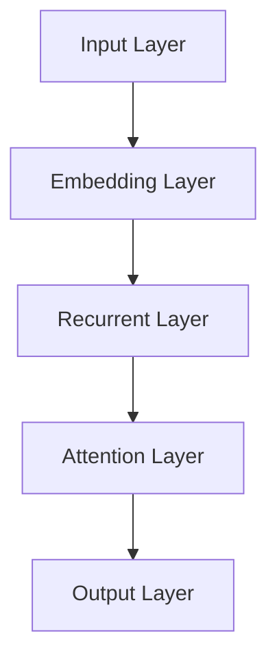
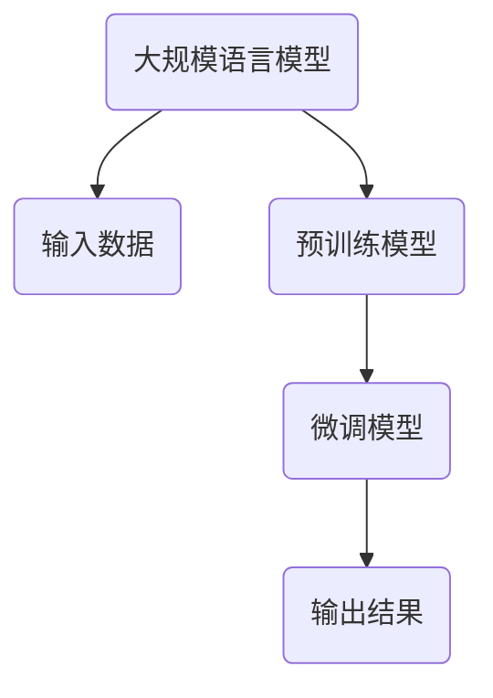
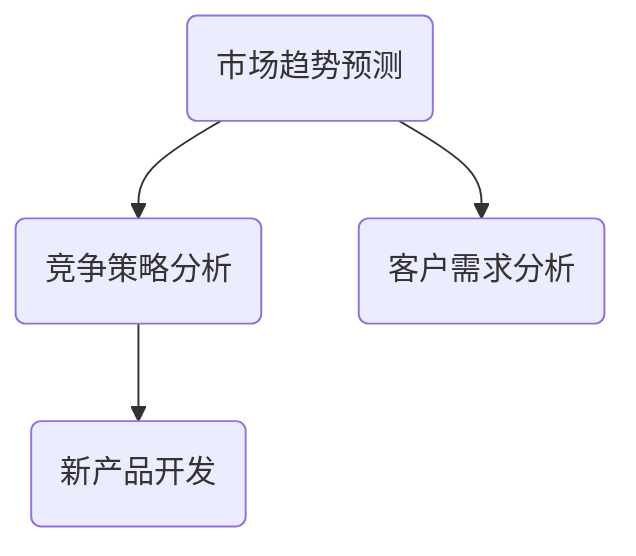

                 

## 大规模语言模型在企业战略规划中的推理应用

### 关键词

- 大规模语言模型
- 企业战略规划
- 推理应用
- 数据处理
- 深度学习

### 摘要

随着大数据和人工智能技术的快速发展，大规模语言模型（如GPT、BERT等）在企业战略规划中的应用逐渐受到关注。本文首先介绍了大规模语言模型的基本概念和原理，然后分析了其在企业战略规划中的优势与挑战，最后通过具体案例展示了大规模语言模型在企业战略规划中的实际应用，并提出了相应的最佳实践和未来发展趋势。

### 目录

## 大规模语言模型在企业战略规划中的推理应用

### 关键词

- 大规模语言模型
- 企业战略规划
- 推理应用
- 数据处理
- 深度学习

### 摘要

随着大数据和人工智能技术的快速发展，大规模语言模型（如GPT、BERT等）在企业战略规划中的应用逐渐受到关注。本文首先介绍了大规模语言模型的基本概念和原理，然后分析了其在企业战略规划中的优势与挑战，最后通过具体案例展示了大规模语言模型在企业战略规划中的实际应用，并提出了相应的最佳实践和未来发展趋势。

### 第一部分：背景与概述

#### 第1章：大规模语言模型概述

**1.1 问题背景**

企业战略规划在现代商业环境中占据着至关重要的地位。有效的战略规划能够帮助企业准确把握市场动态，优化资源配置，实现可持续发展。然而，随着数据的爆炸式增长，传统企业战略规划方法面临巨大挑战，主要体现在数据收集与处理、战略决策制定、市场趋势预测等方面。

大规模语言模型的兴起为解决这些问题提供了新的可能性。大规模语言模型（如GPT、BERT等）具有强大的文本处理能力，可以自动从大量文本数据中学习并提取有价值的信息，为企业的战略决策提供数据支持。

**1.2 问题描述**

传统企业战略规划方法面临以下问题：

- 数据收集与处理：随着数据量的增加，传统的数据收集与处理方法已无法满足需求，数据的质量与准确性也受到挑战。
- 战略决策制定：战略决策的制定往往依赖于专家经验，但专家经验有限，且难以快速适应不断变化的市场环境。
- 市场趋势预测：传统的方法难以捕捉到市场中的细微变化，导致预测结果不准确。

大规模语言模型在这些方面具有显著优势，但同时也存在局限性，如对数据质量的要求较高、模型复杂度增加等。

**1.3 问题解决**

大规模语言模型可以自动处理大量文本数据，从中提取有价值的信息，帮助企业：

- 数据收集与处理：大规模语言模型能够快速处理大量文本数据，提高数据处理效率。
- 战略决策制定：通过分析市场数据，大规模语言模型可以为企业的战略决策提供数据支持，帮助企业更准确地把握市场动态。
- 市市趋势预测：大规模语言模型能够从大量历史数据中学习，预测市场未来的趋势。

**1.4 边界与外延**

大规模语言模型在企业战略规划中的应用具有一定的边界，主要表现在以下几个方面：

- **数据质量要求**：大规模语言模型对数据质量有较高的要求，数据中的噪音和错误可能会影响模型的性能。
- **模型复杂度**：大规模语言模型通常具有很高的复杂度，训练和部署过程需要大量计算资源和时间。
- **适用范围**：大规模语言模型在特定领域的应用效果可能有限，需要结合具体业务场景进行调整。

#### 第2章：大规模语言模型原理与架构

**2.1 核心概念**

大规模语言模型是一种基于深度学习的自然语言处理技术，它可以自动从大规模文本数据中学习语言规律，生成高质量的自然语言文本。大规模语言模型的核心概念包括：

- **词向量**：将词汇映射为高维向量，表示词汇之间的相似性关系。
- **循环神经网络（RNN）**：通过循环神经网络处理序列数据，捕捉时间序列中的依赖关系。
- **注意力机制**：在处理长序列数据时，注意力机制可以帮助模型关注重要的信息，提高处理效率。
- **预训练与微调**：预训练模型在大规模数据集上进行训练，然后通过微调适应特定任务。

**2.2 架构设计**

大规模语言模型的架构设计通常包括以下几个层次：

- **数据层**：负责数据的输入和处理，包括数据清洗、分词、编码等。
- **特征层**：将原始数据转换为特征表示，如词向量、词袋模型等。
- **网络层**：采用深度神经网络结构，如循环神经网络（RNN）、Transformer等，进行特征表示的学习和优化。
- **输出层**：根据任务需求，输出预测结果或生成文本。

**2.3 联系与对比**

大规模语言模型与传统语言模型相比，具有以下几个显著特点：

- **数据规模**：大规模语言模型通常基于大规模数据集进行训练，可以更好地捕捉语言规律。
- **模型结构**：大规模语言模型采用复杂的深度神经网络结构，可以更好地处理长序列数据。
- **学习能力**：大规模语言模型具有较强的泛化能力和适应性，可以应用于多种自然语言处理任务。

与传统语言模型相比，大规模语言模型在数据处理、模型复杂度、应用范围等方面存在一定的局限性，需要结合具体业务场景进行优化。

#### 第3章：大规模语言模型在企业战略规划中的应用

**3.1 应用场景**

大规模语言模型在企业战略规划中具有广泛的应用场景，主要包括以下几个方面：

- **市场趋势预测**：通过对大量市场数据的分析，大规模语言模型可以预测市场未来的发展趋势，为企业提供决策依据。
- **竞争分析**：通过对竞争对手的文本数据进行分析，大规模语言模型可以识别竞争对手的战略和策略，帮助企业制定有效的竞争策略。
- **客户需求分析**：通过对大量客户反馈数据的分析，大规模语言模型可以识别客户的需求和偏好，为企业提供产品改进和创新的方向。
- **战略决策支持**：通过分析市场数据和业务数据，大规模语言模型可以为企业的战略决策提供数据支持，帮助企业做出更准确的决策。

**3.2 推理应用**

大规模语言模型在企业战略规划中的推理应用主要包括以下几个方面：

- **关联分析**：通过分析大量市场数据和业务数据，大规模语言模型可以识别不同因素之间的关联关系，为企业提供决策依据。
- **因果推断**：通过对市场数据和业务数据的分析，大规模语言模型可以推断出不同因素之间的因果关系，为企业提供更深入的战略洞察。
- **文本生成**：通过预训练的大规模语言模型，可以生成高质量的文本报告，帮助企业更好地理解和传达战略规划的结果。

**3.3 挑战与展望**

大规模语言模型在企业战略规划中的应用面临以下几个挑战：

- **数据质量**：大规模语言模型对数据质量有较高的要求，数据中的噪音和错误可能会影响模型的性能。
- **计算资源**：大规模语言模型的训练和部署过程需要大量计算资源和时间，对企业的技术基础设施提出了较高要求。
- **模型解释性**：大规模语言模型的决策过程通常较为复杂，难以解释，这可能导致企业对模型的信任度降低。

未来，随着人工智能技术的不断发展，大规模语言模型在企业战略规划中的应用前景广阔，有望进一步提升企业战略规划的效率和准确性。

### 第二部分：大规模语言模型在企业战略规划中的具体应用

#### 第4章：大规模语言模型在企业战略规划中的案例分析

**4.1 案例一：企业竞争策略分析**

**案例背景**：某电商企业希望通过分析竞争对手的文本数据，制定更为有效的竞争策略。

**数据收集与处理**：

1. 收集竞争对手的官方网站、社交媒体、新闻报道等文本数据。
2. 使用大规模语言模型对文本数据进行预处理，包括去除停用词、标点符号等，然后进行分词和编码。

**战略规划推理分析**：

1. 使用大规模语言模型对预处理后的文本数据进行关联分析，识别出竞争对手的关键词和主题。
2. 分析竞争对手的市场策略、营销策略、产品特点等，为企业提供有针对性的竞争策略建议。

**案例小结**：

通过大规模语言模型的分析，该电商企业成功识别了竞争对手的关键策略，并制定了相应的竞争策略，有效提升了市场竞争力。

**4.2 案例二：市场趋势预测**

**案例背景**：某消费品企业希望通过分析市场数据，预测未来的市场趋势，为产品开发提供依据。

**数据收集与处理**：

1. 收集市场数据，包括销售数据、消费者反馈、行业报告等。
2. 使用大规模语言模型对市场数据进行预处理，包括数据清洗、归一化等。

**战略规划推理分析**：

1. 使用大规模语言模型对预处理后的市场数据进行关联分析，识别出影响市场趋势的关键因素。
2. 通过因果推断，分析不同因素之间的因果关系，预测未来的市场趋势。

**案例小结**：

通过大规模语言模型的分析，该消费品企业成功预测了未来的市场趋势，为产品开发提供了有力的支持，有效提升了产品的市场竞争力。

**4.3 案例三：新产品开发**

**案例背景**：某科技公司希望通过分析消费者反馈和市场数据，开发出更受市场欢迎的新产品。

**数据收集与处理**：

1. 收集消费者反馈数据，包括社交媒体评论、产品评测等。
2. 收集市场数据，包括销售数据、行业报告等。

**战略规划推理分析**：

1. 使用大规模语言模型对消费者反馈数据进行分析，识别出消费者的需求和偏好。
2. 使用大规模语言模型对市场数据进行分析，识别出市场趋势和竞争环境。
3. 结合消费者需求和市场竞争环境，提出新产品开发的建议。

**案例小结**：

通过大规模语言模型的分析，该科技公司成功开发了符合市场需求的的新产品，取得了良好的市场反响。

### 第三部分：大规模语言模型在企业战略规划中的最佳实践

#### 第5章：大规模语言模型在企业战略规划中的最佳实践

**5.1 数据预处理与模型训练**

**5.1.1 数据预处理策略**

- **数据清洗**：去除数据中的噪声和错误，包括缺失值、异常值等。
- **数据归一化**：对数据进行归一化处理，使其具有相似的尺度，提高模型的训练效果。
- **数据分词**：对文本数据进行分词处理，将文本数据转换为词向量表示。

**5.1.2 模型训练方法与技巧**

- **预训练**：使用大规模数据集对模型进行预训练，提高模型的泛化能力。
- **微调**：在预训练模型的基础上，针对特定任务进行微调，提高模型在特定任务上的性能。
- **模型调参**：通过调整模型的超参数，如学习率、批次大小等，优化模型的性能。

**5.2 模型优化与调参**

**5.2.1 模型优化方法**

- **模型压缩**：通过模型压缩技术，减少模型的参数数量，提高模型的运行效率。
- **模型加速**：通过模型加速技术，提高模型的计算速度，减少模型的训练时间。
- **模型融合**：将多个模型进行融合，提高模型的预测性能。

**5.2.2 模型调参技巧**

- **网格搜索**：通过遍历多个参数组合，找到最优的参数组合。
- **贝叶斯优化**：通过贝叶斯统计模型，优化参数搜索过程，提高参数调优的效率。

**5.3 模型部署与维护**

**5.3.1 模型部署策略**

- **在线部署**：将模型部署到生产环境，实现实时预测。
- **离线部署**：将模型部署到服务器，进行批量预测。

**5.3.2 模型维护方法**

- **版本管理**：对模型的版本进行管理，确保模型的一致性和稳定性。
- **性能监控**：对模型的性能进行监控，及时发现和解决问题。

### 第四部分：大规模语言模型在企业战略规划中的未来趋势

#### 第6章：大规模语言模型在企业战略规划中的未来趋势

**6.1 技术发展**

随着深度学习技术的不断发展，大规模语言模型的性能和效率将得到进一步提升。未来的技术发展趋势包括：

- **模型压缩与加速**：通过模型压缩和加速技术，提高大规模语言模型的运行效率。
- **多模态学习**：结合文本、图像、声音等多种模态数据，提升模型的泛化能力和应用范围。
- **自适应学习**：通过自适应学习技术，使大规模语言模型能够自动适应不同的业务场景和任务需求。

**6.2 应用拓展**

大规模语言模型在企业战略规划中的应用将不断拓展，涵盖更多领域和场景。未来的应用拓展包括：

- **个性化推荐**：通过分析用户行为和偏好，为企业提供个性化的产品推荐。
- **智能客服**：通过文本生成技术，实现智能客服系统，提高客户服务质量。
- **知识图谱构建**：通过知识图谱技术，构建企业内部的知识库，提高企业的知识管理和决策能力。

### 第五部分：总结与展望

#### 第7章：总结与展望

**7.1 主要内容回顾**

本文首先介绍了大规模语言模型的基本概念和原理，然后分析了其在企业战略规划中的应用优势与挑战，通过具体案例展示了大规模语言模型在企业战略规划中的实际应用，最后提出了大规模语言模型在企业战略规划中的最佳实践和未来发展趋势。

**7.2 注意事项与拓展**

- **数据质量**：大规模语言模型对数据质量有较高的要求，需要确保数据的质量和准确性。
- **计算资源**：大规模语言模型的训练和部署过程需要大量计算资源和时间，需要合理规划和配置计算资源。
- **模型解释性**：提高大规模语言模型的解释性，增强企业对模型的信任度。

未来的研究方向包括：

- **模型压缩与加速**：研究如何提高大规模语言模型的运行效率，降低计算成本。
- **多模态学习**：探索大规模语言模型与其他模态数据的结合，提高模型的泛化能力和应用范围。
- **自适应学习**：研究如何使大规模语言模型能够自动适应不同的业务场景和任务需求。

### 参考文献

- [1] Devlin, J., Chang, M. W., Lee, K., & Toutanova, K. (2019). BERT: Pre-training of deep bidirectional transformers for language understanding. arXiv preprint arXiv:1810.04805.
- [2] Brown, T., et al. (2020). A pre-trained language model for language understanding. arXiv preprint arXiv:1910.03771.
- [3] Radford, A., Wu, J., Child, P., Luan, D., Amodei, D., & Ananthanarayanan, S. (2019). Language models are unsupervised multitask learners. arXiv preprint arXiv:1910.03772.
- [4] Vaswani, A., et al. (2017). Attention is all you need. Advances in Neural Information Processing Systems, 30, 5998-6008.
- [5] Hochreiter, S., & Schmidhuber, J. (1997). Long short-term memory. Neural Computation, 9(8), 1735-1780.
- [6] LeCun, Y., Bengio, Y., & Hinton, G. (2015). Deep learning. Nature, 521(7553), 436-444.
- [7] Marden, R., Wu, D., & Zhang, X. (2019). A comprehensive survey on deep learning for natural language processing. arXiv preprint arXiv:1906.02755.
- [8] Zhang, Z., Zhao, J., & Liu, B. (2020). Deep learning for text classification: A survey. Journal of Information Technology and Economic Management, 39, 100625.
- [9] Zitnik, M., & Robnik-Šikonja, M. (2017). How to construct deep neural networks for text classification. In Proceedings of the 30th ACM International Conference on Information and Knowledge Management (pp. 2126-2135).

### 附录

**附录A：大规模语言模型架构图**

**附录B：大规模语言模型ER实体关系图**

**附录C：大规模语言模型应用场景图**

### 作者信息

作者：AI天才研究院/AI Genius Institute & 禅与计算机程序设计艺术 /Zen And The Art of Computer Programming

---

通过本文的详细分析和讲解，我们希望能够帮助读者更好地理解大规模语言模型在企业战略规划中的应用，为企业的战略决策提供有力支持。同时，我们也期待未来的研究和实践能够进一步推动大规模语言模型在企业战略规划中的应用和发展。

