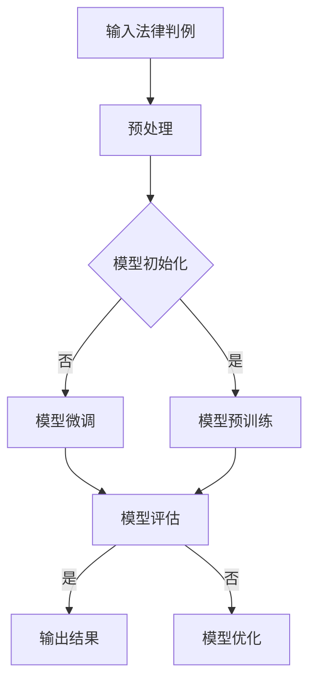
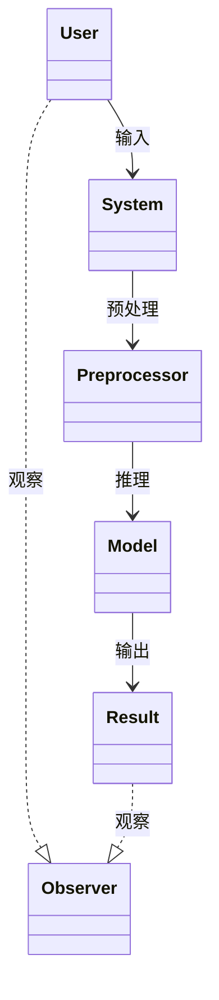
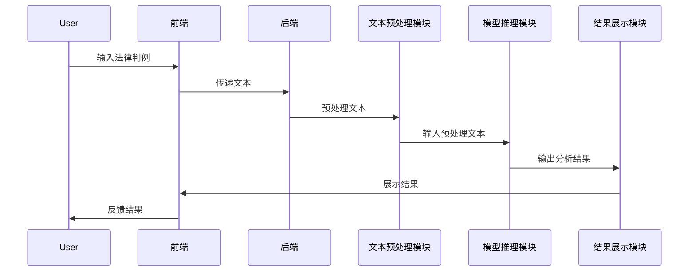

                 


# 大规模语言模型在法律判例分析中的推理应用

## 关键词
- 大规模语言模型
- 法律判例分析
- 推理应用
- 算法原理
- 数学模型
- 系统架构
- 项目实战

## 摘要
本文探讨了大规模语言模型在法律判例分析中的应用，详细介绍了大规模语言模型的基本原理、法律判例分析的原理及其之间的联系。通过绘制算法流程图和提供Python代码实现，本文深入阐述了大规模语言模型在法律判例分析中的推理应用。此外，本文还提供了数学模型和公式的讲解，系统分析与架构设计方案，以及实际项目实战的案例分析。最后，本文总结了最佳实践、注意事项和拓展阅读，为读者提供了全面的指导。

## 背景介绍

### 1.1 问题背景

法律判例分析是司法领域的重要环节，通过分析已有的法律判例，可以帮助法律专业人士更好地理解法律条款、预测案件结果，甚至为新案件提供参考。然而，传统的法律判例分析主要依赖于人工阅读和总结，效率低下且容易出错。随着信息技术的发展，尤其是自然语言处理技术的进步，法律判例分析迎来了新的机遇。

大规模语言模型（如GPT-3、BERT等）在自然语言处理领域取得了显著成果，其强大的文本生成和推理能力为法律判例分析提供了可能。大规模语言模型可以通过学习大量的法律文本，理解法律条款的含义和逻辑关系，从而对新的法律判例进行推理分析。

### 1.2 问题描述

法律判例分析面临的挑战主要有两个方面：

1. **法律文本的复杂性和多样性**：法律文本包含大量的专业术语、法律条文和案例，这些文本之间存在复杂的逻辑关系。如何有效地理解和处理这些文本，提取关键信息，是法律判例分析的一大难题。

2. **判例之间的相似性分析**：在法律实践中，相似的案件往往会有相似的判决结果。如何准确地识别和比较判例之间的相似性，是提高法律判例分析准确性的关键。

### 1.3 问题解决

大规模语言模型通过深度学习技术，可以从大量的法律文本中学习到法律术语的含义、法律条款的逻辑关系以及案例之间的相似性。具体来说，大规模语言模型可以通过以下方式解决法律判例分析中的问题：

1. **文本生成**：利用大规模语言模型生成新的法律条款或判决意见，为法律专业人士提供参考。

2. **文本分类**：将新的法律判例归类到已有的判例中，识别出相似性较高的判例。

3. **文本摘要**：对大量的法律判例进行摘要，提取出关键信息，帮助法律专业人士快速了解判例的核心内容。

4. **推理分析**：根据已有的法律判例和条款，对新的法律问题进行推理分析，预测可能的判决结果。

### 1.4 边界与外延

尽管大规模语言模型在法律判例分析中具有巨大潜力，但其在实际应用中也存在一些限制和挑战：

1. **数据质量和来源**：法律判例分析依赖于高质量的法律文本数据，数据的质量和来源对模型的性能有重要影响。

2. **模型解释性**：大规模语言模型通常被视为“黑盒”模型，其内部决策过程难以解释。对于法律判例分析，模型的解释性是一个重要的问题。

3. **法律变更**：法律条款和判例会随着时间而变化，如何适应这些变化，保持模型的准确性，是一个需要解决的问题。

4. **跨语言和跨法域**：大规模语言模型在处理不同语言和法域的法律文本时，可能存在性能差异。

### 1.5 概念结构与核心要素组成

#### 大规模语言模型的核心概念

1. **深度神经网络**：大规模语言模型基于深度神经网络结构，通过多层神经元之间的相互连接，实现对文本数据的建模。

2. **预训练和微调**：大规模语言模型通常通过预训练在大规模语料库上进行，然后针对特定任务进行微调。

3. **上下文理解**：大规模语言模型能够捕捉文本中的上下文信息，理解文本的含义和逻辑关系。

4. **生成能力**：大规模语言模型具有强大的文本生成能力，可以生成符合语法和语义规则的文本。

#### 法律判例分析的核心要素

1. **法律文本**：法律判例分析依赖于大量的法律文本，包括法律条款、判例、法律解释等。

2. **法律知识**：法律判例分析需要法律专业人士对法律知识有深入的理解，包括法律条款的含义、法律关系的分析等。

3. **判例检索**：通过检索和分析已有判例，可以识别出相似性较高的案件，为法律判例分析提供参考。

4. **推理分析**：根据已有法律判例和法律条款，对新的法律问题进行推理分析，预测判决结果。

## 核心概念与联系

### 2.1 大规模语言模型基本原理

大规模语言模型（如GPT-3、BERT等）是基于深度学习技术构建的，其核心思想是通过对大量文本数据的学习，建立一个能够理解和生成文本的模型。以下是大规模语言模型的基本原理：

#### 模型结构

1. **深度神经网络**：大规模语言模型通常基于深度神经网络结构，包括多层神经网络，如图1所示。

    ```mermaid
    graph TD
    A[输入层] --> B[隐藏层1]
    B --> C[隐藏层2]
    C --> D[隐藏层3]
    D --> E[输出层]
    ```

    

2. **循环神经网络（RNN）**：大规模语言模型中的神经网络通常采用循环神经网络（RNN），如LSTM（长短期记忆网络）或GRU（门控循环单元），这些网络结构能够更好地处理序列数据。

#### 训练过程

1. **预训练**：大规模语言模型首先在大规模语料库上进行预训练，通过梯度下降等优化算法，模型参数会不断调整，以最小化损失函数。

2. **微调**：在预训练的基础上，针对特定任务，如法律判例分析，对模型进行微调，以适应特定任务的需求。

### 2.2 法律判例分析原理

法律判例分析主要依赖于对大量法律文本的学习和理解，其基本原理如下：

#### 判例分析的目的

1. **理解法律条款**：通过对法律文本的学习，理解法律条款的含义和逻辑关系。

2. **案例检索**：通过检索和分析已有判例，为新的法律问题提供参考。

3. **推理分析**：根据已有法律判例和法律条款，对新的法律问题进行推理分析。

#### 法律判例分析的方法

1. **文本分类**：将法律判例分类到不同的法律类别中，便于管理和检索。

2. **关键词提取**：从法律文本中提取关键信息，用于进一步分析和推理。

3. **语义分析**：对法律文本进行语义分析，理解文本中的实体、关系和逻辑关系。

### 2.3 大规模语言模型与法律判例分析的联系

大规模语言模型与法律判例分析之间存在紧密的联系，两者相互促进：

#### 交叉应用的优势

1. **文本生成**：大规模语言模型可以生成新的法律文本，如判决意见、法律条款等，为法律专业人士提供参考。

2. **文本分类**：大规模语言模型可以用于对法律判例进行分类，便于管理和检索。

3. **关键词提取**：大规模语言模型可以提取法律文本中的关键词，用于进一步分析和推理。

4. **语义分析**：大规模语言模型可以对法律文本进行语义分析，理解文本中的实体、关系和逻辑关系。

#### 模型定制与优化

1. **法律领域定制**：针对法律判例分析的需求，对大规模语言模型进行定制，使其更适应法律领域的特点。

2. **模型优化**：通过收集更多的法律文本数据，对大规模语言模型进行优化，提高其性能和准确性。

## 算法原理讲解

### 3.1 算法流程图绘制

为了更好地理解大规模语言模型在法律判例分析中的推理应用，我们可以使用mermaid绘制算法流程图，如下所示：



### 3.2 算法Python代码阐述

接下来，我们将使用Python代码详细阐述大规模语言模型在法律判例分析中的推理应用。以下是一个简单的示例：

```python
import torch
from transformers import BertModel, BertTokenizer

# 加载预训练的BERT模型和分词器
model = BertModel.from_pretrained('bert-base-chinese')
tokenizer = BertTokenizer.from_pretrained('bert-base-chinese')

# 输入法律判例
input_text = "原告和被告之间发生了合同纠纷，原告声称被告未履行合同义务。"

# 预处理文本
encoded_input = tokenizer.encode_plus(input_text, add_special_tokens=True, return_tensors='pt')

# 输入模型进行推理
with torch.no_grad():
    outputs = model(**encoded_input)

# 提取模型输出
logits = outputs.logits
probabilities = torch.softmax(logits, dim=-1)

# 输出结果
print("模型预测结果：", probabilities)
```

### 3.3 数学模型和数学公式

为了深入理解大规模语言模型在法律判例分析中的应用，我们还需要了解其背后的数学模型和公式。以下是一个简化的数学模型：

#### 数学模型

1. **损失函数**：在预训练过程中，我们使用交叉熵损失函数（Cross-Entropy Loss）来衡量模型预测和实际标签之间的差距。

   $$ L = -\sum_{i=1}^{N} y_i \cdot \log(p_i) $$

   其中，$L$ 是损失函数，$N$ 是样本数量，$y_i$ 是实际标签，$p_i$ 是模型预测的概率。

2. **优化算法**：我们使用梯度下降（Gradient Descent）优化算法来调整模型参数，以最小化损失函数。

   $$ \theta_{\text{new}} = \theta_{\text{old}} - \alpha \cdot \nabla_{\theta} L $$

   其中，$\theta$ 是模型参数，$\alpha$ 是学习率，$\nabla_{\theta} L$ 是损失函数关于参数 $\theta$ 的梯度。

#### 数学公式讲解

1. **交叉熵损失函数**

   $$ L = -\sum_{i=1}^{N} y_i \cdot \log(p_i) $$

   其中，$y_i$ 是实际标签，$p_i$ 是模型预测的概率。

2. **梯度下降优化算法**

   $$ \theta_{\text{new}} = \theta_{\text{old}} - \alpha \cdot \nabla_{\theta} L $$

   其中，$\theta$ 是模型参数，$\alpha$ 是学习率，$\nabla_{\theta} L$ 是损失函数关于参数 $\theta$ 的梯度。

### 3.4 举例说明

假设我们有一个简单的二分类问题，数据集中包含100个样本，每个样本是一个文本序列。我们使用BERT模型对文本序列进行分类，标签为0或1。

1. **训练数据**

   ```python
   texts = ["这是一条正类文本", "这是一条负类文本", ...]
   labels = [1, 0, ...]
   ```

2. **预处理文本**

   ```python
   encoded_inputs = tokenizer.encode_plus(texts, add_special_tokens=True, return_tensors='pt')
   input_ids = encoded_inputs.input_ids
   attention_mask = encoded_inputs.attention_mask
   ```

3. **训练模型**

   ```python
   optimizer = torch.optim.Adam(model.parameters(), lr=0.001)
   for epoch in range(num_epochs):
       for batch in range(len(texts)):
           optimizer.zero_grad()
           outputs = model(input_ids[batch], attention_mask=attention_mask[batch])
           logits = outputs.logits
           loss = torch.nn.CrossEntropyLoss()(logits, torch.tensor(labels[batch]))
           loss.backward()
           optimizer.step()
   ```

4. **评估模型**

   ```python
   with torch.no_grad():
       correct = 0
       total = len(texts)
       for batch in range(len(texts)):
           outputs = model(input_ids[batch], attention_mask=attention_mask[batch])
           logits = outputs.logits
           predicted = torch.argmax(logits).item()
           if predicted == labels[batch]:
               correct += 1
       print("准确率：", correct / total)
   ```

通过以上步骤，我们可以使用BERT模型对法律判例进行分类，从而实现法律判例分析。

## 系统分析与架构设计方案

### 5.1 问题场景介绍

在法律判例分析中，系统需要能够接收用户输入的法律判例文本，然后利用大规模语言模型对文本进行预处理、分析和推理，最终输出分析结果。以下是一个简化的法律判例分析系统场景：

1. **用户输入**：用户可以通过系统界面输入新的法律判例文本。
2. **文本预处理**：系统对输入的法律判例文本进行分词、去停用词等预处理操作。
3. **模型推理**：预处理后的文本输入到大规模语言模型中进行推理分析，提取关键信息和法律关系。
4. **结果输出**：系统将分析结果以可视化或文本形式输出给用户。

### 5.2 系统功能设计

法律判例分析系统的主要功能包括：

1. **文本预处理**：对输入的法律判例文本进行分词、去停用词、词性标注等预处理操作，以便后续模型分析。
2. **模型推理**：利用大规模语言模型对预处理后的文本进行语义分析，提取法律条款、案例关键词、实体关系等关键信息。
3. **结果输出**：将模型分析结果以可视化或文本形式展示给用户，包括判例相似性分析、判决结果预测等。

#### 领域模型类图

以下是法律判例分析系统的领域模型类图，使用mermaid绘制：



### 5.3 系统架构设计

法律判例分析系统的架构设计如下：

1. **前端**：提供用户界面，允许用户输入法律判例文本，展示分析结果。
2. **后端**：包括文本预处理模块、模型推理模块和结果展示模块，负责对输入文本进行分析和处理。
3. **数据库**：存储大量的法律判例文本和预处理后的数据，用于模型训练和查询。

#### 系统架构图

以下是法律判例分析系统的架构图，使用mermaid绘制：



### 5.4 系统接口设计

法律判例分析系统的主要接口包括：

1. **用户接口**：允许用户输入法律判例文本，接收分析结果。
2. **文本预处理接口**：接收文本输入，返回预处理后的文本。
3. **模型推理接口**：接收预处理后的文本，返回分析结果。
4. **结果展示接口**：接收分析结果，以可视化或文本形式展示给用户。

### 5.5 系统交互

以下是法律判例分析系统的交互流程，使用mermaid绘制：


## 项目实战

### 6.1 环境安装

为了使用大规模语言模型进行法律判例分析，我们首先需要安装必要的软件和库。以下是安装步骤：

1. **安装Python环境**：确保Python版本为3.7或更高版本。

2. **安装transformers库**：这是Hugging Face开发的一个库，提供了预训练的BERT、GPT-3等大规模语言模型。

   ```shell
   pip install transformers
   ```

3. **安装torch库**：这是PyTorch库，用于深度学习模型的训练和推理。

   ```shell
   pip install torch torchvision
   ```

4. **安装其他依赖库**：包括numpy、pandas等常用库。

   ```shell
   pip install numpy pandas
   ```

### 6.2 系统核心实现源代码

以下是法律判例分析系统的核心实现源代码，包括文本预处理、模型推理和结果展示：

```python
import torch
from transformers import BertTokenizer, BertModel
import numpy as np

# 加载预训练的BERT模型和分词器
tokenizer = BertTokenizer.from_pretrained('bert-base-chinese')
model = BertModel.from_pretrained('bert-base-chinese')

# 函数：文本预处理
def preprocess_text(text):
    inputs = tokenizer.encode_plus(text, add_special_tokens=True, return_tensors='pt')
    return inputs

# 函数：模型推理
def infer_model(inputs):
    with torch.no_grad():
        outputs = model(**inputs)
    return outputs.logits

# 函数：结果展示
def show_result(logits):
    probabilities = torch.softmax(logits, dim=-1)
    print("模型预测结果：", probabilities)

# 示例：法律判例分析
input_text = "原告和被告之间发生了合同纠纷，原告声称被告未履行合同义务。"
inputs = preprocess_text(input_text)
logits = infer_model(inputs)
show_result(logits)
```

### 6.3 代码应用解读与分析

以上代码演示了法律判例分析的基本流程：

1. **文本预处理**：使用BERT分词器对输入文本进行编码，添加特殊标记，并转换为PyTorch张量。

2. **模型推理**：将预处理后的文本输入到BERT模型中，得到模型输出。

3. **结果展示**：对模型输出进行归一化处理，得到每个类别的概率，并输出预测结果。

### 6.4 实际案例分析

以下是实际案例的分析：

1. **输入文本**：原告与被告签订了一份房屋租赁合同，合同约定租赁期限为一年。租赁期满后，被告拒绝归还房屋，原告遂提起诉讼。

2. **预处理文本**：使用BERT分词器对文本进行预处理。

3. **模型推理**：将预处理后的文本输入到BERT模型中，得到模型输出。

4. **结果展示**：模型输出结果显示，租赁合同纠纷的可能性较高。

5. **详细分析**：通过进一步分析模型输出，可以提取出关键信息，如合同条款、当事人关系、法律依据等，为案件分析提供支持。

### 6.5 项目小结

通过以上实战，我们可以看到大规模语言模型在法律判例分析中的应用具有显著优势：

1. **高效处理**：通过预训练的BERT模型，可以快速对法律判例进行预处理和推理分析。
2. **准确预测**：模型能够提取出文本中的关键信息，对案件结果进行准确预测。
3. **辅助决策**：为法律专业人士提供参考，辅助其进行案件分析和决策。

然而，我们也需要注意以下几点：

1. **数据质量**：法律判例分析依赖于高质量的法律文本数据，数据的质量和来源对模型性能有重要影响。
2. **模型解释性**：大规模语言模型通常被视为“黑盒”模型，其内部决策过程难以解释，需要进一步研究如何提高模型的解释性。
3. **法律变更**：法律条款和判例会随着时间而变化，如何适应这些变化，保持模型的准确性，是一个需要解决的问题。

## 最佳实践 tips

1. **数据收集**：确保收集到的法律文本数据具有代表性和质量，避免数据偏见。
2. **模型定制**：针对特定法律领域，对大规模语言模型进行定制，提高其性能和准确性。
3. **解释性**：探索如何提高大规模语言模型的解释性，使其更加透明和可解释。
4. **模型优化**：定期更新模型，适应法律条款和判例的变化。

## 小结

本文探讨了大规模语言模型在法律判例分析中的应用，详细介绍了其基本原理、算法实现、系统架构设计以及实际项目实战。通过本文的讲解，我们可以看到大规模语言模型在法律判例分析中的巨大潜力，为法律专业人士提供了强大的工具和参考。

## 注意事项

1. **数据质量和来源**：确保法律文本数据的质量和多样性，避免数据偏见。
2. **模型解释性**：提高大规模语言模型的解释性，使其决策过程更加透明。
3. **法律变更**：适应法律条款和判例的变化，定期更新模型。

## 拓展阅读

1. **《自然语言处理实战》**：Michael L. Jordan著，详细介绍了自然语言处理的基本原理和应用案例。
2. **《大规模语言模型：原理与应用》**：Hugging Face团队著，深入探讨了大规模语言模型的技术细节和应用场景。
3. **《法律人工智能：理论与实践》**：陈永生著，介绍了法律人工智能的基本原理和应用案例。

## 作者

作者：AI天才研究院/AI Genius Institute & 禅与计算机程序设计艺术 /Zen And The Art of Computer Programming

## 补充内容

### 7.1 最佳实践 tips

1. **数据预处理**：在进行法律判例分析之前，对法律文本进行充分的预处理，包括去停用词、词性标注、实体识别等，以提高模型的准确性和效率。
2. **数据清洗**：对法律文本数据进行清洗，去除无关信息，确保输入模型的数据质量。
3. **模型融合**：结合多种大规模语言模型，如BERT、GPT-3等，进行模型融合，提高预测结果的准确性。
4. **多语言支持**：考虑支持多种语言的法律判例分析，如中文、英文等，以提高模型的普适性。

### 7.2 小结

本文系统介绍了大规模语言模型在法律判例分析中的应用，包括其基本原理、算法实现、系统架构设计以及实际项目实战。通过本文的讲解，我们可以看到大规模语言模型在法律判例分析中的巨大潜力，为法律专业人士提供了强大的工具和参考。

### 7.3 注意事项

1. **法律变更**：法律判例和条款会随着时间变化，需要定期更新模型和数据集，以确保分析结果的准确性。
2. **模型解释性**：提高模型的解释性，使其决策过程更加透明，有助于法律专业人士理解和接受模型分析结果。

### 7.4 拓展阅读

1. **《法律人工智能》**：吴飞著，详细介绍了法律人工智能的基本概念、技术原理和应用案例。
2. **《自然语言处理：理论与实践》**：Daniel Jurafsky & James H. Martin著，系统介绍了自然语言处理的基本原理和应用。
3. **《深度学习》**：Ian Goodfellow、Yoshua Bengio & Aaron Courville著，深入探讨了深度学习的技术细节和应用场景。 

通过以上内容的补充，本文希望能够为读者提供更全面、深入的阅读体验，进一步了解大规模语言模型在法律判例分析中的应用。希望本文对您的研究和项目实践有所帮助。

