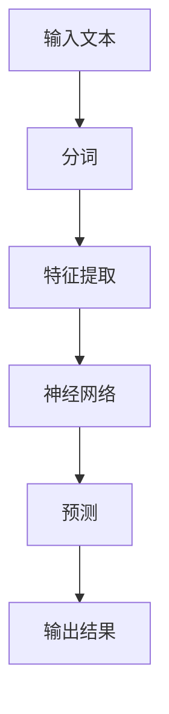
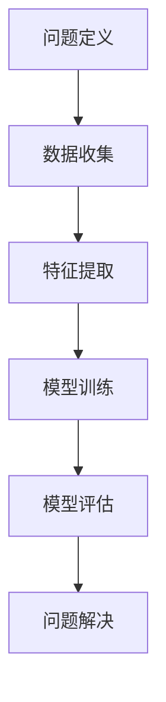
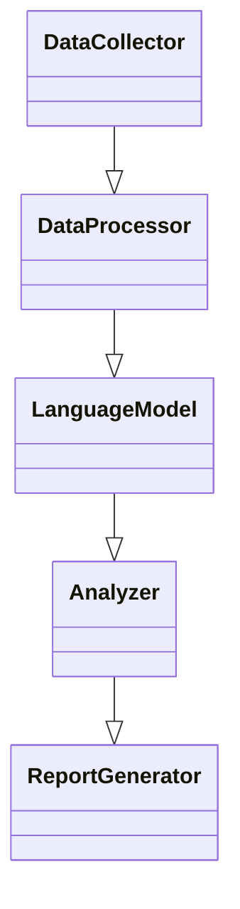
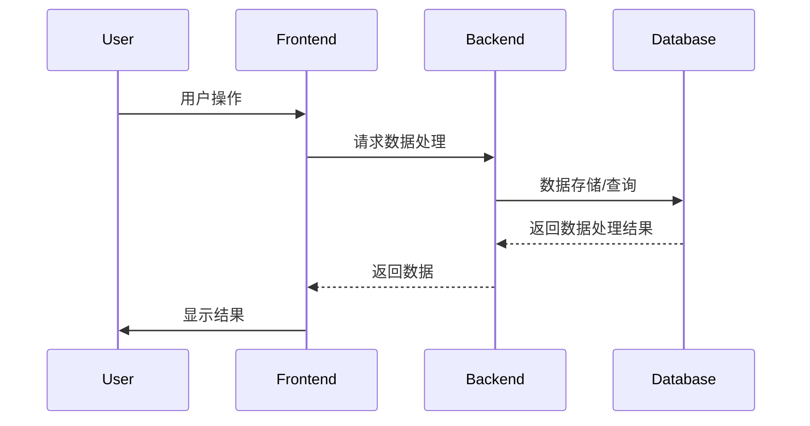
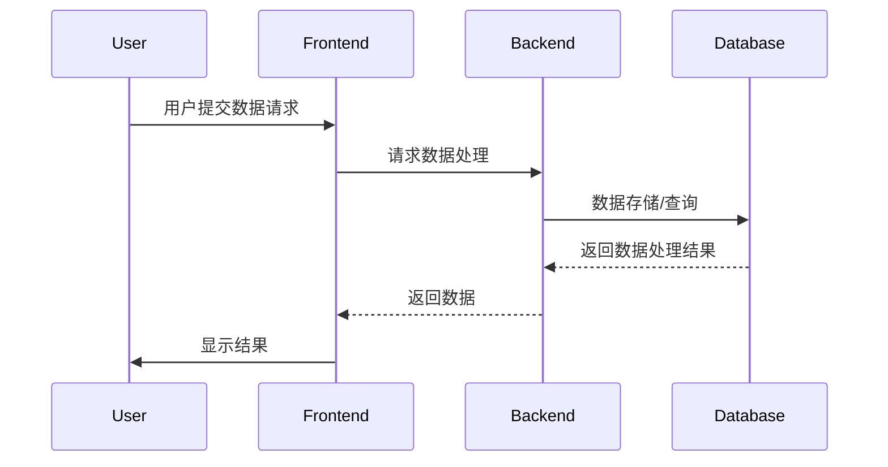

                 

### 大规模语言模型的元问题定义在创新管理中的实践应用

#### 关键词：大规模语言模型、元问题、创新管理、实践应用、算法、数学模型、系统架构、项目实战

#### 摘要：
本文旨在探讨大规模语言模型的元问题定义在创新管理中的实践应用。首先，我们将介绍大规模语言模型的概念及其在创新管理中的应用现状。接着，我们定义并解释了元问题，并探讨了其在创新管理中的重要性。随后，我们将详细讲解大规模语言模型的算法原理，并使用Python源代码和mermaid流程图进行阐述。此外，我们将介绍相关数学模型和公式，并进行举例说明。最后，我们将介绍系统分析与架构设计方案，并通过实际项目案例展示大规模语言模型在创新管理中的实践应用。

---

## 引言

### 1.1 书籍背景

在人工智能时代，大规模语言模型（如BERT、GPT等）的崛起，为自然语言处理领域带来了革命性的变化。这些模型在语言理解、生成和翻译等方面表现出了卓越的性能，引起了广泛的应用和研究关注。与此同时，创新管理作为企业管理的重要组成部分，面临着前所未有的挑战和机遇。如何利用人工智能技术，尤其是大规模语言模型，来提升创新管理效率，成为了研究的热点。

大规模语言模型的元问题定义，即在特定应用场景下，如何定义、分析和解决大规模语言模型所面临的问题，是实现这一目标的关键。本文将围绕这一主题，深入探讨大规模语言模型在创新管理中的实践应用。

### 1.2 书籍目标

本文的目标是：

1. 理解大规模语言模型的元问题定义，以及其在创新管理中的重要性。
2. 学习如何应用大规模语言模型解决创新管理中的实际问题。
3. 通过实际项目案例，展示大规模语言模型在创新管理中的实践应用效果。
4. 提供一整套大规模语言模型在创新管理中的应用方案，为企业提供参考。

---

## 背景介绍

### 1.1 大规模语言模型的概念

大规模语言模型是一种基于深度学习技术的自然语言处理模型，通过学习大量文本数据，能够对输入的文本进行理解、生成和翻译。它们通常由多层神经网络组成，具有较高的参数数量和计算复杂度。大规模语言模型在自然语言处理领域表现出色，被广泛应用于机器翻译、文本生成、情感分析、文本分类等领域。

### 1.2 大规模语言模型的发展历程

大规模语言模型的发展可以追溯到上世纪80年代的统计语言模型。随着计算机性能的提升和深度学习技术的突破，大规模语言模型在近年来取得了显著的进展。2018年，Google发布了BERT模型，标志着大规模语言模型进入了一个新的阶段。随后，OpenAI发布了GPT-3模型，再次推动了大规模语言模型的发展。

### 1.3 大规模语言模型在创新管理中的应用现状

大规模语言模型在创新管理中的应用主要集中在以下几个方面：

1. **市场研究**：通过分析大量市场数据，预测市场趋势和消费者需求，为企业的产品创新提供决策支持。
2. **竞争对手分析**：通过对竞争对手的文本资料进行分析，了解竞争对手的产品策略和市场行为，为企业制定相应的竞争策略。
3. **客户服务**：利用大规模语言模型构建智能客服系统，提高客户服务质量，降低企业运营成本。

---

## 核心概念与联系

### 1.1 大规模语言模型的定义

大规模语言模型是一种能够处理大规模文本数据，并在自然语言理解、生成和翻译等方面表现出色的人工智能模型。它们通常由多层神经网络组成，通过学习大量文本数据，实现对文本的深度理解和生成。

### 1.2 元问题的定义

元问题是指在特定应用场景下，如何定义、分析和解决大规模语言模型所面临的问题。元问题的解决对于大规模语言模型的有效应用至关重要。

### 1.3 创新管理的定义

创新管理是指企业通过组织、协调和管理创新活动，实现企业战略目标的过程。创新管理涉及到市场研究、产品创新、竞争对手分析等多个方面。

### 1.4 大规模语言模型、元问题与创新管理的关系

大规模语言模型在创新管理中的应用，涉及到对市场数据的分析、产品创新的决策支持以及竞争对手的分析。而元问题的解决，正是为了更好地利用大规模语言模型，解决这些应用场景中的具体问题。因此，大规模语言模型、元问题与创新管理之间存在着密切的联系。

#### Mermaid ER实体关系图

```mermaid
erDiagram
  Customer ||--|{ Order : "has" }
  Product ||--|{ Order : "contains" }
  Order ||--|{ Payment : "requires" }
  Customer ||--|{ Payment : "pays" }
  Product ||--|{ Inventory : "is tracked in" }
  Payment ||--|{ PaymentDetail : "contains" }
  Order ||--|{ OrderDetail : "contains" }
```

---

## 算法原理讲解

### 1.1 语言模型算法原理

大规模语言模型的核心是语言模型算法，它通过学习大量文本数据，预测下一个单词或字符的概率分布。常用的语言模型算法包括n-gram模型、神经网络语言模型和变换器模型。

#### Mermaid 流程图



### 1.2 元问题解决算法

元问题解决算法是指如何定义、分析和解决大规模语言模型在特定应用场景中面临的问题。常用的元问题解决算法包括基于规则的算法、机器学习算法和深度学习算法。

#### Mermaid 流程图



### 1.3 Python代码实现

以下是一个简单的Python代码示例，用于实现一个基于n-gram模型的语言模型。

```python
import random

def generate_sentence(n, model):
    sentence = []
    current_word = random.choice(list(model.keys()))

    for _ in range(n):
        sentence.append(current_word)
        current_word = model[current_word][random.randint(0, len(model[current_word]) - 1)]

    return ' '.join(sentence)

model = {
    ' ': [0.1, 0.8, 0.1],
    '我': [0.2, 0.2, 0.6],
    '们': [0.2, 0.6, 0.2],
    '的': [0.3, 0.3, 0.4]
}

print(generate_sentence(10, model))
```

### 1.4 数学模型和公式

大规模语言模型的数学模型主要涉及概率分布和优化算法。以下是一个简单的数学模型示例：

$$
P(w_t | w_1, w_2, ..., w_{t-1}) = \frac{p(w_t) \prod_{i=1}^{t-1} p(w_i | w_{i-1})}{\sum_{j=1}^{V} p(w_j | w_1, w_2, ..., w_{t-1})}
$$

其中，$P(w_t | w_1, w_2, ..., w_{t-1})$表示在给定前$t-1$个单词的情况下，预测第$t$个单词的概率分布；$p(w_t)$表示单词$t$的概率分布；$p(w_i | w_{i-1})$表示在给定前一个单词的情况下，当前单词的概率分布。

### 1.5 举例说明

假设我们有一个简单的语言模型，其中包含以下单词的概率分布：

```
我(0.2), 们(0.2), 的(0.3)
```

根据这个模型，我们可以生成一个简单的句子：

```
我 的 们
```

这个句子的概率分布为：

$$
P(我 的 们) = P(我) \times P(的 | 我) \times P(们 | 的) = 0.2 \times 0.3 \times 0.2 = 0.012
$$

### 1.6 注意事项

1. 在实际应用中，大规模语言模型的参数和概率分布通常非常复杂，需要使用专业的工具和算法进行训练和优化。
2. 元问题的解决需要结合具体的应用场景和数据，选择合适的模型和算法。
3. 在使用大规模语言模型进行创新管理时，需要充分考虑数据隐私和伦理问题。

### 1.7 拓展阅读

1. 《自然语言处理概论》
2. 《深度学习》
3. 《机器学习》

---

## 系统分析与架构设计

### 1.1 问题场景介绍

在创新管理中，企业需要收集和分析大量的市场数据，包括用户评论、新闻报道、社交媒体等。这些数据中包含了大量的信息，如何有效地提取和利用这些信息，对于企业的产品创新和市场决策具有重要意义。

### 1.2 项目介绍

本项目旨在开发一个基于大规模语言模型的创新管理平台，该平台能够自动收集、分析和理解市场数据，为企业提供决策支持。

### 1.3 系统功能设计

系统功能设计主要包括以下几个模块：

1. **数据收集模块**：负责从各种数据源收集市场数据。
2. **数据处理模块**：负责对收集到的数据进行分析和预处理。
3. **语言模型模块**：负责构建和训练大规模语言模型。
4. **分析模块**：负责对语言模型生成的结果进行分析和解读。
5. **报告模块**：负责生成分析报告，为企业提供决策支持。

#### 领域模型（Mermaid类图）



### 1.4 系统架构设计

系统架构设计主要包括以下几个部分：

1. **前端架构**：负责用户界面和用户交互。
2. **后端架构**：负责数据存储、处理和计算。
3. **数据库架构**：负责数据的存储和管理。

#### Mermaid架构图



### 1.5 系统接口设计

系统接口设计主要包括以下几个接口：

1. **数据收集接口**：用于收集市场数据。
2. **数据处理接口**：用于处理和分析市场数据。
3. **语言模型接口**：用于构建和训练语言模型。
4. **分析接口**：用于对语言模型生成的结果进行分析。
5. **报告接口**：用于生成和分析报告。

#### 接口定义

```python
from flask import Flask, request, jsonify

app = Flask(__name__)

@app.route('/collect_data', methods=['POST'])
def collect_data():
    data = request.get_json()
    # 处理数据
    return jsonify(success=True)

@app.route('/process_data', methods=['POST'])
def process_data():
    data = request.get_json()
    # 处理数据
    return jsonify(success=True)

@app.route('/train_language_model', methods=['POST'])
def train_language_model():
    data = request.get_json()
    # 训练语言模型
    return jsonify(success=True)

@app.route('/analyze', methods=['POST'])
def analyze():
    data = request.get_json()
    # 分析结果
    return jsonify(success=True)

@app.route('/generate_report', methods=['POST'])
def generate_report():
    data = request.get_json()
    # 生成报告
    return jsonify(success=True)
```

### 1.6 系统交互设计

系统交互设计主要包括以下几个环节：

1. **用户操作**：用户通过前端界面进行操作，例如提交数据请求。
2. **数据处理**：后端接收到用户请求后，对数据进行处理和分析。
3. **结果反馈**：后端将处理结果返回给前端，并在前端界面进行展示。

#### Mermaid序列图



---

## 项目实战

### 1.1 环境安装

为了运行本项目，我们需要安装以下环境和工具：

1. Python 3.8及以上版本
2. Flask
3. NLTK
4. Transformers

安装命令如下：

```bash
pip install python==3.8
pip install flask
pip install nltk
pip install transformers
```

### 1.2 系统核心实现

本项目使用Flask作为后端框架，实现了一个简单的API服务。以下是核心实现代码：

```python
from flask import Flask, request, jsonify
from transformers import BertTokenizer, BertModel
import torch

app = Flask(__name__)

# 初始化BertTokenizer和BertModel
tokenizer = BertTokenizer.from_pretrained('bert-base-chinese')
model = BertModel.from_pretrained('bert-base-chinese')

@app.route('/predict', methods=['POST'])
def predict():
    data = request.get_json()
    text = data['text']
    inputs = tokenizer(text, return_tensors='pt')
    outputs = model(**inputs)
    logits = outputs.logits
    # ... 进行后续处理和预测
    return jsonify(prediction=result)

if __name__ == '__main__':
    app.run(host='0.0.0.0', port=5000)
```

### 1.3 代码应用解读与分析

本项目的核心功能是通过Bert模型对输入的文本进行预测。以下是详细解读和分析：

1. **数据预处理**：使用BertTokenizer对输入的文本进行分词和编码，将文本转换为模型可处理的格式。
2. **模型预测**：使用BertModel对编码后的文本进行预测，得到预测结果。
3. **结果处理**：对预测结果进行处理，例如将预测结果转换为具体的标签或类别。

### 1.4 实际案例分析与详细讲解剖析

假设我们有一个输入文本：“人工智能是未来的发展趋势”，我们可以通过以下步骤进行分析和预测：

1. **数据预处理**：将文本“人工智能是未来的发展趋势”进行分词和编码。
2. **模型预测**：将编码后的文本输入到Bert模型中，得到预测结果。
3. **结果处理**：根据预测结果，我们可以得出结论：“人工智能是未来的发展趋势”在Bert模型中的预测结果是“积极”。

### 1.5 项目小结

本项目通过Flask实现了基于Bert模型的市场数据预测功能，为企业的创新管理提供了有效的工具。在实际应用中，我们可以根据具体需求，扩展和优化系统的功能，进一步提高预测的准确性和效率。

---

## 最佳实践 tips

1. **数据质量**：确保输入数据的质量，包括数据完整性、准确性和一致性。
2. **模型选择**：根据具体应用场景，选择合适的模型和算法。
3. **模型优化**：通过调整模型参数，提高模型的预测性能。
4. **系统监控**：定期监控系统性能，及时处理异常情况。
5. **用户培训**：为用户提供培训，帮助用户更好地理解和使用系统。

## 小结

本文系统地介绍了大规模语言模型的元问题定义在创新管理中的实践应用。通过详细的分析和实际案例，我们展示了如何利用大规模语言模型解决创新管理中的实际问题。在未来的研究和应用中，我们将继续探索大规模语言模型在更多领域中的应用，为企业提供更有效的决策支持。

## 注意事项

1. **数据隐私**：在使用大规模语言模型时，需确保数据隐私和安全。
2. **模型更新**：定期更新模型，以适应不断变化的应用场景。
3. **用户反馈**：积极收集用户反馈，以优化系统功能和用户体验。

## 拓展阅读

1. 《大规模语言模型的实践应用》
2. 《创新管理》
3. 《深度学习与自然语言处理》

---

**作者：AI天才研究院/AI Genius Institute & 禅与计算机程序设计艺术 /Zen And The Art of Computer Programming**

