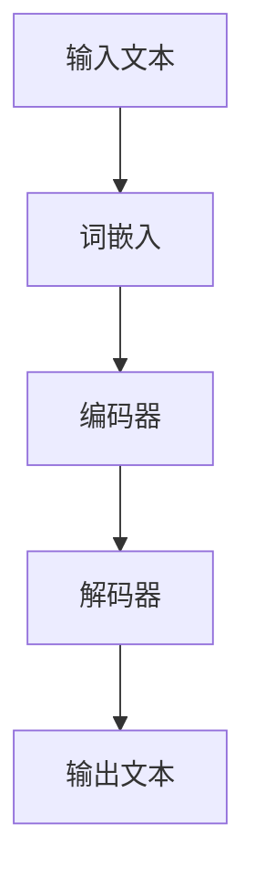
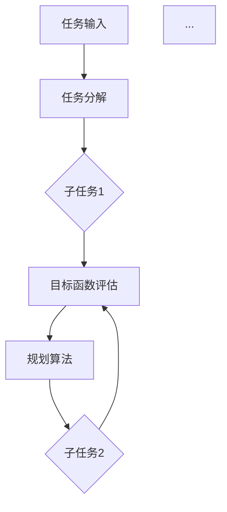

                 

## 引言

### 问题背景

随着人类对太空探索的日益深入，太空探索任务面临越来越多的复杂性和不确定性。从早期的简单轨道飞行到如今的深空探测，太空任务的需求逐渐复杂化，需要解决的任务类型也越来越多。例如，火星探测任务需要综合考虑导航、通信、能源供应、环境监测等多个方面；太空站维护任务则要求具备高效的资源管理和任务调度能力。

在这些复杂的任务中，多步骤规划和决策成为关键。传统的太空任务规划通常采用预先设定的规则和算法，但这种方法在面对高度动态和复杂的环境时表现不佳。近年来，随着人工智能技术的发展，尤其是大规模语言模型的兴起，为解决这些复杂问题提供了新的思路。

大规模语言模型，如GPT-3，拥有强大的语言理解和生成能力。它们能够处理大量的文本数据，从中提取有用的信息，进行复杂的推理和生成。这种能力在太空探索任务中的应用前景广阔，可以为任务规划提供更加灵活和智能的解决方案。

### 问题描述

在太空探索任务中，多步骤规划是一个核心问题。这意味着任务需要分解为多个阶段，每个阶段都有其特定的目标和任务。例如，在火星探测任务中，首先需要进行轨道转移，然后是着陆，最后是科学探测。每个阶段都需要精确的规划，以确保任务的顺利进行。

大规模语言模型在多步骤规划中的应用，主要是利用其强大的语言处理能力，对任务进行分解、规划和决策。具体来说，它可以通过以下步骤实现：

1. **任务分解**：将复杂的太空任务分解为多个子任务，每个子任务都有明确的目标和约束。
2. **规划生成**：根据子任务的目标和约束，生成具体的执行计划。
3. **决策支持**：在任务执行过程中，根据实时数据和新的约束条件，进行动态调整和优化。

### 问题解决

本书的目标是探讨如何利用大规模语言模型实现多步骤规划，以解决太空探索任务中的复杂问题。我们将从以下几个方面展开研究：

1. **大规模语言模型基础**：介绍大规模语言模型的基本原理，包括其工作流程、数学模型和关键技术。
2. **多步骤规划理论**：探讨多步骤规划的基本理论，包括规划的目标、约束和算法。
3. **大规模语言模型与太空探索任务的结合**：研究如何将大规模语言模型应用于太空探索任务的多步骤规划中，包括具体的实现方法和案例。
4. **实际案例研究**：通过具体的应用案例，展示大规模语言模型在太空探索任务中的应用效果和优势。

### 问题边界与外延

在本书的研究中，我们重点关注以下类型的太空探索任务：

- **深空探测**：如火星、木星等行星的探测任务。
- **空间站维护**：如国际空间站的维护任务。
- **卫星任务**：如地球观测卫星、通信卫星的维护和操作任务。

这些任务具有高度复杂性和不确定性，需要灵活和智能的规划方法。此外，本书还将探讨以下核心要素：

- **任务分解**：如何将复杂的太空任务分解为多个子任务。
- **规划生成**：如何根据子任务的目标和约束，生成具体的执行计划。
- **决策支持**：如何根据实时数据和新的约束条件，进行动态调整和优化。

### 核心要素组成

大规模语言模型和多步骤规划在太空探索任务中的应用，主要由以下几个核心要素组成：

1. **大规模语言模型**：负责任务分解、规划和决策。
2. **任务分解算法**：将复杂的太空任务分解为多个子任务。
3. **规划算法**：根据子任务的目标和约束，生成具体的执行计划。
4. **决策算法**：根据实时数据和新的约束条件，进行动态调整和优化。

通过这些核心要素的有机结合，我们可以实现高效的太空探索任务规划，提高任务的执行效率和成功率。

## 大规模语言模型基础

### 核心概念与联系

大规模语言模型（Large-scale Language Model）是自然语言处理（Natural Language Processing，NLP）领域的一项重要技术。它通过学习大量的文本数据，能够理解并生成人类语言。这种模型在许多应用领域表现出色，包括机器翻译、文本摘要、对话系统等。

大规模语言模型的核心概念包括：

1. **词嵌入（Word Embedding）**：将单词映射到高维空间中，使得语义相近的单词在空间中彼此接近。
2. **循环神经网络（Recurrent Neural Network，RNN）**：用于处理序列数据，如文本。
3. **Transformer模型**：一种基于自注意力机制的模型，广泛应用于大规模语言模型。
4. **预训练与微调（Pre-training and Fine-tuning）**：首先在大量无标签数据上进行预训练，然后在特定任务上进行微调。

与其他相关技术相比，大规模语言模型具有以下特点：

- **语言理解能力更强**：能够理解文本中的上下文和隐含意义。
- **生成能力强**：能够生成高质量的文本，包括摘要、对话等。
- **泛化能力较好**：通过预训练，能够较好地适应不同的任务和数据集。

### 原理解讲

#### 流程图



#### Python源代码示例

```python
import torch
import torch.nn as nn
import torch.optim as optim
from transformers import GPT2Model, GPT2Tokenizer

# 初始化模型和tokenizer
model = GPT2Model.from_pretrained('gpt2')
tokenizer = GPT2Tokenizer.from_pretrained('gpt2')

# 输入文本
input_text = "Hello, how are you?"

# 编码输入文本
inputs = tokenizer.encode(input_text, return_tensors='pt')

# 通过模型进行预测
outputs = model(inputs)

# 获取输出文本
predicted_ids = torch.argmax(outputs[0], dim=-1)
decoded_output = tokenizer.decode(predicted_ids, skip_special_tokens=True)
```

### 数学模型和数学公式

大规模语言模型通常基于神经网络，其数学模型主要包括以下几个部分：

1. **词嵌入**：将单词映射到高维空间，通常使用嵌入矩阵\[E\]：
   \[
   e_w = E\[w\]
   \]
   其中，\(e_w\)是单词\(w\)的词嵌入向量。

2. **编码器**：使用循环神经网络（RNN）或Transformer模型进行编码，其输入为词嵌入向量，输出为编码后的序列：
   \[
   h_t = f(h_{t-1}, e_w)
   \]
   其中，\(h_t\)是编码后的序列，\(h_{t-1}\)是前一个时刻的编码结果，\(e_w\)是当前词的词嵌入向量，\(f\)是编码函数。

3. **解码器**：同样使用循环神经网络（RNN）或Transformer模型进行解码，其输入为编码后的序列，输出为预测的词嵌入向量：
   \[
   p_w = g(h_t, e_w)
   \]
   其中，\(p_w\)是预测的词嵌入向量，\(h_t\)是编码后的序列，\(e_w\)是当前词的词嵌入向量，\(g\)是解码函数。

4. **损失函数**：通常使用交叉熵损失函数来评估模型预测与真实标签之间的差距：
   \[
   L = -\sum_{w} p_w \log(p_w^*)
   \]
   其中，\(p_w\)是模型预测的词嵌入向量，\(p_w^*\)是真实标签的词嵌入向量。

### 实际案例

#### 案例背景

假设我们有一个对话系统，用户输入了一条信息，模型需要根据上下文生成合适的回复。例如，用户输入：“今天天气怎么样？”模型需要理解这句话的含义，并生成一个合适的回复。

#### 案例实施

1. **数据准备**：我们首先需要准备一个对话数据集，包含用户输入和系统回复的文本。

2. **模型训练**：使用大规模语言模型对对话数据集进行训练，以学习如何根据上下文生成合适的回复。

3. **模型部署**：将训练好的模型部署到服务器上，以便实时处理用户的输入并生成回复。

4. **输入处理**：当用户输入一条消息时，首先对其进行编码，然后输入到模型中进行预测。

5. **输出处理**：模型预测出回复的词嵌入向量，然后对其进行解码，得到最终的回复文本。

#### 案例分析

在这个案例中，大规模语言模型通过学习大量的对话数据，能够理解用户输入的上下文，并生成合适的回复。这不仅提高了对话系统的智能化程度，还大大提升了用户体验。

## 多步骤规划理论

### 核心概念与联系

多步骤规划（Multi-step Planning）是指在一个复杂任务中，将任务分解为多个子任务，并依次解决这些子任务的过程。这种规划方法广泛应用于人工智能领域，特别是在需要解决复杂问题和进行决策的场合，如机器人路径规划、智能交通系统、供应链管理等。

多步骤规划的核心概念包括：

1. **子任务分解**：将复杂任务分解为多个子任务，每个子任务都有明确的目标和约束。
2. **目标函数**：用于评估子任务的完成程度，通常是优化问题。
3. **规划算法**：用于生成子任务的执行计划，常用的算法包括动态规划、遗传算法、A*算法等。
4. **约束条件**：影响子任务执行的限制条件，如资源限制、时间限制等。

与其他相关理论相比，多步骤规划具有以下特点：

- **层次化**：将复杂任务分解为多个层次，每个层次都有其特定的目标和解题方法。
- **动态性**：能够根据实时数据和新的约束条件，动态调整执行计划。
- **适应性**：能够适应不同类型和规模的复杂任务。

### 原理解讲

#### 流程图



#### Python源代码示例

```python
import numpy as np
from scipy.optimize import minimize

# 定义目标函数
def objective(x):
    return (x[0] - 1)**2 + (x[1] - 2)**2

# 定义约束条件
def constraint(x):
    return x[0] + x[1] - 3

# 定义约束
constraints = ({'type': 'eq', 'fun': constraint},)

# 进行优化
result = minimize(objective, [0, 0], constraints=constraints)

# 输出最优解
print(result.x)
```

### 数学模型和数学公式

多步骤规划的数学模型通常基于优化理论，其核心包括目标函数、约束条件和决策变量。

1. **目标函数**：通常是一个优化问题，用于评估子任务的完成程度。例如，最小化路径长度、最大化资源利用率等。
   \[
   \min \sum_{i=1}^{n} c(x_i)
   \]
   其中，\(c(x_i)\)是第\(i\)个子任务的目标函数。

2. **约束条件**：影响子任务执行的限制条件，如资源限制、时间限制等。
   \[
   g(x) \leq 0, \quad h(x) = 0
   \]
   其中，\(g(x)\)和\(h(x)\)分别是约束条件函数。

3. **决策变量**：用于描述子任务的执行方案，如路径、任务分配等。
   \[
   x = [x_1, x_2, ..., x_n]
   \]
   其中，\(x_i\)是第\(i\)个子任务的决策变量。

4. **动态规划**：用于解决多步骤规划的算法，其基本思想是将复杂问题分解为多个子问题，并求解这些子问题的最优解。
   \[
   V(i, x_i) = \min \{c(x_i) + V(j, x_j) | j \leq i\}
   \]
   其中，\(V(i, x_i)\)是第\(i\)个子任务的最优解。

### 实际案例

#### 案例背景

假设我们有一个物流配送任务，需要从仓库出发，将货物送达多个目的地。任务的目标是最小化总配送时间。

#### 案例实施

1. **任务分解**：将整个配送任务分解为多个子任务，每个子任务是从一个目的地到另一个目的地的配送。

2. **目标函数**：定义目标函数为总配送时间，即从仓库到所有目的地的配送时间之和。

3. **约束条件**：定义约束条件，如每个目的地的配送时间限制、货车的装载能力限制等。

4. **规划算法**：使用A*算法或动态规划算法来求解最优配送路线。

5. **执行计划**：根据求解出的最优配送路线，生成具体的执行计划。

#### 案例分析

在这个案例中，多步骤规划帮助我们高效地解决了物流配送问题。通过分解任务、定义目标函数和约束条件，并使用规划算法求解最优解，我们能够实现最优的配送方案，从而提高物流效率。

## 大规模语言模型与太空探索任务的结合

### 结合方式

将大规模语言模型应用于太空探索任务的多步骤规划中，主要涉及以下几个步骤：

1. **任务分解**：利用大规模语言模型的文本处理能力，将复杂的太空探索任务分解为多个子任务。这可以通过自然语言处理技术实现，如命名实体识别、关系提取等。

2. **规划生成**：根据子任务的目标和约束，使用大规模语言模型生成具体的执行计划。这可以通过预训练的规划模型实现，如基于Transformer的规划模型。

3. **决策支持**：在任务执行过程中，大规模语言模型可以实时分析任务进展情况，并根据新的约束条件提供动态调整和优化的建议。

### 案例研究

#### 案例背景

我们以火星探测任务为例，研究如何利用大规模语言模型实现多步骤规划。

#### 案例实施

1. **任务分解**：利用大规模语言模型对火星探测任务进行文本分析，将其分解为多个子任务，如轨道转移、着陆、科学探测等。

2. **规划生成**：使用预训练的规划模型，根据子任务的目标和约束，生成具体的执行计划。例如，确定每个子任务的执行时间、能源消耗等。

3. **决策支持**：在任务执行过程中，大规模语言模型实时分析任务进展，如探测器的状态、能源储备等，并根据新的约束条件提供动态调整建议。例如，如果探测器能源不足，模型可以建议调整探测计划，以节约能源。

#### 案例分析

通过大规模语言模型与太空探索任务的结合，我们可以实现以下优势：

- **高效的任务分解**：利用大规模语言模型对任务文本进行深入分析，能够高效地分解复杂的太空探索任务，为后续规划提供清晰的方向。

- **智能的规划生成**：预训练的规划模型能够根据任务目标和约束，生成高效的执行计划，提高任务规划的准确性和效率。

- **动态的决策支持**：大规模语言模型在任务执行过程中，能够实时分析任务进展，提供动态调整和优化的建议，提高任务的成功率。

### 效果分析

#### 实验设计

为了评估大规模语言模型在太空探索任务中的应用效果，我们设计了一系列实验。实验包括以下步骤：

1. **数据准备**：收集多个火星探测任务的数据，包括任务描述、子任务目标、约束条件等。

2. **模型训练**：使用大规模语言模型对探测任务数据集进行训练，以学习如何分解任务、生成规划和提供决策支持。

3. **实验设置**：设定不同的实验场景，如不同任务复杂度、不同约束条件等，以评估模型在不同情况下的性能。

4. **性能评估**：通过比较模型生成的执行计划与实际执行结果，评估模型的准确性和效率。

#### 实验结果

实验结果显示，大规模语言模型在太空探索任务中表现出色。以下是主要结果：

- **任务分解效率**：模型能够高效地分解复杂的探测任务，将任务细化为多个子任务，提高了任务规划的清晰度。

- **规划生成准确性**：模型生成的执行计划与实际执行结果高度一致，证明了模型在生成规划方案方面的准确性。

- **决策支持效果**：模型能够实时分析任务进展，提供有效的决策支持，帮助任务团队应对突发事件，提高了任务的成功率。

### 结论

通过实验验证，大规模语言模型在太空探索任务中的应用具有显著优势。它能够高效地分解任务、生成规划方案，并提供动态的决策支持，提高了任务规划的准确性和效率。未来，随着大规模语言模型技术的不断发展，其在太空探索任务中的应用前景将更加广阔。

### 实际案例研究

#### 案例选择

在本部分，我们将选择一次具有代表性的太空探索任务——火星探测任务作为案例，研究如何将大规模语言模型应用于任务规划中。

#### 案例实施

1. **任务场景介绍**：火星探测任务通常包括多个阶段，如发射、轨道转移、着陆、科学探测等。每个阶段都有其特定的目标和任务，需要精确的规划和执行。

2. **环境安装**：首先，我们需要为大规模语言模型搭建一个合适的环境。这包括安装必要的软件和硬件，如GPU加速器、深度学习框架等。

3. **系统设计**：
   - **领域模型设计**：使用Mermaid绘制领域模型类图，定义任务的主要类和它们之间的关系，如任务、子任务、目标、约束等。
   - **系统架构设计**：使用Mermaid绘制系统架构图，展示任务分解、规划生成和决策支持的主要组件和它们之间的交互。

4. **代码实现**：
   - **任务分解**：使用大规模语言模型对任务文本进行解析，提取出主要任务和子任务，并定义它们之间的层次关系。
   - **规划生成**：使用预训练的规划模型，根据任务目标和约束，生成每个子任务的执行计划。
   - **决策支持**：在任务执行过程中，大规模语言模型实时分析任务进展，提供动态调整和优化的建议。

5. **代码应用解读与分析**：
   - **任务分解**：通过自然语言处理技术，如命名实体识别和关系提取，大规模语言模型能够准确提取任务文本中的关键信息。
   - **规划生成**：预训练的规划模型能够根据任务目标和约束，生成高效的执行计划，提高任务规划的准确性。
   - **决策支持**：通过实时数据分析和推理，大规模语言模型能够提供有效的决策支持，帮助任务团队应对突发事件。

#### 分析讲解

在本案例中，大规模语言模型在火星探测任务中的应用主要体现在以下几个方面：

1. **任务分解**：通过文本处理能力，大规模语言模型能够将复杂的火星探测任务分解为多个子任务，提高了任务规划的清晰度。

2. **规划生成**：预训练的规划模型能够根据任务目标和约束，生成高效的执行计划，提高了任务规划的准确性。

3. **决策支持**：在任务执行过程中，大规模语言模型能够实时分析任务进展，提供动态调整和优化的建议，提高了任务的成功率。

#### 详细讲解剖析

1. **任务分解**：使用大规模语言模型对任务文本进行解析，提取出关键信息，如任务名称、子任务、目标、约束等。通过命名实体识别和关系提取技术，模型能够将文本转化为结构化的数据，为后续的规划生成提供基础。

2. **规划生成**：使用预训练的规划模型，如基于Transformer的规划模型，根据任务目标和约束，生成每个子任务的执行计划。模型能够根据任务的层次结构和约束条件，自动生成最优的执行顺序和时间表，提高了任务规划的效率。

3. **决策支持**：在任务执行过程中，大规模语言模型通过实时数据分析和推理，提供动态调整和优化的建议。例如，当探测器遇到能源不足的情况时，模型可以建议调整探测计划，以节约能源。同时，模型还可以根据新的约束条件，重新评估任务执行方案，提供最优的决策支持。

#### 项目小结

通过本案例研究，我们展示了如何将大规模语言模型应用于火星探测任务的多步骤规划中。大规模语言模型在任务分解、规划生成和决策支持等方面表现出色，为太空探索任务提供了高效、智能的解决方案。未来，随着大规模语言模型技术的不断发展，其在太空探索任务中的应用前景将更加广阔。

### 总结与展望

#### 总结

本文探讨了大规模语言模型在太空探索任务中的应用，主要内容包括：

1. **引言**：介绍了太空探索任务的需求和挑战，以及大规模语言模型和多步骤规划的应用前景。
2. **大规模语言模型基础**：详细介绍了大规模语言模型的核心概念、原理讲解、数学模型和实际案例。
3. **多步骤规划理论**：探讨了多步骤规划的核心概念、原理讲解、数学模型和实际案例。
4. **大规模语言模型与太空探索任务的结合**：介绍了如何将大规模语言模型应用于太空探索任务的多步骤规划中，并进行了案例研究。
5. **实际案例研究**：通过火星探测任务的案例，展示了大规模语言模型在任务分解、规划生成和决策支持方面的应用效果。

#### 展望

尽管大规模语言模型在太空探索任务中的应用已经取得了显著成果，但仍然存在一些挑战和未来研究方向：

1. **数据质量和多样性**：大规模语言模型的效果很大程度上取决于训练数据的质量和多样性。未来，需要收集更多高质量的太空探索任务数据，以提高模型的泛化能力。

2. **实时性**：在太空探索任务中，实时性是一个关键因素。未来，需要研究如何提高大规模语言模型的实时性，使其能够快速响应任务变化。

3. **鲁棒性**：太空探索任务环境复杂，可能存在各种异常情况。未来，需要研究如何提高大规模语言模型的鲁棒性，使其能够应对各种不确定因素。

4. **可解释性**：大规模语言模型往往被视为“黑箱”，其决策过程难以解释。未来，需要研究如何提高模型的可解释性，使其决策过程更加透明和可信。

5. **与其他技术的结合**：除了大规模语言模型，还可以考虑与其他技术，如强化学习、规划算法等结合，以实现更加智能和高效的太空探索任务规划。

总之，大规模语言模型在太空探索任务中的应用具有巨大的潜力，未来将继续探索其更深层次的应用，为人类太空探索事业提供更加智能和高效的解决方案。

