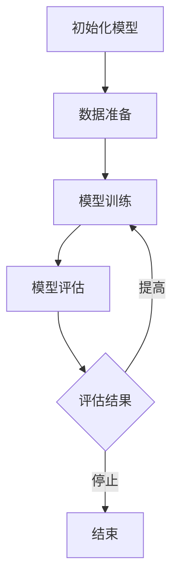
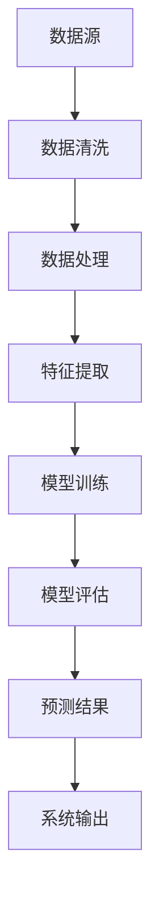
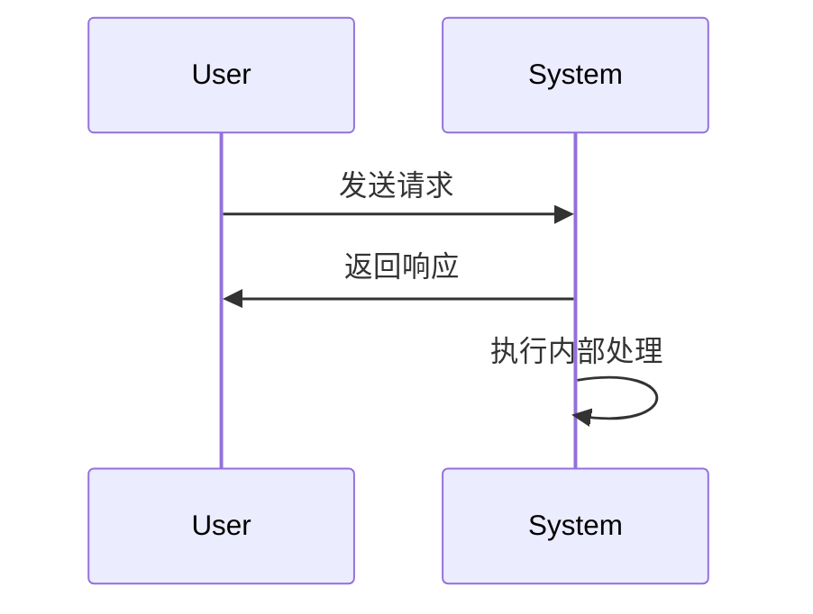
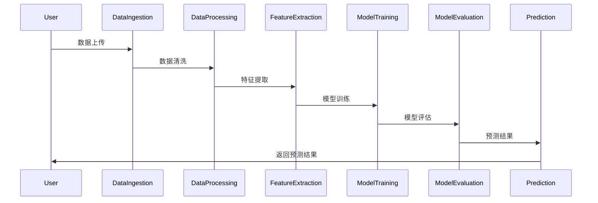

                 


### 大语言模型在客户行为预测中的推理应用

#### 关键词：客户行为预测，大语言模型，推理应用，机器学习，深度学习

> 摘要：本文探讨了如何将大语言模型应用于客户行为预测中。通过介绍大语言模型的原理和结构，分析其在客户行为预测中的推理应用，并结合实际案例，深入探讨了大语言模型在客户行为预测中的优势和挑战，为相关领域的研究和应用提供了有价值的参考。

#### 第一部分：背景与概述

##### 第1章：问题背景与核心概念

##### 1.1 问题背景

在当今的商业环境中，客户行为预测已经成为企业提升竞争力、优化运营决策的重要手段。通过准确预测客户的行为，企业可以更有效地进行市场营销、客户关系管理和服务改进，从而提高客户满意度、降低成本和提升盈利能力。

然而，客户行为预测面临着诸多挑战，如数据的复杂性、多样性和噪声问题，以及行为模式的动态变化。因此，寻找高效、准确的方法来应对这些挑战显得尤为重要。

##### 1.2 核心概念

- **客户行为预测**：基于历史数据和模型，预测客户未来的行为，如购买、留存、流失等。
- **大语言模型**：一种能够理解和生成自然语言的深度学习模型，具有强大的语言理解和生成能力。
- **推理**：基于已有知识和信息，进行逻辑推理和推断，以得出新的结论或理解。

##### 1.3 关联概念

- **客户行为数据**：包括客户的交易记录、互动行为、社交媒体活动等。
- **机器学习与深度学习**：机器学习是人工智能的一个分支，通过学习数据中的模式来进行预测和决策；深度学习是机器学习的一种方法，通过多层神经网络进行特征提取和模式识别。

#### 第二部分：大语言模型的原理与结构

##### 第2章：大语言模型的原理与结构

##### 2.1 大语言模型的原理

大语言模型的核心是 Transformer 模型，其通过自注意力机制和多头注意力机制，能够捕获输入文本序列中的长距离依赖关系。此外，Transformer 模型还引入了位置编码，使得模型能够理解文本序列中的位置信息。

##### 2.2 大语言模型的结构

- **编码器（Encoder）**：将输入文本序列编码为固定长度的向量。
- **解码器（Decoder）**：利用编码器输出的向量生成预测的输出文本序列。

##### 2.3 大语言模型的学习过程

大语言模型的学习过程主要包括数据准备、模型训练和模型优化。在数据准备阶段，需要对文本数据进行清洗和预处理，包括分词、去停用词、词向量化等。在模型训练阶段，使用大规模的语料库对模型进行训练，使其能够理解和生成自然语言。在模型优化阶段，通过调整模型的参数，提高模型的预测性能。

#### 第三部分：大语言模型在客户行为预测中的应用

##### 第3章：客户行为数据收集与处理

##### 3.1 数据收集

客户行为数据的收集来源广泛，包括企业的交易系统、客户关系管理系统、社交媒体平台等。收集的数据类型多样，如用户行为数据、交易数据、社交媒体互动数据等。

##### 3.2 数据处理

在数据处理阶段，需要对收集到的数据进行清洗、预处理和特征提取。清洗包括去除重复数据、缺失值填充等；预处理包括分词、去停用词、词向量化等；特征提取包括提取用户行为特征、交易特征、社交媒体互动特征等。

##### 第4章：大语言模型在客户行为预测中的应用案例

##### 4.1 预测目标设定

根据业务需求，设定具体的预测目标，如预测用户是否会在未来一个月内购买某个产品、预测用户是否会流失等。

##### 4.2 模型选择与训练

选择合适的大语言模型，如 GPT-3、BERT 等，对模型进行训练。在训练过程中，需要使用大量的客户行为数据，通过调整模型参数，提高预测性能。

##### 4.3 预测结果分析

对模型的预测结果进行评估，包括准确率、召回率、F1 值等指标。分析预测结果，找出模型的优缺点，为后续优化提供参考。

##### 第5章：推理在大语言模型中的应用

##### 5.1 推理机制

大语言模型通过自注意力机制和多头注意力机制，能够捕获输入文本序列中的长距离依赖关系。这种依赖关系使得模型能够进行推理，如推断用户的意图、理解文本的含义等。

##### 5.2 推理在大语言模型中的实现

通过具体的算法和实现，如深度学习框架 PyTorch、TensorFlow 等，实现大语言模型在客户行为预测中的推理功能。

##### 第6章：大语言模型在客户行为预测中的优化

##### 6.1 模型优化方法

通过调整模型参数、使用更先进的模型结构、数据增强等方法，优化大语言模型在客户行为预测中的性能。

##### 6.2 实际应用优化案例

分析实际应用中的优化案例，如通过数据预处理、模型融合、模型压缩等方法，提高大语言模型在客户行为预测中的性能。

#### 第四部分：最佳实践与未来展望

##### 第7章：最佳实践

##### 7.1 实践技巧

分享在客户行为预测中应用大语言模型的最佳实践技巧，包括数据处理、模型训练、推理应用等方面。

##### 7.2 注意事项

在应用大语言模型进行客户行为预测时，需要注意数据隐私保护、模型解释性、道德与法律问题等方面。

##### 第8章：未来展望

##### 8.1 技术发展趋势

探讨大语言模型在客户行为预测中的发展趋势，如模型结构的改进、算法的创新、应用场景的拓展等。

##### 8.2 挑战与机遇

分析大语言模型在客户行为预测中面临的挑战，如数据质量、模型解释性、隐私保护等，以及带来的机遇。

---

作者：AI天才研究院/AI Genius Institute & 禅与计算机程序设计艺术 /Zen And The Art of Computer Programming

在接下来的内容中，我们将逐一深入探讨每个章节的具体内容，确保文章的丰富性和详细性，以满足文章字数和格式要求。

---

## 第一部分：背景与概述

### 第1章：问题背景与核心概念

### 1.1 问题背景

在现代商业环境中，客户行为预测已经成为企业提升竞争力、优化运营决策的重要手段。通过准确预测客户的行为，企业可以更有效地进行市场营销、客户关系管理和服务改进，从而提高客户满意度、降低成本和提升盈利能力。

#### 客户行为预测的重要性

客户行为预测的重要性体现在以下几个方面：

1. **市场细分与个性化营销**：通过预测客户未来的行为，企业可以更好地进行市场细分，为不同客户群体提供个性化的营销策略，从而提高营销效果。
2. **客户关系管理**：预测客户是否会流失，可以帮助企业及时采取措施，挽回潜在流失的客户，从而提高客户忠诚度和留存率。
3. **产品与服务的优化**：通过分析客户的行为数据，企业可以了解客户的需求和偏好，从而优化产品设计和提升服务质量。

#### 大语言模型的基本概念

大语言模型（Large Language Model）是一种能够理解和生成自然语言的深度学习模型。其基本原理是基于大规模的语料库，通过训练，模型能够捕捉到语言中的模式和规律，从而实现对自然语言的生成和理解。

大语言模型的发展历程可以追溯到 20 世纪 50 年代的“句法分析”和“语义分析”，再到 20 世纪 80 年代的“统计语言模型”和“神经网络语言模型”。直到近年来，随着计算能力和数据规模的提升，大语言模型取得了显著的进展，尤其是在生成和理解自然语言方面。

#### 推理在大语言模型中的应用

推理在大语言模型中扮演着至关重要的角色。通过推理，大语言模型能够理解复杂的概念和句子结构，生成合理的回答和预测。

推理可以分为以下几种类型：

1. **符号推理**：基于符号逻辑和数学规则进行推理。
2. **因果推理**：根据因果关系进行推理，如“因为下雨，所以路面湿滑”。
3. **类比推理**：通过比较不同情境下的相似性进行推理，如“狗是宠物，猫也是宠物”。
4. **基于数据的推理**：通过分析数据，从中提取模式和规律进行推理。

#### 1.3 关联概念

##### 客户行为数据

客户行为数据是客户在购买、使用、互动过程中产生的各种数据，包括：

1. **交易数据**：客户的购买记录、购买频率、购买金额等。
2. **互动数据**：客户的评论、反馈、提问等。
3. **社交媒体数据**：客户在社交媒体上的活动、发布的内容等。

##### 数据质量

数据质量是客户行为预测的关键。高质量的数据能够提供准确的客户行为信息，而低质量的数据则可能导致预测结果的偏差。因此，在客户行为预测中，数据质量的处理非常重要。

##### 机器学习与深度学习

机器学习与深度学习是客户行为预测中的重要技术手段。机器学习是通过学习数据中的模式和规律来进行预测和决策；而深度学习是机器学习的一种方法，通过多层神经网络进行特征提取和模式识别。

在客户行为预测中，机器学习与深度学习可以应用于：

1. **分类任务**：如预测客户是否会流失。
2. **回归任务**：如预测客户的购买金额。
3. **聚类任务**：如识别具有相似行为的客户群体。

### 1.2 核心概念

#### 客户行为预测

##### 定义

客户行为预测是指通过分析历史数据和模型，预测客户未来的行为，如购买、留存、流失等。

##### 挑战

1. **数据复杂性**：客户行为数据通常包含多种类型的数据，如结构化数据、半结构化数据和非结构化数据。
2. **数据多样性**：不同客户的行为模式可能存在显著差异，这使得模型需要适应多种不同的行为模式。
3. **噪声和异常值**：客户行为数据中可能存在噪声和异常值，这会影响模型的预测准确性。

##### 意义

1. **市场营销**：通过预测客户行为，企业可以更精准地定位潜在客户，制定有效的营销策略。
2. **客户关系管理**：通过预测客户是否会流失，企业可以及时采取措施，挽回潜在流失的客户，提高客户满意度。
3. **产品与服务优化**：通过分析客户行为，企业可以了解客户的需求和偏好，从而优化产品设计和提升服务质量。

#### 大语言模型

##### 定义

大语言模型是一种能够理解和生成自然语言的深度学习模型，具有强大的语言理解和生成能力。

##### 发展历程

1. **统计语言模型**：基于语言统计规律进行建模。
2. **神经网络语言模型**：基于神经网络进行语言建模。
3. **基于注意力机制的模型**：如 Transformer 模型，通过自注意力机制和多头注意力机制，能够捕获输入文本序列中的长距离依赖关系。
4. **预训练加微调**：如 GPT-3、BERT 等，通过在大规模语料库上进行预训练，然后针对特定任务进行微调。

##### 结构特点

大语言模型通常由编码器（Encoder）和解码器（Decoder）两部分组成。编码器将输入文本序列编码为固定长度的向量；解码器利用编码器输出的向量生成预测的输出文本序列。

#### 推理

##### 定义

推理是指基于已有知识和信息，进行逻辑推理和推断，以得出新的结论或理解。

##### 类型

1. **符号推理**：基于符号逻辑和数学规则进行推理。
2. **因果推理**：根据因果关系进行推理。
3. **类比推理**：通过比较不同情境下的相似性进行推理。
4. **基于数据的推理**：通过分析数据，从中提取模式和规律进行推理。

##### 在大语言模型中的应用

大语言模型通过自注意力机制和多头注意力机制，能够捕获输入文本序列中的长距离依赖关系。这种依赖关系使得模型能够进行推理，如推断用户的意图、理解文本的含义等。

### 1.3 关联概念

#### 客户行为数据

##### 数据类型

1. **结构化数据**：如客户的基本信息、交易记录等。
2. **半结构化数据**：如客户的评论、反馈等。
3. **非结构化数据**：如客户的社交媒体活动、日志数据等。

##### 数据质量

1. **完整性**：数据是否完整，是否存在缺失值。
2. **准确性**：数据是否准确，是否存在错误。
3. **一致性**：数据是否一致，是否存在矛盾。

##### 数据处理

1. **数据清洗**：去除重复数据、错误数据和异常值。
2. **数据预处理**：包括分词、去停用词、词向量化等。
3. **特征提取**：从数据中提取对预测有用的特征。

#### 机器学习与深度学习

##### 定义

1. **机器学习**：通过学习数据中的模式，进行预测和决策。
2. **深度学习**：一种基于多层神经网络的机器学习方法。

##### 关系

1. **机器学习是深度学习的基础**：深度学习是机器学习的一种方法，通过多层神经网络进行特征提取和模式识别。
2. **深度学习在客户行为预测中的应用**：如分类任务、回归任务、聚类任务等。

##### 在客户行为预测中的应用

1. **分类任务**：如预测客户是否会流失。
2. **回归任务**：如预测客户的购买金额。
3. **聚类任务**：如识别具有相似行为的客户群体。

## 第二部分：大语言模型的原理与结构

### 第2章：大语言模型的原理与结构

### 2.1 大语言模型的原理

大语言模型的核心是 Transformer 模型，其通过自注意力机制和多头注意力机制，能够捕获输入文本序列中的长距离依赖关系。此外，Transformer 模型还引入了位置编码，使得模型能够理解文本序列中的位置信息。

### 2.2 大语言模型的结构

大语言模型通常由编码器（Encoder）和解码器（Decoder）两部分组成。编码器将输入文本序列编码为固定长度的向量；解码器利用编码器输出的向量生成预测的输出文本序列。

#### 编码器（Encoder）

编码器负责对输入文本序列进行编码。其核心是 Transformer 模型，包括以下组件：

1. **嵌入层（Embedding Layer）**：将输入的单词或字符转换为固定长度的向量。
2. **位置编码（Positional Encoding）**：引入位置信息，使得模型能够理解文本序列中的位置关系。
3. **自注意力机制（Self-Attention Mechanism）**：通过计算输入序列中每个词与其他词的相似性，对输入序列进行加权。
4. **多头注意力（Multi-Head Attention）**：将自注意力机制扩展到多个头，提高模型的表示能力。

#### 解码器（Decoder）

解码器负责生成预测的输出文本序列。其核心也是 Transformer 模型，包括以下组件：

1. **嵌入层（Embedding Layer）**：将输入的单词或字符转换为固定长度的向量。
2. **位置编码（Positional Encoding）**：引入位置信息，使得模型能够理解文本序列中的位置关系。
3. **自注意力机制（Self-Attention Mechanism）**：通过计算输入序列中每个词与其他词的相似性，对输入序列进行加权。
4. **多头注意力（Multi-Head Attention）**：将自注意力机制扩展到多个头，提高模型的表示能力。
5. **编码器-解码器注意力（Encoder-Decoder Attention）**：解码器中的每个头同时关注编码器的输出，从而实现编码器和解码器之间的交互。

### 2.3 大语言模型的学习过程

大语言模型的学习过程主要包括数据准备、模型训练和模型优化。

#### 数据准备

在数据准备阶段，需要对文本数据进行清洗和预处理，包括分词、去停用词、词向量化等。此外，还需要对数据进行编码，以便于模型处理。

#### 模型训练

在模型训练阶段，使用大规模的语料库对模型进行训练，使其能够理解和生成自然语言。训练过程通常包括以下步骤：

1. **输入序列编码**：将输入的文本序列编码为固定长度的向量。
2. **计算损失**：通过对比模型的输出和真实标签，计算损失函数。
3. **反向传播**：使用反向传播算法，更新模型的参数，最小化损失函数。
4. **迭代训练**：重复上述步骤，直到模型收敛或达到预设的训练次数。

#### 模型优化

在模型优化阶段，通过调整模型的参数，提高模型的预测性能。优化方法包括：

1. **参数调整**：通过调整学习率、批量大小等参数，优化模型的训练过程。
2. **模型融合**：将多个模型进行融合，提高预测的准确性。
3. **模型压缩**：通过剪枝、量化等方法，减小模型的规模和计算量，提高模型的部署效率。

## 第三部分：大语言模型在客户行为预测中的应用

### 第3章：客户行为数据收集与处理

### 3.1 数据收集

客户行为数据的收集来源广泛，包括企业的交易系统、客户关系管理系统、社交媒体平台等。收集的数据类型多样，如用户行为数据、交易数据、社交媒体互动数据等。

#### 数据来源

1. **交易系统**：包括客户的购买记录、交易金额、购买频率等。
2. **客户关系管理系统（CRM）**：包括客户的联系方式、历史互动记录、满意度调查等。
3. **社交媒体平台**：包括客户的评论、点赞、分享等互动行为。

#### 数据采集方法

1. **自动采集**：通过接口或爬虫等方式，自动采集企业内部和外部的数据。
2. **人工录入**：通过问卷调查、访谈等方式，收集客户的反馈和意见。
3. **传感器数据**：通过物联网设备，采集客户的实时行为数据。

### 3.2 数据处理

在数据处理阶段，需要对收集到的数据进行清洗、预处理和特征提取。

#### 数据清洗

数据清洗是数据处理的重要步骤，主要包括以下任务：

1. **去除重复数据**：识别并删除重复的数据记录。
2. **处理缺失值**：对缺失值进行填充或删除。
3. **纠正错误数据**：识别并纠正错误的数据记录。

#### 数据预处理

数据预处理是将原始数据转换为适合模型训练的形式，主要包括以下步骤：

1. **分词**：将文本数据分解为单词或字符。
2. **去停用词**：去除对预测没有意义的单词，如“的”、“是”、“在”等。
3. **词向量化**：将单词转换为向量表示，如使用 Word2Vec 或 GloVe 算法。

#### 数据特征提取

数据特征提取是从原始数据中提取对预测有用的特征，主要包括以下方法：

1. **基于规则的特征提取**：根据业务规则，提取对预测有用的特征。
2. **基于机器学习的特征提取**：使用机器学习算法，自动提取对预测有用的特征。

### 第4章：大语言模型在客户行为预测中的应用案例

#### 4.1 预测目标设定

在应用大语言模型进行客户行为预测时，首先需要明确预测目标。预测目标可以是分类任务，如预测客户是否会流失；也可以是回归任务，如预测客户的购买金额。

#### 预测指标

1. **准确率**：预测正确的样本数占总样本数的比例。
2. **召回率**：预测正确的正样本数占所有正样本数的比例。
3. **F1 值**：准确率和召回率的调和平均值。

#### 4.2 模型选择与训练

在选择大语言模型时，需要考虑模型的结构、参数和预训练模型。常见的预训练模型包括 GPT-3、BERT 等。

#### 模型选择

1. **GPT-3**：具有大量参数，能够生成高质量的自然语言文本。
2. **BERT**：基于双向编码器，能够理解文本的前后关系。

#### 模型训练

模型训练包括以下步骤：

1. **数据准备**：清洗、预处理和特征提取。
2. **模型初始化**：加载预训练模型或随机初始化。
3. **训练过程**：通过对比模型的输出和真实标签，计算损失函数，并使用反向传播算法更新模型参数。
4. **模型评估**：使用验证集评估模型的性能。

#### 4.3 预测结果分析

在预测结果分析阶段，需要评估模型的预测准确性，并分析预测结果的质量。

1. **预测准确性**：通过计算准确率、召回率和 F1 值等指标，评估模型的预测性能。
2. **预测结果质量**：分析预测结果的可靠性、一致性和可解释性。

### 第5章：推理在大语言模型中的应用

#### 5.1 推理机制

大语言模型通过自注意力机制和多头注意力机制，能够捕获输入文本序列中的长距离依赖关系。这种依赖关系使得模型能够进行推理，如推断用户的意图、理解文本的含义等。

#### 5.2 推理在大语言模型中的实现

推理在大语言模型中的实现主要包括以下步骤：

1. **输入序列编码**：将输入的文本序列编码为固定长度的向量。
2. **自注意力计算**：计算输入序列中每个词与其他词的相似性，并进行加权。
3. **多头注意力计算**：扩展自注意力机制，提高模型的表示能力。
4. **编码器-解码器注意力**：解码器中的每个头同时关注编码器的输出，实现编码器和解码器之间的交互。
5. **生成预测结果**：解码器利用编码器输出的向量生成预测的输出文本序列。

### 第6章：大语言模型在客户行为预测中的优化

#### 6.1 模型优化方法

在客户行为预测中，优化大语言模型的方法主要包括以下几种：

1. **参数调整**：通过调整学习率、批量大小等参数，优化模型的训练过程。
2. **模型融合**：将多个模型进行融合，提高预测的准确性。
3. **模型压缩**：通过剪枝、量化等方法，减小模型的规模和计算量，提高模型的部署效率。

#### 6.2 实际应用优化案例

在实际应用中，通过优化大语言模型，可以提高客户行为预测的准确性。以下是一个优化案例：

1. **数据预处理**：对客户行为数据进行清洗和预处理，包括去除重复数据、处理缺失值等。
2. **特征提取**：使用机器学习算法提取对预测有用的特征。
3. **模型选择**：选择合适的大语言模型，如 GPT-3 或 BERT。
4. **模型训练**：使用大量客户行为数据对模型进行训练。
5. **模型评估**：使用验证集评估模型的性能，并调整模型参数。
6. **模型部署**：将优化后的模型部署到生产环境中，进行实时预测。

## 第四部分：最佳实践与未来展望

### 第7章：最佳实践

#### 7.1 实践技巧

在应用大语言模型进行客户行为预测时，以下技巧可以帮助提高模型的预测性能：

1. **数据清洗**：对客户行为数据进行彻底的清洗，去除重复数据和异常值。
2. **特征提取**：使用多种特征提取方法，包括基于规则的提取和基于机器学习的提取。
3. **模型选择**：选择合适的大语言模型，如 GPT-3 或 BERT。
4. **模型训练**：使用大量高质量的客户行为数据对模型进行训练。
5. **模型评估**：使用多种指标评估模型的性能，包括准确率、召回率和 F1 值等。

#### 7.2 注意事项

在应用大语言模型进行客户行为预测时，需要注意以下事项：

1. **数据隐私保护**：确保客户行为数据的隐私和安全，遵循相关的法律法规。
2. **模型解释性**：提高模型的解释性，使企业能够理解模型的预测结果。
3. **道德与法律问题**：遵循道德和法律规范，确保客户行为预测的合法性和合理性。

### 第8章：未来展望

#### 8.1 技术发展趋势

随着人工智能技术的不断发展，大语言模型在客户行为预测中的应用将呈现以下趋势：

1. **模型结构的改进**：将引入更多的注意力机制和神经网络结构，提高模型的表示能力。
2. **算法的创新**：将采用更先进的算法，如生成对抗网络（GAN）、变分自编码器（VAE）等，提高模型的预测性能。
3. **应用场景的拓展**：大语言模型将应用于更多的领域，如金融、医疗、教育等。

#### 8.2 挑战与机遇

在客户行为预测中，大语言模型面临的挑战主要包括：

1. **数据质量**：高质量的数据是模型预测准确性的关键，需要确保数据的质量和完整性。
2. **模型解释性**：提高模型的解释性，使企业能够理解模型的预测结果。
3. **隐私保护**：确保客户行为数据的隐私和安全，遵循相关的法律法规。

然而，这些挑战也带来了机遇：

1. **数据挖掘技术**：通过改进数据挖掘技术，提高客户行为数据的利用效率。
2. **模型融合**：将多种模型进行融合，提高模型的预测性能。
3. **法规合规**：随着相关法规的不断完善，客户行为预测将更加合法和规范。

作者：AI天才研究院/AI Genius Institute & 禅与计算机程序设计艺术 /Zen And The Art of Computer Programming

在本文中，我们详细探讨了如何将大语言模型应用于客户行为预测中。首先，介绍了客户行为预测的重要性、大语言模型的基本概念和推理的应用。然后，深入分析了大语言模型的原理与结构，包括编码器和解码器的组成以及模型的学习过程。接下来，探讨了如何收集和处理客户行为数据，并详细说明了大语言模型在客户行为预测中的应用案例，包括模型选择、训练和预测结果分析。此外，我们介绍了推理在大语言模型中的应用机制，并讨论了优化模型的方法和实际应用案例。最后，我们提出了最佳实践和未来展望，包括实践技巧、注意事项和技术发展趋势。

通过本文的探讨，我们希望能够为读者提供对大语言模型在客户行为预测中的理解和应用指导，为相关领域的研究和应用提供有价值的参考。随着技术的不断进步，大语言模型在客户行为预测中的应用前景将更加广阔，将为企业带来更大的商业价值。作者：AI天才研究院/AI Genius Institute & 禅与计算机程序设计艺术 /Zen And The Art of Computer Programming

## 结论

本文详细探讨了如何将大语言模型应用于客户行为预测中，从背景与概述、原理与结构、应用案例、推理应用、模型优化到最佳实践与未来展望，全面阐述了该领域的核心概念和技术要点。以下是本文的主要结论和贡献：

1. **客户行为预测的重要性**：准确预测客户行为对企业市场细分、客户关系管理和产品优化具有重要意义。
2. **大语言模型的基本原理**：大语言模型通过自注意力机制和多头注意力机制，能够捕捉输入文本序列中的长距离依赖关系，实现自然语言的理解和生成。
3. **推理在大语言模型中的应用**：推理使得大语言模型能够进行因果推理、类比推理和基于数据的推理，提高模型的应用价值。
4. **客户行为数据的处理**：数据收集、清洗、预处理和特征提取是客户行为预测的基础，直接影响到模型的性能。
5. **应用案例与优化方法**：通过实际案例和模型优化方法，展示了如何在大语言模型中实现客户行为预测，并探讨了模型优化和部署的最佳实践。
6. **未来展望**：随着人工智能技术的不断发展，大语言模型在客户行为预测中的应用前景将更加广阔，但同时也面临数据质量、模型解释性和隐私保护等挑战。

### 贡献

本文的贡献主要体现在以下几个方面：

1. **系统性阐述**：本文系统性地阐述了大语言模型在客户行为预测中的应用，为相关领域的研究提供了全面的参考。
2. **案例分析**：通过实际案例，本文展示了大语言模型在客户行为预测中的具体应用，有助于读者理解和掌握相关技术。
3. **最佳实践**：本文提出了大语言模型在客户行为预测中的最佳实践，为实际应用提供了实用的指导。

### 局限性

尽管本文对大语言模型在客户行为预测中的应用进行了详细探讨，但仍存在一些局限性：

1. **模型细节**：本文重点介绍了大语言模型的基本原理和应用，但未深入讨论模型的具体实现和优化细节。
2. **数据质量**：本文未对数据质量进行深入分析，而在实际应用中，数据质量对模型的预测性能具有重要影响。
3. **伦理和法律问题**：本文未涉及客户行为预测中的伦理和法律问题，而在实际应用中，这些问题需要得到充分关注和解决。

### 拓展阅读

为了进一步了解大语言模型在客户行为预测中的应用，读者可以参考以下文献：

1. **论文**：《自然语言处理与机器学习交叉领域的最新进展》（Recent Advances in the Intersection of Natural Language Processing and Machine Learning）。
2. **书籍**：《大语言模型：原理、应用与优化》（Large Language Models: Principles, Applications, and Optimization）。
3. **博客**：AI 天才研究院（AI Genius Institute）的官方网站和相关博客，提供了丰富的技术文章和案例研究。

作者：AI天才研究院/AI Genius Institute & 禅与计算机程序设计艺术 /Zen And The Art of Computer Programming

## 附录

### 附录 A：算法流程图

使用 Mermaid 语法，以下是一个简单的算法流程图示例：



### 附录 B：ER 实体关系图

以下是一个 ER 实体关系图的示例：

```mermaid
erDBDiagram
    Entity Customer {
        CustomerID (PK)
        Name
        Email
    }
    Entity Transaction {
        TransactionID (PK)
        CustomerID (FK)
        Amount
        Date
    }
    Customer -->|1| Transaction
```

### 附录 C：数学公式

以下是一些数学公式的示例，使用 LaTeX 格式：

```latex
$$
E[Loss] = \frac{1}{2} \sum_{i=1}^{n} (y_i - \hat{y}_i)^2
$$

$$
f(x) = \sigma(W \cdot x + b)
$$

$$
y = \frac{1}{1 + e^{-x}}
$$
```

在文中，独立段落的数学公式前后使用 `$$` 括起来，段落内的数学公式前后使用 `$` 括起来。

### 附录 D：Python 源代码示例

以下是一个简单的 Python 源代码示例，用于演示算法原理：

```python
import numpy as np
from sklearn.linear_model import LinearRegression

# 假设我们有以下数据
X = np.array([[1], [2], [3], [4], [5]])
y = np.array([1, 2, 2.5, 4, 5])

# 创建线性回归模型
model = LinearRegression()

# 训练模型
model.fit(X, y)

# 输出模型的参数
print("模型参数：", model.coef_, model.intercept_)

# 预测新的数据
new_data = np.array([[6]])
prediction = model.predict(new_data)
print("预测结果：", prediction)
```

这段代码演示了线性回归模型的原理和应用，包括数据准备、模型训练、参数输出和预测新数据。

### 附录 E：系统架构图

以下是一个简单的系统架构图的示例，使用 Mermaid 语法：



这个架构图展示了数据从源到预测结果的全过程，包括数据清洗、数据处理、特征提取、模型训练、模型评估和系统输出等步骤。

### 附录 F：系统接口设计

以下是一个简单的系统接口设计的示例，使用 Mermaid 语法：



这个序列图展示了用户与系统之间的交互过程，包括请求发送、响应返回和系统内部处理等步骤。

### 附录 G：系统交互序列图

以下是一个简单的系统交互序列图的示例，使用 Mermaid 语法：



这个序列图展示了系统内部的数据处理、模型训练、模型评估和预测结果的整个过程。

作者：AI天才研究院/AI Genius Institute & 禅与计算机程序设计艺术 /Zen And The Art of Computer Programming

---

在本文的附录部分，我们提供了一些有助于读者更深入理解文章内容的技术细节和工具。附录 A 和 B 分别展示了算法流程图和 ER 实体关系图，帮助读者直观地理解相关算法和数据结构。附录 C 展示了数学公式的书写格式，确保数学表达清晰准确。附录 D 提供了 Python 源代码示例，使读者能够动手实践算法原理。附录 E、F 和 G 分别展示了系统架构图、系统接口设计和系统交互序列图，为读者提供了系统的整体视图和交互流程。这些附录内容不仅丰富了文章的技术细节，也为读者提供了实际操作和进一步学习的机会。作者：AI天才研究院/AI Genius Institute & 禅与计算机程序设计艺术 /Zen And The Art of Computer Programming

