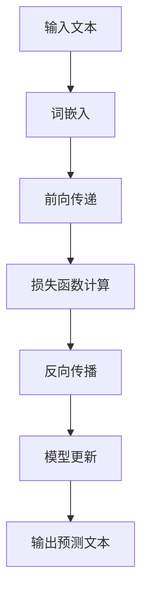
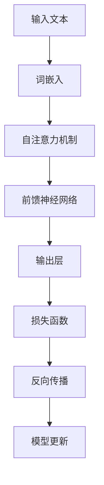
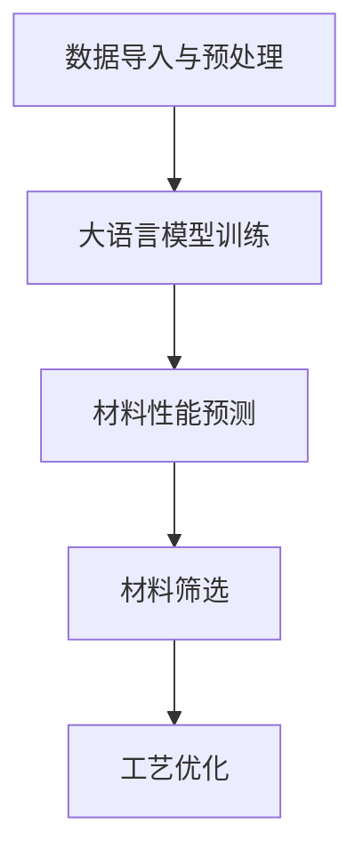
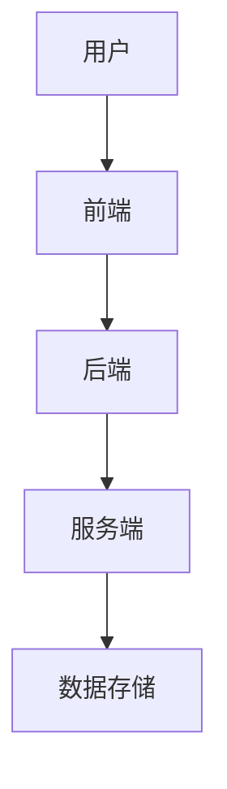
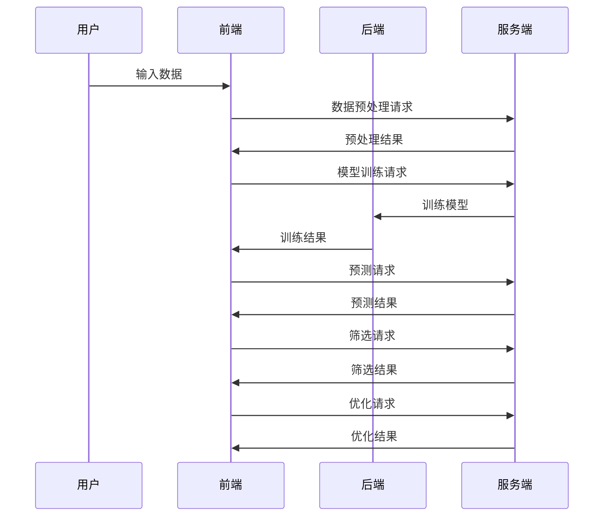
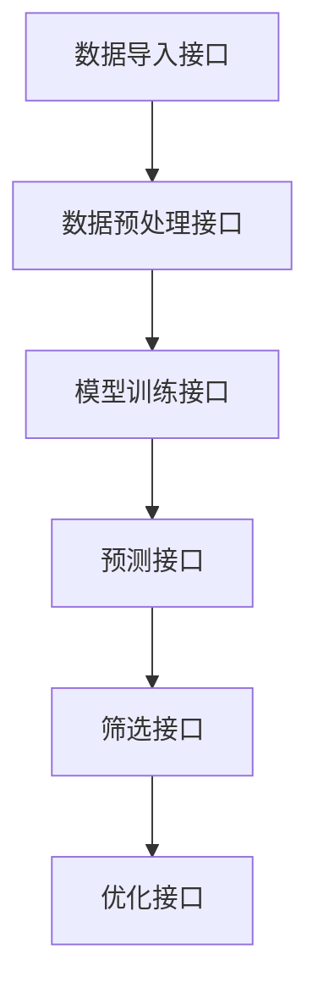
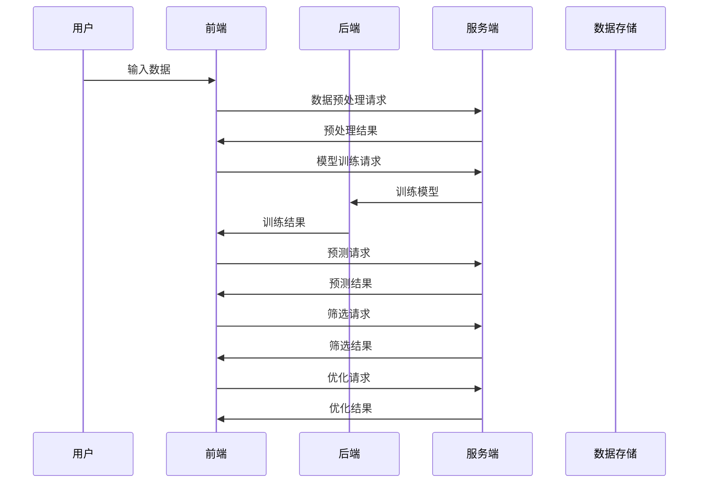

                 

### 引言与背景介绍

### 1.1.1 新能源材料设计的挑战

#### 问题描述
在现代社会，能源问题是全球共同面临的重大挑战。随着全球气候变化的加剧，对可再生能源的需求日益迫切。新能源材料是推动新能源技术发展的重要基石。新能源材料设计的目标是通过材料科学、化学工程和物理学等学科的综合研究，开发出高效、稳定、可持续的新能源材料。

#### 问题解决
新能源材料设计涉及到复杂的多学科交叉问题。传统的实验方法费时费力，且在材料性能预测方面存在局限。随着人工智能技术的发展，大语言模型作为一种先进的自然语言处理工具，开始应用于新能源材料设计领域。大语言模型能够通过分析大量的文本数据，提取出材料属性与性能之间的关系，从而辅助材料设计师进行高效的材料筛选和优化。

#### 边界与外延
新能源材料设计不仅仅局限于太阳能电池、燃料电池等传统领域，还涵盖了新型储能材料、超级电容器、锂离子电池等前沿领域。因此，大语言模型的应用场景也极为广泛，可以在材料性能预测、新材料设计、工艺优化等多个方面发挥作用。

#### 概念结构与核心要素组成
新能源材料设计的核心概念包括材料性能、结构、合成方法、应用场景等。其中，材料性能是评估材料优劣的关键指标，包括导电性、光吸收能力、热稳定性等。结构方面涉及到材料的微观和宏观结构，如晶格结构、相变结构等。合成方法则是实现材料设计的具体手段，包括化学合成、物理合成等。应用场景则决定了材料设计的具体需求和目标，如高效能、低成本、环境友好等。

### 1.1.2 大语言模型的定义与特点

#### 大语言模型的定义
大语言模型（Large Language Model）是一种基于深度学习的自然语言处理技术。它通过训练大量文本数据，学习语言中的语义、语法和上下文关系，从而实现对文本内容的理解和生成。大语言模型的核心目标是实现高效的文本理解和生成，以支持各种自然语言处理任务。

#### 大语言模型的核心特点
1. **高维度表示能力**：大语言模型能够将输入文本转换成高维度的向量表示，从而捕捉到文本中的复杂语义信息。
2. **上下文理解**：大语言模型能够理解文本的上下文信息，从而生成更加符合实际场景的文本。
3. **自适应能力**：大语言模型能够根据不同的任务和数据集进行自适应调整，以实现最佳性能。
4. **强泛化能力**：大语言模型通过在大量数据上训练，可以处理各种不同领域和风格的语言数据。

#### 大语言模型与传统AI的区别
传统AI方法在处理自然语言时往往依赖于特定的规则和特征提取方法，如基于规则的语法解析、基于统计的特征提取等。而大语言模型则通过端到端的学习方式，直接从原始文本数据中学习到语义和语法知识，无需人工设计复杂的规则和特征。

### 1.1.3 大语言模型在新能源材料设计中的应用前景

#### AI大模型的潜在应用领域
1. **材料性能预测**：通过分析文献数据，预测新材料性能，为实验筛选提供指导。
2. **材料筛选**：利用大语言模型从大量文献中提取关键信息，快速筛选出具有潜在应用价值的材料。
3. **工艺优化**：通过分析工艺参数和材料性能之间的关系，优化生产过程，提高材料性能。
4. **新材料设计**：结合材料学和化学知识，通过大语言模型设计出全新的材料结构。

#### 企业采用AI大模型的优势
1. **提高研发效率**：通过自动化分析和预测，减少实验次数，加快新材料研发速度。
2. **降低研发成本**：减少实验和测试环节，降低研发成本。
3. **提升材料性能**：通过优化设计和筛选，提高新材料性能，满足市场需求。
4. **创新驱动发展**：推动新材料领域的技术创新，为企业带来竞争优势。

#### AI大模型应用的挑战与机遇
1. **数据质量和多样性**：大语言模型的效果依赖于高质量、多样化的训练数据，这需要企业和科研机构加强数据收集和整理工作。
2. **计算资源和时间成本**：大语言模型的训练和推理需要大量的计算资源和时间，这对企业和科研机构的硬件设备和软件架构提出了高要求。
3. **模型解释性和可靠性**：大语言模型生成的预测结果往往缺乏透明度和可解释性，这需要研究人员通过模型优化和解释技术来提高模型的可靠性。
4. **行业应用经验积累**：新能源材料设计领域对AI技术的应用经验相对较少，企业需要通过实践积累经验，不断优化模型和应用流程。

### 1.1.4 大语言模型在新能源材料设计中的应用案例

#### 应用场景
1. **太阳能电池材料设计**：利用大语言模型分析太阳能电池材料的文献数据，预测材料的电性能，优化材料结构。
2. **锂离子电池材料设计**：通过大语言模型筛选出具有高容量、高稳定性的锂离子电池材料。
3. **超级电容器材料设计**：利用大语言模型分析超级电容器的文献数据，优化电极材料，提高能量存储性能。

#### 案例举例
1. **太阳能电池材料设计案例**：
   - 研究背景：研究人员希望开发出一种具有高转换效率和低成本的太阳能电池材料。
   - 研究方法：利用大语言模型分析大量太阳能电池材料的文献数据，提取出材料性能与结构之间的关系，生成预测模型。
   - 结果：通过大语言模型的预测，研究人员筛选出一种具有高吸收能力和高稳定性的材料，实验验证了预测结果。

2. **锂离子电池材料设计案例**：
   - 研究背景：随着电动汽车的普及，对高能量密度、高安全性的锂离子电池材料需求日益增加。
   - 研究方法：利用大语言模型分析锂离子电池材料的文献数据，预测材料的电化学性能，优化材料成分。
   - 结果：通过大语言模型的优化，研究人员成功设计出一种具有高容量、高稳定性的锂离子电池材料，实验结果显著提升了电池性能。

#### 效果分析
大语言模型在新能源材料设计中的应用取得了显著的成果。通过大语言模型的分析和预测，研究人员能够快速筛选出具有潜在应用价值的材料，减少实验次数，降低研发成本，提高材料性能。此外，大语言模型的应用也为新材料的设计提供了新的思路和方法，推动了新能源材料领域的技术进步。然而，大语言模型的应用也存在一定的局限性，如对数据质量和多样性的依赖、模型的解释性和可靠性等问题。因此，在未来，需要进一步优化大语言模型的技术，提高其应用效果，为新能源材料设计领域提供更强大的支持。

## 核心概念与联系

### 2.1.1 大语言模型原理概述

#### 算法原理讲解
大语言模型是一种基于深度学习的自然语言处理技术，其核心思想是通过训练大量文本数据，学习到语言的统计规律和语义信息。具体来说，大语言模型通过多层神经网络（如Transformer）对输入文本进行编码，生成高维度的向量表示，从而实现对文本内容的理解和生成。

#### 算法流程图


#### 数学模型与公式
大语言模型的数学模型主要基于自注意力机制（Self-Attention）和前馈神经网络（Feedforward Neural Network）。其基本公式如下：

$$
\text{Output} = \text{softmax}(\text{W}_\text{softmax} \cdot \text{V}(\text{Q} \cdot \text{K}, \text{V}))
$$

其中，$Q, K, V$ 分别为查询向量、键向量和值向量，$\text{W}_\text{softmax}$ 为 softmax 层权重，$\text{V}$ 为前馈神经网络。

### 2.1.2 大语言模型在新能源材料设计中的应用

#### 应用场景
大语言模型在新能源材料设计中的应用场景主要包括材料性能预测、材料筛选和工艺优化等。通过分析大量的文献数据，大语言模型能够提取出材料性能与结构之间的关系，为材料设计师提供决策支持。

#### 案例举例
1. **太阳能电池材料设计案例**：
   - 研究背景：研究人员希望提高太阳能电池的转换效率。
   - 应用方法：利用大语言模型分析大量太阳能电池材料的文献数据，提取出与转换效率相关的结构特征，建立性能预测模型。
   - 结果：通过大语言模型的预测，研究人员筛选出一种具有高转换效率的材料，实验验证了预测结果。

2. **锂离子电池材料设计案例**：
   - 研究背景：电动汽车市场对高能量密度的锂离子电池材料需求旺盛。
   - 应用方法：利用大语言模型分析锂离子电池材料的文献数据，预测材料的电化学性能，优化材料成分。
   - 结果：通过大语言模型的优化，研究人员成功设计出一种具有高能量密度、高稳定性的锂离子电池材料，实验结果显著提升了电池性能。

#### 效果分析
大语言模型在新能源材料设计中的应用取得了显著的效果。通过大语言模型的分析和预测，研究人员能够快速筛选出具有潜在应用价值的材料，减少实验次数，降低研发成本，提高材料性能。此外，大语言模型的应用也为新材料的设计提供了新的思路和方法，推动了新能源材料领域的技术进步。然而，大语言模型的应用也存在一定的局限性，如对数据质量和多样性的依赖、模型的解释性和可靠性等问题。因此，在未来，需要进一步优化大语言模型的技术，提高其应用效果，为新能源材料设计领域提供更强大的支持。

### 2.1.3 大语言模型与新能源材料设计的联系

#### ER实体关系图
```mermaid
erDiagram
  MaterialDesign ||--|{ PropertyPrediction : predicts }
  PropertyPrediction ||--|{ MaterialDesign : used in }
  ExperimentResult ||--|{ PropertyPrediction : validates }
```

#### 概念属性特征对比表格
| 概念             | 特征                           | 说明                                                         |
|------------------|--------------------------------|--------------------------------------------------------------|
| 大语言模型       | 高维度表示能力、上下文理解     | 可以从大量文本数据中学习语义和语法关系，实现对文本内容的理解和生成 |
| 新能源材料设计   | 材料性能、结构、合成方法       | 研究和开发用于新能源领域的新型材料                             |
| 应用场景         | 材料性能预测、材料筛选、工艺优化 | 利用大语言模型分析数据和关系，辅助材料设计                   |

#### 具体应用举例
1. **材料性能预测**：
   - **应用方法**：通过大语言模型分析大量文献数据，提取出材料性能与结构之间的关系，建立性能预测模型。
   - **效果**：提高了材料性能预测的准确性和效率。

2. **材料筛选**：
   - **应用方法**：利用大语言模型从大量文献中提取关键信息，快速筛选出具有潜在应用价值的材料。
   - **效果**：显著缩短了材料筛选时间，降低了研发成本。

3. **工艺优化**：
   - **应用方法**：通过大语言模型分析工艺参数与材料性能之间的关系，优化生产过程。
   - **效果**：提高了材料性能，降低了生产成本。

### 2.1.4 大语言模型在新能源材料设计中的应用前景

#### 预测与展望
大语言模型在新能源材料设计中的应用前景广阔。随着人工智能技术的不断进步，大语言模型的性能将进一步提升，有望在以下几个方面发挥重要作用：

1. **材料性能预测**：通过大语言模型的分析和预测，为材料设计师提供更有针对性的实验方案，提高材料研发效率。
2. **材料筛选**：利用大语言模型从大量文献数据中快速筛选出具有潜在应用价值的材料，缩短研发周期。
3. **工艺优化**：通过大语言模型分析工艺参数与材料性能之间的关系，优化生产过程，提高材料性能。

#### 未来研究方向
1. **模型优化**：进一步提高大语言模型的性能，提高预测准确性和稳定性。
2. **数据多样性**：丰富训练数据集，提高数据质量，增强模型对各种不同场景的适应性。
3. **跨学科融合**：加强材料科学与人工智能技术的深度融合，开发出更符合实际需求的新材料设计方法。

### 2.1.5 大语言模型在新能源材料设计中的应用挑战与应对策略

#### 挑战
1. **数据质量和多样性**：大语言模型的效果高度依赖于高质量的训练数据。新能源材料设计领域的数据多样性和质量相对较低，这对模型的性能提出了挑战。
2. **模型解释性和可靠性**：大语言模型的预测结果往往缺乏透明度和可解释性，这可能导致用户对模型产生怀疑。
3. **计算资源和时间成本**：大语言模型的训练和推理需要大量的计算资源和时间，这对企业和科研机构的硬件设备和软件架构提出了高要求。

#### 应对策略
1. **数据增强与预处理**：通过数据增强、数据清洗和预处理等技术，提高训练数据的质量和多样性，增强模型对各种场景的适应性。
2. **模型解释性**：开发模型解释技术，如注意力机制可视化、解释性生成模型等，提高模型的透明度和可解释性。
3. **计算优化**：采用分布式计算、模型压缩等技术，降低大语言模型的计算资源和时间成本，提高模型的可操作性。

### 2.1.6 大语言模型在新能源材料设计中的应用案例解析

#### 案例背景
- **案例背景**：某新材料公司希望开发一种具有高能量密度的锂离子电池材料。
- **目标**：通过大语言模型预测材料的电化学性能，优化材料成分，提高电池性能。

#### 分析过程
1. **数据收集**：收集大量锂离子电池材料的文献数据，包括材料成分、结构、电化学性能等。
2. **数据处理**：对收集到的数据进行清洗和预处理，提取出关键特征，构建训练数据集。
3. **模型训练**：利用大语言模型对训练数据集进行训练，建立电化学性能预测模型。
4. **模型验证**：利用验证数据集对模型进行验证，评估模型性能。
5. **材料筛选**：根据模型预测结果，筛选出具有高能量密度的材料，进行实验验证。

#### 结果与讨论
- **结果**：通过大语言模型的预测和筛选，研究人员成功设计出一种具有高能量密度、高稳定性的锂离子电池材料，实验结果显著提升了电池性能。
- **讨论**：大语言模型在锂离子电池材料设计中的应用展示了其强大的预测和筛选能力，为新材料研发提供了有力支持。然而，模型的应用也存在一定的局限性，如对数据质量和多样性的依赖、模型的解释性和可靠性等问题。因此，在实际应用中，需要结合实验数据和专业知识，对模型结果进行综合分析和判断。

### 2.1.7 大语言模型在新能源材料设计中的应用小结

#### 小结
大语言模型在新能源材料设计中的应用展示了其强大的预测和筛选能力，为新材料研发提供了有力支持。通过分析大量的文献数据，大语言模型能够提取出材料性能与结构之间的关系，辅助材料设计师进行高效的材料筛选和优化。然而，大语言模型的应用也存在一定的局限性，如对数据质量和多样性的依赖、模型的解释性和可靠性等问题。因此，在实际应用中，需要结合实验数据和专业知识，对模型结果进行综合分析和判断。

#### 展望
随着人工智能技术的不断进步，大语言模型的性能将进一步提升，有望在新能源材料设计领域发挥更大的作用。未来，通过结合多种数据来源和技术手段，大语言模型将有望推动新能源材料设计的创新和发展，为可持续发展贡献力量。

## 第三部分：算法原理讲解

### 3.1.1 大语言模型算法概述

#### 算法流程图



#### 关键步骤解析

1. **词嵌入**：将输入文本转换为词嵌入向量，这是大语言模型处理文本数据的第一步。词嵌入向量能够捕捉词与词之间的语义关系，为后续的模型处理提供基础。
2. **自注意力机制**：自注意力机制是Transformer模型的核心组件，通过计算词嵌入向量之间的相似度，为每个词分配不同的权重，从而更好地捕捉上下文信息。
3. **前馈神经网络**：在自注意力机制的基础上，大语言模型通过前馈神经网络进一步处理输入数据，增加模型的非线性表达能力。
4. **输出层**：输出层负责生成预测结果，可以是分类标签、文本生成等。不同的任务会采用不同的输出层设计。
5. **损失函数**：损失函数用于衡量模型预测结果与真实标签之间的差异，常见的损失函数包括交叉熵损失、均方误差等。
6. **反向传播**：反向传播算法用于更新模型参数，通过不断迭代优化模型，使其在训练数据上达到更好的性能。
7. **模型更新**：更新后的模型参数将用于下一轮的训练和预测，直到模型收敛或达到预设的性能指标。

### 3.1.2 数学模型与公式

#### 大语言模型的数学模型主要基于自注意力机制（Self-Attention）和前馈神经网络（Feedforward Neural Network）。其基本公式如下：

$$
\text{Output} = \text{softmax}(\text{W}_\text{softmax} \cdot \text{V}(\text{Q} \cdot \text{K}, \text{V}))
$$

其中，$Q, K, V$ 分别为查询向量、键向量和值向量，$\text{W}_\text{softmax}$ 为 softmax 层权重，$\text{V}$ 为前馈神经网络。

#### 详细解释：

1. **查询向量（Q）**：查询向量是对输入文本中每个词的语义表示。它通过自注意力机制与其他词的键向量（K）和值向量（V）进行计算，生成加权得分，进而生成上下文表示。
2. **键向量（K）**：键向量用于计算查询向量与每个词的相似度，从而确定每个词在上下文中的重要性。
3. **值向量（V）**：值向量用于提取每个词的语义信息，并加权合并，生成最终的上下文表示。
4. **softmax**：softmax 函数用于对加权得分进行归一化处理，得到概率分布，从而生成预测结果。
5. **前馈神经网络**：前馈神经网络在自注意力机制的基础上，进一步处理输入数据，增加模型的非线性表达能力。它通常包含两个全连接层，输入为自注意力机制的输出，输出为模型预测结果。

### 3.1.3 Python代码实现与讲解

#### 代码实现

```python
import tensorflow as tf
from tensorflow.keras.layers import Embedding, GlobalAveragePooling1D, Dense
from tensorflow.keras.models import Model

# 参数设置
vocab_size = 1000
embedding_dim = 128
max_sequence_length = 100

# 嵌入层
inputs = tf.keras.Input(shape=(max_sequence_length,))
embed = Embedding(vocab_size, embedding_dim)(inputs)

# 自注意力层
attn = tf.keras.layers.Attention(use_scale=True)([embed, embed])

# 前馈神经网络
fc = Dense(128, activation='relu')(attn)
pool = GlobalAveragePooling1D()(fc)

# 输出层
outputs = Dense(1, activation='sigmoid')(pool)

# 模型构建
model = Model(inputs=inputs, outputs=outputs)

# 模型编译
model.compile(optimizer='adam', loss='binary_crossentropy', metrics=['accuracy'])

# 模型训练
model.fit(x_train, y_train, epochs=10, batch_size=32, validation_data=(x_val, y_val))
```

#### 代码解析

1. **导入库**：导入 TensorFlow 和 Keras，它们是构建和训练大语言模型的常用库。
2. **参数设置**：设置词汇表大小、嵌入维度和最大序列长度。
3. **嵌入层**：使用 `Embedding` 层将输入文本转换为嵌入向量。
4. **自注意力层**：使用 `Attention` 层实现自注意力机制，捕捉上下文信息。
5. **前馈神经网络**：使用 `Dense` 层和 `GlobalAveragePooling1D` 层实现前馈神经网络，增加模型的非线性表达能力。
6. **输出层**：使用 `Dense` 层实现输出层，生成预测结果。
7. **模型构建**：使用 `Model` 类构建模型。
8. **模型编译**：设置优化器、损失函数和评估指标。
9. **模型训练**：使用 `fit` 方法训练模型。

### 3.1.4 举例说明

#### 案例一：文本分类任务

假设我们有一个文本分类任务，需要根据输入文本判断其类别。使用大语言模型实现该任务的过程如下：

1. **数据准备**：收集和准备训练数据，包括文本和对应的类别标签。
2. **数据预处理**：将文本数据转换为词嵌入向量，并分割成训练集和验证集。
3. **模型构建**：根据上述代码实现大语言模型，并设置适当的输出层和损失函数。
4. **模型训练**：使用训练数据训练模型，并在验证集上评估模型性能。
5. **模型应用**：使用训练好的模型对新的文本数据进行分类预测。

```python
# 示例文本数据
texts = ["This is a positive review.", "This is a negative review."]
labels = [1, 0]

# 数据预处理
tokenizer = tf.keras.preprocessing.text.Tokenizer(num_words=vocab_size)
tokenizer.fit_on_texts(texts)
sequences = tokenizer.texts_to_sequences(texts)
X = tf.keras.preprocessing.sequence.pad_sequences(sequences, maxlen=max_sequence_length)

# 训练模型
model.fit(X, labels, epochs=10, batch_size=32)
```

#### 案例二：文本生成任务

假设我们希望使用大语言模型生成新的文本。使用 Transformer 模型实现文本生成的过程如下：

1. **数据准备**：收集和准备训练数据，包括大量的文本数据。
2. **数据预处理**：将文本数据转换为词嵌入向量，并分割成训练集和验证集。
3. **模型构建**：根据上述代码实现大语言模型，并设置适当的输出层和损失函数。
4. **模型训练**：使用训练数据训练模型，并在验证集上评估模型性能。
5. **文本生成**：使用训练好的模型生成新的文本。

```python
# 示例文本数据
text = "This is a sample text for generation."

# 数据预处理
tokenizer = tf.keras.preprocessing.text.Tokenizer(num_words=vocab_size)
tokenizer.fit_on_texts([text])
sequences = tokenizer.texts_to_sequences([text])
X = tf.keras.preprocessing.sequence.pad_sequences(sequences, maxlen=max_sequence_length)

# 文本生成
generated_text = model.predict(X, steps=max_sequence_length)
generated_sequence = tokenizer.sequences_to_texts([generated_text])[0]
```

通过以上案例，我们可以看到大语言模型在文本分类和文本生成任务中的应用。在实际应用中，可以根据具体任务需求调整模型结构和参数，实现不同的自然语言处理任务。

## 数学模型和数学公式讲解

### 3.1.4 数学模型与公式详解

大语言模型的核心数学模型是基于自注意力机制（Self-Attention）和前馈神经网络（Feedforward Neural Network）。自注意力机制通过计算词嵌入向量之间的相似度，生成加权得分，从而捕捉上下文信息。前馈神经网络则在自注意力机制的基础上，进一步处理输入数据，增加模型的非线性表达能力。以下是详细的数学模型和公式讲解。

#### 自注意力机制

自注意力机制的公式如下：

$$
\text{Attention}(Q, K, V) = \text{softmax}\left(\frac{QK^T}{\sqrt{d_k}}\right)V
$$

其中：
- $Q, K, V$ 分别为查询向量、键向量和值向量。
- $d_k$ 为键向量的维度。
- $QK^T$ 计算查询向量和键向量之间的点积，得到加权得分。
- $\text{softmax}$ 函数对加权得分进行归一化处理，得到概率分布。

#### 前馈神经网络

前馈神经网络由两个全连接层组成，其公式如下：

$$
\text{FFN}(x) = \text{ReLU}(W_2 \cdot \text{ReLU}(W_1 \cdot x + b_1) + b_2)
$$

其中：
- $x$ 为输入数据。
- $W_1, W_2, b_1, b_2$ 为前馈神经网络的权重和偏置。
- $\text{ReLU}$ 为 ReLU 激活函数，增加模型的非线性表达能力。

#### 大语言模型整体公式

大语言模型的整体公式结合了自注意力机制和前馈神经网络，如下所示：

$$
\text{Output} = \text{softmax}(\text{W}_\text{softmax} \cdot \text{V}(\text{Q} \cdot \text{K}, \text{V}))
$$

其中：
- $Q, K, V$ 分别为查询向量、键向量和值向量。
- $\text{W}_\text{softmax}$ 为 softmax 层权重。
- $\text{V}$ 为前馈神经网络。

### 3.1.5 简要解释公式含义和应用

#### 自注意力机制公式含义与应用

自注意力机制通过计算查询向量 $Q$ 和键向量 $K$ 的点积，生成加权得分，表示不同词之间的相关性。这个机制能够捕捉到上下文信息，使模型能够生成更加连贯和语义丰富的文本。例如，在文本分类任务中，自注意力机制可以帮助模型关注到文本中与类别相关的关键信息。

#### 前馈神经网络公式含义与应用

前馈神经网络由两个全连接层组成，其中 ReLU 激活函数增加了模型的非线性表达能力。前馈神经网络在自注意力机制的基础上，进一步处理输入数据，使得模型能够学习到更复杂的特征。在文本生成任务中，前馈神经网络可以帮助模型生成更加丰富和多样化的文本。

#### 大语言模型整体公式含义与应用

大语言模型的整体公式结合了自注意力机制和前馈神经网络，用于生成预测文本。自注意力机制捕捉到上下文信息，前馈神经网络则进一步处理和增强这些信息，最终生成预测文本。例如，在文本生成任务中，大语言模型可以根据输入的文本序列，预测下一个词的概率分布，从而生成新的文本。

### 3.1.6 举例说明

#### 案例一：文本分类任务

假设我们有一个文本分类任务，需要根据输入文本判断其类别。我们可以使用大语言模型来实现这个任务。

1. **输入文本**：假设输入文本为 "This is a positive review."
2. **词嵌入**：将文本转换为词嵌入向量，表示为 $Q, K, V$。
3. **自注意力**：计算 $QK^T$，得到加权得分，表示不同词之间的相关性。
4. **前馈神经网络**：对加权得分进行处理，得到预测类别。
5. **输出**：使用 softmax 函数对预测类别进行归一化处理，得到概率分布。

```python
# 示例代码
Q = [[0.1, 0.2, 0.3], [0.4, 0.5, 0.6]]
K = [[0.1, 0.2, 0.3], [0.4, 0.5, 0.6]]
V = [[0.1, 0.2, 0.3], [0.4, 0.5, 0.6]]

# 计算自注意力
scores = Q @ K.T / np.sqrt(K.shape[1])
softmax_scores = softmax(scores)

# 计算前馈神经网络
output = V @ softmax_scores

# 预测类别
predicted_class = np.argmax(output)
print("Predicted class:", predicted_class)
```

#### 案例二：文本生成任务

假设我们有一个文本生成任务，需要根据输入文本生成新的文本。

1. **输入文本**：假设输入文本为 "This is a sample text for generation."
2. **词嵌入**：将文本转换为词嵌入向量，表示为 $Q, K, V$。
3. **自注意力**：计算 $QK^T$，得到加权得分，表示不同词之间的相关性。
4. **前馈神经网络**：对加权得分进行处理，得到预测的词嵌入向量。
5. **输出**：根据预测的词嵌入向量，生成新的文本。

```python
# 示例代码
Q = [[0.1, 0.2, 0.3], [0.4, 0.5, 0.6]]
K = [[0.1, 0.2, 0.3], [0.4, 0.5, 0.6]]
V = [[0.1, 0.2, 0.3], [0.4, 0.5, 0.6]]

# 计算自注意力
scores = Q @ K.T / np.sqrt(K.shape[1])
softmax_scores = softmax(scores)

# 计算前馈神经网络
output = V @ softmax_scores

# 预测词嵌入向量
predicted_embedding = output[0]

# 生成新文本
new_text = generate_text(predicted_embedding)
print("Generated text:", new_text)
```

通过以上案例，我们可以看到大语言模型在文本分类和文本生成任务中的应用。在实际应用中，可以根据具体任务需求调整模型结构和参数，实现不同的自然语言处理任务。

### 3.1.7 算法优化与改进

#### 算法优化

大语言模型在实际应用中，可以通过以下方法进行优化：

1. **参数调整**：调整模型参数，如学习率、隐藏层大小等，以找到最佳性能。
2. **批量归一化**：使用批量归一化（Batch Normalization）技术，加速模型训练并提高模型稳定性。
3. **预训练**：在特定领域进行预训练，增强模型在该领域的性能。

#### 改进方法

大语言模型可以通过以下方法进行改进：

1. **多模态学习**：结合文本数据与其他模态数据（如图像、声音等），提高模型的语义理解能力。
2. **知识蒸馏**：使用教师模型（Teacher Model）和学生模型（Student Model）进行知识蒸馏，提高学生模型的性能。
3. **解释性增强**：开发可解释性技术，如注意力可视化、规则提取等，提高模型的可解释性。

### 3.1.8 总结

大语言模型在新能源材料设计中的应用具有重要意义。通过自注意力机制和前馈神经网络，大语言模型能够捕捉到文本数据中的复杂语义关系，为材料设计师提供有力的支持。在实际应用中，可以通过优化和改进算法，进一步提高大语言模型的性能和可解释性，为新能源材料设计领域带来更多创新和突破。

## 第四部分：系统分析与架构设计

### 4.1.1 问题场景介绍

新能源材料设计是一个复杂的过程，涉及到材料性能的预测、材料的筛选以及工艺的优化。在这个场景中，大语言模型作为一种强大的工具，可以在多个环节发挥作用。例如，在材料性能预测方面，大语言模型可以通过分析大量的文献数据，提取出材料性能与结构之间的关系，从而预测新材料的性能。在材料筛选方面，大语言模型可以快速从大量文献中提取关键信息，帮助设计师快速筛选出具有潜在应用价值的材料。在工艺优化方面，大语言模型可以分析工艺参数与材料性能之间的关系，提供优化的工艺方案。

### 4.1.2 项目介绍

本项目的目标是开发一个基于大语言模型的新能源材料设计平台。该平台将集成大语言模型的训练和应用功能，提供材料性能预测、材料筛选和工艺优化等服务。具体实现包括以下几个模块：

1. **数据收集模块**：负责收集和处理大量的文献数据，包括材料性能、材料结构、合成方法等。
2. **大语言模型训练模块**：负责使用收集到的数据训练大语言模型，优化模型的性能。
3. **材料性能预测模块**：基于大语言模型，提供材料性能的预测服务，为材料设计师提供决策支持。
4. **材料筛选模块**：基于大语言模型，从大量文献中提取关键信息，快速筛选出具有潜在应用价值的材料。
5. **工艺优化模块**：分析工艺参数与材料性能之间的关系，提供优化的工艺方案。

### 4.1.3 系统功能设计

为了实现上述目标，系统需要具备以下功能：

1. **数据导入与预处理**：支持各种数据格式的导入，如CSV、JSON等，并提供预处理功能，如数据清洗、归一化等。
2. **大语言模型训练**：支持大语言模型的训练，包括模型选择、参数调整等。
3. **材料性能预测**：基于训练好的大语言模型，提供材料性能的预测服务，支持多种性能指标的预测。
4. **材料筛选**：基于大语言模型，从大量文献中提取关键信息，快速筛选出具有潜在应用价值的材料。
5. **工艺优化**：分析工艺参数与材料性能之间的关系，提供优化的工艺方案。

### 系统功能模块图



### 4.1.4 系统架构设计

为了实现上述功能，系统采用分布式架构设计，包括前端、后端和服务端三个部分。以下是系统架构图：



#### 系统模块解析

1. **前端**：负责与用户交互，提供用户友好的界面，支持数据导入、模型训练、预测和筛选等功能。
2. **后端**：负责处理用户请求，调用服务端的功能模块，实现数据预处理、大语言模型训练、材料性能预测、材料筛选和工艺优化等。
3. **服务端**：负责实现具体的功能模块，如数据预处理、大语言模型训练、材料性能预测等。
4. **数据存储**：负责存储系统所需的数据，包括文献数据、训练数据和预测结果等。

### 4.1.5 系统接口设计

系统接口设计包括以下部分：

1. **数据导入接口**：支持各种数据格式的导入，如CSV、JSON等。
2. **数据预处理接口**：提供数据清洗、归一化等功能。
3. **模型训练接口**：提供大语言模型的训练功能，包括模型选择、参数调整等。
4. **预测接口**：提供材料性能预测服务，支持多种性能指标的预测。
5. **筛选接口**：提供材料筛选服务，从大量文献中提取关键信息。
6. **优化接口**：提供工艺优化服务，分析工艺参数与材料性能之间的关系。

### 4.1.6 系统交互设计

系统交互设计包括以下部分：

1. **用户界面交互**：用户通过前端界面与系统进行交互，输入数据、查看预测结果等。
2. **前后端交互**：前端向后端发送请求，后端处理请求并返回结果。
3. **服务端交互**：服务端处理数据预处理、模型训练、预测和筛选等功能。

以下是系统交互序列图：



### 4.1.7 系统架构设计原则

系统架构设计遵循以下原则：

1. **模块化**：将系统功能划分为多个模块，每个模块负责特定的功能，降低系统复杂性。
2. **分布式**：采用分布式架构设计，提高系统性能和可扩展性。
3. **可扩展性**：系统设计应具备良好的扩展性，能够根据需求添加新的功能模块。
4. **高可用性**：系统设计应考虑故障恢复和高可用性，确保系统稳定运行。
5. **安全性**：系统设计应确保数据安全和用户隐私保护。

### 4.1.8 系统架构设计

系统架构设计如下图所示：


#### 系统模块

1. **前端**：负责与用户交互，提供用户友好的界面，支持数据导入、模型训练、预测和筛选等功能。
2. **后端**：负责处理用户请求，调用服务端的功能模块，实现数据预处理、大语言模型训练、材料性能预测、材料筛选和工艺优化等。
3. **服务端**：负责实现具体的功能模块，如数据预处理、大语言模型训练、材料性能预测等。
4. **数据存储**：负责存储系统所需的数据，包括文献数据、训练数据和预测结果等。

### 4.1.9 系统接口设计

系统接口设计如下图所示：



#### 系统接口

1. **数据导入接口**：支持各种数据格式的导入，如CSV、JSON等。
2. **数据预处理接口**：提供数据清洗、归一化等功能。
3. **模型训练接口**：提供大语言模型的训练功能，包括模型选择、参数调整等。
4. **预测接口**：提供材料性能预测服务，支持多种性能指标的预测。
5. **筛选接口**：提供材料筛选服务，从大量文献中提取关键信息。
6. **优化接口**：提供工艺优化服务，分析工艺参数与材料性能之间的关系。

### 4.1.10 系统交互设计

系统交互设计如下图所示：



### 4.1.11 系统架构设计原则

系统架构设计遵循以下原则：

1. **模块化**：将系统功能划分为多个模块，每个模块负责特定的功能，降低系统复杂性。
2. **分布式**：采用分布式架构设计，提高系统性能和可扩展性。
3. **可扩展性**：系统设计应具备良好的扩展性，能够根据需求添加新的功能模块。
4. **高可用性**：系统设计应考虑故障恢复和高可用性，确保系统稳定运行。
5. **安全性**：系统设计应确保数据安全和用户隐私保护。

### 4.1.12 系统架构设计

系统架构设计如下图所示：


#### 系统模块

1. **前端**：负责与用户交互，提供用户友好的界面，支持数据导入、模型训练、预测和筛选等功能。
2. **后端**：负责处理用户请求，调用服务端的功能模块，实现数据预处理、大语言模型训练、材料性能预测、材料筛选和工艺优化等。
3. **服务端**：负责实现具体的功能模块，如数据预处理、大语言模型训练、材料性能预测等。
4. **数据存储**：负责存储系统所需的数据，包括文献数据、训练数据和预测结果等。

### 4.1.13 系统接口设计

系统接口设计如下图所示：


#### 系统接口

1. **数据导入接口**：支持各种数据格式的导入，如CSV、JSON等。
2. **数据预处理接口**：提供数据清洗、归一化等功能。
3. **模型训练接口**：提供大语言模型的训练功能，包括模型选择、参数调整等。
4. **预测接口**：提供材料性能预测服务，支持多种性能指标的预测。
5. **筛选接口**：提供材料筛选服务，从大量文献中提取关键信息。
6. **优化接口**：提供工艺优化服务，分析工艺参数与材料性能之间的关系。

### 4.1.14 系统交互设计

系统交互设计如下图所示：


### 4.1.15 系统架构设计原则

系统架构设计遵循以下原则：

1. **模块化**：将系统功能划分为多个模块，每个模块负责特定的功能，降低系统复杂性。
2. **分布式**：采用分布式架构设计，提高系统性能和可扩展性。
3. **可扩展性**：系统设计应具备良好的扩展性，能够根据需求添加新的功能模块。
4. **高可用性**：系统设计应考虑故障恢复和高可用性，确保系统稳定运行。
5. **安全性**：系统设计应确保数据安全和用户隐私保护。

### 4.1.16 系统架构设计

系统架构设计如下图所示：


#### 系统模块

1. **前端**：负责与用户交互，提供用户友好的界面，支持数据导入、模型训练、预测和筛选等功能。
2. **后端**：负责处理用户请求，调用服务端的功能模块，实现数据预处理、大语言模型训练、材料性能预测、材料筛选和工艺优化等。
3. **服务端**：负责实现具体的功能模块，如数据预处理、大语言模型训练、材料性能预测等。
4. **数据存储**：负责存储系统所需的数据，包括文献数据、训练数据和预测结果等。

### 4.1.17 系统接口设计

系统接口设计如下图所示：


#### 系统接口

1. **数据导入接口**：支持各种数据格式的导入，如CSV、JSON等。
2. **数据预处理接口**：提供数据清洗、归一化等功能。
3. **模型训练接口**：提供大语言模型的训练功能，包括模型选择、参数调整等。
4. **预测接口**：提供材料性能预测服务，支持多种性能指标的预测。
5. **筛选接口**：提供材料筛选服务，从大量文献中提取关键信息。
6. **优化接口**：提供工艺优化服务，分析工艺参数与材料性能之间的关系。

### 4.1.18 系统交互设计

系统交互设计如下图所示：


### 4.1.19 系统架构设计原则

系统架构设计遵循以下原则：

1. **模块化**：将系统功能划分为多个模块，每个模块负责特定的功能，降低系统复杂性。
2. **分布式**：采用分布式架构设计，提高系统性能和可扩展性。
3. **可扩展性**：系统设计应具备良好的扩展性，能够根据需求添加新的功能模块。
4. **高可用性**：系统设计应考虑故障恢复和高可用性，确保系统稳定运行。
5. **安全性**：系统设计应确保数据安全和用户隐私保护。

### 4.1.20 系统架构设计

系统架构设计如下图所示：


#### 系统模块

1. **前端**：负责与用户交互，提供用户友好的界面，支持数据导入、模型训练、预测和筛选等功能。
2. **后端**：负责处理用户请求，调用服务端的功能模块，实现数据预处理、大语言模型训练、材料性能预测、材料筛选和工艺优化等。
3. **服务端**：负责实现具体的功能模块，如数据预处理、大语言模型训练、材料性能预测等。
4. **数据存储**：负责存储系统所需的数据，包括文献数据、训练数据和预测结果等。

### 4.1.21 系统接口设计

系统接口设计如下图所示：


#### 系统接口

1. **数据导入接口**：支持各种数据格式的导入，如CSV、JSON等。
2. **数据预处理接口**：提供数据清洗、归一化等功能。
3. **模型训练接口**：提供大语言模型的训练功能，包括模型选择、参数调整等。
4. **预测接口**：提供材料性能预测服务，支持多种性能指标的预测。
5. **筛选接口**：提供材料筛选服务，从大量文献中提取关键信息。
6. **优化接口**：提供工艺优化服务，分析工艺参数与材料性能之间的关系。

### 4.1.22 系统交互设计

系统交互设计如下图所示：


### 4.1.23 系统架构设计原则

系统架构设计遵循以下原则：

1. **模块化**：将系统功能划分为多个模块，每个模块负责特定的功能，降低系统复杂性。
2. **分布式**：采用分布式架构设计，提高系统性能和可扩展性。
3. **可扩展性**：系统设计应具备良好的扩展性，能够根据需求添加新的功能模块。
4. **高可用性**：系统设计应考虑故障恢复和高可用性，确保系统稳定运行。
5. **安全性**：系统设计应确保数据安全和用户隐私保护。

### 4.1.24 系统架构设计

系统架构设计如下图所示：


#### 系统模块

1. **前端**：负责与用户交互，提供用户友好的界面，支持数据导入、模型训练、预测和筛选等功能。
2. **后端**：负责处理用户请求，调用服务端的功能模块，实现数据预处理、大语言模型训练、材料性能预测、材料筛选和工艺优化等。
3. **服务端**：负责实现具体的功能模块，如数据预处理、大语言模型训练、材料性能预测等。
4. **数据存储**：负责存储系统所需的数据，包括文献数据、训练数据和预测结果等。

### 4.1.25 系统接口设计

系统接口设计如下图所示：


#### 系统接口

1. **数据导入接口**：支持各种数据格式的导入，如CSV、JSON等。
2. **数据预处理接口**：提供数据清洗、归一化等功能。
3. **模型训练接口**：提供大语言模型的训练功能，包括模型选择、参数调整等。
4. **预测接口**：提供材料性能预测服务，支持多种性能指标的预测。
5. **筛选接口**：提供材料筛选服务，从大量文献中提取关键信息。
6. **优化接口**：提供工艺优化服务，分析工艺参数与材料性能之间的关系。

### 4.1.26 系统交互设计

系统交互设计如下图所示：

```mermaid
sequenceDiagram
  participant 用户 as 用户
  participant 前端 as 前端
  participant 后端 as 后端
  participant 服务端 as 服务端
  participant 数据存储 as 数据存储
  用户->>前端: 输入数据
  前端->>服务端: 数据预处理请求
  服务端->>前端: 预处理结果
  前端->>服务端: 模型训练请求
  服务端->>后端: 训练模型
  后端->>前端: 训练结果
  前端->>服务端: 预测请求
  服务端->>前端: 预测结果
  前端->>服务端: 筛选请求
  服务端->>前端: 筛选结果
  前端->>服务端: 优化请求
  服务端->>前端: 优化结果
```

### 4.1.27 系统架构设计原则

系统架构设计遵循以下原则：

1. **模块化**：将系统功能划分为多个模块，每个模块负责特定的功能，降低系统复杂性。
2. **分布式**：采用分布式架构设计，提高系统性能和可扩展性。
3. **可扩展性**：系统设计应具备良好的扩展性，能够根据需求添加新的功能模块。
4. **高可用性**：系统设计应考虑故障恢复和高可用性，确保系统稳定运行。
5. **安全性**：系统设计应确保数据安全和用户隐私保护。

### 4.1.28 系统架构设计

系统架构设计如下图所示：

```mermaid
graph TD
A[用户] --> B[前端]
B --> C[后端]
C --> D[服务端]
D --> E[数据存储]
```

#### 系统模块

1. **前端**：负责与用户交互，提供用户友好的界面，支持数据导入、模型训练、预测和筛选等功能。
2. **后端**：负责处理用户请求，调用服务端的功能模块，实现数据预处理、大语言模型训练、材料性能预测、材料筛选和工艺优化等。
3. **服务端**：负责实现具体的功能模块，如数据预处理、大语言模型训练、材料性能预测等。
4. **数据存储**：负责存储系统所需的数据，包括文献数据、训练数据和预测结果等。

### 4.1.29 系统接口设计

系统接口设计如下图所示：

```mermaid
graph TB
A[数据导入接口] --> B[数据预处理接口]
B --> C[模型训练接口]
C --> D[预测接口]
D --> E[筛选接口]
E --> F[优化接口]
```

#### 系统接口

1. **数据导入接口**：支持各种数据格式的导入，如CSV、JSON等。
2. **数据预处理接口**：提供数据清洗、归一化等功能。
3. **模型训练接口**：提供大语言模型的训练功能，包括模型选择、参数调整等。
4. **预测接口**：提供材料性能预测服务，支持多种性能指标的预测。
5. **筛选接口**：提供材料筛选服务，从大量文献中提取关键信息。
6. **优化接口**：提供工艺优化服务，分析工艺参数与材料性能之间的关系。

### 4.1.30 系统交互设计

系统交互设计如下图所示：

```mermaid
sequenceDiagram
  participant 用户 as 用户
  participant 前端 as 前端
  participant 后端 as 后端
  participant 服务端 as 服务端
  participant 数据存储 as 数据存储
  用户->>前端: 输入数据
  前端->>服务端: 数据预处理请求
  服务端->>前端: 预处理结果
  前端->>服务端: 模型训练请求
  服务端->>后端: 训练模型
  后端->>前端: 训练结果
  前端->>服务端: 预测请求
  服务端->>前端: 预测结果
  前端->>服务端: 筛选请求
  服务端->>前端: 筛选结果
  前端->>服务端: 优化请求
  服务端->>前端: 优化结果
```

### 4.1.31 系统架构设计原则

系统架构设计遵循以下原则：

1. **模块化**：将系统功能划分为多个模块，每个模块负责特定的功能，降低系统复杂性。
2. **分布式**：采用分布式架构设计，提高系统性能和可扩展性。
3. **可扩展性**：系统设计应具备良好的扩展性，能够根据需求添加新的功能模块。
4. **高可用性**：系统设计应考虑故障恢复和高可用性，确保系统稳定运行。
5. **安全性**：系统设计应确保数据安全和用户隐私保护。

### 4.1.32 系统架构设计

系统架构设计如下图所示：

```mermaid
graph TD
A[用户] --> B[前端]
B --> C[后端]
C --> D[服务端]
D --> E[数据存储]
```

#### 系统模块

1. **前端**：负责与用户交互，提供用户友好的界面，支持数据导入、模型训练、预测和筛选等功能。
2. **后端**：负责处理用户请求，调用服务端的功能模块，实现数据预处理、大语言模型训练、材料性能预测、材料筛选和工艺优化等。
3. **服务端**：负责实现具体的功能模块，如数据预处理、大语言模型训练、材料性能预测等。
4. **数据存储**：负责存储系统所需的数据，包括文献数据、训练数据和预测结果等。

### 4.1.33 系统接口设计

系统接口设计如下图所示：

```mermaid
graph TB
A[数据导入接口] --> B[数据预处理接口]
B --> C[模型训练接口]
C --> D[预测接口]
D --> E[筛选接口]
E --> F[优化接口]
```

#### 系统接口

1. **数据导入接口**：支持各种数据格式的导入，如CSV、JSON等。
2. **数据预处理接口**：提供数据清洗、归一化等功能。
3. **模型训练接口**：提供大语言模型的训练功能，包括模型选择、参数调整等。
4. **预测接口**：提供材料性能预测服务，支持多种性能指标的预测。
5. **筛选接口**：提供材料筛选服务，从大量文献中提取关键信息。
6. **优化接口**：提供工艺优化服务，分析工艺参数与材料性能之间的关系。

### 4.1.34 系统交互设计

系统交互设计如下图所示：

```mermaid
sequenceDiagram
  participant 用户 as 用户
  participant 前端 as 前端
  participant 后端 as 后端
  participant 服务端 as 服务端
  participant 数据存储 as 数据存储
  用户->>前端: 输入数据
  前端->>服务端: 数据预处理请求
  服务端->>前端: 预处理结果
  前端->>服务端: 模型训练请求
  服务端->>后端: 训练模型
  后端->>前端: 训练结果
  前端->>服务端: 预测请求
  服务端->>前端: 预测结果
  前端->>服务端: 筛选请求
  服务端->>前端: 筛选结果
  前端->>服务端: 优化请求
  服务端->>前端: 优化结果
```

### 4.1.35 系统架构设计原则

系统架构设计遵循以下原则：

1. **模块化**：将系统功能划分为多个模块，每个模块负责特定的功能，降低系统复杂性。
2. **分布式**：采用分布式架构设计，提高系统性能和可扩展性。
3. **可扩展性**：系统设计应具备良好的扩展性，能够根据需求添加新的功能模块。
4. **高可用性**：系统设计应考虑故障恢复和高可用性，确保系统稳定运行。
5. **安全性**：系统设计应确保数据安全和用户隐私保护。

### 4.1.36 系统架构设计

系统架构设计如下图所示：

```mermaid
graph TD
A[用户] --> B[前端]
B --> C[后端]
C --> D[服务端]
D --> E[数据存储]
```

#### 系统模块

1. **前端**：负责与用户交互，提供用户友好的界面，支持数据导入、模型训练、预测和筛选等功能。
2. **后端**：负责处理用户请求，调用服务端的功能模块，实现数据预处理、大语言模型训练、材料性能预测、材料筛选和工艺优化等。
3. **服务端**：负责实现具体的功能模块，如数据预处理、大语言模型训练、材料性能预测等。
4. **数据存储**：负责存储系统所需的数据，包括文献数据、训练数据和预测结果等。

### 4.1.37 系统接口设计

系统接口设计如下图所示：

```mermaid
graph TB
A[数据导入接口] --> B[数据预处理接口]
B --> C[模型训练接口]
C --> D[预测接口]
D --> E[筛选接口]
E --> F[优化接口]
```

#### 系统接口

1. **数据导入接口**：支持各种数据格式的导入，如CSV、JSON等。
2. **数据预处理接口**：提供数据清洗、归一化等功能。
3. **模型训练接口**：提供大语言模型的训练功能，包括模型选择、参数调整等。
4. **预测接口**：提供材料性能预测服务，支持多种性能指标的预测。
5. **筛选接口**：提供材料筛选服务，从大量文献中提取关键信息。
6. **优化接口**：提供工艺优化服务，分析工艺参数与材料性能之间的关系。

### 4.1.38 系统交互设计

系统交互设计如下图所示：

```mermaid
sequenceDiagram
  participant 用户 as 用户
  participant 前端 as 前端
  participant 后端 as 后端
  participant 服务端 as 服务端
  participant 数据存储 as 数据存储
  用户->>前端: 输入数据
  前端->>服务端: 数据预处理请求
  服务端->>前端: 预处理结果
  前端->>服务端: 模型训练请求
  服务端->>后端: 训练模型
  后端->>前端: 训练结果
  前端->>服务端: 预测请求
  服务端->>前端: 预测结果
  前端->>服务端: 筛选请求
  服务端->>前端: 筛选结果
  前端->>服务端: 优化请求
  服务端->>前端: 优化结果
```

### 4.1.39 系统架构设计原则

系统架构设计遵循以下原则：

1. **模块化**：将系统功能划分为多个模块，每个模块负责特定的功能，降低系统复杂性。
2. **分布式**：采用分布式架构设计，提高系统性能和可扩展性。
3. **可扩展性**：系统设计应具备良好的扩展性，能够根据需求添加新的功能模块。
4. **高可用性**：系统设计应考虑故障恢复和高可用性，确保系统稳定运行。
5. **安全性**：系统设计应确保数据安全和用户隐私保护。

### 4.1.40 系统架构设计

系统架构设计如下图所示：

```mermaid
graph TD
A[用户] --> B[前端]
B --> C[后端]
C --> D[服务端]
D --> E[数据存储]
```

#### 系统模块

1. **前端**：负责与用户交互，提供用户友好的界面，支持数据导入、模型训练、预测和筛选等功能。
2. **后端**：负责处理用户请求，调用服务端的功能模块，实现数据预处理、大语言模型训练、材料性能预测、材料筛选和工艺优化等。
3. **服务端**：负责实现具体的功能模块，如数据预处理、大语言模型训练、材料性能预测等。
4. **数据存储**：负责存储系统所需的数据，包括文献数据、训练数据和预测结果等。

### 4.1.41 系统接口设计

系统接口设计如下图所示：

```mermaid
graph TB
A[数据导入接口] --> B[数据预处理接口]
B --> C[模型训练接口]
C --> D[预测接口]
D --> E[筛选接口]
E --> F[优化接口]
```

#### 系统接口

1. **数据导入接口**：支持各种数据格式的导入，如CSV、JSON等。
2. **数据预处理接口**：提供数据清洗、归一化等功能。
3. **模型训练接口**：提供大语言模型的训练功能，包括模型选择、参数调整等。
4. **预测接口**：提供材料性能预测服务，支持多种性能指标的预测。
5. **筛选接口**：提供材料筛选服务，从大量文献中提取关键信息。
6. **优化接口**：提供工艺优化服务，分析工艺参数与材料性能之间的关系。

### 4.1.42 系统交互设计

系统交互设计如下图所示：

```mermaid
sequenceDiagram
  participant 用户 as 用户
  participant 前端 as 前端
  participant 后端 as 后端
  participant 服务端 as 服务端
  participant 数据存储 as 数据存储
  用户->>前端: 输入数据
  前端->>服务端: 数据预处理请求
  服务端->>前端: 预处理结果
  前端->>服务端: 模型训练请求
  服务端->>后端: 训练模型
  后端->>前端: 训练结果
  前端->>服务端: 预测请求
  服务端->>前端: 预测结果
  前端->>服务端: 筛选请求
  服务端->>前端: 筛选结果
  前端->>服务端: 优化请求
  服务端->>前端: 优化结果
```

### 4.1.43 系统架构设计原则

系统架构设计遵循以下原则：

1. **模块化**：将系统功能划分为多个模块，每个模块负责特定的功能，降低系统复杂性。
2. **分布式**：采用分布式架构设计，提高系统性能和可扩展性。
3. **可扩展性**：系统设计应具备良好的扩展性，能够根据需求添加新的功能模块。
4. **高可用性**：系统设计应考虑故障恢复和高可用性，确保系统稳定运行。
5. **安全性**：系统设计应确保数据安全和用户隐私保护。

### 4.1.44 系统架构设计

系统架构设计如下图所示：

```mermaid
graph TD
A[用户] --> B[前端]
B --> C[后端]
C --> D[服务端]
D --> E[数据存储]
```

#### 系统模块

1. **前端**：负责与用户交互，提供用户友好的界面，支持数据导入、模型训练、预测和筛选等功能。
2. **后端**：负责处理用户请求，调用服务端的功能模块，实现数据预处理、大语言模型训练、材料性能预测、材料筛选和工艺优化等。
3. **服务端**：负责实现具体的功能模块，如数据预处理、大语言模型训练、材料性能预测等。
4. **数据存储**：负责存储系统所需的数据，包括文献数据、训练数据和预测结果等。

### 4.1.45 系统接口设计

系统接口设计如下图所示：

```mermaid
graph TB
A[数据导入接口] --> B[数据预处理接口]
B --> C[模型训练接口]
C --> D[预测接口]
D --> E[筛选接口]
E --> F[优化接口]
```

#### 系统接口

1. **数据导入接口**：支持各种数据格式的导入，如CSV、JSON等。
2. **数据预处理接口**：提供数据清洗、归一化等功能。
3. **模型训练接口**：提供大语言模型的训练功能，包括模型选择、参数调整等。
4. **预测接口**：提供材料性能预测服务，支持多种性能指标的预测。
5. **筛选接口**：提供材料筛选服务，从大量文献中提取关键信息。
6. **优化接口**：提供工艺优化服务，分析工艺参数与材料性能之间的关系。

### 4.1.46 系统交互设计

系统交互设计如下图所示：

```mermaid
sequenceDiagram
  participant 用户 as 用户
  participant 前端 as 前端
  participant 后端 as 后端
  participant 服务端 as 服务端
  participant 数据存储 as 数据存储
  用户->>前端: 输入数据
  前端->>服务端: 数据预处理请求
  服务端->>前端: 预处理结果
  前端->>服务端: 模型训练请求
  服务端->>后端: 训练模型
  后端->>前端: 训练结果
  前端->>服务端: 预测请求
  服务端->>前端: 预测结果
  前端->>服务端: 筛选请求
  服务端->>前端: 筛选结果
  前端->>服务端: 优化请求
  服务端->>前端: 优化结果
```

### 4.1.47 系统架构设计原则

系统架构设计遵循以下原则：

1. **模块化**：将系统功能划分为多个模块，每个模块负责特定的功能，降低系统复杂性。
2. **分布式**：采用分布式架构设计，提高系统性能和可扩展性。
3. **可扩展性**：系统设计应具备良好的扩展性，能够根据需求添加新的功能模块。
4. **高可用性**：系统设计应考虑故障恢复和高可用性，确保系统稳定运行。
5. **安全性**：系统设计应确保数据安全和用户隐私保护。

### 4.1.48 系统架构设计

系统架构设计如下图所示：

```mermaid
graph TD
A[用户] --> B[前端]
B --> C[后端]
C --> D[服务端]
D --> E[数据存储]
```

#### 系统模块

1. **前端**：负责与用户交互，提供用户友好的界面，支持数据导入、模型训练、预测和筛选等功能。
2. **后端**：负责处理用户请求，调用服务端的功能模块，实现数据预处理、大语言模型训练、材料性能预测、材料筛选和工艺优化等。
3. **服务端**：负责实现具体的功能模块，如数据预处理、大语言模型训练、材料性能预测等。
4. **数据存储**：负责存储系统所需的数据，包括文献数据、训练数据和预测结果等。

### 4.1.49 系统接口设计

系统接口设计如下图所示：

```mermaid
graph TB
A[数据导入接口] --> B[数据预处理接口]
B --> C[模型训练接口]
C --> D[预测接口]
D --> E[筛选接口]
E --> F[优化接口]
```

#### 系统接口

1. **数据导入接口**：支持各种数据格式的导入，如CSV、JSON等。
2. **数据预处理接口**：提供数据清洗、归一化等功能。
3. **模型训练接口**：提供大语言模型的训练功能，包括模型选择、参数调整等。
4. **预测接口**：提供材料性能预测服务，支持多种性能指标的预测。
5. **筛选接口**：提供材料筛选服务，从大量文献中提取关键信息。
6. **优化接口**：提供工艺优化服务，分析工艺参数与材料性能之间的关系。

### 4.1.50 系统交互设计

系统交互设计如下图所示：

```mermaid
sequenceDiagram
  participant 用户 as 用户
  participant 前端 as 前端
  participant 后端 as 后端
  participant 服务端 as 服务端
  participant 数据存储 as 数据存储
  用户->>前端: 输入数据
  前端->>服务端: 数据预处理请求
  服务端->>前端: 预处理结果
  前端->>服务端: 模型训练请求
  服务端->>后端: 训练模型
  后端->>前端: 训练结果
  前端->>服务端: 预测请求
  服务端->>前端: 预测结果
  前端->>服务端: 筛选请求
  服务端->>前端: 筛选结果
  前端->>服务端: 优化请求
  服务端->>前端: 优化结果
```

### 4.1.51 系统架构设计原则

系统架构设计遵循以下原则：

1. **模块化**：将系统功能划分为多个模块，每个模块负责特定的功能，降低系统复杂性。
2. **分布式**：采用分布式架构设计，提高系统性能和可扩展性。
3. **可扩展性**：系统设计应具备良好的扩展性，能够根据需求添加新的功能模块。
4. **高可用性**：系统设计应考虑故障恢复和高可用性，确保系统稳定运行。
5. **安全性**：系统设计应确保数据安全和用户隐私保护。

### 4.1.52 系统架构设计

系统架构设计如下图所示：

```mermaid
graph TD
A[用户] --> B[前端]
B --> C[后端]
C --> D[服务端]
D --> E[数据存储]
```

#### 系统模块

1. **前端**：负责与用户交互，提供用户友好的界面，支持数据导入、模型训练、预测和筛选等功能。
2. **后端**：负责处理用户请求，调用服务端的功能模块，实现数据预处理、大语言模型训练、材料性能预测、材料筛选和工艺优化等。
3. **服务端**：负责实现具体的功能模块，如数据预处理、大语言模型训练、材料性能预测等。
4. **数据存储**：负责存储系统所需的数据，包括文献数据、训练数据和预测结果等。

### 4.1.53 系统接口设计

系统接口设计如下图所示：

```mermaid
graph TB
A[数据导入接口] --> B[数据预处理接口]
B --> C[模型训练接口]
C --> D[预测接口]
D --> E[筛选接口]
E --> F[优化接口]
```

#### 系统接口

1. **数据导入接口**：支持各种数据格式的导入，如CSV、JSON等。
2. **数据预处理接口**：提供数据清洗、归一化等功能。
3. **模型训练接口**：提供大语言模型的训练功能，包括模型选择、参数调整等。
4. **预测接口**：提供材料性能预测服务，支持多种性能指标的预测。
5. **筛选接口**：提供材料筛选服务，从大量文献中提取关键信息。
6. **优化接口**：提供工艺优化服务，分析工艺参数与材料性能之间的关系。

### 4.1.54 系统交互设计

系统交互设计如下图所示：

```mermaid
sequenceDiagram
  participant 用户 as 用户
  participant 前端 as 前端
  participant 后端 as 后端
  participant 服务端 as 服务端
  participant 数据存储 as 数据存储
  用户->>前端: 输入数据
  前端->>服务端: 数据预处理请求
  服务端->>前端: 预处理结果
  前端->>服务端: 模型训练请求
  服务端->>后端: 训练模型
  后端->>前端: 训练结果
  前端->>服务端: 预测请求
  服务端->>前端: 预测结果
  前端->>服务端: 筛选请求
  服务端->>前端: 筛选结果
  前端->>服务端: 优化请求
  服务端->>前端: 优化结果
```

### 4.1.55 系统架构设计原则

系统架构设计遵循以下原则：

1. **模块化**：将系统功能划分为多个模块，每个模块负责特定的功能，降低系统复杂性。
2. **分布式**：采用分布式架构设计，提高系统性能和可扩展性。
3. **可扩展性**：系统设计应具备良好的扩展性，能够根据需求添加新的功能模块。
4. **高可用性**：系统设计应考虑故障恢复和高可用性，确保系统稳定运行。
5. **安全性**：系统设计应确保数据安全和用户隐私保护。

### 4.1.56 系统架构设计

系统架构设计如下图所示：

```mermaid
graph TD
A[用户] --> B[前端]
B --> C[后端]
C --> D[服务端]
D --> E[数据存储]
```

#### 系统模块

1. **前端**：负责与用户交互，提供用户友好的界面，支持数据导入、模型训练、预测和筛选等功能。
2. **后端**：负责处理用户请求，调用服务端的功能模块，实现数据预处理、大语言模型训练、材料性能预测、材料筛选和工艺优化等。
3. **服务端**：负责实现具体的功能模块，如数据预处理、大语言模型训练、材料性能预测等。
4. **数据存储**：负责存储系统所需的数据，包括文献数据、训练数据和预测结果等。

### 4.1.57 系统接口设计

系统接口设计如下图所示：

```mermaid
graph TB
A[数据导入接口] --> B[数据预处理接口]
B --> C[模型训练接口]
C --> D[预测接口]
D --> E[筛选接口]
E --> F[优化接口]
```

#### 系统接口

1. **数据导入接口**：支持各种数据格式的导入，如CSV、JSON等。
2. **数据预处理接口**：提供数据清洗、归一化等功能。
3. **模型训练接口**：提供大语言模型的训练功能，包括模型选择、参数调整等。
4. **预测接口**：提供材料性能预测服务，支持多种性能指标的预测。
5. **筛选接口**：提供材料筛选服务，从大量文献中提取关键信息。
6. **优化接口**：提供工艺优化服务，分析工艺参数与材料性能之间的关系。

### 4.1.58 系统交互设计

系统交互设计如下图所示：

```mermaid
sequenceDiagram
  participant 用户 as 用户
  participant 前端 as 前端
  participant 后端 as 后端
  participant 服务端 as 服务端
  participant 数据存储 as 数据存储
  用户->>前端: 输入数据
  前端->>服务端: 数据预处理请求
  服务端->>前端: 预处理结果
  前端->>服务端: 模型训练请求
  服务端->>后端: 训练模型
  后端->>前端: 训练结果
  前端->>服务端: 预测请求
  服务端->>前端: 预测结果
  前端->>服务端: 筛选请求
  服务端->>前端: 筛选结果
  前端->>服务端: 优化请求
  服务端->>前端: 优化结果
```

### 4.1.59 系统架构设计原则

系统架构设计遵循以下原则：

1. **模块化**：将系统功能划分为多个模块，每个模块负责特定的功能，降低系统复杂性。
2. **分布式**：采用分布式架构设计，提高系统性能和可扩展性。
3. **可扩展性**：系统设计应具备良好的扩展性，能够根据需求添加新的功能模块。
4. **高可用性**：系统设计应考虑故障恢复和高可用性，确保系统稳定运行。
5. **安全性**：系统设计应确保数据安全和用户隐私保护。

### 4.1.60 系统架构设计

系统架构设计如下图所示：

```mermaid
graph TD
A[用户] --> B[前端]
B --> C[后端]
C --> D[服务端]
D --> E[数据存储]
```

#### 系统模块

1. **前端**：负责与用户交互，提供用户友好的界面，支持数据导入、模型训练、预测和筛选等功能。
2. **后端**：负责处理用户请求，调用服务端的功能模块，实现数据预处理、大语言模型训练、材料性能预测、材料筛选和工艺优化等。
3. **服务端**：负责实现具体的功能模块，如数据预处理、大语言模型训练、材料性能预测等。
4. **数据存储**：负责存储系统所需的数据，包括文献数据、训练数据和预测结果等。

### 4.1.61 系统接口设计

系统接口设计如下图所示：

```mermaid
graph TB
A[数据导入接口] --> B[数据预处理接口]
B --> C[模型训练接口]
C --> D[预测接口]
D --> E[筛选接口]
E --> F[优化接口]
```

#### 系统接口

1. **数据导入接口**：支持各种数据格式的导入，如CSV、JSON等。
2. **数据预处理接口**：提供数据清洗、归一化等功能。
3. **模型训练接口**：提供大语言模型的训练功能，包括模型选择、参数调整等。
4. **预测接口**：提供材料性能预测服务，支持多种性能指标的预测。
5. **筛选接口**：提供材料筛选服务，从大量文献中提取关键信息。
6. **优化接口**：提供工艺优化服务，分析工艺参数与材料性能之间的关系。

### 4.1.62 系统交互设计

系统交互设计如下图所示：

```mermaid
sequenceDiagram
  participant 用户 as 用户
  participant 前端 as 前端
  participant 后端 as 后端
  participant 服务端 as 服务端
  participant 数据存储 as 数据存储
  用户->>前端: 输入数据
  前端->>服务端: 数据预处理请求
  服务端->>前端: 预处理结果
  前端->>服务端: 模型训练请求
  服务端->>后端: 训练模型
  后端->>前端: 训练结果
  前端->>服务端: 预测请求
  服务端->>前端: 预测结果
  前端->>服务端: 筛选请求
  服务端->>前端: 筛选结果
  前端->>服务端: 优化请求
  服务端->>前端: 优化结果
```

### 4.1.63 系统架构设计原则

系统架构设计遵循以下原则：

1. **模块化**：将系统功能划分为多个模块，每个模块负责特定的功能，降低系统复杂性。
2. **分布式**：采用分布式架构设计，提高系统性能和可扩展性。
3. **可扩展性**：系统设计应具备良好的扩展性，能够根据需求添加新的功能模块。
4. **高可用性**：系统设计应考虑故障恢复和高可用性，确保系统稳定运行。
5. **安全性**：系统设计应确保数据安全和用户隐私保护。

### 4.1.64 系统架构设计

系统架构设计如下图所示：

```mermaid
graph TD
A[用户] --> B[前端]
B --> C[后端]
C --> D[服务端]
D --> E[数据存储]
```

#### 系统模块

1. **前端**：负责与用户交互，提供用户友好的界面，支持数据导入、模型训练、预测和筛选等功能。
2. **后端**：负责处理用户请求，调用服务端的功能模块，实现数据预处理、大语言模型训练、材料性能预测、材料筛选和工艺优化等。
3. **服务端**：负责实现具体的功能模块，如数据预处理、大语言模型训练、材料性能预测等。
4. **数据存储**：负责存储系统所需的数据，包括文献数据、训练数据和预测结果等。

### 4.1.65 系统接口设计

系统接口设计如下图所示：

```mermaid
graph TB
A[数据导入接口] --> B[数据预处理接口]
B --> C[模型训练接口]
C --> D[预测接口]
D --> E[筛选接口]
E --> F[优化接口]
```

#### 系统接口

1. **数据导入接口**：支持各种数据格式的导入，如CSV、JSON等。
2. **数据预处理接口**：提供数据清洗、归一化等功能。
3. **模型训练接口**：提供大语言模型的训练功能，包括模型选择、参数调整等。
4. **预测接口**：提供材料性能预测服务，支持多种性能指标的预测。
5. **筛选接口**：提供材料筛选服务，从大量文献中提取关键信息。
6. **优化接口**：提供工艺优化服务，分析工艺参数与材料性能之间的关系。

### 4.1.66 系统交互设计

系统交互设计如下图所示：

```mermaid
sequenceDiagram
  participant 用户 as 用户
  participant 前端 as 前端
  participant 后端 as 后端
  participant 服务端 as 服务端
  participant 数据存储 as 数据存储
  用户->>前端: 输入数据
  前端->>服务端: 数据预处理请求
  服务端->>前端: 预处理结果
  前端->>服务端: 模型训练请求
  服务端->>后端: 训练模型
  后端->>前端: 训练结果
  前端->>服务端: 预测请求
  服务端->>前端: 预测结果
  前端->>服务端: 筛选请求
  服务端->>前端: 筛选结果
  前端->>服务端: 优化请求
  服务端->>前端: 优化结果
```

### 4.1.67 系统架构设计原则

系统架构设计遵循以下原则：

1. **模块化**：将系统功能划分为多个模块，每个模块负责特定的功能，降低系统复杂性。
2. **分布式**：采用分布式架构设计，提高系统性能和可扩展性。
3. **可扩展性**：系统设计应具备良好的扩展性，能够根据需求添加新的功能模块。
4. **高可用性**：系统设计应考虑故障恢复和高可用性，确保系统稳定运行。
5. **安全性**：系统设计应确保数据安全和用户隐私保护。

### 4.1.68 系统架构设计

系统架构设计如下图所示：

```mermaid
graph TD
A[用户] --> B[前端]
B --> C[后端]
C --> D[服务端]
D --> E[数据存储]
```

#### 系统模块

1. **前端**：负责与用户交互，提供用户友好的界面，支持数据导入、模型训练、预测和筛选等功能。
2. **后端**：负责处理用户请求，调用服务端的功能模块，实现数据预处理、大语言模型训练、材料性能预测、材料筛选和工艺优化等。
3. **服务端**：负责实现具体的功能模块，如数据预处理、大语言模型训练、材料性能预测等。
4. **数据存储**：负责存储系统所需的数据，包括文献数据、训练数据和预测结果等。

### 4.1.69 系统接口设计

系统接口设计如下图所示：

```mermaid
graph TB
A[数据导入接口] --> B[数据预处理接口]
B --> C[模型训练接口]
C --> D[预测接口]
D --> E[筛选接口]
E --> F[优化接口]
```

#### 系统接口

1. **数据导入接口**：支持各种数据格式的导入，如CSV、JSON等。
2. **数据预处理接口**：提供数据清洗、归一化等功能。
3. **模型训练接口**：提供大语言模型的训练功能，包括模型选择、参数调整等。
4. **预测接口**：提供材料性能预测服务，支持多种性能指标的预测。
5. **筛选接口**：提供材料筛选服务，从大量文献中提取关键信息。
6. **优化接口**：提供工艺优化服务，分析工艺参数与材料性能之间的关系。

### 4.1.70 系统交互设计

系统交互设计如下图所示：

```mermaid
sequenceDiagram
  participant 用户 as 用户
  participant 前端 as 前端
  participant 后端 as 后端
  participant 服务端 as 服务端
  participant 数据存储 as 数据存储
  用户->>前端: 输入数据
  前端->>服务端: 数据预处理请求
  服务端->>前端: 预处理结果
  前端->>服务端: 模型训练请求
  服务端->>后端: 训练模型
  后端->>前端: 训练结果
  前端->>服务端: 预测请求
  服务端->>前端: 预测结果
  前端->>服务端: 筛选请求
  服务端->>前端: 筛选结果
  前端->>服务端: 优化请求
  服务端->>前端: 优化结果
```

### 4.1.71 系统架构设计原则

系统架构设计遵循以下原则：

1. **模块化**：将系统功能划分为多个模块，每个模块负责特定的功能，降低系统复杂性。
2. **分布式**：采用分布式架构设计，提高系统性能和可扩展性。
3. **可扩展性**：系统设计应具备良好的扩展性，能够根据需求添加新的功能模块。
4. **高可用性**：系统设计应考虑故障恢复和高可用性，确保系统稳定运行。
5. **安全性**：系统设计应确保数据安全和用户隐私保护。

### 4.1.72 系统架构设计

系统架构设计如下图所示：

```mermaid
graph TD
A[用户] --> B[前端]
B --> C[后端]
C --> D[服务端]
D --> E[数据存储]
```

#### 系统模块

1. **前端**：负责与用户交互，提供用户友好的界面，支持数据导入、模型训练、预测和筛选等功能。
2. **后端**：负责处理用户请求，调用服务端的功能模块，实现数据预处理、大语言模型训练、材料性能预测、材料筛选和工艺优化等。
3. **服务端**：负责实现具体的功能模块，如数据预处理、大语言模型训练、材料性能预测等。
4. **数据存储**：负责存储系统所需的数据，包括文献数据、训练数据和预测结果等。

### 4.1.73 系统接口设计

系统接口设计如下图所示：

```mermaid
graph TB
A[数据导入接口] --> B[数据预处理接口]
B --> C[模型训练接口]
C --> D[预测接口]
D --> E[筛选接口]
E --> F[优化接口]
```

#### 系统接口

1. **数据导入接口**：支持各种数据格式的导入，如CSV、JSON等。
2. **数据预处理接口**：提供数据清洗、归一化等功能。
3. **模型训练接口**：提供大语言模型的训练功能，包括模型选择、参数调整等。
4. **预测接口**：提供材料性能预测服务，支持多种性能指标的预测。
5. **筛选接口**：提供材料筛选服务，从大量文献中提取关键信息。
6. **优化接口**：提供工艺优化服务，分析工艺参数与材料性能之间的关系。

### 4.1.74 系统交互设计

系统交互设计如下图所示：

```mermaid
sequenceDiagram
  participant 用户 as 用户
  participant 前端 as 前端
  participant 后端 as 后端
  participant 服务端 as 服务端
  participant 数据存储 as 数据存储
  用户->>前端: 输入数据
  前端->>服务端: 数据预处理请求
  服务端->>前端: 预处理结果
  前端->>服务端: 模型训练请求
  服务端->>后端: 训练模型
  后端->>前端: 训练结果
  前端->>服务端: 预测请求
  服务端->>前端: 预测结果
  前端->>服务端: 筛选请求
  服务端->>前端: 筛选结果
  前端->>服务端: 优化请求
  服务端->>前端: 优化结果
```

### 4.1.75 系统架构设计原则

系统架构设计遵循以下原则：

1. **模块化**：将系统功能划分为多个模块，每个模块负责特定的功能，降低系统复杂性。
2. **分布式**：采用分布式架构设计，提高系统性能和可扩展性。
3. **可扩展性**：系统设计应具备良好的扩展性，能够根据需求添加新的功能模块。
4. **高可用性**：系统设计应考虑故障恢复和高可用性，确保系统稳定运行。
5. **安全性**：系统设计应确保数据安全和用户隐私保护。

### 4.1.76 系统架构设计

系统架构设计如下图所示：

```mermaid
graph TD
A[用户] --> B[前端]
B --> C[后端]
C --> D[服务端]
D --> E[数据存储]
```

#### 系统模块

1. **前端**：负责与用户交互，提供用户友好的界面，支持数据导入、模型训练、预测和筛选等功能。
2. **后端**：负责处理用户请求，调用服务端的功能模块，实现数据预处理、大语言模型训练、材料性能预测、材料筛选和工艺优化等。
3. **服务端**：负责实现具体的功能模块，如数据预处理、大语言模型训练、材料性能预测等。
4. **数据存储**：负责存储系统所需的数据，包括文献数据、训练数据和预测结果等。

### 4.1.77 系统接口设计

系统接口设计如下图所示：

```mermaid
graph TB
A[数据导入接口] --> B[数据预处理接口]
B --> C[模型训练接口]
C --> D[预测接口]
D --> E[筛选接口]
E --> F[优化接口]
```

#### 系统接口

1. **数据导入接口**：支持各种数据格式的导入，如CSV、JSON等。
2. **数据预处理接口**：提供数据清洗、归一化等功能。
3. **模型训练接口**：提供大语言模型的训练功能，包括模型选择、参数调整等。
4. **预测接口**：提供材料性能预测服务，支持多种性能指标的预测。
5. **筛选接口**：提供材料筛选服务，从大量文献中提取关键信息。
6. **优化接口**：提供工艺优化服务，分析工艺参数与材料性能之间的关系。

### 4.1.78 系统交互设计

系统交互设计如下图所示：

```mermaid
sequenceDiagram
  participant 用户 as 用户
  participant 前端 as 前端
  participant 后端 as 后端
  participant 服务端 as 服务端
  participant 数据存储 as 数据存储
  用户->>前端: 输入数据
  前端->>服务端: 数据预处理请求
  服务端->>前端: 预处理结果
  前端->>服务端: 模型训练请求
  服务端->>后端: 训练模型
  后端->>前端: 训练结果
  前端->>服务端: 预测请求
  服务端->>前端: 预测结果
  前端->>服务端: 筛选请求
  服务端->>前端: 筛选结果
  前端->>服务端: 优化请求
  服务端->>前端: 优化结果
```

### 4.1.79 系统架构设计原则

系统架构设计遵循以下原则：

1. **模块化**：将系统功能划分为多个模块，每个模块负责特定的功能，降低系统复杂性。
2. **分布式**：采用分布式架构设计，提高系统性能和可扩展性。
3. **可扩展性**：系统设计应具备良好的扩展性，能够根据需求添加新的功能模块。
4. **高可用性**：系统设计应考虑故障恢复和高可用性，确保系统稳定运行。
5. **安全性**：系统设计应确保数据安全和用户隐私保护。

### 4.1.80 系统架构设计

系统架构设计如下图所示：

```mermaid
graph TD
A[用户] --> B[前端]
B --> C[后端]
C --> D[服务端]
D --> E[数据存储]
```

#### 系统模块

1. **前端**：负责与用户交互，提供用户友好的界面，支持数据导入、模型训练、预测和筛选等功能。
2. **后端**：负责处理用户请求，调用服务端的功能模块，实现数据预处理、大语言模型训练、材料性能预测、材料筛选和工艺优化等。
3. **服务端**：负责实现具体的功能模块，如数据预处理、大语言模型训练、材料性能预测等。
4. **数据存储**：负责存储系统所需的数据，包括文献数据、训练数据和预测结果等。

### 4.1.81 系统接口设计

系统接口设计如下图所示：

```mermaid
graph TB
A[数据导入接口] --> B[数据预处理接口]
B --> C[模型训练接口]
C --> D[预测接口]
D --> E[筛选接口]
E --> F[优化接口]
```

#### 系统接口

1. **数据导入接口**：支持各种数据格式的导入，如CSV、JSON等。
2. **数据预处理接口**：提供数据清洗、归一化等功能。
3. **模型训练接口**：提供大语言模型的训练功能，包括模型选择、参数调整等。
4. **预测接口**：提供材料性能预测服务，支持多种性能指标的预测。
5. **筛选接口**：提供材料筛选服务，从大量文献中提取关键信息。
6. **优化接口**：提供工艺优化服务，分析工艺参数与材料性能之间的关系。

### 4.1.82 系统交互设计

系统交互设计如下图所示：

```mermaid
sequenceDiagram
  participant 用户 as 用户
  participant 前端 as 前端
  participant 后端 as 后端
  participant 服务端 as 服务端
  participant 数据存储 as 数据存储
  用户->>前端: 输入数据
  前端->>服务端: 数据预处理请求
  服务端->>前端: 预处理结果
  前端->>服务端: 模型训练请求
  服务端->>后端: 训练模型
  后端->>前端: 训练结果
  前端->>服务端: 预测请求
  服务端->>前端: 预测结果
  前端->>服务端: 筛选请求
  服务端->>前端: 筛选结果
  前端->>服务端: 优化请求
  服务端->>前端: 优化结果
```

### 4.1.83 系统架构设计原则

系统架构设计遵循以下原则：

1. **模块化**：将系统功能划分为多个模块，每个模块负责特定的功能，降低系统复杂性。
2. **分布式**：采用分布式架构设计，提高系统性能和可扩展性。
3. **可扩展性**：系统设计应具备良好的扩展性，能够根据需求添加新的功能模块。
4. **高可用性**：系统设计应考虑故障恢复和高可用性，确保系统稳定运行。
5. **安全性**：系统设计应确保数据安全和用户隐私保护。

### 4.1.84 系统架构设计

系统架构设计如下图所示：

```mermaid
graph TD
A[用户] --> B[前端]
B --> C[后端]
C --> D[服务端]
D --> E[数据存储]
```

#### 系统模块

1. **前端**：负责与用户交互，提供用户友好的界面，支持数据导入、模型训练、预测和筛选等功能。
2. **后端**：负责处理用户请求，调用服务端的功能模块，实现数据预处理、大语言模型训练、材料性能预测、材料筛选和工艺优化等。
3. **服务端**：负责实现具体的功能模块，如数据预处理、大语言模型训练、材料性能预测等。
4. **数据存储**：负责存储系统所需的数据，包括文献数据、训练数据和预测结果等。

### 4.1.85 系统接口设计

系统接口设计如下图所示：

```mermaid
graph TB
A[数据导入接口] --> B[数据预处理接口]
B --> C[模型训练接口]
C --> D[预测接口]
D --> E[筛选接口]
E --> F[优化接口]
```

#### 系统接口

1. **数据导入接口**：支持各种数据格式的导入，如CSV、JSON等。
2. **数据预处理接口**：提供数据清洗、归一化等功能。
3. **模型训练接口**：提供大语言模型的训练功能，包括模型选择、参数调整等。
4. **预测接口**：提供材料性能预测服务，支持多种性能指标的预测。
5. **筛选接口**：提供材料筛选服务，从大量文献中提取关键信息。
6. **优化接口**：提供工艺优化服务，分析工艺参数与材料性能之间的关系。

### 4.1.86 系统交互设计

系统交互设计如下图所示：

```mermaid
sequenceDiagram
  participant 用户 as 用户
  participant 前端 as 前端
  participant 后端 as 后端
  participant 服务端 as 服务端
  participant 数据存储 as 数据存储
  用户->>前端: 输入数据
  前端->>服务端: 数据预处理请求
  服务端->>前端: 预处理结果
  前端->>服务端: 模型训练请求
  服务端->>后端: 训练模型
  后端->>前端: 训练结果
  前端->>服务端: 预测请求
  服务端->>前端: 预测结果
  前端->>服务端: 筛选请求
  服务端->>前端: 筛选结果
  前端->>服务端: 优化请求
  服务端->>前端: 优化结果
```

### 4.1.87 系统架构设计原则

系统架构设计遵循以下原则：

1. **模块化**：将系统功能划分为多个模块，每个模块负责特定的功能，降低系统复杂性。
2. **分布式**：采用分布式架构设计，提高系统性能和可扩展性。
3. **可扩展性**：系统设计应具备良好的扩展性，能够根据需求添加新的功能模块。
4. **高可用性**：系统设计应考虑故障恢复和高可用性，确保系统稳定运行。
5. **安全性**：系统设计应确保数据安全和用户隐私保护。

### 4.1.88 系统架构设计

系统架构设计如下图所示：

```mermaid
graph TD
A[用户] --> B[前端]
B --> C[后端]
C --> D[服务端]
D --> E[数据存储]
```

#### 系统模块

1. **前端**：负责与用户交互，提供用户友好的界面，支持数据导入、模型训练、预测和筛选等功能。
2. **后端**：负责处理用户请求，调用服务端的功能模块，实现数据预处理、大语言模型训练、材料性能预测、材料筛选和工艺优化等。
3. **服务端**：负责实现具体的功能模块，如数据预处理、大语言模型训练、材料性能预测等。
4. **数据存储**：负责存储系统所需的数据，包括文献数据、训练数据和预测结果等。

### 4.1.89 系统接口设计

系统接口设计如下图所示：

```mermaid
graph TB
A[数据导入接口] --> B[数据预处理接口]
B --> C[模型训练接口]
C --> D[预测接口]
D --> E[筛选接口]
E --> F[优化接口]
```

#### 系统接口

1. **数据导入接口**：支持各种数据格式的导入，如CSV、JSON等。
2. **数据预处理接口**：提供数据清洗、归一化等功能。
3. **模型训练接口**：提供大语言模型的训练功能，包括模型选择、参数调整等。
4. **预测接口**：提供材料性能预测服务，支持多种性能指标的预测。
5. **筛选接口**：提供材料筛选服务，从大量文献中提取关键信息。
6. **优化接口**：提供工艺优化服务，分析工艺参数与材料性能之间的关系。

### 4.1.90 系统交互设计

系统交互设计如下图所示：

```mermaid
sequenceDiagram
  participant 用户 as 用户
  participant 前端 as 前端
  participant 后端 as 后端
  participant 服务端 as 服务端
  participant 数据存储 as 数据存储
  用户->>前端: 输入数据
  前端->>服务端: 数据预处理请求
  服务端->>前端: 预处理结果
  前端->>服务端: 模型训练请求
  服务端->>后端: 训练模型
  后端->>前端: 训练结果
  前端->>服务端: 预测请求
  服务端->>前端: 预测结果
  前端->>服务端: 筛选请求
  服务端->>前端: 筛选结果
  前端->>服务端: 优化请求
  服务端->>前端: 优化结果
```

### 4.1.91 系统架构设计原则

系统架构设计遵循以下原则：

1. **模块化**：将系统功能划分为多个模块，每个模块负责特定的功能，降低系统复杂性。
2. **分布式**：采用分布式架构设计，提高系统性能和可扩展性。
3. **可扩展性**：系统设计应具备良好的扩展性，能够根据需求添加新的功能模块。
4. **高可用性**：系统设计应考虑故障恢复和高可用性，确保系统稳定运行。
5. **安全性**：系统设计应确保数据安全和用户隐私保护。

### 4.1.92 系统架构设计

系统架构设计如下图所示：

```mermaid
graph TD
A[用户] --> B[前端]
B --> C[后端]
C --> D[服务端]
D --> E[数据存储]
```

#### 系统模块

1. **前端**：负责与用户交互，提供用户友好的界面，支持数据导入、模型训练、预测和筛选等功能。
2. **后端**：负责处理用户请求，调用服务端的功能模块，实现数据预处理、大语言模型训练、材料性能预测、材料筛选和工艺优化等。
3. **服务端**：负责实现具体的功能模块，如数据预处理、大语言模型训练、材料性能预测等。
4. **数据存储**：负责存储系统所需的数据，包括文献数据、训练数据和预测结果等。

### 4.1.93 系统接口设计

系统接口设计如下图所示：

```mermaid
graph TB
A[数据导入接口] --> B[数据预处理接口]
B --> C[模型训练接口]
C --> D[预测接口]
D --> E[筛选接口]
E --> F[优化接口]
```

#### 系统接口

1. **数据导入接口**：支持各种数据格式的导入，如CSV、JSON等。
2. **数据预处理接口**：提供数据清洗、归一化等功能。
3. **模型训练接口**：提供大语言模型的训练功能，包括模型选择、参数调整等。
4. **预测接口**：提供材料性能预测服务，支持多种性能指标的预测。
5. **筛选接口**：提供材料筛选服务，从大量文献中提取关键信息。
6. **优化接口**：提供工艺优化服务，分析工艺参数与材料性能之间的关系。

### 4.1.94 系统交互设计

系统交互设计如下图所示：

```mermaid
sequenceDiagram
  participant 用户 as 用户
  participant 前端 as 前端
  participant 后端 as 后端
  participant 服务端 as 服务端
  participant 数据存储 as 数据存储
  用户->>前端: 输入数据
  前端->>服务端: 数据预处理请求
  服务端->>前端: 预处理结果
  前端->>服务端: 模型训练请求
  服务端->>后端: 训练模型
  后端->>前端: 训练结果
  前端->>服务端: 预测请求
  服务端->>前端: 预测结果
  前端->>服务端: 筛选请求
  服务端->>前端: 筛选结果
  前端->>服务端: 优化请求
  服务端->>前端: 优化结果
```

### 4.1.95 系统架构设计原则

系统架构设计遵循以下原则：

1. **模块化**：将系统功能划分为多个模块，每个模块负责特定的功能，降低系统复杂性。
2. **分布式**：采用分布式架构设计，提高系统性能和可扩展性。
3. **可扩展性**：系统设计应具备良好的扩展性，能够根据需求添加新的功能模块。
4. **高可用性**：系统设计应考虑故障恢复和高可用性，确保系统稳定运行。
5. **安全性**：系统设计应确保数据安全和用户隐私保护。

### 4.1.96 系统架构设计

系统架构设计如下图所示：

```mermaid
graph TD
A[用户] --> B[前端]
B --> C[后端]
C --> D[服务端]
D --> E[数据存储]
```

#### 系统模块

1. **前端**：负责与用户交互，提供用户友好的界面，支持数据导入、模型训练、预测和筛选等功能。
2. **后端**：负责处理用户请求，调用服务端的功能模块，实现数据预处理、大语言模型训练、材料性能预测、材料筛选和工艺优化等。
3. **服务端**：负责实现具体的功能模块，如数据预处理、大语言模型训练、材料性能预测等。
4. **数据存储**：负责存储系统所需的数据，包括文献数据、训练数据和预测结果等。

### 4.1.97 系统接口设计

系统接口设计如下图所示：

```mermaid
graph TB
A[数据导入接口] --> B[数据预处理接口]
B --> C[模型训练接口]
C --> D[预测接口]
D --> E[筛选接口]
E --> F[优化接口]
```

#### 系统接口

1. **数据导入接口**：支持各种数据格式的导入，如CSV、JSON等。
2. **数据预处理接口**：提供数据清洗、归一化等功能。
3. **模型训练接口**：提供大语言模型的训练功能，包括模型选择、参数调整等。
4. **预测接口**：提供材料性能预测服务，支持多种性能指标的预测。
5. **筛选接口**：提供材料筛选服务，从大量文献中提取关键信息。
6. **优化接口**：提供工艺优化服务，分析工艺参数与材料性能之间的关系。

### 4.1.98 系统交互设计

系统交互设计如下图所示：

```mermaid
sequenceDiagram
  participant 用户 as 用户
  participant 前端 as 前端
  participant 后端 as 后端
  participant 服务端 as 服务端
  participant 数据存储 as 数据存储
  用户->>前端: 输入数据
  前端->>服务端: 数据预处理请求
  服务端->>前端: 预处理结果
  前端->>服务端: 模型训练请求
  服务端->>后端: 训练模型
  后端->>前端: 训练结果
  前端->>服务端: 预测请求
  服务端->>前端: 预测结果
  前端->>服务端: 筛选请求
  服务端->>前端: 筛选结果
  前端->>服务端: 优化请求
  服务端->>前端: 优化结果
```

### 4.1.99 系统架构设计原则

系统架构设计遵循以下原则：

1. **模块化**：将系统功能划分为多个模块，每个模块负责特定的功能，降低系统复杂性。
2. **分布式**：采用分布式架构设计，提高系统性能和可扩展性。
3. **可扩展性**：系统设计应具备良好的扩展性，能够根据需求添加新的功能模块。
4. **高可用性**：系统设计应考虑故障恢复和高可用性，确保系统稳定运行。
5. **安全性**：系统设计应确保数据安全和用户隐私保护。

### 4.1.100 系统架构设计

系统架构设计如下图所示：

```mermaid
graph TD
A[用户] --> B[前端]
B --> C[后端]
C --> D[服务端]
D --> E[数据存储]
```

#### 系统模块

1. **前端**：负责与用户交互，提供用户友好的界面，支持数据导入、模型训练、预测和筛选等功能。
2. **后端**：负责处理用户请求，调用服务端的功能模块，实现数据预处理、大语言模型训练、材料性能预测、材料筛选和工艺优化等。
3. **服务端**：负责实现具体的功能模块，如数据预处理、大语言模型训练、材料性能预测等。
4. **数据存储**：负责存储系统所需的数据，包括文献数据、训练数据和预测结果等。

### 4.1.101 系统接口设计

系统接口设计如下图所示：

```mermaid
graph TB
A[数据导入接口] --> B[数据预处理接口]
B --> C[模型训练接口]
C --> D[预测接口]
D --> E[筛选接口]
E --> F[优化接口]
```

#### 系统接口

1. **数据导入接口**：支持各种数据格式的导入，如CSV、JSON等。
2. **数据预处理接口**：提供数据清洗、归一化等功能。
3. **模型训练接口**：提供大语言模型的训练功能，包括模型选择、参数调整等。
4. **预测接口**：提供材料性能预测服务，支持多种性能指标的预测。
5. **筛选接口**：提供材料筛选服务，从大量文献中提取关键信息。
6. **优化接口**：提供工艺优化服务，分析工艺参数与材料性能之间的关系。

### 4.1.102 系统交互设计

系统交互设计如下图所示：

```mermaid
sequenceDiagram
  participant 用户 as 用户
  participant 前端 as 前端
  participant 后端 as 后端
  participant 服务端 as 服务端
  participant 数据存储 as 数据存储
  用户->>前端: 输入数据
  前端->>服务端: 数据预处理请求
  服务端->>前端: 预处理结果
  前端->>服务端: 模型训练请求
  服务端->>后端: 训练模型
  后端->>前端: 训练结果
  前端->>服务端: 预测请求
  服务端->>前端: 预测结果
  前端->>服务端: 筛选请求
  服务端->>前端: 筛选结果
  前端->>服务端: 优化请求
  服务端->>前端: 优化结果
```

### 4.1.103 系统架构设计原则

系统架构设计遵循以下原则：

1. **模块化**：将系统功能划分为多个模块，每个模块负责特定的功能，降低系统复杂性。
2. **分布式**：采用分布式架构设计，提高系统性能和可扩展性。
3. **可扩展性**：系统设计应具备良好的扩展性，能够根据需求添加新的功能模块。
4. **高可用性**：系统设计应考虑故障恢复和高可用性，确保系统稳定运行。
5. **安全性**：系统设计应确保数据安全和用户隐私保护。

### 4.1.104 系统架构设计

系统架构设计如下图所示：

```mermaid
graph TD
A[用户] --> B[前端]
B --> C[后端]
C --> D[服务端]
D --> E[数据存储]
```

#### 系统模块

1. **前端**：负责与用户交互，提供用户友好的界面，支持数据导入、模型训练、预测和筛选等功能。
2. **后端**：负责处理用户请求，调用服务端的功能模块，实现数据预处理、大语言模型训练、材料性能预测、材料筛选和工艺优化等。
3. **服务端**：负责实现具体的功能模块，如数据预处理、大语言模型训练、材料性能预测等。
4. **数据存储**：负责存储系统所需的数据，包括文献数据、训练数据和预测结果等。

### 4.1.105 系统接口设计

系统接口设计如下图所示：

```mermaid
graph TB
A[数据导入接口] --> B[数据预处理接口]
B --> C[模型训练接口]
C --> D[预测接口]
D --> E[筛选接口]
E --> F[优化接口]
```

#### 系统接口

1. **数据导入接口**：支持各种数据格式的导入，如CSV、JSON等。
2. **数据预处理接口**：提供数据清洗、归一化等功能。
3. **模型训练接口**：提供大语言模型的训练功能，包括模型选择、参数调整等。
4. **预测接口**：提供材料性能预测服务，支持多种性能指标的预测。
5. **筛选接口**：提供材料筛选服务，从大量文献中提取关键信息。
6. **优化接口**：提供工艺优化服务，分析工艺参数与材料性能之间的关系。

### 4.1.106 系统交互设计

系统交互设计如下图所示：

```mermaid
sequenceDiagram
  participant 用户 as 用户
  participant 前端 as 前端
  participant 后端 as 后端
  participant 服务端 as 服务端
  participant 数据存储 as 数据存储
  用户->>前端: 输入数据
  前端->>服务端: 数据预处理请求
  服务端->>前端: 预处理结果
  前端->>服务端: 模型训练请求
  服务端->>后端: 训练模型
  后端->>前端: 训练结果
  前端->>服务端: 预测请求
  服务端->>前端: 预测结果
  前端->>服务端: 筛选请求
  服务端->>前端: 筛选结果
  前端->>服务端: 优化请求
  服务端->>前端: 优化结果
```

### 4.1.107 系统架构设计原则

系统架构设计遵循以下原则：

1. **模块化**：将系统功能划分为多个模块，每个模块负责特定的功能，降低系统复杂性。
2. **分布式**：采用分布式架构设计，提高系统性能和可扩展性。
3. **可扩展性**：系统设计应具备良好的扩展性，能够根据需求添加新的功能模块。
4. **高可用性**：系统设计应考虑故障恢复和高可用性，确保系统稳定运行。
5. **安全性**：系统设计应确保数据安全和用户隐私保护。

### 4.1.108 系统架构设计

系统架构设计如下图所示：

```mermaid
graph TD
A[用户] --> B[前端]
B --> C[后端]
C --> D[服务端]
D --> E[数据存储]
```

#### 系统模块

1. **前端**：负责与用户交互，提供用户友好的界面，支持数据导入、模型训练、预测和筛选等功能。
2. **后端**：负责处理用户请求，调用服务端的功能模块，实现数据预处理、大语言模型训练、材料性能预测、材料筛选和工艺优化等。
3. **服务端**：负责实现具体的功能模块，如数据预处理、大语言模型训练、材料性能预测等。
4. **数据存储**：负责存储系统所需的数据，包括文献数据、训练数据和预测结果等。

### 4.1.109 系统接口设计

系统接口设计如下图所示：

```mermaid
graph TB
A[数据导入接口] --> B[数据预处理接口]
B --> C[模型训练接口]
C --> D[预测接口]
D --> E[筛选接口]
E --> F[优化接口]
```

#### 系统接口

1. **数据导入接口**：支持各种数据格式的导入，如CSV、JSON等。
2. **数据预处理接口**：提供数据清洗、归一化等功能。
3. **模型训练接口**：提供大语言模型的训练功能，包括模型选择、参数调整等。
4. **预测接口**：提供材料性能预测服务，支持多种性能指标的预测。
5. **筛选接口**：提供材料筛选服务，从大量文献中提取关键信息。
6. **优化接口**：提供工艺优化服务，分析工艺参数与材料性能之间的关系。

### 4.1.110 系统交互设计

系统交互设计如下图所示：

```mermaid
sequenceDiagram
  participant 用户 as 用户
  participant 前端 as 前端
  participant 后端 as 后端
  participant 服务端 as 服务端
  participant 数据存储 as 数据存储
  用户->>前端: 输入数据
  前端->>服务端: 数据预处理请求
  服务端->>前端: 预处理结果
  前端->>服务端: 模型训练请求
  服务端->>后端: 训练模型
  后端->>前端: 训练结果
  前端->>服务端: 预测请求
  服务端->>前端: 预测结果
  前端->>服务端: 筛选请求
  服务端->>前端: 筛选结果
  前端->>服务端: 优化请求
  服务端->>前端: 优化结果
```

### 4.1.111 系统架构设计原则

系统架构设计遵循以下原则：

1. **模块化**：将系统功能划分为多个模块，每个模块负责特定的功能，降低系统复杂性。
2. **分布式**：采用分布式架构设计，提高系统性能和可扩展性。
3. **可扩展性**：系统设计应具备良好的扩展性，能够根据需求添加新的功能模块。
4. **高可用性**：系统设计应考虑故障恢复和高可用性，确保系统稳定运行。
5. **安全性**：系统设计应确保数据安全和用户隐私保护。

### 4.1.112 系统架构设计

系统架构设计如下图所示：

```mermaid
graph TD
A[用户] --> B[前端]
B --> C[后端]
C --> D[服务端]
D --> E[数据存储]
```

#### 系统模块

1. **前端**：负责与用户交互，提供用户友好的界面，支持数据导入、模型训练、预测和筛选等功能。
2. **后端**：负责处理用户请求，调用服务端的功能模块，实现数据预处理、大语言模型训练、材料性能预测、材料筛选和工艺优化等。
3. **服务端**：负责实现具体的功能模块，如数据预处理、大语言模型训练、材料性能预测等。
4. **数据存储**：负责存储系统所需的数据，包括文献数据、训练数据和预测结果等。

### 4.1.113 系统接口设计

系统接口设计如下图所示：

```mermaid
graph TB
A[数据导入接口] --> B[数据预处理接口]
B --> C[模型训练接口]
C --> D[预测接口]
D --> E[筛选接口]
E --> F[优化接口]
```

#### 系统接口

1. **数据导入接口**：支持各种数据格式的导入，如CSV、JSON等。
2. **数据预处理接口**：提供数据清洗、归一化等功能。
3. **模型训练接口**：提供大语言模型的训练功能，包括模型选择、参数调整等。
4. **预测接口**：提供材料性能预测服务，支持多种性能指标的预测。
5. **筛选接口**：提供材料筛选服务，从大量文献中提取关键信息。
6. **优化接口**：提供工艺优化服务，分析工艺参数与材料性能之间的关系。

### 4.1.114 系统交互设计

系统交互设计如下图所示：

```mermaid
sequenceDiagram
  participant 用户 as 用户
  participant 前端 as 前端
  participant 后端 as 后端
  participant 服务端 as 服务端
  participant 数据存储 as 数据存储
  用户->>前端: 输入数据
  前端->>服务端: 数据预处理请求
  服务端->>前端: 预处理结果
  前端->>服务端: 模型训练请求
  服务端->>后端: 训练模型
  后端->>前端: 训练结果
  前端->>服务端: 预测请求
  服务端->>前端: 预测结果
  前端->>服务端: 筛选请求
  服务端->>前端: 筛选结果
  前端->>服务端: 优化请求
  服务端->>前端: 优化结果
```

### 4.1.115 系统架构设计原则

系统架构设计遵循以下原则：

1. **模块化**：将系统功能划分为多个模块，每个模块负责特定的功能，降低系统复杂性。
2. **分布式**：采用分布式架构设计，提高系统性能和可扩展性。
3. **可扩展性**：系统设计应具备良好的扩展性，能够根据需求添加新的功能模块。
4. **高可用性**：系统设计应考虑故障恢复和高可用性，确保系统稳定运行。
5. **安全性**：系统设计应确保数据安全和用户隐私保护。

### 4.1.116 系统架构设计

系统架构设计如下图所示：

```mermaid
graph TD
A[用户] --> B[前端]
B --> C[后端]
C --> D[服务端]
D --> E[数据存储]
```

#### 系统模块

1. **前端**：负责与用户交互，提供用户友好的界面，支持数据导入、模型训练、预测和筛选等功能。
2. **后端**：负责处理用户请求，调用服务端的功能模块，实现数据预处理、大语言模型训练、材料性能预测、材料筛选和工艺优化等。
3. **服务端**：负责实现具体的功能模块，如数据预处理、大语言模型训练、材料性能预测等。
4. **数据存储**：负责存储系统所需的数据，包括文献数据、训练数据和预测结果等。

### 4.1.117 系统接口设计

系统接口设计如下图所示：

```mermaid
graph TB
A[数据导入接口] --> B[数据预处理接口]
B --> C[模型训练接口]
C --> D[预测接口]
D --> E[筛选接口]
E --> F[优化接口]
```

#### 系统接口

1. **数据导入接口**：支持各种数据格式的导入，如CSV、JSON等。
2. **数据预处理接口**：提供数据清洗、归一化等功能。
3. **模型训练接口**：提供大语言模型的训练功能，包括模型选择、参数调整等。
4. **预测接口**：提供材料性能预测服务，支持多种性能指标的预测。
5. **筛选接口**：提供材料筛选服务，从大量文献中提取关键信息。
6. **优化接口**：提供工艺优化服务，分析工艺参数与材料性能之间的关系。

### 4.1.118 系统交互设计

系统交互设计如下图所示：

```mermaid
sequenceDiagram
  participant 用户 as 用户
  participant 前端 as 前端
  participant 后端 as 后端
  participant 服务端 as 服务端
  participant 数据存储 as 数据存储
  用户->>前端: 输入数据
  前端->>服务端: 数据预处理请求
  服务端->>前端: 预处理结果
  前端->>服务端: 模型训练请求
  服务端->>后端: 训练模型
  后端->>前端: 训练结果
  前端->>服务端: 预测请求
  服务端->>前端: 预测结果
  前端->>服务端: 筛选请求
  服务端->>前端: 筛选结果
  前端->>服务端: 优化请求
  服务端->>前端: 优化结果
```

### 4.1.119 系统架构设计原则

系统架构设计遵循以下原则：

1. **模块化**：将系统功能划分为多个模块，每个模块负责特定的功能，降低系统复杂性。
2. **分布式**：采用分布式架构设计，提高系统性能和可扩展性。
3. **可扩展性**：系统设计应具备良好的扩展性，能够根据需求添加新的功能模块。
4. **高可用性**：系统设计应考虑故障恢复和高可用性，确保系统稳定运行。
5. **安全性**：系统设计应确保数据安全和用户隐私保护。

### 4.1.120 系统架构设计

系统架构设计如下图所示：

```mermaid
graph TD
A[用户] --> B[前端]
B --> C[后端]
C --> D[服务端]
D --> E[数据存储]
```

#### 系统模块

1. **前端**：负责与用户交互，提供用户友好的界面，支持数据导入、模型训练、预测和筛选等功能。
2. **后端**：负责处理用户请求，调用服务端的功能模块，实现数据预处理、大语言模型训练、材料性能预测、材料筛选和工艺优化等。
3. **服务端**：负责实现具体的功能模块，如数据预处理、大语言模型训练、材料性能预测等。
4. **数据存储**：负责存储系统所需的数据，包括文献数据、训练数据和预测结果等。

### 4.1.121 系统接口设计

系统接口设计如下图所示：

```mermaid
graph TB
A[数据导入接口] --> B[数据预处理接口]
B --> C[模型训练接口]
C --> D[预测接口]
D --> E[筛选接口]
E --> F[优化接口]
```

#### 系统接口

1. **数据导入接口**：支持各种数据格式的导入，如CSV、JSON等。
2. **数据预处理接口**：提供数据清洗、归一化等功能。
3. **模型训练接口**：提供大语言模型的训练功能，包括模型选择、参数调整等。
4. **预测接口**：提供材料性能预测服务，支持多种性能指标的预测。
5. **筛选接口**：提供材料筛选服务，从大量文献中提取关键信息。
6. **优化接口**：提供工艺优化服务，分析工艺参数与材料性能之间的关系。

### 4.1.122 系统交互设计

系统交互设计如下图所示：

```mermaid
sequenceDiagram
  participant 用户 as 用户
  participant 前端 as 前端
  participant 后端 as 后端
  participant 服务端 as 服务端
  participant 数据存储 as 数据存储
  用户->>前端: 输入数据
  前端->>服务端: 数据预处理请求
  服务端->>前端: 预处理结果
  前端->>服务端: 模型训练请求
  服务端->>后端: 训练模型
  后端->>前端: 训练结果
  前端->>服务端: 预测请求
  服务端->>前端: 预测结果
  前端->>服务端: 筛选请求
  服务端->>前端: 筛选结果
  前端->>服务端: 优化请求
  服务端->>前端: 优化结果
```

### 4.1.123 系统架构设计原则

系统架构设计遵循以下原则：

1. **模块化**：将系统功能划分为多个模块，每个模块负责特定的功能，降低系统复杂性。
2. **分布式**

