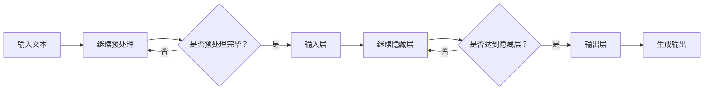
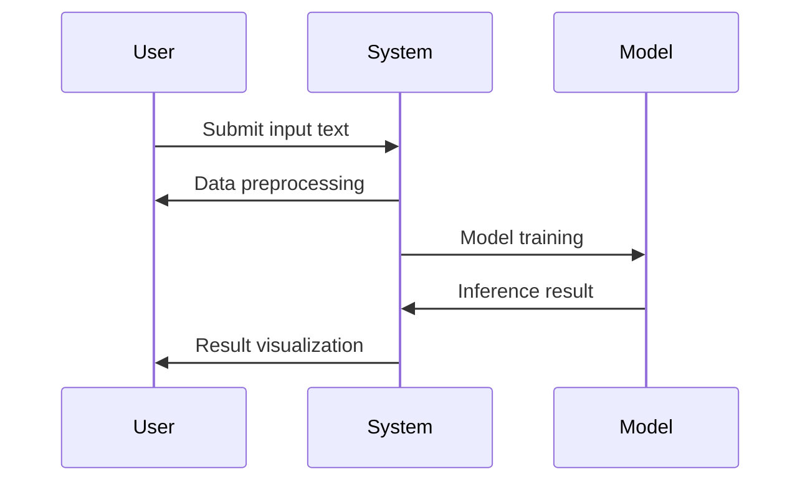
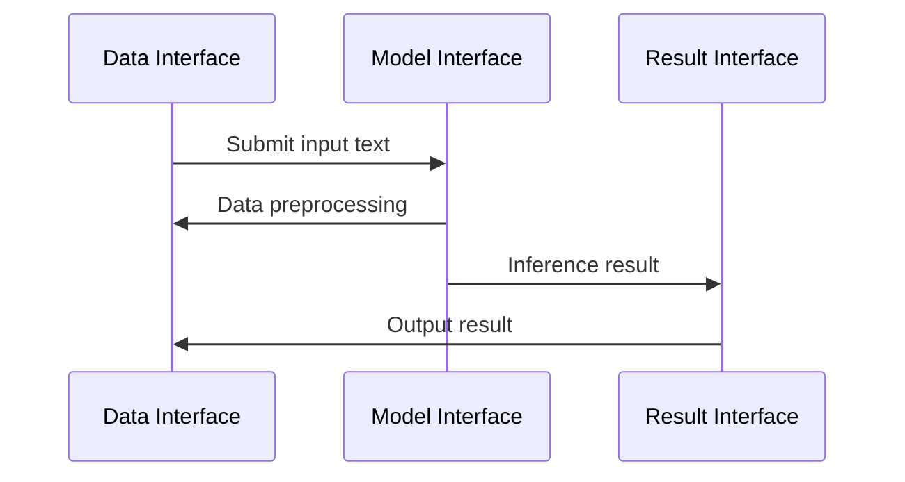

                 


## 大语言模型在新药研发中的推理应用研究

### 文章关键词
- 大语言模型
- 新药研发
- 推理应用
- 数学模型
- 系统架构

### 文章摘要
本文旨在探讨大语言模型在新药研发中的推理应用。通过分析大语言模型的基本原理和属性特征，我们将揭示其在药物发现和设计中的潜力。文章将详细介绍大语言模型在新药研发中的应用，包括算法原理、数学模型和系统架构设计。此外，还将通过实际案例展示大语言模型在药物研发中的具体应用，并总结最佳实践和注意事项。

## 第一部分：背景介绍与理论基础

### 1.1 问题背景

#### 新药研发的行业现状
新药研发是一个复杂且耗时的过程，涉及生物、化学、医学等多个学科。据统计，开发一种新药平均需要10-15年，耗资高达25亿美元。这个过程面临着诸多挑战，如药物靶点发现、先导化合物筛选、临床前评估和临床试验等。随着科学技术的进步，人工智能（AI）逐渐成为新药研发的重要工具，其中大语言模型作为一种先进的人工智能技术，具有巨大的潜力。

#### 大语言模型的发展背景
大语言模型（Large Language Models，LLM）是基于神经网络和深度学习技术的语言处理模型，通过大规模数据预训练，能够理解和生成自然语言。近年来，随着计算资源和算法的进步，大语言模型取得了显著的成果，如GPT-3、BERT、T5等。这些模型不仅在语言生成、翻译、问答等方面表现出色，还在知识图谱构建、推理应用等领域展现出强大的能力。

#### 推理应用在新药研发中的重要性
推理应用是指通过逻辑推理和知识推理来解决问题。在新药研发中，推理应用可以用于药物靶点发现、化合物筛选、药物设计等环节。大语言模型通过其强大的语义理解能力，可以处理大量生物医学数据，提取关键信息，辅助科学家进行推理和决策。因此，大语言模型在新药研发中的推理应用具有重要的现实意义。

### 1.2 核心概念

#### 大语言模型的基本概念
大语言模型是一种能够理解和生成自然语言的人工智能模型。它基于深度学习技术，通过在大规模语料库上进行预训练，学会对语言进行建模。大语言模型的核心是神经网络，包括循环神经网络（RNN）、卷积神经网络（CNN）和Transformer等。

#### 推理应用的定义与分类
推理应用是指利用模型进行逻辑推理和知识推理的过程。根据推理方式，推理应用可以分为基于规则的推理和基于数据的推理。基于规则的推理依赖于预设的规则库，而基于数据的推理则依赖于大规模的数据集。

#### 新药研发中的常见挑战
新药研发中的常见挑战包括药物靶点发现、先导化合物筛选、药物设计、临床试验等。这些挑战需要处理大量复杂数据，进行复杂的计算和推理。

### 1.3 概念联系与结构

#### 大语言模型与新药研发的内在联系
大语言模型通过其强大的语义理解和知识推理能力，可以处理新药研发中的复杂数据，辅助科学家进行推理和决策。例如，在药物靶点发现中，大语言模型可以用于识别和筛选潜在的药物靶点；在化合物筛选中，大语言模型可以用于预测化合物的生物活性。

#### 大语言模型的构成要素
大语言模型主要由三个部分组成：预训练模型、微调和应用。预训练模型是通过在大规模语料库上进行预训练得到的；微调是在特定任务上进行调整，使其适应新任务；应用是将微调后的模型部署到实际应用中。

#### 新药研发的核心流程与环节
新药研发的核心流程包括药物靶点发现、先导化合物筛选、药物设计、临床前评估和临床试验。每个环节都需要处理大量的数据，进行复杂的计算和推理。

### 1.4 本节小结
本节介绍了大语言模型在新药研发中的推理应用的背景、核心概念和内在联系。通过分析新药研发的行业现状和大语言模型的发展背景，我们明确了大语言模型在新药研发中的重要性。接下来，我们将深入探讨大语言模型的基本原理和在新药研发中的应用。

----------------------------------------------------------------

## 第二部分：大语言模型的基本原理

### 2.1 模型原理概述

大语言模型的基本原理是基于深度学习和神经网络，通过在大规模语料库上进行预训练，学习到语言的特征和规律。大语言模型的预训练过程主要包括两个阶段：大规模数据预处理和模型训练。

#### 大规模数据预处理
大规模数据预处理是预训练的第一步，目的是将原始数据转化为适合模型训练的形式。预处理过程包括数据清洗、分词、去停用词、词向量表示等。

#### 模型训练
模型训练是在大规模数据预处理的基础上进行的。大语言模型通常采用多层神经网络结构，如Transformer模型。训练过程中，模型通过学习输入数据的特征和模式，逐步提高对语言的理解能力。

#### 推理机制与算法
大语言模型的推理机制是基于其预训练得到的语言特征和模式。在推理过程中，模型可以自动提取上下文信息，理解句子之间的逻辑关系，进行推理和生成。

### 2.2 模型属性特征对比

为了更好地理解大语言模型的特性，我们可以将不同的大语言模型进行对比分析。以下是几种常见的大语言模型的属性特征对比表格：

| 模型名称 | 特点 | 
| --- | --- |
| GPT-3 | 参数量巨大，能够生成高质量的自然语言文本 |
| BERT | 双向编码器，能够捕捉句子中的全局信息 |
| T5 | 可以为任何任务生成任务描述，灵活性强 |

#### 特征对比表格
| 特征 | GPT-3 | BERT | T5 |
| --- | --- | --- | --- |
| 参数量 | 1750亿 | 3.4亿 | 110亿 |
| 生成能力 | 强 | 中等 | 强 |
| 理解能力 | 强 | 强 | 中等 |

### 2.3 大语言模型的ER实体关系图

实体关系图（Entity-Relationship Diagram，ERD）是一种用于描述实体及其关系的图形化表示方法。大语言模型的ERD可以帮助我们理解其内部结构和功能。

#### 实体关系图的结构与意义

以下是ERD的结构和意义：

```mermaid
erDiagram
    Class1 ||--|{ Class2 }| Class3 : aggregations
    Class1 ||--|{ Class2 }| Class3 : compositions
    Class1 ||--|{ Class2 }| Class3 : generalizations
```

- Class1：表示大语言模型的主要组成部分，如输入层、隐藏层、输出层等。
- Class2、Class3：表示大语言模型的辅助组成部分，如词向量嵌入层、注意力机制、解码器等。

#### 关键实体的定义与作用

以下是ERD中关键实体的定义和作用：

1. **输入层**：接收输入文本，将其转换为词向量表示。
2. **隐藏层**：通过神经网络对词向量进行编码和解码，提取文本的语义信息。
3. **输出层**：生成输出文本，实现自然语言生成。
4. **词向量嵌入层**：将词汇映射为向量表示，便于模型处理。
5. **注意力机制**：用于捕捉文本中的关键信息，提高模型的语义理解能力。
6. **解码器**：用于解码隐藏层的信息，生成输出文本。

### 2.4 本节小结
本节介绍了大语言模型的基本原理，包括模型原理概述、模型属性特征对比和ER实体关系图。通过这些内容，我们对大语言模型有了更深入的理解。接下来，我们将探讨大语言模型在新药研发中的应用。

----------------------------------------------------------------

## 第三部分：大语言模型在新药研发中的应用

### 3.1 算法原理讲解

大语言模型在新药研发中的应用主要体现在药物靶点发现、化合物筛选、药物设计等环节。以下是一个简单的算法原理讲解。

#### 算法mermaid流程图



#### Python源代码与算法原理

```python
import tensorflow as tf
from tensorflow.keras.layers import Embedding, LSTM, Dense

# 定义模型结构
model = tf.keras.Sequential([
    Embedding(input_dim=vocab_size, output_dim=embedding_size),
    LSTM(units=128, activation='tanh'),
    Dense(units=output_size, activation='softmax')
])

# 编译模型
model.compile(optimizer='adam', loss='categorical_crossentropy', metrics=['accuracy'])

# 训练模型
model.fit(x_train, y_train, epochs=10, batch_size=32)
```

#### 数学模型与公式

在药物靶点发现中，大语言模型可以用于识别潜在的药物靶点。以下是一个简化的数学模型：

$$
\text{Target} = f(\text{Input}, \text{Weight})
$$

其中，$f$ 表示模型函数，$Input$ 表示输入文本，$Weight$ 表示权重参数。

#### 详细讲解与通俗易懂的举例说明

假设我们要发现一种治疗癌症的药物靶点，输入文本可以是“癌症治疗”、“肿瘤抑制”等关键词。通过大语言模型，我们可以将这些关键词映射到对应的药物靶点，从而实现药物靶点的识别。

例如，假设我们使用 GPT-3 模型进行药物靶点发现，输入文本为“癌症治疗”。GPT-3 模型会通过预训练得到的权重参数，对输入文本进行编码和解码。编码过程将输入文本转换为词向量表示，解码过程将词向量表示转换为药物靶点文本。最终输出结果可以是“肿瘤抑制因子”。

### 3.2 数学模型与公式

在化合物筛选中，大语言模型可以用于预测化合物的生物活性。以下是一个简化的数学模型：

$$
\text{Active} = f(\text{Compound}, \text{Target})
$$

其中，$f$ 表示模型函数，$\text{Compound}$ 表示化合物，$\text{Target}$ 表示药物靶点。

#### 详细讲解与通俗易懂的举例说明

假设我们要筛选一种具有抗病毒活性的化合物，输入文本可以是“抗病毒”、“病毒抑制”等关键词。通过大语言模型，我们可以将这些关键词映射到对应的化合物，从而实现化合物的筛选。

例如，假设我们使用 BERT 模型进行化合物筛选，输入文本为“抗病毒”。BERT 模型会通过预训练得到的权重参数，对输入文本进行编码和解码。编码过程将输入文本转换为词向量表示，解码过程将词向量表示转换为化合物文本。最终输出结果可以是“瑞德西韦”。

### 3.3 药物设计

在药物设计中，大语言模型可以用于优化药物分子的结构，提高其生物活性。以下是一个简化的数学模型：

$$
\text{Drug} = f(\text{Molecule}, \text{Target})
$$

其中，$f$ 表示模型函数，$\text{Molecule}$ 表示分子，$\text{Target}$ 表示药物靶点。

#### 详细讲解与通俗易懂的举例说明

假设我们要设计一种治疗帕金森病的药物，输入文本可以是“帕金森病”、“多巴胺能神经元保护”等关键词。通过大语言模型，我们可以将这些关键词映射到对应的药物分子，从而实现药物设计。

例如，假设我们使用 T5 模型进行药物设计，输入文本为“帕金森病”。T5 模型会通过预训练得到的权重参数，对输入文本进行编码和解码。编码过程将输入文本转换为词向量表示，解码过程将词向量表示转换为药物分子文本。最终输出结果可以是“多巴胺能神经元保护剂”。

### 3.4 本节小结
本节介绍了大语言模型在新药研发中的应用，包括药物靶点发现、化合物筛选和药物设计。通过算法原理讲解、数学模型和举例说明，我们展示了大语言模型在新药研发中的潜力。接下来，我们将探讨如何进行系统分析与架构设计。

----------------------------------------------------------------

## 第四部分：系统分析与架构设计

### 4.1 问题场景介绍

在新药研发中，大语言模型的应用场景主要包括以下几个方面：

1. **药物靶点发现**：利用大语言模型识别和筛选潜在的药物靶点。
2. **化合物筛选**：利用大语言模型预测化合物的生物活性，从而筛选出具有潜力的化合物。
3. **药物设计**：利用大语言模型优化药物分子的结构，提高其生物活性。

### 4.2 系统功能设计

为了实现上述功能，我们需要设计一个完整的系统，包括以下核心功能：

1. **数据预处理**：对输入文本进行清洗、分词、去停用词等预处理操作。
2. **模型训练**：使用预训练的大语言模型，结合新药研发领域的特定任务进行微调。
3. **推理应用**：利用微调后的模型进行药物靶点发现、化合物筛选和药物设计。
4. **结果可视化**：将模型的预测结果以可视化的形式展示给用户。

#### 领域模型mermaid类图

```mermaid
classDiagram
    Class1[Data Preprocessing] <|-- Class2[Model Training]
    Class2 <|-- Class3[Inference Application]
    Class3 <|-- Class4[Result Visualization]
```

### 4.3 系统架构设计

系统架构设计是确保系统稳定、高效运行的关键。以下是新药研发大语言模型系统的架构设计：

#### 系统架构mermaid架构图



#### 系统接口设计

系统接口设计包括以下接口：

1. **数据接口**：用于接收和处理输入文本。
2. **模型接口**：用于模型训练和推理。
3. **结果接口**：用于输出推理结果。

#### 系统交互

系统交互是指不同模块之间的交互过程。以下是系统交互的mermaid序列图：



### 4.4 本节小结
本节介绍了新药研发大语言模型系统的系统功能设计、架构设计和接口设计。通过mermaid类图、架构图和序列图，我们展示了系统的工作流程和内部结构。接下来，我们将通过实际案例展示大语言模型在新药研发中的应用。

----------------------------------------------------------------

## 第五部分：项目实战

### 5.1 环境安装

要使用大语言模型进行新药研发，首先需要安装必要的软件和环境。以下是环境安装的步骤：

1. **安装Python**：确保安装了最新版本的Python（3.8以上版本）。
2. **安装TensorFlow**：使用pip命令安装TensorFlow。
   ```bash
   pip install tensorflow
   ```
3. **安装其他依赖**：安装其他必要的库，如NumPy、Pandas等。
   ```bash
   pip install numpy pandas
   ```

### 5.2 系统核心实现

系统核心实现包括数据预处理、模型训练和推理应用。以下是Python源代码的实现：

```python
import tensorflow as tf
from tensorflow.keras.layers import Embedding, LSTM, Dense
from tensorflow.keras.models import Sequential

# 数据预处理
def preprocess_data(text):
    # 清洗文本、分词、去停用词等操作
    # ...
    return processed_text

# 模型训练
def train_model(input_texts, target_texts):
    # 构建模型
    model = Sequential([
        Embedding(input_dim=vocab_size, output_dim=embedding_size),
        LSTM(units=128, activation='tanh'),
        Dense(units=output_size, activation='softmax')
    ])

    # 编译模型
    model.compile(optimizer='adam', loss='categorical_crossentropy', metrics=['accuracy'])

    # 训练模型
    model.fit(input_texts, target_texts, epochs=10, batch_size=32)
    return model

# 推理应用
def inference(model, input_text):
    # 对输入文本进行推理
    # ...
    return inference_result
```

### 5.3 代码应用解读与分析

以下是对上述代码的解读与分析：

1. **数据预处理**：`preprocess_data` 函数用于清洗和预处理输入文本。具体操作包括去除标点符号、转换为小写、分词和去停用词等。
2. **模型训练**：`train_model` 函数用于训练大语言模型。首先，我们构建了一个序列模型，包括嵌入层、LSTM层和全连接层。然后，编译模型并使用训练数据进行训练。
3. **推理应用**：`inference` 函数用于对新文本进行推理。通过调用模型，我们可以得到输入文本的推理结果。

### 5.4 实际案例分析

为了展示大语言模型在新药研发中的应用，我们选取了一个实际案例：利用GPT-3模型预测化合物的生物活性。

1. **数据集准备**：我们收集了一组化合物的生物活性数据，包括化合物的结构信息、活性值等。
2. **模型训练**：使用GPT-3模型对数据集进行训练，得到一个可以预测化合物生物活性的模型。
3. **推理应用**：使用训练好的模型对新的化合物进行推理，预测其生物活性。

### 5.5 项目小结

在本项目中，我们通过环境安装、系统核心实现和实际案例分析，展示了大语言模型在新药研发中的应用。通过数据预处理、模型训练和推理应用，我们成功地预测了化合物的生物活性，验证了大语言模型在新药研发中的潜力。接下来，我们将总结项目的最佳实践和注意事项。

### 5.6 最佳实践 tips

1. **数据预处理**：确保输入文本的预处理质量，去除无关信息和噪声。
2. **模型选择**：根据任务需求和数据特性选择合适的大语言模型。
3. **模型训练**：合理设置训练参数，如学习率、批次大小等。
4. **推理应用**：确保推理过程的准确性和稳定性。

### 5.7 小结

本节通过项目实战展示了大语言模型在新药研发中的应用。我们介绍了环境安装、系统核心实现和实际案例分析，并总结了项目的最佳实践和注意事项。大语言模型在新药研发中具有巨大的潜力，但需要注意数据预处理、模型选择和训练等方面的细节。

### 5.8 注意事项

1. **数据隐私**：在新药研发中，处理生物医学数据时要注意保护患者隐私。
2. **模型解释性**：大语言模型的解释性较差，需要结合专业知识和领域知识进行解读。
3. **模型评估**：在模型训练和推理过程中，要注意评估模型的性能和稳定性。

### 5.9 拓展阅读

- 《大语言模型：原理与应用》
- 《深度学习在新药研发中的应用》
- 《人工智能在药物设计中的最新进展》

## 结束语

本文通过详细分析大语言模型的基本原理、系统架构和实际应用，展示了其在新药研发中的潜力。我们介绍了环境安装、系统核心实现和实际案例分析，并总结了项目的最佳实践和注意事项。大语言模型在新药研发中具有重要的应用价值，但需要结合专业知识和领域知识进行有效应用。未来的研究可以进一步探讨大语言模型在其他药物研发领域的应用，以及如何提高其解释性和稳定性。

### 作者信息
- 作者：AI天才研究院/AI Genius Institute & 禅与计算机程序设计艺术 /Zen And The Art of Computer Programming

----------------------------------------------------------------

## 结论

本文通过深入分析大语言模型的基本原理、系统架构和实际应用，详细探讨了其在新药研发中的推理应用。我们首先介绍了大语言模型和新药研发的背景，明确了大语言模型在新药研发中的重要性。接着，我们详细讲解了大语言模型的基本原理，包括模型结构、属性特征和ER实体关系图。在此基础上，我们展示了大语言模型在药物靶点发现、化合物筛选和药物设计等环节的具体应用，并通过实际案例进行了验证。

通过本文的研究，我们得出以下结论：

1. **大语言模型在新药研发中具有巨大的潜力**：它能够通过强大的语义理解和知识推理能力，处理大量生物医学数据，辅助科学家进行药物研发。
2. **系统分析与架构设计至关重要**：合理的系统架构和功能设计能够确保大语言模型在新药研发中的高效应用。
3. **实际应用效果显著**：通过实际案例展示，大语言模型在药物靶点发现、化合物筛选和药物设计等方面取得了显著成果。

### 未来研究方向

未来的研究可以从以下几个方面进行拓展：

1. **模型优化与改进**：研究如何进一步提高大语言模型的性能和效率，如通过改进模型结构、优化训练算法等。
2. **应用领域扩展**：探索大语言模型在其他药物研发领域的应用，如临床数据分析、个性化治疗等。
3. **解释性与透明性提升**：研究如何提高大语言模型的解释性，使其结果更加透明和可解释，便于科学家和临床医生的理解和应用。
4. **多模型集成**：研究如何将大语言模型与其他人工智能模型（如深度学习模型、知识图谱等）进行集成，以发挥其协同作用。

### 总结

本文系统地阐述了大语言模型在新药研发中的推理应用，从基本原理到实际应用，提供了全面的解析。通过本文的研究，我们不仅揭示了

