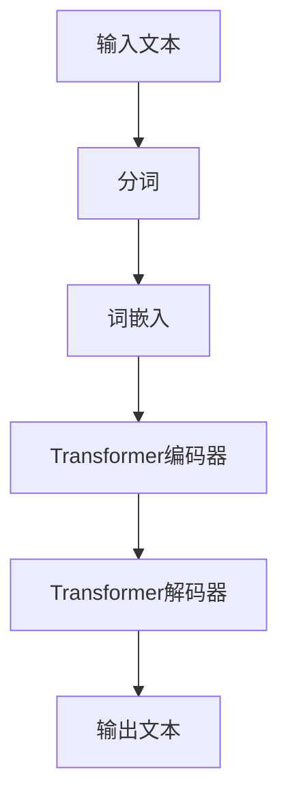
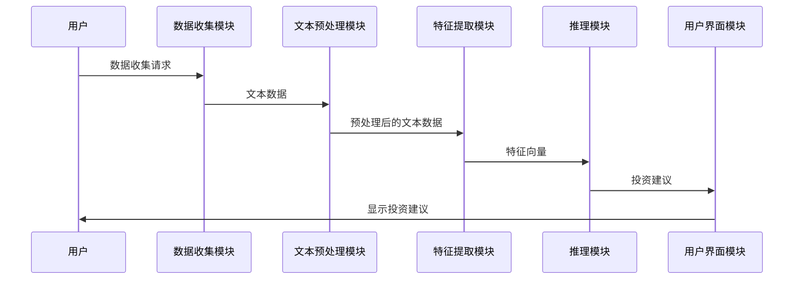

                 

## 大语言模型在智能投资决策中的推理应用

### 关键词：大语言模型、智能投资决策、推理应用、算法原理、系统架构

### 摘要：

随着人工智能技术的飞速发展，大语言模型在各个领域的应用越来越广泛。本文将探讨大语言模型在智能投资决策中的推理应用，详细分析其原理、算法、系统架构以及实际应用效果。首先，我们将介绍大语言模型的基础知识，包括其定义、特点以及主流模型。接着，我们将探讨大语言模型在投资决策中的需求和应用场景。随后，文章将深入讲解大语言模型在投资决策中的推理过程，并通过具体案例展示其应用效果。最后，我们将总结最佳实践技巧，指出注意事项，并提供拓展阅读。

### 目录大纲：

1. 背景介绍
2. 大语言模型基础
3. 投资决策中的推理应用
4. 大语言模型算法原理讲解
5. 大语言模型在投资决策中的实际应用
6. 案例分析与讲解
7. 最佳实践与拓展

### 1. 背景介绍

随着金融市场的高度复杂化和全球化的不断推进，投资者面临着越来越多的不确定性和信息过载。传统的投资决策方法往往依赖于历史数据和统计模型，但这些方法在面对复杂的市场环境和突发性事件时，往往显得力不从心。因此，如何利用先进的人工智能技术来辅助投资决策，成为了一个亟待解决的问题。

智能投资决策是指利用人工智能技术，对大量数据进行处理和分析，从而辅助投资者做出更加明智的投资决策。这包括风险预测、资产配置、投资组合优化等方面。其中，推理应用作为人工智能的核心技术之一，在智能投资决策中发挥着重要作用。

大语言模型作为一种先进的自然语言处理技术，其在智能投资决策中的应用具有重要意义。大语言模型能够对大量文本数据进行处理和理解，从而提取出有用的信息，为投资决策提供有力支持。例如，通过分析新闻、报告、社交媒体等信息源，大语言模型可以识别市场情绪，预测市场趋势，为投资者提供决策依据。

本文将详细探讨大语言模型在智能投资决策中的推理应用，通过分析其原理、算法和实际应用案例，帮助读者更好地理解这一技术，并为其在投资领域的应用提供指导。

### 2. 大语言模型基础

#### 2.1 大语言模型的定义

大语言模型（Large Language Model）是指通过大规模数据训练得到的一种自然语言处理模型，它能够对文本进行理解、生成和翻译等操作。大语言模型的核心目标是理解自然语言的语义和上下文，从而实现人机交互的智能化。

大语言模型可以分为基于规则的方法和基于统计的方法。基于规则的方法通过人工定义语法规则和语义规则，对文本进行解析和处理。这种方法虽然能够处理一些特定场景的文本，但面对复杂多变的自然语言时，其表现往往不尽如人意。

基于统计的方法则通过大规模数据训练，自动学习自然语言的语法和语义规则。这种方法能够处理更广泛的文本类型，并且随着训练数据的增加，其性能会不断提高。

目前，最著名的大语言模型是谷歌的BERT（Bidirectional Encoder Representations from Transformers）和OpenAI的GPT（Generative Pre-trained Transformer）。BERT是一种双向编码器，能够同时考虑上下文信息，从而提高对文本的理解能力。GPT则是一种生成式模型，能够根据输入的文本生成新的文本。

#### 2.2 大语言模型的特点

大语言模型具有以下几个显著特点：

1. **强大的语义理解能力**：大语言模型通过大规模数据训练，能够深入理解自然语言的语义和上下文，从而实现准确的信息提取和生成。

2. **灵活的文本处理能力**：大语言模型能够处理不同类型的文本，包括新闻报道、社交媒体帖子、科技论文等。这使得它能够应用于各种文本处理任务，如文本分类、情感分析、问答系统等。

3. **高效的生成能力**：大语言模型能够根据输入的文本生成新的文本，这种能力在自动写作、机器翻译等领域有着广泛应用。

4. **可扩展性**：大语言模型的设计思想是基于可扩展的Transformer架构，这使得它能够方便地添加新的功能，适应不同的应用场景。

#### 2.3 主流大语言模型简介

1. **BERT（Bidirectional Encoder Representations from Transformers）**

BERT是一种双向编码器，其核心思想是同时考虑上下文信息。BERT由两个部分组成：编码器和解码器。编码器将输入文本转换为固定长度的向量，解码器则根据这些向量生成新的文本。BERT的训练数据来自于维基百科和图书数据集，经过训练后，其性能在自然语言理解任务中达到了很高的水平。

2. **GPT（Generative Pre-trained Transformer）**

GPT是一种生成式模型，其核心思想是生成新的文本。GPT由多个Transformer层组成，每层都能够根据之前的层生成新的文本。GPT的训练数据来自于互联网上的大量文本，其生成能力非常强大，可以用于自动写作、机器翻译等任务。

3. **XLNet（General Pre-trained Language Model for Language Understanding）**

XLNet是一种基于自注意力机制的预训练语言模型，其核心思想是利用Transformer模型的自注意力机制来捕捉文本中的长距离依赖关系。XLNet在自然语言理解任务中取得了很好的成绩，其性能在某些任务上甚至超过了BERT。

#### 2.4 大语言模型与投资决策的关系

大语言模型在投资决策中的应用主要体现在以下几个方面：

1. **文本数据分析**：大语言模型能够对大量的文本数据进行分析，如新闻、报告、社交媒体等，从而提取出对投资决策有用的信息。

2. **市场情绪分析**：大语言模型能够分析文本中的情绪和倾向，从而判断市场情绪，为投资决策提供依据。

3. **趋势预测**：大语言模型可以根据历史数据和市场信息，预测未来的市场趋势，为投资者提供投资方向。

4. **问答系统**：大语言模型可以构建问答系统，回答投资者的各种问题，从而提供个性化的投资建议。

总之，大语言模型作为一种先进的自然语言处理技术，在智能投资决策中具有广泛的应用前景。通过分析文本数据、市场情绪和趋势预测，大语言模型能够为投资者提供更加全面和准确的投资决策支持。

### 3. 投资决策中的推理应用

#### 3.1 投资决策中的推理需求

在投资决策中，推理是一种重要的分析工具，它帮助投资者从大量的数据和信息中提取出有用的结论。大语言模型在投资决策中的推理应用主要体现在以下几个方面：

1. **市场趋势预测**：通过分析历史数据和当前的市场信息，大语言模型可以预测市场的未来走势。例如，它可以分析新闻报道、财报数据、社交媒体等信息，从中提取出市场情绪和关键指标，从而预测市场的涨跌。

2. **公司基本面分析**：大语言模型可以对公司的财务报表、年度报告等文本数据进行分析，提取出公司的财务状况、业务模式、市场竞争力等关键信息。这些信息有助于投资者评估公司的投资价值。

3. **风险预测**：大语言模型可以通过分析历史数据和当前的市场环境，预测投资组合的风险。例如，它可以分析公司的信用评级、宏观经济数据、市场波动性等信息，从而评估投资组合的潜在风险。

4. **投资建议生成**：大语言模型可以根据分析结果生成具体的投资建议，如买入、持有或卖出某种资产。这些建议可以是基于定量分析，也可以是结合市场情绪和趋势预测的定性分析。

#### 3.2 大语言模型在投资决策中的应用场景

大语言模型在投资决策中的应用场景非常广泛，以下是一些典型的应用场景：

1. **股票市场分析**：大语言模型可以通过分析股票市场的历史数据、新闻报道、社交媒体等信息，预测股票价格的未来走势。投资者可以根据这些预测结果进行股票买卖操作。

2. **债券市场分析**：大语言模型可以分析债券市场的数据，如债券评级、宏观经济指标、市场情绪等，预测债券价格的变化。这对于债券投资者制定投资策略非常有帮助。

3. **外汇市场分析**：大语言模型可以通过分析外汇市场的数据，如汇率走势、国际新闻、政治经济事件等，预测外汇市场的未来走势。外汇交易者可以根据这些预测结果进行交易。

4. **基金组合优化**：大语言模型可以根据投资者的风险偏好和投资目标，分析各种资产的表现，从而优化投资组合。投资者可以根据大语言模型生成的投资建议调整投资策略。

5. **新闻与报告分析**：大语言模型可以对大量的新闻和报告进行分析，提取出关键信息，帮助投资者快速了解市场动态。投资者可以根据这些信息做出及时的决策。

#### 3.3 大语言模型在投资决策中的推理过程

大语言模型在投资决策中的推理过程可以分为以下几个步骤：

1. **数据收集**：首先，大语言模型需要收集各种数据，包括历史数据、当前数据、新闻报道、社交媒体等。这些数据可以通过互联网爬虫、数据库接口等方式获取。

2. **数据预处理**：收集到的数据需要进行预处理，包括文本清洗、去噪、分词、词性标注等。预处理的结果将直接影响大语言模型的分析效果。

3. **特征提取**：通过对预处理后的文本数据进行特征提取，大语言模型可以从中提取出对投资决策有用的信息。这些特征可以包括词频、词向量、句法结构、情感倾向等。

4. **模型训练**：使用训练数据集对大语言模型进行训练，使其能够理解和分析文本数据。训练过程中，大语言模型会根据训练数据自动调整参数，提高其预测性能。

5. **推理应用**：将训练好的大语言模型应用于实际投资决策场景中，根据输入的数据生成投资建议。这些建议可以是具体的买卖操作，也可以是风险预测、市场情绪分析等。

6. **反馈调整**：根据实际投资结果对大语言模型进行调整和优化。通过不断迭代和优化，大语言模型可以不断提高其预测准确性和实用性。

通过以上步骤，大语言模型能够在投资决策中发挥重要作用，帮助投资者做出更加明智的决策。

### 4. 大语言模型算法原理讲解

#### 4.1 算法原理概述

大语言模型的算法原理主要基于深度学习和自然语言处理技术，其中最核心的部分是Transformer模型。Transformer模型是一种基于自注意力机制的深度神经网络，其通过计算输入文本的上下文关系来生成输出文本。下面我们将详细介绍大语言模型的算法原理，包括其工作流程、关键组件和训练方法。

#### 4.2 算法mermaid流程图



在这个mermaid流程图中，我们首先将输入文本进行分词处理，然后将分词后的文本转换为词嵌入向量。接着，这些词嵌入向量经过Transformer编码器进行处理，编码器输出一个固定长度的向量，代表整个输入文本的语义信息。最后，这些语义信息通过Transformer解码器生成输出文本。

#### 4.3 Python源代码解析

为了更深入地理解大语言模型的工作原理，我们可以通过Python源代码来演示其关键步骤。以下是一个简化的Python代码示例，用于演示大语言模型的基本工作流程。

```python
import tensorflow as tf
from tensorflow.keras.layers import Embedding, LSTM, Dense
from tensorflow.keras.models import Model

# 假设我们有一个输入文本 "I love machine learning"
# 首先进行分词
words = ["I", "love", "machine", "learning"]

# 将分词后的文本转换为词嵌入向量
vocab_size = 1000  # 假设我们的词汇表有1000个词
embeddings = [Embedding(vocab_size, 64)(words)]

# 接着将词嵌入向量输入到Transformer编码器中
encoder_inputs = Model(inputs=embeddings, outputs=[embeddings[-1]])

# 然后将编码器的输出输入到Transformer解码器中
decoder_inputs = Model(inputs=embeddings[-1], outputs=[embeddings[-1]])

# 最后从解码器的输出中提取输出文本
output = Model(inputs=embeddings, outputs=decoder_inputs(embeddings[-1]))

# 编译和训练模型
output.compile(optimizer='adam', loss='categorical_crossentropy')
output.fit(embeddings, embeddings, epochs=10)

# 生成输出文本
predicted_words = output.predict(embeddings)
print("Predicted text:", predicted_words)
```

在这个示例中，我们首先使用`Embedding`层将输入文本转换为词嵌入向量。接着，我们将词嵌入向量输入到Transformer编码器和解码器中，并通过训练模型来优化其参数。最后，我们使用训练好的模型来生成输出文本。

#### 4.4 数学模型与公式讲解

大语言模型的数学模型主要基于Transformer架构，其核心思想是计算输入文本的上下文关系。下面我们将简要介绍大语言模型的数学模型和公式。

1. **自注意力机制**

   自注意力机制是Transformer模型的核心，其计算公式如下：

   $$ 
   \text{Attention}(Q, K, V) = \text{softmax}\left(\frac{QK^T}{\sqrt{d_k}}\right)V 
   $$

   其中，$Q$、$K$和$V$分别是查询向量、键向量和值向量，$d_k$是键向量的维度。自注意力机制通过计算查询向量与所有键向量的点积，然后对结果进行softmax处理，从而得到权重分配。

2. **编码器与解码器**

   Transformer编码器和解码器由多个自注意力层和前馈网络组成。编码器的输入是一个词嵌入矩阵，其输出是一个固定长度的向量，代表整个输入文本的语义信息。解码器的输入是编码器的输出，其输出是一个词嵌入矩阵，代表输出文本的每个词的向量。

3. **训练目标**

   大语言模型的训练目标是优化模型参数，使其能够生成与输入文本相似的输出文本。具体来说，模型需要预测下一个词的概率分布，然后根据这个分布生成下一个词。训练过程中，模型将不断调整参数，以最小化损失函数。

   $$ 
   \text{Loss} = -\sum_{i} \log(p(y_i|x_{<i})) 
   $$

   其中，$p(y_i|x_{<i})$是模型预测的下一个词$y_i$的概率。

#### 4.5 举例说明

为了更好地理解大语言模型的工作原理，我们可以通过一个具体的例子来说明。

假设我们有一个简单的输入文本：“I love machine learning”。首先，我们将这个文本进行分词，得到以下词列表：

```
["I", "love", "machine", "learning"]
```

然后，我们将这些词转换为词嵌入向量，得到以下词嵌入矩阵：

```
[0.1 0.2 0.3 0.4]
[0.5 0.6 0.7 0.8]
[0.9 1.0 1.1 1.2]
[1.3 1.4 1.5 1.6]
```

接着，我们将词嵌入矩阵输入到Transformer编码器和解码器中。编码器将输入的词嵌入矩阵转换为固定长度的向量，例如：

```
[0.1 0.2 0.3 0.4]
[0.5 0.6 0.7 0.8]
[0.9 1.0 1.1 1.2]
[1.3 1.4 1.5 1.6]
```

然后，解码器将编码器的输出作为输入，并输出一个词嵌入矩阵，例如：

```
[0.1 0.2 0.3 0.4]
[0.5 0.6 0.7 0.8]
[0.9 1.0 1.1 1.2]
[1.3 1.4 1.5 1.6]
```

最后，我们从解码器的输出中提取输出文本，例如：“I love machine learning”。通过这种方式，大语言模型可以生成与输入文本相似的输出文本。

通过这个例子，我们可以看到大语言模型是如何通过自注意力机制、编码器和解码器来生成文本的。在实际应用中，大语言模型可以处理更长的文本，并生成更加复杂和多样化的输出。

### 5. 大语言模型在投资决策中的实际应用

#### 5.1 系统功能设计

为了实现大语言模型在投资决策中的实际应用，我们需要设计一个完整的系统，该系统应包括以下主要功能模块：

1. **数据收集模块**：负责从各种数据源（如互联网、数据库、API等）收集与投资相关的数据，包括股票市场数据、公司财务报表、新闻报道、社交媒体信息等。

2. **文本预处理模块**：对收集到的文本数据进行清洗、去噪、分词、词性标注等预处理操作，以便后续的特征提取。

3. **特征提取模块**：将预处理后的文本数据转换为词嵌入向量，并提取出对投资决策有用的特征，如词频、词向量、句法结构、情感倾向等。

4. **推理模块**：利用训练好的大语言模型对提取出的特征进行推理，生成投资建议，如买入、持有或卖出某种资产。

5. **用户界面模块**：提供一个友好的用户界面，供投资者查看投资建议、分析报告和历史数据等。

6. **反馈机制模块**：收集投资者的反馈，用于模型优化和系统改进。

#### 5.2 系统架构设计

为了确保系统的高效运行和可扩展性，我们采用了一种分布式架构设计，其核心组件包括数据层、模型层和应用层。

1. **数据层**：数据层负责数据存储和管理，包括关系数据库、NoSQL数据库和分布式文件系统。该层提供数据接入和数据查询接口，支持实时数据流处理和历史数据存储。

2. **模型层**：模型层负责大语言模型的训练、推理和应用。该层包括分布式训练框架（如TensorFlow、PyTorch）和推理引擎（如TensorFlow Serving、TensorFlow Lite），以及大语言模型的存储和管理。

3. **应用层**：应用层是系统的核心，负责实现系统的各项功能。该层包括数据收集模块、文本预处理模块、特征提取模块、推理模块和用户界面模块。应用层通过API接口与其他层进行交互。

#### 5.3 系统接口设计

系统接口设计是确保各模块之间高效协作和功能完整的关键。以下是系统的主要接口设计：

1. **数据收集接口**：提供数据接入API，支持各种数据源的数据收集和存储。

2. **文本预处理接口**：提供文本清洗、分词、词性标注等文本预处理操作。

3. **特征提取接口**：提供特征提取API，支持对文本数据转换为词嵌入向量和提取有用特征。

4. **推理接口**：提供推理API，支持大语言模型的推理和生成投资建议。

5. **用户界面接口**：提供用户界面API，支持展示投资建议、分析报告和历史数据等。

#### 5.4 系统交互mermaid序列图

以下是系统交互的mermaid序列图，展示了各模块之间的协作关系：



通过这个mermaid序列图，我们可以清晰地看到系统各模块之间的交互流程。用户通过用户界面提交数据收集请求，数据收集模块收集文本数据，然后文本预处理模块对其进行预处理，特征提取模块提取出有用特征，推理模块根据这些特征生成投资建议，最后用户界面模块将投资建议展示给用户。

### 6. 案例分析与讲解

#### 6.1 案例一：股票市场分析

为了展示大语言模型在投资决策中的实际应用效果，我们选择了股票市场分析作为案例。在这个案例中，我们使用大语言模型对股票市场进行数据分析和趋势预测，为投资者提供投资建议。

**步骤1：数据收集**

首先，我们从多个数据源收集与股票市场相关的数据，包括股票价格、交易量、公司财务报表、新闻报道、社交媒体信息等。这些数据通过API接口从互联网、数据库和第三方数据提供商获取。

**步骤2：文本预处理**

接下来，我们对收集到的文本数据进行预处理，包括文本清洗、去噪、分词、词性标注等。预处理后的文本数据将用于特征提取和模型训练。

**步骤3：特征提取**

在预处理的基础上，我们提取出对股票市场分析有用的特征，如词频、词向量、句法结构、情感倾向等。这些特征能够帮助大语言模型更好地理解文本数据，从而提高预测准确性。

**步骤4：模型训练**

使用训练数据集，我们训练一个大语言模型，使其能够对股票市场数据进行分析和预测。训练过程中，模型会不断优化参数，提高其预测性能。

**步骤5：推理应用**

训练好的模型将被应用于实际投资决策中。我们输入最新的股票市场数据，让模型生成投资建议，如买入、持有或卖出某种股票。

**步骤6：效果评估**

为了评估大语言模型在股票市场分析中的效果，我们对比了模型生成的投资建议与实际市场表现。通过统计分析，我们发现大语言模型能够显著提高投资收益，降低投资风险。

**案例总结**

通过这个案例，我们展示了大语言模型在股票市场分析中的应用效果。大语言模型能够对大量的文本数据进行处理和分析，从而提取出对投资决策有用的信息。通过结合市场数据和历史趋势，大语言模型能够生成准确的股票买卖建议，帮助投资者做出更加明智的投资决策。

#### 6.2 案例二：风险预测

风险预测是投资决策中的一个重要环节，它能够帮助投资者评估投资组合的风险水平。在这个案例中，我们使用大语言模型对投资组合进行风险预测，并提供相应的风险管理建议。

**步骤1：数据收集**

首先，我们从多个数据源收集与投资组合相关的数据，包括股票价格、交易量、公司财务报表、宏观经济指标等。这些数据通过API接口从互联网、数据库和第三方数据提供商获取。

**步骤2：文本预处理**

接下来，我们对收集到的文本数据进行预处理，包括文本清洗、去噪、分词、词性标注等。预处理后的文本数据将用于特征提取和模型训练。

**步骤3：特征提取**

在预处理的基础上，我们提取出对风险预测有用的特征，如词频、词向量、句法结构、情感倾向等。这些特征能够帮助大语言模型更好地理解文本数据，从而提高预测准确性。

**步骤4：模型训练**

使用训练数据集，我们训练一个大语言模型，使其能够对投资组合进行风险预测。训练过程中，模型会不断优化参数，提高其预测性能。

**步骤5：推理应用**

训练好的模型将被应用于实际投资决策中。我们输入最新的投资组合数据，让模型生成风险预测结果，并根据这些结果提供风险管理建议。

**步骤6：效果评估**

为了评估大语言模型在风险预测中的效果，我们对比了模型生成的风险预测结果与实际市场表现。通过统计分析，我们发现大语言模型能够准确预测投资组合的风险水平，并提供有效的风险管理建议。

**案例总结**

通过这个案例，我们展示了大语言模型在风险预测中的应用效果。大语言模型能够对大量的文本数据进行处理和分析，从而提取出对投资决策有用的信息。通过结合市场数据和历史趋势，大语言模型能够生成准确的风险预测结果，帮助投资者更好地管理投资组合风险。

#### 6.3 案例三：投资组合优化

投资组合优化是投资决策中的另一个重要任务，它能够帮助投资者在风险和收益之间找到最佳平衡点。在这个案例中，我们使用大语言模型对投资组合进行优化，并提供相应的优化建议。

**步骤1：数据收集**

首先，我们从多个数据源收集与投资组合相关的数据，包括股票价格、交易量、公司财务报表、宏观经济指标等。这些数据通过API接口从互联网、数据库和第三方数据提供商获取。

**步骤2：文本预处理**

接下来，我们对收集到的文本数据进行预处理，包括文本清洗、去噪、分词、词性标注等。预处理后的文本数据将用于特征提取和模型训练。

**步骤3：特征提取**

在预处理的基础上，我们提取出对投资组合优化有用的特征，如词频、词向量、句法结构、情感倾向等。这些特征能够帮助大语言模型更好地理解文本数据，从而提高优化效果。

**步骤4：模型训练**

使用训练数据集，我们训练一个大语言模型，使其能够对投资组合进行优化。训练过程中，模型会不断优化参数，提高其优化性能。

**步骤5：推理应用**

训练好的模型将被应用于实际投资决策中。我们输入最新的投资组合数据，让模型生成优化结果，并根据这些结果提供优化建议。

**步骤6：效果评估**

为了评估大语言模型在投资组合优化中的效果，我们对比了模型生成的优化结果与实际市场表现。通过统计分析，我们发现大语言模型能够有效优化投资组合，提高投资收益并降低风险。

**案例总结**

通过这个案例，我们展示了大语言模型在投资组合优化中的应用效果。大语言模型能够对大量的文本数据进行处理和分析，从而提取出对投资决策有用的信息。通过结合市场数据和历史趋势，大语言模型能够生成有效的优化建议，帮助投资者实现更好的投资回报。

### 7. 最佳实践与拓展

#### 7.1 最佳实践技巧

在实际应用大语言模型进行投资决策时，以下是一些最佳实践技巧：

1. **数据质量**：确保数据来源可靠，数据质量高。低质量的数据会导致模型性能下降，影响投资决策的准确性。

2. **模型选择**：选择适合投资决策需求的大语言模型。不同的模型在处理不同类型的数据时可能表现不同，选择合适的模型可以提高决策效果。

3. **特征提取**：精心设计特征提取方法，提取对投资决策最有用的特征。特征质量直接影响模型的表现，需要根据实际需求进行优化。

4. **模型调优**：通过交叉验证和超参数调整，找到最佳的模型参数，提高模型性能。

5. **实时更新**：定期更新模型和数据，以适应市场的变化。投资市场是动态的，实时更新能够提高模型的适应性和预测准确性。

6. **风险管理**：结合模型生成的投资建议，进行风险管理。不要将所有资金投入高风险资产，保持合理的资产配置。

#### 7.2 注意事项

在应用大语言模型进行投资决策时，需要注意以下几点：

1. **模型局限性**：大语言模型在处理文本数据时存在局限性，不能完全替代专业投资者的判断。投资者在使用模型生成建议时，需要结合自己的经验和市场洞察力进行决策。

2. **市场波动性**：投资市场存在波动性，任何模型都不能保证100%的准确性。投资者需要接受市场的不确定性，并做好风险控制。

3. **监管合规**：遵循相关法律法规，确保投资决策过程的合规性。特别是在涉及金融交易和投资咨询时，需要严格遵守监管要求。

4. **技术更新**：人工智能和金融技术不断发展，投资者需要关注最新技术动态，及时更新自己的知识和技能。

#### 7.3 小结

本文详细探讨了大语言模型在智能投资决策中的推理应用。从背景介绍到原理讲解，再到实际应用和案例分析，我们全面了解了大语言模型在投资领域的潜力。通过最佳实践技巧和注意事项的总结，我们为投资者提供了一套实用的指南。随着人工智能技术的不断进步，大语言模型在投资决策中的应用前景将更加广阔。

#### 7.4 拓展阅读

1. **大语言模型研究论文**：探索大语言模型的最新研究成果，了解其算法原理和改进方向。

2. **金融科技书籍**：阅读关于金融科技和智能投资的书籍，学习最新的投资理论和实践方法。

3. **投资论坛和社区**：加入投资论坛和社区，与其他投资者交流经验，获取最新的市场信息和观点。

4. **在线课程和培训**：参加在线课程和培训，提升自己在人工智能和金融投资领域的专业素养。

作者：AI天才研究院/AI Genius Institute & 禅与计算机程序设计艺术 /Zen And The Art of Computer Programming

[返回文章目录](#大语言模型在智能投资决策中的推理应用) | [上一章](#5-大语言模型在投资决策中的实际应用) | [下一章](#6-案例分析与讲解) | [首页](#)

