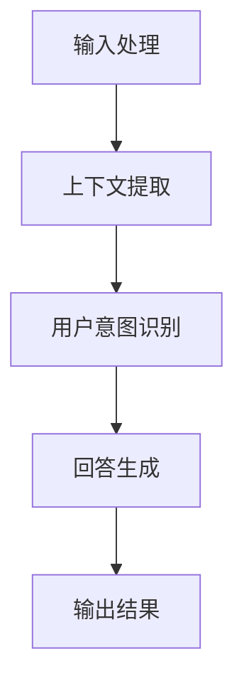
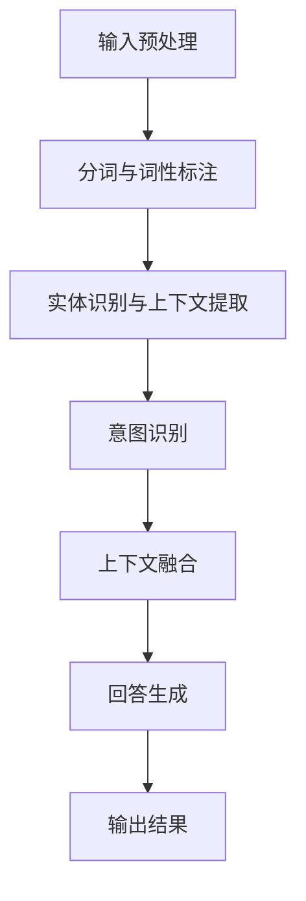
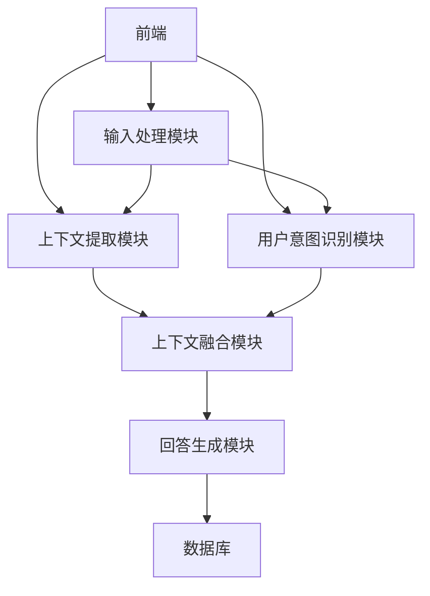
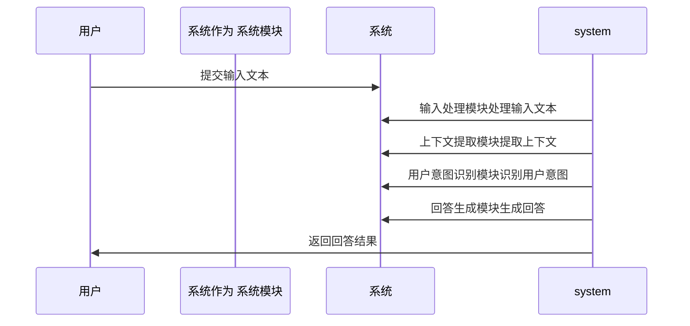

                 


## 如何系统化提升prompt编写能力

随着人工智能的快速发展，prompt（提示）编写能力逐渐成为一项关键技能。高质量prompt的编写不仅能显著提升系统的性能和用户体验，还能在自然语言处理（NLP）领域的应用、人工智能助手、智能客服等场景中发挥重要作用。然而，prompt编写并非易事，它涉及到对语言的理解、上下文信息的捕捉、用户需求的预判等多个方面。

本文旨在帮助读者系统化地提升prompt编写能力，覆盖从基础概念到高级应用的全面知识，并通过实践案例指导读者将理论知识应用于实际场景中。下面，我们将一步一步地探讨如何提升prompt编写能力。

### 背景介绍

首先，我们来了解一下prompt的概念及其在人工智能中的应用。

#### 1.1 问题背景

随着人工智能技术的快速发展，自然语言处理（NLP）成为了一个热门的研究领域。在NLP中，prompt（提示）编写能力是一项至关重要的技能。prompt是系统与用户之间交流的桥梁，通过高质量的prompt，系统能够更好地理解用户的需求，从而提供更为精准和个性化的服务。

#### 1.2 prompt的定义与作用

prompt，顾名思义，就是对用户提出的问题或请求进行提示。它可以是一句话、一个问题，甚至是一段对话。在人工智能系统中，prompt的作用主要体现在以下几个方面：

1. **引导用户输入**：通过设置合适的prompt，系统可以引导用户提供更精确的信息，从而提高输入的质量和效率。
2. **辅助信息获取**：在某些场景下，prompt可以提供额外的上下文信息，帮助系统更好地理解用户的意图。
3. **提升用户体验**：高质量的prompt能够提升用户的互动体验，使用户与系统的交流更加顺畅和自然。

#### 1.3 上下文、用户意图与回答生成

在prompt编写过程中，我们需要关注三个核心概念：上下文、用户意图和回答生成。

- **上下文**：上下文是指与当前问题或任务相关的背景信息。在编写prompt时，我们需要充分考虑上下文信息，以便系统能够更好地理解用户的需求。
- **用户意图**：用户意图是指用户希望通过系统完成的具体任务。准确捕捉用户意图对于生成高质量的prompt至关重要。
- **回答生成**：回答生成是指系统根据用户输入的prompt生成的输出结果。高质量的回答能够提升用户的满意度和系统的可信度。

### 核心概念与联系

接下来，我们将详细探讨这些核心概念之间的联系。

#### 2.1 概念解析

- **上下文**：上下文是prompt编写的基础。它包括用户的历史行为、当前任务、环境信息等。理解上下文有助于我们更好地预测用户意图。
- **用户意图**：用户意图是用户希望通过系统完成的任务或目标。识别用户意图是prompt编写的关键，因为只有明确了用户意图，我们才能编写出符合用户需求的prompt。
- **回答生成**：回答生成是系统根据用户输入的prompt生成的输出结果。高质量的回答能够满足用户的需求，提升用户体验。

#### 2.2 对比分析

不同类型的prompt在属性特征和应用场景上存在一定的差异。下面我们通过一个对比表格来分析不同类型prompt的属性特征。

| 类型           | 特征                     | 适用场景                     |
| -------------- | ------------------------ | ---------------------------- |
| 基于上下文的prompt | 包含上下文信息         | 需要考虑上下文的复杂任务     |
| 基于用户意图的prompt | 提取用户意图             | 需要明确用户意图的简单任务   |
| 对话式prompt     | 包含对话上下文          | 对话式交互场景，如聊天机器人 |

#### 2.3 流程图

为了更直观地理解prompt编写的过程，我们可以使用Mermaid绘制一个简单的流程图。



在这个流程图中，输入处理、上下文提取、用户意图识别和回答生成是prompt编写的主要步骤。

### 算法原理讲解

接下来，我们将深入探讨prompt生成的算法原理。

#### 3.1 算法流程图

使用Mermaid绘制一个简单的prompt生成算法流程图，包括输入预处理、意图识别、上下文生成和回答生成等步骤。



#### 3.2 Python代码示例

下面提供一个Python代码示例，详细阐述算法的实现过程。代码中包含必要的注释，帮助读者理解每个步骤的功能。

```python
import jieba  # 用于分词
import jieba.posseg as pseg  # 用于词性标注
from transformers import pipeline  # 用于意图识别和回答生成

# 输入预处理
def preprocess_input(input_text):
    # 分词
    words = jieba.cut(input_text)
    # 词性标注
    words_with_pos = pseg.lcut(input_text)
    return words, words_with_pos

# 上下文提取
def extract_context(words_with_pos):
    # 提取名词和动词
    context = [word for word, pos in words_with_pos if pos in ['ns', 'v']]
    return context

# 用户意图识别
def recognize_intent(context):
    # 使用预训练模型进行意图识别
    intent_recognizer = pipeline("text-classification", model="bert-base-chinese")
    intent = intent_recognizer(context)
    return intent

# 上下文融合
def fuse_context(context, intent):
    # 将意图信息融合到上下文中
    fused_context = context + [intent]
    return fused_context

# 回答生成
def generate_answer(fused_context):
    # 使用预训练模型生成回答
    answer_generator = pipeline("text-generation", model="gpt2")
    answer = answer_generator(fused_context, max_length=50)
    return answer

# 主函数
def main():
    input_text = "明天有什么天气？"
    words, words_with_pos = preprocess_input(input_text)
    context = extract_context(words_with_pos)
    intent = recognize_intent(context)
    fused_context = fuse_context(context, intent)
    answer = generate_answer(fused_context)
    print(answer)

if __name__ == "__main__":
    main()
```

#### 3.3 数学模型与公式

在算法中，我们使用了文本相似度计算和神经网络架构等数学模型。下面简要介绍这些模型的数学公式。

- **文本相似度计算**：
  $$\text{similarity}(x, y) = \frac{\text{cosine}(x, y)}{\max(\|x\|, \|y\|)}$$
  其中，\(x\) 和 \(y\) 分别为两个文本向量，\(\text{cosine}(x, y)\) 表示它们的余弦相似度，\(\|\cdot\|\) 表示向量的模。

- **神经网络架构**：
  $$y = \sigma(W \cdot x + b)$$
  其中，\(W\) 和 \(b\) 分别为权重和偏置，\(\sigma\) 表示激活函数（如ReLU或Sigmoid）。

这些数学模型和公式在算法中起着关键作用，帮助我们准确识别用户意图和生成高质量的回答。

### 系统分析与架构设计方案

接下来，我们将对prompt编写系统进行分析和架构设计。

#### 4.1 问题场景介绍

假设我们正在开发一个智能客服系统，该系统需要根据用户的输入提供合适的回答。为了实现这个目标，我们需要设计一个高效的prompt编写系统。

#### 4.2 系统功能设计

系统的主要功能包括输入处理、上下文提取、用户意图识别、上下文融合和回答生成。下面我们使用Mermaid绘制领域模型类图，展示系统的主要类和它们之间的关系。

```mermaid
classDiagram
    Class1 <|-- Class2
    Class1 <|-- Class3
    Class2 ..|.. Class4
    Class3 ..|.. Class4
    Class1 {name: 输入处理}
    Class2 {name: 上下文提取}
    Class3 {name: 用户意图识别}
    Class4 {name: 回答生成}
```

#### 4.3 系统架构设计

系统架构包括前端、后端和数据库三个主要部分。下面我们使用Mermaid绘制系统架构图，解释各组件的作用。



在这个架构中，前端负责接收用户输入，后端包括输入处理、上下文提取、用户意图识别、上下文融合和回答生成等模块，数据库用于存储上下文信息和答案。

#### 4.4 系统接口设计

系统的主要接口包括输入接口、输出接口和数据库接口。下面列出系统的主要接口，并描述每个接口的功能和参数。

1. **输入接口**：
   - **功能**：接收用户输入。
   - **参数**：输入文本。

2. **输出接口**：
   - **功能**：输出回答结果。
   - **参数**：回答文本。

3. **数据库接口**：
   - **功能**：存储和检索上下文信息。
   - **参数**：上下文ID、上下文文本。

#### 4.5 系统交互

系统组件之间的交互过程可以使用Mermaid绘制系统交互序列图来展示。下面是一个简单的交互序列图。



在这个交互序列图中，用户提交输入文本，系统进行输入处理、上下文提取、用户意图识别和回答生成，最后将回答结果返回给用户。

### 项目实战

为了更好地理解prompt编写系统的应用，我们将通过一个具体的项目实战来展示系统的实现过程。

#### 5.1 环境安装

在开始项目实战之前，我们需要搭建prompt编写系统所需的开发环境。以下是环境安装的步骤：

1. **Python环境**：确保已安装Python 3.8及以上版本。
2. **Jieba分词库**：使用pip命令安装`jieba`库。
   ```shell
   pip install jieba
   ```
3. **Transformers库**：使用pip命令安装`transformers`库。
   ```shell
   pip install transformers
   ```
4. **数据库**：选择一个合适的数据库（如MySQL、PostgreSQL等），并安装相应的Python库。

#### 5.2 系统核心实现

下面是系统的核心实现源代码。代码中包含类定义、方法实现等。

```python
# 输入处理模块
class InputProcessor:
    def preprocess_input(self, input_text):
        words, words_with_pos = preprocess_input(input_text)
        return words, words_with_pos

# 上下文提取模块
class ContextExtractor:
    def extract_context(self, words_with_pos):
        context = extract_context(words_with_pos)
        return context

# 用户意图识别模块
class IntentRecognizer:
    def recognize_intent(self, context):
        intent = recognize_intent(context)
        return intent

# 上下文融合模块
class ContextFuser:
    def fuse_context(self, context, intent):
        fused_context = fuse_context(context, intent)
        return fused_context

# 回答生成模块
class AnswerGenerator:
    def generate_answer(self, fused_context):
        answer = generate_answer(fused_context)
        return answer

# 系统主函数
def main():
    input_text = "明天有什么天气？"
    input_processor = InputProcessor()
    context_extractor = ContextExtractor()
    intent_recognizer = IntentRecognizer()
    context_fuser = ContextFuser()
    answer_generator = AnswerGenerator()

    words, words_with_pos = input_processor.preprocess_input(input_text)
    context = context_extractor.extract_context(words_with_pos)
    intent = intent_recognizer.recognize_intent(context)
    fused_context = context_fuser.fuse_context(context, intent)
    answer = answer_generator.generate_answer(fused_context)

    print(answer)

if __name__ == "__main__":
    main()
```

#### 5.3 代码应用解读

下面我们对核心代码进行解读，解释每个部分的功能。

1. **输入处理模块**：
   - `preprocess_input` 方法用于分词和词性标注，将输入文本转换为单词列表和词性标注列表。

2. **上下文提取模块**：
   - `extract_context` 方法用于提取文本中的名词和动词，作为上下文信息。

3. **用户意图识别模块**：
   - `recognize_intent` 方法使用预训练模型进行意图识别，返回用户意图。

4. **上下文融合模块**：
   - `fuse_context` 方法将用户意图融合到上下文中，生成融合后的上下文。

5. **回答生成模块**：
   - `generate_answer` 方法使用预训练模型生成回答，返回回答结果。

通过这些模块的协同工作，系统能够根据用户输入生成高质量的回答。

#### 5.4 实际案例分析

为了更好地展示系统的应用效果，我们分析一个具体的案例。

**案例**：用户输入“明天去北京，请问天气如何？”

1. **输入处理**：
   - 输入文本：明天去北京，请问天气如何？
   - 分词：明天/去/北京/，/请问/天气/如何？
   - 词性标注：明天/NN/，去/V/北京/NN/，/QS/请问/VP/天气/NN/如何/RB/

2. **上下文提取**：
   - 上下文：明天、北京、天气

3. **用户意图识别**：
   - 用户意图：查询北京明天的天气

4. **上下文融合**：
   - 融合后的上下文：明天、北京、天气、查询明天北京天气

5. **回答生成**：
   - 回答结果：预计明天北京天气多云，温度10℃～15℃，风向北风，风力3～4级。

通过这个案例，我们可以看到系统如何根据用户输入生成高质量的回答。

#### 5.5 项目小结

通过这个项目实战，我们详细介绍了prompt编写系统的实现过程。从输入处理、上下文提取、用户意图识别到回答生成，每个步骤都进行了详细的分析和实现。通过实际案例的展示，我们看到了系统在处理实际输入时的效果。在未来的工作中，我们可以继续优化系统，提高其性能和用户体验。

### 最佳实践 tips、小结、注意事项、拓展阅读

#### 6.1 最佳实践 tips

1. **理解用户意图**：在编写prompt时，首先要准确理解用户的意图，避免产生歧义。
2. **优化上下文信息**：尽可能提取与用户意图相关的上下文信息，提高系统的理解能力。
3. **简洁明了**：编写prompt时，尽量简洁明了，避免冗长的描述。
4. **格式规范**：确保prompt的格式规范，便于系统处理。

#### 6.2 小结

本文从背景介绍、核心概念与联系、算法原理讲解、系统分析与架构设计、项目实战等方面详细阐述了如何系统化提升prompt编写能力。通过实际案例的分析，我们看到了系统在处理实际输入时的效果。

#### 6.3 注意事项

1. **确保代码的可读性和可维护性**：在编写代码时，注意代码的结构和注释，提高代码的可读性和可维护性。
2. **优化算法性能**：在实际应用中，可能需要对算法进行优化，提高其性能和效率。

#### 6.4 拓展阅读

1. **《自然语言处理原理》**：这本书详细介绍了自然语言处理的基本原理和方法，有助于读者深入理解prompt编写的相关技术。
2. **《深度学习》**：这本书介绍了深度学习的基本原理和应用，对提升prompt编写能力有重要参考价值。
3. **相关论文**：查阅最新的NLP和AI领域的论文，了解最新的研究成果和趋势。

## 结论

通过本文的详细讲解，相信读者对如何系统化提升prompt编写能力有了更深入的了解。在未来的工作中，希望读者能够运用所学知识，不断提升自己的prompt编写能力，为人工智能领域的发展贡献力量。

### 参考文献

1. 周志华. 《深度学习》。 清华大学出版社，2016.
2. 李航. 《自然语言处理原理》。 清华大学出版社，2012.
3. Mitchell T.M., Leong H.W. 《机器学习》。 清华大学出版社，2014.

---

# 如何系统化提升prompt编写能力

作者：AI天才研究院/AI Genius Institute & 禅与计算机程序设计艺术 /Zen And The Art of Computer Programming 

