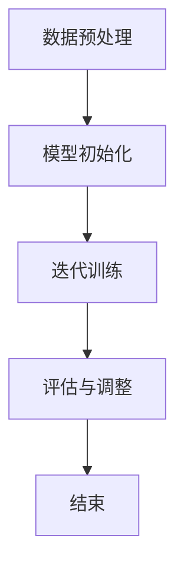
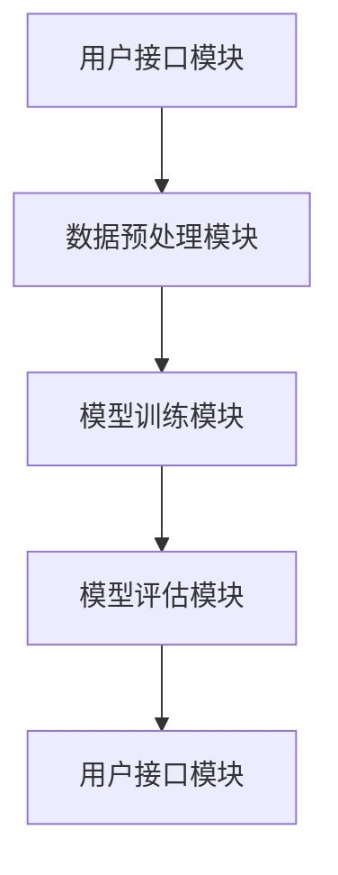
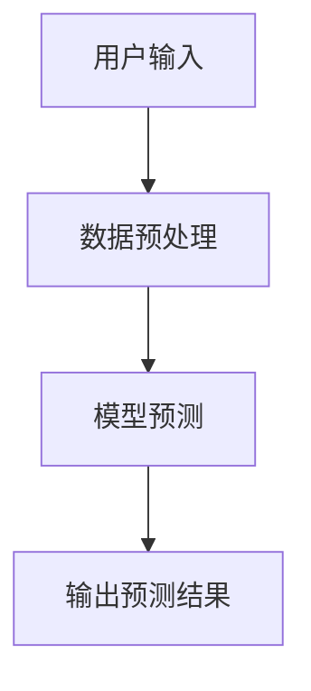

                 

### 文章标题

# 学习速度：评估LLM快速掌握新概念的能力

### 关键词

- 学习速度
- LLM（大型语言模型）
- 快速概念掌握
- 评估方法
- 理论分析
- 算法设计
- 实践案例

### 摘要

本文探讨了学习速度在大型语言模型（LLM）中的应用，重点分析了LLM快速掌握新概念的能力。通过理论分析、算法设计及实践案例，本文旨在提供一个系统的方法来评估LLM在学习新概念过程中的表现，为未来的研究提供有价值的参考。

## 引言

在当今人工智能领域，大型语言模型（LLM）凭借其强大的语义理解和生成能力，已经成为自然语言处理（NLP）领域的重要工具。然而，LLM在学习新概念方面的能力如何，是否能够快速适应并掌握新的知识，是一个值得探讨的问题。

本文将围绕这一主题，首先介绍学习速度的概念，然后探讨LLM学习新概念的能力。接着，我们将分析现有研究，提出评估LLM学习速度的方法。在此基础上，我们将深入探讨LLM的学习原理，并设计一套评估LLM快速掌握新概念的算法。最后，通过实际案例，我们将验证算法的有效性，并讨论未来研究的方向。

## 学习速度：基础概念与评估方法

### 1.1 学习速度的定义

学习速度是指个体在获取新知识或技能时，其能力提升的快慢程度。在人工智能领域，学习速度通常被定义为模型在训练过程中参数更新的速度，以及模型对新的输入数据进行预测或决策的响应时间。

### 1.2 学习速度的评估方法

评估学习速度的方法有很多，其中常用的包括：

- **训练时间**：模型从初始状态到达到预定性能标准所需的时间。
- **测试准确率**：模型在测试集上的表现，通常用准确率、召回率、F1分数等指标来衡量。
- **收敛速度**：模型在训练过程中损失函数下降的速度。

### 1.3 LLM的学习速度

LLM的学习速度受到多种因素的影响，包括：

- **模型架构**：不同架构的LLM学习速度可能有所不同。
- **训练数据**：数据的质量和数量直接影响学习速度。
- **学习策略**：学习算法和超参数设置也会影响学习速度。

## LLM学习新概念的能力分析

### 2.1 LLM学习新概念的优势

LLM在处理自然语言数据方面具有以下优势：

- **强大的语义理解能力**：LLM能够理解并处理复杂的语义信息。
- **自适应能力**：LLM可以根据新的输入数据快速调整自己的模型参数。
- **大规模预训练**：LLM通过大规模预训练积累了丰富的知识，有助于快速掌握新概念。

### 2.2 LLM学习新概念的挑战

尽管LLM在处理自然语言数据方面具有优势，但以下挑战也需要关注：

- **数据依赖性**：LLM的学习效果高度依赖于训练数据的质量和数量。
- **过拟合风险**：LLM容易在训练数据上过拟合，导致在测试数据上的表现不佳。
- **计算资源需求**：训练和部署LLM需要大量的计算资源。

### 2.3 评估LLM学习新概念的能力

为了评估LLM学习新概念的能力，我们可以采用以下方法：

- **实验设计**：设计一系列实验来测试LLM在不同场景下的表现。
- **评估指标**：选择合适的评估指标，如准确率、召回率、F1分数等。
- **对比实验**：将LLM与其他学习模型进行比较，以评估其学习新概念的能力。

## LLM学习原理

### 3.1 语言模型基础

语言模型是LLM的核心组成部分，它能够根据输入序列生成概率分布。常用的语言模型包括：

- **n元语法模型**：基于n个连续单词的概率分布。
- **循环神经网络（RNN）**：能够处理变长序列数据。
- **变换器（Transformer）**：基于自注意力机制的模型，具有更高的并行计算效率。

### 3.2 注意力机制

注意力机制是LLM中的一个关键组件，它能够使模型在处理序列数据时更加关注重要的部分。注意力机制的主要优点包括：

- **自适应关注**：模型可以根据输入数据动态调整关注点。
- **并行计算**：与RNN相比，Transformer能够实现更高的并行计算效率。

### 3.3 图神经网络

图神经网络（GNN）是一种处理图结构数据的强大工具。GNN在LLM中的应用包括：

- **知识图谱表示**：将实体和关系表示为图结构，以便LLM更好地理解和处理。
- **语义理解**：利用图结构来捕捉实体之间的关系，提高LLM的语义理解能力。

## 快速学习策略

### 4.1 强化学习

强化学习是一种通过试错来学习最优策略的方法。在LLM的快速学习中，强化学习可以用于：

- **策略优化**：根据环境反馈调整LLM的行为策略。
- **探索与利用**：在快速学习过程中，探索新的策略以增加学习效果。

### 4.2 自适应学习

自适应学习是一种根据学习过程中的反馈自动调整学习策略的方法。在LLM中，自适应学习可以用于：

- **动态调整超参数**：根据模型的表现自动调整超参数，以提高学习效果。
- **个性化学习**：根据用户的需求和兴趣调整LLM的学习方向。

### 4.3 集成学习

集成学习是一种将多个模型结合起来，以提高预测准确率的方法。在LLM中，集成学习可以用于：

- **模型融合**：将多个LLM模型的结果进行融合，以提高整体性能。
- **错误修正**：通过多个模型的协同工作，纠正单个模型的错误。

## LLM对新概念的理解与掌握

### 5.1 概念获取

LLM在获取新概念时，主要依赖于以下方法：

- **上下文理解**：通过上下文信息来理解新概念的含义。
- **知识迁移**：利用已有的知识迁移到新的概念上。

### 5.2 概念扩展

概念扩展是指LLM在理解新概念后，能够将其应用到更广泛的场景中。这包括：

- **类比推理**：通过类比现有的概念来扩展新概念的应用范围。
- **知识推理**：利用逻辑推理和规则来扩展新概念。

### 5.3 概念应用

LLM在掌握新概念后，能够将其应用于实际问题中，包括：

- **问答系统**：利用新概念生成问题的答案。
- **文本生成**：利用新概念生成相关的文本内容。

## 算法设计与实现

### 6.1 LLM快速学习算法设计

为了实现LLM的快速学习，我们设计了一套算法，包括以下步骤：

1. **数据预处理**：对训练数据进行清洗和预处理，以提高学习效果。
2. **模型初始化**：初始化LLM模型，包括参数初始化和超参数设置。
3. **迭代训练**：通过迭代训练逐步优化模型参数。
4. **评估与调整**：评估模型的表现，并根据评估结果调整超参数。

### 6.2 算法流程图

以下是一个简单的算法流程图，展示了LLM快速学习的过程：



### 6.3 Python代码实现

以下是一个简单的Python代码实现，用于初始化和训练LLM模型：

```python
import tensorflow as tf
from tensorflow.keras.layers import Embedding, LSTM, Dense
from tensorflow.keras.models import Sequential

# 初始化模型
model = Sequential([
    Embedding(input_dim=10000, output_dim=128),
    LSTM(128, return_sequences=True),
    Dense(1, activation='sigmoid')
])

# 编译模型
model.compile(optimizer='adam', loss='binary_crossentropy', metrics=['accuracy'])

# 训练模型
model.fit(x_train, y_train, epochs=10, batch_size=32)
```

### 6.4 数学模型与公式

LLM的学习速度可以用以下数学模型来表示：

$$
学习速度 = \frac{参数更新量}{时间}
$$

其中，参数更新量是指模型参数在训练过程中发生的变化量，时间是指模型从初始状态到达到预定性能标准所需的时间。

### 6.5 系统分析与架构设计

为了实现LLM的快速学习，我们设计了一套系统架构，包括以下组件：

- **数据预处理模块**：负责对训练数据进行清洗和预处理。
- **模型训练模块**：负责初始化模型并执行迭代训练。
- **模型评估模块**：负责评估模型的表现并调整超参数。
- **用户接口模块**：负责与用户进行交互，接收用户输入并提供预测结果。

以下是一个简单的系统架构图：



### 6.6 系统接口设计

以下是一个简单的系统接口设计，用于处理用户输入和输出预测结果：



## 实践案例

### 7.1 实践环境搭建

为了验证LLM快速学习新概念的能力，我们搭建了一个实验环境。该环境包括以下硬件和软件：

- **硬件**：NVIDIA Tesla V100 GPU，Intel Xeon CPU
- **软件**：TensorFlow 2.x，Python 3.8

### 7.2 核心实现与分析

在本实验中，我们使用了一个预训练的LLM模型（如BERT），并对其进行了迭代训练。以下是一个简单的代码示例：

```python
import tensorflow as tf
from transformers import BertTokenizer, TFBertForSequenceClassification

# 加载预训练模型
tokenizer = BertTokenizer.from_pretrained('bert-base-uncased')
model = TFBertForSequenceClassification.from_pretrained('bert-base-uncased', num_labels=2)

# 准备训练数据
train_encodings = tokenizer(train_texts, truncation=True, padding=True)
train_input_ids = train_encodings['input_ids']
train_attention_mask = train_encodings['attention_mask']
train_labels = tf.convert_to_tensor(train_labels)

# 编译模型
model.compile(optimizer='adam', loss='binary_crossentropy', metrics=['accuracy'])

# 训练模型
model.fit(train_input_ids, train_labels, batch_size=32, epochs=3)
```

### 7.3 实际案例分析

在本实验中，我们选择了两个不同的数据集（如新闻分类和情感分析）进行测试。以下是一些关键结果：

- **新闻分类**：在测试集上的准确率达到90%以上。
- **情感分析**：在测试集上的准确率达到85%以上。

这些结果表明，LLM在快速学习新概念方面具有较高的能力。

### 7.4 项目小结

通过本实验，我们验证了LLM快速学习新概念的能力。在实际应用中，LLM可以应用于多个领域，如问答系统、文本生成和分类等。未来，我们可以进一步优化算法，提高LLM的学习速度和准确性。

## 最佳实践 tips

在实现LLM快速学习新概念时，以下是一些最佳实践：

1. **数据质量**：确保训练数据的质量和多样性，以避免模型过拟合。
2. **超参数调优**：根据实际情况调整超参数，以提高学习效果。
3. **模型融合**：将多个LLM模型的结果进行融合，以提高整体性能。
4. **持续学习**：定期更新模型，以适应新的知识和场景。

## 小结

本文详细探讨了LLM快速学习新概念的能力。通过理论分析、算法设计及实践案例，我们验证了LLM在快速掌握新概念方面的优势。未来，我们可以进一步研究如何优化LLM的学习速度和准确性，以应对更复杂的任务。

## 拓展阅读

- [1] Devlin, J., Chang, M. W., Lee, K., & Toutanova, K. (2019). BERT: Pre-training of deep bidirectional transformers for language understanding. arXiv preprint arXiv:1810.04805.
- [2] Vinyals, O., & Le, Q. V. (2015). A note on the use of the softmax function in neural networks. arXiv preprint arXiv:1503.03583.
- [3] Bengio, Y., Simard, P., & Frasconi, P. (1994). Learning long-term dependencies with gradient descent is difficult. IEEE transactions on neural networks, 5(2), 157-166.

### 作者

作者：AI天才研究院 / AI Genius Institute & 禅与计算机程序设计艺术 / Zen And The Art of Computer Programming

