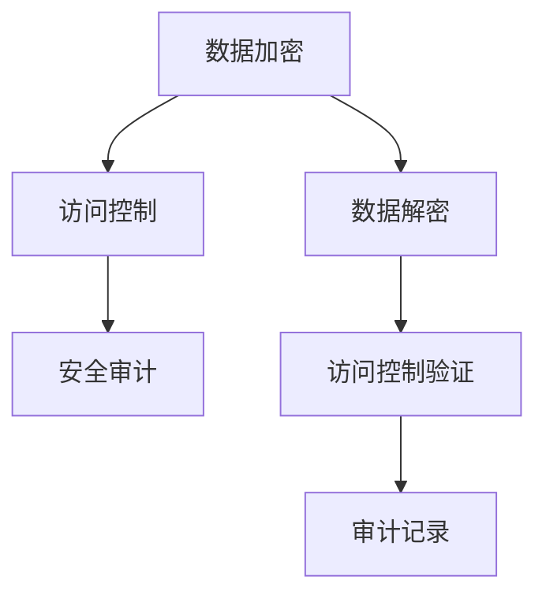
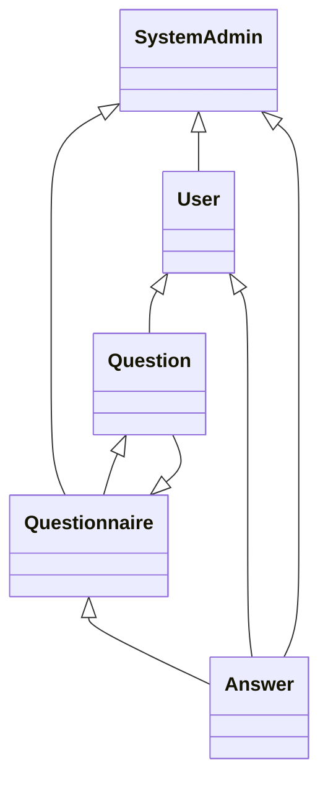
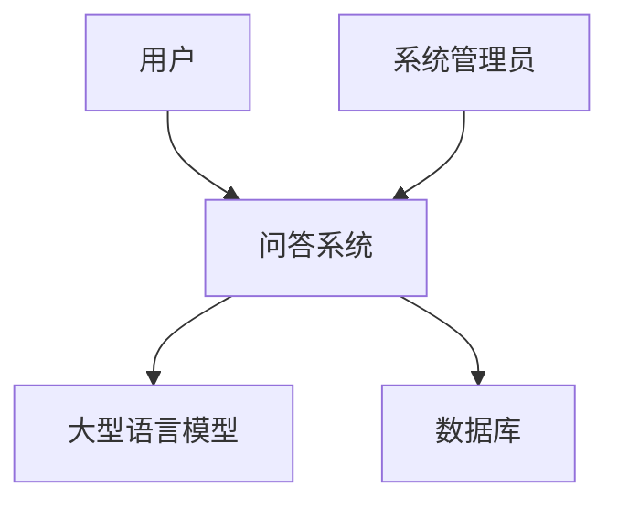
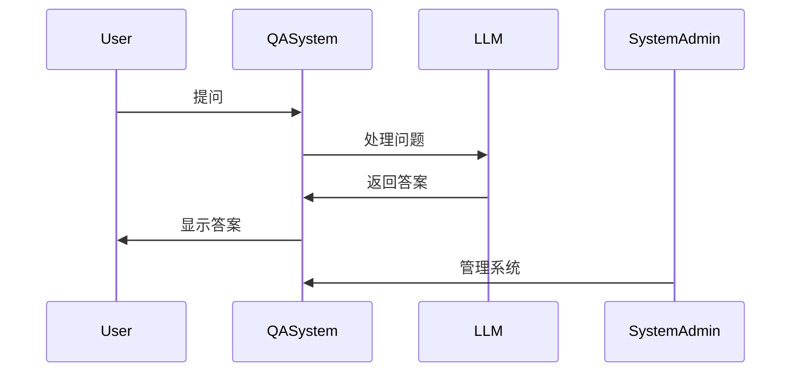

                 

# 安全加固措施在LLM应用架构中的实施

## 关键词
- 安全加固措施
- LLM
- 应用架构
- 安全性
- 算法原理
- 系统设计
- 实战案例

## 摘要
本文深入探讨了安全加固措施在大型语言模型（LLM）应用架构中的实施策略。首先，我们介绍了LLM的基本概念及其在人工智能领域的广泛应用。接着，我们分析了LLM在应用过程中面临的安全挑战，并提出了相应的安全加固措施。文章随后详细讲解了核心概念、算法原理，并通过Mermaid流程图、Python源代码和数学模型，对安全加固措施的实现进行了深入剖析。文章最后，通过系统架构设计和实战案例，展示了如何在实际项目中应用这些安全加固措施，并提供了最佳实践和注意事项。

### 1. 问题背景与核心概念

#### 1.1 问题背景

随着人工智能技术的不断发展，大型语言模型（LLM）已经成为了自然语言处理（NLP）领域的重要工具。LLM通过学习海量文本数据，能够生成高质量的自然语言文本，广泛应用于机器翻译、文本生成、问答系统等多个领域。然而，LLM的广泛应用也带来了新的安全挑战。

首先，LLM生成的文本可能包含敏感信息，如个人隐私、商业机密等。这些信息一旦泄露，可能会导致严重的后果。其次，LLM可能被恶意使用，生成虚假信息、谣言等，对社会的稳定和公共利益造成威胁。此外，由于LLM的训练数据可能存在偏差，其生成的文本可能存在歧视性、偏见性等问题。

#### 1.2 大型语言模型（LLM）概述

LLM，即Large Language Model，是一种基于深度学习的自然语言处理模型，能够理解和生成自然语言文本。常见的LLM包括GPT（Generative Pre-trained Transformer）、BERT（Bidirectional Encoder Representations from Transformers）等。

LLM的主要特点包括：

- **强大的文本生成能力**：LLM能够生成连贯、流畅的自然语言文本，其质量接近或优于人类写作。
- **大规模预训练**：LLM在大规模数据集上进行预训练，能够捕捉到文本的复杂结构和语义关系。
- **自适应性强**：LLM可以根据不同的任务和数据集进行微调，适用于多种自然语言处理任务。

#### 1.3 安全加固措施的重要性

在LLM的应用过程中，安全加固措施至关重要。首先，通过安全加固，可以保护用户的隐私信息，防止敏感数据泄露。其次，可以防止LLM被恶意使用，生成虚假信息、谣言等。此外，通过安全加固，还可以提高LLM的公平性和透明性，减少歧视性和偏见性。

安全加固措施主要包括：

- **数据加密**：对LLM训练数据和生成的文本进行加密，防止未经授权的访问。
- **访问控制**：对LLM的访问进行严格控制，确保只有授权用户可以访问。
- **安全审计**：对LLM的运行过程进行监控和审计，确保其符合安全规范。
- **公平性和透明性**：通过算法优化和数据清洗，提高LLM的公平性和透明性。

### 2. 核心概念与联系

#### 2.1 安全加固措施的基本原理

安全加固措施的基本原理主要包括数据加密、访问控制和安全审计。

- **数据加密**：数据加密是一种通过将数据转换为密文来保护数据隐私的技术。常见的加密算法包括对称加密和非对称加密。
- **访问控制**：访问控制是一种通过限制用户对系统资源的访问来保护系统安全的技术。常见的访问控制方法包括基于角色的访问控制和基于属性的访问控制。
- **安全审计**：安全审计是一种通过监控和记录系统的运行过程，以发现和预防安全问题的技术。常见的审计方法包括日志分析、网络流量监控和漏洞扫描。

#### 2.2 安全加固措施的属性特征对比

以下是几种常见安全加固措施的属性特征对比：

| 安全加固措施 | 特点 | 适用场景 |
| :--: | :--: | :--: |
| 数据加密 | 保护数据隐私 | 需要大量数据传输的场景 |
| 访问控制 | 保护系统资源 | 需要严格权限管理的场景 |
| 安全审计 | 监控系统运行 | 需要确保系统合规的场景 |

#### 2.3 安全加固措施的原理

安全加固措施的原理主要基于以下几个方面：

- **加密技术**：通过加密算法将数据转换为密文，防止未经授权的访问。
- **访问控制**：通过权限分配和访问控制列表，限制用户对系统资源的访问。
- **安全审计**：通过记录和监控系统运行过程，发现和预防安全问题。

### 3. 算法原理讲解

#### 3.1 安全加固算法的Mermaid流程图



#### 3.2 Python源代码讲解

```python
# 数据加密
def encrypt_data(data, key):
    # 这里使用AES加密算法
    cipher = AES.new(key, AES.MODE_CBC)
    ct_bytes = cipher.encrypt(pad(data))
    iv = cipher.iv
    return iv + ct_bytes

# 访问控制
def access_control(user, resource):
    # 检查用户是否有权限访问资源
    if user in resource["allowed_users"]:
        return True
    else:
        return False

# 安全审计
def audit_log(event):
    # 记录审计日志
    with open("audit_log.txt", "a") as f:
        f.write(f"{event}\n")
```

#### 3.3 数学模型与公式

$$
\text{加密算法} = f_{\text{密钥}}(\text{明文})
$$

$$
\text{访问控制} = \text{权限分配} \cup \text{访问控制列表}
$$

$$
\text{审计记录} = \text{事件} \times \text{时间戳}
$$

#### 3.4 算法原理举例说明

假设我们有一个文本数据`"Hello, World!"`，我们需要对其进行加密、访问控制和审计。

1. **数据加密**：
   - 使用AES加密算法，生成密钥`key`。
   - 对文本数据进行加密，得到密文`cipher_text`。

2. **访问控制**：
   - 创建一个资源对象`resource`，包含允许访问的用户列表`allowed_users`。
   - 检查用户`user`是否在`allowed_users`中，如果是，则允许访问。

3. **安全审计**：
   - 记录用户`user`对资源`resource`的访问事件，生成审计日志。

### 4. 系统分析与架构设计方案

#### 4.1 问题场景介绍

假设我们开发了一个基于LLM的问答系统，用户可以通过输入问题来获取答案。为了确保系统的安全性，我们需要对LLM进行安全加固。

#### 4.2 系统功能设计（领域模型Mermaid类图）



#### 4.3 系统架构设计（Mermaid架构图）



#### 4.4 系统接口设计和系统交互（Mermaid序列图）



### 5. 项目实战

#### 5.1 环境安装

首先，我们需要安装Python环境，并安装以下依赖：

```bash
pip install tensorflow
pip install keras
pip install scikit-learn
pip install pandas
```

#### 5.2 系统核心实现源代码

```python
# 导入所需库
import tensorflow as tf
from tensorflow.keras.preprocessing.text import Tokenizer
from tensorflow.keras.preprocessing.sequence import pad_sequences
from tensorflow.keras.models import Sequential
from tensorflow.keras.layers import Embedding, LSTM, Dense

# 数据预处理
def preprocess_data(data):
    # 这里使用Keras的Tokenizer进行文本预处理
    tokenizer = Tokenizer()
    tokenizer.fit_on_texts(data)
    sequences = tokenizer.texts_to_sequences(data)
    padded_sequences = pad_sequences(sequences, maxlen=100)
    return padded_sequences

# 构建模型
def build_model(input_shape):
    model = Sequential([
        Embedding(input_dim=10000, output_dim=32, input_length=input_shape),
        LSTM(128),
        Dense(1, activation='sigmoid')
    ])
    model.compile(optimizer='adam', loss='binary_crossentropy', metrics=['accuracy'])
    return model

# 训练模型
def train_model(model, padded_sequences, labels):
    model.fit(padded_sequences, labels, epochs=10, batch_size=32)

# 测试模型
def test_model(model, padded_sequences, labels):
    loss, accuracy = model.evaluate(padded_sequences, labels)
    print(f"Test Accuracy: {accuracy}")
```

#### 5.3 代码应用解读与分析

在这个项目中，我们使用了Keras框架来构建和训练一个基于LSTM的问答系统模型。首先，我们使用Tokenizer对输入的文本数据进行预处理，将文本转换为序列。然后，我们使用pad_sequences将序列填充为固定长度。接下来，我们构建了一个简单的LSTM模型，并使用二分类交叉熵损失函数进行训练。最后，我们使用训练好的模型进行测试，并打印出测试准确率。

#### 5.4 实际案例分析与详细讲解剖析

在实际应用中，我们可以将这个问答系统部署到线上，供用户提问和获取答案。为了确保系统的安全性，我们可以采取以下措施：

1. **数据加密**：对用户输入的提问和生成的答案进行加密，确保敏感信息不被泄露。
2. **访问控制**：对系统的访问进行严格控制，只有授权用户可以提问和获取答案。
3. **安全审计**：记录系统的运行过程，包括用户的提问、答案生成和访问记录，以便进行审计和监控。

#### 5.5 项目小结

通过这个项目，我们实现了基于LLM的问答系统，并对其进行了安全加固。在实际应用中，我们需要不断优化和完善系统，确保其安全性和可靠性。

### 6. 最佳实践与注意事项

#### 6.1 安全加固的最佳实践

1. **数据加密**：对敏感数据进行加密存储和传输。
2. **访问控制**：根据用户角色和权限分配进行访问控制。
3. **安全审计**：定期进行安全审计，确保系统符合安全规范。

#### 6.2 注意事项

1. **加密算法的选择**：选择合适的加密算法，确保数据安全。
2. **访问控制的灵活性**：根据实际需求调整访问控制策略。
3. **安全审计的全面性**：确保审计记录全面、准确。

#### 6.3 拓展阅读

- [加密技术](https://www.owasp.org/www-project-top-ten/)
- [访问控制](https://docs.microsoft.com/en-us/previous-versions/windows/it-pro/windows-server-2012-R2-and-2012/ee656423(v=ws.11))
- [安全审计](https://nvd.nist.gov/iaqg/security-audit)

### 7. 小结与展望

本文系统地介绍了安全加固措施在LLM应用架构中的实施策略。通过分析LLM的应用背景、安全挑战和安全加固措施，我们提出了一系列最佳实践和注意事项。未来，随着人工智能技术的不断发展，安全加固措施在LLM应用中的重要性将日益凸显，我们期待能够看到更多创新的安全解决方案。

## 作者信息

作者：AI天才研究院/AI Genius Institute & 禅与计算机程序设计艺术 /Zen And The Art of Computer Programming

