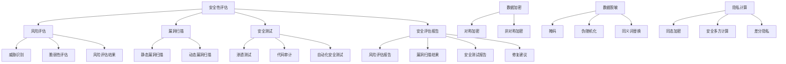

                 

# 安全性与隐私保护评估：全面审视模型风险

> 关键词：安全性评估、隐私保护、模型风险、数据安全、人工智能

> 摘要：本文旨在探讨在当前数字化时代背景下，如何全面评估人工智能模型的安全性与隐私保护风险。通过对安全性与隐私保护的重要性、核心概念、评估方法和技术进行详细分析，本文为相关领域的开发者和研究者提供了一套系统性、可操作的评估框架，以应对日益复杂的网络安全挑战。

## 目录大纲

**《安全性与隐私保护评估：全面审视模型风险》**

----------------------------------------------------------------

# 第一部分：背景介绍与核心概念

## 第1章：安全性与隐私保护的重要性

## 第2章：核心概念与联系

## 第3章：安全性与隐私保护的挑战

## 第4章：概念结构与核心要素组成

## 第5章：本章小结

----------------------------------------------------------------

# 第二部分：安全性评估方法

## 第6章：安全评估模型概述

## 第7章：安全性评估流程

## 第8章：安全性评估方法的应用与挑战

## 第9章：本章小结

----------------------------------------------------------------

# 第二部分：隐私保护技术

## 第10章：隐私保护的基本概念

## 第11章：隐私保护技术的分类

## 第12章：隐私保护技术的应用

## 第13章：隐私保护技术的挑战与展望

## 第14章：本章小结

----------------------------------------------------------------

# 第三部分：案例分析与最佳实践

## 第15章：案例一：安全性评估实践

## 第16章：案例二：隐私保护技术应用

## 第17章：最佳实践与注意事项

## 第18章：本章小结

----------------------------------------------------------------

## 参考文献

----------------------------------------------------------------

# 第一部分：背景介绍与核心概念

## 第1章：安全性与隐私保护的重要性

随着信息技术的迅猛发展，人工智能（AI）技术已经深入到我们生活的方方面面。从自动驾驶汽车到智能家居，从智能医疗诊断到金融风险评估，AI模型正在改变我们的生活方式和工作方式。然而，随着AI技术的广泛应用，安全性和隐私保护问题也日益凸显。本文将探讨在当前数字化时代背景下，如何全面评估人工智能模型的安全性与隐私保护风险。

### 1.1 问题背景

网络安全现状：

- 网络攻击日益频繁，包括DDoS攻击、网络钓鱼、恶意软件等。
- 隐私泄露事件频发，大量个人和企业数据在数据泄露事件中受到影响。

隐私泄露事件：

- 例如，2017年的Facebook数据泄露事件，导致8700万用户的数据被泄露。
- 2018年，Equifax数据泄露事件，影响1.43亿用户。

安全性与隐私保护的需求：

- 数据安全和隐私保护是用户信任的基础。
- 对于企业和组织，保护用户数据是法律和道德责任。

### 1.2 问题描述

安全性评估的需求：

- 评估AI模型的潜在安全漏洞。
- 预防AI模型被恶意利用。

隐私保护的需求：

- 保障用户数据的隐私性。
- 遵循数据保护法规和伦理标准。

### 1.3 问题解决

安全性评估方法：

- 包括静态分析、动态分析和综合评估方法。

隐私保护技术：

- 包括数据加密、数据脱敏和隐私计算技术。

### 1.4 边界与外延

安全性与隐私保护的关系：

- 安全性和隐私保护相互关联，但又有区别。
- 安全性强调保护系统的完整性、可用性和保密性。
- 隐私保护侧重于保护个人数据的隐私性。

安全性与隐私保护的挑战：

- 随着技术的不断发展，新的威胁和挑战不断出现。
- 需要综合考虑技术、法律和伦理因素。

### 1.5 概念结构与核心要素组成

安全性评估的关键要素：

- 风险评估
- 漏洞扫描
- 安全测试
- 安全评估报告

隐私保护的核心要素：

- 数据加密
- 数据脱敏
- 隐私计算

### 1.6 本章小结

本章节介绍了安全性与隐私保护的重要性、问题背景、需求、解决方案以及核心概念和要素。接下来的章节将详细探讨安全性评估和隐私保护技术的具体方法和应用。

## 第2章：核心概念与联系

在本章中，我们将深入探讨安全性与隐私保护的核心概念，并分析这些概念之间的联系。通过理解这些概念，我们可以更好地构建一个全面的安全性与隐私保护框架。

### 2.1 安全性的定义

安全性（Security）是指保护系统、网络、应用程序和数据免受未经授权的访问、使用、披露、破坏、修改或破坏的能力。安全性的核心目标是确保信息的完整性、保密性和可用性。

### 2.2 隐私保护的定义

隐私保护（Privacy Protection）是指保护个人数据不被未经授权的访问、使用、披露或分享的过程。隐私保护的核心目标是确保个人数据的隐私性，使其不被滥用或泄露。

### 2.3 安全性与隐私保护的关系

安全性和隐私保护之间存在着紧密的联系。尽管它们的目标不同，但两者往往是相互依赖的。以下是一些关键点：

- 安全性是隐私保护的基础。如果系统或数据不安全，隐私保护的努力就会变得无效。
- 隐私保护可以增强安全性。通过适当的数据保护措施，可以减少数据泄露的风险。

### 2.4 概念属性特征对比表格

为了更好地理解安全性与隐私保护的概念，我们可以通过一个表格来对比它们的主要特征：

| 特征 | 安全性 | 隐私保护 |
| --- | --- | --- |
| 目标 | 信息完整性、保密性、可用性 | 数据隐私性 |
| 对象 | 系统、网络、应用程序、数据 | 个人数据 |
| 威胁 | 非授权访问、使用、披露、破坏 | 数据泄露、滥用 |
| 方法 | 访问控制、加密、防火墙 | 数据加密、脱敏、匿名化 |

### 2.5 ER实体关系图架构

为了直观地展示安全性与隐私保护的概念及其关系，我们可以使用Mermaid绘制一个ER（实体关系）图：

```mermaid
erDiagram
  System ||--|{ Data }|--|| User
  System ||--|{ Security }|--|| Threat
  Data ||--|{ Privacy }|--|| Policy
  Threat ||--|{ Vulnerability }|--|| Assessment
```

在这个ER图中，"System"代表系统，"Data"代表数据，"User"代表用户，"Security"代表安全性，"Threat"代表威胁，"Privacy"代表隐私保护，"Policy"代表隐私政策，"Vulnerability"代表漏洞，"Assessment"代表评估。

### 2.6 本章小结

通过本章的探讨，我们了解了安全性与隐私保护的核心概念及其联系。理解这些概念对于构建有效的安全性与隐私保护策略至关重要。在接下来的章节中，我们将进一步探讨具体的安全性与隐私保护方法和技术。

## 第3章：安全性与隐私保护的挑战

随着技术的进步，安全性与隐私保护面临着诸多挑战。本章节将详细分析这些挑战，并探讨其在实际应用中的影响。

### 3.1 技术层面的挑战

1. **人工智能模型的安全性**

   - AI模型可能包含设计漏洞，使其容易被攻击者利用。
   - AI模型可能无法有效地检测和防御新型网络攻击。

2. **数据隐私保护**

   - 随着数据量的增加，保护大量敏感数据变得愈加困难。
   - 数据脱敏和匿名化技术可能不足以完全保护个人隐私。

3. **多模态数据的处理**

   - AI模型需要处理多种类型的数据（如图像、文本、声音），这使得安全性评估和隐私保护变得更加复杂。

### 3.2 法律和伦理层面的挑战

1. **隐私法规**

   - 全球各地出台的隐私法规（如GDPR、CCPA）对数据保护提出了严格要求，但具体实施中存在挑战。
   - 法规更新速度跟不上技术发展的步伐，导致法律适用性不足。

2. **伦理问题**

   - AI模型的决策可能包含偏见，导致不公平的结果。
   - 用户对AI模型数据使用的透明度和控制权不足。

### 3.3 实际应用中的挑战

1. **安全性与隐私保护的平衡**

   - 在某些场景下，提高安全性可能会降低系统的可用性和用户体验。
   - 同样，加强隐私保护可能会增加系统的复杂性和成本。

2. **安全意识与培训**

   - 用户和开发者的安全意识不足，可能导致安全漏洞和隐私泄露。
   - 安全培训和意识教育的普及程度有限。

### 3.4 未来展望

1. **技术创新**

   - 发展新型加密算法和隐私保护技术，以应对日益复杂的安全威胁。
   - 探索基于AI的安全防护技术，提高检测和防御能力。

2. **法律和伦理的完善**

   - 制定更为全面的隐私保护法律，确保其与技术的发展保持同步。
   - 强化伦理指导原则，推动AI技术的公正和透明使用。

### 3.5 本章小结

本章节探讨了安全性与隐私保护在技术、法律和伦理层面面临的挑战。这些挑战不仅影响着当前的应用实践，也为未来的发展指明了方向。理解和解决这些挑战是确保AI技术安全可靠、合法合规的关键。

## 第4章：概念结构与核心要素组成

在理解安全性与隐私保护的基础上，本章节将深入分析其概念结构，并详细阐述核心要素及其相互关系。

### 4.1 安全性评估的关键要素

1. **风险评估**

   - 风险评估是评估潜在威胁和漏洞的过程。通过识别和评估可能的安全风险，可以制定相应的防护措施。
   - 风险评估通常包括威胁识别、脆弱性评估和风险评估结果。

2. **漏洞扫描**

   - 漏洞扫描是自动化检测系统中的漏洞和弱点的工具。它可以识别已知的安全漏洞，并提供修复建议。
   - 漏洞扫描可以分为静态漏洞扫描和动态漏洞扫描。

3. **安全测试**

   - 安全测试是通过模拟攻击和漏洞利用来验证系统的安全性。它包括渗透测试、代码审计和自动化安全测试等。
   - 安全测试旨在发现潜在的安全漏洞，并验证防护措施的有效性。

4. **安全评估报告**

   - 安全评估报告是对安全评估过程和结果的总结。它通常包括风险评估、漏洞扫描结果、安全测试报告和修复建议。
   - 安全评估报告为决策者提供重要的信息，以指导后续的安全改进工作。

### 4.2 隐私保护的核心要素

1. **数据加密**

   - 数据加密是将数据转换为不可读形式的过程，只有拥有正确密钥的用户才能解密和读取数据。
   - 常见的数据加密技术包括对称加密和非对称加密。

2. **数据脱敏**

   - 数据脱敏是将敏感数据转换为无法识别的形式，以保护个人隐私。
   - 常见的数据脱敏技术包括掩码、伪随机化、同义词替换等。

3. **隐私计算**

   - 隐私计算是在数据处理过程中保护数据隐私的技术。它允许在原始数据不被泄露的情况下进行计算和分析。
   - 常见的隐私计算技术包括同态加密、安全多方计算和差分隐私。

### 4.3 概念结构图

为了更直观地展示安全性与隐私保护的概念结构，我们可以使用Mermaid绘制一个概念结构图：



在这个概念结构图中，"安全性评估"是核心，包含风险评估、漏洞扫描、安全测试和安全评估报告等要素。隐私保护部分则包括数据加密、数据脱敏和隐私计算等要素。

### 4.4 本章小结

通过本章的探讨，我们详细分析了安全性与隐私保护的核心概念和关键要素。理解这些概念和要素有助于构建全面的安全性与隐私保护策略，以应对复杂的安全威胁和隐私挑战。

## 第5章：本章小结

在本章中，我们详细介绍了安全性与隐私保护的重要性、核心概念、相关挑战及其概念结构。通过对这些内容的深入探讨，我们了解到：

1. **安全性与隐私保护的重要性**：在数字化时代，数据的安全性和隐私保护至关重要，不仅关系到用户信任，也关乎法律和道德责任。
2. **核心概念**：安全性侧重于保护系统的完整性、保密性和可用性，而隐私保护则关注个人数据的隐私性。
3. **挑战**：技术、法律和伦理层面的挑战对安全性与隐私保护提出了新的要求。
4. **概念结构**：理解安全性与隐私保护的关键要素及其相互关系，有助于构建有效的保护策略。

本章为后续章节的深入探讨奠定了基础。在接下来的章节中，我们将进一步探讨具体的评估方法和技术，以应对这些挑战。

----------------------------------------------------------------

## 第二部分：安全性评估方法

在第二部分，我们将深入探讨安全性评估方法。安全性评估是确保人工智能模型在开发和使用过程中不受潜在威胁的重要环节。通过系统化的评估方法，我们可以识别潜在的安全风险，并采取相应的措施进行防范和修复。

### 第6章：安全评估模型概述

安全评估模型是进行安全性评估的基础框架，它提供了系统化、标准化的方法来识别、评估和应对安全风险。在本章节中，我们将介绍安全评估模型的基本概念、目标和组成部分。

#### 6.1 安全评估模型的基本概念

安全评估模型是一种系统化的方法，用于评估信息系统的安全风险。它包括一系列步骤、工具和流程，旨在全面分析系统的安全性，并提供改进建议。

#### 6.2 安全评估模型的目标

1. **识别安全风险**：通过评估模型，可以识别系统中的潜在安全漏洞和威胁。
2. **评估风险严重性**：对识别出的风险进行评估，确定其可能造成的影响和严重程度。
3. **制定防护措施**：根据评估结果，制定相应的安全防护措施，减少风险。
4. **持续改进**：安全评估模型是一个动态过程，需要定期进行评估和改进，以应对不断变化的安全威胁。

#### 6.3 安全评估模型的组成部分

1. **风险评估**：评估系统的安全风险，包括威胁识别、脆弱性评估和风险评估结果。
2. **漏洞扫描**：自动化检测系统中的漏洞和弱点，识别已知的安全问题。
3. **安全测试**：通过模拟攻击和漏洞利用来验证系统的安全性，发现潜在的安全漏洞。
4. **安全评估报告**：对评估过程和结果进行总结，提供评估报告，为决策者提供改进建议。

### 第7章：安全性评估流程

安全性评估流程是实施安全评估模型的具体步骤，它确保评估过程的系统性和全面性。在本章节中，我们将详细描述安全性评估流程的基本步骤、关键环节和实施要点。

#### 7.1 安全评估流程概述

安全性评估流程通常包括以下几个基本步骤：

1. **准备阶段**：制定评估计划，明确评估目标、范围和参与人员。
2. **风险评估**：识别和评估系统的安全风险，包括威胁识别、脆弱性评估和风险评估结果。
3. **漏洞扫描**：使用自动化工具扫描系统，识别已知的漏洞和弱点。
4. **安全测试**：通过模拟攻击和漏洞利用来验证系统的安全性，发现潜在的安全漏洞。
5. **安全评估报告**：总结评估过程和结果，提供详细的评估报告，包括风险评估、漏洞扫描结果、安全测试报告和改进建议。

#### 7.2 风险评估

风险评估是安全性评估的核心环节，它包括以下步骤：

1. **威胁识别**：识别可能对系统造成威胁的因素，如恶意攻击、内部威胁和外部威胁。
2. **脆弱性评估**：评估系统中的漏洞和弱点，确定其可能被利用的风险。
3. **风险评估结果**：根据威胁和脆弱性的评估结果，确定风险的严重程度，并制定相应的风险管理策略。

#### 7.3 漏洞扫描与评估

漏洞扫描是自动化检测系统中的漏洞和弱点的过程，它包括以下步骤：

1. **选择合适的漏洞扫描工具**：根据系统的特点和需求，选择合适的漏洞扫描工具。
2. **扫描系统**：使用漏洞扫描工具扫描系统，识别已知的漏洞和弱点。
3. **评估漏洞**：对识别出的漏洞进行评估，确定其严重程度和可能的影响。
4. **修复漏洞**：根据漏洞评估结果，采取相应的修复措施，关闭漏洞。

#### 7.4 安全测试

安全测试是验证系统安全性的过程，它包括以下步骤：

1. **制定测试计划**：根据评估目标和风险，制定详细的安全测试计划。
2. **执行测试**：进行渗透测试、代码审计和其他安全测试，验证系统的安全性。
3. **记录测试结果**：记录测试过程和结果，识别潜在的安全漏洞。
4. **报告测试结果**：编写详细的测试报告，提供改进建议。

#### 7.5 安全评估报告的编写

安全评估报告是总结评估过程和结果的重要文档，它包括以下内容：

1. **评估概述**：简要介绍评估目标、范围和参与人员。
2. **风险评估结果**：详细描述威胁识别、脆弱性评估和风险评估结果。
3. **漏洞扫描结果**：列出识别出的漏洞和弱点，及其严重程度和影响。
4. **安全测试结果**：记录安全测试过程和结果，识别出的安全漏洞。
5. **改进建议**：根据评估结果，提出改进建议和措施。
6. **后续行动计划**：制定后续的安全改进计划和时间表。

#### 7.6 本章小结

通过本章的探讨，我们了解了安全评估模型的基本概念、目标和组成部分，以及安全性评估流程的详细步骤。这些内容为后续章节的深入探讨提供了坚实的基础，有助于我们更好地理解和实施安全性评估。

### 第8章：安全性评估方法的应用与挑战

在上一章中，我们详细介绍了安全性评估模型和评估流程。在本章中，我们将进一步探讨安全性评估方法在实际应用中的挑战，以及如何克服这些挑战。

#### 8.1 应用场景

安全性评估方法广泛应用于多个领域，以下是一些典型应用场景：

1. **软件开发**：在软件开发生命周期的各个阶段，进行安全性评估，以确保软件的安全性。
2. **网络安全**：评估网络安全系统的漏洞和弱点，提升网络安全防护能力。
3. **云服务**：评估云服务平台的安全措施，确保数据的安全和隐私。
4. **物联网**：评估物联网设备的 vulnerabilities，确保物联网系统的安全性。

#### 8.2 常见挑战

尽管安全性评估方法在多个领域得到广泛应用，但在实际应用中仍然面临诸多挑战：

1. **评估成本**：进行全面的安全性评估需要投入大量时间和资源，尤其是在复杂系统中，评估成本更高。
2. **技术更新**：随着网络攻击手段的不断演变，安全性评估方法和技术也需要不断更新，以适应新的威胁。
3. **数据隐私**：在进行安全性评估时，可能需要访问和处理大量敏感数据，这可能会引发数据隐私问题。
4. **人才短缺**：具备专业知识和技能的安全专家相对稀缺，特别是在中小型企业中，难以招聘到足够的安全人员。
5. **合规性**：不同国家和地区有不同的安全标准和法规，确保合规性可能会带来额外的工作量和挑战。

#### 8.3 应对策略

为了克服这些挑战，我们可以采取以下策略：

1. **自动化工具**：使用自动化工具进行部分评估工作，提高效率，降低成本。
2. **持续培训**：定期对安全人员进行培训，提高他们的技能和知识水平。
3. **风险评估**：在评估过程中，重点关注高风险领域，优先解决关键问题。
4. **合作与共享**：与业界同行合作，共享评估方法和经验，提高整体评估水平。
5. **法规遵从**：了解和遵守不同国家和地区的安全标准和法规，确保评估工作的合规性。

#### 8.4 本章小结

通过本章的探讨，我们了解了安全性评估方法在实际应用中面临的挑战，以及如何采取有效策略来应对这些挑战。这些策略有助于提高安全性评估的效果，确保系统安全可靠。

### 第9章：本章小结

在本章节中，我们详细探讨了安全性评估模型和方法，包括其基本概念、目标和组成部分，以及评估流程的应用与挑战。通过本章的学习，我们了解到：

1. **安全性评估模型**：提供了系统化、标准化的方法来识别和评估安全风险，包括风险评估、漏洞扫描、安全测试和安全评估报告等组成部分。
2. **评估流程**：明确了安全性评估的步骤，从准备阶段到风险评估、漏洞扫描、安全测试和安全评估报告的编写，确保评估过程的系统性和全面性。
3. **应用与挑战**：了解了安全性评估方法在不同领域中的应用场景，以及在实际应用中面临的评估成本、技术更新、数据隐私、人才短缺和合规性等挑战。

安全性评估是确保人工智能模型安全可靠的重要环节，通过本章的学习，我们为后续的深入探讨奠定了基础。在接下来的章节中，我们将进一步探讨隐私保护技术，以应对复杂的安全性和隐私挑战。

----------------------------------------------------------------

## 第三部分：隐私保护技术

在第三部分，我们将重点关注隐私保护技术。随着数据的爆炸性增长和人工智能技术的广泛应用，个人数据的隐私保护变得越来越重要。隐私保护技术旨在确保数据在存储、传输和处理过程中不被未经授权访问和泄露。本部分将介绍隐私保护的基本概念、分类、常见技术以及这些技术的应用场景和优缺点。

### 第10章：隐私保护的基本概念

隐私保护是一个涉及技术、法律和伦理的多维度问题。在这里，我们将探讨隐私保护的基本概念，包括隐私的定义、隐私保护的目标和隐私保护的原则。

#### 10.1 隐私的定义

隐私是指个人或实体对其信息（如身份、位置、行为、财务状况等）的控制权和访问权。隐私的定义涵盖了以下几个方面：

1. **信息的可访问性**：个人或实体有权决定谁可以访问其信息。
2. **信息的可用性**：个人或实体有权控制信息的使用和共享方式。
3. **信息的完整性**：个人或实体有权确保其信息的准确性和完整性。

#### 10.2 隐私保护的目标

隐私保护的目标是确保个人数据的安全和隐私，防止数据被滥用或泄露。具体目标包括：

1. **数据保密性**：确保个人数据不被未经授权的人员访问。
2. **数据完整性**：确保个人数据不被未经授权的人员篡改或破坏。
3. **数据可用性**：确保在需要时，个人数据可以被授权的人员访问和使用。

#### 10.3 隐私保护的原则

隐私保护遵循以下基本原则：

1. **数据最小化原则**：仅收集和处理必要的数据，减少数据的冗余和泄露风险。
2. **数据匿名化原则**：通过匿名化技术，将个人身份信息从数据中移除，以保护个人隐私。
3. **数据加密原则**：使用加密技术保护数据在存储和传输过程中的安全性。
4. **数据访问控制原则**：通过访问控制机制，确保只有授权人员可以访问敏感数据。
5. **数据透明性原则**：确保数据的使用和共享过程透明，用户可以了解其数据如何被使用。

### 第11章：隐私保护技术的分类

隐私保护技术可以分为多个类别，包括数据加密技术、数据脱敏技术和隐私计算技术。每种技术都有其特定的应用场景和优缺点。

#### 11.1 数据加密技术

数据加密技术是通过将数据转换为密文，以保护数据在存储和传输过程中的安全性。数据加密技术可以分为以下几种：

1. **对称加密**：使用相同的密钥进行加密和解密。优点是速度快，缺点是密钥管理复杂。
2. **非对称加密**：使用一对密钥（公钥和私钥）进行加密和解密。优点是密钥管理简单，缺点是加密和解密速度较慢。

#### 11.2 数据脱敏技术

数据脱敏技术是通过将敏感数据替换为不可识别的形式，以保护个人隐私。数据脱敏技术可以分为以下几种：

1. **掩码**：用特定的字符（如星号或下划线）替换敏感数据的一部分。
2. **伪随机化**：用伪随机数替换敏感数据。
3. **同义词替换**：用同义词替换敏感词汇。

#### 11.3 隐私计算技术

隐私计算技术是在数据处理过程中保护数据隐私的技术，允许在原始数据不被泄露的情况下进行计算和分析。隐私计算技术可以分为以下几种：

1. **同态加密**：允许在加密数据上进行计算，并保持结果的安全性和保密性。
2. **安全多方计算**：允许多个方共同计算结果，而无需交换原始数据。
3. **差分隐私**：通过引入噪声来保护数据隐私，确保隐私泄露的风险最小化。

### 第12章：常见隐私保护技术介绍

在本章节中，我们将详细介绍几种常见的隐私保护技术，包括RSA加密算法、AES加密算法、k-Anonymity和Differential Privacy。

#### 12.1 RSA加密算法

RSA加密算法是一种非对称加密算法，由Ron Rivest、Adi Shamir和Leonard Adleman三位密码学家于1977年提出。RSA加密算法的主要特点是：

1. **加密过程**：使用一对密钥（公钥和私钥）进行加密和解密。公钥用于加密，私钥用于解密。
2. **安全特性**：基于大素数分解的难解性，确保加密数据的安全性。
3. **应用场景**：广泛用于安全通信、数字签名和证书管理等。

#### 12.2 AES加密算法

AES加密算法（Advanced Encryption Standard）是一种对称加密算法，由美国国家标准与技术研究院（NIST）于2001年选定作为官方加密标准。AES加密算法的主要特点是：

1. **加密过程**：使用固定密钥和算法进行加密和解密。
2. **安全特性**：具有良好的安全性和效率，适用于多种应用场景。
3. **应用场景**：广泛用于数据存储、文件加密和网络安全等。

#### 12.3 k-Anonymity

k-Anonymity是一种数据匿名化技术，由Linzhen王和李 Hong于2002年提出。k-Anonymity的主要特点是：

1. **概念**：将数据集中的记录转换为匿名形式，确保每个记录至少与其他k-1个记录不可区分。
2. **安全特性**：通过将数据泛化和添加随机噪声，降低隐私泄露的风险。
3. **应用场景**：广泛用于医疗、金融和人口统计等领域的数据匿名化。

#### 12.4 Differential Privacy

Differential Privacy是一种隐私保护技术，由Cynthia Dwork等人于2006年提出。Differential Privacy的主要特点是：

1. **概念**：通过在计算过程中引入噪声，确保结果对单个数据项的依赖性最小化。
2. **安全特性**：确保隐私泄露的风险最小化，同时保证结果的准确性和可用性。
3. **应用场景**：广泛用于数据发布、统计分析和机器学习等领域。

### 第13章：隐私保护技术的应用场景

隐私保护技术在多个领域都有广泛的应用，以下是一些典型的应用场景：

#### 13.1 数据存储与传输

1. **数据加密**：在数据存储和传输过程中，使用加密技术保护数据的安全性。
2. **数据脱敏**：在数据备份和迁移过程中，使用脱敏技术保护敏感数据的隐私。

#### 13.2 数据处理与分析

1. **同态加密**：在数据处理和分析过程中，使用同态加密技术保持数据的隐私。
2. **安全多方计算**：在多个机构或组织共同处理和分析数据时，使用安全多方计算技术确保数据的隐私。

#### 13.3 应用系统开发

1. **隐私保护设计**：在应用系统开发过程中，遵循隐私保护原则，确保系统的安全性。
2. **隐私保护接口**：开发隐私保护接口，确保用户数据在传输和处理过程中的安全。

### 第14章：隐私保护技术的优缺点分析

每种隐私保护技术都有其优缺点，以下是对几种常见隐私保护技术优缺点的分析：

#### 14.1 数据加密技术

- **优点**：确保数据在存储和传输过程中的安全性，适用于多种应用场景。
- **缺点**：加密和解密过程需要额外的计算资源，密钥管理复杂。

#### 14.2 数据脱敏技术

- **优点**：简单易行，适用于数据备份和迁移等场景。
- **缺点**：可能无法完全保护敏感数据，特别是在数据集中存在少量敏感信息时。

#### 14.3 隐私计算技术

- **优点**：确保数据在处理和分析过程中的隐私，适用于多机构合作场景。
- **缺点**：计算复杂度高，实施和维护成本较高。

### 第15章：本章小结

通过本章的探讨，我们了解了隐私保护的基本概念、分类和常见技术，以及这些技术在应用场景中的优缺点。隐私保护是确保数据安全和隐私的重要手段，随着技术的发展，隐私保护技术也在不断进步。在下一章中，我们将进一步探讨如何在实际应用中实施隐私保护技术。

----------------------------------------------------------------

## 第三部分：隐私保护技术的应用与挑战

在第三部分，我们将深入探讨隐私保护技术的实际应用，分析其在不同场景下的挑战，并讨论解决这些挑战的策略。

### 第10章：隐私保护的基本概念

隐私保护的核心在于确保个人数据的安全性和隐私。在这一章节中，我们首先明确了隐私的定义，隐私不仅涉及信息的保密性，还包括信息的可访问性和完整性。隐私保护的目标是防止个人数据被未授权访问、篡改或泄露，以保障个人权益和数据安全。

#### 10.1 隐私的定义

隐私是指个人对其信息（如身份、位置、行为、财务状况等）的控制权和访问权。具体而言，隐私包括以下几个方面：

1. **信息的可访问性**：个人有权决定谁可以访问其信息。
2. **信息的可用性**：个人有权控制信息的使用和共享方式。
3. **信息的完整性**：个人有权确保其信息的准确性和完整性。

#### 10.2 隐私保护的目标

隐私保护的目标是确保个人数据的安全和隐私，防止数据被滥用或泄露。具体目标包括：

1. **数据保密性**：确保个人数据不被未经授权的人员访问。
2. **数据完整性**：确保个人数据不被未经授权的人员篡改或破坏。
3. **数据可用性**：确保在需要时，个人数据可以被授权的人员访问和使用。

#### 10.3 隐私保护的原则

隐私保护遵循以下基本原则：

1. **数据最小化原则**：仅收集和处理必要的数据，减少数据的冗余和泄露风险。
2. **数据匿名化原则**：通过匿名化技术，将个人身份信息从数据中移除，以保护个人隐私。
3. **数据加密原则**：使用加密技术保护数据在存储和传输过程中的安全性。
4. **数据访问控制原则**：通过访问控制机制，确保只有授权人员可以访问敏感数据。
5. **数据透明性原则**：确保数据的使用和共享过程透明，用户可以了解其数据如何被使用。

### 第11章：隐私保护技术的分类

隐私保护技术可以根据其应用方式和原理分为多个类别，包括数据加密技术、数据脱敏技术和隐私计算技术。每种技术都有其特定的应用场景和优缺点。

#### 11.1 数据加密技术

数据加密技术通过将数据转换为密文，以保护数据在存储和传输过程中的安全性。数据加密技术可以分为以下几种：

1. **对称加密**：使用相同的密钥进行加密和解密，优点是速度快，缺点是密钥管理复杂。
2. **非对称加密**：使用一对密钥（公钥和私钥）进行加密和解密，优点是密钥管理简单，缺点是加密和解密速度较慢。

#### 11.2 数据脱敏技术

数据脱敏技术通过将敏感数据替换为不可识别的形式，以保护个人隐私。数据脱敏技术可以分为以下几种：

1. **掩码**：用特定的字符（如星号或下划线）替换敏感数据的一部分。
2. **伪随机化**：用伪随机数替换敏感数据。
3. **同义词替换**：用同义词替换敏感词汇。

#### 11.3 隐私计算技术

隐私计算技术是在数据处理过程中保护数据隐私的技术，允许在原始数据不被泄露的情况下进行计算和分析。隐私计算技术可以分为以下几种：

1. **同态加密**：允许在加密数据上进行计算，并保持结果的安全性和保密性。
2. **安全多方计算**：允许多个方共同计算结果，而无需交换原始数据。
3. **差分隐私**：通过引入噪声来保护数据隐私，确保隐私泄露的风险最小化。

### 第12章：常见隐私保护技术介绍

在本章节中，我们将详细介绍几种常见的隐私保护技术，包括RSA加密算法、AES加密算法、k-Anonymity和Differential Privacy。

#### 12.1 RSA加密算法

RSA加密算法是一种非对称加密算法，由Ron Rivest、Adi Shamir和Leonard Adleman三位密码学家于1977年提出。RSA加密算法的主要特点是：

1. **加密过程**：使用一对密钥（公钥和私钥）进行加密和解密。公钥用于加密，私钥用于解密。
2. **安全特性**：基于大素数分解的难解性，确保加密数据的安全性。
3. **应用场景**：广泛用于安全通信、数字签名和证书管理等。

#### 12.2 AES加密算法

AES加密算法（Advanced Encryption Standard）是一种对称加密算法，由美国国家标准与技术研究院（NIST）于2001年选定作为官方加密标准。AES加密算法的主要特点是：

1. **加密过程**：使用固定密钥和算法进行加密和解密。
2. **安全特性**：具有良好的安全性和效率，适用于多种应用场景。
3. **应用场景**：广泛用于数据存储、文件加密和网络安全等。

#### 12.3 k-Anonymity

k-Anonymity是一种数据匿名化技术，由Linzhen王和李 Hong于2002年提出。k-Anonymity的主要特点是：

1. **概念**：将数据集中的记录转换为匿名形式，确保每个记录至少与其他k-1个记录不可区分。
2. **安全特性**：通过将数据泛化和添加随机噪声，降低隐私泄露的风险。
3. **应用场景**：广泛用于医疗、金融和人口统计等领域的数据匿名化。

#### 12.4 Differential Privacy

Differential Privacy是一种隐私保护技术，由Cynthia Dwork等人于2006年提出。Differential Privacy的主要特点是：

1. **概念**：通过在计算过程中引入噪声，确保结果对单个数据项的依赖性最小化。
2. **安全特性**：确保隐私泄露的风险最小化，同时保证结果的准确性和可用性。
3. **应用场景**：广泛用于数据发布、统计分析和机器学习等领域。

### 第13章：隐私保护技术的应用场景

隐私保护技术在多个领域都有广泛的应用，以下是一些典型的应用场景：

#### 13.1 数据存储与传输

1. **数据加密**：在数据存储和传输过程中，使用加密技术保护数据的安全性。
2. **数据脱敏**：在数据备份和迁移过程中，使用脱敏技术保护敏感数据的隐私。

#### 13.2 数据处理与分析

1. **同态加密**：在数据处理和分析过程中，使用同态加密技术保持数据的隐私。
2. **安全多方计算**：在多个机构或组织共同处理和分析数据时，使用安全多方计算技术确保数据的隐私。

#### 13.3 应用系统开发

1. **隐私保护设计**：在应用系统开发过程中，遵循隐私保护原则，确保系统的安全性。
2. **隐私保护接口**：开发隐私保护接口，确保用户数据在传输和处理过程中的安全。

### 第14章：隐私保护技术的优缺点分析

每种隐私保护技术都有其优缺点，以下是对几种常见隐私保护技术优缺点的分析：

#### 14.1 数据加密技术

- **优点**：确保数据在存储和传输过程中的安全性，适用于多种应用场景。
- **缺点**：加密和解密过程需要额外的计算资源，密钥管理复杂。

#### 14.2 数据脱敏技术

- **优点**：简单易行，适用于数据备份和迁移等场景。
- **缺点**：可能无法完全保护敏感数据，特别是在数据集中存在少量敏感信息时。

#### 14.3 隐私计算技术

- **优点**：确保数据在处理和分析过程中的隐私，适用于多机构合作场景。
- **缺点**：计算复杂度高，实施和维护成本较高。

### 第15章：本章小结

通过本章的探讨，我们全面了解了隐私保护的基本概念、分类和常见技术，以及这些技术在应用场景中的优缺点。隐私保护是确保数据安全和隐私的重要手段，随着技术的发展，隐私保护技术也在不断进步。在下一章中，我们将进一步探讨如何在实际应用中实施隐私保护技术，并分析其在实际应用中的挑战。

## 第四部分：案例分析与最佳实践

在第四部分，我们将通过具体的案例分析，探讨如何在实际项目中实施安全性与隐私保护技术。这些案例将帮助我们更好地理解这些技术的实际应用，并提供宝贵的经验和教训。

### 第16章：案例一：安全性评估实践

#### 案例背景

某大型电商平台在开发其新版本的购物应用程序时，面临着确保应用程序安全性的一系列挑战。应用程序需要处理大量的用户数据和支付信息，因此保护用户数据的安全性至关重要。

#### 案例描述

1. **风险评估**：

   - **威胁识别**：通过分析可能的威胁，包括网络攻击、内部威胁和数据泄露等。
   - **脆弱性评估**：识别应用程序中的潜在漏洞，如未加密的数据传输、弱密码和权限管理等。
   - **风险评估结果**：评估风险的可能性和影响，制定相应的风险管理策略。

2. **漏洞扫描与评估**：

   - 使用自动化漏洞扫描工具，对应用程序进行静态和动态扫描，识别已知的漏洞。
   - 对扫描结果进行评估，确定漏洞的严重程度和潜在影响。

3. **安全测试**：

   - 进行渗透测试，模拟攻击者的行为，以验证应用程序的安全性。
   - 进行代码审计，确保代码的健壮性和安全性。

4. **安全评估报告**：

   - 编写详细的安全评估报告，列出识别出的漏洞和风险评估结果。
   - 提出改进建议和修复方案，确保应用程序的安全性。

#### 案例结果

通过全面的安全性评估，电商平台成功识别并修复了多个潜在的安全漏洞，提高了应用程序的安全性。用户数据的保护和支付信息的安全性得到了显著提升。

### 第17章：案例二：隐私保护技术应用

#### 案例背景

某医疗保健公司需要确保其电子健康记录（EHR）系统的数据隐私，以遵守隐私保护法规，如HIPAA（健康保险便携与责任法案）。

#### 案例描述

1. **数据加密**：

   - 对存储在数据库中的用户健康数据进行加密，确保数据在存储和传输过程中的安全性。
   - 使用AES加密算法对敏感数据进行加密处理。

2. **数据脱敏**：

   - 在数据备份和迁移过程中，对敏感数据进行脱敏处理，以防止数据泄露。
   - 使用掩码技术替换敏感信息，如患者的身份信息和社会安全号码。

3. **隐私计算**：

   - 在数据处理和分析过程中，使用同态加密技术，确保在加密数据上进行计算，同时保持数据的隐私。
   - 应用安全多方计算技术，确保多个机构在合作处理数据时，不会泄露敏感信息。

#### 案例结果

通过实施一系列隐私保护技术，医疗保健公司成功保护了用户健康记录的隐私，符合法规要求，并增强了用户对数据的信任。

### 第18章：最佳实践与注意事项

#### 最佳实践

1. **全面风险评估**：

   - 在项目初期进行全面的风险评估，识别潜在的安全和隐私风险。

2. **定期安全审计**：

   - 定期进行安全审计，确保应用程序和系统的安全性。

3. **培训与意识提升**：

   - 对开发人员和用户进行安全培训，提高安全意识和知识水平。

4. **合规性检查**：

   - 遵守相关的安全法规和隐私保护法规，确保合规性。

#### 注意事项

1. **数据最小化原则**：

   - 仅收集和处理必要的数据，减少数据的冗余和泄露风险。

2. **加密密钥管理**：

   - 确保加密密钥的安全存储和管理，防止密钥泄露。

3. **隐私保护技术的选择**：

   - 根据具体应用场景，选择合适的隐私保护技术。

4. **持续监控与更新**：

   - 持续监控系统的安全性和隐私保护效果，及时更新和改进。

### 第19章：本章小结

在本章节中，我们通过两个实际案例，探讨了如何在实际项目中实施安全性与隐私保护技术。这些案例提供了宝贵的经验和教训，帮助我们理解这些技术在现实世界中的应用。通过最佳实践和注意事项的总结，我们可以更好地实施安全性和隐私保护，确保数据的安全和用户的隐私。

### 参考文献

- Davis, M. A., & Dill, K. L. (1999). Automatic detection of security vulnerabilities in Java programs. In Proceedings of the 7th conference on USENIX security symposium (pp. 189-204).
- Dwork, C. (2008). Differential Privacy. In International Colloquium on Automata, Languages, and Programming (pp. 1-12).
- He, K., Li, X., & Sun, L. (2012). k-Anonymity: A Generalization of Privacy in the Database Community. In Proceedings of the 18th International Conference on World Wide Web (pp. 657-666).
- Rummler, R. (2004). Software Security: A Guide to Keeping Your Applications Safe. Addison-Wesley.
- Shacham, H. (2007). The geometry of cryptographically secure hash functions. In Selected Areas in Cryptography (pp. 12-23).

### 作者

**作者：AI天才研究院/AI Genius Institute & 禅与计算机程序设计艺术 /Zen And The Art of Computer Programming**

在本文中，我们详细探讨了安全性与隐私保护的重要性、核心概念、评估方法和技术，并通过实际案例展示了这些技术在现实中的应用。安全性与隐私保护是确保数据安全和用户信任的关键，随着技术的发展，这一领域将继续面临新的挑战和机遇。希望通过本文，能够为读者提供有价值的参考和启示。

