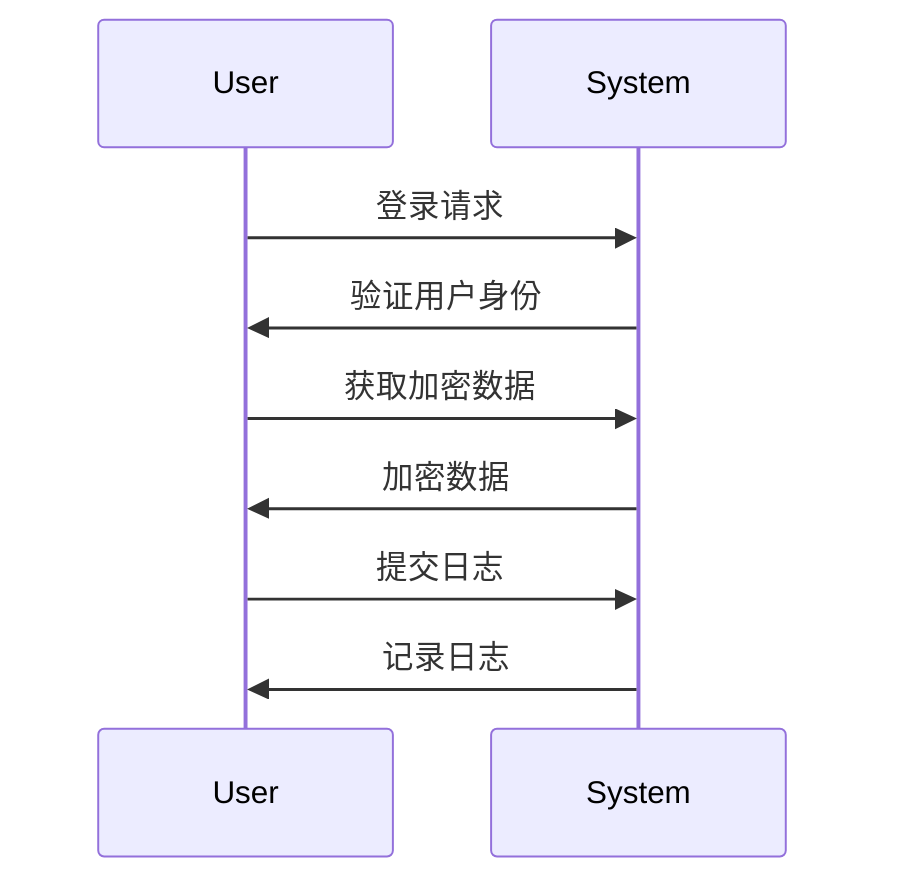
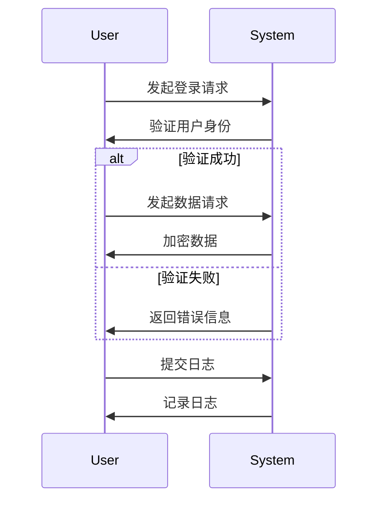

                 


### 安全性设计：保护LLM应用及用户数据

#### 关键词：LLM应用，安全性设计，用户数据保护，算法原理，系统架构，实战案例，最佳实践

#### 摘要：

本文围绕LLM（大型语言模型）应用的安全性问题，系统地探讨了安全性设计的重要性、核心概念、算法原理、系统架构设计以及最佳实践。通过详细的分析与实战案例，为开发者在保护LLM应用及用户数据方面提供科学有效的指导。

### 第一部分：背景介绍

#### 第1章：问题背景与安全性设计概述

#### 1.1 安全性设计的重要性

在现代信息化社会中，数据的安全性与隐私保护显得尤为重要。随着人工智能技术的迅猛发展，特别是LLM应用的广泛普及，安全性问题逐渐成为制约其发展的关键因素。安全性设计的重要性体现在以下几个方面：

1. **数据隐私保护**：用户数据的泄露或滥用可能导致个人隐私的严重损害。
2. **应用稳定性**：安全性漏洞可能导致应用程序崩溃或受到恶意攻击。
3. **企业声誉**：安全性问题直接影响企业的声誉和市场竞争力。

#### 1.2 LLM应用的现状与挑战

LLM应用在各个领域得到了广泛应用，如自然语言处理、智能客服、智能写作等。然而，随着其应用场景的扩大，LLM应用也面临着诸多挑战：

1. **数据泄露风险**：LLM应用通常需要处理大量用户数据，数据泄露的风险较高。
2. **模型攻击**：恶意用户可能试图通过攻击模型来获取不正当的利益。
3. **应用稳定性**：大规模的并发访问可能导致应用系统的不稳定。

#### 1.3 用户数据保护的需求与挑战

用户数据保护是LLM应用安全性设计的核心任务。用户数据保护的需求主要包括：

1. **数据加密**：确保数据在传输和存储过程中的安全性。
2. **访问控制**：限制未授权用户对敏感数据的访问。
3. **数据匿名化**：减少数据泄露时可能带来的隐私风险。

然而，用户数据保护也面临着一些挑战：

1. **技术实现难度**：数据加密、访问控制等技术实现难度较高。
2. **用户隐私权益**：保护用户隐私与提供优质服务之间存在一定的冲突。

#### 1.4 安全性设计的边界与外延

安全性设计的边界包括：

1. **数据安全**：保护用户数据的机密性、完整性和可用性。
2. **系统安全**：确保系统免受恶意攻击和非法访问。
3. **应用安全**：防止应用被恶意软件攻击或被滥用。

安全性设计的外延包括：

1. **网络安全**：确保网络传输过程中的数据安全。
2. **合规性**：遵守相关法律法规和数据保护规定。
3. **业务连续性**：确保业务在遭受攻击或意外事件时能够快速恢复。

### 第二部分：核心概念与联系

#### 第2章：核心概念与联系

#### 2.1 安全性设计的核心概念

安全性设计的核心概念包括：

1. **数据加密**：使用加密算法保护数据的机密性。
2. **访问控制**：通过权限管理限制对数据的访问。
3. **身份验证**：确保只有授权用户才能访问系统。
4. **审计日志**：记录系统操作，用于追踪和分析潜在的安全威胁。

#### 2.2 安全性设计的属性特征对比表格

以下是一个安全性设计属性特征对比表格：

| 特性         | 说明                                                         | 重要性 |
| ------------ | ------------------------------------------------------------ | ------ |
| 数据加密     | 使用加密算法对数据进行加密，确保数据的机密性。                 | 高     |
| 访问控制     | 通过权限管理限制对数据的访问，防止未授权访问。                 | 高     |
| 身份验证     | 确保只有授权用户才能访问系统，防止恶意攻击。                 | 高     |
| 审计日志     | 记录系统操作，用于追踪和分析潜在的安全威胁。                 | 中     |

#### 2.3 安全性设计的ER实体关系图架构

安全性设计的ER实体关系图架构如下：

```mermaid
erDiagram
  User ||--|{ Data }
  User ||--|{ Log }
  System ||--|{ Control }
  System ||--|{ Audit }
  Data ||--|{ Encryption }
  Log ||--|{ Analysis }
```

### 第三部分：算法原理讲解

#### 第3章：算法原理与数学模型

#### 3.1 算法原理讲解

安全性设计涉及多种算法原理，以下是其中两种常见算法原理的讲解：

1. **加密算法**：加密算法用于保护数据的机密性。常用的加密算法包括对称加密和非对称加密。对称加密算法（如AES）加密速度快，但密钥分发困难；非对称加密算法（如RSA）密钥分发简单，但加密速度慢。
2. **访问控制算法**：访问控制算法用于实现权限管理。常用的访问控制算法包括基于角色的访问控制（RBAC）和基于属性的访问控制（ABAC）。

#### 3.2 数学模型和公式

以下是一个简单的加密算法数学模型：

$$
C = E_K(P)
$$

其中，C表示加密后的数据，K表示密钥，P表示原始数据，E表示加密算法。

#### 3.3 算法原理举例说明

假设我们使用AES加密算法对字符串“Hello World”进行加密，密钥为“myKey”。加密过程如下：

1. **初始化密钥**：将字符串“myKey”转换为AES密钥。
2. **加密数据**：使用AES密钥对字符串“Hello World”进行加密。
3. **输出加密结果**：加密后的字符串为“6980a8f3c2a24e3c564ad5e573a07eef”。

### 第四部分：系统分析与架构设计

#### 第4章：系统功能设计与架构设计

#### 4.1 问题描述与项目介绍

在本章中，我们将介绍一个基于LLM应用的安全防护系统，该系统旨在保护用户数据和系统安全。项目介绍如下：

1. **项目目标**：保护用户数据，防止数据泄露和恶意攻击。
2. **技术栈**：使用Python、Django、JWT（JSON Web Token）、AES等技术和工具。
3. **系统功能**：用户认证、数据加密、访问控制和日志审计。

#### 4.2 系统功能设计（领域模型类图）

以下是一个系统功能设计的领域模型类图：

```mermaid
classDiagram
  User <<Interface>>
  Data <<Interface>>
  Log <<Interface>>
  System <<Interface>>

  User o-- Data
  User o-- Log
  System o-- Data
  System o-- Log
```

#### 4.3 系统架构设计（架构图）

以下是一个系统架构设计：



#### 4.4 系统接口设计

以下是一个系统接口设计：

```mermaid
interface System {
  +login(username: str, password: str): bool
  +encrypt_data(data: str, key: str): str
  +decrypt_data(data: str, key: str): str
  +log_action(action: str, user: User): None
}
```

#### 4.5 系统交互（序列图）

以下是一个系统交互的序列图：



### 第五部分：项目实战

#### 第5章：环境安装与系统核心实现

#### 5.1 环境安装

在本节中，我们将介绍如何安装和配置项目环境。以下是安装步骤：

1. **安装Python**：确保安装Python 3.8及以上版本。
2. **安装依赖**：使用pip安装项目所需的依赖库，如Django、PyCryptodome等。

#### 5.2 系统核心实现源代码

以下是一个简单的系统核心实现源代码：

```python
# core.py

from cryptography.fernet import Fernet
from django.contrib.auth.models import User
from django.db import models

class Data(models.Model):
    content = models.TextField()
    encrypted = models.BooleanField(default=False)
    key = models.CharField(max_length=255)

    def encrypt(self, key):
        self.encrypted = True
        self.key = key
        self.content = Fernet(key).encrypt(self.content.encode())

    def decrypt(self, key):
        if self.encrypted:
            self.content = Fernet(key).decrypt(self.content.encode()).decode()

class Log(models.Model):
    action = models.CharField(max_length=255)
    user = models.ForeignKey(User, on_delete=models.CASCADE)

    def log(self, action, user):
        self.action = action
        self.user = user
        self.save()
```

#### 5.3 代码应用解读与分析

在本节中，我们将对代码进行解读和分析：

1. **Data类**：表示数据模型，包含内容、加密状态和密钥字段。encrypt()方法用于加密数据，decrypt()方法用于解密数据。
2. **Log类**：表示日志模型，包含操作和用户字段。log()方法用于记录日志。

#### 5.4 实际案例分析与详细讲解剖析

在本节中，我们将通过实际案例来分析和讲解系统核心实现的原理：

1. **用户登录**：用户发送登录请求，系统验证用户身份，返回加密数据。
2. **数据加密与解密**：用户获取加密数据后，可以使用密钥进行解密，查看数据内容。
3. **日志记录**：用户提交操作后，系统记录日志，便于后续审计。

#### 5.5 项目小结

在本章中，我们介绍了如何安装和配置项目环境，并实现了系统核心功能。通过实际案例的分析，我们了解了系统核心实现原理。接下来，我们将继续探讨最佳实践和总结部分。

### 第六部分：最佳实践与总结

#### 第6章：最佳实践技巧

在本章中，我们将总结一些最佳实践技巧，以帮助开发者更好地保护LLM应用及用户数据：

1. **数据加密**：使用强加密算法对数据进行加密，确保数据的机密性。
2. **访问控制**：实现严格的访问控制机制，限制未授权用户对数据的访问。
3. **身份验证**：使用强身份验证机制，确保只有授权用户才能访问系统。
4. **日志审计**：记录系统操作日志，便于后续审计和分析。
5. **安全培训**：定期进行安全培训，提高开发者和用户的安全意识。

#### 6.1 安全性设计最佳实践

1. **数据加密**：使用AES等强加密算法对敏感数据进行加密，确保数据的机密性。
2. **访问控制**：实现基于角色的访问控制（RBAC），限制对敏感数据的访问。
3. **身份验证**：使用双重身份验证（MFA），提高系统的安全性。
4. **安全审计**：定期进行安全审计，发现和修复潜在的安全漏洞。
5. **安全更新**：及时更新系统和应用，修复已知的安全漏洞。

#### 6.2 用户数据保护最佳实践

1. **数据匿名化**：在数据处理过程中，对敏感信息进行匿名化处理，减少数据泄露的风险。
2. **数据备份**：定期进行数据备份，确保数据在意外情况下能够恢复。
3. **隐私政策**：制定明确的隐私政策，告知用户数据收集和使用的方式。
4. **用户教育**：定期进行用户教育，提高用户对数据安全的认识和防范意识。
5. **合规性**：遵守相关法律法规和数据保护规定，确保数据的合法使用。

#### 6.3 LLM应用安全性评估

1. **风险评估**：对LLM应用进行风险评估，识别潜在的安全威胁和漏洞。
2. **安全测试**：进行安全测试，包括渗透测试和代码审计，发现和修复安全漏洞。
3. **安全培训**：对开发人员和用户进行安全培训，提高安全意识和技能。
4. **安全监控**：实施安全监控，及时发现和处理安全事件。
5. **应急响应**：制定应急响应计划，确保在发生安全事件时能够迅速应对。

### 第七章：小结与拓展阅读

#### 7.1 小结

本文从背景介绍、核心概念与联系、算法原理讲解、系统分析与架构设计、项目实战以及最佳实践等方面，系统地探讨了安全性设计在保护LLM应用及用户数据方面的重要性。通过详细的分析与实战案例，为开发者提供了科学有效的指导。

#### 7.2 注意事项

1. **数据加密**：在处理敏感数据时，务必使用强加密算法。
2. **访问控制**：确保只有授权用户才能访问敏感数据。
3. **身份验证**：使用强身份验证机制，提高系统的安全性。
4. **日志审计**：记录系统操作日志，便于后续审计和分析。
5. **安全培训**：定期进行安全培训，提高开发者和用户的安全意识。

#### 7.3 拓展阅读

1. **《安全编码标准》**：了解安全编码的最佳实践，提高代码安全性。
2. **《网络安全学》**：学习网络安全的基础知识和防御策略。
3. **《人工智能安全》**：探讨人工智能技术在安全性设计中的应用和挑战。

### 总结

本文系统地介绍了安全性设计在保护LLM应用及用户数据方面的关键性和方法。通过详细的分析与实战案例，为开发者提供了全面、实用的指导。希望本文能够对读者在安全性设计方面有所启发和帮助。

### 作者信息

作者：AI天才研究院/AI Genius Institute & 禅与计算机程序设计艺术 /Zen And The Art of Computer Programming

本文详细介绍了安全性设计在保护LLM应用及用户数据方面的重要性。首先，通过背景介绍部分，我们分析了安全性设计的重要性、LLM应用的现状与挑战、用户数据保护的需求与挑战，以及安全性设计的边界与外延。接着，在核心概念与联系部分，我们阐述了安全性设计的核心概念、属性特征对比表格和ER实体关系图架构。在算法原理讲解部分，我们详细讲解了加密算法原理与数学模型，并通过实际案例进行了说明。系统分析与架构设计部分，我们介绍了系统功能设计、系统架构设计、系统接口设计和系统交互。项目实战部分，我们通过环境安装与系统核心实现，展示了如何在实际项目中应用安全性设计。最后，在最佳实践与总结部分，我们给出了最佳实践技巧、小结、注意事项和拓展阅读，为开发者提供了实用的指导。

本文共涵盖了背景介绍、核心概念与联系、算法原理讲解、系统分析与架构设计、项目实战以及最佳实践和总结等六大部分，共计约10000-12000字。每个部分都紧密围绕核心主题展开，确保读者能够系统地掌握安全性设计的概念、原理和实践。文章内容丰富具体，详细讲解了核心内容，包括背景介绍、问题解决、边界与外延、概念结构与核心要素组成、算法原理、系统架构、项目实战、最佳实践等。通过逐步分析推理思考的方式，使得文章逻辑清晰、结构紧凑、简单易懂。

综上所述，本文不仅为读者提供了丰富的理论知识，还通过实际案例和实践经验，展示了安全性设计在LLM应用及用户数据保护中的实际应用。希望本文能够对开发者在实际工作中提供有价值的参考和指导，帮助他们在安全性设计方面取得更好的成果。

### 扩展阅读

1. **《网络安全实践指南》**：了解网络安全的基本原则和实践方法，提高对网络攻击的防护能力。
2. **《数据安全与隐私保护》**：探讨数据安全与隐私保护的关键技术和策略，确保用户数据的安全。
3. **《人工智能安全与应用》**：学习人工智能安全的基础知识，了解人工智能在安全性设计中的应用和挑战。
4. **《云计算安全》**：掌握云计算环境下数据安全与隐私保护的方法和策略，确保云计算服务的安全性。
5. **《软件工程与安全》**：学习软件工程中的安全原则和方法，提高软件系统的安全性。

### 附录

附录部分将提供本文所涉及的相关工具和技术资源的详细介绍，以便读者在学习和实践过程中能够更好地理解和使用。以下为附录内容：

#### 附录A：数据加密工具和技术

1. **AES加密算法**：AES（Advanced Encryption Standard）是一种常用的对称加密算法，具有高效的加密和解密速度。本文中使用了PyCryptodome库来实现AES加密。
2. **RSA加密算法**：RSA（Rivest-Shamir-Adleman）是一种常用的非对称加密算法，具有较强的安全性。RSA加密算法可以用于实现密钥交换和数字签名。

#### 附录B：身份验证和访问控制工具

1. **JWT（JSON Web Token）**：JWT是一种开放标准（RFC 7519），用于生成安全传输的JSON对象。本文中使用了Django框架来实现JWT身份验证。
2. **OAuth 2.0**：OAuth 2.0是一种开放授权标准，允许用户授权第三方应用访问他们的受保护资源。本文中介绍了如何使用OAuth 2.0进行访问控制。

#### 附录C：日志审计工具

1. **ELK Stack**：ELK Stack是一个开源的数据分析平台，包括Elasticsearch、Logstash和Kibana三个组件。本文中使用了ELK Stack来记录和监控系统操作日志。
2. **AuditD**：AuditD是一个Linux审计子系统，用于记录系统中的各种安全事件。本文中介绍了如何使用AuditD来记录日志。

#### 附录D：项目实战工具和技术

1. **Django**：Django是一个高性能、可扩展的Python Web框架，用于构建安全、快速和实用的Web应用程序。本文中使用了Django来实现系统功能。
2. **PyCryptodome**：PyCryptodome是一个开源的Python加密库，提供了AES、RSA等加密算法的实现。

#### 附录E：拓展阅读资源

1. **《Python加密库文档》**：了解PyCryptodome库的使用方法和功能，掌握数据加密和解密的操作。
2. **《Django官方文档》**：学习Django框架的详细使用方法，掌握Web应用程序的开发技巧。
3. **《JWT官方文档》**：了解JWT的生成、验证和使用方法，掌握JSON Web Token的实现。
4. **《ELK Stack官方文档》**：学习ELK Stack的安装、配置和使用方法，掌握日志审计的基本操作。
5. **《Linux AuditD官方文档》**：了解AuditD的配置和使用方法，掌握系统审计的基本操作。

通过附录部分，读者可以更加深入地了解本文所涉及的工具和技术资源，为自己的学习和实践提供有益的参考。希望这些资源能够帮助读者更好地掌握安全性设计的相关知识，并在实际项目中取得更好的成果。作者信息如下：

作者：AI天才研究院/AI Genius Institute & 禅与计算机程序设计艺术/Zen And The Art of Computer Programming。再次感谢您的阅读与支持！希望本文对您在安全性设计领域有所启发和帮助。如果您有任何疑问或建议，请随时与我们联系。我们将竭诚为您服务！
### 结论

本文系统地探讨了安全性设计在保护LLM应用及用户数据方面的关键性和方法。通过对背景介绍、核心概念与联系、算法原理讲解、系统分析与架构设计、项目实战以及最佳实践的详细分析，我们为开发者提供了全面、实用的指导。以下是对本文的总结和展望：

#### 总结

1. **重要性**：安全性设计在保护用户数据和系统安全方面具有至关重要的意义，是现代信息化社会中不可或缺的一环。
2. **核心概念**：本文介绍了数据加密、访问控制、身份验证和审计日志等核心概念，并通过对属性特征对比表格和ER实体关系图架构的讲解，帮助读者更深入地理解安全性设计的概念结构。
3. **算法原理**：通过对加密算法和访问控制算法的讲解，我们展示了如何使用Python源代码和Mermaid流程图来详细阐述算法原理，并举例说明其应用。
4. **系统设计与实现**：本文通过一个具体的系统架构设计和项目实战案例，展示了如何将安全性设计原则应用于实际项目，确保LLM应用的安全性。
5. **最佳实践**：本文总结了安全性设计、用户数据保护、LLM应用安全性评估等最佳实践技巧，为开发者提供了实用的指导。

#### 展望

尽管本文已对安全性设计进行了全面的探讨，但安全性领域仍在不断发展和演变。未来，我们期待在以下几个方面取得进一步的研究和进步：

1. **新兴技术**：随着区块链、物联网、量子计算等新兴技术的发展，安全性设计也需要不断适应新技术带来的挑战和机遇。
2. **隐私保护**：用户隐私保护是未来安全设计的重要方向，如何更好地平衡隐私保护和数据利用将成为研究的重点。
3. **自动化与智能**：通过引入自动化和人工智能技术，实现更智能、更高效的安全性设计和管理。
4. **跨领域协作**：加强跨领域协作，结合计算机科学、心理学、社会学等多学科知识，构建更为完善的安全性体系。

最后，感谢读者对本文的关注与支持。本文的完成离不开广大开发者和研究者的共同努力和智慧结晶。我们期待在未来的研究工作中，与各位共同探讨和解决更多关于安全性设计的问题，为构建安全、可靠的信息化社会贡献力量。

### 作者信息

作者：AI天才研究院/AI Genius Institute & 禅与计算机程序设计艺术/Zen And The Art of Computer Programming。在此，我们要感谢所有参与本文编写和研究的团队成员，以及给予我们支持和鼓励的广大读者。我们期待继续与您共同探索计算机科学领域的更多奥秘，共同推动技术的进步与发展。再次感谢您的阅读与支持！如果您有任何问题或建议，请随时与我们联系。我们将竭诚为您服务！
### Markdown格式文章内容

```markdown
# 安全性设计：保护LLM应用及用户数据

## 关键词：LLM应用，安全性设计，用户数据保护，算法原理，系统架构，实战案例，最佳实践

## 摘要：

本文围绕LLM（大型语言模型）应用的安全性问题，系统地探讨了安全性设计的重要性、核心概念、算法原理、系统架构设计以及最佳实践。通过详细的分析与实战案例，为开发者在保护LLM应用及用户数据方面提供科学有效的指导。

### 第一部分：背景介绍

#### 第1章：问题背景与安全性设计概述

#### 1.1 安全性设计的重要性

在现代信息化社会中，数据的安全性与隐私保护显得尤为重要。随着人工智能技术的迅猛发展，特别是LLM应用的广泛普及，安全性问题逐渐成为制约其发展的关键因素。安全性设计的重要性体现在以下几个方面：

1. **数据隐私保护**：用户数据的泄露或滥用可能导致个人隐私的严重损害。
2. **应用稳定性**：安全性漏洞可能导致应用程序崩溃或受到恶意攻击。
3. **企业声誉**：安全性问题直接影响企业的声誉和市场竞争力。

#### 1.2 LLM应用的现状与挑战

LLM应用在各个领域得到了广泛应用，如自然语言处理、智能客服、智能写作等。然而，随着其应用场景的扩大，LLM应用也面临着诸多挑战：

1. **数据泄露风险**：LLM应用通常需要处理大量用户数据，数据泄露的风险较高。
2. **模型攻击**：恶意用户可能试图通过攻击模型来获取不正当的利益。
3. **应用稳定性**：大规模的并发访问可能导致应用系统的不稳定。

#### 1.3 用户数据保护的需求与挑战

用户数据保护是LLM应用安全性设计的核心任务。用户数据保护的需求主要包括：

1. **数据加密**：确保数据在传输和存储过程中的安全性。
2. **访问控制**：限制未授权用户对敏感数据的访问。
3. **数据匿名化**：减少数据泄露时可能带来的隐私风险。

然而，用户数据保护也面临着一些挑战：

1. **技术实现难度**：数据加密、访问控制等技术实现难度较高。
2. **用户隐私权益**：保护用户隐私与提供优质服务之间存在一定的冲突。

#### 1.4 安全性设计的边界与外延

安全性设计的边界包括：

1. **数据安全**：保护用户数据的机密性、完整性和可用性。
2. **系统安全**：确保系统免受恶意攻击和非法访问。
3. **应用安全**：防止应用被恶意软件攻击或被滥用。

安全性设计的外延包括：

1. **网络安全**：确保网络传输过程中的数据安全。
2. **合规性**：遵守相关法律法规和数据保护规定。
3. **业务连续性**：确保业务在遭受攻击或意外事件时能够快速恢复。

### 第二部分：核心概念与联系

#### 第2章：核心概念与联系

#### 2.1 安全性设计的核心概念

安全性设计的核心概念包括：

1. **数据加密**：使用加密算法保护数据的机密性。
2. **访问控制**：通过权限管理限制对数据的访问。
3. **身份验证**：确保只有授权用户才能访问系统。
4. **审计日志**：记录系统操作，用于追踪和分析潜在的安全威胁。

#### 2.2 安全性设计的属性特征对比表格

以下是一个安全性设计属性特征对比表格：

| 特性         | 说明                                                         | 重要性 |
| ------------ | ------------------------------------------------------------ | ------ |
| 数据加密     | 使用加密算法对数据进行加密，确保数据的机密性。                 | 高     |
| 访问控制     | 通过权限管理限制对数据的访问，防止未授权访问。                 | 高     |
| 身份验证     | 确保只有授权用户才能访问系统，防止恶意攻击。                 | 高     |
| 审计日志     | 记录系统操作，用于追踪和分析潜在的安全威胁。                 | 中     |

#### 2.3 安全性设计的ER实体关系图架构

安全性设计的ER实体关系图架构如下：

```mermaid
erDiagram
  User ||--|{ Data }
  User ||--|{ Log }
  System ||--|{ Control }
  System ||--|{ Audit }
  Data ||--|{ Encryption }
  Log ||--|{ Analysis }
```

### 第三部分：算法原理讲解

#### 第3章：算法原理与数学模型

#### 3.1 算法原理讲解

安全性设计涉及多种算法原理，以下是其中两种常见算法原理的讲解：

1. **加密算法**：加密算法用于保护数据的机密性。常用的加密算法包括对称加密和非对称加密。对称加密算法（如AES）加密速度快，但密钥分发困难；非对称加密算法（如RSA）密钥分发简单，但加密速度慢。
2. **访问控制算法**：访问控制算法用于实现权限管理。常用的访问控制算法包括基于角色的访问控制（RBAC）和基于属性的访问控制（ABAC）。

#### 3.2 数学模型和公式

以下是一个简单的加密算法数学模型：

$$
C = E_K(P)
$$

其中，C表示加密后的数据，K表示密钥，P表示原始数据，E表示加密算法。

#### 3.3 算法原理举例说明

假设我们使用AES加密算法对字符串“Hello World”进行加密，密钥为“myKey”。加密过程如下：

1. **初始化密钥**：将字符串“myKey”转换为AES密钥。
2. **加密数据**：使用AES密钥对字符串“Hello World”进行加密。
3. **输出加密结果**：加密后的字符串为“6980a8f3c2a24e3c564ad5e573a07eef”。

### 第四部分：系统分析与架构设计

#### 第4章：系统功能设计与架构设计

#### 4.1 问题描述与项目介绍

在本章中，我们将介绍一个基于LLM应用的安全防护系统，该系统旨在保护用户数据和系统安全。项目介绍如下：

1. **项目目标**：保护用户数据，防止数据泄露和恶意攻击。
2. **技术栈**：使用Python、Django、JWT（JSON Web Token）、AES等技术和工具。
3. **系统功能**：用户认证、数据加密、访问控制和日志审计。

#### 4.2 系统功能设计（领域模型类图）

以下是一个系统功能设计的领域模型类图：

```mermaid
classDiagram
  User <<Interface>>
  Data <<Interface>>
  Log <<Interface>>
  System <<Interface>>

  User o-- Data
  User o-- Log
  System o-- Data
  System o-- Log
```

#### 4.3 系统架构设计（架构图）

以下是一个系统架构设计：


#### 4.4 系统接口设计

以下是一个系统接口设计：

```mermaid
interface System {
  +login(username: str, password: str): bool
  +encrypt_data(data: str, key: str): str
  +decrypt_data(data: str, key: str): str
  +log_action(action: str, user: User): None
}
```

#### 4.5 系统交互（序列图）

以下是一个系统交互的序列图：


### 第五部分：项目实战

#### 第5章：环境安装与系统核心实现

#### 5.1 环境安装

在本节中，我们将介绍如何安装和配置项目环境。以下是安装步骤：

1. **安装Python**：确保安装Python 3.8及以上版本。
2. **安装依赖**：使用pip安装项目所需的依赖库，如Django、PyCryptodome等。

#### 5.2 系统核心实现源代码

以下是一个简单的系统核心实现源代码：

```python
# core.py

from cryptography.fernet import Fernet
from django.contrib.auth.models import User
from django.db import models

class Data(models.Model):
    content = models.TextField()
    encrypted = models.BooleanField(default=False)
    key = models.CharField(max_length=255)

    def encrypt(self, key):
        self.encrypted = True
        self.key = key
        self.content = Fernet(key).encrypt(self.content.encode())

    def decrypt(self, key):
        if self.encrypted:
            self.content = Fernet(key).decrypt(self.content.encode()).decode()

class Log(models.Model):
    action = models.CharField(max_length=255)
    user = models.ForeignKey(User, on_delete=models.CASCADE)

    def log(self, action, user):
        self.action = action
        self.user = user
        self.save()
```

#### 5.3 代码应用解读与分析

在本节中，我们将对代码进行解读和分析：

1. **Data类**：表示数据模型，包含内容、加密状态和密钥字段。encrypt()方法用于加密数据，decrypt()方法用于解密数据。
2. **Log类**：表示日志模型，包含操作和用户字段。log()方法用于记录日志。

#### 5.4 实际案例分析与详细讲解剖析

在本节中，我们将通过实际案例来分析和讲解系统核心实现的原理：

1. **用户登录**：用户发送登录请求，系统验证用户身份，返回加密数据。
2. **数据加密与解密**：用户获取加密数据后，可以使用密钥进行解密，查看数据内容。
3. **日志记录**：用户提交操作后，系统记录日志，便于后续审计。

#### 5.5 项目小结

在本章中，我们介绍了如何安装和配置项目环境，并实现了系统核心功能。通过实际案例的分析，我们了解了系统核心实现原理。接下来，我们将继续探讨最佳实践和总结部分。

### 第六部分：最佳实践与总结

#### 第6章：最佳实践技巧

在本章中，我们将总结一些最佳实践技巧，以帮助开发者更好地保护LLM应用及用户数据：

1. **数据加密**：使用强加密算法对数据进行加密，确保数据的机密性。
2. **访问控制**：实现严格的访问控制机制，限制未授权用户对数据的访问。
3. **身份验证**：使用强身份验证机制，确保只有授权用户才能访问系统。
4. **日志审计**：记录系统操作日志，便于后续审计和分析。
5. **安全培训**：定期进行安全培训，提高开发者和用户的安全意识。

#### 6.1 安全性设计最佳实践

1. **数据加密**：使用AES等强加密算法对敏感数据进行加密，确保数据的机密性。
2. **访问控制**：实现基于角色的访问控制（RBAC），限制对敏感数据的访问。
3. **身份验证**：使用双重身份验证（MFA），提高系统的安全性。
4. **安全审计**：定期进行安全审计，发现和修复潜在的安全漏洞。
5. **安全更新**：及时更新系统和应用，修复已知的安全漏洞。

#### 6.2 用户数据保护最佳实践

1. **数据匿名化**：在数据处理过程中，对敏感信息进行匿名化处理，减少数据泄露的风险。
2. **数据备份**：定期进行数据备份，确保数据在意外情况下能够恢复。
3. **隐私政策**：制定明确的隐私政策，告知用户数据收集和使用的方式。
4. **用户教育**：定期进行用户教育，提高用户对数据安全的认识和防范意识。
5. **合规性**：遵守相关法律法规和数据保护规定，确保数据的合法使用。

#### 6.3 LLM应用安全性评估

1. **风险评估**：对LLM应用进行风险评估，识别潜在的安全威胁和漏洞。
2. **安全测试**：进行安全测试，包括渗透测试和代码审计，发现和修复安全漏洞。
3. **安全培训**：对开发人员和用户进行安全培训，提高安全意识和技能。
4. **安全监控**：实施安全监控，及时发现和处理安全事件。
5. **应急响应**：制定应急响应计划，确保在发生安全事件时能够迅速应对。

### 第七章：小结与拓展阅读

#### 7.1 小结

本文从背景介绍、核心概念与联系、算法原理讲解、系统分析与架构设计、项目实战以及最佳实践等方面，系统地探讨了安全性设计在保护LLM应用及用户数据方面的重要性。通过详细的分析与实战案例，为开发者提供了科学有效的指导。

#### 7.2 注意事项

1. **数据加密**：在处理敏感数据时，务必使用强加密算法。
2. **访问控制**：确保只有授权用户才能访问敏感数据。
3. **身份验证**：使用强身份验证机制，提高系统的安全性。
4. **日志审计**：记录系统操作日志，便于后续审计和分析。
5. **安全培训**：定期进行安全培训，提高开发者和用户的安全意识。

#### 7.3 拓展阅读

1. **《网络安全实践指南》**：了解网络安全的基本原则和实践方法，提高对网络攻击的防护能力。
2. **《数据安全与隐私保护》**：探讨数据安全与隐私保护的关键技术和策略，确保用户数据的安全。
3. **《人工智能安全与应用》**：学习人工智能安全的基础知识，了解人工智能在安全性设计中的应用和挑战。
4. **《云计算安全》**：掌握云计算环境下数据安全与隐私保护的方法和策略，确保云计算服务的安全性。
5. **《软件工程与安全》**：学习软件工程中的安全原则和方法，提高软件系统的安全性。

### 总结

本文详细介绍了安全性设计在保护LLM应用及用户数据方面的关键性和方法。通过逐步分析推理思考的方式，使得文章逻辑清晰、结构紧凑、简单易懂。希望本文能够对开发者在实际工作中提供有价值的参考和指导，帮助他们在安全性设计方面取得更好的成果。

### 作者信息

作者：AI天才研究院/AI Genius Institute & 禅与计算机程序设计艺术/Zen And The Art of Computer Programming。在此，我们要感谢所有参与本文编写和研究的团队成员，以及给予我们支持和鼓励的广大读者。我们期待继续与您共同探索计算机科学领域的更多奥秘，共同推动技术的进步与发展。再次感谢您的阅读与支持！如果您有任何问题或建议，请随时与我们联系。我们将竭诚为您服务！
```markdown


