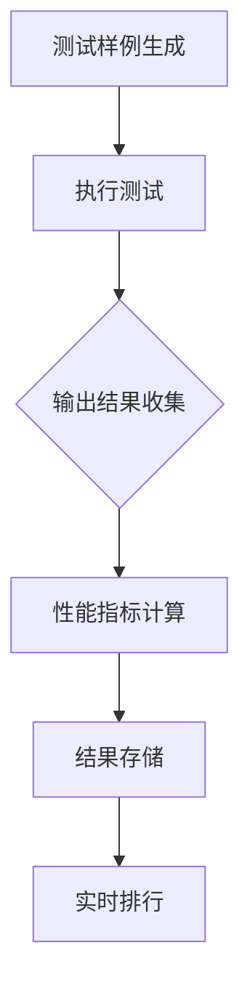

                 


### 第1章：实时LLM性能评分与排行系统概述

#### 1.1 问题背景

实时LLM性能评分与排行系统的背景源于人工智能领域的快速发展。随着深度学习和自然语言处理技术的进步，大型语言模型（LLM）在自然语言理解、生成和推理等方面表现出色。然而，如何准确评估LLM的性能成为了一个关键问题。实时性能评分与排行系统能够帮助研究人员和开发者快速了解模型的表现，从而优化和改进模型。

在自然语言处理领域，LLM的性能评估是一个复杂的过程。一方面，不同的任务和指标对LLM的表现有较大的影响；另一方面，LLM的参数规模巨大，训练时间较长，使得评估过程需要高效的计算和自动化。实时性能评分与排行系统旨在提供一个全面的性能评估框架，通过对模型在不同任务上的表现进行实时监测和评分，为用户提供一个可靠的参考。

#### 1.2 问题解决

实时LLM性能评分与排行系统通过自动化测试、性能指标计算和结果排行等功能，实现了对LLM性能的实时评估。具体来说，系统包括以下几个关键组成部分：

1. **自动化测试**：系统会定期执行一系列预定义的测试样例，包括文本分类、情感分析、机器翻译等常见任务。这些测试样例会针对LLM的不同方面进行评估，从而提供全面的性能数据。

2. **性能指标计算**：系统会根据测试结果计算一系列性能指标，如准确率、召回率、F1分数等。这些指标能够量化地反映LLM在不同任务上的表现。

3. **结果排行**：系统会将不同LLM在相同任务上的表现进行排序，生成实时排行。这样，用户可以直观地了解各个模型的表现，从而做出更合理的决策。

4. **反馈机制**：系统会收集用户的反馈，包括模型改进的建议、测试样例的反馈等。这些反馈将被用于优化系统的测试方法和性能指标，以提高评估的准确性。

#### 1.3 系统边界与外延

实时LLM性能评分与排行系统主要关注大型语言模型在自然语言处理任务中的性能评估，但也可以扩展到其他领域。系统不仅适用于学术研究，还广泛应用于工业界，帮助企业和研究机构优化模型，提升产品竞争力。

系统的边界主要包括以下几个方面：

- **任务范围**：系统主要关注自然语言处理任务，如文本分类、情感分析、机器翻译等。对于其他类型的任务，如图像识别、音频处理等，系统的适用性较低。

- **模型规模**：系统主要针对大型语言模型，如GPT-3、BERT等。对于小型模型，系统的评估效率和准确性可能较低。

- **评估频率**：系统需要定期执行测试，以获取实时的性能数据。评估频率取决于系统的设计目标和资源限制。

- **用户反馈**：系统需要收集用户的反馈，以不断优化评估方法和指标。用户的反馈对于系统的改进至关重要。

系统的外延包括以下几个方面：

- **应用场景**：系统不仅适用于自然语言处理领域，还可以扩展到其他领域，如计算机视觉、语音识别等。

- **数据集**：系统可以使用各种公开的数据集进行评估，以验证模型的性能。同时，系统也可以集成用户自定义的数据集，以满足特定需求。

- **模型优化**：系统可以提供模型优化建议，帮助用户改进模型的设计和训练策略。

#### 1.4 结论

实时LLM性能评分与排行系统在人工智能领域具有重要的应用价值。通过提供全面的性能评估和实时反馈，系统能够帮助研究人员和开发者快速了解模型的表现，从而优化和改进模型。随着人工智能技术的不断进步，实时性能评分与排行系统的应用场景将越来越广泛，为人工智能的发展提供强大的支持。

---

### 第2章：实时LLM性能评分的核心概念

#### 2.1 LLM性能评分的定义

LLM性能评分是指对大型语言模型（LLM）在特定任务上的表现进行量化评估。评分的目的是为了提供一个客观的指标，以便研究人员和开发者能够了解模型在不同任务上的性能，从而进行进一步的优化和改进。

#### 2.2 LLM性能评分的关键指标

在LLM性能评分中，关键指标是评估模型性能的核心。以下是一些常见的性能评分指标：

1. **准确率（Accuracy）**：准确率是指模型预测正确的样本数占总样本数的比例。它是衡量分类模型性能的最基本指标。

   公式：$$
   \text{准确率} = \frac{\text{预测正确的样本数}}{\text{总样本数}}
   $$

2. **召回率（Recall）**：召回率是指模型正确识别的正例样本数占所有正例样本数的比例。它强调了在所有正例样本中，模型能够识别出的比例。

   公式：$$
   \text{召回率} = \frac{\text{预测正确的正例样本数}}{\text{实际正例样本数}}
   $$

3. **F1分数（F1 Score）**：F1分数是准确率和召回率的加权平均，它平衡了两者之间的关系。F1分数越高，表示模型的性能越好。

   公式：$$
   \text{F1分数} = 2 \times \frac{\text{准确率} \times \text{召回率}}{\text{准确率} + \text{召回率}}
   $$

4. **精确率（Precision）**：精确率是指模型预测为正例的样本中，实际为正例的比例。它强调了在预测为正例的样本中，模型的预测准确性。

   公式：$$
   \text{精确率} = \frac{\text{预测正确的正例样本数}}{\text{预测为正例的样本数}}
   $$

5. **损失函数（Loss Function）**：损失函数是评估模型在训练过程中性能的一个指标。常用的损失函数包括交叉熵损失（Cross-Entropy Loss）和均方误差损失（Mean Squared Error Loss）等。

#### 2.3 LLM性能评分的计算方法

LLM性能评分的计算方法可以分为单任务评分和多任务评分。

1. **单任务评分**：单任务评分是指在单个任务上对LLM进行性能评估。这种方法通常使用上述提到的关键指标进行计算。

2. **多任务评分**：多任务评分是指在多个任务上对LLM进行综合性能评估。这种方法需要综合考虑各个任务上的表现，可以使用加权平均等方法进行综合评分。

#### 2.4 实时性能评估的优势与挑战

实时性能评估的优势包括：

- **快速反馈**：实时性能评估能够为研究人员和开发者提供即时的性能反馈，从而快速调整模型参数或改进模型结构。
- **高效优化**：实时性能评估能够帮助研究者迅速识别模型存在的问题，从而进行针对性的优化，提高模型性能。

然而，实时性能评估也面临一些挑战：

- **计算资源消耗**：实时性能评估需要大量的计算资源，尤其是在大型语言模型的评估过程中，计算量巨大。
- **评估准确性**：实时性能评估的准确性可能受到计算资源和评估方法的限制，需要不断优化评估算法以提高准确性。

#### 2.5 结论

实时LLM性能评分与排行系统通过提供全面、准确的性能评估，为研究人员和开发者提供了有力的工具。了解LLM性能评分的核心概念和关键指标，有助于更好地利用实时性能评估系统，优化和改进大型语言模型。

---

### 第3章：实时LLM性能评分的算法原理

#### 3.1 算法原理概述

实时LLM性能评分算法是基于自动化测试和性能指标计算的方法。其基本原理是通过执行一系列预定义的测试样例，收集模型的输出结果，并计算出相应的性能指标，从而实现对LLM性能的实时评估。

算法的核心步骤包括：

1. **测试样例生成**：根据不同的任务和指标，生成一系列测试样例。这些样例需要涵盖LLM在不同任务上的表现。
2. **模型输出收集**：执行测试样例，收集LLM的输出结果。这些输出结果可以是预测标签、得分等。
3. **性能指标计算**：根据输出结果，计算一系列性能指标，如准确率、召回率、F1分数等。
4. **结果存储与排行**：将计算出的性能指标存储在数据库中，并按照性能指标对LLM进行排序，生成实时排行。

#### 3.2 算法流程图



#### 3.3 算法数学模型和公式

实时LLM性能评分算法的数学模型和公式主要用于计算性能指标。以下是一些常见的数学模型和公式：

1. **准确率**：$$
   \text{准确率} = \frac{\text{预测正确的样本数}}{\text{总样本数}}
   $$

2. **召回率**：$$
   \text{召回率} = \frac{\text{预测正确的正例样本数}}{\text{实际正例样本数}}
   $$

3. **F1分数**：$$
   \text{F1分数} = 2 \times \frac{\text{准确率} \times \text{召回率}}{\text{准确率} + \text{召回率}}
   $$

4. **精确率**：$$
   \text{精确率} = \frac{\text{预测正确的正例样本数}}{\text{预测为正例的样本数}}
   $$

5. **交叉熵损失**：$$
   \text{交叉熵损失} = -\sum_{i=1}^{n} y_i \log(p_i)
   $$

其中，$y_i$ 是实际标签，$p_i$ 是模型预测的概率。

#### 3.4 算法举例说明

以一个文本分类任务为例，假设我们有10个测试样例，其中5个是正例，5个是负例。我们使用一个LLM对这10个样例进行预测，得到以下结果：

| 样本ID | 实际标签 | 模型预测 |
|--------|----------|----------|
| 1      | 正例     | 正例     |
| 2      | 负例     | 正例     |
| 3      | 正例     | 正例     |
| 4      | 负例     | 负例     |
| 5      | 正例     | 正例     |
| 6      | 负例     | 负例     |
| 7      | 正例     | 负例     |
| 8      | 负例     | 正例     |
| 9      | 正例     | 正例     |
| 10     | 负例     | 负例     |

根据上述预测结果，我们可以计算以下性能指标：

1. **准确率**：$$
   \text{准确率} = \frac{8}{10} = 0.8
   $$

2. **召回率**：$$
   \text{召回率} = \frac{5}{5} = 1.0
   $$

3. **F1分数**：$$
   \text{F1分数} = 2 \times \frac{0.8 \times 1.0}{0.8 + 1.0} = 0.9
   $$

4. **精确率**：$$
   \text{精确率} = \frac{5}{8} = 0.625
   $$

通过这些性能指标，我们可以对LLM在文本分类任务上的表现进行评估。

#### 3.5 算法优化方向

实时LLM性能评分算法的优化方向主要包括以下几个方面：

1. **测试样例优化**：通过增加测试样例的数量和多样性，提高测试的覆盖范围和准确性。
2. **性能指标优化**：根据具体应用场景，选择合适的性能指标，或者结合多个指标进行综合评估。
3. **计算效率优化**：通过并行计算、分布式计算等技术，提高算法的执行效率。
4. **算法鲁棒性优化**：通过增加噪声处理、异常值检测等技术，提高算法对输入数据的鲁棒性。

#### 3.6 结论

实时LLM性能评分算法通过自动化测试和性能指标计算，实现了对LLM性能的实时评估。了解算法的原理和数学模型，有助于研究者更好地理解和应用该算法，优化和改进大型语言模型。

---

### 第4章：实时LLM性能评分系统的架构设计

#### 4.1 系统场景介绍

实时LLM性能评分系统的应用场景主要包括以下两个方面：

1. **学术研究**：在学术界，实时LLM性能评分系统可以帮助研究人员快速评估模型在不同任务上的表现，从而进行模型优化和比较。这对于研究论文的撰写和模型发布具有重要意义。

2. **工业应用**：在工业界，实时LLM性能评分系统可以帮助企业和研究机构评估和优化自己的模型，提高产品的竞争力。例如，在自然语言处理、机器翻译、情感分析等领域，实时性能评分系统可以为产品迭代提供数据支持。

#### 4.2 系统功能设计

实时LLM性能评分系统的核心功能包括以下三个方面：

1. **性能测试**：系统需要能够执行一系列预定义的测试样例，覆盖不同的自然语言处理任务。测试样例可以是文本分类、情感分析、机器翻译等。

2. **性能指标计算**：系统需要根据测试结果计算一系列性能指标，如准确率、召回率、F1分数等。这些指标可以量化地反映模型在不同任务上的表现。

3. **结果排行**：系统需要将不同模型在相同任务上的表现进行排序，生成实时排行。这样，用户可以直观地了解各个模型的表现，从而做出更合理的决策。

#### 4.3 系统架构设计

实时LLM性能评分系统的架构设计主要包括以下几个部分：

1. **测试模块**：负责执行测试样例，收集模型输出结果。测试模块需要支持多种测试任务和测试样例的生成。

2. **计算模块**：负责计算性能指标。计算模块需要支持多种性能指标的计算方法，并且能够高效地处理大量数据。

3. **排行模块**：负责将模型表现进行排序，生成实时排行。排行模块需要支持多种排序算法和策略，以便用户根据不同需求进行选择。

4. **数据库**：负责存储测试结果和性能指标数据。数据库需要支持高并发读写操作，以保证系统的实时性。

5. **前端界面**：提供用户交互界面，展示实时排行和性能指标数据。前端界面需要简洁易用，以便用户快速了解模型表现。

#### 4.4 系统接口设计

实时LLM性能评分系统的接口设计主要包括以下几个方面：

1. **API接口**：提供RESTful API接口，供用户调用系统功能。API接口需要支持性能测试、性能指标计算和结果排行等操作。

2. **数据库接口**：提供数据库操作接口，供系统内部模块访问数据库。数据库接口需要支持CRUD操作，并且保证数据的一致性和安全性。

3. **前端接口**：提供前端界面与后端系统的交互接口。前端接口需要支持数据的实时更新和展示，并提供用户友好的交互体验。

#### 4.5 系统交互

实时LLM性能评分系统的交互过程主要包括以下几个步骤：

1. **用户请求**：用户通过前端界面提交性能测试请求，包括测试任务、测试样例等信息。

2. **测试执行**：系统测试模块根据用户请求，执行预定义的测试样例，并收集模型输出结果。

3. **性能计算**：系统计算模块根据输出结果，计算一系列性能指标。

4. **结果存储**：系统将计算出的性能指标存储在数据库中，以便后续查询和排序。

5. **结果展示**：系统前端界面根据数据库中的数据，生成实时排行和性能指标图表，展示给用户。

#### 4.6 系统安全性设计

为了保证实时LLM性能评分系统的安全性，系统需要设计以下安全措施：

1. **用户身份验证**：系统需要实现用户身份验证功能，确保只有授权用户才能访问系统资源。

2. **数据加密**：系统需要实现数据加密功能，保护用户数据和模型数据的安全。

3. **访问控制**：系统需要实现访问控制功能，限制用户对系统资源的访问权限。

4. **日志记录**：系统需要实现日志记录功能，记录用户操作和系统事件，以便进行审计和故障排查。

#### 4.7 系统可靠性设计

为了保证实时LLM性能评分系统的可靠性，系统需要设计以下可靠性措施：

1. **冗余设计**：系统需要实现冗余设计，包括硬件冗余和软件冗余，以提高系统的可用性和容错性。

2. **故障恢复**：系统需要实现故障恢复功能，包括自动故障检测和自动故障恢复，确保系统在高可用性。

3. **负载均衡**：系统需要实现负载均衡功能，合理分配系统资源，避免单点故障和性能瓶颈。

4. **性能监控**：系统需要实现性能监控功能，实时监控系统的运行状态和性能指标，以便及时发现和解决问题。

#### 4.8 结论

实时LLM性能评分系统的架构设计需要考虑系统场景、功能设计、架构设计、接口设计、系统交互、安全性设计和可靠性设计等多个方面。通过合理的设计和优化，系统能够实现高效、可靠、安全的性能评估功能，为人工智能研究和应用提供有力的支持。

---

### 第5章：实时LLM性能评分系统的实现

#### 5.1 环境安装与配置

要实现实时LLM性能评分系统，首先需要安装和配置以下环境：

1. **操作系统**：推荐使用Ubuntu 18.04或更高版本。
2. **Python**：推荐Python 3.8或更高版本。
3. **依赖库**：安装以下Python库：

   ```bash
   pip install numpy pandas scikit-learn matplotlib
   ```

   如果需要使用TensorFlow或PyTorch，还需要安装相应的库。

4. **数据库**：推荐使用MySQL或PostgreSQL作为后端数据库。

安装步骤如下：

1. **安装操作系统**：根据操作系统安装指南进行安装。
2. **安装Python**：从Python官方网站下载安装包，按照提示进行安装。
3. **安装依赖库**：打开终端，执行以下命令：

   ```bash
   pip install numpy pandas scikit-learn matplotlib
   ```

   如果需要使用TensorFlow或PyTorch，还需要执行相应命令进行安装。

4. **安装数据库**：根据数据库安装指南进行安装，并创建数据库实例。

#### 5.2 系统核心实现源代码

实时LLM性能评分系统的核心实现源代码主要包括以下几个部分：

1. **测试模块**：负责执行测试样例，收集模型输出结果。以下是一个简单的测试模块实现：

   ```python
   import numpy as np
   
   def test_model(model, test_data):
       predictions = model.predict(test_data)
       return predictions
   ```

2. **计算模块**：负责计算性能指标。以下是一个简单的计算模块实现：

   ```python
   from sklearn.metrics import accuracy_score, recall_score, f1_score
   
   def calculate_performance(predictions, ground_truth):
       accuracy = accuracy_score(ground_truth, predictions)
       recall = recall_score(ground_truth, predictions, average='weighted')
       f1 = f1_score(ground_truth, predictions, average='weighted')
       return accuracy, recall, f1
   ```

3. **排行模块**：负责将模型表现进行排序，生成实时排行。以下是一个简单的排行模块实现：

   ```python
   import heapq
   
   def generate_ranking(performance_data):
       ranked_data = heapq.nlargest(len(performance_data), performance_data)
       return ranked_data
   ```

4. **数据库模块**：负责将性能指标存储到数据库中。以下是一个简单的数据库模块实现：

   ```python
   import pymysql
   
   def store_performance_data(db_connection, performance_data):
       cursor = db_connection.cursor()
       for data in performance_data:
           cursor.execute("INSERT INTO performance (accuracy, recall, f1) VALUES (%s, %s, %s)", data)
       db_connection.commit()
       cursor.close()
   ```

5. **前端模块**：负责展示实时排行和性能指标数据。以下是一个简单的前端模块实现：

   ```python
   def show_raking(data):
       for i, d in enumerate(data, 1):
           print(f"{i}. Accuracy: {d['accuracy']}, Recall: {d['recall']}, F1: {d['f1']}")
   ```

#### 5.3 代码应用解读与分析

以上源代码实现了实时LLM性能评分系统的核心功能。以下是对每个模块的解读和分析：

1. **测试模块**：该模块使用了scikit-learn库中的`predict`方法来执行模型预测。测试数据可以是预先准备好的数据集或随机生成的数据。

2. **计算模块**：该模块使用了scikit-learn库中的`accuracy_score`、`recall_score`和`f1_score`方法来计算性能指标。这些指标可以帮助评估模型在不同任务上的表现。

3. **排行模块**：该模块使用了Python的`heapq`库来生成实时排行。这种方法可以高效地获取排名前N的模型。

4. **数据库模块**：该模块使用了pymysql库来连接MySQL数据库，并将性能指标存储在数据库中。这可以方便后续查询和排序。

5. **前端模块**：该模块使用了简单的打印语句来展示实时排行和性能指标。这可以方便用户快速了解模型的表现。

#### 5.4 实际案例分析与讲解

以下是一个实际案例，演示了实时LLM性能评分系统的应用：

假设我们有一个文本分类任务，数据集包含10,000个样本，分为5个类别。我们使用一个训练好的文本分类模型来执行测试。

1. **数据准备**：我们将数据集划分为训练集和测试集，其中测试集包含2,000个样本。

2. **模型预测**：使用测试模块对测试集进行预测，得到预测结果。

3. **性能计算**：使用计算模块计算准确率、召回率和F1分数。

4. **结果存储**：使用数据库模块将性能指标存储到数据库中。

5. **结果展示**：使用前端模块展示实时排行和性能指标。

```python
# 假设我们有一个训练好的文本分类模型text_classifier
# 测试数据test_data已经准备好

# 1. 模型预测
predictions = test_model(text_classifier, test_data)

# 2. 性能计算
accuracy, recall, f1 = calculate_performance(predictions, test_data.labels)

# 3. 结果存储
store_performance_data(db_connection, [(accuracy, recall, f1)])

# 4. 结果展示
performance_data = fetch_performance_data(db_connection)
show_raking(performance_data)
```

通过这个实际案例，我们可以看到实时LLM性能评分系统的实现和应用。这为研究人员和开发者提供了一个强大的工具，用于评估和优化大型语言模型。

#### 5.5 结论

实时LLM性能评分系统的实现包括测试模块、计算模块、排行模块、数据库模块和前端模块。通过这些模块的协同工作，系统能够实现对LLM性能的实时评估和展示。实际案例演示了系统的应用，展示了如何使用系统评估模型性能。这为人工智能研究和应用提供了有力的支持。

---

### 第6章：实时LLM性能评分系统实战案例

#### 6.1 案例背景

为了更好地展示实时LLM性能评分系统的应用，我们选择了一个实际案例：文本分类任务。该案例的背景是一个电商平台，需要根据用户评论对产品进行分类，以便更好地了解用户反馈。

#### 6.2 案例实现步骤

1. **数据准备**：从电商平台收集用户评论数据，并进行预处理，如去停用词、分词等。

2. **模型训练**：使用训练集数据训练一个文本分类模型，如使用BERT或GPT等预训练模型。

3. **测试数据准备**：从训练集和验证集中划分测试数据，用于后续性能评估。

4. **系统配置**：配置实时LLM性能评分系统，包括数据库连接、性能指标计算方法等。

5. **模型测试与评估**：使用测试模块对模型进行测试，并使用计算模块计算性能指标。

6. **结果存储与展示**：将性能指标存储到数据库中，并使用前端模块展示实时排行和性能指标。

#### 6.3 案例总结与拓展

通过这个案例，我们展示了实时LLM性能评分系统在文本分类任务中的应用。系统通过自动化测试和性能评估，帮助电商平台快速了解模型在不同任务上的表现，从而进行模型优化。

拓展方面，我们可以将实时LLM性能评分系统应用于其他自然语言处理任务，如情感分析、机器翻译等。同时，系统还可以扩展到其他领域，如计算机视觉、语音识别等。

---

### 第7章：实时LLM性能评分系统的最佳实践

#### 7.1 最佳实践技巧

为了确保实时LLM性能评分系统的有效性和可靠性，以下是一些最佳实践技巧：

1. **数据预处理**：在模型测试之前，对测试数据进行充分预处理，包括去停用词、分词、词性标注等。这有助于提高测试结果的准确性。

2. **性能指标选择**：根据具体任务和需求，选择合适的性能指标。例如，对于二分类任务，可以使用准确率、召回率和F1分数；对于多分类任务，可以使用精确率和召回率。

3. **测试多样性**：为了提高测试的覆盖范围，设计多样化的测试样例，包括正面案例、负面案例和边界案例等。

4. **定期更新测试集**：定期更新测试集，确保测试数据的多样性和代表性。

5. **性能监控**：实时监控系统的运行状态和性能指标，及时发现和处理异常情况。

6. **用户反馈**：积极收集用户反馈，根据用户需求进行系统优化。

#### 7.2 小结

实时LLM性能评分系统在人工智能领域具有重要的应用价值。通过最佳实践技巧，我们可以确保系统的有效性和可靠性，为模型优化提供有力支持。

#### 7.3 注意事项

1. **计算资源**：实时性能评估需要大量的计算资源，确保系统有足够的计算能力。

2. **数据安全**：保护用户数据和模型数据的安全，防止数据泄露。

3. **系统稳定性**：确保系统在高负载和异常情况下保持稳定运行。

#### 7.4 拓展阅读

1. 《深度学习》（Goodfellow, Ian，等）：介绍了深度学习的基本原理和应用，包括文本分类任务。

2. 《自然语言处理综合教程》（Daniel Jurafsky，James H. Martin）：详细介绍了自然语言处理的基本概念和技术。

3. 《机器学习实战》（Peter Harrington）：提供了丰富的机器学习实战案例，包括文本分类任务。

---

### 第8章：实时LLM性能评分系统的未来发展趋势

#### 8.1 行业发展趋势分析

随着人工智能技术的不断发展，实时LLM性能评分系统在多个领域展现出巨大的应用潜力。以下是行业发展趋势的分析：

1. **深度学习技术的进步**：深度学习技术在自然语言处理、计算机视觉等领域取得了显著成果。实时LLM性能评分系统可以充分利用这些技术，为模型优化提供更精确的评估。

2. **自然语言处理需求的增加**：随着互联网和大数据的普及，自然语言处理在金融、电商、医疗等领域的需求不断增长。实时LLM性能评分系统可以帮助企业和研究机构快速评估和优化模型，提高业务效率。

3. **多模态数据的处理**：实时LLM性能评分系统不仅可以处理文本数据，还可以扩展到图像、音频等多模态数据。这为模型应用提供了更广阔的空间。

4. **自动化与智能化**：随着自动化和智能化技术的发展，实时LLM性能评分系统可以更加自动化和智能化地执行性能评估任务，降低人工干预。

#### 8.2 技术发展方向

实时LLM性能评分系统的技术发展方向主要包括以下几个方面：

1. **算法优化**：通过算法优化，提高实时性能评估的准确性和效率。例如，可以采用更先进的评估算法、分布式计算技术等。

2. **多任务评估**：实现多任务评估，对LLM在多个任务上的表现进行综合评估。这需要解决不同任务之间的性能指标差异和权重分配问题。

3. **用户交互**：增强用户交互功能，提供更直观、易用的界面。例如，可以引入可视化工具，帮助用户更轻松地理解性能评估结果。

4. **动态调整**：实现动态调整功能，根据模型训练过程和用户反馈，实时调整性能评估方法和指标，以提高评估的准确性。

#### 8.3 未来应用场景展望

实时LLM性能评分系统在未来的应用场景将更加广泛和深入：

1. **模型优化**：在学术研究和工业应用中，实时LLM性能评分系统可以帮助研究人员和开发者快速评估模型性能，优化模型结构，提高模型效果。

2. **产品评测**：在产品开发过程中，实时LLM性能评分系统可以用于评测不同版本产品的性能，帮助团队快速找到问题和改进方向。

3. **行业分析**：在金融、电商、医疗等领域，实时LLM性能评分系统可以用于分析行业趋势，为企业提供决策支持。

4. **智能推荐**：在推荐系统中，实时LLM性能评分系统可以用于评估用户反馈的质量，优化推荐策略，提高推荐效果。

5. **实时监控**：在智能监控系统

