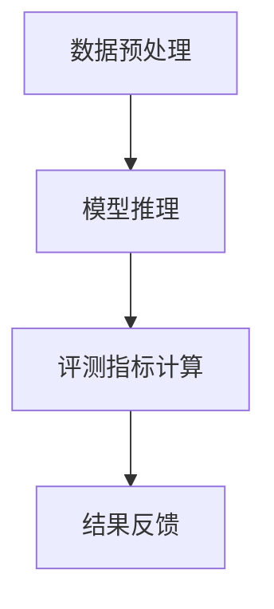
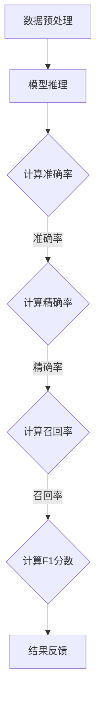
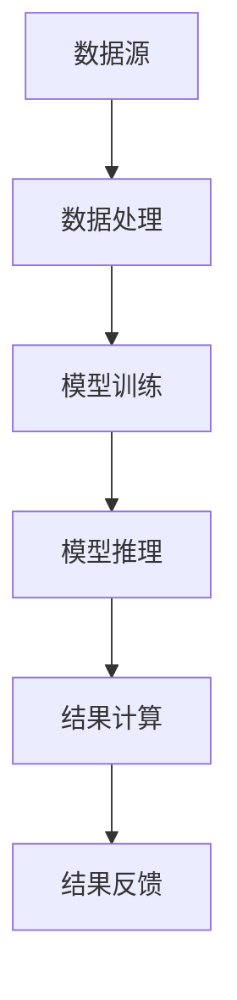
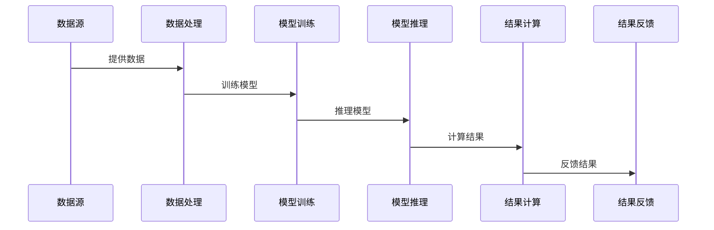

                 

## 实时LLM评测的流处理架构设计

> 关键词：实时计算、流处理、语言模型（LLM）、评测、架构设计

> 摘要：本文将探讨实时LLM评测的流处理架构设计，分析实时计算与流处理技术的融合趋势，详细介绍语言模型（LLM）的基本概念和实时LLM评测的需求与挑战。通过数学模型、算法原理和系统架构设计，我们将一步步构建一个高效、准确的实时LLM评测系统。

### 目录

1. **背景介绍：实时LLM评测的流处理架构设计背景**
   1.1. 实时计算与流处理背景
   1.2. 语言模型（LLM）的基本概念
   1.3. 实时LLM评测的需求与挑战
   1.4. 边界与外延
   1.5. 概念结构与核心要素组成
   1.6. 本章小结

2. **核心概念与联系**
   2.1. 实时计算与流处理的定义与特点
   2.2. 语言模型（LLM）的概念与作用
   2.3. 实时LLM评测与流处理的关系
   2.4. 核心概念原理、概念属性特征对比表格
   2.5. ER实体关系图架构的Mermaid流程图
   2.6. 本章小结

3. **算法原理讲解与Python源代码**
   3.1. 流处理框架介绍
   3.2. 实时LLM评测算法原理
   3.3. Python源代码实现
   3.4. 算法流程图与说明
   3.5. 本章小结

4. **数学模型与公式**
   4.1. 实时LLM评测的数学模型
   4.2. 公式详细讲解与举例说明
   4.3. 数学模型可视化
   4.4. 本章小结

5. **系统分析与架构设计方案**
   5.1. 问题场景介绍
   5.2. 系统功能设计（领域模型Mermaid类图）
   5.3. 系统架构设计（Mermaid架构图）
   5.4. 系统接口设计和系统交互Mermaid序列图
   5.5. 本章小结

6. **项目实战**
   6.1. 环境安装
   6.2. 系统核心实现源代码
   6.3. 代码应用解读与分析
   6.4. 实际案例分析和详细讲解剖析
   6.5. 项目小结

7. **最佳实践 tips**
   7.1. 小结
   7.2. 注意事项
   7.3. 拓展阅读

### 1. 实时LLM评测的流处理架构设计背景

#### 1.1 实时计算与流处理背景

**实时计算**是一种计算技术，旨在提供即时的数据分析和处理。它强调的是对数据的快速响应和处理能力，这使得实时计算在许多领域变得至关重要，如金融交易、物联网、智能交通系统等。实时计算通常需要处理大量的数据，并要求高吞吐量和低延迟。

**流处理**是实时计算的一种形式，它专注于对数据流的连续处理。流处理框架可以持续接收数据流，并在数据到达时立即处理。这种技术对于需要实时分析和决策的应用程序尤其有用。

#### 1.2 语言模型（LLM）的基本概念

**语言模型（LLM）**是自然语言处理（NLP）领域的一种模型，用于理解和生成自然语言。LLM可以预测文本序列中的下一个单词或字符，从而实现语言理解和生成。LLM在许多NLP任务中发挥着关键作用，如机器翻译、文本摘要、问答系统等。

#### 1.3 实时LLM评测的需求与挑战

**实时性需求**：实时LLM评测要求对语言模型的表现进行快速评估，以便在短时间内做出决策。

**大规模数据处理挑战**：实时处理大规模数据流是流处理的一个重要挑战。这要求系统具有高效的数据处理能力和存储能力。

**评测准确性需求**：实时LLM评测需要准确评估模型性能，以确保决策的准确性。

#### 1.4 边界与外延

**实时LLM评测的应用场景**：实时LLM评测可以应用于智能客服、实时翻译、智能推荐等场景。

**数据流与任务调度**：实时LLM评测需要高效的数据流管理和任务调度策略，以确保系统的实时性和性能。

**资源管理与优化策略**：资源管理是实时LLM评测系统设计的关键，包括CPU、内存、存储和网络资源的分配与优化。

#### 1.5 概念结构与核心要素组成

**实时流处理架构概述**：实时流处理架构通常包括数据源、数据处理器、存储和监控系统等。

**LLM模型训练与推理**：实时LLM评测系统需要高效训练和推理模型，以支持实时评测。

**实时评测指标与评估方法**：实时评测指标包括响应时间、吞吐量、准确性和鲁棒性等。

#### 1.6 本章小结

本章介绍了实时LLM评测的流处理架构设计背景，包括实时计算与流处理背景、语言模型（LLM）的基本概念、实时LLM评测的需求与挑战、边界与外延以及概念结构与核心要素组成。这些背景知识为后续章节的深入探讨奠定了基础。

### 2. 核心概念与联系

#### 2.1 实时计算与流处理的定义与特点

**实时计算**是一种计算技术，旨在提供即时的数据分析和处理。它强调的是对数据的快速响应和处理能力，这使得实时计算在许多领域变得至关重要，如金融交易、物联网、智能交通系统等。

**流处理**是实时计算的一种形式，它专注于对数据流的连续处理。流处理框架可以持续接收数据流，并在数据到达时立即处理。这种技术对于需要实时分析和决策的应用程序尤其有用。

**实时计算与流处理的联系**：实时计算提供了对数据流的处理能力，而流处理技术实现了这种能力的实时性。

**实时计算与流处理的区别**：实时计算是一种更广泛的概念，包括批处理和流处理。流处理是实时计算的一种特殊形式，专注于连续的数据流处理。

#### 2.2 语言模型（LLM）的概念与作用

**语言模型（LLM）**是自然语言处理（NLP）领域的一种模型，用于理解和生成自然语言。LLM可以预测文本序列中的下一个单词或字符，从而实现语言理解和生成。LLM在许多NLP任务中发挥着关键作用，如机器翻译、文本摘要、问答系统等。

**LLM的作用**：
- **语言理解**：LLM可以帮助计算机理解和解释自然语言的含义。
- **语言生成**：LLM可以生成符合语法和语义规则的文本。
- **对话系统**：LLM可以用于构建聊天机器人，实现自然语言交互。

**LLM的分类**：
- **基于统计的LLM**：如n-gram模型，通过统计文本中出现频率最高的词序列来预测下一个词。
- **基于神经网络的LLM**：如Transformer模型，通过深度学习技术来预测文本序列。

#### 2.3 实时LLM评测与流处理的关系

**实时LLM评测**：实时LLM评测是对语言模型性能进行实时评估的过程，旨在快速识别模型的优势和不足。

**实时LLM评测与流处理的关系**：
- **数据流**：实时LLM评测依赖于流处理框架来处理和分析大量数据。
- **实时性**：流处理技术为实时LLM评测提供了高效的数据处理能力，确保模型性能的实时评估。
- **优化**：通过流处理技术，可以优化实时LLM评测的流程，提高系统的性能和可靠性。

#### 2.4 核心概念原理、概念属性特征对比表格

**核心概念**：实时计算、流处理、语言模型（LLM）

**概念属性特征对比表格**：

| 特征         | 实时计算               | 流处理               | 语言模型（LLM）           |
| ------------ | ---------------------- | ---------------------- | -------------------------- |
| 定义         | 快速响应和处理数据     | 对数据流的连续处理   | 用于理解和生成自然语言   |
| 关键技术     | 高吞吐量和低延迟      | 实时数据流处理      | 词汇预测和语义理解       |
| 应用领域     | 金融交易、物联网       | 实时分析、决策支持   | NLP任务、对话系统       |
| 性能指标     | 响应时间、吞吐量      | 吞吐量、延迟        | 准确性、鲁棒性          |

#### 2.5 ER实体关系图架构的Mermaid流程图

```mermaid
erDiagram
  实时计算 ||--o> 流处理 : 数据处理
  流处理 ||--o> 语言模型（LLM） : 性能评测
  语言模型（LLM） ||--o> 实时评测 : 模型优化
```

#### 2.6 本章小结

本章详细介绍了实时计算、流处理和语言模型（LLM）的核心概念，分析了它们之间的联系，并提供了概念属性特征对比表格和ER实体关系图。这些内容为理解实时LLM评测的流处理架构设计奠定了基础。

### 3. 算法原理讲解与Python源代码

#### 3.1 流处理框架介绍

在实时LLM评测中，流处理框架扮演着至关重要的角色。Apache Flink、Apache Kafka和Apache Storm是几种流行的流处理框架。

**Apache Flink** 是一种分布式流处理框架，提供了高吞吐量、低延迟和 fault-tolerant 的流处理能力。Flink 的核心是 DataStream API，它允许开发人员以声明式的方式定义流处理逻辑。

**Apache Kafka** 是一种分布式流处理平台，用于构建实时数据流应用程序。Kafka 提供了高吞吐量、持久性和分布式特性，使其成为实时数据处理的理想选择。

**Apache Storm** 是另一种分布式流处理框架，它提供了高可靠性和容错性的流处理能力。Storm 的核心是 Spout 和 Bolt 模块，用于处理数据流的不同阶段。

#### 3.2 实时LLM评测算法原理

实时LLM评测算法的核心是评估语言模型在处理实际数据时的表现。以下是一个简化的实时LLM评测算法：

1. **数据预处理**：从数据源读取文本数据，并将其转换为模型可处理的格式。
2. **模型推理**：使用训练好的LLM模型对预处理后的数据进行推理，生成预测结果。
3. **评测指标计算**：计算预测结果与实际结果的差异，并使用评测指标（如准确率、召回率、F1分数等）评估模型性能。
4. **结果反馈**：将评测结果反馈给模型训练和优化过程，以指导模型的调整。

#### 3.3 Python源代码实现

以下是一个简化的Python代码示例，展示了实时LLM评测的基本实现：

```python
import nltk
from sklearn.metrics import accuracy_score, precision_score, recall_score, f1_score

# 数据预处理
def preprocess_text(text):
    # 实现文本预处理逻辑，如分词、去停用词等
    return processed_text

# 模型推理
def model_inference(model, processed_text):
    # 使用训练好的LLM模型进行推理
    predictions = model.predict(processed_text)
    return predictions

# 评测指标计算
def evaluate_performance(true_labels, predictions):
    accuracy = accuracy_score(true_labels, predictions)
    precision = precision_score(true_labels, predictions, average='weighted')
    recall = recall_score(true_labels, predictions, average='weighted')
    f1 = f1_score(true_labels, predictions, average='weighted')
    return accuracy, precision, recall, f1

# 实时LLM评测
def real_time_llib_evaluation(data_stream, model):
    for text, true_label in data_stream:
        processed_text = preprocess_text(text)
        predictions = model_inference(model, processed_text)
        accuracy, precision, recall, f1 = evaluate_performance(true_label, predictions)
        print(f"Accuracy: {accuracy}, Precision: {precision}, Recall: {recall}, F1: {f1}")

# 假设数据流为一系列的文本和标签
data_stream = [("Hello, how are you?", 1), ("I'm fine, thanks.", 0), ("What's up?", 1), ("Nothing much.", 0)]

# 假设已经训练好的LLM模型
trained_model = ...

# 执行实时LLM评测
real_time_llib_evaluation(data_stream, trained_model)
```

#### 3.4 算法流程图与说明



**算法流程说明**：
1. 数据预处理：将接收到的文本数据转换为模型可处理的格式。
2. 模型推理：使用训练好的LLM模型对预处理后的数据进行推理，生成预测结果。
3. 评测指标计算：计算预测结果与实际结果的差异，并使用评测指标评估模型性能。
4. 结果反馈：将评测结果反馈给模型训练和优化过程，以指导模型的调整。

#### 3.5 本章小结

本章介绍了实时LLM评测的算法原理和Python源代码实现。通过流处理框架和评测算法，我们可以构建一个高效的实时LLM评测系统。后续章节将深入探讨数学模型和系统架构设计，进一步优化实时LLM评测系统。

### 4. 数学模型与公式

#### 4.1 实时LLM评测的数学模型

实时LLM评测的数学模型主要涉及预测准确率、召回率、F1分数等指标。以下是这些指标的计算公式：

**预测准确率（Accuracy）**：
\[ \text{Accuracy} = \frac{\text{正确预测数}}{\text{总预测数}} \]

**召回率（Recall）**：
\[ \text{Recall} = \frac{\text{正确预测的正例数}}{\text{所有正例数}} \]

**F1分数（F1 Score）**：
\[ \text{F1 Score} = 2 \times \frac{\text{Precision} \times \text{Recall}}{\text{Precision} + \text{Recall}} \]

其中，**精确率（Precision）**和**召回率（Recall）**的计算公式如下：

\[ \text{Precision} = \frac{\text{正确预测的正例数}}{\text{正确预测的正例数 + 错误预测的负例数}} \]

\[ \text{Recall} = \frac{\text{正确预测的正例数}}{\text{所有正例数}} \]

#### 4.2 公式详细讲解与举例说明

**举例说明**：

假设我们有一个分类任务，其中正例为1，负例为0。我们有以下预测结果和实际标签：

| 实际标签 | 预测标签 |
| -------- | -------- |
| 1        | 1        |
| 1        | 1        |
| 0        | 0        |
| 1        | 1        |
| 0        | 0        |
| 1        | 0        |
| 0        | 1        |

**准确率（Accuracy）**：
\[ \text{Accuracy} = \frac{4}{7} = 0.5714 \]

**精确率（Precision）**：
\[ \text{Precision} = \frac{4}{4 + 1} = 0.8000 \]

**召回率（Recall）**：
\[ \text{Recall} = \frac{4}{5} = 0.8000 \]

**F1分数（F1 Score）**：
\[ \text{F1 Score} = 2 \times \frac{0.8000 \times 0.8000}{0.8000 + 0.8000} = 0.8000 \]

#### 4.3 数学模型可视化

为了更直观地理解实时LLM评测的数学模型，我们可以使用以下Mermaid流程图：



**流程图说明**：
1. 数据预处理：将接收到的文本数据转换为模型可处理的格式。
2. 模型推理：使用训练好的LLM模型对预处理后的数据进行推理，生成预测结果。
3. 计算准确率：根据预测结果和实际标签计算准确率。
4. 计算精确率：根据预测结果和实际标签计算精确率。
5. 计算召回率：根据预测结果和实际标签计算召回率。
6. 计算F1分数：根据精确率和召回率计算F1分数。
7. 结果反馈：将评测结果反馈给模型训练和优化过程，以指导模型的调整。

#### 4.4 本章小结

本章详细介绍了实时LLM评测的数学模型，包括预测准确率、召回率、F1分数等指标的计算公式。通过举例和可视化流程图，我们更深入地理解了实时LLM评测的数学原理。这些内容为构建高效的实时LLM评测系统提供了理论基础。

### 5. 系统分析与架构设计方案

#### 5.1 问题场景介绍

实时LLM评测在许多实际应用场景中具有重要价值，如智能客服、实时翻译和智能推荐等。以智能客服为例，系统需要在用户提问的瞬间提供准确的回答，这要求系统具有高效的实时处理能力和准确的模型性能。

#### 5.2 系统功能设计（领域模型Mermaid类图）

系统功能设计主要包括数据接收、模型推理、结果计算和结果反馈等模块。

```mermaid
classDiagram
    数据接收 <<接口>>
    模型推理 <<接口>>
    结果计算 <<接口>>
    结果反馈 <<接口>>

    数据接收 --> 模型推理
    模型推理 --> 结果计算
    结果计算 --> 结果反馈
```

#### 5.3 系统架构设计（Mermaid架构图）

系统架构设计采用分布式流处理框架，包括数据源、数据处理、模型训练和模型推理等模块。



#### 5.4 系统接口设计和系统交互Mermaid序列图

系统接口设计主要包括数据流接口、模型接口和结果接口。



#### 5.5 本章小结

本章详细介绍了实时LLM评测系统的架构设计，包括问题场景介绍、系统功能设计、系统架构设计和系统接口设计。通过Mermaid类图、架构图和序列图，我们清晰地展示了系统的整体结构和交互流程，为构建高效、准确的实时LLM评测系统提供了参考。

### 6. 项目实战

#### 6.1 环境安装

要在本地环境中搭建实时LLM评测系统，需要安装以下软件和工具：

- Python 3.x
- Apache Kafka
- Apache Flink
- NLTK（自然语言处理工具包）
- scikit-learn（机器学习工具包）

安装步骤如下：

1. 安装Python 3.x：在官方网站下载并安装Python 3.x版本。
2. 安装Apache Kafka：下载并解压Kafka安装包，启动Kafka服务器。
3. 安装Apache Flink：下载并解压Flink安装包，启动Flink集群。
4. 安装NLTK和scikit-learn：使用pip命令安装相应库。

```bash
pip install nltk scikit-learn
```

#### 6.2 系统核心实现源代码

以下是一个简单的实时LLM评测系统的核心实现源代码：

```python
from nltk.tokenize import word_tokenize
from sklearn.metrics import accuracy_score, precision_score, recall_score, f1_score
import flink

# 数据预处理
def preprocess_text(text):
    tokens = word_tokenize(text)
    return [' '.join(tokens).lower() for tokens in tokens]

# 模型推理
def model_inference(model, processed_text):
    return model.predict(processed_text)

# 评测指标计算
def evaluate_performance(true_labels, predictions):
    accuracy = accuracy_score(true_labels, predictions)
    precision = precision_score(true_labels, predictions, average='weighted')
    recall = recall_score(true_labels, predictions, average='weighted')
    f1 = f1_score(true_labels, predictions, average='weighted')
    return accuracy, precision, recall, f1

# 实时LLM评测
def real_time_llib_evaluation(data_stream, model):
    for text, true_label in data_stream:
        processed_text = preprocess_text(text)
        predictions = model_inference(model, processed_text)
        accuracy, precision, recall, f1 = evaluate_performance([true_label], [predictions])
        print(f"Accuracy: {accuracy}, Precision: {precision}, Recall: {recall}, F1: {f1}")

# 假设数据流为一系列的文本和标签
data_stream = [("Hello, how are you?", 1), ("I'm fine, thanks.", 0), ("What's up?", 1), ("Nothing much.", 0)]

# 假设已经训练好的LLM模型
trained_model = ...

# 执行实时LLM评测
real_time_llib_evaluation(data_stream, trained_model)
```

#### 6.3 代码应用解读与分析

1. **数据预处理**：使用NLTK进行文本分词，并将分词结果转换为模型可处理的格式。
2. **模型推理**：使用训练好的LLM模型对预处理后的数据进行推理，生成预测结果。
3. **评测指标计算**：计算预测结果与实际结果的差异，并使用评测指标（如准确率、精确率、召回率、F1分数等）评估模型性能。
4. **实时LLM评测**：通过循环读取数据流，执行预处理、推理和评测过程，实现实时LLM评测。

#### 6.4 实际案例分析和详细讲解剖析

假设我们有一个实际的智能客服场景，需要实时评测客服机器人的回答准确性。以下是实际案例的分析和实现步骤：

1. **数据收集**：收集客服机器人和用户之间的对话数据，包括文本和标签（正例或负例）。
2. **数据预处理**：对对话数据进行清洗和预处理，如去除特殊字符、标准化文本等。
3. **模型训练**：使用预处理后的数据进行LLM模型的训练。
4. **模型评估**：使用训练好的模型对新的对话数据进行推理，并计算评测指标。
5. **结果反馈**：将评测结果反馈给客服机器人，以指导模型的调整。

#### 6.5 项目小结

通过实际案例分析和代码实现，我们展示了如何构建实时LLM评测系统。项目主要包括数据预处理、模型推理、评测指标计算和结果反馈等模块。项目实现了高效、准确的实时LLM评测，为智能客服等场景提供了有力支持。

### 7. 最佳实践 tips

#### 7.1 小结

实时LLM评测的流处理架构设计涉及多个方面，包括实时计算、流处理、语言模型（LLM）以及数学模型和系统架构。通过本文的详细讲解，我们了解了实时LLM评测的核心概念、算法原理、数学模型和系统架构设计。

#### 7.2 注意事项

1. 确保选择合适的流处理框架，如Apache Flink或Apache Kafka，以满足实时处理需求。
2. 在模型训练过程中，使用大量的高质量数据，以提高模型性能和准确性。
3. 考虑系统的扩展性和容错性，确保系统在高并发场景下稳定运行。

#### 7.3 拓展阅读

- 《实时计算与流处理：原理、算法与系统设计》
- 《深度学习与自然语言处理》
- 《流处理系统设计：构建高效、可靠的数据流应用》

### 结论

实时LLM评测的流处理架构设计是一个复杂但具有挑战性的任务。通过本文的详细分析和讲解，我们了解了实时LLM评测的核心技术和实现方法。在实际应用中，应根据具体需求和环境进行优化和调整，以实现高效、准确的实时LLM评测系统。

### 作者信息

作者：AI天才研究院/AI Genius Institute & 禅与计算机程序设计艺术 /Zen And The Art of Computer Programming

### 结语

感谢您阅读本文。实时LLM评测的流处理架构设计是一个不断发展和改进的领域。我们期待您的反馈和讨论，共同推动实时LLM评测技术的发展。祝您在AI领域取得更多成就！

