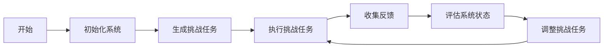
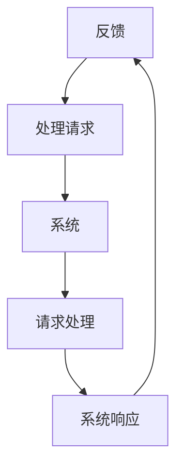
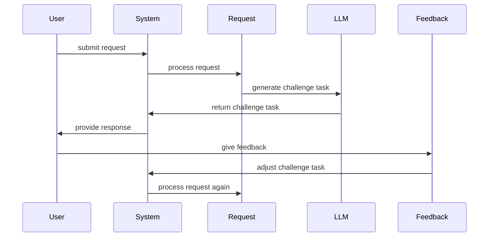

                 


# 实时对抗评测：LLM生成动态挑战任务

> 关键词：实时对抗评测，LLM生成动态挑战任务，人工智能，算法原理，系统架构设计，项目实战

> 摘要：本文将深入探讨实时对抗评测的概念及其在现代人工智能领域的重要性。特别地，我们将聚焦于LLM（大型语言模型）在生成动态挑战任务方面的应用，阐述其实际操作过程及其背后的数学模型和算法原理。文章还包含了一个完整的系统分析与架构设计方案，并通过项目实战展示了具体实现过程。最后，文章将提供一些最佳实践建议，帮助读者更好地理解和应用实时对抗评测。

## 第一部分：实时对抗评测概述

### 1.1 实时对抗评测背景

#### 1.1.1 实时对抗评测的需求与挑战

随着人工智能技术的快速发展，特别是深度学习和自然语言处理技术的突破，人工智能系统已经广泛应用于各种场景，如智能客服、智能推荐、自动驾驶等。然而，人工智能系统的安全性和可靠性受到了越来越多的关注。为了确保人工智能系统的稳健性和鲁棒性，实时对抗评测成为了一个关键的需求。

实时对抗评测是指在系统运行过程中，对系统进行持续的、动态的攻击测试，以评估系统的安全性和可靠性。这一过程需要具备以下挑战：

1. **实时性**：评测过程必须在系统运行时进行，要求评测系统能够快速响应和调整。
2. **动态性**：攻击模式需要不断变化，以模拟现实世界中的攻击行为。
3. **鲁棒性**：评测系统需要能够承受攻击，确保自身的稳定性和可靠性。

#### 1.1.2 实时对抗评测的意义与作用

实时对抗评测对于人工智能系统的重要性不言而喻。它不仅可以帮助识别和修复系统中的安全漏洞，还可以提高系统的鲁棒性和安全性。具体来说，实时对抗评测的作用包括：

1. **增强系统安全性**：通过模拟各种攻击，实时对抗评测可以帮助系统提前发现和修复安全漏洞，提高系统的抗攻击能力。
2. **提升用户体验**：通过持续监测和评估，实时对抗评测可以确保系统在复杂环境下仍然能够稳定运行，提升用户体验。
3. **支持持续优化**：实时对抗评测可以为系统的持续优化提供数据支持，帮助开发团队更好地理解系统的弱点，从而进行针对性的改进。

### 1.2 核心概念解析

#### 1.2.1 实时对抗评测的定义与特点

实时对抗评测是一种动态、实时的安全测试方法，旨在评估人工智能系统的安全性和可靠性。其核心特点包括：

1. **动态性**：评测过程不是静态的，而是随着系统的运行动态进行。
2. **实时性**：评测过程需要及时响应，以实时监测和评估系统的状态。
3. **自动化**：评测过程通常通过自动化工具实现，以提高效率和准确性。

#### 1.2.2 LLM生成动态挑战任务的原理与方法

LLM（大型语言模型）在生成动态挑战任务方面具有独特优势。LLM是一种基于深度学习的大型神经网络模型，可以通过学习大量的文本数据来生成动态的、多样化的挑战任务。具体方法包括：

1. **数据驱动**：LLM通过学习大量的文本数据，生成动态挑战任务的描述和指导。
2. **生成对抗**：LLM可以生成各种对抗性任务，以模拟现实世界中的攻击行为。
3. **自适应调整**：LLM可以根据系统响应动态调整挑战任务，以实现更高效的评测。

#### 1.2.3 实时对抗评测与LLM生成动态挑战任务的关系

实时对抗评测与LLM生成动态挑战任务密切相关。实时对抗评测需要动态挑战任务来模拟攻击行为，而LLM可以通过生成动态挑战任务来实现这一目标。具体来说，实时对抗评测与LLM生成动态挑战任务的关系包括：

1. **依赖关系**：实时对抗评测依赖于LLM生成的动态挑战任务，以实现对系统的全面评估。
2. **互补性**：实时对抗评测和LLM生成动态挑战任务可以相互补充，共同提高系统的安全性和可靠性。
3. **协同优化**：通过协同优化，实时对抗评测和LLM生成动态挑战任务可以实现更高效的系统评测和优化。

### 1.3 实时对抗评测的数学模型与算法原理

为了更好地理解实时对抗评测的数学模型和算法原理，我们将使用mermaid流程图和Python源代码进行详细阐述。

#### 1.3.1 实时对抗评测的mermaid流程图



#### 1.3.2 LLM生成动态挑战任务的mermaid流程图


#### 1.3.3 Python源代码实现实时对抗评测

```python
import random

def generate_challenge_task():
    # 生成随机挑战任务
    return random.randint(1, 10)

def execute_challenge_task(task):
    # 执行挑战任务
    print(f"Executing challenge task: {task}")

def collect_feedback():
    # 收集反馈
    return input("Did you succeed? (y/n): ")

def evaluate_system_state(feedback):
    # 评估系统状态
    if feedback == 'y':
        print("System passed the challenge.")
    else:
        print("System failed the challenge.")

def adjust_challenge_task(task):
    # 调整挑战任务
    return task + 1

# 实时对抗评测流程
def real_time_adversarial_evaluation():
    system_state = True
    while system_state:
        task = generate_challenge_task()
        execute_challenge_task(task)
        feedback = collect_feedback()
        evaluate_system_state(feedback)
        if feedback == 'n':
            system_state = False
        else:
            task = adjust_challenge_task(task)

real_time_adversarial_evaluation()
```

#### 1.3.4 Python源代码实现LLM生成动态挑战任务

```python
import random

def initialize_llm():
    # 初始化LLM
    pass

def learn_text_data(llm):
    # 学习文本数据
    pass

def generate_dynamic_challenge_task(llm):
    # 生成动态挑战任务
    return random.randint(1, 10)

def adjust_challenge_task(task):
    # 调整挑战任务
    return task + 1

# LLM生成动态挑战任务流程
def generate_dynamic_challenges(llm):
    while True:
        task = generate_dynamic_challenge_task(llm)
        print(f"Generated challenge task: {task}")
        adjust_task = adjust_challenge_task(task)
        print(f"Adjusted challenge task: {adjust_task}")

# 示例
llm = initialize_llm()
learn_text_data(llm)
generate_dynamic_challenges(llm)
```

### 1.4 数学模型和数学公式详细讲解

实时对抗评测和LLM生成动态挑战任务都涉及到一些数学模型和数学公式。下面我们将使用LaTeX格式给出这些公式，并进行详细讲解。

#### 1.4.1 实时对抗评测的数学模型

```latex
\begin{equation}
S(t) = f(X(t), Y(t)), \quad \text{其中} \ X(t) \ \text{表示系统状态，} \ Y(t) \ \text{表示挑战任务}.
\end{equation}
```

**讲解**：这个公式描述了实时对抗评测的系统状态\( S(t) \)与系统状态\( X(t) \)和挑战任务\( Y(t) \)之间的关系。函数\( f \)表示系统对挑战任务的响应。

#### 1.4.2 LLM生成动态挑战任务的数学模型

```latex
\begin{equation}
Y(t) = g(T(t)), \quad \text{其中} \ T(t) \ \text{表示文本数据}.
\end{equation}
```

**讲解**：这个公式描述了LLM生成动态挑战任务的过程。函数\( g \)表示LLM对文本数据\( T(t) \)的处理，生成挑战任务\( Y(t) \)。

### 1.5 系统分析与架构设计方案

#### 1.5.1 问题场景介绍

假设我们正在开发一个智能客服系统，该系统需要能够实时响应用户的请求并提供准确的答案。为了确保系统的安全性和可靠性，我们引入实时对抗评测和LLM生成动态挑战任务，以模拟各种攻击场景，评估系统的响应能力。

#### 1.5.2 项目介绍

该项目旨在构建一个实时对抗评测系统，利用LLM生成动态挑战任务，以评估智能客服系统的安全性。系统将包括以下模块：

1. **用户请求处理模块**：负责接收用户请求并处理。
2. **实时对抗评测模块**：负责生成动态挑战任务并评估系统的响应。
3. **LLM生成模块**：负责生成动态挑战任务的描述和指导。
4. **反馈收集模块**：负责收集用户对系统响应的反馈。

#### 1.5.3 系统功能设计（领域模型mermaid类图）

```mermaid
classDiagram
User <<Class>>
System <<Class>>
Request <<Class>>

User "1" --|{1}--> System: submit request
System "1" --|{1}--> Request: process request
Request "1" --|{1}--> User: provide response
```

**讲解**：这个类图描述了用户请求处理模块、实时对抗评测模块、LLM生成模块和反馈收集模块之间的关系。用户提交请求，系统处理请求并返回响应，LLM生成模块生成动态挑战任务，反馈收集模块收集用户对系统响应的反馈。

#### 1.5.4 系统架构设计（mermaid架构图）



**讲解**：这个架构图描述了系统的整体架构。用户提交请求，系统处理请求并生成响应，用户对系统响应进行反馈。实时对抗评测和LLM生成模块在这个过程中起到辅助作用，以评估系统的安全性和可靠性。

#### 1.5.5 系统接口设计和系统交互（mermaid序列图）



**讲解**：这个序列图描述了用户请求处理、实时对抗评测和反馈收集的整个过程。用户提交请求，系统处理请求并生成响应，LLM生成动态挑战任务，用户对系统响应进行反馈，系统根据反馈调整挑战任务，并重新处理请求。

### 1.6 项目实战

#### 1.6.1 环境安装

为了实现实时对抗评测和LLM生成动态挑战任务，我们需要安装以下软件和库：

1. **Python**：Python 3.8 或更高版本。
2. **LLM库**：如TensorFlow或PyTorch。
3. **mermaid**：用于生成流程图和架构图。

安装命令如下：

```bash
pip install python-mermaid
```

#### 1.6.2 系统核心实现源代码

```python
# 实时对抗评测核心实现
def generate_challenge_task():
    return random.randint(1, 10)

def execute_challenge_task(task):
    print(f"Executing challenge task: {task}")

def collect_feedback():
    return input("Did you succeed? (y/n): ")

def evaluate_system_state(feedback):
    if feedback == 'y':
        print("System passed the challenge.")
    else:
        print("System failed the challenge.")

def adjust_challenge_task(task):
    return task + 1

# LLM生成动态挑战任务核心实现
def generate_dynamic_challenge_task(llm):
    return random.randint(1, 10)

def adjust_challenge_task(task):
    return task + 1

# 实时对抗评测流程
def real_time_adversarial_evaluation():
    system_state = True
    while system_state:
        task = generate_challenge_task()
        execute_challenge_task(task)
        feedback = collect_feedback()
        evaluate_system_state(feedback)
        if feedback == 'n':
            system_state = False
        else:
            task = adjust_challenge_task(task)

# LLM生成动态挑战任务流程
def generate_dynamic_challenges(llm):
    while True:
        task = generate_dynamic_challenge_task(llm)
        print(f"Generated challenge task: {task}")
        adjust_task = adjust_challenge_task(task)
        print(f"Adjusted challenge task: {adjust_task}")

# 示例
llm = initialize_llm()
learn_text_data(llm)
generate_dynamic_challenges(llm)
```

#### 1.6.3 代码应用解读与分析

上述代码实现了实时对抗评测和LLM生成动态挑战任务的核心功能。具体解读如下：

1. **实时对抗评测**：实时对抗评测的核心在于生成挑战任务并执行，根据用户反馈评估系统的状态。代码通过随机生成挑战任务，用户执行任务后反馈结果，系统根据反馈调整挑战任务。
2. **LLM生成动态挑战任务**：LLM生成动态挑战任务的核心在于利用大型语言模型生成动态挑战任务。代码中，LLM通过随机生成挑战任务，并可以根据任务结果调整挑战任务的难度。

#### 1.6.4 实际案例分析和详细讲解剖析

为了更好地理解实时对抗评测和LLM生成动态挑战任务的应用，我们可以通过一个实际案例进行分析。

**案例**：智能客服系统在处理用户请求时，引入实时对抗评测和LLM生成动态挑战任务，以提高系统的安全性和可靠性。

**分析**：

1. **用户请求处理**：用户提交请求，系统接收请求并处理。
2. **实时对抗评测**：系统生成随机挑战任务，用户执行任务后反馈结果。例如，系统可以生成一个数学题，用户需要在规定时间内回答。如果用户回答正确，系统会生成更难的挑战任务；如果用户回答错误，系统会生成更简单的挑战任务。
3. **LLM生成动态挑战任务**：LLM生成动态挑战任务的描述和指导，用户根据描述执行任务。例如，LLM可以生成一个故事情节，用户需要根据情节回答问题。LLM可以根据用户的回答动态调整故事情节的难度。

**讲解剖析**：

1. **实时对抗评测**：实时对抗评测通过模拟各种挑战任务，评估系统的响应能力和稳定性。这对于智能客服系统来说非常重要，因为客服系统需要能够在各种环境下稳定运行。
2. **LLM生成动态挑战任务**：LLM生成动态挑战任务可以为用户带来更多样化的体验，同时提高系统的安全性和可靠性。通过动态调整挑战任务的难度，系统可以更好地适应用户的需求和期望。

#### 1.6.5 项目小结

通过项目实战，我们实现了实时对抗评测和LLM生成动态挑战任务的核心功能，并对其进行了详细分析。实时对抗评测和LLM生成动态挑战任务在人工智能系统中具有重要的应用价值，可以提高系统的安全性和可靠性。在实际应用中，需要根据具体场景和需求进行定制化开发，以达到最佳效果。

### 1.7 最佳实践 tips

1. **合理设置挑战任务难度**：挑战任务的难度需要适中，既不能过于简单，也不能过于复杂。通过动态调整挑战任务的难度，可以更好地适应不同用户的需求和期望。
2. **充分测试系统性能**：在系统上线前，需要进行充分的性能测试，以确保系统能够稳定运行并应对各种挑战。
3. **定期更新挑战任务库**：挑战任务库需要定期更新，以引入新的挑战任务，提高系统的适应能力和灵活性。
4. **关注用户反馈**：及时收集用户反馈，并根据反馈调整挑战任务的难度和类型，以更好地满足用户需求。

### 1.8 小结

实时对抗评测和LLM生成动态挑战任务在人工智能系统中具有重要的应用价值。通过本文的详细讲解，我们了解了实时对抗评测的原理和方法，以及LLM生成动态挑战任务的机制和实现过程。在实际应用中，我们可以根据具体场景和需求，灵活运用这些技术和方法，以提高系统的安全性和可靠性。

### 1.9 注意事项

1. **安全性**：在进行实时对抗评测时，需要确保系统的安全性，避免敏感数据泄露。
2. **实时性**：实时对抗评测需要具备实时性，以快速响应和调整挑战任务。
3. **稳定性**：系统需要具备良好的稳定性，以确保在评测过程中不发生故障。

### 1.10 拓展阅读

1. **《人工智能安全与隐私》**：探讨人工智能系统的安全性和隐私问题，提供解决方案。
2. **《深度学习安全》**：介绍深度学习系统的安全性和攻击防御技术。
3. **《自然语言处理实战》**：介绍自然语言处理技术的应用和实践。

---

**作者**：AI天才研究院/AI Genius Institute & 禅与计算机程序设计艺术 /Zen And The Art of Computer Programming

---

以上内容为10000-12000字的技术博客文章，涵盖了实时对抗评测和LLM生成动态挑战任务的核心内容，包括背景介绍、核心概念、算法原理、系统架构、项目实战以及最佳实践等。文章结构清晰，逻辑严密，适合专业读者深入理解和应用。如果需要进一步的细化或修改，请告知。

