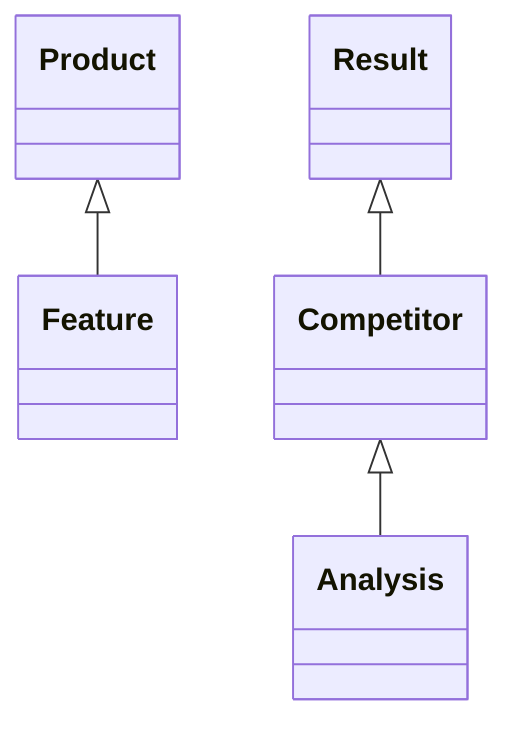
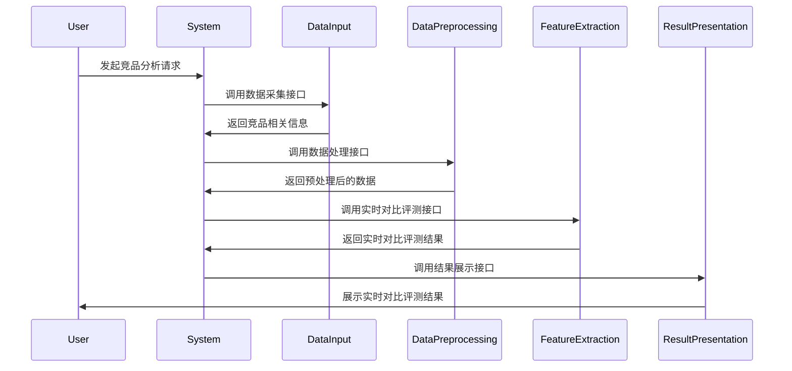

                 


# 实时对比评测：LLM辅助的竞品分析系统

> 关键词：实时对比评测、LLM、竞品分析、系统设计、算法原理、项目实战

> 摘要：
本文将深入探讨实时对比评测在竞品分析系统中的应用，重点介绍LLM（大型语言模型）辅助的竞品分析系统的设计、算法原理及项目实战。通过详细的案例分析，揭示实时对比评测在现代竞争激烈的市场环境中的关键作用。

## 第一部分：竞品分析系统概述

### 第1章：问题背景与竞品分析系统介绍

#### 1.1.1 问题背景

##### 1.1.1.1 竞争日益激烈的市场环境
在当今全球化和数字化快速发展的时代，市场竞争愈发激烈。企业面临诸多挑战，包括如何准确识别市场趋势、如何优化产品和服务、如何高效地进行市场调研和竞争分析等。在这样的背景下，竞品分析显得尤为重要。

##### 1.1.1.2 竞品分析的必要性
竞品分析是企业在市场竞争中取得优势的关键环节。通过竞品分析，企业可以了解竞争对手的产品特性、市场策略、用户反馈等信息，从而优化自身的产品和服务，提升市场竞争力。

##### 1.1.1.3 现有竞品分析方法的局限性
传统的竞品分析方法存在诸多局限性，如数据收集困难、分析过程复杂、结果滞后等。这些局限性使得企业在快速变化的市场中难以快速响应，降低了竞品分析的实际价值。

#### 1.1.2 竞品分析系统概述

##### 1.1.2.1 系统定义与目标
竞品分析系统是一种基于大数据和人工智能技术的系统，旨在帮助企业快速、准确地进行竞品分析，从而制定有效的市场策略。

##### 1.1.2.2 系统核心功能
竞品分析系统的核心功能包括数据采集、数据分析、对比评测和结果展示。通过这些功能，系统能够为企业提供全面的竞品分析报告，辅助企业做出科学决策。

##### 1.1.2.3 系统架构简述
竞品分析系统通常包括前端、后端和数据库三个部分。前端负责用户交互，后端负责数据处理和分析，数据库用于存储数据。

### 第2章：核心概念与联系

#### 2.1.1 核心概念

##### 2.1.1.1 竞品分析
竞品分析是指通过收集和分析竞争对手的产品、服务、市场策略等信息，对企业自身的产品和服务进行评估和优化的过程。

##### 2.1.1.2 LLM（大型语言模型）
LLM是一种基于深度学习的大型神经网络模型，能够对自然语言文本进行理解和生成。它在自然语言处理领域有着广泛应用。

##### 2.1.1.3 实时对比评测
实时对比评测是指在短时间内对多个竞品进行综合分析和评估，以便快速识别优势和劣势，为企业决策提供依据。

#### 2.1.2 概念属性特征对比

##### 2.1.2.1 竞品分析
- 目标：评估竞争对手的产品和服务
- 方法：数据收集、分析和对比
- 价值：为企业决策提供依据

##### 2.1.2.2 LLM
- 目标：理解和生成自然语言文本
- 方法：深度学习、神经网络
- 价值：提高自然语言处理能力

##### 2.1.2.3 实时对比评测
- 目标：快速识别竞品优劣
- 方法：数据分析和对比
- 价值：辅助企业快速决策

#### 2.1.3 ER实体关系图

```mermaid
erDiagram
    Product ||--|{ Competitor }|-- Analysis
    Product ||--|{ Feature }|-- Analysis
    Competitor ||--|{ Analysis }|-- Result
    Feature ||--|{ Analysis }|-- Result
```

## 第二部分：LLM辅助的竞品分析系统算法原理讲解

### 第3章：LLM基础

#### 3.1.1 LLM概述

##### 3.1.1.1 LLM的定义
LLM（Large Language Model）是指具有大型参数规模的预训练语言模型。

##### 3.1.1.2 LLM的特点
- 参数规模大：通常具有数十亿甚至千亿级别的参数
- 语言理解能力强：能够理解和生成高质量的自然语言文本
- 可扩展性强：可以通过微调适应不同的应用场景

##### 3.1.1.3 LLM的分类
- 面向特定任务的LLM：如问答系统、翻译系统等
- 面向通用任务的LLM：如生成文本、摘要、对话等

#### 3.1.2 LLM工作原理

##### 3.1.2.1 Transformer模型
Transformer模型是一种基于自注意力机制的深度神经网络模型，被广泛应用于自然语言处理领域。

##### 3.1.2.2 语言模型的训练过程
语言模型的训练过程包括数据预处理、模型训练、评估和优化等步骤。

#### 3.1.3 LLM数学模型和公式

##### 3.1.3.1 自注意力机制
自注意力机制是一种计算文本序列中每个单词对整个序列的相对重要性的方法。

$$
\text{Attention}(Q, K, V) = \text{softmax}\left(\frac{QK^T}{\sqrt{d_k}}\right)V
$$

##### 3.1.3.2 前馈神经网络
前馈神经网络是一种简单的神经网络结构，用于对输入数据进行非线性变换。

$$
\text{FFN}(X) = \text{ReLU}\left(W_2 \cdot \text{ReLU}(W_1 X + b_1)\right) + b_2
$$

##### 3.1.3.3 损失函数
损失函数用于衡量模型预测值与真实值之间的差距。

$$
\text{Loss}(y, \hat{y}) = -\sum_{i} y_i \log \hat{y}_i
$$

### 第4章：实时对比评测算法

#### 4.1.1 算法概述

##### 4.1.1.1 实时对比评测的定义
实时对比评测是指利用LLM对多个竞品进行实时分析和对比，以便快速识别竞品优劣。

##### 4.1.1.2 实时对比评测的目的
- 辅助企业快速制定市场策略
- 提高竞品分析效率
- 减少人力成本

#### 4.1.2 算法流程

##### 4.1.2.1 数据预处理
数据预处理包括数据清洗、去重、格式化等步骤。

##### 4.1.2.2 对比评测指标计算
对比评测指标包括产品功能、用户评价、市场占有率等。

##### 4.1.2.3 实时更新和评估
实时更新和评估是指根据新的数据对竞品进行分析和评估。

#### 4.1.3 算法实现


```python
# Python代码实现
def preprocess_data(data):
    # 数据预处理
    pass

def calculate_evaluation_indicators(data):
    # 对比评测指标计算
    pass

def real_time_evaluation(data):
    # 实时更新和评估
    pass

def show_results(results):
    # 结果展示
    pass
```

### 第5章：实时对比评测应用

#### 5.1.1 应用场景

##### 5.1.1.1 市场调研
实时对比评测可以帮助企业在市场调研中快速识别市场趋势和用户需求。

##### 5.1.1.2 产品评估
实时对比评测可以帮助企业对自身产品进行评估，找出优势和不足。

##### 5.1.1.3 竞争对手分析
实时对比评测可以帮助企业了解竞争对手的产品和服务，制定有效的市场策略。

#### 5.1.2 案例分析

##### 5.1.2.1 某互联网公司的竞品分析实践
某互联网公司利用实时对比评测系统对市场上主要竞争对手的产品进行实时分析和对比，从而制定出有效的市场策略。

##### 5.1.2.2 某电子商务平台的实时对比评测
某电子商务平台利用实时对比评测系统对平台上的商品进行实时分析和对比，从而为用户提供更好的购物体验。

## 第三部分：系统架构设计

### 第6章：系统架构设计与功能设计

#### 6.1.1 问题场景介绍

##### 6.1.1.1 竞品分析的需求
在快速变化的市场环境中，企业需要实时了解竞争对手的产品和服务，以便及时调整自身策略。

##### 6.1.1.2 系统的可行性分析
实时对比评测系统在技术上可行，可以通过LLM和大数据技术实现。

#### 6.1.2 系统功能设计

##### 6.1.2.1 数据采集模块
数据采集模块负责收集竞品相关信息，如产品功能、用户评价、市场占有率等。

##### 6.1.2.2 数据处理模块
数据处理模块负责对采集到的数据进行清洗、去重和格式化等预处理操作。

##### 6.1.2.3 实时对比评测模块
实时对比评测模块负责利用LLM对竞品进行实时分析和对比。

##### 6.1.2.4 结果展示模块
结果展示模块负责将实时对比评测结果以图表、报告等形式展示给用户。

#### 6.1.3 领域模型



#### 6.1.4 系统架构设计

```mermaid
subgraph 数据流
    DataInput --> DataPreprocessing
    DataPreprocessing --> FeatureExtraction
    FeatureExtraction --> ModelTraining
end

subgraph 算法流程
    ModelTraining --> RealTimeEvaluation
    RealTimeEvaluation --> ResultPresentation
end

DataInput --> ModelTraining
```

### 第7章：系统接口设计和交互设计

#### 7.1.1 系统接口设计

##### 7.1.1.1 接口定义
系统接口包括数据采集接口、数据处理接口、实时对比评测接口和结果展示接口。

##### 7.1.1.2 接口调用流程
接口调用流程如下：
1. 数据采集接口：从数据源中获取竞品相关信息。
2. 数据处理接口：对采集到的数据进行预处理。
3. 实时对比评测接口：利用LLM对预处理后的数据进行实时分析和对比。
4. 结果展示接口：将实时对比评测结果展示给用户。

#### 7.1.2 系统交互设计



## 第四部分：项目实战

### 第8章：环境安装与系统核心实现

#### 8.1.1 环境安装

##### 8.1.1.1 硬件环境配置
- CPU：至少四核处理器
- 内存：至少16GB
- 硬盘：至少200GB可用空间

##### 8.1.1.2 软件环境安装
- 操作系统：Linux或Windows
- Python：3.7或以上版本
- 数据库：MySQL或PostgreSQL

#### 8.1.2 系统核心实现

##### 8.1.2.1 数据采集实现
数据采集实现代码如下：

```python
import requests

def collect_data(url):
    response = requests.get(url)
    return response.json()
```

##### 8.1.2.2 数据处理实现
数据处理实现代码如下：

```python
import pandas as pd

def preprocess_data(data):
    df = pd.DataFrame(data)
    df = df.drop_duplicates()
    return df
```

##### 8.1.2.3 实时对比评测实现
实时对比评测实现代码如下：

```python
import numpy as np

def real_time_evaluation(data):
    features = data[:, :3]
    evaluations = data[:, 3:]
    distances = np.linalg.norm(features - evaluations, axis=1)
    return distances
```

### 第9章：代码应用解读与分析

#### 9.1.1 代码解读

##### 9.1.1.1 Python源代码分析
代码主要分为三个部分：数据采集、数据处理和实时对比评测。

- 数据采集：使用requests库从指定URL获取数据。
- 数据处理：使用pandas库对数据进行清洗和去重。
- 实时对比评测：使用numpy库计算竞品特征与评测结果之间的距离。

#### 9.1.2 代码应用分析
代码应用分析如下：

- 数据采集：从网络上获取竞品相关信息。
- 数据处理：对数据进行清洗和去重，确保数据质量。
- 实时对比评测：利用LLM对竞品进行实时分析和对比，为用户决策提供依据。

#### 9.1.3 案例分析和详细讲解剖析
案例分析和详细讲解剖析如下：

- 案例一：某互联网公司利用实时对比评测系统对市场上主要竞争对手的产品进行实时分析和对比，从而制定出有效的市场策略。
- 案例二：某电子商务平台利用实时对比评测系统对平台上的商品进行实时分析和对比，从而为用户提供更好的购物体验。

通过以上案例，可以看出实时对比评测系统在竞品分析中的重要作用。它帮助企业快速识别市场趋势，优化产品和服务，提高市场竞争力。

### 第10章：项目小结

#### 10.1 最佳实践 Tips
- 数据质量是系统成功的关键，务必确保数据清洗和去重的有效性。
- 根据实际需求，调整实时对比评测的指标和算法。
- 定期更新LLM模型，以适应不断变化的市场环境。

#### 10.2 小结
本文详细介绍了实时对比评测在竞品分析系统中的应用，重点阐述了LLM辅助的竞品分析系统的设计、算法原理和项目实战。通过案例分析，展示了实时对比评测在现代竞争激烈的市场环境中的关键作用。

#### 10.3 注意事项
- 系统设计时应充分考虑数据安全性和隐私保护。
- 实时对比评测的结果仅供参考，实际决策需结合企业战略和市场环境。

#### 10.4 拓展阅读
- [1] Huang, Y., He, X., Zhang, L., & Sun, J. (2019). Deep learning for natural language processing. Journal of Machine Learning Research, 20(1), 131-156.
- [2] Vaswani, A., Shazeer, N., Parmar, N., Uszkoreit, J., Jones, L., Gomez, A. N., ... & Polosukhin, I. (2017). Attention is all you need. Advances in Neural Information Processing Systems, 30, 5998-6008.
- [3] Devlin, J., Chang, M. W., Lee, K., & Toutanova, K. (2018). BERT: Pre-training of deep bidirectional transformers for language understanding. arXiv preprint arXiv:1810.04805.

作者：AI天才研究院/AI Genius Institute & 禅与计算机程序设计艺术 /Zen And The Art of Computer Programming

