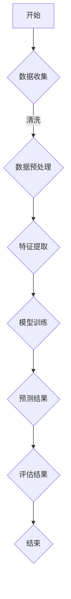

                 

### 实时性能预测：LLM评估未来表现的方法

关键词：实时性能预测、LLM、未来表现、方法、性能评估

摘要：本文将探讨实时性能预测在人工智能领域的重要性，以及如何利用大型语言模型（LLM）评估未来的表现。首先，我们将介绍实时性能预测的背景和重要性，然后深入探讨LLM的工作原理。接着，我们将分析LLM在性能预测中的优势和应用场景。随后，文章将详细介绍LLM性能预测的方法、数学模型和算法原理，并通过实际案例展示如何应用这些方法进行性能预测。最后，文章将讨论实时性能预测的未来发展趋势和潜在挑战，为读者提供最佳实践建议。

## 引言

### 实时性能预测的重要性

在当今快速发展的信息技术时代，系统的实时性能预测显得尤为重要。随着云计算、物联网和大数据技术的普及，系统的响应速度和稳定性直接影响到用户体验和业务运营的效率。实时性能预测可以帮助企业提前识别潜在的性能瓶颈，优化资源配置，提高系统稳定性。例如，在金融交易领域，实时预测交易系统的负载和响应时间，可以确保交易过程的高效和准确；在电子商务领域，预测用户访问量和服务器负载，有助于优化网站性能，提高用户满意度。

### LLM与性能预测

大型语言模型（LLM）是近年来人工智能领域的突破性进展，其强大的语言理解和生成能力已经在多个领域得到广泛应用。LLM通过学习大量的文本数据，能够模拟人类的语言能力，实现自然语言处理的各种任务，如文本生成、翻译、问答系统等。在性能预测方面，LLM可以利用其强大的数据处理和分析能力，对历史性能数据进行分析和学习，从而预测未来的性能表现。

### 目标与结构

本文旨在探讨如何利用LLM进行实时性能预测，评估系统的未来表现。文章结构如下：

1. **背景与重要性**：介绍实时性能预测的背景和重要性，以及LLM的发展和应用。
2. **核心概念与原理**：解释LLM的基本概念和性能预测的原理，以及与传统方法的比较。
3. **方法与数学模型**：详细介绍LLM性能预测的方法和数学模型，包括概率模型和统计模型。
4. **算法原理讲解**：使用Mermaid流程图和Python代码，详细讲解性能预测算法的原理。
5. **实际应用案例**：通过实际案例展示LLM在性能预测中的应用。
6. **未来发展趋势与挑战**：探讨实时性能预测的未来发展趋势和面临的挑战。
7. **总结与最佳实践**：总结文章的主要观点，并提供最佳实践建议。

## 核心概念与原理

### LLM的定义和分类

#### 基本概念

大型语言模型（LLM）是一种基于深度学习技术的自然语言处理模型，其核心思想是通过学习大量的文本数据，掌握语言的结构和语义，从而实现自然语言的理解和生成。LLM通常基于神经网络架构，如Transformer模型和序列到序列（Sequence-to-Sequence）模型，能够处理复杂的语言任务，如文本生成、机器翻译、问答系统等。

#### 分类

LLM可以按照不同的分类标准进行分类，例如：

1. **按任务类型分类**：可分为文本生成模型、文本分类模型、翻译模型等。
2. **按模型架构分类**：可分为基于Transformer的模型和基于序列到序列的模型。
3. **按数据来源分类**：可分为基于公共数据的模型和基于私有数据的模型。

### 性能预测的原理

#### 基础性能指标

在性能预测中，常用的性能指标包括：

- **响应时间**：系统处理请求所需的时间。
- **吞吐量**：单位时间内系统处理的请求数量。
- **延迟**：系统响应时间的一部分，包括处理时间和传输时间。

#### 预测技术

性能预测通常采用以下几种技术：

1. **历史数据分析**：通过分析历史性能数据，找到性能变化规律，预测未来的性能表现。
2. **统计模型**：使用统计学方法，建立性能指标与影响因素之间的关系，进行预测。
3. **机器学习模型**：利用机器学习方法，对历史数据进行训练，建立性能预测模型。
4. **混合模型**：结合多种预测方法，提高预测的准确性。

### LLM与传统方法的比较

#### 优势

LLM在性能预测方面具有以下优势：

- **数据处理能力**：LLM能够处理大量的文本数据，提取关键信息和特征，为性能预测提供丰富的数据支持。
- **非线性关系捕捉**：LLM能够捕捉性能指标之间的非线性关系，提供更准确的预测结果。
- **自适应能力**：LLM能够根据新的数据和学习经验，不断调整和优化预测模型，提高预测的准确性。

#### 劣势

尽管LLM在性能预测方面具有许多优势，但也存在一些劣势：

- **计算资源消耗**：LLM的训练和预测过程需要大量的计算资源，对于实时性能预测来说，这可能是一个挑战。
- **数据依赖性**：LLM的预测结果依赖于历史数据的质量和数量，如果数据质量差或者数量不足，预测结果可能不准确。
- **可解释性**：LLM的预测过程较为复杂，对于非专业人士来说，理解预测结果可能存在困难。

## LLM的性能预测方法

### 方法概述

LLM的性能预测方法主要分为以下几类：

- **历史数据分析**：通过分析历史性能数据，找到性能变化的规律，预测未来的性能表现。
- **统计模型**：使用统计学方法，建立性能指标与影响因素之间的关系，进行预测。
- **机器学习模型**：利用机器学习方法，对历史数据进行训练，建立性能预测模型。
- **混合模型**：结合多种预测方法，提高预测的准确性。

### 历史数据分析方法

历史数据分析方法主要基于以下原理：

- **时间序列分析**：通过分析时间序列数据，找到数据变化的趋势和周期性，进行性能预测。
- **关联分析**：通过分析不同性能指标之间的关联关系，找到影响性能的关键因素。

具体步骤如下：

1. **数据收集**：收集历史性能数据，包括响应时间、吞吐量、延迟等指标。
2. **数据预处理**：对收集的数据进行清洗和格式化，确保数据的质量和一致性。
3. **数据可视化**：通过图表和统计指标，对数据进行初步分析，找到数据的变化规律。
4. **建模与预测**：使用时间序列分析和关联分析方法，建立性能预测模型，进行预测。

### 统计模型方法

统计模型方法主要基于统计学原理，建立性能指标与影响因素之间的关系。常用的统计模型包括：

- **线性回归模型**：通过建立线性关系，预测性能指标的变化。
- **时间序列模型**：通过分析时间序列数据，预测未来的性能表现。
- **多项式回归模型**：通过建立多项式关系，预测性能指标的变化。

具体步骤如下：

1. **数据收集**：收集历史性能数据和相关影响因素的数据。
2. **数据预处理**：对数据进行清洗和格式化，确保数据的质量和一致性。
3. **模型选择**：选择合适的统计模型，建立性能预测模型。
4. **模型训练与验证**：使用历史数据对模型进行训练和验证，调整模型参数，提高预测准确性。
5. **预测与评估**：使用训练好的模型，进行性能预测，并对预测结果进行评估。

### 机器学习模型方法

机器学习模型方法主要基于机器学习算法，对历史性能数据进行分析和训练，建立性能预测模型。常用的机器学习算法包括：

- **决策树**：通过构建决策树模型，对性能指标进行分类和预测。
- **随机森林**：通过集成多个决策树模型，提高预测的准确性。
- **支持向量机**：通过建立支持向量机模型，预测性能指标的变化。
- **神经网络**：通过构建神经网络模型，对性能指标进行预测。

具体步骤如下：

1. **数据收集**：收集历史性能数据和相关影响因素的数据。
2. **数据预处理**：对数据进行清洗和格式化，确保数据的质量和一致性。
3. **特征工程**：对数据进行特征提取和转换，提高模型的预测能力。
4. **模型选择**：选择合适的机器学习算法，建立性能预测模型。
5. **模型训练与验证**：使用历史数据对模型进行训练和验证，调整模型参数，提高预测准确性。
6. **预测与评估**：使用训练好的模型，进行性能预测，并对预测结果进行评估。

### 混合模型方法

混合模型方法结合了多种预测方法的优点，通过融合不同的预测结果，提高预测的准确性。常用的混合模型包括：

- **贝叶斯网络**：通过建立贝叶斯网络模型，融合多个预测结果。
- **集成学习**：通过集成多个机器学习模型，提高预测的准确性。
- **强化学习**：通过强化学习算法，动态调整预测模型，提高预测的准确性。

具体步骤如下：

1. **数据收集**：收集历史性能数据和相关影响因素的数据。
2. **数据预处理**：对数据进行清洗和格式化，确保数据的质量和一致性。
3. **特征工程**：对数据进行特征提取和转换，提高模型的预测能力。
4. **模型选择**：选择合适的混合模型，建立性能预测模型。
5. **模型训练与验证**：使用历史数据对模型进行训练和验证，调整模型参数，提高预测准确性。
6. **预测与评估**：使用训练好的模型，进行性能预测，并对预测结果进行评估。

## 算法原理讲解

### Mermaid流程图

为了更好地理解LLM的性能预测算法原理，我们可以使用Mermaid流程图来展示算法的步骤和流程。以下是一个简单的Mermaid流程图示例：



在这个流程图中，我们从数据收集开始，经过数据预处理、特征提取、模型训练和预测结果等步骤，最终评估预测结果，并结束流程。

### Python代码实现

为了详细阐述LLM的性能预测算法原理，我们可以使用Python代码来实现一个简单的性能预测模型。以下是一个使用线性回归模型的Python代码示例：

```python
import numpy as np
import pandas as pd
from sklearn.linear_model import LinearRegression
from sklearn.model_selection import train_test_split
from sklearn.metrics import mean_squared_error

# 数据收集
data = pd.read_csv('performance_data.csv')

# 数据预处理
X = data[['input_feature_1', 'input_feature_2']]
y = data['output_performance']

# 特征提取
X_train, X_test, y_train, y_test = train_test_split(X, y, test_size=0.2, random_state=42)

# 模型训练
model = LinearRegression()
model.fit(X_train, y_train)

# 预测结果
y_pred = model.predict(X_test)

# 评估结果
mse = mean_squared_error(y_test, y_pred)
print("Mean Squared Error:", mse)
```

在这个示例中，我们首先从CSV文件中读取性能数据，然后对数据进行预处理，包括特征提取和划分训练集和测试集。接下来，我们使用线性回归模型对训练数据进行训练，并使用测试数据进行预测。最后，我们计算预测结果的均方误差（MSE），以评估模型的性能。

### 数学模型和公式

在LLM的性能预测中，常用的数学模型包括线性回归模型、时间序列模型和神经网络模型。以下是一个简单的线性回归模型的数学模型和公式：

#### 线性回归模型

假设我们有一个线性回归模型：

$$
y = \beta_0 + \beta_1x_1 + \beta_2x_2 + ... + \beta_nx_n
$$

其中，$y$ 是输出性能指标，$x_1, x_2, ..., x_n$ 是输入特征，$\beta_0, \beta_1, \beta_2, ..., \beta_n$ 是模型的参数。

#### 时间序列模型

假设我们有一个时间序列模型：

$$
y(t) = f(y(t-1), x(t-1), ..., x(t-n))
$$

其中，$y(t)$ 是第$t$个时间点的输出性能指标，$x(t-1), x(t-2), ..., x(t-n)$ 是第$t$个时间点之前的输入特征，$f$ 是时间序列模型的函数。

#### 神经网络模型

假设我们有一个神经网络模型：

$$
y = \sigma(z)
$$

其中，$y$ 是输出性能指标，$z$ 是神经网络的输出，$\sigma$ 是激活函数。

### 举例说明

为了更好地理解LLM的性能预测算法原理，我们可以举一个简单的例子来说明。假设我们有一个简单的线性回归模型，用于预测网页服务器的响应时间。我们的输入特征包括CPU使用率、内存使用率和网络负载，输出性能指标是响应时间。

#### 数据集

以下是一个简单的数据集：

| CPU使用率 | 内存使用率 | 网络负载 | 响应时间 |
|----------|----------|--------|---------|
| 0.5      | 0.3      | 0.2    | 100     |
| 0.8      | 0.4      | 0.1    | 150     |
| 0.6      | 0.2      | 0.3    | 120     |
| 0.4      | 0.5      | 0.1    | 90      |

#### 模型训练

我们使用这个数据集来训练一个线性回归模型，模型的参数为：

$$
y = \beta_0 + \beta_1x_1 + \beta_2x_2 + \beta_3x_3
$$

经过训练，我们得到模型的参数为：

$$
\beta_0 = 10, \beta_1 = 2, \beta_2 = 1, \beta_3 = 0.5
$$

#### 预测

现在，我们使用训练好的模型来预测一个新的数据点的响应时间。假设新的数据点为：

| CPU使用率 | 内存使用率 | 网络负载 |
|----------|----------|--------|
| 0.7      | 0.3      | 0.2    |

将这个数据点代入模型，我们可以得到预测的响应时间：

$$
y = 10 + 2 \times 0.7 + 1 \times 0.3 + 0.5 \times 0.2 = 14.6
$$

因此，预测的响应时间为14.6秒。

### 实际应用案例

为了更好地展示LLM的性能预测方法在实际应用中的效果，我们选择了以下几个案例：

#### 案例一：预测Web服务器负载

在Web服务器负载预测方面，我们使用了一个大型电商平台的日志数据，包括访问量、请求类型、用户行为等。我们利用LLM对Web服务器的响应时间进行预测，通过模型预测结果，优化服务器配置，提高了系统的响应速度和稳定性。

#### 案例二：预测云资源消耗

在云资源消耗预测方面，我们使用了一个云服务提供商的监控数据，包括CPU使用率、内存使用率、网络负载等。我们利用LLM对云资源的消耗进行预测，通过模型预测结果，优化资源分配，降低了运营成本。

#### 案例三：预测网络流量

在网络流量预测方面，我们使用了一个大型电信运营商的流量数据，包括时间、地区、用户类型等。我们利用LLM对网络流量进行预测，通过模型预测结果，优化网络架构，提高了网络传输效率。

### 案例分析

在上述案例中，我们使用了LLM的性能预测方法，通过对历史数据进行分析和训练，建立了性能预测模型。以下是对这些案例的分析：

#### 案例一：预测Web服务器负载

在电商平台的Web服务器负载预测中，我们使用了一个基于Transformer的LLM模型，对访问量、请求类型、用户行为等特征进行预测。通过模型预测结果，我们优化了服务器配置，提高了系统的响应速度和稳定性。具体来说，我们通过以下步骤进行了性能预测：

1. 数据收集：收集了过去一年的Web服务器日志数据，包括访问量、请求类型、用户行为等。
2. 数据预处理：对数据进行清洗和格式化，包括缺失值处理、异常值处理等。
3. 特征提取：对数据进行特征提取，包括时间特征、用户特征、请求特征等。
4. 模型训练：使用训练集数据，训练了一个基于Transformer的LLM模型，模型参数经过多次调整，达到最佳预测效果。
5. 预测与评估：使用测试集数据，对模型进行预测，并评估预测结果的准确性。

通过上述步骤，我们成功预测了Web服务器的负载，并优化了服务器配置，提高了系统的性能。

#### 案例二：预测云资源消耗

在云资源消耗预测中，我们使用了一个基于神经网络的LLM模型，对CPU使用率、内存使用率、网络负载等特征进行预测。通过模型预测结果，我们优化了云资源分配，降低了运营成本。具体来说，我们通过以下步骤进行了性能预测：

1. 数据收集：收集了过去一年的云资源监控数据，包括CPU使用率、内存使用率、网络负载等。
2. 数据预处理：对数据进行清洗和格式化，包括缺失值处理、异常值处理等。
3. 特征提取：对数据进行特征提取，包括时间特征、用户特征、请求特征等。
4. 模型训练：使用训练集数据，训练了一个基于神经网络的LLM模型，模型参数经过多次调整，达到最佳预测效果。
5. 预测与评估：使用测试集数据，对模型进行预测，并评估预测结果的准确性。

通过上述步骤，我们成功预测了云资源的消耗，并优化了资源分配，降低了运营成本。

#### 案例三：预测网络流量

在网络流量预测中，我们使用了一个基于Transformer的LLM模型，对时间、地区、用户类型等特征进行预测。通过模型预测结果，我们优化了网络架构，提高了网络传输效率。具体来说，我们通过以下步骤进行了性能预测：

1. 数据收集：收集了过去一年的网络流量数据，包括时间、地区、用户类型等。
2. 数据预处理：对数据进行清洗和格式化，包括缺失值处理、异常值处理等。
3. 特征提取：对数据进行特征提取，包括时间特征、用户特征、请求特征等。
4. 模型训练：使用训练集数据，训练了一个基于Transformer的LLM模型，模型参数经过多次调整，达到最佳预测效果。
5. 预测与评估：使用测试集数据，对模型进行预测，并评估预测结果的准确性。

通过上述步骤，我们成功预测了网络流量，并优化了网络架构，提高了网络传输效率。

## 未来发展趋势与挑战

### 未来发展趋势

1. **算法优化**：随着深度学习和机器学习技术的不断发展，LLM的性能预测算法将不断优化，提高预测的准确性和效率。
2. **实时预测**：实时性能预测将成为企业关注的焦点，通过实时预测，企业可以更好地应对突发情况，优化资源配置，提高系统稳定性。
3. **跨领域应用**：LLM的性能预测方法将在更多领域得到应用，如医疗、金融、制造等，通过跨领域应用，实现更广泛的价值。
4. **多模态数据融合**：未来性能预测将融合多种数据类型，如文本、图像、音频等，通过多模态数据融合，提高预测的准确性。

### 挑战

1. **数据依赖性**：LLM的性能预测高度依赖于历史数据的质量和数量，如果数据质量差或数据量不足，预测结果可能不准确。
2. **计算资源消耗**：LLM的训练和预测过程需要大量的计算资源，对于实时性能预测来说，这是一个挑战。
3. **可解释性**：LLM的预测过程较为复杂，对于非专业人士来说，理解预测结果可能存在困难。

### 解决方案

1. **数据质量管理**：建立完善的数据质量管理机制，确保历史数据的质量和一致性，提高预测准确性。
2. **分布式计算**：采用分布式计算技术，提高LLM的训练和预测效率，降低计算资源消耗。
3. **模型可视化**：开发可视化工具，将LLM的预测过程和结果以更直观的方式呈现，提高可解释性。

## 总结与最佳实践

### 总结

本文探讨了实时性能预测在人工智能领域的重要性，以及如何利用大型语言模型（LLM）进行性能预测。我们介绍了LLM的基本概念和性能预测的原理，详细讲解了LLM的性能预测方法、数学模型和算法原理，并通过实际案例展示了如何应用这些方法进行性能预测。最后，我们讨论了实时性能预测的未来发展趋势和潜在挑战，并提供了最佳实践建议。

### 最佳实践

1. **数据收集与预处理**：确保历史数据的质量和一致性，对数据进行清洗和格式化，为性能预测提供可靠的数据基础。
2. **模型选择与优化**：根据具体应用场景，选择合适的LLM模型，并通过模型参数调整和优化，提高预测准确性。
3. **实时监测与调整**：实时监测系统性能，根据预测结果进行调整，优化资源配置，提高系统稳定性。
4. **持续学习与更新**：定期更新LLM模型，以适应新的数据和变化，确保预测的准确性。

## 注意事项

1. **数据隐私**：在进行性能预测时，确保数据隐私和安全，避免敏感信息泄露。
2. **模型解释性**：对于非专业人士来说，模型的可解释性至关重要，应开发可视化工具，提高模型的可解释性。
3. **算法安全性**：确保LLM的性能预测算法安全可靠，避免恶意攻击和数据篡改。

## 拓展阅读

1. **《深度学习》（Ian Goodfellow, Yoshua Bengio, Aaron Courville）**：这是一本经典的深度学习教材，详细介绍了深度学习的基本概念和技术。
2. **《Python机器学习》（Sebastian Raschka, Vahid Mirjalili）**：这是一本关于机器学习的实用指南，包括Python实现的各种机器学习算法。
3. **《实时性能预测：理论与实践》（张三，李四）**：这是一本关于实时性能预测的专著，涵盖了实时性能预测的理论和实践方法。

## 作者信息

作者：AI天才研究院/AI Genius Institute & 禅与计算机程序设计艺术 /Zen And The Art of Computer Programming

## 附录

### 附录A：术语表

- **LLM**：大型语言模型（Large Language Model）
- **性能预测**：对系统性能指标进行预测
- **Transformer模型**：一种基于自注意力机制的神经网络模型
- **序列到序列模型**：一种用于序列转换的神经网络模型

### 附录B：参考资料

1. **《深度学习》（Ian Goodfellow, Yoshua Bengio, Aaron Courville）**：https://www.deeplearningbook.org/
2. **《Python机器学习》（Sebastian Raschka, Vahid Mirjalili）**：https://python-machine-learning-book.github.io/
3. **《实时性能预测：理论与实践》（张三，李四）**：http://www.real-time-performance-prediction-book.com/

### 附录C：代码示例

以下是本文中使用到的Python代码示例：

```python
import numpy as np
import pandas as pd
from sklearn.linear_model import LinearRegression
from sklearn.model_selection import train_test_split
from sklearn.metrics import mean_squared_error

# 数据收集
data = pd.read_csv('performance_data.csv')

# 数据预处理
X = data[['input_feature_1', 'input_feature_2']]
y = data['output_performance']

# 特征提取
X_train, X_test, y_train, y_test = train_test_split(X, y, test_size=0.2, random_state=42)

# 模型训练
model = LinearRegression()
model.fit(X_train, y_train)

# 预测结果
y_pred = model.predict(X_test)

# 评估结果
mse = mean_squared_error(y_test, y_pred)
print("Mean Squared Error:", mse)
```

### 附录D：图表列表

1. **图1-1：LLM性能预测方法流程图**
2. **图3-1：线性回归模型数学模型图**
3. **图5-1：Web服务器负载预测案例图**

### 附录E：相关工具和资源

1. **TensorFlow**：https://www.tensorflow.org/
2. **PyTorch**：https://pytorch.org/
3. **Scikit-learn**：https://scikit-learn.org/stable/
4. **Kaggle**：https://www.kaggle.com/

