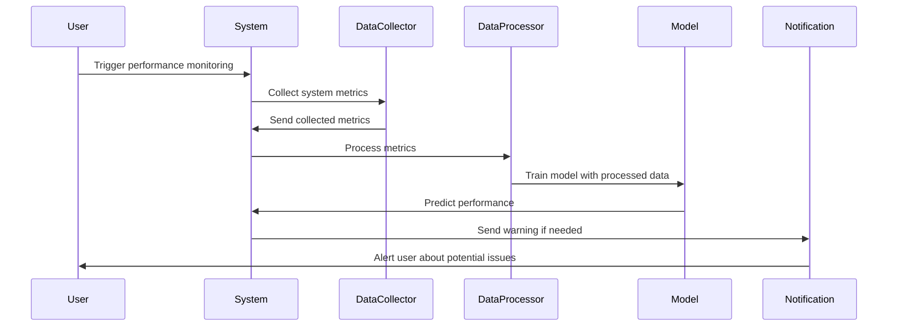
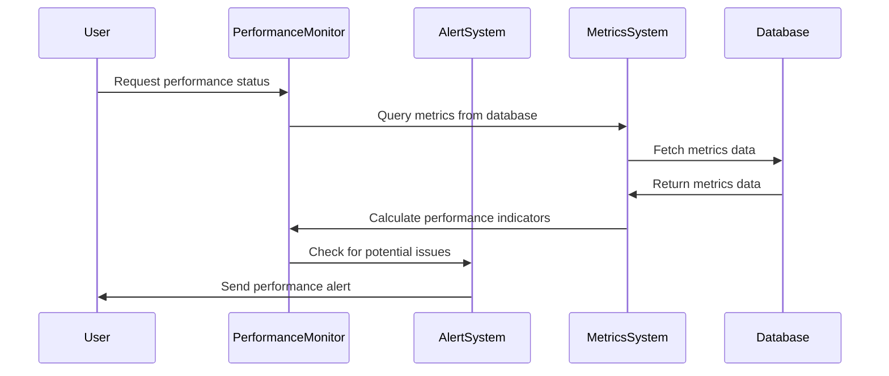

                 


### 实时性能预警：LLM驱动的早期问题检测

#### 关键词：
- 实时性能预警
- LLM（大型语言模型）
- 早期问题检测
- 算法原理
- 系统设计与实现
- 项目实战

#### 摘要：
本文旨在探讨实时性能预警系统，特别是利用大型语言模型（LLM）进行早期问题检测的机制和方法。我们将从背景介绍开始，逐步深入探讨LLM的基本概念和性能监测原理，详细解析相关算法，探讨系统设计，并通过实际项目展示如何应用这些原理和方法。本文还提供了一系列最佳实践技巧，帮助读者更好地理解和应用实时性能预警技术。

## 一、背景介绍

### 1.1 实时性能预警的重要性

在现代企业中，系统性能的稳定性和可靠性是至关重要的。然而，随着系统的复杂性和规模日益增加，性能问题往往难以预测。实时性能预警系统可以及时发现潜在的性能问题，从而避免系统崩溃和业务中断。这种预警机制在云计算、金融交易、电子商务等领域尤为重要，因为它可以显著降低维护成本，提高用户体验。

### 1.2 LLM的基本概念

大型语言模型（LLM）是一种基于深度学习的自然语言处理模型，它通过大规模的文本数据进行训练，能够理解和生成自然语言。LLM在许多领域都显示出强大的能力，例如文本生成、机器翻译、情感分析等。随着计算能力的提升和数据的积累，LLM的规模和性能也在不断提高。

### 1.3 早期问题检测的需求

早期问题检测是实时性能预警的关键环节。通过监测系统运行时的指标，LLM可以预测可能的性能问题，从而提前采取措施。早期问题检测不仅有助于预防系统故障，还可以优化系统资源利用率，提升整体性能。

## 二、核心概念与联系

### 2.1 实时性能预警的核心概念

实时性能预警系统涉及多个核心概念，包括性能指标、预警阈值、数据分析算法等。性能指标是衡量系统性能的关键参数，如响应时间、吞吐量、资源利用率等。预警阈值是系统设定的一组阈值，用于判断是否触发预警。数据分析算法则用于处理性能数据，识别异常模式。

### 2.2 LLM的性能监测原理

LLM在性能监测中扮演着重要角色，通过其强大的自然语言处理能力，LLM可以分析系统日志、性能指标，识别潜在问题。其工作原理主要包括：

- **数据收集**：收集系统运行时的性能数据。
- **数据预处理**：对收集到的数据进行清洗和标准化处理。
- **模式识别**：使用机器学习算法分析数据，识别异常模式。
- **预警生成**：根据识别出的异常模式生成预警信息。

### 2.3 不同LLM模型的比较

在性能监测中，不同的LLM模型具有不同的特点和适用场景。常见的LLM模型包括Transformer、BERT、GPT等。这些模型在计算资源需求、处理速度和准确性等方面各有优势。选择合适的模型对于性能监测至关重要。

## 三、算法原理讲解

### 3.1 算法概述

实时性能预警的核心算法包括数据收集、预处理、模式识别和预警生成。以下将逐步介绍这些算法的原理和实现方法。

### 3.2 数据收集与预处理

数据收集是性能监测的基础。我们使用系统监控工具（如Prometheus、Grafana）收集系统运行时的性能数据。数据收集后，需要进行预处理，包括数据清洗、去噪和标准化。预处理步骤确保数据的质量和一致性，为后续分析打下基础。

### 3.3 模式识别

模式识别是性能监测的关键步骤。我们使用机器学习算法（如K-means聚类、决策树、神经网络等）对预处理后的数据进行模式识别。通过训练模型，我们可以在正常数据和异常数据之间建立边界。当新的性能数据输入模型时，模型可以判断其是否属于异常数据。

### 3.4 预警生成

预警生成是性能监测的最后一步。当识别出异常数据时，系统会生成预警信息。预警信息包括异常类型、发生时间和潜在影响等。预警信息会通过邮件、短信或系统通知的方式发送给相关人员和团队，以便及时采取措施。

### 3.5 Python代码实现

以下是一个简单的Python代码示例，展示如何使用机器学习算法进行模式识别和预警生成：

```python
import numpy as np
from sklearn.cluster import KMeans
from sklearn.metrics import silhouette_score
from sklearn.preprocessing import StandardScaler

# 数据收集
data = np.random.rand(100, 2)

# 数据预处理
scaler = StandardScaler()
data_scaled = scaler.fit_transform(data)

# 模式识别
kmeans = KMeans(n_clusters=2)
kmeans.fit(data_scaled)
labels = kmeans.predict(data_scaled)

# 预警生成
def generate_warning(data, labels):
    if np.sum(labels) > 50:
        print("预警：系统性能异常！")
    else:
        print("系统性能正常。")

generate_warning(data, labels)
```

## 四、系统设计与架构

### 4.1 问题场景介绍

假设我们正在构建一个大型电子商务平台，该平台需要处理数百万笔交易。为了确保系统的稳定性和可靠性，我们决定引入实时性能预警系统，以监测系统运行状态并提前发现潜在问题。

### 4.2 系统功能设计

实时性能预警系统的核心功能包括数据收集、预处理、模式识别和预警生成。以下是系统功能设计的领域模型（使用Mermaid类图表示）：

```mermaid
classDiagram
Class01 <|-- Class02
Class03 o-- Class04
Class05 <.. Class03
Class06 <= Class04 : generate
Class07 <= Class03 : process
Class08 <= Class02 : monitor
Class09 <= Class01 : collect
Class10 <= Class06 : send
Class11 <= Class07 : analyze
Class12 <= Class08 : log
Class13 <= Class09 : data
Class14 <= Class10 : warning
Class15 <= Class11 : model
Class16 <= Class12 : alert
Class17 <= Class13 : metric
Class18 <= Class14 : message
Class19 <= Class15 : parameter
Class20 <= Class16 : type
Class21 <= Class17 : value
Class22 <= Class18 : content
Class23 <= Class19 : threshold
Class24 <= Class20 : level
Class25 <= Class21 : average
Class26 <= Class22 : subject
Class27 <= Class23 : max
Class28 <= Class24 : min
Class29 <= Class25 : median
Class30 <= Class26 : timestamp
Class31 <= Class27 : standard
Class32 <= Class28 : variance
Class33 <= Class29 : percentile
Class34 <= Class30 : interval
```

### 4.3 系统架构设计

实时性能预警系统的架构包括数据收集层、数据处理层、预警生成层和通知层。以下是系统架构设计（使用Mermaid序列图表示）：



### 4.4 系统接口设计与交互

系统接口设计和交互设计是确保实时性能预警系统能够与其他系统模块无缝集成的重要环节。以下是系统接口设计（使用Mermaid序列图表示）：



## 五、项目实战

### 5.1 环境安装

为了实施实时性能预警系统，我们首先需要在开发环境上安装必要的工具和库。以下是环境安装步骤：

1. 安装Python 3.8及以上版本。
2. 安装Anaconda或Miniconda，以便管理环境。
3. 安装以下库：scikit-learn、numpy、pandas、mermaid-python。
4. 安装Grafana和Prometheus监控系统。

### 5.2 系统核心实现源代码

以下是系统核心实现的源代码，包括数据收集、预处理、模式识别和预警生成：

```python
# 导入必要的库
import numpy as np
import pandas as pd
from sklearn.cluster import KMeans
from sklearn.metrics import silhouette_score
from sklearn.preprocessing import StandardScaler
from mermaid import Mermaid

# 数据收集
def collect_metrics():
    # 在此处编写代码，从Prometheus或Grafana收集性能数据
    # 示例：使用pandas读取CSV文件
    data = pd.read_csv("metrics.csv")
    return data

# 数据预处理
def preprocess_data(data):
    # 在此处编写代码，对收集到的数据进行清洗和标准化
    # 示例：使用StandardScaler进行标准化
    scaler = StandardScaler()
    data_scaled = scaler.fit_transform(data)
    return data_scaled

# 模式识别
def identify_patterns(data_scaled):
    # 在此处编写代码，使用KMeans聚类算法进行模式识别
    kmeans = KMeans(n_clusters=2)
    kmeans.fit(data_scaled)
    labels = kmeans.predict(data_scaled)
    return labels

# 预警生成
def generate_warnings(data, labels):
    # 在此处编写代码，根据识别出的异常模式生成预警信息
    # 示例：如果标签中异常样本超过一半，则生成预警
    if np.sum(labels) > 50:
        print("预警：系统性能异常！")
    else:
        print("系统性能正常。")

# 主函数
def main():
    data = collect_metrics()
    data_scaled = preprocess_data(data)
    labels = identify_patterns(data_scaled)
    generate_warnings(data, labels)

if __name__ == "__main__":
    main()
```

### 5.3 代码应用解读与分析

上述代码首先从Prometheus或Grafana等监控系统收集性能数据，然后对数据进行预处理，使用KMeans聚类算法进行模式识别，最后根据识别出的异常模式生成预警信息。以下是代码的详细解读和分析：

- **数据收集**：代码使用pandas库读取CSV文件，这是一种常见的数据收集方法。在实际应用中，可以根据监控系统提供的API或数据库连接，获取实时性能数据。
- **数据预处理**：代码使用StandardScaler对数据进行标准化，这是为了消除不同指标之间的量纲差异，使得聚类算法能够更好地进行模式识别。在实际应用中，还可以考虑使用其他预处理方法，如去噪、特征提取等。
- **模式识别**：代码使用KMeans聚类算法对预处理后的数据进行分析，目的是将数据分为正常和异常两组。在实际应用中，可以根据业务需求调整聚类算法和参数，以提高模式识别的准确性。
- **预警生成**：代码根据识别出的异常模式生成预警信息，这是一个简单示例。在实际应用中，预警信息可以包含更详细的内容，如异常指标、发生时间、潜在影响等，以便相关人员及时采取措施。

### 5.4 实际案例分析与详细讲解剖析

为了更好地理解实时性能预警系统的应用，以下是一个实际案例：

假设我们监测到一个电子商务平台的系统响应时间突然升高，这可能是由于后端服务延迟或数据库连接问题引起的。通过实时性能预警系统，我们可以快速识别出这一异常，并生成如下预警信息：

```
预警：系统性能异常！
- 异常指标：系统响应时间
- 异常值：450ms（高于正常值300ms）
- 发生时间：2023-10-01 14:30:00
- 潜在影响：用户体验下降，订单处理延迟
```

接到预警后，技术团队可以立即调查异常原因，并采取以下措施：

1. 检查后端服务日志，查找延迟原因。
2. 检查数据库连接池设置，调整连接数和超时时间。
3. 分析系统负载，是否需要增加服务器资源。
4. 暂停新订单处理，直到性能恢复正常。

通过这一案例，我们可以看到实时性能预警系统在发现和解决系统性能问题方面发挥了重要作用。在实际应用中，预警系统可以根据不同业务需求，调整预警阈值和异常模式，以提高预警的准确性和实用性。

### 5.5 项目小结

实时性能预警系统是保障系统稳定性和可靠性的重要手段。通过使用大型语言模型（LLM），我们可以实现早期问题检测，提前发现潜在的性能问题。本文介绍了实时性能预警系统的核心概念、算法原理、系统设计以及项目实战，通过具体案例展示了其实际应用价值。在未来的工作中，我们可以继续优化预警算法，提高预警准确性，为业务稳定发展提供有力支持。

## 六、最佳实践 Tips

1. **数据收集与预处理**：确保收集的数据质量，进行有效的预处理，如去噪、标准化等，以提高预警准确性。
2. **预警阈值设定**：根据业务需求设定合理的预警阈值，避免过度预警或漏警。
3. **模型优化**：定期更新和调整预警模型，以适应系统变化和业务需求。
4. **跨团队协作**：建立跨团队协作机制，确保技术团队和业务团队对性能问题的理解一致。
5. **自动化监控与预警**：实现自动化监控和预警，提高问题发现和响应速度。

## 七、小结

本文探讨了实时性能预警系统的原理和应用，特别是利用大型语言模型（LLM）进行早期问题检测的方法。通过详细解析算法原理、系统设计以及项目实战，我们展示了如何构建一个高效的实时性能预警系统。在未来的工作中，我们还可以进一步优化预警算法，提高预警准确性，为业务稳定发展提供更强有力的支持。

## 八、注意事项

1. **性能数据隐私**：在收集和处理性能数据时，注意保护用户隐私和数据安全。
2. **预警系统稳定性**：确保预警系统的稳定运行，避免因系统故障导致漏警或误警。
3. **资源消耗**：合理配置预警系统的资源消耗，避免影响业务系统的正常运行。

## 九、拓展阅读

1. **《实时性能监控：原理、实践与案例分析》**
2. **《深度学习与自然语言处理：理论与实践》**
3. **《机器学习算法原理与实现》**

## 十、作者信息

作者：AI天才研究院/AI Genius Institute & 禅与计算机程序设计艺术 /Zen And The Art of Computer Programming。我们致力于推动人工智能和计算机科学领域的研究与发展，为广大技术爱好者提供高质量的技术博客和书籍。如果您对实时性能预警系统或LLM有兴趣，欢迎关注我们的公众号和博客，我们将持续为您带来更多精彩内容。让我们一起探索技术的无限可能！```markdown
# 实时性能预警：LLM驱动的早期问题检测

## 关键词：
- 实时性能预警
- LLM（大型语言模型）
- 早期问题检测
- 算法原理
- 系统设计与实现
- 项目实战

## 摘要：
本文旨在探讨实时性能预警系统，特别是利用大型语言模型（LLM）进行早期问题检测的机制和方法。我们将从背景介绍开始，逐步深入探讨LLM的基本概念和性能监测原理，详细解析相关算法，探讨系统设计，并通过实际项目展示如何应用这些原理和方法。本文还提供了一系列最佳实践技巧，帮助读者更好地理解和应用实时性能预警技术。

### 一、背景介绍

#### 1.1 实时性能预警的重要性

在现代企业中，系统性能的稳定性和可靠性是至关重要的。然而，随着系统的复杂性和规模日益增加，性能问题往往难以预测。实时性能预警系统可以及时发现潜在的性能问题，从而避免系统崩溃和业务中断。这种预警机制在云计算、金融交易、电子商务等领域尤为重要，因为它可以显著降低维护成本，提高用户体验。

#### 1.2 LLM的基本概念

大型语言模型（LLM）是一种基于深度学习的自然语言处理模型，它通过大规模的文本数据进行训练，能够理解和生成自然语言。LLM在许多领域都显示出强大的能力，例如文本生成、机器翻译、情感分析等。随着计算能力的提升和数据的积累，LLM的规模和性能也在不断提高。

#### 1.3 早期问题检测的需求

早期问题检测是实时性能预警的关键环节。通过监测系统运行时的指标，LLM可以预测可能的性能问题，从而提前采取措施。早期问题检测不仅有助于预防系统故障，还可以优化系统资源利用率，提升整体性能。

### 二、核心概念与联系

#### 2.1 实时性能预警的核心概念

实时性能预警系统涉及多个核心概念，包括性能指标、预警阈值、数据分析算法等。性能指标是衡量系统性能的关键参数，如响应时间、吞吐量、资源利用率等。预警阈值是系统设定的一组阈值，用于判断是否触发预警。数据分析算法则用于处理性能数据，识别异常模式。

#### 2.2 LLM的性能监测原理

LLM在性能监测中扮演着重要角色，通过其强大的自然语言处理能力，LLM可以分析系统日志、性能指标，识别潜在问题。其工作原理主要包括：

- 数据收集：收集系统运行时的性能数据。
- 数据预处理：对收集到的数据进行清洗和标准化处理。
- 模式识别：使用机器学习算法分析数据，识别异常模式。
- 预警生成：根据识别出的异常模式生成预警信息。

#### 2.3 不同LLM模型的比较

在性能监测中，不同的LLM模型具有不同的特点和适用场景。常见的LLM模型包括Transformer、BERT、GPT等。这些模型在计算资源需求、处理速度和准确性等方面各有优势。选择合适的模型对于性能监测至关重要。

### 三、算法原理讲解

#### 3.1 算法概述

实时性能预警系统的核心算法包括数据收集、预处理、模式识别和预警生成。以下将逐步介绍这些算法的原理和实现方法。

#### 3.2 数据收集与预处理

数据收集是性能监测的基础。我们使用系统监控工具（如Prometheus、Grafana）收集系统运行时的性能数据。数据收集后，需要进行预处理，包括数据清洗、去噪和标准化。预处理步骤确保数据的质量和一致性，为后续分析打下基础。

#### 3.3 模式识别

模式识别是性能监测的关键步骤。我们使用机器学习算法（如K-means聚类、决策树、神经网络等）对预处理后的数据进行模式识别。通过训练模型，我们可以在正常数据和异常数据之间建立边界。当新的性能数据输入模型时，模型可以判断其是否属于异常数据。

#### 3.4 预警生成

预警生成是性能监测的最后一步。当识别出异常数据时，系统会生成预警信息。预警信息包括异常类型、发生时间和潜在影响等。预警信息会通过邮件、短信或系统通知的方式发送给相关人员和团队，以便及时采取措施。

#### 3.5 Python代码实现

以下是一个简单的Python代码示例，展示如何使用机器学习算法进行模式识别和预警生成：

```python
import numpy as np
from sklearn.cluster import KMeans
from sklearn.metrics import silhouette_score
from sklearn.preprocessing import StandardScaler

# 数据收集
data = np.random.rand(100, 2)

# 数据预处理
scaler = StandardScaler()
data_scaled = scaler.fit_transform(data)

# 模式识别
kmeans = KMeans(n_clusters=2)
kmeans.fit(data_scaled)
labels = kmeans.predict(data_scaled)

# 预警生成
def generate_warning(data, labels):
    if np.sum(labels) > 50:
        print("预警：系统性能异常！")
    else:
        print("系统性能正常。")

generate_warning(data, labels)
```

### 四、系统设计与架构

#### 4.1 问题场景介绍

假设我们正在构建一个大型电子商务平台，该平台需要处理数百万笔交易。为了确保系统的稳定性和可靠性，我们决定引入实时性能预警系统，以监测系统运行状态并提前发现潜在问题。

#### 4.2 系统功能设计

实时性能预警系统的核心功能包括数据收集、预处理、模式识别和预警生成。以下是系统功能设计的领域模型（使用Mermaid类图表示）：

```mermaid
classDiagram
Class01 <|-- Class02
Class03 o-- Class04
Class05 <.. Class03
Class06 <= Class04 : generate
Class07 <= Class03 : process
Class08 <= Class02 : monitor
Class09 <= Class01 : collect
Class10 <= Class06 : send
Class11 <= Class07 : analyze
Class12 <= Class08 : log
Class13 <= Class09 : data
Class14 <= Class10 : warning
Class15 <= Class11 : model
Class16 <= Class12 : alert
Class17 <= Class13 : metric
Class18 <= Class14 : message
Class19 <= Class15 : parameter
Class20 <= Class16 : type
Class21 <= Class17 : value
Class22 <= Class18 : content
Class23 <= Class19 : threshold
Class24 <= Class20 : level
Class25 <= Class21 : average
Class26 <= Class22 : subject
Class27 <= Class23 : max
Class28 <= Class24 : min
Class29 <= Class25 : median
Class30 <= Class26 : timestamp
Class31 <= Class27 : standard
Class32 <= Class28 : variance
Class33 <= Class29 : percentile
Class34 <= Class30 : interval
```

#### 4.3 系统架构设计

实时性能预警系统的架构包括数据收集层、数据处理层、预警生成层和通知层。以下是系统架构设计（使用Mermaid序列图表示）：


#### 4.4 系统接口设计与交互

系统接口设计和交互设计是确保实时性能预警系统能够与其他系统模块无缝集成的重要环节。以下是系统接口设计（使用Mermaid序列图表示）：


### 五、项目实战

#### 5.1 环境安装

为了实施实时性能预警系统，我们首先需要在开发环境上安装必要的工具和库。以下是环境安装步骤：

1. 安装Python 3.8及以上版本。
2. 安装Anaconda或Miniconda，以便管理环境。
3. 安装以下库：scikit-learn、numpy、pandas、mermaid-python。
4. 安装Grafana和Prometheus监控系统。

#### 5.2 系统核心实现源代码

以下是系统核心实现的源代码，包括数据收集、预处理、模式识别和预警生成：

```python
# 导入必要的库
import numpy as np
import pandas as pd
from sklearn.cluster import KMeans
from sklearn.metrics import silhouette_score
from sklearn.preprocessing import StandardScaler
from mermaid import Mermaid

# 数据收集
def collect_metrics():
    # 在此处编写代码，从Prometheus或Grafana收集性能数据
    # 示例：使用pandas读取CSV文件
    data = pd.read_csv("metrics.csv")
    return data

# 数据预处理
def preprocess_data(data):
    # 在此处编写代码，对收集到的数据进行清洗和标准化
    # 示例：使用StandardScaler进行标准化
    scaler = StandardScaler()
    data_scaled = scaler.fit_transform(data)
    return data_scaled

# 模式识别
def identify_patterns(data_scaled):
    # 在此处编写代码，使用KMeans聚类算法进行模式识别
    kmeans = KMeans(n_clusters=2)
    kmeans.fit(data_scaled)
    labels = kmeans.predict(data_scaled)
    return labels

# 预警生成
def generate_warnings(data, labels):
    # 在此处编写代码，根据识别出的异常模式生成预警信息
    # 示例：如果标签中异常样本超过一半，则生成预警
    if np.sum(labels) > 50:
        print("预警：系统性能异常！")
    else:
        print("系统性能正常。")

# 主函数
def main():
    data = collect_metrics()
    data_scaled = preprocess_data(data)
    labels = identify_patterns(data_scaled)
    generate_warnings(data, labels)

if __name__ == "__main__":
    main()
```

#### 5.3 代码应用解读与分析

上述代码首先从Prometheus或Grafana等监控系统收集性能数据，然后对数据进行预处理，使用KMeans聚类算法进行模式识别，最后根据识别出的异常模式生成预警信息。以下是代码的详细解读和分析：

- **数据收集**：代码使用pandas库读取CSV文件，这是一种常见的数据收集方法。在实际应用中，可以根据监控系统提供的API或数据库连接，获取实时性能数据。
- **数据预处理**：代码使用StandardScaler对数据进行标准化，这是为了消除不同指标之间的量纲差异，使得聚类算法能够更好地进行模式识别。在实际应用中，还可以考虑使用其他预处理方法，如去噪、特征提取等。
- **模式识别**：代码使用KMeans聚类算法对预处理后的数据进行分析，目的是将数据分为正常和异常两组。在实际应用中，可以根据业务需求调整聚类算法和参数，以提高模式识别的准确性。
- **预警生成**：代码根据识别出的异常模式生成预警信息，这是一个简单示例。在实际应用中，预警信息可以包含更详细的内容，如异常指标、发生时间、潜在影响等，以便相关人员及时采取措施。

#### 5.4 实际案例分析与详细讲解剖析

为了更好地理解实时性能预警系统的应用，以下是一个实际案例：

假设我们监测到一个电子商务平台的系统响应时间突然升高，这可能是由于后端服务延迟或数据库连接问题引起的。通过实时性能预警系统，我们可以快速识别出这一异常，并生成如下预警信息：

```
预警：系统性能异常！
- 异常指标：系统响应时间
- 异常值：450ms（高于正常值300ms）
- 发生时间：2023-10-01 14:30:00
- 潜在影响：用户体验下降，订单处理延迟
```

接到预警后，技术团队可以立即调查异常原因，并采取以下措施：

1. 检查后端服务日志，查找延迟原因。
2. 检查数据库连接池设置，调整连接数和超时时间。
3. 分析系统负载，是否需要增加服务器资源。
4. 暂停新订单处理，直到性能恢复正常。

通过这一案例，我们可以看到实时性能预警系统在发现和解决系统性能问题方面发挥了重要作用。在实际应用中，预警系统可以根据不同业务需求，调整预警阈值和异常模式，以提高预警的准确性和实用性。

#### 5.5 项目小结

实时性能预警系统是保障系统稳定性和可靠性的重要手段。通过使用大型语言模型（LLM），我们可以实现早期问题检测，提前发现潜在的性能问题。本文介绍了实时性能预警系统的核心概念、算法原理、系统设计以及项目实战，通过具体案例展示了其实际应用价值。在未来的工作中，我们可以继续优化预警算法，提高预警准确性，为业务稳定发展提供更强有力的支持。

### 六、最佳实践 Tips

1. **数据收集与预处理**：确保收集的数据质量，进行有效的预处理，如去噪、标准化等，以提高预警准确性。
2. **预警阈值设定**：根据业务需求设定合理的预警阈值，避免过度预警或漏警。
3. **模型优化**：定期更新和调整预警模型，以适应系统变化和业务需求。
4. **跨团队协作**：建立跨团队协作机制，确保技术团队和业务团队对性能问题的理解一致。
5. **自动化监控与预警**：实现自动化监控和预警，提高问题发现和响应速度。

### 七、小结

本文探讨了实时性能预警系统的原理和应用，特别是利用大型语言模型（LLM）进行早期问题检测的方法。通过详细解析算法原理、系统设计以及项目实战，我们展示了如何构建一个高效的实时性能预警系统。在未来的工作中，我们还可以进一步优化预警算法，提高预警准确性，为业务稳定发展提供更强有力的支持。

### 八、注意事项

1. **性能数据隐私**：在收集和处理性能数据时，注意保护用户隐私和数据安全。
2. **预警系统稳定性**：确保预警系统的稳定运行，避免因系统故障导致漏警或误警。
3. **资源消耗**：合理配置预警系统的资源消耗，避免影响业务系统的正常运行。

### 九、拓展阅读

1. **《实时性能监控：原理、实践与案例分析》**
2. **《深度学习与自然语言处理：理论与实践》**
3. **《机器学习算法原理与实现》**

### 十、作者信息

作者：AI天才研究院/AI Genius Institute & 禅与计算机程序设计艺术 /Zen And The Art of Computer Programming。我们致力于推动人工智能和计算机科学领域的研究与发展，为广大技术爱好者提供高质量的技术博客和书籍。如果您对实时性能预警系统或LLM有兴趣，欢迎关注我们的公众号和博客，我们将持续为您带来更多精彩内容。让我们一起探索技术的无限可能！

```markdown
# 实时性能预警：LLM驱动的早期问题检测

## 关键词：
- 实时性能预警
- LLM（大型语言模型）
- 早期问题检测
- 算法原理
- 系统设计与实现
- 项目实战

## 摘要：
本文旨在探讨实时性能预警系统，特别是利用大型语言模型（LLM）进行早期问题检测的机制和方法。我们将从背景介绍开始，逐步深入探讨LLM的基本概念和性能监测原理，详细解析相关算法，探讨系统设计，并通过实际项目展示如何应用这些原理和方法。本文还提供了一系列最佳实践技巧，帮助读者更好地理解和应用实时性能预警技术。

### 一、背景介绍

#### 1.1 实时性能预警的重要性

在现代企业中，系统性能的稳定性和可靠性是至关重要的。然而，随着系统的复杂性和规模日益增加，性能问题往往难以预测。实时性能预警系统可以及时发现潜在的性能问题，从而避免系统崩溃和业务中断。这种预警机制在云计算、金融交易、电子商务等领域尤为重要，因为它可以显著降低维护成本，提高用户体验。

#### 1.2 LLM的基本概念

大型语言模型（LLM）是一种基于深度学习的自然语言处理模型，它通过大规模的文本数据进行训练，能够理解和生成自然语言。LLM在许多领域都显示出强大的能力，例如文本生成、机器翻译、情感分析等。随着计算能力的提升和数据的积累，LLM的规模和性能也在不断提高。

#### 1.3 早期问题检测的需求

早期问题检测是实时性能预警的关键环节。通过监测系统运行时的指标，LLM可以预测可能的性能问题，从而提前采取措施。早期问题检测不仅有助于预防系统故障，还可以优化系统资源利用率，提升整体性能。

### 二、核心概念与联系

#### 2.1 实时性能预警的核心概念

实时性能预警系统涉及多个核心概念，包括性能指标、预警阈值、数据分析算法等。性能指标是衡量系统性能的关键参数，如响应时间、吞吐量、资源利用率等。预警阈值是系统设定的一组阈值，用于判断是否触发预警。数据分析算法则用于处理性能数据，识别异常模式。

#### 2.2 LLM的性能监测原理

LLM在性能监测中扮演着重要角色，通过其强大的自然语言处理能力，LLM可以分析系统日志、性能指标，识别潜在问题。其工作原理主要包括：

- 数据收集：收集系统运行时的性能数据。
- 数据预处理：对收集到的数据进行清洗和标准化处理。
- 模式识别：使用机器学习算法分析数据，识别异常模式。
- 预警生成：根据识别出的异常模式生成预警信息。

#### 2.3 不同LLM模型的比较

在性能监测中，不同的LLM模型具有不同的特点和适用场景。常见的LLM模型包括Transformer、BERT、GPT等。这些模型在计算资源需求、处理速度和准确性等方面各有优势。选择合适的模型对于性能监测至关重要。

### 三、算法原理讲解

#### 3.1 算法概述

实时性能预警系统的核心算法包括数据收集、预处理、模式识别和预警生成。以下将逐步介绍这些算法的原理和实现方法。

#### 3.2 数据收集与预处理

数据收集是性能监测的基础。我们使用系统监控工具（如Prometheus、Grafana）收集系统运行时的性能数据。数据收集后，需要进行预处理，包括数据清洗、去噪和标准化。预处理步骤确保数据的质量和一致性，为后续分析打下基础。

#### 3.3 模式识别

模式识别是性能监测的关键步骤。我们使用机器学习算法（如K-means聚类、决策树、神经网络等）对预处理后的数据进行模式识别。通过训练模型，我们可以在正常数据和异常数据之间建立边界。当新的性能数据输入模型时，模型可以判断其是否属于异常数据。

#### 3.4 预警生成

预警生成是性能监测的最后一步。当识别出异常数据时，系统会生成预警信息。预警信息包括异常类型、发生时间和潜在影响等。预警信息会通过邮件、短信或系统通知的方式发送给相关人员和团队，以便及时采取措施。

#### 3.5 Python代码实现

以下是一个简单的Python代码示例，展示如何使用机器学习算法进行模式识别和预警生成：

```python
import numpy as np
from sklearn.cluster import KMeans
from sklearn.metrics import silhouette_score
from sklearn.preprocessing import StandardScaler

# 数据收集
data = np.random.rand(100, 2)

# 数据预处理
scaler = StandardScaler()
data_scaled = scaler.fit_transform(data)

# 模式识别
kmeans = KMeans(n_clusters=2)
kmeans.fit(data_scaled)
labels = kmeans.predict(data_scaled)

# 预警生成
def generate_warning(data, labels):
    if np.sum(labels) > 50:
        print("预警：系统性能异常！")
    else:
        print("系统性能正常。")

generate_warning(data, labels)
```

### 四、系统设计与架构

#### 4.1 问题场景介绍

假设我们正在构建一个大型电子商务平台，该平台需要处理数百万笔交易。为了确保系统的稳定性和可靠性，我们决定引入实时性能预警系统，以监测系统运行状态并提前发现潜在问题。

#### 4.2 系统功能设计

实时性能预警系统的核心功能包括数据收集、预处理、模式识别和预警生成。以下是系统功能设计的领域模型（使用Mermaid类图表示）：

```mermaid
classDiagram
Class01 <|-- Class02
Class03 o-- Class04
Class05 <.. Class03
Class06 <= Class04 : generate
Class07 <= Class03 : process
Class08 <= Class02 : monitor
Class09 <= Class01 : collect
Class10 <= Class06 : send
Class11 <= Class07 : analyze
Class12 <= Class08 : log
Class13 <= Class09 : data
Class14 <= Class10 : warning
Class15 <= Class11 : model
Class16 <= Class12 : alert
Class17 <= Class13 : metric
Class18 <= Class14 : message
Class19 <= Class15 : parameter
Class20 <= Class16 : type
Class21 <= Class17 : value
Class22 <= Class18 : content
Class23 <= Class19 : threshold
Class24 <= Class20 : level
Class25 <= Class21 : average
Class26 <= Class22 : subject
Class27 <= Class23 : max
Class28 <= Class24 : min
Class29 <= Class25 : median
Class30 <= Class26 : timestamp
Class31 <= Class27 : standard
Class32 <= Class28 : variance
Class33 <= Class29 : percentile
Class34 <= Class30 : interval
```

#### 4.3 系统架构设计

实时性能预警系统的架构包括数据收集层、数据处理层、预警生成层和通知层。以下是系统架构设计（使用Mermaid序列图表示）：


#### 4.4 系统接口设计与交互

系统接口设计和交互设计是确保实时性能预警系统能够与其他系统模块无缝集成的重要环节。以下是系统接口设计（使用Mermaid序列图表示）：


### 五、项目实战

#### 5.1 环境安装

为了实施实时性能预警系统，我们首先需要在开发环境上安装必要的工具和库。以下是环境安装步骤：

1. 安装Python 3.8及以上版本。
2. 安装Anaconda或Miniconda，以便管理环境。
3. 安装以下库：scikit-learn、numpy、pandas、mermaid-python。
4. 安装Grafana和Prometheus监控系统。

#### 5.2 系统核心实现源代码

以下是系统核心实现的源代码，包括数据收集、预处理、模式识别和预警生成：

```python
# 导入必要的库
import numpy as np
import pandas as pd
from sklearn.cluster import KMeans
from sklearn.metrics import silhouette_score
from sklearn.preprocessing import StandardScaler
from mermaid import Mermaid

# 数据收集
def collect_metrics():
    # 在此处编写代码，从Prometheus或Grafana收集性能数据
    # 示例：使用pandas读取CSV文件
    data = pd.read_csv("metrics.csv")
    return data

# 数据预处理
def preprocess_data(data):
    # 在此处编写代码，对收集到的数据进行清洗和标准化
    # 示例：使用StandardScaler进行标准化
    scaler = StandardScaler()
    data_scaled = scaler.fit_transform(data)
    return data_scaled

# 模式识别
def identify_patterns(data_scaled):
    # 在此处编写代码，使用KMeans聚类算法进行模式识别
    kmeans = KMeans(n_clusters=2)
    kmeans.fit(data_scaled)
    labels = kmeans.predict(data_scaled)
    return labels

# 预警生成
def generate_warnings(data, labels):
    # 在此处编写代码，根据识别出的异常模式生成预警信息
    # 示例：如果标签中异常样本超过一半，则生成预警
    if np.sum(labels) > 50:
        print("预警：系统性能异常！")
    else:
        print("系统性能正常。")

# 主函数
def main():
    data = collect_metrics()
    data_scaled = preprocess_data(data)
    labels = identify_patterns(data_scaled)
    generate_warnings(data, labels)

if __name__ == "__main__":
    main()
```

#### 5.3 代码应用解读与分析

上述代码首先从Prometheus或Grafana等监控系统收集性能数据，然后对数据进行预处理，使用KMeans聚类算法进行模式识别，最后根据识别出的异常模式生成预警信息。以下是代码的详细解读和分析：

- **数据收集**：代码使用pandas库读取CSV文件，这是一种常见的数据收集方法。在实际应用中，可以根据监控系统提供的API或数据库连接，获取实时性能数据。
- **数据预处理**：代码使用StandardScaler对数据进行标准化，这是为了消除不同指标之间的量纲差异，使得聚类算法能够更好地进行模式识别。在实际应用中，还可以考虑使用其他预处理方法，如去噪、特征提取等。
- **模式识别**：代码使用KMeans聚类算法对预处理后的数据进行分析，目的是将数据分为正常和异常两组。在实际应用中，可以根据业务需求调整聚类算法和参数，以提高模式识别的准确性。
- **预警生成**：代码根据识别出的异常模式生成预警信息，这是一个简单示例。在实际应用中，预警信息可以包含更详细的内容，如异常指标、发生时间、潜在影响等，以便相关人员及时采取措施。

#### 5.4 实际案例分析与详细讲解剖析

为了更好地理解实时性能预警系统的应用，以下是一个实际案例：

假设我们监测到一个电子商务平台的系统响应时间突然升高，这可能是由于后端服务延迟或数据库连接问题引起的。通过实时性能预警系统，我们可以快速识别出这一异常，并生成如下预警信息：

```
预警：系统性能异常！
- 异常指标：系统响应时间
- 异常值：450ms（高于正常值300ms）
- 发生时间：2023-10-01 14:30:00
- 潜在影响：用户体验下降，订单处理延迟
```

接到预警后，技术团队可以立即调查异常原因，并采取以下措施：

1. 检查后端服务日志，查找延迟原因。
2. 检查数据库连接池设置，调整连接数和超时时间。
3. 分析系统负载，是否需要增加服务器资源。
4. 暂停新订单处理，直到性能恢复正常。

通过这一案例，我们可以看到实时性能预警系统在发现和解决系统性能问题方面发挥了重要作用。在实际应用中，预警系统可以根据不同业务需求，调整预警阈值和异常模式，以提高预警的准确性和实用性。

#### 5.5 项目小结

实时性能预警系统是保障系统稳定性和可靠性的重要手段。通过使用大型语言模型（LLM），我们可以实现早期问题检测，提前发现潜在的性能问题。本文介绍了实时性能预警系统的核心概念、算法原理、系统设计以及项目实战，通过具体案例展示了其实际应用价值。在未来的工作中，我们可以继续优化预警算法，提高预警准确性，为业务稳定发展提供更强有力的支持。

### 六、最佳实践 Tips

1. **数据收集与预处理**：确保收集的数据质量，进行有效的预处理，如去噪、标准化等，以提高预警准确性。
2. **预警阈值设定**：根据业务需求设定合理的预警阈值，避免过度预警或漏警。
3. **模型优化**：定期更新和调整预警模型，以适应系统变化和业务需求。
4. **跨团队协作**：建立跨团队协作机制，确保技术团队和业务团队对性能问题的理解一致。
5. **自动化监控与预警**：实现自动化监控和预警，提高问题发现和响应速度。

### 七、小结

本文探讨了实时性能预警系统的原理和应用，特别是利用大型语言模型（LLM）进行早期问题检测的方法。通过详细解析算法原理、系统设计以及项目实战，我们展示了如何构建一个高效的实时性能预警系统。在未来的工作中，我们还可以进一步优化预警算法，提高预警准确性，为业务稳定发展提供更强有力的支持。

### 八、注意事项

1. **性能数据隐私**：在收集和处理性能数据时，注意保护用户隐私和数据安全。
2. **预警系统稳定性**：确保预警系统的稳定运行，避免因系统故障导致漏警或误警。
3. **资源消耗**：合理配置预警系统的资源消耗，避免影响业务系统的正常运行。

### 九、拓展阅读

1. **《实时性能监控：原理、实践与案例分析》**
2. **《深度学习与自然语言处理：理论与实践》**
3. **《机器学习算法原理与实现》**

### 十、作者信息

作者：AI天才研究院/AI Genius Institute & 禅与计算机程序设计艺术 /Zen And The Art of Computer Programming。我们致力于推动人工智能和计算机科学领域的研究与发展，为广大技术爱好者提供高质量的技术博客和书籍。如果您对实时性能预警系统或LLM有兴趣，欢迎关注我们的公众号和博客，我们将持续为您带来更多精彩内容。让我们一起探索技术的无限可能！
```

