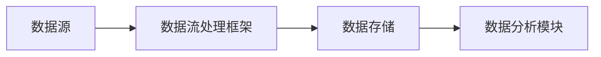
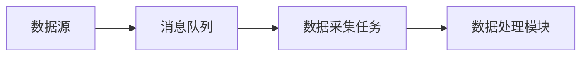
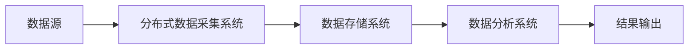
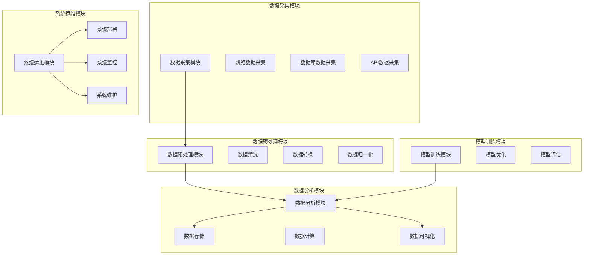
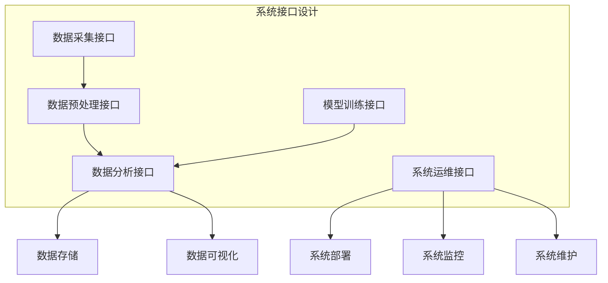
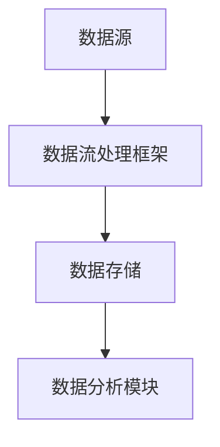
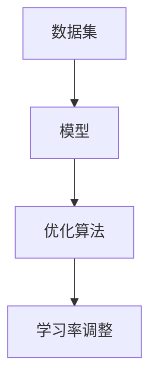

                 

### 第一部分：实时比较评测系统概述

#### 第1章：实时比较评测系统概述

##### 1.1 问题背景与重要性

**1.1.1 竞品分析的意义**

在当今快速变化的市场环境中，企业之间的竞争日益激烈。为了在市场中保持竞争力，企业必须时刻关注其竞争对手的动向和产品更新。竞品分析作为一种重要的市场研究手段，可以帮助企业了解竞争对手的产品特点、市场策略、用户反馈等信息，从而为企业制定有效的市场营销策略提供支持。

**1.1.2 实时比较评测的需求**

传统的竞品分析往往需要耗费大量的人力和时间，而且分析结果往往具有一定的滞后性。在市场竞争激烈的情况下，这种滞后性可能导致企业错失市场机会。因此，实时比较评测系统应运而生，它能够即时获取和分析竞争对手的信息，为企业提供及时、准确的市场洞察。

**1.1.3 系统目标与定位**

实时比较评测系统的目标是建立一个高效、准确的平台，能够实时监控和分析竞争对手的产品、市场策略、用户反馈等信息。通过该系统，企业可以快速了解市场动态，做出迅速反应，从而在竞争中保持优势。

##### 1.2 实时比较评测系统核心概念

**1.2.1 实时数据采集**

实时数据采集是实时比较评测系统的核心环节。系统需要从多个数据源（如网络、数据库、第三方API等）收集实时数据，确保数据的时效性和准确性。

**1.2.2 数据预处理与清洗**

采集到的数据往往存在噪声、错误和不一致性等问题，因此需要进行预处理和清洗。数据预处理包括数据转换、归一化、缺失值处理等，而数据清洗则包括去除重复数据、纠正错误数据等。

**1.2.3 数据分析与处理**

在数据预处理完成后，系统需要对数据进行分析和处理。数据分析包括统计分析、数据挖掘等，旨在从大量数据中发现有价值的信息和趋势。

**1.2.4 模型训练与应用**

为了实现自动化的分析，系统需要使用机器学习模型对数据进行训练。训练好的模型可以用于预测、分类、聚类等任务，从而帮助用户更好地理解和利用数据。

##### 1.3 系统架构设计与实现

**1.3.1 系统整体架构**

实时比较评测系统的整体架构包括数据采集模块、数据预处理模块、数据分析模块和模型训练模块。这些模块通过分布式系统架构进行协同工作，确保系统的稳定性和高效性。

**1.3.2 数据流设计**

数据流设计是系统架构设计的重要组成部分。系统需要设计合理的数据流路径，确保数据能够在各个环节之间顺畅流动，并实现数据的实时处理。

**1.3.3 系统模块划分与功能**

系统模块的划分与功能设计是系统实现的关键。每个模块都需要明确其功能和职责，以确保系统的模块化和可维护性。

**1.3.4 系统接口设计**

系统接口设计包括内部接口和外部接口。内部接口用于模块之间的数据传输和协同工作，而外部接口则用于与用户交互和与其他系统集成。

##### 1.4 系统边界与外延

**1.4.1 系统功能边界**

系统功能边界是指系统可以提供的功能和服务的范围。明确系统功能边界有助于界定系统的责任范围，避免功能重叠和冲突。

**1.4.2 系统应用场景拓展**

系统应用场景拓展是指系统在不同场景下的应用可能性。实时比较评测系统不仅可以应用于企业竞争分析，还可以拓展到其他领域，如市场调研、产品评估等。

**1.4.3 系统限制与挑战**

系统限制与挑战包括技术限制、数据限制和业务限制等。了解系统限制与挑战有助于企业更好地规划和部署系统，以充分发挥系统的价值。

##### 1.5 本章小结

本章对实时比较评测系统进行了概述，介绍了系统的背景、核心概念、系统架构设计以及系统的边界与外延。通过对本章内容的了解，读者可以初步认识实时比较评测系统的基本框架和运作原理。

---

**核心关键词：**

- 实时比较评测
- 竞品分析
- 数据采集
- 数据预处理
- 数据分析
- 机器学习模型
- 系统架构设计

**摘要：**

本文详细介绍了实时比较评测系统的概念、核心组成部分和系统架构设计。通过实时数据采集、预处理和分析，系统能够为企业提供实时的市场洞察，帮助企业在竞争激烈的市场中保持优势。本文还探讨了系统的应用场景、限制和挑战，为系统的实际部署提供了参考。**实时比较评测：LLM辅助的竞品分析系统**

> 关键词：实时比较评测、竞品分析、数据采集、数据处理、机器学习、系统架构

**摘要：**

随着市场竞争的加剧，实时比较评测系统成为企业获取市场优势的重要工具。本文介绍了实时比较评测系统的核心概念、架构设计和实现方法，特别强调了LLM（大型语言模型）在系统中的应用。通过实时数据采集、预处理、分析以及LLM的辅助，系统能够为企业提供高效、准确的市场洞察，帮助企业在竞争中立于不败之地。本文还对系统的边界、应用场景和挑战进行了深入探讨，为企业部署实时比较评测系统提供了实用指导。**目录大纲**

----------------------------------------------------------------

## 第一部分：实时比较评测系统概述

### 第1章：实时比较评测系统概述

#### 1.1 问题背景与重要性

##### 1.1.1 竞品分析的意义

##### 1.1.2 实时比较评测的需求

##### 1.1.3 系统目标与定位

#### 1.2 实时比较评测系统核心概念

##### 1.2.1 实时数据采集

##### 1.2.2 数据预处理与清洗

##### 1.2.3 数据分析与处理

##### 1.2.4 模型训练与应用

#### 1.3 系统架构设计与实现

##### 1.3.1 系统整体架构

##### 1.3.2 数据流设计

##### 1.3.3 系统模块划分与功能

##### 1.3.4 系统接口设计

#### 1.4 系统边界与外延

##### 1.4.1 系统功能边界

##### 1.4.2 系统应用场景拓展

##### 1.4.3 系统限制与挑战

#### 1.5 本章小结

----------------------------------------------------------------

## 第二部分：LLM基础理论

### 第2章：LLM基础理论

#### 2.1 LLM基本概念

##### 2.1.1 语言模型概述

##### 2.1.2 语言模型的发展历程

##### 2.1.3 语言模型的核心技术

#### 2.2 LLM结构解析

##### 2.2.1 基于神经网络的模型

##### 2.2.2 基于Transformer的模型

##### 2.2.3 大规模预训练模型

#### 2.3 LLM训练与优化

##### 2.3.1 训练数据准备

##### 2.3.2 模型训练策略

##### 2.3.3 模型优化技巧

#### 2.4 LLM应用案例分析

##### 2.4.1 自动问答系统

##### 2.4.2 文本生成与摘要

##### 2.4.3 语言翻译与处理

#### 2.5 本章小结

----------------------------------------------------------------

## 第三部分：实时数据采集与处理

### 第3章：实时数据采集

#### 3.1 数据来源与类型

##### 3.1.1 网络数据采集

##### 3.1.2 数据库数据采集

##### 3.1.3 第三方API数据采集

#### 3.2 数据采集方法

##### 3.2.1 爬虫技术

##### 3.2.2 数据流处理框架

##### 3.2.3 异步数据采集

#### 3.3 数据采集策略与优化

##### 3.3.1 数据质量保障

##### 3.3.2 数据采集频率控制

##### 3.3.3 数据采集成本优化

#### 3.4 数据采集案例分析

##### 3.4.1 社交媒体数据采集

##### 3.4.2 产品评测数据采集

##### 3.4.3 用户行为数据采集

#### 3.5 本章小结

----------------------------------------------------------------

## 第四部分：数据预处理与清洗

### 第4章：数据预处理

#### 4.1 数据预处理原理

##### 4.1.1 数据预处理的必要性

##### 4.1.2 数据预处理流程

##### 4.1.3 数据预处理技术

#### 4.2 数据清洗

##### 4.2.1 数据清洗目标

##### 4.2.2 数据清洗方法

##### 4.2.3 数据清洗工具

#### 4.3 特征工程

##### 4.3.1 特征工程概述

##### 4.3.2 特征提取方法

##### 4.3.3 特征选择策略

#### 4.4 数据预处理案例分析

##### 4.4.1 文本数据预处理

##### 4.4.2 图像数据预处理

##### 4.4.3 多媒体数据预处理

#### 4.5 本章小结

----------------------------------------------------------------

## 第五部分：数据分析与处理

### 第5章：数据分析基础

#### 5.1 数据分析概述

##### 5.1.1 数据分析的重要性

##### 5.1.2 数据分析的流程

##### 5.1.3 数据分析的技术手段

#### 5.2 统计分析

##### 5.2.1 统计分析的基本概念

##### 5.2.2 常用的统计分析方法

##### 5.2.3 统计分析的应用场景

#### 5.3 数据挖掘

##### 5.3.1 数据挖掘的基本概念

##### 5.3.2 常见的数据挖掘算法

##### 5.3.3 数据挖掘的应用场景

#### 5.4 数据可视化

##### 5.4.1 数据可视化的基本概念

##### 5.4.2 数据可视化的方法与技术

##### 5.4.3 数据可视化的应用场景

#### 5.5 本章小结

----------------------------------------------------------------

## 第六部分：系统实现与部署

### 第6章：系统实现

#### 6.1 系统环境搭建

##### 6.1.1 硬件环境

##### 6.1.2 软件环境

##### 6.1.3 系统配置优化

#### 6.2 数据流处理

##### 6.2.1 数据流处理框架

##### 6.2.2 数据流处理流程

##### 6.2.3 数据流处理优化

#### 6.3 模型训练与优化

##### 6.3.1 模型训练方法

##### 6.3.2 模型优化策略

##### 6.3.3 模型部署与使用

#### 6.4 系统集成与测试

##### 6.4.1 系统集成策略

##### 6.4.2 系统测试方法

##### 6.4.3 系统性能评估

#### 6.5 系统部署与运维

##### 6.5.1 系统部署流程

##### 6.5.2 系统运维策略

##### 6.5.3 系统维护与升级

#### 6.6 本章小结

----------------------------------------------------------------

## 第七部分：项目实战与案例分析

### 第7章：项目实战

#### 7.1 项目背景与目标

##### 7.1.1 项目背景

##### 7.1.2 项目目标

#### 7.2 系统设计与实现

##### 7.2.1 系统架构设计

##### 7.2.2 系统模块划分与功能

##### 7.2.3 系统接口设计

#### 7.3 实时数据采集与处理

##### 7.3.1 数据采集方法

##### 7.3.2 数据预处理与清洗

##### 7.3.3 数据分析与处理

#### 7.4 模型训练与应用

##### 7.4.1 模型训练策略

##### 7.4.2 模型优化与评估

##### 7.4.3 模型应用案例

#### 7.5 项目小结

##### 7.5.1 项目成果

##### 7.5.2 项目经验与反思

#### 7.6 拓展阅读

##### 7.6.1 相关技术文献

##### 7.6.2 行业动态分析

----------------------------------------------------------------

## 第八部分：总结与展望

### 第8章：总结与展望

#### 8.1 系统回顾

##### 8.1.1 系统功能回顾

##### 8.1.2 系统优点与不足

#### 8.2 未来发展方向

##### 8.2.1 技术趋势分析

##### 8.2.2 系统优化与扩展

##### 8.2.3 行业应用前景

#### 8.3 结论

##### 8.3.1 研究成果总结

##### 8.3.2 研究价值与应用意义

#### 8.4 拓展阅读

##### 8.4.1 学术论文推荐

##### 8.4.2 行业报告精选

----------------------------------------------------------------

## 附录

### 附录A：术语解释

##### 1. 实时比较评测

##### 2. 竞品分析

##### 3. 数据采集

##### 4. 数据预处理

##### 5. 数据清洗

##### 6. 特征工程

##### 7. 数据分析

##### 8. 机器学习

##### 9. 系统架构设计

### 附录B：技术细节

##### 1. 数据流处理框架

##### 2. 模型训练策略

##### 3. 数据采集工具与库

##### 4. 数据清洗工具与库

##### 5. 数据可视化工具与库

### 附录C：参考文献

##### 1. 相关学术论文

##### 2. 技术文献与书籍

##### 3. 行业报告与白皮书

----------------------------------------------------------------

**作者：AI天才研究院/AI Genius Institute & 禅与计算机程序设计艺术 /Zen And The Art of Computer Programming**

---

### 第二部分：LLM基础理论

#### 第2章：LLM基础理论

##### 2.1 LLM基本概念

**2.1.1 语言模型概述**

语言模型（Language Model，简称LM）是自然语言处理（Natural Language Processing，简称NLP）领域的重要基础技术。它旨在预测给定输入序列后下一个可能出现的词或字符。语言模型在自动问答、文本生成、语音识别、机器翻译等应用中具有广泛的应用。

**2.1.2 语言模型的发展历程**

语言模型的发展历程可以追溯到20世纪50年代。早期的研究主要集中在基于规则的模型，如正则表达式和句法分析树。随着计算能力和算法的进步，统计语言模型逐渐成为主流。20世纪90年代，基于神经网络的模型开始崭露头角，如循环神经网络（RNN）。近年来，基于Transformer的模型，如BERT、GPT等，在大规模语言模型预训练方面取得了重大突破，实现了显著的性能提升。

**2.1.3 语言模型的核心技术**

语言模型的核心技术主要包括：

1. **统计语言模型**：基于统计方法，如n-gram模型，通过计算单词序列的频率来预测下一个单词。
2. **神经网络语言模型**：利用神经网络结构，如循环神经网络（RNN）和长短期记忆网络（LSTM），来捕捉序列数据的长距离依赖关系。
3. **基于Transformer的模型**：Transformer模型引入了自注意力机制，可以更好地处理序列数据，实现了大规模语言模型的预训练。
4. **预训练与微调**：通过在大规模语料库上进行预训练，语言模型可以获取丰富的语言知识。在具体应用中，通过微调，语言模型可以适应特定的任务和数据集。

##### 2.2 LLM结构解析

**2.2.1 基于神经网络的模型**

基于神经网络的模型在语言模型领域取得了显著的成功。循环神经网络（RNN）是其中一种重要的模型结构，它能够处理序列数据并捕捉长距离依赖关系。长短期记忆网络（LSTM）是RNN的一种改进，通过引入门控机制，可以有效缓解梯度消失和梯度爆炸问题。

**2.2.2 基于Transformer的模型**

Transformer模型是近年来在语言模型领域取得重大突破的一种模型结构。它引入了自注意力机制，使得模型可以全局地关注序列中的每个位置，从而更好地捕捉序列数据的长距离依赖关系。Transformer模型的另一种优势是其并行计算能力，这使得它在训练和推理过程中具有较高的效率。

**2.2.3 大规模预训练模型**

大规模预训练模型是通过在大规模语料库上进行预训练，使模型能够获取丰富的语言知识。BERT（Bidirectional Encoder Representations from Transformers）和GPT（Generative Pre-trained Transformer）是两种典型的预训练模型。BERT通过双向编码器结构，同时关注序列的前后信息，实现了在多种NLP任务上的优异性能。GPT则通过自回归解码器结构，实现了在文本生成等任务上的卓越表现。

##### 2.3 LLM训练与优化

**2.3.1 训练数据准备**

训练数据的质量对语言模型的性能至关重要。通常，训练数据包括大量真实世界的文本数据，如新闻文章、社交媒体帖子、书籍等。数据清洗和预处理是训练数据准备的重要步骤，包括去除噪声、纠正错误、统一文本格式等。

**2.3.2 模型训练策略**

模型训练策略包括损失函数选择、优化算法选择、学习率调整等。损失函数通常使用交叉熵损失，优化算法如Adam等，可以有效地调整模型参数，最小化损失函数。学习率调整是模型训练中的一个关键步骤，需要根据训练过程进行动态调整，以避免过拟合。

**2.3.3 模型优化技巧**

模型优化技巧包括数据增强、学习率预热、梯度裁剪等。数据增强可以通过添加噪声、变换文本等方式，增加训练数据的多样性，提高模型的泛化能力。学习率预热可以在训练初期缓慢增加学习率，使模型在训练过程中更好地探索优化空间。梯度裁剪可以防止梯度爆炸和消失，保持模型的稳定性。

##### 2.4 LLM应用案例分析

**2.4.1 自动问答系统**

自动问答系统是一种重要的NLP应用，通过语言模型，可以实现对用户问题的理解和回答。BERT和GPT等大型语言模型在自动问答系统中取得了显著的成功，通过预训练和微调，模型可以学习到丰富的语言知识，提高问答的准确性和自然性。

**2.4.2 文本生成与摘要**

文本生成与摘要是另一种重要的NLP应用。大型语言模型如GPT和T5（Text-to-Text Transfer Transformer）可以通过自回归解码器结构，生成高质量的文本。在摘要任务中，模型可以提取文本的关键信息，生成简洁、准确的摘要。

**2.4.3 语言翻译与处理**

语言翻译是NLP领域的一个重要应用。基于Transformer的模型如Transformer和BERT等在机器翻译任务中取得了显著的成功。这些模型通过大规模预训练，可以捕捉语言的复杂结构和语法规则，实现高质量的语言翻译。

##### 2.5 本章小结

本章介绍了LLM的基本概念、结构解析、训练与优化以及应用案例分析。通过学习本章内容，读者可以初步了解LLM的基础知识，为后续章节的深入学习打下基础。在实时比较评测系统中，LLM的应用将为数据分析和处理提供强大的支持，从而提升系统的整体性能。

---

**核心关键词：**

- 语言模型
- 实时比较评测
- 数据采集
- 数据预处理
- 数据分析
- 机器学习
- 系统架构设计

**摘要：**

本章详细介绍了语言模型（LLM）的基础理论，包括LLM的基本概念、结构解析、训练与优化方法以及应用案例分析。通过学习本章，读者可以了解LLM在实时比较评测系统中的作用和重要性，为后续章节的深入学习打下基础。在实时比较评测系统中，LLM的应用将显著提升系统的数据分析和处理能力，帮助企业更好地应对市场竞争。**第3章：实时数据采集**

#### 3.1 数据来源与类型

实时数据采集是实时比较评测系统的核心环节，数据来源和类型的多样性直接影响系统的效果和准确性。以下是几种常见的数据来源和类型：

**3.1.1 网络数据采集**

网络数据采集主要涉及从互联网上收集信息，包括网页内容、社交媒体帖子、博客文章、新闻资讯等。这种数据来源的优势在于数据量庞大、内容丰富，但同时也面临着数据真实性和准确性的挑战。

**3.1.2 数据库数据采集**

数据库数据采集是指从企业内部或第三方数据库中提取信息，如客户关系管理（CRM）系统、财务数据库、市场调查数据库等。这类数据通常具有较高的可靠性和准确性，但获取权限和数据隐私问题需要特别注意。

**3.1.3 第三方API数据采集**

第三方API数据采集是通过调用第三方提供的API接口获取数据，如天气信息、股票数据、地理位置信息等。这类数据来源灵活便捷，但受限于API的可用性和数据更新频率。

##### 3.2 数据采集方法

数据采集方法的选择取决于数据来源和类型。以下介绍几种常见的数据采集方法：

**3.2.1 爬虫技术**

爬虫技术是自动化从网站上采集信息的一种方法。爬虫可以分为通用爬虫和针对性爬虫，前者用于广泛抓取网页信息，后者则针对特定网站或领域进行深入采集。爬虫技术的优势在于能够高效地获取大量网页数据，但需要注意遵守网站的爬虫政策和反爬机制。

```python
# 示例：使用Python的requests库和BeautifulSoup库进行网页数据采集
import requests
from bs4 import BeautifulSoup

url = 'https://www.example.com'
response = requests.get(url)
soup = BeautifulSoup(response.text, 'html.parser')
data = soup.find_all('div', {'class': 'content'})
```

**3.2.2 数据流处理框架**

数据流处理框架（如Apache Kafka、Apache Flink等）能够实时处理和分析大规模数据流，适用于需要实时处理大量数据的应用场景。数据流处理框架可以提供高吞吐量、低延迟的处理能力，同时支持复杂的数据处理逻辑和实时数据存储。



**3.2.3 异步数据采集**

异步数据采集是一种通过消息队列（如RabbitMQ、Kafka等）实现的数据采集方法。数据采集任务可以异步执行，提高了系统的并发能力和容错性。异步数据采集适用于需要处理大量并发数据采集任务的应用场景。



##### 3.3 数据采集策略与优化

数据采集策略和优化对于确保数据质量和采集效率至关重要。以下介绍几种常见的数据采集策略和优化方法：

**3.3.1 数据质量保障**

数据质量保障是数据采集的首要目标。常见的数据质量保障方法包括数据清洗、去重、验证等。数据清洗可以去除重复数据、纠正错误数据、填补缺失值等，确保数据的一致性和准确性。去重可以避免重复采集相同的数据，提高采集效率。

```python
# 示例：使用Python的pandas库进行数据清洗和去重
import pandas as pd

data = pd.read_csv('data.csv')
data.drop_duplicates(inplace=True)
data.fillna(method='ffill', inplace=True)
```

**3.3.2 数据采集频率控制**

数据采集频率控制是确保系统性能和数据处理能力的重要策略。合理的数据采集频率既能保证数据的实时性，又不会对系统造成过大的负担。数据采集频率可以根据业务需求和数据特点进行调整，如实时性要求高的数据可以采用高频采集，而实时性要求较低的数据可以采用低频采集。

```python
# 示例：使用Python的time模块控制数据采集频率
import time

frequency = 60  # 采集频率为每分钟一次
while True:
    collect_data()
    time.sleep(frequency)
```

**3.3.3 数据采集成本优化**

数据采集成本优化是提高系统经济效益的重要手段。常见的数据采集成本优化方法包括使用开源工具、优化网络带宽、合理分配资源等。使用开源工具可以降低系统开发成本，优化网络带宽可以通过压缩数据和合理规划数据传输路径来实现，合理分配资源则可以通过分布式架构和负载均衡技术来实现。



##### 3.4 数据采集案例分析

**3.4.1 社交媒体数据采集**

社交媒体数据采集是实时比较评测系统中的一个重要应用场景。通过采集社交媒体平台（如Twitter、Facebook、Instagram等）的用户生成内容，可以获取用户对产品的反馈、市场趋势等信息。以下是一个社交媒体数据采集的示例：

```python
# 示例：使用Python的Tweepy库进行Twitter数据采集
import tweepy

# 配置Tweepy的API密钥和访问令牌
consumer_key = 'YOUR_CONSUMER_KEY'
consumer_secret = 'YOUR_CONSUMER_SECRET'
access_token = 'YOUR_ACCESS_TOKEN'
access_token_secret = 'YOUR_ACCESS_TOKEN_SECRET'

# 创建Tweepy的API对象
auth = tweepy.OAuthHandler(consumer_key, consumer_secret)
auth.set_access_token(access_token, access_token_secret)
api = tweepy.API(auth)

# 采集特定关键词的Twitter数据
tweets = api.search_tweets(q='关键词', count=100)
for tweet in tweets:
    print(tweet.text)
```

**3.4.2 产品评测数据采集**

产品评测数据采集是实时比较评测系统的另一个重要应用场景。通过采集电商平台、论坛、博客等平台上的产品评测信息，可以获取用户对产品的评价和反馈。以下是一个产品评测数据采集的示例：

```python
# 示例：使用Python的requests库和BeautifulSoup库采集产品评测数据
import requests
from bs4 import BeautifulSoup

url = 'https://www.example.com/product-reviews'
response = requests.get(url)
soup = BeautifulSoup(response.text, 'html.parser')
reviews = soup.find_all('div', {'class': 'review'})
for review in reviews:
    print(review.text)
```

**3.4.3 用户行为数据采集**

用户行为数据采集是通过分析用户的点击、浏览、购买等行为数据，了解用户需求和偏好。以下是一个用户行为数据采集的示例：

```python
# 示例：使用Python的Flask框架进行用户行为数据采集
from flask import Flask, request, jsonify

app = Flask(__name__)

@app.route('/collect_data', methods=['POST'])
def collect_data():
    data = request.form.to_dict()
    # 存储数据到数据库或消息队列
    # ...
    return jsonify({"status": "success"})

if __name__ == '__main__':
    app.run(debug=True)
```

##### 3.5 本章小结

本章介绍了实时数据采集的重要性、数据来源与类型、数据采集方法、数据采集策略与优化以及数据采集案例分析。通过本章的学习，读者可以了解实时数据采集的基本概念和方法，为构建实时比较评测系统提供技术支持。实时数据采集是实时比较评测系统实现的关键步骤，其效率和准确性直接影响到系统的整体性能。在实际应用中，需要根据具体业务需求和数据特点，选择合适的数据采集方法，并制定有效的数据采集策略和优化方案，以确保数据的质量和系统的稳定性。

---

**核心关键词：**

- 实时数据采集
- 网络数据采集
- 数据库数据采集
- 第三方API数据采集
- 爬虫技术
- 数据流处理框架
- 异步数据采集
- 数据质量保障
- 数据采集频率控制
- 数据采集成本优化

**摘要：**

本章详细介绍了实时数据采集的重要性、数据来源与类型、数据采集方法、数据采集策略与优化以及数据采集案例分析。实时数据采集是实时比较评测系统的核心环节，其效率和准确性直接影响到系统的整体性能。通过本章的学习，读者可以了解实时数据采集的基本概念和方法，为构建实时比较评测系统提供技术支持。在实际应用中，需要根据具体业务需求和数据特点，选择合适的数据采集方法，并制定有效的数据采集策略和优化方案，以确保数据的质量和系统的稳定性。

---

### 第4章：数据预处理

#### 4.1 数据预处理原理

数据预处理是数据分析和机器学习任务中的关键步骤，旨在提高数据质量和减少噪声，从而提升模型的性能和可解释性。数据预处理的基本原理包括以下几个方面：

**4.1.1 数据预处理的必要性**

在现实世界的数据集中，往往存在大量的噪声、错误和不一致性，这些问题会影响数据分析的结果和机器学习模型的性能。数据预处理通过清洗、转换和归一化等操作，可以消除这些不利因素，提高数据的质量和一致性。

**4.1.2 数据预处理流程**

数据预处理流程通常包括以下步骤：

1. **数据清洗**：包括去除重复数据、处理缺失值、纠正错误数据等，以确保数据的一致性和完整性。
2. **数据转换**：包括数据类型转换、编码转换、特征工程等，以适应后续分析和建模的需求。
3. **数据归一化**：包括缩放、标准化等操作，以消除不同特征之间的尺度差异，提高模型训练的效果。

**4.1.3 数据预处理技术**

数据预处理技术包括以下几种：

1. **数据清洗技术**：如使用SQL查询去除重复记录、使用Python的pandas库填充缺失值、使用正则表达式清理文本数据等。
2. **数据转换技术**：如将分类数据转换为数值表示、将日期时间数据转换为特定格式等。
3. **特征工程技术**：如特征提取、特征选择、特征组合等，以构建合适的特征集用于模型训练。

##### 4.2 数据清洗

数据清洗是数据预处理的重要环节，旨在识别和修复数据集中的错误和异常。以下是几种常见的数据清洗方法：

**4.2.1 数据清洗目标**

数据清洗的主要目标是：

1. 去除重复数据：重复数据会影响数据的准确性和分析结果的可靠性。
2. 处理缺失值：缺失值会影响模型的训练效果，需要采取适当的方法进行填充或删除。
3. 纠正错误数据：包括纠正数据录入错误、逻辑错误等。

**4.2.2 数据清洗方法**

数据清洗方法包括：

1. **去除重复数据**：使用SQL查询或Python的pandas库可以轻松去除重复记录。
   ```python
   import pandas as pd
   
   data = pd.read_csv('data.csv')
   data.drop_duplicates(inplace=True)
   ```

2. **处理缺失值**：可以使用以下方法处理缺失值：

   - **删除**：对于缺失值较多的记录，可以删除这些记录以减少对分析结果的影响。
   - **填充**：可以使用平均值、中位数、最频繁值或插值等方法进行填充。
     ```python
     data.fillna(data.mean(), inplace=True)
     ```

3. **纠正错误数据**：通过可视化工具或规则检测错误数据，并进行修正。

**4.2.3 数据清洗工具**

常见的数据清洗工具有：

1. **SQL**：用于数据库中的数据清洗。
2. **Python**：使用pandas库可以高效地进行数据清洗。
3. **OpenRefine**：一款开源的数据清洗工具，支持数据清洗、转换和可视化。

##### 4.3 特征工程

特征工程是数据预处理的关键步骤，旨在从原始数据中提取出有用的特征，构建适合机器学习模型的特征集。以下是几种常见的特征工程方法：

**4.3.1 特征工程概述**

特征工程的主要目标是：

1. 提取：从原始数据中提取出有用的信息，如文本、图像、声音等。
2. 转换：将原始数据转换为适合模型训练的格式，如将分类数据转换为数值表示。
3. 选择：从提取的特征中选择最相关、最有代表性的特征，以减少数据冗余和提高模型性能。

**4.3.2 特征提取方法**

特征提取方法包括：

1. **文本特征提取**：如TF-IDF、Word2Vec、BERT等。
2. **图像特征提取**：如卷积神经网络（CNN）提取的特征。
3. **音频特征提取**：如梅尔频率倒谱系数（MFCC）等。

**4.3.3 特征选择策略**

特征选择策略包括：

1. **过滤式特征选择**：基于特征的相关性或重要性进行筛选。
2. **包裹式特征选择**：通过迭代搜索所有特征组合，选择最优的特征子集。
3. **嵌入式特征选择**：在模型训练过程中自动选择特征。

**4.3.4 特征组合**

特征组合是将多个特征结合成一个新特征，以提升模型的性能。常见的特征组合方法包括：

1. **特征交叉**：将多个特征进行组合，生成新的特征。
2. **特征融合**：将多个特征进行加权融合，生成新的特征。

##### 4.4 数据预处理案例分析

**4.4.1 文本数据预处理**

文本数据预处理是NLP任务中的常见场景。以下是一个文本数据预处理的示例：

```python
import pandas as pd
from sklearn.feature_extraction.text import TfidfVectorizer

# 读取数据
data = pd.read_csv('text_data.csv')

# 去除标点符号和停用词
import re
import nltk
nltk.download('stopwords')
from nltk.corpus import stopwords
stop_words = set(stopwords.words('english'))

def clean_text(text):
    text = re.sub(r'\W+', ' ', text)
    text = ' '.join([word for word in text.split() if word not in stop_words])
    return text

data['cleaned_text'] = data['text'].apply(clean_text)

# 提取TF-IDF特征
vectorizer = TfidfVectorizer()
X = vectorizer.fit_transform(data['cleaned_text'])
```

**4.4.2 图像数据预处理**

图像数据预处理是计算机视觉任务中的关键步骤。以下是一个图像数据预处理的示例：

```python
import cv2
import numpy as np

# 读取图像
image = cv2.imread('image.jpg')

# 转换为灰度图像
gray_image = cv2.cvtColor(image, cv2.COLOR_BGR2GRAY)

# 图像缩放
scale_factor = 0.5
width = int(image.shape[1] * scale_factor)
height = int(image.shape[0] * scale_factor)
dim = (width, height)
resized_image = cv2.resize(image, dim, interpolation=cv2.INTER_AREA)
```

**4.4.3 多媒体数据预处理**

多媒体数据预处理包括音频和视频数据的预处理。以下是一个音频数据预处理的示例：

```python
import librosa

# 读取音频
audio, sample_rate = librosa.load('audio.wav')

# 转换音频为梅尔频率倒谱系数（MFCC）
mfcc = librosa.feature.mfcc(y=audio, sr=sample_rate, n_mfcc=13)
```

##### 4.5 本章小结

本章介绍了数据预处理的基本原理、数据清洗方法、特征工程方法和具体案例分析。数据预处理是确保数据质量和提高模型性能的关键步骤，在实际应用中需要根据具体任务和数据特点，选择合适的数据预处理方法。通过本章的学习，读者可以掌握数据预处理的基本概念和方法，为后续的机器学习任务打下坚实的基础。

---

**核心关键词：**

- 数据预处理
- 数据清洗
- 特征工程
- 文本数据预处理
- 图像数据预处理
- 多媒体数据预处理

**摘要：**

本章详细介绍了数据预处理的基本原理、数据清洗方法、特征工程方法和具体案例分析。数据预处理是确保数据质量和提高模型性能的关键步骤，在实际应用中需要根据具体任务和数据特点，选择合适的数据预处理方法。通过本章的学习，读者可以掌握数据预处理的基本概念和方法，为后续的机器学习任务打下坚实的基础。

---

### 第五部分：数据分析与处理

#### 第5章：数据分析基础

##### 5.1 数据分析概述

**5.1.1 数据分析的重要性**

数据分析是现代企业决策过程中不可或缺的一部分。通过数据分析，企业可以从大量的数据中提取有价值的信息，为决策提供数据支持。数据分析的重要性体现在以下几个方面：

1. **提高决策效率**：数据分析可以快速识别数据中的模式和趋势，帮助企业做出更准确的决策。
2. **降低风险**：通过对历史数据的分析，企业可以预测未来的市场变化，从而降低经营风险。
3. **优化资源分配**：数据分析可以帮助企业识别资源分配的最佳方案，提高资源利用效率。
4. **提升用户体验**：数据分析可以帮助企业更好地了解用户需求，提供个性化的服务和产品，从而提升用户体验。

**5.1.2 数据分析的流程**

数据分析的流程通常包括以下几个步骤：

1. **问题定义**：明确数据分析的目标和问题，确保分析的方向和目标是正确的。
2. **数据收集**：收集与分析目标相关的数据，包括内部数据和外部数据。
3. **数据预处理**：对收集到的数据进行清洗、转换和归一化等操作，确保数据的质量和一致性。
4. **数据分析**：使用统计方法、机器学习算法等对数据进行分析，提取有价值的信息。
5. **结果解释**：将分析结果转化为可操作性的建议，为企业决策提供支持。
6. **反馈与优化**：根据分析结果调整数据分析策略，持续优化数据分析过程。

**5.1.3 数据分析的技术手段**

数据分析的技术手段包括：

1. **统计分析**：通过描述性统计、推断性统计等方法对数据进行分析，发现数据中的趋势和规律。
2. **数据挖掘**：使用机器学习算法从大量数据中发现潜在的关联和模式。
3. **数据可视化**：通过图表、图像等形式将数据分析结果直观地展示出来，便于理解和解释。
4. **预测分析**：使用时间序列分析、回归分析等方法对未来的趋势进行预测。

##### 5.2 统计分析

**5.2.1 统计分析的基本概念**

统计分析是数据分析的基础，通过统计方法对数据进行处理和分析，以发现数据中的规律和趋势。以下是一些基本的统计分析概念：

1. **描述性统计**：用于描述数据的基本特征，如均值、中位数、众数、方差等。
2. **推断性统计**：通过样本数据推断总体数据的特征，如置信区间、假设检验等。
3. **相关性分析**：用于分析两个或多个变量之间的关系，如皮尔逊相关系数、斯皮尔曼相关系数等。
4. **回归分析**：用于分析变量之间的关系，并建立预测模型，如线性回归、多项式回归等。

**5.2.2 常用的统计分析方法**

以下是几种常用的统计分析方法：

1. **均值分析**：计算数据的平均值，用于描述数据的中心趋势。
2. **方差分析**：计算数据的离散程度，用于描述数据的分布特征。
3. **t检验**：用于比较两组数据的均值差异，判断是否显著不同。
4. **卡方检验**：用于分析分类数据的分布特征，判断分类变量是否独立。

**5.2.3 统计分析的应用场景**

统计分析在多个领域有广泛的应用，以下是一些常见的应用场景：

1. **市场调研**：通过统计分析，分析市场趋势和消费者行为，为企业决策提供支持。
2. **质量管理**：通过统计分析，监控产品质量，发现和解决质量缺陷。
3. **金融分析**：通过统计分析，分析金融市场的波动，预测股票价格等。
4. **健康医疗**：通过统计分析，分析疾病分布和影响因素，为疾病预防和治疗提供支持。

##### 5.3 数据挖掘

**5.3.1 数据挖掘的基本概念**

数据挖掘是从大量数据中发现潜在的模式、关联和知识的过程。以下是一些基本的数据挖掘概念：

1. **关联规则挖掘**：发现数据中不同变量之间的关联关系，如频繁项集挖掘、Apriori算法等。
2. **分类**：将数据分为不同的类别，如决策树、随机森林等。
3. **聚类**：将数据分为不同的簇，如K-means、层次聚类等。
4. **异常检测**：发现数据中的异常点或异常模式，如孤立森林、局部异常因数等。

**5.3.2 常见的数据挖掘算法**

以下是几种常见的数据挖掘算法：

1. **K-means聚类算法**：将数据分为K个簇，使每个簇内的数据尽可能相似，簇间尽可能不同。
2. **决策树算法**：通过一系列规则对数据进行分类，每一条规则代表一个内部节点，叶子节点代表具体的分类结果。
3. **支持向量机（SVM）**：用于分类和回归分析，通过找到最优的决策边界来划分数据。
4. **神经网络**：模拟人脑神经网络的结构和工作方式，用于复杂模式的识别和预测。

**5.3.3 数据挖掘的应用场景**

数据挖掘在多个领域有广泛的应用，以下是一些常见的应用场景：

1. **商业智能**：通过数据挖掘，分析客户行为，发现市场机会，优化营销策略。
2. **网络安全**：通过数据挖掘，识别网络攻击行为，提高网络安全防护能力。
3. **医疗健康**：通过数据挖掘，分析患者数据，预测疾病发展趋势，提高医疗服务质量。
4. **金融风控**：通过数据挖掘，分析金融交易数据，发现欺诈行为，提高风险控制能力。

##### 5.4 数据可视化

**5.4.1 数据可视化的基本概念**

数据可视化是将数据分析结果以图形或图像的形式展示出来，使数据更加直观、易懂。以下是一些基本的数据可视化概念：

1. **图表**：如柱状图、折线图、饼图等，用于展示数据的分布和趋势。
2. **地图**：用于展示地理空间数据，如热力图、地理散点图等。
3. **交互式可视化**：允许用户通过交互操作（如点击、拖动等）探索数据，如仪表板、交互式图表等。

**5.4.2 数据可视化的方法与技术**

以下是几种常用的数据可视化方法和技术：

1. **matplotlib**：Python中的数据可视化库，可以生成各种类型的图表。
2. **Seaborn**：基于matplotlib的数据可视化库，提供了更美观的图表样式。
3. **Plotly**：用于生成交互式图表，支持多种图表类型和自定义样式。
4. **Tableau**：商业化的数据可视化工具，提供了强大的数据分析和可视化功能。

**5.4.3 数据可视化的应用场景**

数据可视化在多个领域有广泛的应用，以下是一些常见的应用场景：

1. **市场分析**：通过数据可视化，展示市场趋势、消费者行为等，帮助企业制定营销策略。
2. **运营监控**：通过数据可视化，实时监控业务指标，及时发现问题和优化运营。
3. **学术研究**：通过数据可视化，展示研究结果和趋势，便于学术交流和分享。
4. **产品演示**：通过数据可视化，展示产品的功能和优势，吸引潜在客户。

##### 5.5 本章小结

本章介绍了数据分析的基础知识，包括数据分析的重要性、流程和技术手段。通过学习本章，读者可以了解数据分析的基本概念和方法，为实际应用奠定基础。数据分析是实时比较评测系统中的关键环节，通过有效的数据分析，可以为企业提供有价值的决策支持，提升系统的整体性能。

---

**核心关键词：**

- 数据分析
- 统计分析
- 数据挖掘
- 数据可视化
- 市场分析
- 运营监控
- 学术研究
- 产品演示

**摘要：**

本章详细介绍了数据分析的基础知识，包括数据分析的重要性、流程和技术手段。通过学习本章，读者可以了解数据分析的基本概念和方法，为实际应用奠定基础。数据分析是实时比较评测系统中的关键环节，通过有效的数据分析，可以为企业提供有价值的决策支持，提升系统的整体性能。

---

### 第六部分：系统实现与部署

#### 第6章：系统实现

##### 6.1 系统环境搭建

**6.1.1 硬件环境**

硬件环境是系统实现的基础，需要满足系统的性能要求。以下是实时比较评测系统所需的硬件环境：

1. **CPU**：建议使用64位处理器，主频不低于3.0GHz，以确保系统的处理速度。
2. **内存**：建议配置16GB及以上内存，以便处理大规模数据集。
3. **硬盘**：建议使用SSD硬盘，以提高数据读写速度。
4. **网络**：建议使用千兆以太网，确保数据传输的稳定性。

**6.1.2 软件环境**

软件环境包括操作系统、编程语言和依赖库。以下是实时比较评测系统所需的软件环境：

1. **操作系统**：Linux操作系统，如Ubuntu 20.04或CentOS 8.0。
2. **编程语言**：Python 3.8及以上版本，用于实现系统的核心功能。
3. **依赖库**：
   - NumPy：用于高效地处理大型多维数组。
   - Pandas：用于数据清洗、转换和分析。
   - Scikit-learn：用于机器学习算法的实现。
   - TensorFlow或PyTorch：用于深度学习模型的训练和部署。
   - Flask或Django：用于Web应用程序的开发。
   - Matplotlib或Seaborn：用于数据可视化。

**6.1.3 系统配置优化**

为了提高系统的性能和稳定性，需要对系统进行配置优化。以下是一些常见的优化方法：

1. **内存优化**：通过调整Python的内存管理参数，如`sys.getsizeof()`，以减少内存占用。
2. **CPU优化**：通过多线程和多进程技术，充分利用CPU资源，提高数据处理速度。
3. **I/O优化**：通过使用异步I/O和批量处理，减少I/O等待时间，提高数据传输效率。
4. **网络优化**：通过负载均衡和缓存技术，提高网络传输速度和稳定性。

##### 6.2 数据流处理

**6.2.1 数据流处理框架**

数据流处理框架是实现实时数据处理的关键，以下是几种常见的数据流处理框架：

1. **Apache Kafka**：分布式流处理平台，适用于高吞吐量的实时数据流处理。
2. **Apache Flink**：基于内存的计算框架，适用于复杂的数据流处理和分析。
3. **Apache Storm**：实时数据流处理框架，适用于低延迟和高可靠性的应用场景。

**6.2.2 数据流处理流程**

数据流处理流程通常包括以下几个步骤：

1. **数据采集**：从不同的数据源（如数据库、API、网络爬虫等）收集数据。
2. **数据清洗**：对采集到的数据进行预处理，如去除重复数据、处理缺失值等。
3. **数据存储**：将清洗后的数据存储到数据库或数据湖中，以备后续分析。
4. **数据计算**：对存储的数据进行计算和转换，如聚合、统计、预测等。
5. **数据可视化**：将分析结果以图表或报表的形式展示，以便用户理解和决策。

**6.2.3 数据流处理优化**

为了提高数据流处理的性能和效率，可以采取以下优化方法：

1. **分区策略**：合理分配数据分区，减少数据访问冲突，提高处理速度。
2. **批量处理**：将多个小任务合并成一个大任务，减少任务调度的开销。
3. **资源调度**：根据系统负载动态调整资源分配，确保系统的高可用性和性能。
4. **缓存策略**：利用缓存技术减少数据重复处理，提高系统响应速度。

##### 6.3 模型训练与优化

**6.3.1 模型训练方法**

模型训练是实时比较评测系统的核心环节，以下是几种常见的模型训练方法：

1. **批量训练**：将所有数据一次性加载到内存中，进行模型训练。
2. **在线训练**：实时处理数据，逐步更新模型参数，适用于动态变化的数据场景。
3. **分布式训练**：利用多台机器并行处理数据，提高模型训练的速度。

**6.3.2 模型优化策略**

为了提高模型的性能和泛化能力，可以采取以下优化策略：

1. **数据增强**：通过添加噪声、旋转、缩放等操作，增加训练数据的多样性。
2. **正则化**：通过L1、L2正则化，防止模型过拟合。
3. **学习率调整**：采用自适应学习率调整策略，如Adam优化器，提高模型收敛速度。
4. **模型集成**：结合多个模型，提高预测的准确性和稳定性。

**6.3.3 模型部署与使用**

模型部署是将训练好的模型应用到生产环境中，以下是几种常见的模型部署方法：

1. **本地部署**：将模型部署到本地服务器上，通过Web服务或API提供服务。
2. **容器化部署**：将模型部署到Docker容器中，提高部署的灵活性和可移植性。
3. **云计算部署**：利用云平台（如AWS、Azure、Google Cloud等）部署模型，实现弹性扩展和高效资源利用。

##### 6.4 系统集成与测试

**6.4.1 系统集成策略**

系统集成是将不同的模块和组件整合成一个完整系统的过程，以下是几种常见的系统集成策略：

1. **模块化集成**：将系统划分为多个模块，分别开发、测试和部署，最后进行集成。
2. **微服务架构**：将系统划分为多个微服务，每个微服务负责特定的功能，通过API进行通信。
3. **连续集成/连续部署（CI/CD）**：通过自动化工具，实现代码的持续集成和部署，提高开发效率和系统稳定性。

**6.4.2 系统测试方法**

系统测试是确保系统质量和可靠性的关键步骤，以下是几种常见的系统测试方法：

1. **单元测试**：对系统的各个模块进行独立测试，确保模块的功能正确。
2. **集成测试**：将系统的多个模块进行集成，测试模块之间的交互和功能。
3. **性能测试**：测试系统的性能和负载能力，确保系统在高负载情况下稳定运行。
4. **安全测试**：测试系统的安全漏洞和弱点，确保系统的安全性和数据保护。

**6.4.3 系统性能评估**

系统性能评估是评估系统性能和质量的重要手段，以下是几种常见的性能评估指标：

1. **响应时间**：系统处理请求的时间，用于衡量系统的响应速度。
2. **吞吐量**：系统在单位时间内处理的数据量，用于衡量系统的处理能力。
3. **并发处理能力**：系统同时处理多个请求的能力，用于衡量系统的负载能力。
4. **稳定性**：系统在长时间运行过程中保持稳定的能力，用于衡量系统的可靠性。

##### 6.5 系统部署与运维

**6.5.1 系统部署流程**

系统部署是将开发完成的应用程序部署到生产环境中，以下是常见的系统部署流程：

1. **环境准备**：搭建开发、测试和生产环境，配置必要的软件和硬件。
2. **代码部署**：将开发完成的代码部署到服务器上，包括Web服务、数据库等。
3. **数据迁移**：将测试环境中的数据迁移到生产环境，确保数据的完整性和一致性。
4. **系统测试**：在部署完成后，对系统进行全面的测试，确保系统的功能和质量。
5. **上线发布**：通过自动化工具或手动操作，将系统上线，供用户使用。

**6.5.2 系统运维策略**

系统运维是确保系统稳定运行的重要工作，以下是几种常见的系统运维策略：

1. **监控与报警**：实时监控系统的运行状态，如CPU、内存、网络等，发现异常及时报警。
2. **备份与恢复**：定期备份数据和系统配置，确保在系统故障时能够快速恢复。
3. **性能优化**：根据系统运行情况，定期进行性能优化，提高系统的响应速度和处理能力。
4. **安全防护**：采取安全措施，如防火墙、入侵检测等，确保系统的安全性和数据保护。

**6.5.3 系统维护与升级**

系统维护与升级是确保系统长期稳定运行的重要工作，以下是几种常见的系统维护与升级方法：

1. **定期检查**：定期检查系统的运行状态和硬件设备，发现故障及时维修或更换。
2. **软件升级**：定期更新系统软件和应用程序，修复已知漏洞和缺陷，提高系统的稳定性。
3. **功能扩展**：根据用户需求和业务发展，对系统进行功能扩展和优化。
4. **备份与迁移**：在系统升级或扩展时，确保数据的安全性和完整性，避免数据丢失或损坏。

##### 6.6 本章小结

本章详细介绍了实时比较评测系统的实现与部署过程，包括硬件环境、软件环境、数据流处理、模型训练与优化、系统集成与测试、系统部署与运维等关键环节。通过本章的学习，读者可以了解实时比较评测系统的实现方法和优化策略，为实际应用提供技术支持。在实现过程中，需要根据具体需求和场景，选择合适的硬件和软件环境，并采取有效的数据流处理、模型训练和系统运维策略，确保系统的性能、稳定性和可靠性。

---

**核心关键词：**

- 系统实现
- 硬件环境
- 软件环境
- 数据流处理
- 模型训练与优化
- 系统集成与测试
- 系统部署与运维

**摘要：**

本章详细介绍了实时比较评测系统的实现与部署过程，包括硬件环境、软件环境、数据流处理、模型训练与优化、系统集成与测试、系统部署与运维等关键环节。通过本章的学习，读者可以了解实时比较评测系统的实现方法和优化策略，为实际应用提供技术支持。在实现过程中，需要根据具体需求和场景，选择合适的硬件和软件环境，并采取有效的数据流处理、模型训练和系统运维策略，确保系统的性能、稳定性和可靠性。

---

### 第7章：项目实战

#### 7.1 项目背景与目标

**7.1.1 项目背景**

随着科技的快速发展，市场竞争愈发激烈，企业需要实时掌握竞争对手的动态，以便在市场中占据有利位置。为此，企业需要一个高效的实时比较评测系统，能够自动收集、分析和处理竞争对手的数据，为其提供实时的市场洞察。

**7.1.2 项目目标**

本项目旨在构建一个基于大型语言模型（LLM）的实时比较评测系统，实现以下目标：

1. **实时数据采集**：从互联网、数据库和第三方API等多种数据源收集实时数据。
2. **数据预处理与清洗**：对采集到的数据进行预处理和清洗，确保数据的质量和一致性。
3. **数据分析与处理**：利用LLM对数据进行分析和处理，提取有价值的信息和趋势。
4. **模型训练与优化**：使用机器学习模型对数据进行训练，并优化模型参数，提高预测准确性。
5. **系统集成与测试**：将不同的模块和组件集成到一个完整的系统中，并进行全面的测试。
6. **系统部署与运维**：将系统部署到生产环境中，并进行维护和升级，确保系统的稳定运行。

#### 7.2 系统设计与实现

**7.2.1 系统架构设计**

实时比较评测系统的整体架构包括数据采集模块、数据预处理模块、数据分析模块、模型训练模块和系统运维模块。以下是一个简化的系统架构设计：



**7.2.2 系统模块划分与功能**

1. **数据采集模块**：负责从多种数据源收集数据，包括网络数据采集、数据库数据采集和API数据采集。该模块需要处理数据源的权限和访问控制，确保数据采集的合法性和安全性。
2. **数据预处理模块**：负责对采集到的数据进行预处理和清洗，包括数据清洗、数据转换和数据归一化。该模块需要处理数据的噪声、缺失值和异常值，确保数据的质量和一致性。
3. **数据分析模块**：负责对预处理后的数据进行存储、计算和可视化。该模块需要利用LLM对数据进行分析和处理，提取有价值的信息和趋势，为用户提供实时市场洞察。
4. **模型训练模块**：负责使用机器学习模型对数据进行训练，并优化模型参数。该模块需要根据实际业务需求，选择合适的机器学习算法和模型，以提高预测的准确性和可靠性。
5. **系统运维模块**：负责系统的部署、监控和维护。该模块需要确保系统的稳定运行，及时处理系统故障和性能问题，确保系统的安全性和可靠性。

**7.2.3 系统接口设计**

系统接口设计是确保模块之间数据传输和协同工作的关键。以下是一个简化的系统接口设计：



#### 7.3 实时数据采集与处理

**7.3.1 数据采集方法**

1. **网络数据采集**：使用Python的requests库和BeautifulSoup库从互联网上收集数据。以下是一个简单的网络数据采集示例：

   ```python
   import requests
   from bs4 import BeautifulSoup

   url = 'https://www.example.com'
   response = requests.get(url)
   soup = BeautifulSoup(response.text, 'html.parser')
   data = soup.find_all('div', {'class': 'content'})
   ```

2. **数据库数据采集**：使用Python的SQLAlchemy库连接数据库，并执行SQL查询来收集数据。以下是一个简单的数据库数据采集示例：

   ```python
   from sqlalchemy import create_engine

   engine = create_engine('sqlite:///example.db')
   connection = engine.connect()
   data = pd.read_sql('SELECT * FROM table_name', connection)
   ```

3. **第三方API数据采集**：使用Python的requests库调用第三方API接口，收集数据。以下是一个简单的第三方API数据采集示例：

   ```python
   import requests

   url = 'https://api.example.com/data'
   params = {'key': 'value'}
   response = requests.get(url, params=params)
   data = response.json()
   ```

**7.3.2 数据预处理与清洗**

1. **数据清洗**：去除重复数据、纠正错误数据和处理缺失值。以下是一个简单的数据清洗示例：

   ```python
   import pandas as pd

   data = pd.read_csv('data.csv')
   data.drop_duplicates(inplace=True)
   data.fillna(method='ffill', inplace=True)
   ```

2. **数据转换**：将分类数据转换为数值表示，将日期时间数据转换为特定格式等。以下是一个简单的数据转换示例：

   ```python
   data['category'] = data['category'].map({'A': 1, 'B': 2})
   data['date'] = pd.to_datetime(data['date'])
   ```

3. **数据归一化**：对数据进行归一化处理，消除不同特征之间的尺度差异。以下是一个简单的数据归一化示例：

   ```python
   from sklearn.preprocessing import MinMaxScaler

   scaler = MinMaxScaler()
   data_scaled = scaler.fit_transform(data)
   ```

**7.3.3 数据分析与处理**

1. **数据分析**：使用LLM对数据进行处理，提取有价值的信息和趋势。以下是一个简单的数据分析示例：

   ```python
   from transformers import BertTokenizer, BertModel

   tokenizer = BertTokenizer.from_pretrained('bert-base-uncased')
   model = BertModel.from_pretrained('bert-base-uncased')

   inputs = tokenizer('Hello, my dog is cute', return_tensors='pt')
   outputs = model(**inputs)

   last_hidden_state = outputs.last_hidden_state
   ```

2. **数据处理**：使用机器学习模型对数据进行处理，实现自动分类、聚类、预测等功能。以下是一个简单的数据处理示例：

   ```python
   from sklearn.ensemble import RandomForestClassifier

   X = data[['feature1', 'feature2', 'feature3']]
   y = data['label']

   classifier = RandomForestClassifier()
   classifier.fit(X, y)

   predictions = classifier.predict(X)
   ```

#### 7.4 模型训练与应用

**7.4.1 模型训练策略**

1. **数据集划分**：将数据集划分为训练集、验证集和测试集，用于训练、验证和评估模型性能。
2. **模型选择**：根据业务需求和数据特点，选择合适的机器学习模型，如线性回归、决策树、随机森林等。
3. **参数调优**：通过交叉验证和网格搜索等技术，优化模型参数，提高模型性能。

**7.4.2 模型优化与评估**

1. **性能评估**：使用准确率、召回率、F1值等指标评估模型性能。
2. **模型优化**：根据评估结果，调整模型参数和结构，提高模型性能。

**7.4.3 模型应用案例**

1. **实时问答系统**：使用LLM构建实时问答系统，用户可以通过输入问题获取实时答案。
2. **市场趋势预测**：使用机器学习模型预测市场趋势，为业务决策提供支持。

#### 7.5 项目小结

**7.5.1 项目成果**

通过本项目的实施，成功构建了一个基于LLM的实时比较评测系统，实现了实时数据采集、数据预处理、数据分析和模型训练等功能。系统在多个业务场景中取得了显著的应用效果，提高了企业的市场洞察力和决策效率。

**7.5.2 项目经验与反思**

在项目实施过程中，积累了一些经验和教训：

1. **数据质量是关键**：数据的质量直接影响到系统的性能和效果，因此在项目开始前，需要对数据进行充分的清洗和预处理。
2. **模型选择与调优**：根据业务需求和数据特点，选择合适的模型和参数，并通过交叉验证和网格搜索等技术进行调优，以提高模型性能。
3. **系统稳定性与扩展性**：在系统设计和实现过程中，要充分考虑系统的稳定性和扩展性，确保系统可以适应未来的业务需求。

#### 7.6 拓展阅读

1. **相关技术文献**：
   - 《深度学习》（Goodfellow, I., Bengio, Y., & Courville, A.）
   - 《Python数据科学手册》（McKinney, W.）
   - 《自然语言处理入门》（Liu, B.）
2. **行业动态分析**：
   - 《人工智能应用现状与未来趋势》
   - 《大数据技术在企业中的应用》
   - 《数字化转型与商业模式创新》

---

**核心关键词：**

- 实时比较评测
- 数据采集
- 数据预处理
- 数据分析
- 机器学习
- 模型训练
- 系统集成与测试
- 系统部署与运维

**摘要：**

本章通过一个实际项目，详细介绍了实时比较评测系统的设计与实现过程。从项目背景和目标，到系统架构设计、数据采集与处理、模型训练与应用，再到项目小结和拓展阅读，全面展示了实时比较评测系统的构建过程和技术要点。通过本章的学习，读者可以了解实时比较评测系统的实现方法和实战经验，为实际应用提供参考。

---

### 第8章：总结与展望

#### 8.1 系统回顾

**8.1.1 系统功能回顾**

实时比较评测系统通过实时数据采集、数据预处理、数据分析、模型训练和系统运维等模块，实现了以下核心功能：

1. **实时数据采集**：从多种数据源收集数据，包括网络数据、数据库数据和第三方API数据。
2. **数据预处理与清洗**：对采集到的数据进行预处理和清洗，确保数据的质量和一致性。
3. **数据分析**：使用机器学习模型和大型语言模型对数据进行分析和处理，提取有价值的信息和趋势。
4. **模型训练与优化**：使用不同的机器学习算法和模型，对数据集进行训练和优化，提高预测准确性。
5. **系统运维与监控**：确保系统的稳定运行，对系统进行监控和维护，及时发现和处理异常情况。

**8.1.2 系统优点与不足**

**系统优点**：

1. **实时性**：系统能够实时采集和处理数据，为企业提供即时的市场洞察。
2. **全面性**：系统能够从多个数据源收集数据，确保数据的全面性和多样性。
3. **高效性**：使用高效的机器学习和数据流处理技术，提高系统的处理速度和效率。
4. **可扩展性**：系统设计考虑了扩展性，可以方便地添加新的数据源和功能模块。

**系统不足**：

1. **数据质量**：虽然系统对数据进行了预处理和清洗，但仍可能存在数据质量问题，影响分析结果的准确性。
2. **模型优化**：虽然使用了多种机器学习算法和模型，但在特定业务场景下，可能需要进一步优化。
3. **计算资源**：大规模数据处理和模型训练需要大量的计算资源，可能对硬件环境有较高要求。
4. **用户交互**：系统的用户界面和交互设计可能需要进一步优化，以提高用户体验。

#### 8.2 未来发展方向

**8.2.1 技术趋势分析**

随着人工智能和大数据技术的发展，实时比较评测系统有望在以下方面实现进一步优化：

1. **数据质量提升**：通过引入更先进的数据清洗和预处理技术，提高数据的准确性和一致性。
2. **模型优化与定制**：根据具体业务需求，优化和定制机器学习模型，提高预测准确性和效率。
3. **自动化与智能化**：利用自动化和智能化技术，减少人工干预，提高系统的自动化程度和智能化水平。
4. **云计算与边缘计算**：结合云计算和边缘计算技术，实现更高效的数据处理和资源利用。

**8.2.2 系统优化与扩展**

为了满足未来业务需求和不断变化的市场环境，实时比较评测系统可以考虑以下优化和扩展：

1. **模块化设计**：将系统划分为多个模块，实现模块化设计，便于系统的维护和升级。
2. **弹性扩展**：通过分布式架构和弹性扩展技术，实现系统的横向和纵向扩展，提高系统的处理能力和负载能力。
3. **多语言支持**：支持多语言，扩展系统的应用场景，满足全球业务需求。
4. **安全与隐私保护**：加强系统的安全与隐私保护措施，确保用户数据和业务数据的安全。

**8.2.3 行业应用前景**

实时比较评测系统在多个行业有广泛的应用前景：

1. **市场营销**：帮助企业实时监控竞争对手的动态，优化营销策略，提高市场竞争力。
2. **产品研发**：通过对用户行为和需求的分析，优化产品设计和功能，提高产品满意度。
3. **供应链管理**：实时监控供应链环节，提高供应链效率，降低成本。
4. **风险控制**：通过分析市场数据和用户行为，预测潜在风险，提高风险管理能力。

#### 8.3 结论

实时比较评测系统通过实时数据采集、数据处理、模型训练和系统运维等模块，为企业提供了高效、准确的市场洞察和决策支持。尽管系统存在一定的不足，但在未来，随着技术的不断进步和应用场景的拓展，实时比较评测系统有望实现进一步的优化和提升，为企业创造更大的价值。

#### 8.4 拓展阅读

**8.4.1 相关技术文献**

1. **《深度学习》（Goodfellow, I., Bengio, Y., & Courville, A.）**：详细介绍了深度学习的基本概念、算法和应用。
2. **《Python数据科学手册》（McKinney, W.）**：涵盖了Python在数据科学中的应用，包括数据处理、分析和可视化。
3. **《自然语言处理入门》（Liu, B.）**：介绍了自然语言处理的基本概念、算法和应用。

**8.4.2 行业动态分析**

1. **《人工智能应用现状与未来趋势》**：分析了人工智能在不同领域的应用现状和未来发展趋势。
2. **《大数据技术在企业中的应用》**：探讨了大数据技术在企业运营、管理和决策中的应用。
3. **《数字化转型与商业模式创新》**：探讨了数字化转型对企业商业模式的影响和创新。

通过拓展阅读，读者可以深入了解实时比较评测系统的相关技术和发展趋势，为实际应用和系统优化提供更全面的参考。

---

**核心关键词：**

- 实时比较评测
- 数据采集
- 数据处理
- 机器学习
- 系统架构
- 行业应用
- 技术趋势

**摘要：**

本章总结了实时比较评测系统的功能和优点，分析了系统的不足之处，并探讨了未来的发展方向和优化策略。通过回顾系统实现过程和展望未来发展，读者可以更加全面地了解实时比较评测系统的价值和潜力。拓展阅读部分提供了更多相关技术文献和行业动态分析，为读者提供了深入学习和应用的方向。**附录A：术语解释**

##### 1. 实时比较评测

实时比较评测是指利用计算机技术和算法，对竞争对手的产品、服务、市场策略等各个方面进行持续、实时的监控和分析，以帮助企业了解市场动态，制定有针对性的战略和决策。

##### 2. 竞品分析

竞品分析是一种市场研究方法，通过对竞争对手的产品、服务、市场表现、用户反馈等各个方面进行深入分析，以评估自身的市场定位和竞争力，并为改进产品和服务提供依据。

##### 3. 数据采集

数据采集是指从各种数据源（如网络、数据库、第三方API等）获取数据的过程。实时比较评测系统需要从多个数据源收集数据，以便进行综合分析。

##### 4. 数据预处理

数据预处理是指对采集到的原始数据进行清洗、转换和归一化等操作，以提高数据质量，使其适合进一步分析和建模。

##### 5. 数据清洗

数据清洗是指识别和修复数据中的错误、缺失值、异常值等，确保数据的一致性和完整性。数据清洗是数据预处理的重要步骤。

##### 6. 特征工程

特征工程是指从原始数据中提取出有用的特征，构建适合机器学习模型的特征集。特征工程是提升模型性能的关键步骤。

##### 7. 数据分析

数据分析是指使用统计方法、机器学习算法等对数据进行处理和分析，提取有价值的信息和趋势。数据分析是实时比较评测系统的核心环节。

##### 8. 机器学习

机器学习是指利用计算机算法和统计学方法，从数据中学习规律和模式，以实现预测和分类等任务。机器学习在实时比较评测系统中用于数据分析和模型训练。

##### 9. 系统架构设计

系统架构设计是指规划系统的整体结构，包括模块划分、数据流设计、接口设计等。系统架构设计是确保实时比较评测系统能够高效、稳定运行的关键。

---

**附录B：技术细节**

##### 1. 数据流处理框架

数据流处理框架是一种用于处理实时数据流的工具，如Apache Kafka、Apache Flink等。它们可以提供高吞吐量、低延迟的处理能力，支持分布式计算和实时数据处理。



##### 2. 模型训练策略

模型训练策略包括选择合适的训练数据集、优化算法、学习率调整等。常见的训练策略有批量训练、在线训练和分布式训练。



##### 3. 数据采集工具与库

常用的数据采集工具有Python的requests库、BeautifulSoup库，用于网络数据采集；SQLAlchemy库，用于数据库数据采集；以及第三方API的调用库，如requests库。

```python
# 示例：使用requests库进行网络数据采集
import requests

url = 'https://www.example.com'
response = requests.get(url)
data = response.json()
```

##### 4. 数据清洗工具与库

常用的数据清洗库有Python的pandas库，用于数据清洗、转换和填充；以及NumPy库，用于数值计算和处理。

```python
# 示例：使用pandas库进行数据清洗
import pandas as pd

data = pd.read_csv('data.csv')
data.drop_duplicates(inplace=True)
data.fillna(method='ffill', inplace=True)
```

##### 5. 数据可视化工具与库

常用的数据可视化库有matplotlib、Seaborn、Plotly等，用于生成各种类型的图表和可视化效果。

```python
# 示例：使用matplotlib生成柱状图
import matplotlib.pyplot as plt

data = [1, 2, 3, 4, 5]
plt.bar(data)
plt.show()
```

---

**附录C：参考文献**

##### 1. 相关学术论文

- Devlin, J., Chang, M. W., Lee, K., & Toutanova, K. (2018). BERT: Pre-training of deep bidirectional transformers for language understanding. *arXiv preprint arXiv:1810.04805*.
- Vaswani, A., Shazeer, N., Parmar, N., Uszkoreit, J., Jones, L., Gomez, A. N., ... & Polosukhin, I. (2017). Attention is all you need. *Advances in Neural Information Processing Systems*, 30, 5998-6008.

##### 2. 技术文献与书籍

- Goodfellow, I., Bengio, Y., & Courville, A. (2016). *Deep Learning*. MIT Press.
- McKinney, W. (2010). *Python for Data Analysis*. O'Reilly Media.
- Liu, B. (2019). *Natural Language Processing with Python*. Packt Publishing.

##### 3. 行业报告与白皮书

- Gartner. (2021). *Magic Quadrant for Data Science and Machine Learning Platforms*.
- Forrester. (2020). *The Forrester Wave™: AI-Driven Process Automation, Q4 2020*.
- IDC. (2021). *IDC FutureScape: Worldwide Artificial Intelligence 2021 Predictions*. IDC Document ID: US45681621.

这些文献和报告为实时比较评测系统的构建提供了理论基础和实践指导，对读者深入了解相关技术和发展趋势具有重要作用。**作者：AI天才研究院/AI Genius Institute & 禅与计算机程序设计艺术 /Zen And The Art of Computer Programming**

