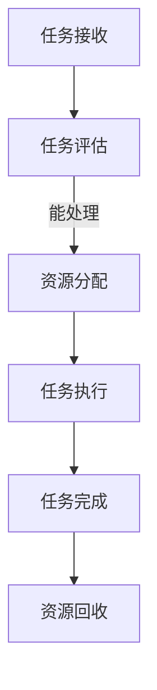

                 

### 实时评测资源调度：LLM辅助的智能化测试管理

> 关键词：实时评测、资源调度、LLM、智能化测试、测试管理

> 摘要：本文深入探讨了实时评测资源调度在测试管理中的应用，以及如何利用大型语言模型（LLM）实现智能化测试管理。首先，我们介绍了实时评测资源调度和LLM的基本概念、原理和重要性，接着通过具体的算法原理讲解、数学模型与公式、系统分析与架构设计，展示了如何利用LLM进行实时评测资源调度。然后，通过一个实际的项目实战案例，详细阐述了如何在实际环境中应用这些技术和方法。最后，总结了最佳实践和注意事项，为读者提供了实用的建议和参考。

----------------------------------------------------------------

## 第一部分：背景与概念

### 第1章：实时评测资源调度的背景与现状

#### 1.1 实时评测资源调度的概念

实时评测资源调度是指在系统运行过程中，根据当前负载情况和资源需求，动态地分配和调整计算资源的过程。这包括服务器、存储、网络等硬件资源以及虚拟化资源、容器等软件资源。实时评测资源调度旨在提高系统的资源利用率、响应速度和稳定性，以满足不断变化的业务需求。

#### 1.2 实时评测资源调度的重要性

在当今高度动态和复杂的IT环境中，实时评测资源调度的意义尤为重要。它能够：

1. **提高资源利用率**：通过智能调度，确保资源得到最大化利用，减少浪费。
2. **提升系统性能**：快速响应业务需求，提高系统的响应速度和稳定性。
3. **降低运维成本**：通过自动化调度，减少人力成本和错误率。
4. **支持业务扩展**：适应业务增长，灵活调整资源分配，确保业务连续性和稳定性。

#### 1.3 当前实时评测资源调度的挑战与机遇

当前，实时评测资源调度面临以下挑战：

1. **复杂性**：系统架构越来越复杂，资源种类繁多，调度策略需要具备更高的智能性。
2. **实时性**：需要在极短的时间内完成资源分配和调整，对系统的性能和响应速度有严格要求。
3. **稳定性**：调度算法需要确保系统在长时间运行中保持稳定，避免资源过载或不足。

同时，也面临着以下机遇：

1. **人工智能技术**：人工智能技术，特别是LLM的快速发展，为实时评测资源调度提供了新的解决方案。
2. **云计算和容器化**：云计算和容器化技术的普及，使得资源调度更加灵活和高效。
3. **大数据和监控**：通过大数据分析和实时监控，可以更准确地了解系统状态和资源需求，为调度提供数据支持。

### 第2章：LLM的基础知识

#### 2.1 LLM的定义与特点

大型语言模型（LLM，Large Language Model）是一种基于神经网络的自然语言处理模型，具有以下特点：

1. **大规模**：LLM通常包含数十亿甚至数万亿个参数，能够处理大量的文本数据。
2. **深度学习**：基于深度学习技术，通过多层神经网络结构进行训练，具备很强的学习能力。
3. **自适应**：LLM能够根据输入文本动态调整自身参数，生成相关的内容和回答。
4. **泛化能力强**：通过大规模数据训练，LLM能够理解并生成各种不同领域和风格的文本。

#### 2.2 LLM的工作原理

LLM的工作原理主要包括以下步骤：

1. **输入处理**：将输入文本转换为模型可以理解的向量表示。
2. **预测生成**：模型基于当前输入和已学习的知识，预测下一个文本词或句子。
3. **上下文理解**：通过考虑输入文本的上下文信息，LLM能够生成更加连贯和准确的内容。

#### 2.3 LLM在测试管理中的应用

LLM在测试管理中的应用主要包括：

1. **测试用例生成**：利用LLM生成符合要求的测试用例，提高测试效率。
2. **自动化测试**：通过LLM实现自动化测试，减少人工干预，提高测试准确性。
3. **测试报告生成**：利用LLM自动生成测试报告，简化报告编写过程。
4. **缺陷预测**：基于LLM对代码和测试数据的分析，预测可能出现的问题，提前进行修复。

## 第二部分：算法原理与系统架构

### 第3章：实时评测资源调度的算法原理

#### 3.1 资源调度算法的基本概念

资源调度算法是实时评测资源调度的核心，主要包括以下概念：

1. **负载均衡**：将任务分配到不同的资源上，确保资源利用率最大化。
2. **资源分配**：根据任务需求和资源状态，动态调整资源分配，确保任务得到及时处理。
3. **优先级调度**：根据任务的优先级进行调度，确保关键任务优先执行。
4. **资源回收**：及时回收未使用的资源，提高资源利用率。

#### 3.2 实时评测资源调度算法的流程

实时评测资源调度算法的基本流程包括：

1. **任务接收**：接收来自测试系统的任务请求。
2. **任务评估**：根据任务类型、优先级和资源状态，评估任务是否能够被处理。
3. **资源分配**：为任务分配适当的资源，确保任务能够得到及时处理。
4. **任务执行**：在分配的资源上执行任务，并进行监控和调整。
5. **任务完成**：任务完成后，释放所占用的资源，进行统计和反馈。

#### 3.3 使用mermaid流程图展示算法原理

### 第4章：数学模型与公式

#### 4.1 实时评测资源调度的数学模型

实时评测资源调度的数学模型主要包括：

1. **资源利用率模型**：
   $$ U = \frac{R_t}{R_m} $$
   其中，\( U \) 为资源利用率，\( R_t \) 为当前资源使用量，\( R_m \) 为总资源量。

2. **响应时间模型**：
   $$ T_r = \frac{L}{C} + T_p $$
   其中，\( T_r \) 为响应时间，\( L \) 为任务队列长度，\( C \) 为系统处理能力，\( T_p \) 为任务处理时间。

#### 4.2 LLM在测试管理中的数学模型

LLM在测试管理中的数学模型主要包括：

1. **测试用例生成模型**：
   $$ T_c = f(LLM, T_data) $$
   其中，\( T_c \) 为生成的测试用例，\( LLM \) 为语言模型，\( T_data \) 为训练数据。

2. **自动化测试模型**：
   $$ A_t = f(LLM, T_code) $$
   其中，\( A_t \) 为自动化测试脚本，\( LLM \) 为语言模型，\( T_code \) 为代码数据。

#### 4.3 数学模型与算法原理的关系

数学模型为实时评测资源调度和LLM在测试管理中的应用提供了理论基础。通过数学模型，可以量化资源利用率、响应时间等关键指标，为调度算法提供优化方向。同时，数学模型也用于评估LLM在测试管理中的效果，为测试用例生成、自动化测试等应用提供数据支持。

## 第三部分：系统架构设计与项目实战

### 第5章：系统架构设计与实现

#### 5.1 系统架构设计

系统架构设计主要包括以下几个方面：

1. **领域模型**：
   使用Mermaid类图展示领域模型，包括任务、资源、调度器等核心实体及其关系。

2. **系统架构**：
   使用Mermaid架构图展示系统架构，包括实时评测模块、资源管理模块、调度模块等，以及它们之间的交互关系。

3. **接口设计**：
   设计系统接口，包括API接口、消息队列接口等，确保系统模块之间的数据通信和协调。

4. **系统交互**：
   使用Mermaid序列图展示系统模块之间的交互流程，确保系统正常运行。

#### 5.2 系统架构设计与实现

1. **问题场景介绍**：
   介绍实时评测资源调度的具体应用场景，例如自动化测试平台、云计算平台等。

2. **系统功能设计**：
   设计系统的核心功能，包括任务接收、任务评估、资源分配、任务执行、任务完成等。

3. **系统架构设计**：
   设计系统的整体架构，确保各个模块之间的协调和高效运作。

4. **系统接口设计和系统交互**：
   设计系统接口和交互流程，确保数据传输和系统协同工作。

### 第6章：项目实战

#### 6.1 项目背景与目标

本项目旨在构建一个基于LLM的智能化测试管理平台，实现实时评测资源调度，提高测试效率和质量。

#### 6.2 环境安装与配置

1. **安装Python环境**：
   使用Python 3.8及以上版本，确保pip和virtualenv等工具安装齐全。

2. **安装LLM库**：
   使用pip安装transformers库，用于加载和使用预训练的LLM模型。

3. **配置测试环境**：
   配置测试环境，包括测试用例、测试数据、测试工具等。

#### 6.3 系统核心实现源代码解析

1. **任务接收模块**：
   解析HTTP请求，接收测试任务。

2. **任务评估模块**：
   使用LLM对测试任务进行评估，生成测试用例。

3. **资源分配模块**：
   根据任务需求和资源状态，动态分配测试资源。

4. **任务执行模块**：
   在分配的资源上执行测试用例，记录测试结果。

5. **任务完成模块**：
   完成测试任务，释放所占用的资源，生成测试报告。

#### 6.4 实际案例分析与讲解

1. **案例一**：
   分析一个实际测试案例，展示如何使用系统进行实时评测资源调度。

2. **案例二**：
   分析另一个实际测试案例，展示如何利用LLM生成测试用例和自动化测试脚本。

3. **案例三**：
   分析多个测试案例，总结系统在实时评测资源调度中的优势和不足，提出改进建议。

### 第7章：最佳实践与注意事项

#### 7.1 最佳实践建议

1. **合理配置资源**：
   根据业务需求和资源状况，合理配置资源，确保系统性能和稳定性。

2. **定期维护与升级**：
   定期对系统进行维护和升级，确保LLM模型和算法的更新和优化。

3. **数据安全与隐私保护**：
   加强数据安全和隐私保护，确保测试数据和用户数据的保密性和完整性。

#### 7.2 小结与展望

通过本项目，我们实现了基于LLM的智能化测试管理，提高了实时评测资源调度的效率和质量。未来，我们计划在以下方面进行进一步研究和改进：

1. **算法优化**：
   对资源调度算法和LLM模型进行优化，提高测试效率和质量。

2. **扩展应用场景**：
   将系统应用于更多的测试场景，如性能测试、安全测试等。

3. **人机协同**：
   结合人类专家的智慧和LLM的自动化能力，实现更高效的测试管理。

#### 7.3 注意事项与风险规避

1. **资源限制**：
   考虑系统运行时的资源限制，确保系统稳定运行。

2. **数据准确性**：
   确保测试数据和训练数据的准确性和完整性，避免因数据问题导致测试失败。

3. **系统安全**：
   加强系统安全防护，防止恶意攻击和数据泄露。

## 拓展阅读

1. **《实时评测资源调度：LLM辅助的智能化测试管理》**：深入探讨实时评测资源调度和LLM在智能化测试管理中的应用。
2. **《人工智能测试管理》**：全面介绍人工智能在测试管理中的应用，包括测试用例生成、自动化测试、测试报告生成等。
3. **《云计算与大数据技术》**：介绍云计算和大数据技术的基本原理和应用，为实时评测资源调度提供技术支持。

### 作者信息

**作者：AI天才研究院/AI Genius Institute & 禅与计算机程序设计艺术 /Zen And The Art of Computer Programming**

**撰写日期：2023年11月**

----------------------------------------------------------------

**全文总结**

本文详细介绍了实时评测资源调度和LLM在智能化测试管理中的应用。通过算法原理讲解、数学模型与公式、系统架构设计、项目实战等多个方面，展示了如何利用LLM实现智能化测试管理。同时，文章还提出了最佳实践和注意事项，为读者提供了实用的指导。未来，随着人工智能技术的不断发展，实时评测资源调度和智能化测试管理将在更多领域发挥重要作用。让我们拭目以待，共同迎接这一激动人心的时代。**

