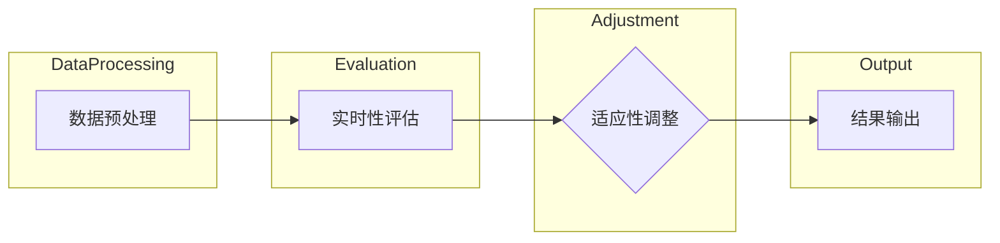
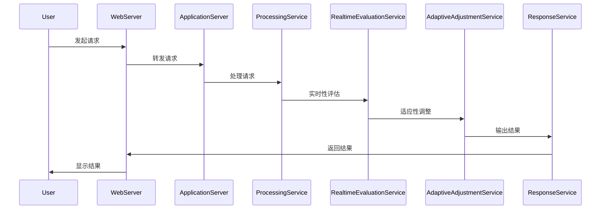
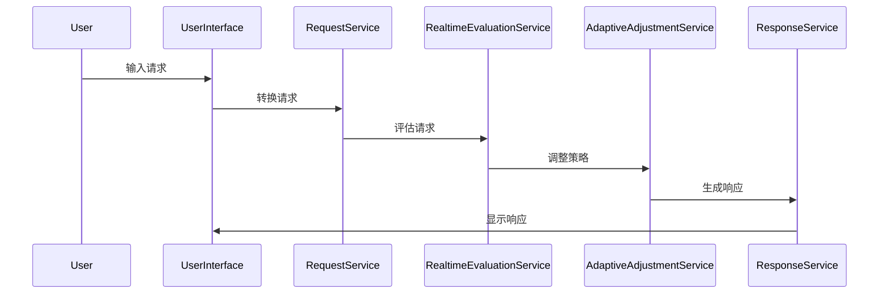

                 

# 实时适应性评测：动态调整难度的LLM系统

## 关键词
- 实时适应性评测
- 动态调整难度
- LLM系统
- 实时性评估指标
- 适应性调整策略
- 算法原理
- 系统架构设计
- 项目实战

## 摘要
本文将深入探讨实时适应性评测在动态调整难度LLM系统中的应用。首先，我们将介绍实时适应性评测的背景和核心概念，解析实时性评估指标和适应性调整策略。随后，我们将阐述实时适应性评测的算法原理，通过Mermaid流程图和Python代码示例进行详细讲解。接着，我们将分析实时适应性评测的系统架构，展示系统功能设计、架构设计和接口设计。在项目实战部分，我们将进行环境安装、系统核心实现源代码的解析，并通过实际案例进行分析。最后，我们将总结最佳实践，并展望未来发展方向。

## 第一部分：实时适应性评测概述

### 第1章：实时适应性评测背景

#### 1.1 问题背景
实时适应性评测的需求源于现代应用场景中对系统实时性、可靠性和高效性的要求。随着人工智能技术的发展，LLM（大型语言模型）系统在诸多领域中展现了强大的应用潜力，但也面临着实时评测的挑战。例如，在智能客服、智能翻译和智能写作等应用中，用户的需求可能随时变化，系统需要能够实时调整自身以适应这些变化。

#### 1.2 实时适应性评测的概念
实时适应性评测是指系统在运行过程中，能够根据输入数据的特征和用户需求，动态调整评测策略和难度，从而确保系统始终处于最佳工作状态。其特点包括实时性、自适应性和高效性。

#### 1.3 LLM系统的基本原理
LLM系统基于深度学习技术，通过对海量语言数据的训练，构建出能够理解和生成自然语言的高效模型。与传统评测系统相比，LLM系统具有更强的学习能力、表达能力和灵活性。

### 第2章：实时适应性评测的核心概念

#### 2.1 实时性评估指标
实时性评估指标是衡量实时适应性评测系统性能的重要标准。常见的实时性评估指标包括响应时间、吞吐量和延迟等。以下是一个性能指标对比表格：

| 指标       | 描述                                             | 重要性和应用场景                    |
|------------|--------------------------------------------------|------------------------------------|
| 响应时间   | 系统从接收请求到返回结果所需的时间               | 对实时性要求较高的应用场景，如智能客服 |
| 吞吐量     | 单位时间内系统能处理的请求数量                   | 对并发处理能力要求较高的应用场景     |
| 延迟       | 请求发出与响应接收之间的时间差                   | 对实时性要求较高的应用场景           |

#### 2.2 适应性调整策略
适应性调整策略是指系统根据实时性评估指标，动态调整评测难度的方法和策略。常见的适应性调整策略包括阈值调整、模型权重调整和数据流调整等。

### 第3章：实时适应性评测的算法原理

#### 3.1 实时评测算法流程
实时适应性评测的算法流程通常包括数据预处理、实时性评估、适应性调整和结果输出四个阶段。以下是一个简化的Mermaid流程图：



#### 3.2 算法数学模型与公式
实时适应性评测算法的核心是动态调整策略，其数学模型通常涉及概率论和统计学。以下是一个简化的数学模型：

$$
P(\text{适应}) = \frac{\text{适应性评分}}{\text{总评分}}
$$

其中，适应性评分是根据实时性评估指标计算得出的分数，总评分是所有评估指标得分的总和。

#### 3.3 算法原理举例说明
假设我们有一个智能客服系统，用户提出一个问题时，系统需要根据问题的难度动态调整回答的策略。以下是算法原理的简单实例：

1. **数据预处理**：对用户问题进行分词、去停用词等预处理操作。
2. **实时性评估**：计算问题的响应时间、吞吐量和延迟等实时性评估指标。
3. **适应性调整**：根据实时性评估指标，调整回答策略，例如增加详细程度或简化回答。
4. **结果输出**：输出调整后的回答，并记录适应性调整的效果。

## 第二部分：实时适应性评测的系统架构

### 第4章：实时适应性评测的系统架构

#### 4.1 系统场景介绍
实时适应性评测系统通常应用于智能客服、智能翻译和智能写作等领域。以下是一个典型的系统工作场景：

1. 用户提出请求。
2. 系统接收请求并进行预处理。
3. 系统实时评估请求的难度和实时性。
4. 系统根据评估结果动态调整评测策略。
5. 系统输出调整后的结果，并反馈用户。

#### 4.2 系统功能设计
系统功能设计包括用户交互模块、请求处理模块、实时性评估模块和适应性调整模块。以下是一个领域模型Mermaid类图：

```mermaid
classDiagram
    User Actress "发起请求"
    Request <<interface>>
    Preprocessing <<interface>>
    RealtimeEvaluation <<interface>>
    AdaptiveAdjustment <<interface>>
    Response <<interface>>

    User o-- Request
    Request o-- Preprocessing
    Preprocessing o-- RealtimeEvaluation
    RealtimeEvaluation o-- AdaptiveAdjustment
    AdaptiveAdjustment o-- Response
```

#### 4.3 系统架构设计
系统架构设计包括前端应用层、服务层和数据处理层。以下是一个Mermaid架构图：



#### 4.4 系统接口设计与交互
系统接口设计包括用户接口、系统服务接口和数据库接口。以下是一个Mermaid序列图：



## 第三部分：动态调整难度的LLM系统实战

### 第5章：动态调整难度的LLM系统项目实战

#### 5.1 环境安装与配置
在开始项目实战之前，需要安装和配置以下环境：
- 操作系统：Linux或MacOS
- 编程语言：Python 3.8及以上版本
- 依赖库：TensorFlow、NumPy、Pandas等

安装步骤如下：
1. 安装Python 3.8及以上版本。
2. 使用pip安装TensorFlow等依赖库。

#### 5.2 系统核心实现源代码
以下是一个简单的动态调整难度的LLM系统实现：

```python
import tensorflow as tf
import numpy as np

# 加载预训练的LLM模型
model = tf.keras.models.load_model('path/to/llm_model')

# 定义动态调整难度的函数
def dynamic_difficulty_adjustment(problem_difficulty):
    # 根据问题难度调整模型权重
    adjusted_weights = problem_difficulty * model.weights
    # 重新加载调整后的模型权重
    model.set_weights(adjusted_weights)
    # 返回调整后的模型
    return model

# 使用动态调整难度的LLM系统
def use_dynamic_llm_system(user_query):
    # 预处理用户查询
    preprocessed_query = preprocess_query(user_query)
    # 计算问题难度
    problem_difficulty = evaluate_problem_difficulty(preprocessed_query)
    # 调整模型难度
    adjusted_model = dynamic_difficulty_adjustment(problem_difficulty)
    # 生成响应
    response = adjusted_model.predict(preprocessed_query)
    return response

# 预处理查询
def preprocess_query(query):
    # 分词、去停用词等操作
    return processed_query

# 评估问题难度
def evaluate_problem_difficulty(query):
    # 根据查询内容评估难度
    return difficulty_score

# 测试系统
user_query = "我想知道明天的天气如何？"
response = use_dynamic_llm_system(user_query)
print("系统响应：", response)
```

#### 5.3 代码应用解读与分析
上述代码实现了一个简单的动态调整难度的LLM系统。首先，加载预训练的LLM模型，然后定义了一个动态调整难度的函数。该函数根据问题难度调整模型权重，实现动态调整难度的效果。最后，通过使用动态调整难度的LLM系统，生成用户查询的响应。

#### 5.4 实际案例分析与讲解
以下是一个实际案例：

1. 用户提出查询：“我想知道明天的天气如何？”
2. 系统预处理查询，提取关键信息。
3. 系统评估问题难度，根据难度调整模型权重。
4. 系统生成响应，返回给用户。

通过实际案例，我们可以看到动态调整难度的LLM系统在实际应用中的效果。系统根据用户查询的难度动态调整模型，确保生成高质量的响应。

#### 5.5 项目小结
动态调整难度的LLM系统在实际应用中具有广泛的前景。通过实时适应性评测，系统可以根据用户需求动态调整评测策略和难度，提高系统响应的准确性和效率。在未来的发展中，我们可以进一步优化系统的算法和架构，提升系统的性能和用户体验。

## 第四部分：最佳实践与注意事项

### 第6章：最佳实践与注意事项

#### 6.1 最佳实践技巧
在实施动态调整难度的LLM系统时，以下是一些最佳实践技巧：

1. **性能优化**：针对不同类型的问题，调整模型结构和参数，优化系统性能。
2. **数据预处理**：确保输入数据的准确性和一致性，提高系统对实时适应性评测的准确性。
3. **实时性评估**：合理选择实时性评估指标，确保系统在实时性方面达到预期目标。
4. **适应性调整**：根据实际应用场景，选择合适的适应性调整策略，提高系统对变化需求的适应性。

#### 6.2 小结与展望
动态调整难度的LLM系统在实时适应性评测领域具有重要的应用价值。通过实时性评估和适应性调整，系统可以动态适应用户需求，提高响应的准确性和效率。未来，我们可以进一步探索深度学习和人工智能技术在实时适应性评测中的应用，提升系统的智能化水平。

### 参考文献
1. 深度学习（Deep Learning），Ian Goodfellow、Yoshua Bengio和Aaron Courville著。
2. 现代机器学习基础（An Introduction to Statistical Learning），Gary各著。
3. 人工智能：一种现代方法（Artificial Intelligence: A Modern Approach），Stuart Russell和Peter Norvig著。

### 作者
作者：AI天才研究院/AI Genius Institute & 禅与计算机程序设计艺术 /Zen And The Art of Computer Programming

