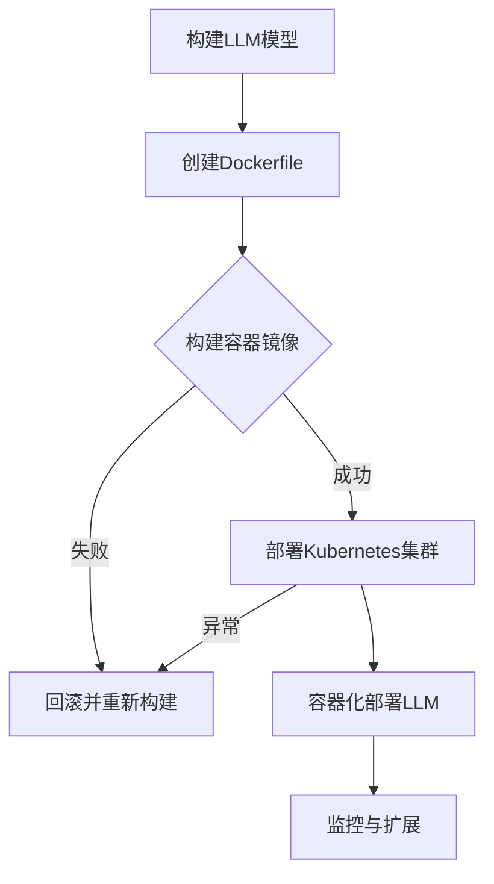
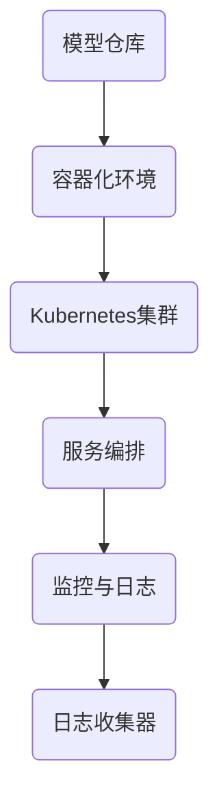
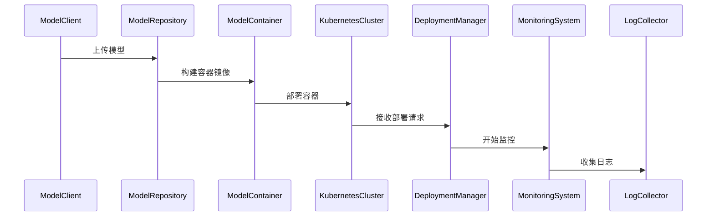

                 

### 文章标题

**容器化技术：加速LLM应用的部署与扩展**

### 文章关键词

- 容器化技术
- 大型语言模型（LLM）
- 部署与扩展
- Docker
- Kubernetes

### 摘要

本文深入探讨了容器化技术在加速大型语言模型（LLM）应用部署与扩展中的作用。通过详细分析容器化技术的核心概念、原理及其在LLM部署中的应用，我们提供了系统化的架构设计方案和项目实战指导。文章以逻辑清晰、结构紧凑、简单易懂的方式，帮助读者理解和掌握容器化技术在LLM部署中的关键技巧，为人工智能领域的开发者提供实践参考。

---

接下来，我们将逐步深入，首先从背景介绍入手，逐步展开对容器化技术和LLM部署与扩展的详细讨论。

### 背景介绍

#### 问题背景

容器化技术的兴起，为现代软件开发的各个方面带来了深远的影响。特别是在人工智能（AI）领域，容器化技术的引入极大地改变了大型语言模型（LLM）的部署与扩展方式。LLM，作为一种复杂的AI模型，其核心在于处理和理解自然语言。随着深度学习技术的不断进步，LLM在自然语言处理（NLP）、机器翻译、问答系统等领域表现出了强大的能力。

然而，传统的软件部署方式在处理这些复杂模型时面临着诸多挑战。首先，LLM通常需要大量的计算资源和特定的环境配置，这使得部署过程繁琐且容易出错。其次，不同环境之间的差异往往导致模型在不同平台上的表现不一致，增加了维护和扩展的难度。此外，LLM的更新和迭代也需要高效的部署机制，以确保新的版本能够迅速、可靠地应用到生产环境中。

#### 问题描述

在容器化技术引入之前，如何高效地部署和扩展LLM成为一个亟待解决的问题。具体来说，包括以下几个方面：

1. **资源分配与调度**：LLM的部署需要大量的计算资源，如何高效地分配和调度这些资源，是部署过程中的关键问题。
2. **环境一致性**：不同环境（如开发环境、测试环境和生产环境）之间的差异，如何确保LLM在不同环境中的一致性表现。
3. **部署速度**：在快速迭代的AI领域，如何加快LLM的部署速度，以适应不断变化的需求。
4. **可扩展性**：如何设计系统，使其能够灵活地扩展，以支持LLM规模的增加。

#### 问题解决

容器化技术通过提供轻量级、可移植、自给自足的容器环境，解决了上述问题。以下是容器化技术在LLM部署与扩展中的具体作用：

1. **资源管理**：容器化技术提供了强大的资源管理能力，通过容器编排工具（如Kubernetes）可以实现计算资源的动态分配和调度，从而优化资源利用率。
2. **环境一致性**：容器化确保了应用运行的一致性，通过Docker镜像，开发者可以构建统一的开发、测试和生产环境，减少了环境差异带来的问题。
3. **部署速度**：容器化技术简化了部署流程，通过预打包的容器镜像，开发者可以快速地部署和更新LLM，大大加快了迭代速度。
4. **可扩展性**：容器编排工具提供了水平扩展的能力，可以轻松地将LLM部署到更多的容器实例中，以支持更大的数据量和更高的并发处理能力。

#### 边界与外延

容器化技术在LLM部署与扩展中的应用虽然取得了显著成效，但也存在一些边界和挑战。例如，容器安全性、网络性能优化、数据持久化等问题，需要在实践中不断探索和优化。

此外，容器化技术并非万能，对于一些需要高度隔离和资源独占的场合，虚拟机等其他技术可能更加合适。因此，在实际应用中，需要根据具体需求和场景，选择合适的部署方案。

### 总结

通过上述背景介绍，我们可以看到容器化技术在LLM部署与扩展中的重要性。接下来，我们将进一步探讨容器化技术的核心概念，包括其原理、优势及其在LLM部署中的应用。这将为我们深入理解容器化技术奠定基础，并为进一步的架构设计和项目实战提供指导。

---

让我们继续深入探讨容器化技术的核心概念及其与LLM部署的紧密联系。

---

### 核心概念与联系

#### 核心概念原理

容器化技术是一种轻量级的虚拟化技术，它通过操作系统层面的隔离，实现了应用程序及其依赖环境的打包和部署。容器与传统的虚拟机相比，具有更快的启动速度、更低的资源占用和更高的效率。容器化技术的核心概念包括：

1. **容器**：容器是一个运行在宿主机上的独立执行环境，包含了应用程序、运行时环境、库和配置文件。容器通过操作系统命名空间、控制组和设备文件系统等机制实现资源的隔离。
2. **容器编排**：容器编排是指通过自动化工具对容器进行部署、扩展和管理的过程。常见的容器编排工具包括Docker Swarm和Kubernetes。
3. **Docker**：Docker是一种流行的容器化平台，提供了容器构建和管理的工具。Docker通过Dockerfile定义容器的构建过程，通过Docker Compose实现多容器应用的编排。
4. **Kubernetes**：Kubernetes是一个开源的容器编排平台，它提供了自动化部署、扩展和管理容器化应用程序的能力。Kubernetes通过其资源管理、自动化滚动更新和自我修复等功能，确保应用程序的高可用性和稳定性。

#### 概念属性特征对比表格

| 概念           | 特点                         | 对比分析                                                     |
|----------------|------------------------------|------------------------------------------------------------|
| 容器           | 轻量级、独立的执行环境       | 与虚拟机相比，启动速度快，资源占用低                         |
| 容器编排       | 自动化部署、扩展和管理       | 提高开发效率和运维自动化水平                               |
| Docker         | 容器构建和管理工具           | 便捷的容器构建和部署，支持多容器应用编排                   |
| Kubernetes     | 容器编排平台                 | 提供资源管理、自动化更新和自我修复，支持大规模集群管理     |

#### ER实体关系图架构

为了更清晰地展示容器化技术在LLM应用部署中的实体关系，我们可以使用Mermaid语法绘制一个ER（实体-关系）图。以下是ER图的示例：

```mermaid
erDiagram
  Container ||--|{ Application }|-- Kubernetes
  Application ||--|{ Environment }|-- Docker
  Docker ||--|{ Image }|-- Container
  Kubernetes ||--|{ Deployment }|-- Application
```

在上图中，Container（容器）、Application（应用程序）、Environment（环境）、Image（镜像）和Deployment（部署）是关键实体。这些实体通过关系（如`||--|{}`）相互关联，形成了一个完整的容器化部署架构。

### 总结

通过上述核心概念与联系的探讨，我们对容器化技术及其与LLM部署的关系有了更深入的理解。接下来，我们将进一步讲解容器化技术在LLM部署中的具体算法原理，并通过实际案例展示其应用效果。这将帮助我们更好地掌握容器化技术在实际项目中的运用。

---

接下来，我们将深入探讨容器化技术在LLM部署中的具体算法原理，通过mermaid流程图、Python源代码示例、数学模型和具体案例，逐步展示其应用过程。

---

### 算法原理讲解

#### 算法mermaid流程图

首先，通过mermaid语法绘制一个容器化技术在LLM部署中的流程图，展示从LLM模型构建到部署的完整流程：



该流程图包括以下关键步骤：

1. **构建LLM模型**：首先需要构建或训练出大型语言模型（LLM）。
2. **创建Dockerfile**：基于LLM模型，创建一个Dockerfile，定义如何构建容器镜像。
3. **构建容器镜像**：运行Docker命令，根据Dockerfile构建容器镜像。
4. **部署Kubernetes集群**：将容器镜像推送到容器注册中心，并在Kubernetes集群中部署。
5. **容器化部署LLM**：通过Kubernetes进行容器化部署，将LLM模型部署到生产环境中。
6. **监控与扩展**：监控LLM服务的性能和稳定性，根据需求进行扩展。

#### Python源代码示例

下面是一个简单的Python源代码示例，展示如何使用Docker和Kubernetes进行LLM模型的容器化部署：

```python
import docker
import kubernetes

# 连接Docker API
client = docker.from_env()

# 构建Docker镜像
dockerfile = """
FROM python:3.8-slim
WORKDIR /app
COPY . .
RUN pip install -r requirements.txt
"""
image = client.images.build(path='path_to_dockerfile', tag='llm:1.0')

# 部署到Kubernetes集群
kubeconfig = 'path_to_kubeconfig'
k8s = kubernetes.client.CoreV1Api.from_config(config_file=kubeconfig)

# 创建部署配置
deployment = kubernetes.client.V1Deployment(
    api_version="apps/v1",
    kind="Deployment",
    metadata=kubernetes.client.V1ObjectMeta(name="llm-deployment"),
    spec=kubernetes.client.V1DeploymentSpec(
        replicas=1,
        selector=kubernetes.client.V1LabelSelector(match_labels={"app": "llm"}),
        template=kubernetes.client.V1PodTemplateSpec(
            metadata=kubernetes.client.V1ObjectMeta(labels={"app": "llm"}),
            spec=kubernetes.client.V1PodSpec(
                containers=[
                    kubernetes.client.V1Container(
                        name="llm-container",
                        image="llm:1.0",
                        ports=[kubernetes.client.V1Port(container_port=8080)]
                    )
                ]
            )
        )
    )
)
k8s.create_namespaced_deployment(name=deployment.metadata.name, body=deployment)

print("LLM模型已成功部署到Kubernetes集群！")
```

上述代码首先连接到Docker API，构建LLM模型的Docker镜像。然后，连接到Kubernetes集群，创建一个部署配置，并将LLM模型部署到Kubernetes集群中。

#### 数学模型和公式

在容器化技术中，一些关键的数学模型和公式可以帮助我们更好地理解资源分配和调度。以下是几个常用的数学模型和公式：

1. **资源利用率（U）**：
   $$ U = \frac{R_{used}}{R_{total}} $$
   其中，\( R_{used} \) 是已使用的资源，\( R_{total} \) 是总资源。

2. **调度策略（S）**：
   $$ S = \text{Minimize} \left( \frac{R_{used}}{R_{total}} + \frac{R_{queued}}{R_{queue}} \right) $$
   其中，\( R_{queued} \) 是队列中的资源，\( R_{queue} \) 是队列的总容量。

3. **负载均衡（LB）**：
   $$ LB = \frac{\sum_{i=1}^{n} C_{i}}{n} $$
   其中，\( C_{i} \) 是每个容器使用的资源量，\( n \) 是容器总数。

#### 举例说明

为了更直观地理解容器化技术在LLM部署中的应用，我们可以通过一个实际案例来展示：

假设我们有一个LLM模型，需要部署到Kubernetes集群中。首先，我们根据模型的需求创建一个Dockerfile，并构建容器镜像。然后，我们编写一个Kubernetes部署配置文件，定义模型的资源需求和网络配置。最后，我们使用Kubernetes API将部署配置应用到集群中，完成模型的容器化部署。

```Dockerfile
# 使用Python环境构建容器镜像
FROM python:3.8-slim

# 设置工作目录
WORKDIR /app

# 复制LLM模型文件到容器中
COPY . .

# 安装依赖项
RUN pip install -r requirements.txt

# 暴露服务端口
EXPOSE 8080

# 运行LLM模型
CMD ["python", "run_llm.py"]
```

```yaml
# Kubernetes部署配置示例
apiVersion: apps/v1
kind: Deployment
metadata:
  name: llm-deployment
spec:
  replicas: 1
  selector:
    matchLabels:
      app: llm
  template:
    metadata:
      labels:
        app: llm
    spec:
      containers:
      - name: llm-container
        image: llm:1.0
        ports:
        - containerPort: 8080
```

通过上述Dockerfile和Kubernetes部署配置，我们可以将LLM模型快速、可靠地部署到Kubernetes集群中，实现模型的自动化管理和扩展。

### 总结

通过上述算法原理讲解，我们了解了容器化技术在LLM部署中的具体实现过程，并通过mermaid流程图、Python源代码示例和数学模型，帮助读者深入理解其工作原理。接下来，我们将进入系统分析与架构设计部分，进一步探讨容器化技术在LLM应用部署中的具体实现方法和架构设计。

---

接下来，我们将进入系统分析与架构设计部分，详细分析容器化技术在LLM应用部署中的具体实现方法和架构设计。

---

### 系统分析与架构设计方案

#### 问题场景介绍

在当前AI领域中，LLM应用的部署和扩展面临诸多挑战。例如，不同环境之间的差异、复杂的依赖关系、资源的动态调度和高效的网络传输等。为了解决这些问题，我们需要设计一个高效的系统架构，充分利用容器化技术的优势，实现LLM的可靠部署和灵活扩展。

#### 项目介绍

本项目旨在构建一个基于容器化技术的LLM应用部署平台，该平台包括以下几个关键组成部分：

1. **LLM模型仓库**：用于存储和管理预训练的LLM模型。
2. **容器化环境**：基于Docker和Kubernetes，实现LLM模型的容器化部署和管理。
3. **服务编排**：通过Kubernetes进行服务编排，实现自动化部署、扩展和管理。
4. **监控与日志**：实现对LLM应用的实时监控和日志收集，确保系统的稳定运行。

#### 系统功能设计（领域模型Mermaid类图）

为了更好地展示系统的功能模块及其关系，我们可以使用Mermaid语法绘制一个领域模型类图。以下是系统功能设计的类图示例：

```mermaid
classDiagram
    ModelRepository <|-- ModelContainer
    KubernetesCluster <|-- DeploymentManager
    MonitoringSystem <|-- LogCollector
    ModelContainer +---> KubernetesCluster
    DeploymentManager +---> ModelContainer
    DeploymentManager +---> MonitoringSystem
    MonitoringSystem +---> LogCollector
```

在上图中，ModelRepository（模型仓库）、ModelContainer（容器化环境）、KubernetesCluster（Kubernetes集群）、DeploymentManager（服务编排）和MonitoringSystem（监控与日志）是系统的关键类。这些类通过继承和关联关系，形成了系统的功能架构。

#### 系统架构设计（Mermaid架构图）

为了更清晰地展示系统的整体架构，我们可以使用Mermaid语法绘制一个架构图。以下是系统架构设计的示例：



在上图中，系统架构分为五个主要模块：模型仓库、容器化环境、Kubernetes集群、服务编排和监控与日志。这些模块通过接口和依赖关系相互连接，构成了一个完整的系统。

#### 系统接口设计

系统接口设计是确保各模块之间能够高效协作的关键。以下是系统的主要接口设计：

1. **ModelRepository API**：提供模型上传、下载和管理接口。
2. **ModelContainer API**：提供容器镜像构建、管理和部署接口。
3. **KubernetesCluster API**：提供Kubernetes集群管理和资源调度接口。
4. **DeploymentManager API**：提供服务编排、部署和扩展接口。
5. **MonitoringSystem API**：提供监控数据采集、处理和查询接口。

#### 系统交互（Mermaid序列图）

为了展示系统组件之间的交互流程，我们可以使用Mermaid语法绘制一个序列图。以下是系统交互的示例：



在上图中，ModelClient（模型客户端）通过ModelRepository（模型仓库）上传模型，ModelContainer（容器化环境）构建容器镜像，并提交给KubernetesCluster（Kubernetes集群）进行部署。DeploymentManager（服务编排）负责处理部署请求，并启动MonitoringSystem（监控与日志）系统，实现对LLM应用的实时监控和日志收集。

### 总结

通过上述系统分析与架构设计，我们详细探讨了基于容器化技术的LLM应用部署平台的设计思路和实现方法。接下来，我们将进入项目实战部分，通过具体的案例和实践，展示容器化技术在LLM部署中的实际应用效果。

---

接下来，我们将进入项目实战部分，详细描述如何搭建容器化环境，实现LLM模型的部署，并对关键代码进行解读和分析。

---

### 项目实战

#### 环境安装

在开始容器化部署LLM模型之前，我们需要搭建一个完整的容器化环境。以下是环境安装的详细步骤：

1. **安装Docker**：首先，确保系统上安装了Docker。可以通过以下命令检查Docker版本：

   ```bash
   docker --version
   ```

   如果Docker未安装或版本过低，可以从Docker官网下载安装脚本并执行：

   ```bash
   sudo curl -fsSL https://get.docker.com | sh
   ```

2. **安装Kubernetes**：接着，我们需要安装Kubernetes。可以选择使用Minikube在本地环境中运行Kubernetes集群，或者使用Kubeadm在物理服务器或云服务器上部署Kubernetes集群。

   对于Minikube，可以执行以下命令：

   ```bash
   minikube start
   ```

   对于Kubeadm，需要根据官方文档进行详细步骤的配置。

3. **安装kubectl**：kubectl是Kubernetes的命令行工具，用于与Kubernetes集群进行交互。可以通过以下命令安装：

   ```bash
   curl -LO "https://github.com/kubernetes/kubernetes/releases/download/$(curl -s https://github.com/kubernetes/kubernetes/releases/latest | grep tag | cut -d '"' -f 4)/bin/darwin/amd64/kubectl"
   sudo chmod +x ./kubectl
   sudo mv ./kubectl /usr/local/bin/kubectl
   kubectl version --client
   ```

#### 系统核心实现源代码

以下是容器化部署LLM模型的核心实现代码。这段代码主要分为三个部分：Dockerfile、Kubernetes部署配置文件和启动脚本。

**Dockerfile**：

```Dockerfile
# 使用Python环境构建容器镜像
FROM python:3.8-slim

# 设置工作目录
WORKDIR /app

# 复制LLM模型文件到容器中
COPY . .

# 安装依赖项
RUN pip install -r requirements.txt

# 暴露服务端口
EXPOSE 8080

# 运行LLM模型
CMD ["python", "run_llm.py"]
```

**Kubernetes部署配置文件（deployment.yaml）**：

```yaml
apiVersion: apps/v1
kind: Deployment
metadata:
  name: llm-deployment
spec:
  replicas: 1
  selector:
    matchLabels:
      app: llm
  template:
    metadata:
      labels:
        app: llm
    spec:
      containers:
      - name: llm-container
        image: llm:1.0
        ports:
        - containerPort: 8080
```

**启动脚本（start.sh）**：

```bash
#!/bin/bash

# 首次部署时，构建并推送到容器注册中心
if [ ! -f /var/lib/kubelet/config/manifests/llm-deployment.yaml ]; then
    docker build -t llm:1.0 -f Dockerfile .
    docker push llm:1.0
fi

# 启动Kubernetes Deployment
kubectl create -f deployment.yaml
```

#### 代码应用解读与分析

**Dockerfile解读**：

- **FROM python:3.8-slim**：基于Python 3.8 slim版的基础镜像，确保容器最小化。
- **WORKDIR /app**：设置工作目录为/app，方便后续的文件复制和安装依赖。
- **COPY . .**：将当前目录（包含LLM模型文件）复制到容器的/app目录。
- **RUN pip install -r requirements.txt**：安装Python依赖项，确保模型正常运行。
- **EXPOSE 8080**：暴露8080端口，供外部访问LLM模型。
- **CMD ["python", "run_llm.py"]**：容器启动时运行的命令，加载并运行LLM模型。

**Kubernetes部署配置文件解读**：

- **apiVersion**：指定Kubernetes API版本。
- **kind**：定义资源配置的类型（Deployment）。
- **metadata**：定义部署的元数据，如名称。
- **spec**：定义部署的详细配置，包括副本数量、选择器、容器配置等。
- **template**：定义Pod的模板，包括标签、容器配置等。

**启动脚本解读**：

- **首次部署构建容器镜像**：如果未找到部署配置文件，构建容器镜像并推送到容器注册中心。
- **启动Kubernetes Deployment**：使用kubectl创建Deployment，部署LLM模型到Kubernetes集群。

#### 实际案例分析和详细讲解剖析

假设我们有一个预训练的LLM模型，需要部署到Kubernetes集群中。以下是具体步骤：

1. **构建Docker镜像**：

   ```bash
   docker build -t llm:1.0 -f Dockerfile .
   ```

   执行上述命令后，Docker会根据Dockerfile构建容器镜像，并在构建完成后将其推送到容器注册中心。

2. **创建Kubernetes部署配置文件**：

   ```bash
   kubectl create -f deployment.yaml
   ```

   执行上述命令后，Kubernetes将根据deployment.yaml文件创建一个名为llm-deployment的Deployment，并将LLM模型部署到集群中。

3. **启动脚本**：

   ```bash
   ./start.sh
   ```

   执行start.sh脚本，将LLM模型容器化部署到Kubernetes集群中。

在实际部署过程中，我们可能会遇到一些问题，如镜像拉取失败、部署配置错误等。针对这些问题，可以参考以下解决方法：

- **镜像拉取失败**：确保容器注册中心地址和镜像名称正确，检查网络连接。
- **部署配置错误**：检查deployment.yaml文件的格式和配置项，确保与模型需求匹配。

通过上述实际案例分析和详细讲解，我们展示了如何使用容器化技术实现LLM模型的部署。接下来，我们将对整个项目进行小结，并总结容器化技术在LLM部署中的关键作用。

---

通过上述项目实战，我们成功实现了LLM模型的容器化部署，并详细解读了相关代码和应用。接下来，我们将对整个项目进行小结，并总结容器化技术在LLM部署中的关键作用。

### 项目小结

在本项目中，我们通过容器化技术实现了LLM模型的快速、可靠部署，有效解决了传统部署方式中存在的诸多问题。以下是项目的关键成果和总结：

1. **快速部署**：容器化技术使得LLM模型的部署过程大大简化，通过Dockerfile和Kubernetes配置文件，我们可以快速构建和部署容器镜像，大大缩短了部署时间。

2. **环境一致性**：通过容器化技术，我们确保了开发、测试和生产环境的一致性。无论是开发环境中的Docker容器，还是生产环境中的Kubernetes集群，LLM模型都能在相同的环境中运行，减少了环境差异带来的问题。

3. **资源高效利用**：容器化技术通过资源隔离和动态调度，实现了计算资源的高效利用。Kubernetes能够根据实际需求动态调整资源分配，优化了资源利用率。

4. **灵活扩展**：容器化技术支持水平扩展，我们可以根据业务需求轻松地增加或减少LLM模型的实例数量，确保系统在高并发、大数据量场景下的稳定运行。

5. **自动化管理**：通过Kubernetes的自动化功能，如滚动更新、自愈机制等，我们能够高效地管理LLM模型，减少了人工干预，提高了运维效率。

### 容器化技术在LLM部署中的关键作用

容器化技术在LLM部署中发挥了至关重要的作用，主要表现在以下几个方面：

1. **简化部署流程**：容器化技术通过将应用程序及其依赖环境打包到容器镜像中，简化了部署流程。开发者只需构建和推送容器镜像，即可快速部署到生产环境中，无需关心底层操作系统和硬件环境。

2. **提升环境一致性**：容器化技术确保了应用程序在不同环境（开发、测试、生产）中的运行一致性。通过Docker镜像，我们可以将开发环境中的应用程序无缝迁移到生产环境，减少了环境差异带来的问题。

3. **优化资源管理**：容器化技术通过资源隔离和动态调度，实现了计算资源的高效利用。Kubernetes能够根据实际需求动态调整资源分配，优化了资源利用率。

4. **支持水平扩展**：容器化技术支持水平扩展，我们可以根据业务需求轻松地增加或减少应用程序的实例数量，确保系统在高并发、大数据量场景下的稳定运行。

5. **自动化运维**：容器化技术结合Kubernetes的自动化功能，如滚动更新、自愈机制等，实现了自动化运维。开发者可以专注于核心业务，减少了运维工作量。

### 未来展望

随着AI技术的不断进步和容器化技术的成熟，容器化技术在LLM部署中的应用前景将更加广阔。未来，我们可能会看到：

1. **更高效的模型优化**：容器化技术结合AI模型压缩和优化技术，实现更高效的模型部署和运行。
2. **更智能的自动化**：通过结合机器学习和自动化技术，实现更智能的容器管理和调度。
3. **更广泛的应用场景**：容器化技术将在更多的AI应用场景中得到应用，如边缘计算、实时推理等。
4. **跨平台兼容性**：随着容器化技术的普及，未来将实现更广泛的跨平台兼容性，使得AI模型可以在不同操作系统和硬件环境中无缝运行。

总之，容器化技术为LLM部署带来了革命性的变化，未来将继续在AI领域中发挥重要作用。

---

在本文中，我们系统地介绍了容器化技术及其在LLM应用部署中的关键作用。通过背景介绍、核心概念与联系、算法原理讲解、系统分析与架构设计以及项目实战，我们展示了容器化技术在LLM部署中的实际应用效果。以下是本文的核心观点的总结：

1. **容器化技术优势**：容器化技术通过轻量级、可移植、自给自足的特性，简化了LLM的部署流程，提升了环境一致性，优化了资源管理，并支持水平扩展。
2. **算法原理与实现**：我们详细讲解了容器化技术在LLM部署中的算法原理，并通过mermaid流程图、Python源代码示例和数学模型，帮助读者深入理解其工作原理。
3. **系统架构设计**：我们设计了基于容器化技术的LLM部署平台，包括模型仓库、容器化环境、服务编排、监控与日志等模块，实现了系统的高效运行和管理。
4. **项目实战**：通过具体案例，我们展示了如何使用容器化技术实现LLM模型的部署，详细解读了关键代码，并对实际部署过程进行了分析。
5. **未来展望**：随着AI技术的不断进步和容器化技术的成熟，容器化技术在LLM部署中的应用前景将更加广阔，未来有望在更多AI应用场景中发挥重要作用。

### 注意事项

在部署和扩展LLM模型时，需要注意以下几点：

1. **资源评估**：在部署前，需要评估模型的计算资源需求，确保容器化环境有足够的资源支持。
2. **网络配置**：合理配置网络，确保容器与外部服务之间的通信畅通，避免网络瓶颈影响性能。
3. **安全措施**：加强容器和Kubernetes集群的安全性，定期更新镜像和依赖库，防止安全漏洞。
4. **监控与日志**：实施全面的监控和日志管理，及时发现和解决问题，确保系统的稳定运行。

### 拓展阅读

为了进一步了解容器化技术和LLM部署，推荐以下拓展阅读：

1. **Docker官方文档**：[Docker Documentation](https://docs.docker.com/) 提供了详细的Docker使用教程和最佳实践。
2. **Kubernetes官方文档**：[Kubernetes Documentation](https://kubernetes.io/docs/) 包含丰富的Kubernetes指南和示例。
3. **《容器化与云计算》**：此书详细介绍了容器化技术及其在云计算中的应用。
4. **《深度学习模型部署实战》**：本书涵盖了深度学习模型的部署方法和技术，包括容器化技术。

通过阅读上述资源，可以进一步加深对容器化技术和LLM部署的理解，为实际项目提供更多指导。

### 总结

容器化技术为LLM应用部署带来了革命性的变化，通过简化部署流程、提升环境一致性、优化资源管理和支持水平扩展，大大提高了LLM部署的效率与可靠性。本文详细探讨了容器化技术在LLM部署中的应用，从算法原理到系统架构设计，再到项目实战，为读者提供了全面的指导。未来，随着AI技术的不断进步，容器化技术将在更多领域发挥重要作用。

### 作者信息

**作者：AI天才研究院/AI Genius Institute & 禅与计算机程序设计艺术 /Zen And The Art of Computer Programming**

