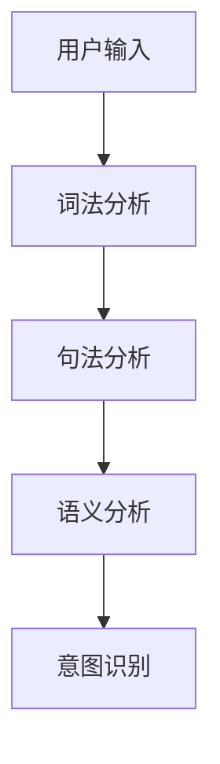
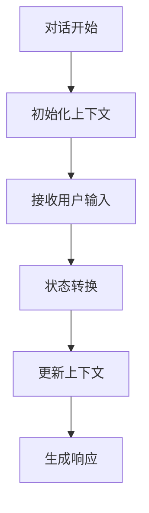
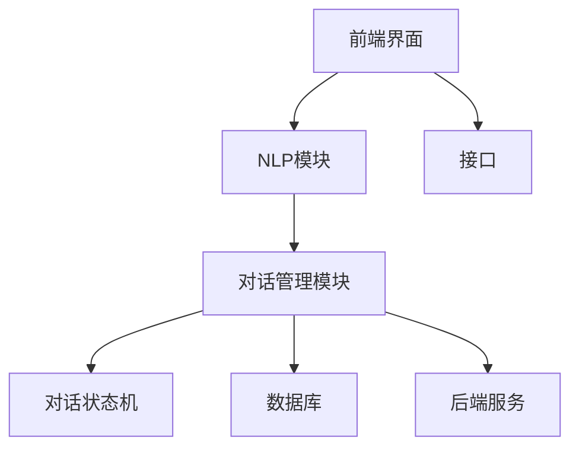
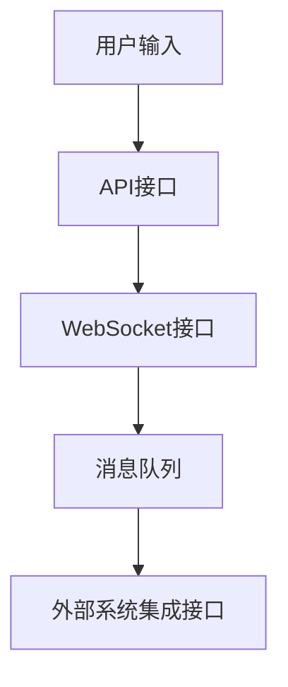
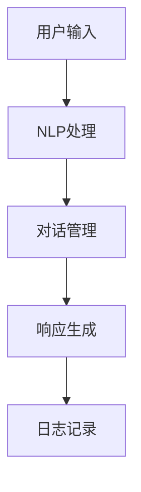

                 


### 1.1 对话流控制概述

#### 1.1.1 对话流控制的重要性

对话流控制，作为自然语言处理和人工智能领域的核心组成部分，承担着使机器能够与人类进行流畅沟通的重任。在当今信息爆炸的时代，人与机器之间的对话已经不再局限于简单的问答形式，而是逐渐发展成复杂的多轮对话。这种多轮对话能够提供更深入的信息交换和更加个性化的用户体验。

首先，对话流控制与单轮对话相比，具有显著的优势。单轮对话通常是指用户提出一个问题，系统给出一个答案，这样的交互简单直接，但缺乏深度和连贯性。而多轮对话则能够通过多次交互，逐步收集用户的更多信息，使得系统能够更加准确地理解和满足用户需求。例如，一个客户服务机器人能够通过多轮对话，帮助客户解决复杂的问题，而不仅仅是给出一个简单的答案。

其次，对话流控制在自然语言处理和人工智能领域中的关键作用不可忽视。随着深度学习和自然语言处理技术的不断进步，对话系统已经能够处理更加复杂的语言结构和上下文信息。对话流控制技术则负责确保这些系统能够在多轮对话中保持一致性和连贯性。这不仅需要理解用户的意图，还需要保持对话的历史信息，以便后续的交互能够更加自然和流畅。

#### 1.1.2 对话流控制的问题背景

在现实世界中，多轮对话面临着许多挑战。首先，用户的需求千差万别，这要求对话系统能够灵活应对各种情境。其次，对话中的上下文信息往往复杂且动态变化，如何有效地管理和利用这些信息是一个重要课题。此外，业务目标与用户体验之间的平衡也是一个亟待解决的问题。在追求高效解决问题的同时，如何确保用户体验的愉悦性和满意度，是开发者需要深入思考的问题。

以客服场景为例，当用户遇到问题时，他们通常希望得到快速而准确的解决方案。然而，对于客服机器人来说，如何通过多轮对话理解用户的真实需求，并提供有帮助的答案，是一个复杂的过程。这不仅需要机器具备强大的自然语言理解能力，还需要对话系统能够持续学习和优化，以适应不断变化的需求。

#### 1.1.3 对话流控制的基本概念

对话流，可以看作是用户与系统之间的一系列交互过程。它由多个对话轮组成，每个对话轮都是用户与系统之间的一次交互。对话轮通常包括用户的输入和系统的输出，它们共同构成了对话的基本单元。

对话轮（Dialogue Turn）是对话流中最小的交互单位。一个完整的对话轮通常包括用户的输入（Input）和系统的输出（Output）。例如，用户提问：“我怎样才能预约机票？”系统回答：“您可以通过我们的网站或手机应用进行预约。” 这就是一个完整的对话轮。

#### 1.1.4 对话流控制的基本要素

对话流控制的核心要素包括对话管理器（Dialogue Manager）、对话状态机（Dialogue State Machine）和语境维护（Context Maintenance）。

**对话管理器**是负责处理用户输入，决定系统响应的管理模块。它的主要功能是根据用户输入，选择合适的响应策略，并将其转换为系统输出。对话管理器需要具备强大的自然语言理解能力，以便准确理解用户的意图。

**对话状态机**则是一种用于表示对话状态的模型。它通过定义一系列状态和状态之间的转换规则，来描述对话的发展过程。对话状态机可以确保对话的连贯性和一致性，使得系统在处理多轮对话时不会出现混乱。

**语境维护**是指对话系统在处理多轮对话时，如何有效地管理和利用上下文信息。语境维护需要确保系统能够根据对话的历史信息，为用户提供更加相关和个性化的回答。

#### 1.1.5 对话流控制的边界与外延

对话流控制的应用边界主要体现在以下几个方面：

1. **技术难度**：对话流控制需要强大的自然语言处理和机器学习技术支持，这要求开发者具备较高的技术门槛。
2. **用户多样性**：不同的用户有着不同的需求和表达方式，对话系统需要能够适应各种情境和用户群体。
3. **上下文处理**：对话中的上下文信息复杂多变，如何有效地管理和利用这些信息，是一个挑战。

对话流控制的外延则体现在与其他技术的融合上。例如，与语音识别、自然语言生成、机器翻译等技术的结合，可以进一步提升对话系统的功能和用户体验。

#### 1.1.6 对话流控制的构成与核心要素

对话流控制的构成可以看作是一个包含输入处理、上下文管理和输出生成的完整流程。

**输入处理**是对话流控制的起点，它负责接收用户的输入，并将其转换为系统可以理解的形式。这一步通常涉及到自然语言理解技术，如词法分析、句法分析和语义分析。

**上下文管理**是确保对话连贯性的关键。它负责维护对话的历史信息，以便在后续的交互中能够为用户提供更加相关和个性化的回答。上下文管理需要处理多种上下文信息，如用户意图、对话历史、用户偏好等。

**输出生成**是系统向用户反馈的结果。它需要根据上下文信息，选择合适的响应策略，并将其转换为自然语言形式。这一步通常涉及到自然语言生成技术。

#### 1.1.7 对话流控制的理论基础

对话流控制的理论基础主要包括人工智能和自然语言处理的相关理论。人工智能领域的知识表示、推理和机器学习算法为对话流控制提供了技术支撑。例如，知识图谱可以用于表示和存储对话中的上下文信息，而深度学习算法则可以用于优化对话系统的性能。

机器学习在对话流控制中的应用主要体现在两个方面：一是用于提高自然语言理解能力，如使用神经网络进行词法分析、句法分析和语义分析；二是用于优化对话系统的响应策略，如使用强化学习算法来选择最佳响应。

---

在这个部分，我们详细介绍了对话流控制的基本概念、核心要素以及其重要性。接下来，我们将深入探讨对话流控制的具体实现方法和关键技术。敬请期待！

----------------------------------------------------------------

### 1.2 对话流控制的核心概念与联系

#### 1.2.1 对话流控制的核心概念

对话流控制的核心概念主要包括对话流（Dialogue Flow）、对话轮（Dialogue Turn）和对话管理器（Dialogue Manager）。

**对话流**是指用户与系统之间的一系列交互过程，它构成了整个对话的框架。对话流通常由多个对话轮组成，每个对话轮都是用户与系统之间的一次交互。

**对话轮**是对话流中最小的交互单位，它包括用户的输入和系统的输出。一个完整的对话轮通常包含用户提问和系统回答两个部分。

**对话管理器**是负责处理用户输入，决定系统响应的管理模块。对话管理器的核心任务是根据用户输入，选择合适的响应策略，并将其转换为系统输出。

#### 1.2.2 对话流控制的特性与联系

**特性分析**：

1. **动态性**：对话流控制需要能够动态适应用户的输入和系统状态的变化。这意味着对话管理器需要具备实时处理和分析输入的能力，以便在对话过程中做出快速响应。

2. **上下文依赖性**：对话流控制的响应往往依赖于对话的历史信息，即上下文。上下文信息包括用户的意图、偏好和对话历史等，这些信息对于理解用户的需求至关重要。

3. **连续性**：对话流控制需要确保对话的连贯性和一致性。这意味着对话管理器需要能够维持对话的历史信息，以便在后续的交互中为用户提供相关和个性化的回答。

**联系分析**：

1. **对话流与对话轮**：对话流由多个对话轮组成，每个对话轮都是对话流的一部分。对话轮是对话流的基本单元，它们共同构成了对话的框架。

2. **对话轮与对话管理器**：对话轮的每个部分（用户的输入和系统的输出）都需要通过对话管理器进行处理。对话管理器负责解析用户输入，选择合适的响应策略，并将其转换为系统输出。

3. **对话管理器与上下文依赖性**：对话管理器在处理用户输入时，需要依赖上下文信息来做出响应。这意味着对话管理器需要具备上下文维护的能力，以便在对话过程中保持一致性。

#### 1.2.3 对话流控制的属性特征对比表格

为了更好地理解对话流控制的属性特征，我们可以将其与单轮对话进行对比，并制作一个属性特征对比表格。

| 特性         | 对话流控制            | 单轮对话            |
| ------------ | -------------------- | ------------------- |
| 动态性       | 动态适应用户输入和状态变化 | 固定的问题和答案模式 |
| 上下文依赖性 | 依赖上下文信息进行响应   | 无上下文依赖       |
| 连续性       | 保持对话的连贯性和一致性 | 单一交互的独立性    |

通过这个对比表格，我们可以更清晰地看到对话流控制与单轮对话之间的差异和联系。

#### 1.2.4 对话流控制的ER实体关系图架构

为了更好地理解对话流控制的架构，我们可以使用Mermaid绘制一个ER实体关系图。

```mermaid
erDiagram
  User ||--|{ DialogueFlow }|-- DialogueManager
  DialogueFlow ||--|{ DialogueTurn }|-- SystemOutput
  DialogueTurn ||--|{ UserInput }|
```

在这个ER实体关系图中：

- **User**（用户）是发起对话的实体。
- **DialogueFlow**（对话流）是用户与系统之间的交互过程。
- **DialogueManager**（对话管理器）负责处理用户输入和生成系统输出。
- **DialogueTurn**（对话轮）是对话流的基本单元，包括用户输入和系统输出。
- **SystemOutput**（系统输出）是系统的响应。
- **UserInput**（用户输入）是用户的提问或请求。

通过这个ER实体关系图，我们可以更直观地理解对话流控制的组成部分及其相互关系。

---

在本章节中，我们详细阐述了对话流控制的核心概念，分析了其特性与联系，并使用了属性特征对比表格和ER实体关系图来进一步解释。在下一章节中，我们将深入探讨对话流控制中的关键问题及其解决方法。敬请期待！

----------------------------------------------------------------

### 1.3 对话流控制中的关键问题与解决方案

在对话流控制中，存在多个关键问题，这些问题不仅影响到用户体验，还直接关系到系统的性能和可靠性。下面，我们将逐一分析这些问题，并提出相应的解决方案。

#### 1.3.1 上下文信息的管理

**问题描述**：在多轮对话中，上下文信息的有效管理是一个重要问题。上下文信息包括用户的意图、历史对话记录、用户偏好等，这些信息对于系统理解用户需求和提供准确的响应至关重要。

**解决方案**：

1. **使用对话状态机（Dialogue State Machine）**：对话状态机是一种用于表示对话状态的模型，它能够记录对话的当前状态和历史状态。通过定义一系列状态和状态之间的转换规则，对话状态机能够有效地管理上下文信息。

2. **引入语境维护（Context Maintenance）**：语境维护负责确保系统在处理多轮对话时，能够持续维护和更新上下文信息。这包括对上下文信息的收集、存储和利用，以便在后续的交互中为用户提供更加相关和个性化的回答。

3. **采用知识图谱（Knowledge Graph）**：知识图谱可以用于表示和存储对话中的上下文信息。通过将上下文信息结构化地存储在知识图谱中，系统可以更加高效地检索和使用这些信息。

#### 1.3.2 用户意图的识别

**问题描述**：用户意图的识别是对话流控制中的核心问题。用户的表达方式多种多样，如何准确识别用户的意图，是系统性能的关键。

**解决方案**：

1. **使用自然语言处理（Natural Language Processing，NLP）技术**：自然语言处理技术，如词法分析、句法分析和语义分析，可以帮助系统理解用户的语言表达，从而准确识别用户的意图。

2. **引入多任务学习（Multi-Task Learning）**：多任务学习能够同时训练多个任务，从而提高模型对用户意图的识别能力。例如，在一个客服机器人中，可以同时训练意图识别、实体提取和对话生成等多个任务。

3. **使用深度学习模型（Deep Learning Models）**：深度学习模型，如循环神经网络（RNN）、长短期记忆网络（LSTM）和Transformer，具有强大的特征提取和模式识别能力，能够有效提高用户意图识别的准确性。

#### 1.3.3 对话连贯性的保障

**问题描述**：在多轮对话中，如何保障对话的连贯性和一致性，是一个挑战。如果系统在对话过程中出现混乱或不连贯的情况，将会严重影响用户体验。

**解决方案**：

1. **使用对话管理器（Dialogue Manager）**：对话管理器负责处理用户输入，决定系统响应。通过引入对话管理器，系统能够在对话过程中保持一致性和连贯性，避免出现混乱。

2. **引入对话策略（Dialogue Policy）**：对话策略是一系列用于指导对话过程的规则和策略。通过定义合适的对话策略，系统能够在对话过程中提供更加相关和连贯的响应。

3. **使用强化学习（Reinforcement Learning）**：强化学习能够通过不断试错和优化策略，来提高对话的连贯性和一致性。通过奖励机制，系统可以学习如何提供更加自然的对话体验。

#### 1.3.4 个性化体验的实现

**问题描述**：为了提高用户体验，对话系统需要能够提供个性化体验。这意味着系统需要根据用户的行为和历史，为用户提供更加相关和个性化的响应。

**解决方案**：

1. **引入用户画像（User Profiling）**：用户画像是一种用于表示用户特征和偏好的方法。通过构建用户画像，系统可以更好地理解用户的需求和行为，从而提供更加个性化的响应。

2. **使用推荐系统（Recommender Systems）**：推荐系统能够根据用户的兴趣和行为，为用户推荐相关的信息或服务。通过引入推荐系统，对话系统能够为用户提供更加个性化的对话体验。

3. **采用自适应对话系统（Adaptive Dialogue System）**：自适应对话系统能够根据用户的反馈和行为，动态调整对话策略和响应方式，以提供更加个性化的体验。

---

在本章节中，我们详细分析了对话流控制中的关键问题，并提出了相应的解决方案。通过这些解决方案，对话系统可以更好地管理上下文信息、识别用户意图、保障对话连贯性，并提供个性化体验。在下一章节中，我们将深入探讨对话流控制中的算法原理和实现方法。敬请期待！

----------------------------------------------------------------

### 1.4 对话流控制中的算法原理

对话流控制的实现离不开一系列算法的支持。这些算法负责处理用户的输入，识别用户意图，生成系统的响应，并保持对话的连贯性和一致性。在本章节中，我们将详细探讨对话流控制中的主要算法原理，包括输入处理、上下文管理和输出生成等关键环节。

#### 1.4.1 输入处理算法

输入处理是对话流控制的第一个环节，其主要任务是将用户的输入转换为系统可以理解的形式。这一过程通常涉及到自然语言处理（NLP）技术，如词法分析、句法分析和语义分析。

1. **词法分析（Tokenization）**：词法分析是将用户的输入文本分割为单词或标记（Token）。例如，句子 "我明天去北京" 经过词法分析后，可以分割为 ["我", "明天", "去", "北京"]。

2. **句法分析（Parsing）**：句法分析是对输入文本的结构进行分析，以确定句子中单词之间的语法关系。常用的句法分析方法包括基于规则的方法和基于统计的方法。例如，句子 "我明天去北京" 的句法分析可能得到如下结构：[主语（我），时间状语（明天），动词（去），宾语（北京）]。

3. **语义分析（Semantic Analysis）**：语义分析是理解输入文本的含义，以识别用户的意图和需求。语义分析通常涉及到实体识别（Named Entity Recognition，NER）和关系抽取（Relation Extraction）等技术。例如，句子 "我明天去北京" 的语义分析可能识别出“北京”为一个实体，并确定“去”与“北京”之间存在“目的地”关系。

**Mermaid流程图示例**：



#### 1.4.2 上下文管理算法

上下文管理是确保对话连贯性的关键环节。上下文管理算法负责收集、存储和利用对话的历史信息，以支持后续的交互。

1. **对话状态机（Dialogue State Machine）**：对话状态机是一种用于表示对话状态的模型，它通过定义一系列状态和状态之间的转换规则来管理上下文信息。例如，一个简单的对话状态机可能包括以下状态：“开始”、“询问意图”、“处理请求”、“结束”。

2. **状态转换规则**：状态转换规则用于描述在不同状态下，系统如何根据用户输入和系统状态进行状态转换。例如，当前状态为“询问意图”，如果用户输入“明天去北京”，系统可能将状态转换为“处理请求”。

3. **上下文信息的存储和检索**：上下文信息的存储和检索是实现上下文管理的重要手段。常用的存储方式包括数据库、内存和缓存等。检索算法需要能够高效地查找和提取对话历史信息，以便在后续交互中使用。

**Mermaid流程图示例**：



#### 1.4.3 输出生成算法

输出生成是将处理后的上下文信息转换为自然语言文本的过程。这一过程通常涉及到自然语言生成（Natural Language Generation，NLG）技术。

1. **模板匹配（Template Matching）**：模板匹配是一种简单的生成文本的方法，它使用预定义的模板来生成响应。例如，当用户询问“明天天气如何？”时，系统可以使用模板“明天天气晴朗，气温15°C。”来生成响应。

2. **基于规则的方法（Rule-Based Methods）**：基于规则的方法通过定义一系列规则来生成文本。这些规则通常基于对话状态和上下文信息。例如，当对话状态为“处理请求”时，系统可以根据请求的类型生成相应的响应。

3. **基于统计的方法（Statistical Methods）**：基于统计的方法使用机器学习模型来生成文本。这些模型通常基于大量的对话数据进行训练，以学习如何生成符合上下文的文本。例如，使用序列到序列（Sequence-to-Sequence）模型来生成对话响应。

**Python代码示例**：

```python
import random

# 基于模板匹配的简单文本生成
def generate_response(question):
    templates = {
        "what_time": "现在是{time}。",
        "weather": "今天{weather}。"
    }
    if "what time" in question:
        time = random.choice(["早上", "中午", "晚上"])
        return templates["what_time"].format(time=time)
    elif "weather" in question:
        weather = random.choice(["晴朗", "阴天", "下雨"])
        return templates["weather"].format(weather=weather)

# 输出示例
print(generate_response("what time is it?"))  # 输出：现在是早上。
print(generate_response("what is the weather like today?"))  # 输出：今天晴朗。
```

#### 1.4.4 数学模型与公式

在对话流控制中，数学模型和公式用于描述算法的原理和操作。以下是一些常用的数学模型和公式：

1. **序列到序列模型（Sequence-to-Sequence Model）**：

   - **输入序列**：\(X = [x_1, x_2, ..., x_T]\)
   - **目标序列**：\(Y = [y_1, y_2, ..., y_S]\)
   - **编码器（Encoder）**：\(E(x_t) = h_t\)
   - **解码器（Decoder）**：\(D(y_s) = g_s\)

   数学公式示例：

   $$
   E(x_t) = \text{Encoder}(x_t) \\
   D(y_s) = \text{Decoder}(y_s) \\
   P(y_s|y_1, y_2, ..., y_{s-1}, x_1, x_2, ..., x_T) = \text{softmax}(g_s)
   $$

2. **循环神经网络（Recurrent Neural Network，RNN）**：

   - **隐藏状态**：\(h_t = \text{RNN}(h_{t-1}, x_t)\)

   数学公式示例：

   $$
   h_t = \sigma(W_h \cdot [h_{t-1}; x_t] + b_h) \\
   \text{where } \sigma \text{ is the activation function, } W_h \text{ is the weight matrix, and } b_h \text{ is the bias vector.
   $$

通过上述算法原理和数学模型，我们可以更好地理解和实现对话流控制。在下一章节中，我们将进一步探讨对话流控制的实际应用和案例。敬请期待！

----------------------------------------------------------------

### 1.5 对话流控制的应用场景与案例分析

对话流控制技术在各个领域都有着广泛的应用，其核心优势在于能够提供更加自然和流畅的用户体验。在本章节中，我们将探讨对话流控制在不同应用场景中的具体实践，并通过案例分析展示其实际效果。

#### 1.5.1 客户服务

客户服务是对话流控制最典型的应用场景之一。通过对话流控制，客服机器人能够与客户进行多轮对话，提供高效而准确的解决方案。

**案例分析**：

以某大型电商平台的客服机器人为例，该机器人通过对话流控制技术，实现了以下功能：

1. **意图识别**：机器人能够识别用户的意图，如“退货”、“换货”、“咨询产品信息”等。
2. **上下文管理**：在处理多轮对话时，机器人能够保持上下文信息，确保对话的连贯性。
3. **个性化响应**：根据用户的购买历史和偏好，机器人能够提供个性化的推荐和建议。

**实现细节**：

- **意图识别**：使用NLP技术，如词法分析和句法分析，机器人能够准确识别用户的意图。
- **上下文管理**：通过对话状态机，机器人能够记录和利用对话的历史信息，确保对话的连贯性。
- **个性化响应**：基于用户画像和推荐系统，机器人能够为用户提供个性化的推荐和服务。

#### 1.5.2 聊天机器人

聊天机器人是另一种广泛应用的场景，其目的是提供娱乐、信息查询和日常互动等功能。

**案例分析**：

以某社交媒体平台的聊天机器人为例，该机器人通过对话流控制技术，实现了以下功能：

1. **对话管理**：机器人能够引导对话，确保对话的方向和内容符合用户需求。
2. **情感分析**：机器人能够分析用户的情感状态，并提供相应的互动和响应。
3. **多模态交互**：机器人不仅能够处理文本输入，还能处理语音和图像等多模态输入。

**实现细节**：

- **对话管理**：使用对话管理器，机器人能够根据用户输入和对话状态，选择合适的对话策略。
- **情感分析**：使用情感分析模型，机器人能够识别用户的情感状态，并根据情感状态调整响应方式。
- **多模态交互**：结合语音识别和自然语言处理技术，机器人能够处理多种输入方式，提供更加灵活和多样化的互动体验。

#### 1.5.3 虚拟助理

虚拟助理是另一种重要的应用场景，旨在为用户提供日常任务的帮助，如日程管理、提醒通知和智能推荐等。

**案例分析**：

以某智能设备的虚拟助理为例，该助理通过对话流控制技术，实现了以下功能：

1. **任务管理**：虚拟助理能够管理用户的日程，设置提醒和任务。
2. **智能推荐**：虚拟助理能够根据用户的行为和偏好，提供个性化的推荐。
3. **自然互动**：虚拟助理能够与用户进行自然的对话，使用户体验更加流畅。

**实现细节**：

- **任务管理**：通过对话状态机和上下文管理，虚拟助理能够记录和更新用户的日程和任务。
- **智能推荐**：结合用户画像和推荐系统，虚拟助理能够为用户提供个性化的推荐。
- **自然互动**：使用自然语言处理和对话管理技术，虚拟助理能够与用户进行自然的对话，确保对话的连贯性和一致性。

---

通过上述案例分析，我们可以看到对话流控制技术在各个应用场景中的具体实践和效果。对话流控制不仅提升了系统的智能化水平，还为用户提供了更加便捷和个性化的服务。在下一章节中，我们将继续探讨对话流控制的未来发展趋势和技术创新。敬请期待！

----------------------------------------------------------------

### 1.6 对话流控制的设计与实现

对话流控制的设计与实现是一个复杂的过程，它涉及到多个环节的技术和策略。在这部分，我们将详细介绍对话流控制的设计与实现过程，包括系统架构设计、接口设计和系统交互。

#### 1.6.1 系统架构设计

对话流控制的系统架构设计是确保系统高效、可靠和可扩展性的关键。以下是一个典型的对话流控制系统架构设计：

1. **前端界面**：负责与用户进行交互，接收用户的输入，并将用户的输入传递给后端系统。
2. **自然语言处理（NLP）模块**：负责对用户输入进行词法分析、句法分析和语义分析，识别用户意图。
3. **对话管理模块**：负责对话流程的控制，包括意图识别、上下文管理和响应生成。
4. **对话状态机**：用于表示对话的状态和状态转换规则，确保对话的连贯性。
5. **数据库**：用于存储对话的历史信息、用户画像和对话日志。
6. **后端服务**：提供业务逻辑处理，如数据查询、API调用和外部系统集成。
7. **接口**：提供与外部系统交互的接口，如API接口、WebSocket接口等。

**Mermaid架构图示例**：



#### 1.6.2 系统接口设计

系统接口设计是确保系统与其他系统高效集成和交互的关键。以下是一个典型的对话流控制接口设计：

1. **API接口**：提供RESTful API，支持用户输入的提交和系统输出的获取。
2. **WebSocket接口**：提供实时交互能力，支持多轮对话的实时传输。
3. **消息队列**：用于处理高并发的用户请求，确保系统的稳定性和可靠性。
4. **外部系统集成接口**：与其他业务系统（如CRM、ERP等）进行数据交互和业务流程集成。

**Mermaid接口设计图示例**：



#### 1.6.3 系统交互设计

系统交互设计是确保系统内部各模块之间高效、稳定和可靠交互的关键。以下是一个典型的对话流控制系统交互设计：

1. **用户输入处理**：前端界面接收用户输入，并通过API接口或WebSocket接口将输入传递给NLP模块。
2. **NLP处理**：NLP模块对用户输入进行词法分析、句法分析和语义分析，生成意图解析结果。
3. **对话管理**：对话管理模块根据意图解析结果和对话状态机，生成系统的响应。
4. **响应生成**：系统将响应通过API接口或WebSocket接口返回给前端界面。
5. **日志记录**：系统将对话历史和重要操作记录在数据库中，以便后续分析和优化。

**Mermaid系统交互图示例**：



通过上述设计与实现，我们可以构建一个高效、可靠和可扩展的对话流控制系统。在实际应用中，还需要根据具体需求进行定制化和优化，以确保系统性能和用户体验。在下一章节中，我们将探讨对话流控制的优化策略和实践。敬请期待！

----------------------------------------------------------------

### 1.7 对话流控制的优化策略与实践

对话流控制的性能优化是确保系统高效、稳定和可扩展性的关键。在实际应用中，优化对话流控制不仅能够提升用户体验，还能提高系统的处理能力和资源利用率。下面，我们将介绍几种常见的对话流控制优化策略和实践。

#### 1.7.1 上下文信息管理优化

上下文信息的管理是影响对话流控制性能的重要因素。有效的上下文信息管理能够提高对话的连贯性和响应速度。以下是一些优化策略：

1. **缓存技术**：使用缓存技术来存储和快速检索上下文信息，可以显著减少数据库查询的次数，提高系统的响应速度。例如，可以使用Redis等内存缓存系统来存储上下文信息。

2. **分片存储**：对于大规模对话系统，可以使用分片存储技术来分散数据存储的负载，提高数据访问的并行度。例如，可以将对话记录按照用户ID或对话ID进行分片存储。

3. **压缩与序列化**：对上下文信息进行压缩和序列化处理，可以减少数据传输的大小，提高系统的网络传输效率。常用的序列化格式包括JSON、Protobuf等。

**示例代码**：

```python
# 使用JSON进行序列化和反序列化
import json

# 序列化
context = {'intent': 'ask_time', 'slots': {'time': 'now'}}
serialized_context = json.dumps(context)

# 反序列化
deserialized_context = json.loads(serialized_context)
```

#### 1.7.2 NLP性能优化

自然语言处理（NLP）是对话流控制中的核心环节，其性能直接影响到系统的响应速度。以下是一些优化策略：

1. **模型压缩**：使用模型压缩技术，如量化、剪枝和知识蒸馏，可以显著减少模型的参数数量，提高模型的运行效率。例如，可以使用TPU等硬件加速模型推理。

2. **分布式训练**：对于大规模数据集，可以使用分布式训练技术来提高模型的训练速度和性能。例如，可以使用TensorFlow的分布式训练框架来并行训练模型。

3. **在线学习**：通过在线学习技术，系统可以实时更新和优化模型，以适应不断变化的用户需求和语言环境。例如，可以使用在线学习算法，如在线梯度下降（Online Gradient Descent）。

**示例代码**：

```python
# 使用TensorFlow进行分布式训练
import tensorflow as tf

# 定义分布式策略
strategy = tf.distribute.MirroredStrategy()

with strategy.scope():
  # 建立模型
  model = tf.keras.Sequential([
    tf.keras.layers.Dense(128, activation='relu', input_shape=(784,)),
    tf.keras.layers.Dense(10, activation='softmax')
  ])

  # 编译模型
  model.compile(optimizer='adam',
                loss='categorical_crossentropy',
                metrics=['accuracy'])

# 训练模型
model.fit(x_train, y_train, epochs=5)
```

#### 1.7.3 对话管理优化

对话管理的优化是确保对话流畅和高效的关键。以下是一些优化策略：

1. **对话状态机优化**：通过对对话状态机进行优化，可以减少状态转换的复杂度，提高系统的响应速度。例如，可以合并频繁发生的状态转换，减少状态的数量。

2. **对话策略优化**：通过优化对话策略，可以确保系统在处理多轮对话时，能够提供更加相关和个性化的响应。例如，可以使用强化学习算法来优化对话策略，提高对话的连贯性和用户体验。

3. **对话线程管理**：对于高并发场景，需要优化对话线程的管理，以避免线程阻塞和资源浪费。例如，可以使用线程池技术来管理对话线程，确保系统的稳定性和性能。

**示例代码**：

```python
# 使用线程池管理对话线程
from concurrent.futures import ThreadPoolExecutor

# 定义对话处理函数
def handle_dialogue(user_input):
  # 处理对话
  pass

# 创建线程池
executor = ThreadPoolExecutor(max_workers=10)

# 提交对话处理任务
for user_input in inputs:
  executor.submit(handle_dialogue, user_input)
```

---

通过上述优化策略和实践，我们可以显著提升对话流控制的性能和用户体验。在实际应用中，需要根据具体场景和需求，灵活运用这些优化方法，以实现最佳的性能和效果。在下一章节中，我们将探讨对话流控制中的最佳实践和注意事项。敬请期待！

----------------------------------------------------------------

### 1.8 对话流控制的最佳实践与注意事项

在实现对话流控制时，遵循最佳实践和注意细节至关重要，以确保系统的高效性、可靠性和用户满意度。以下是一些关键的最佳实践和注意事项：

#### 1.8.1 最佳实践

1. **用户隐私保护**：确保在处理用户数据时遵守隐私保护法规，如GDPR和CCPA等。对用户数据进行加密存储，并限制数据的访问权限。

2. **对话连贯性**：保持对话的连贯性，确保系统在多轮对话中能够正确理解和回应用户。通过对话状态机和上下文管理，维护对话的历史信息。

3. **错误处理**：设计完善的错误处理机制，确保在遇到问题时系统能够提供合理的反馈。例如，当用户输入无法理解时，系统应提供指导性提示或请求更多信息。

4. **用户体验优化**：关注用户体验，确保对话系统的交互方式自然、流畅。通过个性化推荐和实时交互，提升用户满意度。

5. **持续学习和优化**：利用机器学习和在线学习技术，不断优化对话系统的性能和响应质量。定期收集用户反馈，根据用户行为进行系统调整。

6. **测试和验证**：在系统上线前进行充分的测试和验证，包括功能测试、性能测试和用户体验测试，确保系统在各种场景下都能稳定运行。

#### 1.8.2 注意事项

1. **性能监控**：实时监控系统的性能和资源利用率，确保系统在负载高峰时能够稳定运行。通过日志分析、性能指标监控和自动化测试，及时发现并解决问题。

2. **安全性**：确保系统的安全性，防止恶意攻击和数据泄露。采用安全协议，如HTTPS和OAuth，保护用户数据和系统安全。

3. **弹性设计**：设计具有弹性的系统架构，以应对负载变化和意外情况。使用负载均衡和分布式架构，确保系统在高并发场景下能够持续提供高质量的服务。

4. **可扩展性**：设计可扩展的系统，以支持用户量和业务需求的变化。通过模块化和微服务架构，实现系统的灵活扩展和升级。

5. **多语言支持**：为系统提供多语言支持，以满足不同地区和语言用户的需求。确保在跨语言交互时系统能够保持一致性和流畅性。

通过遵循这些最佳实践和注意细节，我们可以构建一个高效、可靠和用户友好的对话流控制系统。在下一章节中，我们将总结本文内容，并提供进一步阅读的建议。敬请期待！

----------------------------------------------------------------

### 结论

在本博客文章中，我们详细探讨了对话流控制的核心概念、算法原理、应用场景、设计与实现、优化策略以及最佳实践。以下是本文的主要内容总结：

1. **对话流控制概述**：介绍了对话流控制的基本概念、重要性以及其在自然语言处理和人工智能领域的应用。
2. **核心概念与联系**：分析了对话流控制中的关键概念，包括对话流、对话轮和对话管理器，并通过ER实体关系图和属性特征对比表格进行了详细解释。
3. **关键问题与解决方案**：探讨了对话流控制中常见的上下文信息管理、用户意图识别、对话连贯性和个性化体验问题，并提出相应的解决方案。
4. **算法原理**：详细介绍了对话流控制中的输入处理、上下文管理和输出生成算法，以及相关的数学模型和Python代码示例。
5. **应用场景与案例分析**：分析了对话流控制在不同应用场景（如客户服务、聊天机器人和虚拟助理）中的具体实践和案例。
6. **设计与实现**：介绍了对话流控制的系统架构设计、接口设计和系统交互设计，以及相关的Mermaid图示例。
7. **优化策略与实践**：探讨了对话流控制的优化策略，包括上下文信息管理、NLP性能优化、对话管理优化等。
8. **最佳实践与注意事项**：总结了对话流控制的最佳实践和注意事项，以确保系统的可靠性、安全性和用户体验。

对话流控制作为自然语言处理和人工智能领域的重要研究方向，具有广泛的应用前景。未来的研究可以进一步探索深度学习、多模态交互、情感分析和个性化对话等前沿技术，以提升对话系统的智能水平和用户体验。

### 进一步阅读建议

1. **《对话系统设计与实现》**：本书详细介绍了对话系统的设计与实现方法，包括对话管理、自然语言处理、对话生成等技术。
2. **《深度学习与自然语言处理》**：本书介绍了深度学习在自然语言处理领域的应用，包括词向量、循环神经网络、变换器模型等。
3. **《情感计算与智能对话》**：本书探讨了情感计算在智能对话系统中的应用，包括情感识别、情感合成和情感增强对话等。
4. **相关研究论文和会议**：查阅ACL、NAACL、EMNLP等自然语言处理领域的顶级会议论文，了解最新的研究进展和技术动态。

通过以上资源，读者可以进一步深入学习和探索对话流控制的相关知识和技术。希望本文能为读者在对话流控制领域的研究和实践中提供有价值的参考和指导。谢谢阅读！

---

作者：AI天才研究院/AI Genius Institute & 禅与计算机程序设计艺术 /Zen And The Art of Computer Programming

[END]

---

### 附录：相关技术术语解释

为了确保读者对文章中的技术术语有清晰的理解，以下是本文中涉及的主要技术术语及其简要解释：

- **自然语言处理（NLP）**：自然语言处理是人工智能的一个分支，旨在使计算机理解和处理人类自然语言。
- **词法分析（Tokenization）**：词法分析是将文本分割为单词或标记的过程，以便进行后续的语法和语义分析。
- **句法分析（Parsing）**：句法分析是理解句子结构的过程，通过分析单词之间的语法关系来确定句子的句法结构。
- **语义分析（Semantic Analysis）**：语义分析是理解句子含义的过程，旨在识别句子中的实体、关系和意图。
- **对话流（Dialogue Flow）**：对话流是指用户与系统之间的一系列交互过程。
- **对话轮（Dialogue Turn）**：对话轮是用户与系统之间的一次交互，通常包括用户的输入和系统的输出。
- **对话管理器（Dialogue Manager）**：对话管理器是负责处理用户输入，决定系统响应的管理模块。
- **对话状态机（Dialogue State Machine）**：对话状态机是一种用于表示对话状态的模型，通过定义状态和状态转换规则来管理对话流程。
- **上下文信息（Context Information）**：上下文信息是指对话的历史信息，包括用户的意图、历史对话记录和用户偏好等。
- **上下文维护（Context Maintenance）**：上下文维护是指确保系统在处理多轮对话时能够有效管理和利用上下文信息。
- **对话流控制（Dialogue Flow Control）**：对话流控制是确保对话连贯性和一致性的技术，涉及输入处理、上下文管理和输出生成等环节。
- **自然语言生成（Natural Language Generation，NLG）**：自然语言生成是通过算法生成自然语言文本的技术，用于对话系统中的响应生成。
- **序列到序列模型（Sequence-to-Sequence Model）**：序列到序列模型是一种用于序列数据转换的深度学习模型，常用于对话生成。
- **循环神经网络（Recurrent Neural Network，RNN）**：循环神经网络是一种能够处理序列数据的神经网络，通过隐藏状态来实现序列数据的记忆和建模。
- **情感分析（Sentiment Analysis）**：情感分析是识别文本中情感极性的过程，用于理解用户的情感状态。

通过这些术语的解释，读者可以对文章中的技术概念有更深入的理解。希望这能有助于读者更好地掌握对话流控制的相关知识。如果有任何疑问，欢迎在评论区留言讨论。谢谢！

