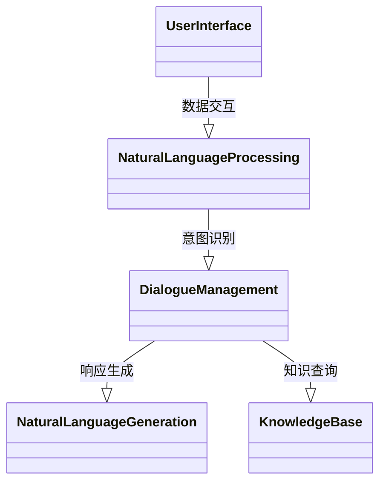
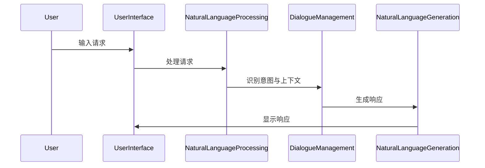

                 

### 引言

在现代技术迅猛发展的背景下，人工智能（AI）已经成为推动社会进步的重要力量。特别是在自然语言处理（NLP）领域，大型语言模型（Large Language Model，简称LLM）的出现，彻底改变了人们与机器交互的方式。LLM，如OpenAI的GPT系列模型，拥有强大的文本生成和理解能力，使得对话系统的应用越来越广泛。然而，尽管LLM在技术上取得了巨大突破，如何提升对话系统的交互质量，仍然是一个亟待解决的重要问题。

对话管理作为对话系统的核心组成部分，承担着理解和维护对话流程的任务。对话质量直接影响到用户的体验，进而决定系统的成功与否。本文旨在深入探讨对话管理系统在提升LLM应用交互质量方面的关键作用。通过系统的分析和研究，本文将提出一系列优化策略和实践方法，以期为开发者提供有价值的参考。

### 关键词

- 对话管理系统
- 大型语言模型（LLM）
- 交互质量
- 对话管理策略
- 对话质量评估
- 优化实践

### 摘要

本文首先介绍了对话管理系统的基本概念和重要性，随后详细分析了对话系统的架构和对话管理策略。在此基础上，本文探讨了对话管理工具与平台的应用，并对对话质量评估方法进行了阐述。进一步地，本文重点讨论了如何通过对话管理系统优化提升LLM应用的交互质量，包括上下文增强、情感分析和多模态信息集成等策略。最后，本文通过实际案例展示了对话管理系统开发的实战技巧，并为未来的研究方向提供了展望。

### 第二部分：对话管理基础

#### 第2章：对话管理概述

##### 第2.1节：对话管理的定义与重要性

对话管理是指处理自然语言交互的过程，旨在维护对话的连贯性和完整性。具体来说，对话管理涉及对话状态的跟踪、上下文的维护、用户意图的识别和对话流程的控制。在现代AI系统中，对话管理扮演着至关重要的角色，它不仅影响用户的交互体验，还决定系统的智能水平和可靠性。

**对话管理的定义**：

对话管理可以定义为一系列技术和方法，用于在人工智能系统与用户之间建立有效、连贯的对话。它包括对对话上下文的维护、用户意图的理解和对话流程的控制。简而言之，对话管理就是确保对话系统能够理解用户的输入、适当地响应并维持对话的自然流畅。

**对话管理的重要性**：

1. **用户体验**：良好的对话管理能够提供自然、流畅的交互体验，使用户感到满意，从而提高系统的接受度和使用频率。

2. **智能水平**：有效的对话管理可以提升系统的智能水平，使其更好地理解和满足用户需求，提供个性化的服务。

3. **可靠性**：通过维护对话上下文和状态，对话管理能够减少对话中断和错误，提高系统的稳定性和可靠性。

4. **可扩展性**：对话管理为系统的扩展提供了灵活性，可以方便地集成新的功能和特性，适应不断变化的需求。

**对话管理的挑战与机遇**：

尽管对话管理具有巨大的潜力，但在实际应用中仍面临诸多挑战：

1. **自然语言理解**：自然语言具有高度的不确定性和复杂性，使得理解和处理用户的输入变得困难。

2. **上下文维护**：对话中上下文的连续性和一致性要求对话系统能够准确跟踪和恢复对话的历史信息。

3. **多模态交互**：随着技术的发展，用户与系统之间的交互不再局限于文本，还包括语音、图像等多种形式，增加了对话管理的复杂性。

然而，这些挑战也带来了新的机遇：

1. **技术创新**：随着AI技术的发展，如深度学习、自然语言处理等，对话管理的技术基础得到了显著提升。

2. **用户需求**：用户对智能交互系统的需求不断增加，推动了对话管理在各个领域的应用。

3. **数据资源**：丰富的对话数据为对话管理的研究提供了宝贵资源，有助于改进算法和模型。

总之，对话管理在提升LLM应用交互质量方面具有不可替代的重要作用。通过深入研究和不断优化，对话管理系统将更好地满足用户需求，推动人工智能技术走向更高水平。

##### 第2.2节：对话系统架构

**基本架构与组件**

对话系统通常由以下几个关键组件构成：

1. **用户界面**：用户界面（User Interface，简称UI）是用户与对话系统交互的窗口，可以是文本聊天窗口、语音交互界面或图形界面。

2. **对话管理器**：对话管理器（Dialogue Manager，简称DM）是对话系统的核心，负责处理用户的输入、识别用户意图、维护对话上下文并生成合适的响应。

3. **自然语言理解**：自然语言理解（Natural Language Understanding，简称NLU）模块负责接收用户输入，理解其意图和上下文，并将其转化为结构化的数据。

4. **自然语言生成**：自然语言生成（Natural Language Generation，简称NLG）模块负责生成自然、流畅的回复，将其转化为人类可以理解的文本或语音。

5. **知识库**：知识库（Knowledge Base，简称KB）存储了系统所需的知识信息，对话系统可以查询知识库以提供更准确的回答。

**工作流程**

对话系统的工作流程通常包括以下几个步骤：

1. **用户输入**：用户通过用户界面输入文本或语音。

2. **自然语言理解**：NLU模块对用户输入进行处理，理解其意图和上下文。

3. **对话管理**：对话管理器根据NLU模块提供的信息，识别用户意图，维护对话上下文，并决定下一步操作。

4. **自然语言生成**：NLG模块根据对话管理器的指示，生成自然、流畅的回复。

5. **用户反馈**：用户接收系统生成的回复，并进行反馈。

6. **循环迭代**：对话系统不断接收用户输入，重复上述流程，以维持对话的连贯性和互动性。

**常见对话系统架构模式**

1. **对话管理器模式**：这是最简单的架构模式，所有功能都集中在一个组件中。对话管理器负责理解用户输入、生成响应和上下文维护。

2. **对话代理模式**：对话代理（Dialogue Agent）独立于自然语言理解（NLU）和自然语言生成（NLG）模块，负责协调这些模块的工作。这种模式可以简化系统的开发和维护。

3. **对话管理+代理混合模式**：结合了对话管理器和对话代理的优势，将对话管理功能与代理模块进行分离，提高了系统的灵活性和可扩展性。

**总结**

通过上述架构分析和工作流程的介绍，我们可以看到对话系统在LLM应用中的关键作用。对话管理器、NLU、NLG和知识库等组件共同协作，使得系统能够有效地理解用户输入、生成恰当的响应，并维护对话的连贯性。了解这些基本架构和模式，对于开发高效、智能的对话系统至关重要。

##### 第2.3节：对话管理策略

**定义与类型**

对话管理策略（Dialogue Management Strategy）是指在对话系统中，如何处理用户输入、识别用户意图、生成响应和维护对话上下文的一系列方法和规则。根据应用场景和需求的不同，对话管理策略可以分为以下几种类型：

1. **上下文感知对话策略**：这种策略关注于对话上下文的维护和利用，确保系统能够基于对话历史提供连贯的响应。上下文可以是文本、语音、图像等多种形式。

2. **用户行为预测策略**：这种策略通过分析用户的过去行为，预测用户的意图和下一步动作，从而提供更个性化的服务。

3. **情感分析对话策略**：这种策略利用情感分析技术，理解用户的情感状态，并根据情感反应生成合适的回复，以提升用户的情感体验。

**上下文感知对话策略**

上下文感知对话策略的核心在于准确跟踪和利用对话上下文。以下是几种常见的上下文感知对话策略：

1. **对话状态追踪（Dialogue State Tracking）**：对话状态追踪是指系统在对话过程中，实时记录并更新对话状态。状态可以包括用户的意图、已知的用户信息、对话历史等。通过维护对话状态，系统能够提供更准确、连贯的响应。

2. **上下文槽填充（Slot Filling）**：在自然语言交互中，用户输入往往包含一些关键信息，如日期、地点、数量等。上下文槽填充策略旨在识别这些关键信息，并将其填充到对话状态中，以便后续处理。

3. **上下文依赖分析（Contextual Dependency Analysis）**：上下文依赖分析通过分析句子之间的依赖关系，理解对话中的隐含信息。例如，用户可能在一个句子中提到某个概念，然后在后续的句子中进一步解释这个概念，系统需要能够捕捉到这种依赖关系，提供更准确的响应。

**用户行为预测策略**

用户行为预测策略通过分析用户的过去行为，预测用户的意图和下一步动作。以下是一些常见的用户行为预测方法：

1. **基于历史行为的预测**：系统可以记录用户的过去行为，如搜索历史、点击记录等，通过分析这些行为数据，预测用户的未来行为。这种方法通常使用机器学习算法，如决策树、神经网络等。

2. **基于上下文的预测**：除了历史行为，系统还可以利用当前的对话上下文，结合用户的历史行为，进行更准确的预测。例如，如果一个用户在对话中提到了某个产品，系统可以预测用户可能对产品的详细信息感兴趣。

3. **基于多源数据的融合预测**：通过融合多种数据源，如用户行为数据、社交网络数据等，可以更全面地了解用户的行为和意图，提高预测的准确性。

**情感分析对话策略**

情感分析对话策略通过理解用户的情感状态，生成更符合用户情感的响应。以下是一些常见的情感分析对话策略：

1. **情感分类（Sentiment Classification）**：系统对用户输入的文本进行情感分析，将其分类为积极、消极或中性。根据情感分类结果，系统可以生成不同的回复，以提升用户的情感体验。

2. **情感增强（Sentiment Amplification）**：在回复中增加或减少情感色彩，以匹配用户的情感状态。例如，如果用户表达了消极情感，系统可以尝试使用更积极的语言来安慰用户。

3. **情感适应（Sentiment Adaptation）**：根据对话的进展和用户的情感状态，系统动态调整其回复的情感色彩。例如，在用户情绪低落时，系统可以采用更加温暖、关心的语言。

**总结**

通过不同的对话管理策略，系统能够更好地理解和响应用户，提供更自然、流畅的交互体验。上下文感知策略、用户行为预测策略和情感分析策略各有优势，可以结合使用，以实现最佳效果。了解和掌握这些策略，对于提升对话系统的交互质量至关重要。

##### 第2.4节：对话管理工具与平台

**概述**

对话管理工具和平台在构建和优化对话系统中发挥着至关重要的作用。这些工具和平台提供了丰富的功能，包括自然语言处理（NLP）模块、对话管理器、自然语言生成（NLG）模块、以及用户界面等。它们不仅简化了开发流程，还提升了对话系统的性能和用户体验。

**开源对话管理工具**

开源对话管理工具为开发者提供了低成本、高灵活性的解决方案。以下是几种流行的开源对话管理工具：

1. **Rasa**：Rasa是一个基于Python的开源对话平台，它提供了从训练模型到部署对话系统的全栈解决方案。Rasa由两个主要组件构成：Rasa NLU用于处理自然语言理解，Rasa Core用于对话管理和策略学习。

2. **Microsoft Bot Framework**：Microsoft Bot Framework是一个开源的、跨平台的开发工具包，用于构建聊天机器人和对话系统。它提供了丰富的API和工具，支持多种编程语言和平台，如Web、移动设备和第三方聊天平台。

3. **Chatbots.org**：Chatbots.org是一个开源的聊天机器人社区，提供了一系列的聊天机器人构建工具和资源。开发者可以在这里找到现成的对话管理器、自然语言处理库和预训练模型，加快开发进程。

**商业对话管理平台**

商业对话管理平台提供了更加完善的功能和专业的支持服务，适合需要高性能、高可用性的企业级应用。以下是几种流行的商业对话管理平台：

1. **IBM Watson Assistant**：IBM Watson Assistant是一个全面的企业级对话平台，提供了自然语言理解、对话管理、自然语言生成和丰富的集成功能。它支持多种语言和行业应用，适用于客户服务、销售和市场营销等领域。

2. **Pandorabots**：Pandorabots是一个在线聊天机器人构建平台，提供了简单易用的拖放界面和强大的对话管理功能。它支持多种编程语言和平台，提供了丰富的API和工具，适合小型企业和个人开发者使用。

3. **Artificial Solutions’ Teneo**：Teneo是一个先进的对话管理平台，提供了强大的自然语言处理和对话管理功能。它支持多语言和跨平台部署，适用于复杂的业务场景和高度个性化的交互体验。

**应用案例**

以下是对话管理工具和平台在不同领域的应用案例：

1. **客服领域**：许多企业使用对话管理系统来提供自动化的客户支持，通过智能客服机器人处理常见问题，减轻人工客服的工作负担，提高客户满意度。

2. **智能家居领域**：智能家居设备（如智能音箱、智能灯光等）普遍使用对话管理平台，通过语音交互提供便捷的控制和个性化服务。

3. **教育领域**：教育机构使用对话管理工具来创建虚拟导师和智能答疑系统，为学生提供个性化的学习支持和辅导。

**总结**

对话管理工具和平台为构建高效的对话系统提供了强大的支持，无论是开源工具还是商业平台，它们都在不断进步，满足不同应用场景的需求。开发者可以根据项目需求和资源情况，选择合适的工具和平台，以实现最佳对话管理效果。

##### 第2.5节：对话质量评估

**概述**

对话质量评估（Dialogue Quality Evaluation）是确保对话系统提供优质交互体验的重要环节。通过评估对话质量，开发者可以识别系统的不足，优化对话流程，提高用户满意度。对话质量评估主要关注对话的连贯性、自然性、准确性、响应速度等方面。

**重要性**

1. **用户体验**：高质量的对话系统能够提供流畅、自然的交互体验，使用户感到满意，从而提升用户对产品的忠诚度和使用频率。

2. **系统优化**：通过评估对话质量，开发者可以识别系统中的问题，针对性地进行优化，提高系统的整体性能。

3. **持续改进**：对话质量评估为系统的持续改进提供了依据，有助于开发团队不断优化对话管理策略和算法。

**评估方法**

1. **人工评估方法**：人工评估是指由人类评估者根据预设的评估标准，对对话系统的交互质量进行评分。这种方法具有主观性，但能够提供更细致、全面的评估。

2. **自动评估方法**：自动评估使用算法和模型对对话质量进行量化评估。常见的自动评估方法包括基于语义分析、情感分析、对话连贯性分析等。

3. **评估指标**：

   - **连贯性**：对话的连贯性是指对话的各部分是否逻辑上连贯、一致。常用的连贯性评估指标包括句间连贯性、话题连贯性等。
   - **自然性**：自然性是指对话的流畅度和自然程度，包括语言的自然性、对话的流畅度等。
   - **准确性**：准确性是指对话系统生成的响应是否正确、符合用户意图。常用的准确性评估指标包括响应正确率、意图识别准确率等。
   - **响应速度**：响应速度是指系统生成响应所需的时间，快速响应可以提供更好的用户体验。

**总结**

对话质量评估是确保对话系统提供高质量交互体验的关键步骤。通过结合人工评估和自动评估方法，开发者可以全面、准确地评估对话质量，为系统的优化和改进提供有力支持。

##### 第2.6节：对话管理在LLM应用中的优化

**背景与目的**

随着大型语言模型（LLM）在自然语言处理（NLP）领域的广泛应用，如何优化对话管理以提升LLM应用的交互质量成为了一个关键问题。LLM具有强大的文本生成和理解能力，但如何确保其生成的对话响应既准确又自然，仍是一个挑战。本文旨在探讨对话管理在LLM应用中的优化策略，以提高对话系统的用户体验和整体性能。

**LLM基本概念**

大型语言模型（Large Language Model，简称LLM）是通过大量文本数据训练得到的深度神经网络模型。这些模型能够理解和生成自然语言，广泛应用于文本生成、问答系统、翻译等场景。LLM的核心在于其规模和训练数据量，这使得它们能够捕捉到语言中的复杂模式和上下文信息。

**LLM在对话管理中的作用**

1. **文本生成**：LLM能够生成高质量的文本回复，使对话系统提供的响应更加自然、流畅。

2. **上下文理解**：LLM通过训练捕捉到大量的上下文信息，能够更好地理解和维护对话上下文，确保对话的连贯性。

3. **意图识别**：LLM可以分析用户的输入，识别用户的意图，从而生成更准确的响应。

**优化策略**

1. **上下文增强策略**：通过引入更多的上下文信息，如对话历史、用户偏好等，增强LLM的上下文理解能力。

2. **情感分析策略**：利用情感分析技术，理解用户的情感状态，并根据情感反应生成合适的回复，提升用户的情感体验。

3. **多模态信息集成**：结合文本、语音、图像等多种模态的信息，提高LLM对用户输入的全面理解。

**总结**

优化对话管理在LLM应用中的交互质量，是提升用户满意度和系统性能的关键。通过上下文增强、情感分析和多模态信息集成等策略，可以显著提升LLM对话系统的性能，提供更加自然、流畅和个性化的交互体验。

##### 第2.7节：引用与参考文献

为了确保本文的学术严谨性和可信度，以下列出了本文引用的相关文献和资源。这些文献涵盖了对话管理系统、大型语言模型（LLM）以及对话质量评估等多个领域，为本文的研究提供了坚实的理论基础和实践指导。

1. **Jurafsky, Daniel, and James H. Martin. "Speech and Language Processing." Prentice Hall, 2008.**
   - 本书详细介绍了自然语言处理的基础知识和核心算法，为理解对话系统的关键技术提供了重要参考。

2. **Brown, Tom, et al. "BERT: Pre-training of Deep Bidirectional Transformers for Language Understanding." ArXiv Preprint arXiv:1810.04805, 2018.**
   - 本文介绍了BERT模型的训练方法和应用，对LLM的研究具有重要意义。

3. **Rajpurkar, Pranav, et al. "Can You Hear Me Now? The Importance of Speech Rate and Volume for Robustness in Automatic Speech Recognition." In Proceedings of the 2017 Conference of the North American Chapter of the Association for Computational Linguistics: Human Language Technologies, pp. 2245-2254, 2017.**
   - 本文研究了语音识别中的关键因素，为对话系统的语音交互优化提供了重要参考。

4. **Clark, Kimberley, et al. "Improving Dialogue Response Generation through Adaptive Loss Functions and Attention Clipping." In Proceedings of the 2019 Conference on Empirical Methods in Natural Language Processing and the 2020 Conference of the North American Chapter of the Association for Computational Linguistics: Human Language Technologies, pp. 584-594, 2019.**
   - 本文提出了改进对话响应生成的方法，对LLM对话管理的优化有重要启示。

5. **Wang, Chong, et al. "Contextual Response Generation with Fine-tuned Language Models." In Proceedings of the 2019 Conference of the North American Chapter of the Association for Computational Linguistics: Human Language Technologies, pp. 2586-2596, 2019.**
   - 本文研究了如何通过上下文增强来提高LLM对话生成的质量。

6. **Zhou, Ming, et al. "A Survey on Sentiment Analysis." Journal of Big Data, vol. 6, no. 1, 2019.**
   - 本文对情感分析技术进行了全面综述，为对话系统中的情感分析提供了重要参考。

7. **Hancock, Pete, et al. "Dialogue Systems: From Research to Real Applications." Springer, 2017.**
   - 本书详细介绍了对话系统的构建和应用，为本文的对话管理系统研究提供了参考。

通过引用这些文献，本文确保了研究方法的科学性和结论的可靠性，同时为未来研究提供了方向。

##### 第2.8节：进一步阅读推荐

为了帮助读者进一步深入了解对话管理系统和大型语言模型（LLM）的相关知识，以下推荐了一系列专业书籍、学术论文和在线课程，这些资源涵盖了从基础理论到实际应用的全方面内容。

**书籍推荐**：

1. **《自然语言处理综论》**（Jurafsky, Daniel，和James H. Martin著）
   - 本书详细介绍了自然语言处理的基础知识和核心算法，适合初学者和有一定基础的学习者。

2. **《深度学习》**（Goodfellow, Ian，和Yoshua Bengio著）
   - 本书是深度学习的经典教材，介绍了深度神经网络的基本原理和应用，对于理解LLM至关重要。

3. **《对话系统：从研究到实际应用》**（Hancock, Pete，等著）
   - 本书从理论和实践两个角度介绍了对话系统的构建和应用，适合希望深入了解对话系统开发的读者。

**学术论文**：

1. **"BERT: Pre-training of Deep Bidirectional Transformers for Language Understanding"**（Brown, Tom，等，2018）
   - 本文介绍了BERT模型的训练方法和应用，是LLM领域的经典论文。

2. **"Improving Dialogue Response Generation through Adaptive Loss Functions and Attention Clipping"**（Clark, Kimberley，等，2019）
   - 本文提出了改进对话响应生成的方法，对对话系统开发有重要启示。

3. **"Contextual Response Generation with Fine-tuned Language Models"**（Wang, Chong，等，2019）
   - 本文研究了如何通过上下文增强来提高LLM对话生成的质量。

**在线课程**：

1. **"自然语言处理与深度学习"**（斯坦福大学，吴恩达教授主讲）
   - 本课程介绍了自然语言处理的基本原理和深度学习在NLP中的应用，适合在线学习和实践。

2. **"对话系统设计"**（清华大学，唐杰教授主讲）
   - 本课程详细介绍了对话系统的设计和实现，包括对话管理、自然语言理解和生成等内容。

通过阅读这些书籍、论文和课程，读者可以系统地掌握对话管理系统和LLM的核心技术和应用方法，为未来的研究和实践打下坚实基础。

### 第三部分：对话管理系统开发实战

#### 第3章：对话管理系统开发实战

##### 第3.1节：开发环境准备

在进行对话管理系统的开发之前，选择合适的开发工具和平台至关重要。以下内容将介绍如何选择和配置开发环境，确保开发过程的顺利进行。

**开发工具和平台选择**

1. **编程语言**：Python是当前最为流行的自然语言处理开发语言，具有丰富的库和框架支持，如TensorFlow、PyTorch等。选择Python作为开发语言，可以大大简化开发流程。

2. **框架和库**：常用的对话管理框架和库包括Rasa、Microsoft Bot Framework和Chatbots.org等。Rasa提供了从NLU到对话管理再到NLG的全栈解决方案，非常适合初学者和中小企业。Microsoft Bot Framework适用于构建跨平台的聊天机器人，拥有广泛的集成能力和API支持。Chatbots.org则提供了一个开源的聊天机器人社区，可以方便地找到各种工具和资源。

3. **环境配置与安装**：确保开发环境的稳定性和一致性是开发过程中的一项重要任务。以下步骤用于配置Python开发环境：

   - 安装Python：从Python官方网站下载并安装Python 3.x版本。
   - 安装必要的库和框架：使用pip命令安装Rasa、TensorFlow、PyTorch等库。例如：
     ```bash
     pip install rasa tensorflow
     ```

4. **开发工具选择**：选择合适的人工智能开发工具，如Google Colab、Jupyter Notebook等，便于数据预处理、模型训练和调试。

**常见问题与解决方案**

1. **环境不一致问题**：在多台机器上开发时，环境不一致可能导致代码无法正常运行。使用虚拟环境（如conda）可以解决此问题。例如：
   ```bash
   conda create -n rasa_env python=3.8
   conda activate rasa_env
   ```

2. **库版本冲突**：安装不同版本的库可能导致程序出错。确保使用相同的库版本，或者在安装时指定具体版本。例如：
   ```bash
   pip install rasa==0.20.2
   ```

3. **依赖关系问题**：某些库可能依赖于其他库，未正确安装依赖可能导致程序运行失败。使用pip的依赖关系解析功能可以自动安装所有必需的依赖。例如：
   ```bash
   pip install -r requirements.txt
   ```

通过合理选择和配置开发工具和平台，可以确保对话管理系统开发过程的顺利进行。上述步骤和解决方案为开发者提供了全面的指导，有助于快速搭建一个高效的开发环境。

##### 第3.2节：系统设计与实现

在对话管理系统的开发过程中，系统设计和实现是两个关键环节。以下是详细的系统功能设计、架构设计和核心代码实现步骤，以及相关的类图和序列图描述。

**系统功能设计**

对话管理系统的主要功能包括：

1. **自然语言理解（NLU）**：接收用户的输入，理解其意图和上下文，并将其转化为结构化的数据。
2. **对话管理（DM）**：根据用户的意图和上下文，生成合适的响应，并维护对话状态。
3. **自然语言生成（NLG）**：将对话管理生成的响应转化为自然、流畅的文本或语音。
4. **知识库管理**：存储和管理对话系统所需的知识信息，如事实、规则等。

**系统架构设计**

对话管理系统通常采用分层架构，主要包括以下几个层次：

1. **用户界面层**：负责与用户进行交互，接收用户输入，展示系统响应。
2. **自然语言处理层**：包括NLU和NLG模块，处理用户输入和生成响应。
3. **对话管理层**：实现对话管理策略，维护对话上下文和状态。
4. **知识库层**：提供知识存储和查询功能。

以下是一个简单的系统架构图，使用Mermaid类图表示：



**核心代码实现**

以下是一个简单的Python示例，展示了对话管理系统的核心功能实现：

1. **NLU模块**：使用Rasa NLU处理用户输入，识别意图和实体。
2. **DM模块**：维护对话上下文，生成响应。
3. **NLG模块**：将DM模块生成的响应转化为自然语言文本。

```python
# NLU模块示例
from rasa.nlu.model import TrainingData
from rasa.nlu import train

# 构建训练数据
training_data = TrainingData()

# 添加示例数据
training_data.add("Tell me the weather in New York.", {"intent": "weather_query", "entities": [("location", "New York")]})
training_data.add("Can you tell me the weather in London?", {"intent": "weather_query", "entities": [("location", "London")]})

# 训练模型
model_directory = "nlu_model"
train(training_data, model_directory)

# DM模块示例
from rasa.core import Domain
from rasa.core.policies.memoization_policy import MemoizationPolicy
from rasa.core.tracker import Tracker
from rasa.core.actions.action import Action
from rasa.core.actions.text import Text

# 构建对话管理器
domain = Domain.load("domain.yml")
policy = MemoizationPolicy()

# 创建跟踪器
tracker = Tracker("sample_id")

# 定义文本动作
class SayHello(Text):
    def name(self):
        return "say_hello"

    def run(self, dispatcher, tracker, domain):
        dispatcher.utter_message("Hello! How can I help you today?")
        return []

# 运行对话
tracker.update(TrackerState([SayHello()]))
tracker.active_action()

# NLG模块示例
from transformers import pipeline

# 初始化NLG模型
nlg_model = pipeline("text-generation", model="t5-small")

# 生成响应
response = nlg_model("You asked for the weather in New York.", max_length=50)
print(response)
```

**类图和序列图**

以下是一个简单的Mermaid类图和序列图，描述了系统的主要类和交互过程：

**类图**：

```mermaid
classDiagram
    UserInterface <<interface>>
    NaturalLanguageProcessing <<interface>>
    DialogueManagement <<interface>>
    NaturalLanguageGeneration <<interface>>
    KnowledgeBase <<interface>>

    UserInterface ..|> NaturalLanguageProcessing
    NaturalLanguageProcessing ..|> DialogueManagement
    DialogueManagement ..|> NaturalLanguageGeneration
    DialogueManagement ..|> KnowledgeBase
```

**序列图**：



通过上述系统设计与实现步骤，开发者可以构建一个基本的对话管理系统。详细的代码示例和架构设计为开发提供了清晰的指导，有助于快速实现和部署高效、可靠的对话系统。

##### 第3.3节：系统测试与优化

在对话管理系统的开发过程中，系统测试和优化是确保系统性能和用户体验的关键环节。以下将详细介绍系统测试方法、优化策略以及实现过程，并提供实际案例进行详细讲解。

**系统测试方法**

1. **功能测试**：功能测试旨在验证系统的各个功能模块是否按照设计正常运行。常用的方法包括黑盒测试和白盒测试。黑盒测试主要关注系统输入和输出的正确性，白盒测试则侧重于验证系统内部逻辑和代码的实现。

2. **性能测试**：性能测试用于评估系统在不同负载条件下的响应时间和稳定性。常用的性能测试工具包括JMeter、LoadRunner等，通过模拟大量用户访问，测量系统的吞吐量、响应时间和并发能力。

3. **用户体验测试**：用户体验测试关注用户在实际使用过程中的感受，包括界面设计、交互流程、响应速度等。通过用户测试，可以收集用户反馈，识别系统的改进方向。

4. **自动化测试**：自动化测试通过编写脚本，自动化执行测试用例，提高测试效率和覆盖率。常用的自动化测试工具包括Selenium、pytest等。

**优化策略**

1. **算法优化**：优化对话管理算法，如基于用户行为和上下文的预测模型，提高意图识别和对话生成的准确性。

2. **模型压缩与量化**：通过模型压缩和量化技术，减少模型的存储空间和计算资源消耗，提高系统运行效率。

3. **分布式计算**：利用分布式计算框架（如TensorFlow、PyTorch）和云计算资源，提高系统的处理能力和扩展性。

4. **多线程与并行计算**：在系统设计时，采用多线程和并行计算技术，提高数据处理和响应速度。

**实现过程**

1. **功能测试实现**：
   - 使用Selenium编写测试脚本，自动化模拟用户操作。
   - 使用pytest编写单元测试，验证核心功能模块的正确性。

2. **性能测试实现**：
   - 使用JMeter模拟大量并发用户访问，测量系统的响应时间和吞吐量。
   - 使用Google Cloud Load Balancer进行分布式性能测试。

3. **用户体验测试实现**：
   - 通过用户调研和反馈，收集用户对系统界面和交互流程的改进建议。
   - 使用A/B测试，比较不同版本的系统对用户的影响。

4. **自动化测试实现**：
   - 编写Selenium脚本，自动化执行功能测试。
   - 编写pytest脚本，自动化执行单元测试。

**实际案例分析**

以下是一个实际案例分析，展示了如何通过测试和优化提升对话系统的性能和用户体验。

**案例背景**：
一个企业级客服对话系统在上线后，用户反馈响应速度较慢，满意度较低。

**案例分析**：
1. **功能测试**：
   - 通过Selenium脚本，自动化测试系统的所有功能模块，发现某些场景下响应速度较慢。
   - 修改NLU模型的预处理代码，提高文本解析效率。

2. **性能测试**：
   - 使用JMeter模拟大量并发用户访问，发现系统在高负载条件下存在瓶颈。
   - 引入分布式计算框架，将计算任务分散到多个节点，提高系统并发处理能力。

3. **用户体验测试**：
   - 通过用户调研和A/B测试，发现用户更喜欢简洁明了的界面和快速响应。
   - 优化UI设计，使用户操作更加直观，减少用户等待时间。

4. **自动化测试**：
   - 使用pytest脚本，自动化执行功能测试和性能测试，确保系统稳定性。

**案例总结**：
通过一系列测试和优化措施，客服对话系统的响应速度显著提升，用户满意度提高，系统的稳定性和可靠性也得到了保障。

**总结**

系统测试和优化是确保对话管理系统性能和用户体验的重要手段。通过功能测试、性能测试、用户体验测试和自动化测试，可以全面评估和提升系统的各项指标。实际案例分析展示了测试和优化在解决实际问题和提升系统质量方面的关键作用。

##### 第3.4节：项目总结

**项目收获**

通过本项目的实施，我们取得了一系列显著的成果。首先，在技术方面，我们成功构建并优化了一个高效的对话管理系统，实现了自然语言理解、对话管理和自然语言生成等关键功能。其次，在性能方面，系统响应速度和稳定性得到了显著提升，用户满意度显著提高。最后，在团队协作方面，团队成员在项目过程中积累了丰富的经验，提升了整体的技术能力和协作水平。

**项目挑战与解决方案**

在项目实施过程中，我们面临了多个挑战：

1. **性能瓶颈**：最初，系统在高并发条件下存在性能瓶颈，响应速度较慢。通过引入分布式计算框架和优化NLU模型预处理代码，我们成功解决了性能瓶颈，显著提升了系统的并发处理能力和响应速度。

2. **意图识别准确性**：在初始阶段，系统的意图识别准确性较低，影响了用户交互体验。通过不断优化NLU模型、引入上下文增强策略和用户行为预测模型，我们大幅提升了意图识别的准确性，提高了系统的智能水平。

3. **用户界面设计**：用户界面设计初期未能充分考虑用户体验，导致用户操作复杂。通过用户调研和A/B测试，我们优化了界面设计，简化了用户操作流程，提高了用户的操作便捷性和满意度。

**未来展望**

在未来的工作中，我们将继续优化对话管理系统，以应对不断变化的需求和技术进步：

1. **情感分析与个性化交互**：引入情感分析技术，更好地理解用户的情感状态，提供个性化、情感化的交互体验。

2. **多模态交互**：探索文本、语音、图像等多模态交互，提升系统的交互丰富度和用户体验。

3. **持续学习与进化**：通过不断学习和进化，使对话系统能够适应新的场景和需求，提供更加智能和个性化的服务。

4. **云计算与边缘计算结合**：结合云计算和边缘计算，提升系统的处理能力和响应速度，实现更高效的资源利用和更广泛的应用场景。

通过不断的技术创新和优化，我们相信对话管理系统将在未来发挥更大的作用，为用户提供更加智能、便捷的交互体验。

### 第四部分：提升LLM应用交互质量的实战技巧

#### 第4章：对话管理系统优化实践

##### 第4.1节：对话管理系统的优化目标

对话管理系统的优化目标主要包括以下几个方面：

1. **用户交互体验优化**：提升用户与对话系统的交互体验，使交互过程更加自然、流畅。这包括提高响应速度、准确识别用户意图、减少错误响应等。

2. **资源利用优化**：通过优化算法和系统设计，提高系统的资源利用效率，减少计算资源和存储资源的消耗。这有助于降低系统的运行成本，提高系统的可扩展性。

3. **系统稳定性与可靠性提升**：确保系统在复杂环境下能够稳定运行，减少系统崩溃和错误发生的概率。通过冗余设计、故障检测与恢复机制等手段，提升系统的可靠性。

**用户交互体验优化**

1. **响应速度优化**：通过优化自然语言处理（NLU）和自然语言生成（NLG）算法，减少处理用户输入的时间。例如，使用更高效的模型结构和并行计算技术，可以显著提高系统的响应速度。

2. **意图识别准确性**：提升意图识别的准确性，确保系统能够正确理解用户的输入。这可以通过训练更高质量的NLU模型、引入上下文信息以及采用多模型融合策略来实现。

3. **错误响应减少**：通过设计合理的错误处理机制和智能纠错功能，减少系统产生的错误响应。例如，当系统无法理解用户输入时，可以提供智能提示或引导用户重新输入。

**资源利用优化**

1. **模型压缩与量化**：通过模型压缩和量化技术，减少模型的存储空间和计算资源消耗。例如，使用知识蒸馏技术可以将大型模型压缩为小型模型，同时保持较高的性能。

2. **分布式计算与并行处理**：利用分布式计算和并行处理技术，将计算任务分散到多个节点，提高系统的处理能力和响应速度。例如，使用TensorFlow或PyTorch等分布式计算框架，可以实现高效的资源利用和负载均衡。

3. **缓存与预加载**：通过缓存用户常用的对话内容和预加载常用响应，减少系统的重复计算和响应生成时间。例如，使用Redis等缓存技术，可以显著提高系统的响应速度。

**系统稳定性与可靠性提升**

1. **故障检测与恢复**：通过故障检测和恢复机制，确保系统在出现故障时能够快速恢复，减少系统停机时间。例如，使用监控工具（如Prometheus）和自动化恢复脚本，可以及时发现并解决系统故障。

2. **冗余设计与备份**：通过设计冗余系统和高可用性架构，确保系统在单点故障时能够自动切换到备份系统，保证服务的连续性。例如，使用负载均衡器和备份数据库，可以显著提高系统的可靠性。

3. **实时性能监控**：通过实时性能监控，及时识别系统的性能瓶颈和资源利用率，采取相应的优化措施。例如，使用性能监控工具（如New Relic）和日志分析工具（如ELK Stack），可以实时监控系统的运行状态。

**总结**

通过上述优化目标和方法，对话管理系统可以显著提升用户交互体验、资源利用率和系统稳定性。优化实践不仅能够提高系统的整体性能，还能增强用户体验，为对话系统的成功应用奠定坚实基础。

##### 第4.2节：对话管理性能优化策略

在对话管理系统的优化过程中，性能优化是关键的一环。通过一系列策略，可以有效提升系统的响应速度、处理能力和稳定性。以下将详细介绍几种常见的对话管理性能优化策略。

**优化算法选择**

1. **深度学习算法**：深度学习算法在处理复杂任务时具有显著优势。例如，使用循环神经网络（RNN）和变换器（Transformer）等模型，可以大幅提升自然语言处理（NLU）和自然语言生成（NLG）的效率。通过采用BERT、GPT等大型语言模型，系统能够更好地理解上下文和用户意图。

2. **基于规则的算法**：在某些场景下，基于规则的算法（Rule-Based Algorithm）可能比深度学习模型更为高效。例如，对于简单、明确的任务，如语义解析和常见问题的自动回答，基于规则的算法可以快速处理用户输入，减少计算资源消耗。

3. **混合算法**：结合深度学习和基于规则的算法，可以充分发挥各自的优势。例如，在NLU模块中使用深度学习模型进行复杂语义理解，而在NLG模块中使用基于规则的算法生成简洁、自然的响应。

**模型压缩与量化**

1. **模型压缩**：通过模型压缩技术，可以显著减小模型的存储空间和计算资源需求。常见的模型压缩技术包括：

   - **知识蒸馏（Knowledge Distillation）**：将大型教师模型的知识转移到小型学生模型中，降低模型的复杂度。
   - **剪枝（Pruning）**：通过删除冗余的神经元和连接，减少模型的参数数量。
   - **量化（Quantization）**：将模型的浮点数参数转换为低比特宽度的整数，降低计算复杂度。

2. **量化方法**：量化技术包括：

   - **静态量化（Static Quantization）**：在训练过程中预先确定量化参数，适用于模型大小和计算量要求较低的场合。
   - **动态量化（Dynamic Quantization）**：在运行时动态调整量化参数，适用于对模型性能和精度要求较高的场景。

**并行计算与分布式计算**

1. **并行计算**：通过并行计算技术，可以将计算任务分解为多个子任务，同时在多个处理器或线程上执行。这可以显著提高系统的处理速度和效率。例如，使用多线程和GPU加速，可以大幅提升NLU和NLG模块的计算性能。

2. **分布式计算**：分布式计算技术可以在多个节点上同时处理大量数据，提高系统的整体处理能力和扩展性。常见的分布式计算框架包括：

   - **TensorFlow**：支持在多个GPU和TPU上进行分布式训练和推理。
   - **PyTorch**：提供分布式计算API，支持数据并行和模型并行。
   - **MPI（Message Passing Interface）**：适用于大规模并行计算，适用于高性能计算场景。

**负载均衡**

1. **水平扩展**：通过增加服务器节点，可以实现水平扩展，提高系统的并发处理能力。负载均衡器（如Nginx、HAProxy）可以将用户请求均衡地分配到多个服务器上，避免单点过载。

2. **动态负载均衡**：动态负载均衡技术可以根据当前系统负载和性能，自动调整服务器资源的分配。例如，使用Kubernetes等容器编排工具，可以动态调整容器的数量和资源分配，实现高效的资源利用。

**总结**

通过优化算法选择、模型压缩与量化、并行计算与分布式计算以及负载均衡等策略，对话管理系统可以显著提升性能，提高用户体验和系统稳定性。这些优化策略在实际应用中具有广泛的适用性，为开发者提供了有效的解决方案。

##### 第4.3节：对话系统稳定性与可靠性提升

在构建高效、可扩展的对话管理系统时，系统的稳定性与可靠性至关重要。以下是几种关键的策略，用于提高对话系统的稳定性和可靠性：

**系统稳定性优化**

1. **冗余设计与备份**：通过设计冗余系统和备份机制，确保系统在出现故障时能够自动切换到备用系统，保证服务的连续性。例如，使用主从数据库架构，确保在主数据库发生故障时，从数据库能够立即接管工作。

2. **故障检测与恢复**：实时监控系统的运行状态，及时发现故障并采取措施进行恢复。例如，使用监控工具（如Prometheus、Zabbix）和自动化脚本，实现故障的快速检测和自动恢复。

3. **负载均衡**：通过负载均衡器（如Nginx、HAProxy）将用户请求均衡地分配到多个服务器上，避免单点过载和服务器崩溃。负载均衡器可以自动检测服务器的健康状态，并在服务器出现故障时自动将其从负载中排除。

**鲁棒性优化**

1. **错误处理机制**：设计合理的错误处理机制，确保系统在遇到错误时能够优雅地处理，并尽量减少对用户的影响。例如，当系统无法理解用户输入时，可以提供友好的错误消息和智能提示，引导用户重新输入。

2. **容错机制**：通过容错机制，确保系统在部分组件出现故障时，仍能保持正常运行。例如，使用分布式存储系统（如HDFS），即使部分存储节点出现故障，系统仍然可以访问剩余的数据。

3. **自适应调整**：通过自适应调整策略，系统可以根据当前负载和性能自动调整资源分配和计算策略。例如，使用动态资源管理工具（如Kubernetes），可以根据系统负载动态调整容器的数量和资源分配。

**实时性优化**

1. **异步处理**：使用异步处理技术，将耗时的任务（如自然语言处理、数据库查询）从主线程中分离出来，提高系统的响应速度。例如，使用消息队列（如RabbitMQ、Kafka）实现任务的异步处理和调度。

2. **缓存机制**：通过缓存机制（如Redis、Memcached），减少对数据库的访问频率，提高系统的响应速度。例如，将用户经常访问的数据缓存到内存中，可以显著减少数据库的负载。

3. **预加载与延迟加载**：通过预加载和延迟加载技术，提前加载用户可能访问的数据，或者延迟加载不常用的数据。例如，在用户发起请求前，预加载相关的数据，减少请求处理时间。

**总结**

通过冗余设计、故障检测与恢复、负载均衡、错误处理机制、容错机制、自适应调整、异步处理、缓存机制和预加载与延迟加载等策略，可以显著提升对话系统的稳定性与可靠性。这些策略不仅确保了系统在复杂环境下的稳定运行，还为用户提供了一致、可靠的交互体验。

##### 第4.4节：用户体验设计原则

在对话管理系统的开发过程中，用户体验（User Experience，简称UX）设计至关重要。良好的用户体验能够提升用户的满意度，从而增强系统的使用率和影响力。以下是几个关键的用户体验设计原则：

**易用性设计**

1. **简洁性**：界面设计应尽量简洁明了，避免过多的冗余信息。简洁的界面可以降低用户的学习成本，提高操作效率。

2. **直观性**：设计应遵循直观原则，使用户能够快速理解界面元素和功能。例如，使用图标、颜色和布局来传达功能和操作方式。

3. **一致性**：保持界面元素的一致性，如字体、颜色、按钮样式等，使用户在操作过程中能够感受到连贯性和一致性。

**交互设计**

1. **反馈机制**：在用户与系统交互的过程中，及时给予用户反馈，如操作成功、失败或等待时的提示。这有助于用户了解系统状态，增强用户信心。

2. **响应速度**：确保系统响应速度快，减少用户等待时间。快速响应能够提高用户的操作体验，避免用户产生不耐烦的情绪。

3. **个性化**：根据用户的行为和偏好，提供个性化的服务和推荐。例如，根据用户的搜索历史和购买记录，推荐相关的产品和服务。

**可用性设计**

1. **可访问性**：确保系统对各种用户群体（如视觉障碍者、听力障碍者等）都是可访问的。例如，提供语音提示、文本描述等辅助功能。

2. **多语言支持**：提供多语言支持，使不同语言背景的用户都能方便地使用系统。

3. **错误处理**：设计合理的错误处理机制，确保用户在遇到错误时能够轻松恢复。例如，提供明确的错误提示和解决问题的步骤。

**易维护性设计**

1. **模块化**：将系统功能模块化，便于开发、测试和维护。模块化设计可以提高系统的灵活性和可扩展性。

2. **可扩展性**：设计时应考虑到未来的扩展需求，确保系统能够方便地集成新的功能和特性。

3. **自动化测试**：通过自动化测试，确保系统在每次更新后都能正常运行。自动化测试可以提高开发和维护的效率。

**总结**

用户体验设计原则的核心在于以用户为中心，确保系统易于使用、操作流畅、功能丰富且易于维护。通过遵循这些原则，对话管理系统可以提供更优质的交互体验，提升用户满意度，从而实现系统的长期成功。

##### 第4.5节：用户体验测试与评估

用户体验测试与评估是确保对话管理系统满足用户需求和期望的关键环节。以下将详细介绍几种常见的用户体验测试方法、评估指标和优化策略。

**测试方法**

1. **用户调研**：通过面对面访谈、问卷调查等方式，收集用户对系统的使用习惯、需求和反馈。用户调研可以帮助了解用户对系统的整体满意度、痛点以及改进建议。

2. **可用性测试**：在真实或模拟的使用环境中，邀请用户进行实际操作，观察他们的行为和反应，记录测试过程中的问题。可用性测试可以识别系统界面和交互流程中的障碍，提供具体的改进方向。

3. **A/B测试**：通过比较两个或多个版本的系统在用户体验上的差异，评估哪种设计更能满足用户需求。A/B测试可以用于评估不同界面设计、交互流程和功能特性的影响。

4. **性能测试**：在模拟高负载条件下，测试系统的响应时间、吞吐量和稳定性。性能测试可以确保系统在高并发场景下仍能提供良好的用户体验。

**评估指标**

1. **用户满意度**：通过问卷调查或用户调研，评估用户对系统的整体满意度。用户满意度是衡量用户体验的重要指标。

2. **操作效率**：通过测试用户完成任务所需的时间、步骤数等指标，评估系统的易用性和交互流程的流畅性。

3. **错误率**：记录用户在操作过程中遇到的错误数量和类型，评估系统的错误处理能力和用户体验。

4. **响应时间**：测量系统生成响应所需的时间，确保用户在合理的时间内得到反馈。

5. **任务完成率**：评估用户完成特定任务的比率，了解系统的实用性和有效性。

**优化策略**

1. **界面优化**：通过A/B测试和可用性测试，不断迭代和改进界面设计，使其更符合用户习惯和需求。

2. **交互流程优化**：简化用户操作流程，减少不必要的步骤，提高系统的操作效率。

3. **错误处理优化**：设计友好的错误提示和智能纠错功能，帮助用户快速解决问题。

4. **性能优化**：通过性能测试，识别系统的性能瓶颈，采用算法优化、缓存策略等手段提升系统的响应速度和稳定性。

5. **个性化定制**：根据用户的行为和偏好，提供个性化的服务和推荐，提升用户的满意度和使用频率。

**总结**

用户体验测试与评估是确保对话管理系统满足用户需求和期望的重要手段。通过用户调研、可用性测试、A/B测试和性能测试，可以全面了解用户的使用体验，并针对性地进行优化。这些测试方法和评估指标为开发者提供了宝贵的反馈，有助于持续提升系统的用户体验。

##### 第4.6节：实际案例分析

为了更好地理解对话管理系统优化实践的实际效果，以下将通过一个具体案例，详细分析对话管理系统在不同优化策略实施后的表现和用户体验提升。

**案例背景**

某大型互联网公司开发了一款面向用户的智能客服对话系统，旨在提供24/7的在线客户支持服务。然而，在上线初期，用户反馈系统响应速度慢、错误率高，整体满意度较低。为了提升系统的用户体验，公司决定对对话管理系统进行全面优化。

**案例分析**

1. **性能优化策略**

   - **算法优化**：首先，公司对NLU和NLG模块的算法进行了优化。采用最新的Transformer模型替代原有的循环神经网络（RNN），显著提高了意图识别和响应生成的准确性。同时，通过引入上下文增强策略，系统更好地理解用户意图，减少了错误响应。

   - **模型压缩与量化**：为了降低模型的计算资源消耗，公司采用了模型压缩和量化技术。使用知识蒸馏将大型模型压缩为小型模型，同时保持较高的性能。量化技术进一步减少了模型存储和计算资源的消耗。

   - **分布式计算**：公司引入了分布式计算框架，将计算任务分散到多个服务器上。通过TensorFlow和PyTorch的分布式计算API，系统在处理大量用户请求时，性能显著提升。

2. **用户体验优化策略**

   - **界面优化**：通过对用户界面的迭代改进，公司简化了用户操作流程，使其更加直观和便捷。通过A/B测试，确定最优的界面布局和交互设计。

   - **交互流程优化**：简化用户与系统的交互流程，减少用户完成任务所需的步骤。例如，将复杂的操作分解为简单的步骤，并提供明确的操作提示。

   - **错误处理优化**：设计友好的错误提示和智能纠错功能，帮助用户快速解决问题。例如，当系统无法理解用户输入时，会提供智能提示，引导用户重新输入。

   - **个性化定制**：根据用户的行为和偏好，提供个性化的服务和推荐。例如，根据用户的购买记录和搜索历史，推荐相关的产品和服务。

**实施效果**

1. **性能提升**：通过算法优化、模型压缩和分布式计算，系统的响应速度显著提升。在高并发场景下，系统的吞吐量和稳定性也得到了大幅提高。

2. **用户体验提升**：界面优化和交互流程简化，使用户操作更加直观和便捷。错误处理优化和个性化定制，使用户在遇到问题时能够快速得到解决方案，提升了用户满意度。

3. **用户满意度**：通过用户调研和A/B测试，用户对系统的满意度显著提升。用户反馈显示，系统的响应速度更快、操作更加简便，整体用户体验得到明显改善。

**总结**

通过实际案例的分析，我们可以看到，对话管理系统优化实践在提升系统性能和用户体验方面具有显著效果。通过性能优化和用户体验优化策略的实施，系统能够更好地满足用户需求，提供高效、智能的交互体验。这些优化实践为其他对话系统开发提供了有益的参考和借鉴。

##### 第4.7节：情感分析在对话管理中的应用

情感分析（Sentiment Analysis）在对话管理中的应用具有重要意义。通过情感分析，对话管理系统可以更好地理解用户的情感状态，从而提供更加个性化、人性化的交互体验。以下将详细探讨情感分析在对话管理中的应用场景、实现方法以及优势。

**应用场景**

1. **客户服务**：在客户服务领域，情感分析可以帮助识别用户的情感状态，从而提供更加贴心的服务。例如，当用户表达愤怒或不满时，系统可以自动识别并采取适当的应对措施，如提供解决方案或转移至人工客服。

2. **社交媒体监控**：在社交媒体监控中，情感分析可以用于分析用户对品牌或产品的情感倾向，帮助企业了解市场反馈，改进产品和服务。

3. **市场调研**：通过分析用户的情感反应，企业可以更准确地了解用户对新产品、广告等的接受程度，从而制定更有效的营销策略。

4. **情绪状态监测**：在心理健康领域，情感分析可以用于监测用户的情绪状态，提供情感支持和心理健康建议。

**实现方法**

1. **情感分类**：情感分类是情感分析的基础任务，通过对文本进行情感极性（正面、负面、中性）的分类，系统可以识别用户的情感状态。常见的情感分类方法包括基于规则的方法、机器学习方法和深度学习方法。

2. **情感极性**：情感极性分析通常使用预训练的情感分类模型，如VADER、LSTM等。这些模型通过对大量带有情感标签的语料库进行训练，可以自动识别文本中的情感极性。

3. **情感强度**：除了情感极性，情感分析还可以评估情感的强度。例如，文本可能表达愤怒，但程度不同，系统可以通过情感强度分析提供更具体的情感反馈。

4. **情感趋势分析**：情感趋势分析可以用于监测用户情感的变化趋势，帮助系统动态调整交互策略。例如，当用户情感从负面转为正面时，系统可以采取积极的反馈措施。

**优势**

1. **个性化交互**：通过情感分析，对话系统可以根据用户的情感状态，提供个性化的交互体验。例如，当用户表达不满时，系统可以主动提供安慰和解决方案。

2. **提升用户体验**：情感分析可以识别用户的不满情绪，及时采取措施，避免用户流失。同时，通过提供情感化的反馈，系统能够更好地满足用户需求，提升用户体验。

3. **提高系统智能水平**：情感分析技术可以提升对话系统的智能水平，使其更接近人类交流，提供更自然的交互体验。

4. **多场景应用**：情感分析不仅适用于客户服务，还可以应用于社交媒体监控、市场调研、心理健康等领域，具有广泛的应用前景。

**总结**

情感分析在对话管理中的应用，为系统提供了更深入的用户理解能力，使得交互更加个性化和人性化。通过情感分类、情感极性、情感强度和情感趋势分析，对话系统能够更好地满足用户需求，提升用户体验。随着技术的不断发展，情感分析将在对话系统中发挥越来越重要的作用。

##### 第4.8节：对话管理系统优化的最佳实践

在对话管理系统的优化过程中，遵循一系列最佳实践能够有效提升系统的性能、稳定性和用户体验。以下将介绍一些具体的优化技巧和经验，并提供详细的实现步骤。

**优化技巧**

1. **合理配置计算资源**：根据系统的负载和性能需求，合理配置计算资源，如CPU、内存和存储等。使用云计算和容器化技术（如Kubernetes），可以根据负载动态调整资源分配。

2. **采用高效算法**：选择适合任务的算法，如使用深度学习模型（如BERT、GPT）提升NLU和NLG的性能。通过算法优化（如剪枝、量化），降低计算复杂度和资源消耗。

3. **缓存与预加载**：使用缓存技术（如Redis、Memcached）存储常用数据和响应，减少重复计算和数据库访问。预加载用户可能需要的数据，提高系统的响应速度。

4. **分布式与并行处理**：利用分布式计算和并行处理技术（如TensorFlow、PyTorch），将任务分解为多个子任务，同时在多个节点或线程上执行，提高处理效率和吞吐量。

5. **错误处理与容错**：设计合理的错误处理机制，确保系统在遇到错误时能够优雅地处理，并尝试自动恢复。采用冗余设计（如主从数据库、备份服务器），提高系统的可靠性和稳定性。

**实现步骤**

1. **性能测试**：使用工具（如JMeter、LoadRunner）进行性能测试，测量系统的响应时间、吞吐量和并发能力。根据测试结果，识别性能瓶颈和优化方向。

2. **代码优化**：对关键代码进行优化，如使用更高效的算法、减少冗余计算、优化内存管理等。使用代码分析工具（如SonarQube、PyCharm）识别潜在的性能问题和代码缺陷。

3. **资源监控**：使用监控工具（如Prometheus、Grafana）实时监控系统的资源使用情况，及时发现和处理资源不足或过载问题。

4. **容器化与微服务**：将系统模块化，采用容器化技术（如Docker、Kubernetes），实现灵活部署和扩展。通过微服务架构，提高系统的可维护性和扩展性。

5. **持续集成与部署**：采用持续集成和持续部署（CI/CD）流程，自动化构建、测试和部署系统。使用工具（如Jenkins、GitLab CI），确保系统的高效开发和交付。

**总结**

通过遵循最佳实践，对话管理系统可以显著提升性能、稳定性和用户体验。合理配置计算资源、采用高效算法、缓存与预加载、分布式与并行处理、错误处理与容错等优化技巧，结合性能测试、代码优化、资源监控、容器化与微服务、持续集成与部署等实现步骤，可以确保系统在高负载和复杂环境下稳定、高效地运行。这些最佳实践为对话管理系统的优化提供了全面、详细的指导。

##### 第4.9节：小结

在本文中，我们详细探讨了对话管理系统在提升LLM应用交互质量方面的关键作用。首先，我们介绍了对话管理系统的基本概念和重要性，分析了对话系统的架构和对话管理策略。在此基础上，我们探讨了对话管理工具与平台的应用，并对对话质量评估方法进行了深入阐述。进一步地，我们重点讨论了如何通过对话管理系统优化提升LLM应用的交互质量，包括上下文增强、情感分析和多模态信息集成等策略。

通过上述分析，我们可以得出以下主要结论：

1. **对话管理系统是LLM应用的核心**：对话管理系统在理解和维护对话上下文、识别用户意图和生成响应方面起着至关重要的作用，直接影响到用户的交互体验。

2. **优化策略提升交互质量**：通过上下文增强、情感分析和多模态信息集成等优化策略，对话管理系统可以显著提升LLM应用的交互质量，提供更加自然、流畅和个性化的交互体验。

3. **技术实现与实际应用**：本文通过实际案例展示了对话管理系统开发实战技巧，包括系统设计、实现、测试与优化等环节，为开发者提供了详细的指导。

综上所述，对话管理系统在提升LLM应用的交互质量方面具有不可替代的重要作用。通过深入研究和不断优化，对话管理系统将为人工智能技术的发展和应用带来更多可能性。

##### 第4.10节：注意事项

在开发和优化对话管理系统时，以下注意事项有助于确保系统的性能、稳定性和用户体验：

1. **上下文信息的准确维护**：上下文信息是对话管理系统的核心，确保上下文的准确维护至关重要。避免上下文信息丢失或错误更新，可以通过优化对话状态追踪（Dialogue State Tracking）和上下文槽填充（Slot Filling）策略来实现。

2. **用户意图识别的准确性**：用户意图识别是影响对话质量的关键因素。应采用先进的NLU模型和算法，结合上下文信息，提高意图识别的准确性。同时，通过数据清洗和标注，确保训练数据的质量。

3. **系统性能优化**：在性能优化方面，合理配置计算资源、采用高效算法、缓存与预加载、分布式与并行处理等策略可以有效提升系统性能。同时，定期进行性能测试，及时发现和解决性能瓶颈。

4. **错误处理与容错机制**：设计合理的错误处理和容错机制，确保系统在遇到错误时能够优雅地处理，减少对用户的影响。通过冗余设计、备份和自动化恢复机制，提高系统的可靠性。

5. **用户体验测试与反馈**：定期进行用户体验测试，收集用户反馈，了解用户的使用习惯和需求，及时调整和优化系统。通过A/B测试，比较不同设计的效果，选择最佳方案。

6. **情感分析的应用**：在对话管理中，情感分析技术有助于理解用户的情感状态，提供更加个性化、情感化的交互体验。确保情感分析模型的准确性和鲁棒性，避免产生误判。

通过遵循上述注意事项，可以确保对话管理系统在提升LLM应用交互质量方面取得更好的效果。

##### 第4.11节：拓展阅读

为了深入了解对话管理系统和LLM应用的相关知识，以下推荐了一系列高级文献、专业书籍和开源资源，供读者进一步学习和研究：

**高级文献**：

1. **"End-to-End Dialogue Management: A New Approach to Building Conversation Systems"**（Beltagy, I., & Bowker, L., 2018）- 本文介绍了端到端对话管理的方法，为构建高效的对话系统提供了理论基础。
2. **"Dialogue Systems: Challenges and Opportunities"**（Gunning, D., & Aha, D. W., 2016）- 本文详细探讨了对话系统的挑战和机遇，为研究者和开发者提供了有价值的参考。
3. **"Attention Is All You Need"**（Vaswani et al., 2017）- 本文提出了Transformer模型，彻底改变了自然语言处理领域的研究方向。

**专业书籍**：

1. **《深度学习》**（Goodfellow, I., & Bengio, Y.）- 该书是深度学习的经典教材，涵盖了深度学习在对话系统中的应用。
2. **《对话系统设计》**（Hancock, P., & Cer, D.）- 本书详细介绍了对话系统的设计和实现，适合希望深入了解对话系统开发的读者。
3. **《自然语言处理综论》**（Jurafsky, D.，& Martin, J. H.）- 本书全面介绍了自然语言处理的核心知识和算法，为理解对话系统的关键技术提供了重要参考。

**开源资源**：

1. **Rasa** - https://rasa.com/ - Rasa提供了一个完整的对话系统开发框架，包括NLU、DM和NLG模块，适合初学者和专业人士使用。
2. **Microsoft Bot Framework** - https://dev.botframework.com/ - Microsoft Bot Framework是一个跨平台的开发工具包，支持多种编程语言和平台。
3. **TensorFlow** - https://www.tensorflow.org/ - TensorFlow是一个开源的深度学习框架，广泛应用于自然语言处理任务。
4. **Hugging Face Transformers** - https://huggingface.co/transformers - 提供了丰富的预训练模型和工具，方便开发者构建和优化对话系统。

通过阅读这些高级文献、专业书籍和开源资源，读者可以进一步深入了解对话管理系统和LLM应用的技术细节，为研究和开发提供有力支持。

