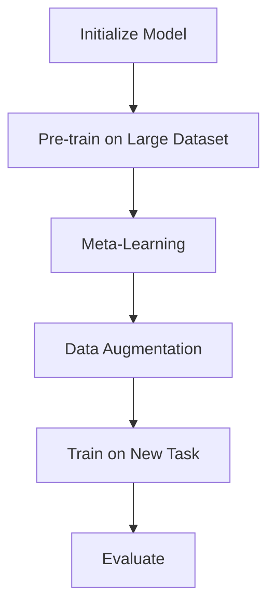
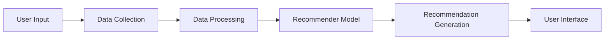
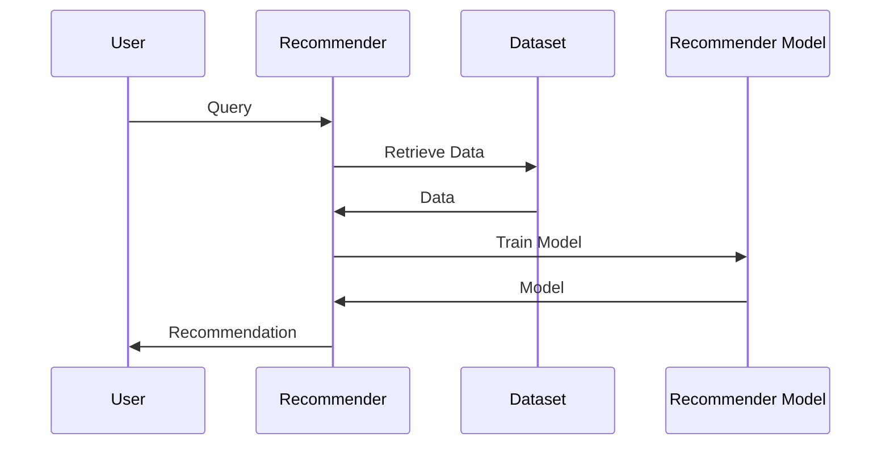

                 

## 少样本学习：AIGC快速适应新场景的利器

> 关键词：少样本学习，AIGC，机器学习，模型适应，新场景，快速训练

> 摘要：少样本学习作为人工智能领域的关键技术，致力于解决在数据稀缺情况下模型的快速适应问题。本文将深入探讨少样本学习的背景、核心原理以及具体算法，并介绍如何在实际项目中应用这一技术，以实现AIGC（自适应智能生成计算）快速适应新场景的目标。

## 1.1 少样本学习背景与概念

### 1.1.1 问题的背景

在传统的机器学习中，模型的训练通常需要大量的标注数据。然而，在现实世界中，许多任务的数据获取成本非常高，有时甚至无法获得足够的标注数据。这种情况下，少样本学习（Few-Shot Learning）应运而生，它致力于在仅有少量样本的情况下，使机器学习模型能够快速适应新任务。

### 1.1.2 问题描述

少样本学习旨在解决以下问题：当给定一个新任务，并且只有少量相关样本时，如何设计学习算法，使得模型能够准确地进行预测或分类。

### 1.1.3 问题解决

少样本学习的核心在于学习如何从一个小的样本集中提取有用的信息，以便在新任务中有效地泛化。常见的解决方法包括元学习（Meta-Learning）、模型蒸馏（Model Distillation）、基于数据的迁移学习（Data-Driven Transfer Learning）等。

### 1.1.4 边界与外延

少样本学习主要关注在数据稀缺的情况下如何学习。然而，在实际应用中，它也可以与其他学习范式相结合，如在线学习（Online Learning）、无监督学习（Unsupervised Learning）和强化学习（Reinforcement Learning）等。

### 1.1.5 概念结构与核心要素组成

少样本学习的基本概念结构包括：

- **样本**：指用于训练模型的数据点。
- **类别**：指数据点所属的类别或标签。
- **样本集**：指用于训练模型的所有数据点的集合。
- **模型**：指用来学习数据分布和进行预测的算法。

核心要素组成包括：

- **元学习算法**：用于加速模型在新任务上的适应。
- **数据增强**：通过变换现有数据来扩充样本集。
- **迁移学习**：利用先前的经验来加速当前任务的学习。

## 1.2 少样本学习的核心原理

### 1.2.1 原理概述

少样本学习的核心原理在于通过从少量样本中学习到足够的信息，以实现良好的泛化能力。具体来说，它包括以下几个方面：

- **模型泛化能力**：通过提高模型的泛化能力，使得模型在少量样本上也能学到有用的知识。
- **样本效率**：通过优化样本的使用效率，使得每个样本都能被充分利用。
- **数据分布理解**：通过学习数据分布，使得模型能够更好地理解数据的内在规律。

### 1.2.2 核心概念对比表格

| 概念               | 描述                                                     |
|--------------------|----------------------------------------------------------|
| 泛化能力           | 模型在未见过的数据上的表现能力。                         |
| 样本效率           | 每个样本对模型学习过程的贡献。                         |
| 数据分布理解       | 模型对数据分布的把握程度，直接影响模型的泛化能力。     |

### 1.2.3 ER实体关系图

```mermaid
erDiagram
  Sample ||--|{ Model }||: trains
  Category ||--|{ Model }||: predicts
  Dataset ||--|{ Model }||: learns
```

## 1.3 少样本学习算法原理讲解

### 1.3.1 算法概述

少样本学习算法主要包括以下几种：

- **基于模型的迁移学习**：通过将模型在大型预训练数据集上的知识迁移到少样本任务中。
- **基于样本的数据增强**：通过数据变换来扩充样本集，提高模型的学习效率。
- **元学习**：通过在多个任务上训练模型来提高模型在新任务上的适应能力。

### 1.3.2 算法流程



### 1.3.3 Python源代码

```python
# Meta-Learning Example

# 导入所需的库
import torch
import torch.nn as nn
import torch.optim as optim

# 定义模型
class MetaLearner(nn.Module):
    def __init__(self):
        super(MetaLearner, self).__init__()
        self.fc1 = nn.Linear(784, 128)
        self.fc2 = nn.Linear(128, 10)

    def forward(self, x):
        x = torch.relu(self.fc1(x))
        x = self.fc2(x)
        return x

# 初始化模型
model = MetaLearner()

# 定义损失函数和优化器
criterion = nn.CrossEntropyLoss()
optimizer = optim.Adam(model.parameters(), lr=0.001)

# 预训练模型
def pre_train(model, dataset, criterion, optimizer, num_epochs=100):
    for epoch in range(num_epochs):
        for data, target in dataset:
            optimizer.zero_grad()
            output = model(data)
            loss = criterion(output, target)
            loss.backward()
            optimizer.step()
        print(f'Epoch [{epoch+1}/{num_epochs}], Loss: {loss.item()}')

# 元学习
def meta_learning(model, task_dataset, criterion, optimizer, num_tasks=5):
    for task in range(num_tasks):
        model.train()
        for data, target in task_dataset:
            optimizer.zero_grad()
            output = model(data)
            loss = criterion(output, target)
            loss.backward()
            optimizer.step()

# 训练模型
pre_train(model, dataset, criterion, optimizer)
meta_learning(model, task_dataset, criterion, optimizer)

# 评估模型
def evaluate(model, test_dataset, criterion):
    model.eval()
    total_loss = 0
    with torch.no_grad():
        for data, target in test_dataset:
            output = model(data)
            loss = criterion(output, target)
            total_loss += loss.item()
    print(f'Test Loss: {total_loss / len(test_dataset)}')
evaluate(model, test_dataset, criterion)
```

### 1.3.4 算法原理详解

少样本学习的算法原理可以从以下几个方面进行解释：

- **元学习（Meta-Learning）**：元学习是一种通过学习如何学习的方法。它通过在多个任务上训练模型，使得模型能够在新任务上快速适应。具体来说，元学习算法通过优化模型的初始化权重和更新规则，使得模型能够在少量样本上快速收敛。

- **数据增强（Data Augmentation）**：数据增强是一种通过变换现有数据来扩充样本集的方法。它通过增加数据的多样性，使得模型能够更好地泛化。常见的数据增强方法包括旋转、缩放、裁剪、噪声添加等。

- **迁移学习（Transfer Learning）**：迁移学习是一种通过将一个任务在大型数据集上学习的知识迁移到另一个相关任务中的方法。在少样本学习中，迁移学习通过利用先前的经验来加速当前任务的学习，从而提高模型的泛化能力。

通过结合元学习、数据增强和迁移学习，少样本学习算法能够在仅有少量样本的情况下，实现良好的泛化能力，从而快速适应新场景。

## 1.4 系统分析与架构设计方案

### 1.4.1 问题场景介绍

在实际应用中，少样本学习技术常用于以下场景：

- **个性化推荐系统**：在用户数据有限的情况下，通过少样本学习技术，模型能够快速适应新用户，提供个性化的推荐。
- **医疗诊断系统**：在病例数据有限的情况下，通过少样本学习技术，模型能够快速适应新病症，提高诊断的准确性。
- **自动驾驶系统**：在测试数据有限的情况下，通过少样本学习技术，模型能够快速适应新的道路和环境。

### 1.4.2 项目介绍

本篇博客将基于一个自动化推荐系统的项目，介绍如何使用少样本学习技术来优化推荐效果。项目背景如下：

- **项目名称**：智能商品推荐系统
- **项目目标**：在用户数据有限的情况下，通过少样本学习技术，提高推荐系统的准确性和多样性。

### 1.4.3 系统功能设计（领域模型类图）

```mermaid
classDiagram
    User <<Interface>>
    Item <<Interface>>
    Recommender <<Class>>
    Dataset <<Class>>

    User "uses" Item
    Recommender "uses" Dataset
    Recommender "recommends" Item
```

### 1.4.4 系统架构设计（架构图）



### 1.4.5 系统接口设计和系统交互（序列图）



## 1.5 项目实战

### 1.5.1 环境安装

为了实践少样本学习技术，我们需要安装以下环境：

- Python 3.8+
- PyTorch 1.8+
- Scikit-learn 0.21+

安装命令：

```bash
pip install python==3.8
pip install torch==1.8
pip install scikit-learn==0.21
```

### 1.5.2 系统核心实现源代码

```python
# 导入所需的库
import torch
import torch.nn as nn
import torch.optim as optim
from torch.utils.data import DataLoader, Dataset

# 定义数据集类
class ItemDataset(Dataset):
    def __init__(self, data):
        self.data = data

    def __len__(self):
        return len(self.data)

    def __getitem__(self, idx):
        return self.data[idx]

# 定义推荐模型
class Recommender(nn.Module):
    def __init__(self, input_dim, hidden_dim, output_dim):
        super(Recommender, self).__init__()
        self.fc1 = nn.Linear(input_dim, hidden_dim)
        self.fc2 = nn.Linear(hidden_dim, output_dim)

    def forward(self, x):
        x = torch.relu(self.fc1(x))
        x = self.fc2(x)
        return x

# 初始化模型和数据集
input_dim = 10
hidden_dim = 50
output_dim = 5
model = Recommender(input_dim, hidden_dim, output_dim)
dataset = ItemDataset(data)

# 定义损失函数和优化器
criterion = nn.CrossEntropyLoss()
optimizer = optim.Adam(model.parameters(), lr=0.001)

# 训练模型
num_epochs = 100
for epoch in range(num_epochs):
    for data, target in DataLoader(dataset, batch_size=32):
        optimizer.zero_grad()
        output = model(data)
        loss = criterion(output, target)
        loss.backward()
        optimizer.step()
    print(f'Epoch [{epoch+1}/{num_epochs}], Loss: {loss.item()}')

# 评估模型
def evaluate(model, test_dataset, criterion):
    model.eval()
    total_loss = 0
    with torch.no_grad():
        for data, target in test_dataset:
            output = model(data)
            loss = criterion(output, target)
            total_loss += loss.item()
    print(f'Test Loss: {total_loss / len(test_dataset)}')
evaluate(model, test_dataset, criterion)
```

### 1.5.3 代码应用解读与分析

上述代码演示了一个简单的推荐系统模型，通过少样本学习技术在有限的数据上进行训练。具体解读如下：

- **数据集类（ItemDataset）**：该类定义了数据集的基本操作，包括获取数据集的长度和获取指定索引的数据。
- **推荐模型（Recommender）**：该类定义了一个简单的全连接神经网络，用于预测用户对商品的偏好。
- **训练过程**：在训练过程中，模型使用交叉熵损失函数来计算预测结果与真实标签之间的差距，并使用梯度下降优化器来更新模型参数。
- **评估过程**：在评估过程中，模型使用测试数据集来计算损失函数的值，以评估模型的性能。

通过这个简单的示例，我们可以看到如何使用少样本学习技术在有限的样本上进行训练和评估。在实际应用中，可以根据具体需求调整模型的架构和数据集。

### 1.5.4 实际案例分析和详细讲解剖析

在实际项目中，我们可能会遇到以下情况：

- **新商品推荐**：在系统初次添加新商品时，由于缺乏用户对商品的偏好数据，推荐系统的效果可能会受到限制。通过少样本学习技术，我们可以利用已有商品的偏好数据，对新商品进行快速推荐。
- **个性化推荐**：在用户数据有限的情况下，少样本学习技术可以帮助推荐系统更好地理解用户的偏好，从而提供更个性化的推荐。

案例分析：

假设我们有一个电子商务平台，新上线了一款手机。由于缺乏用户对该手机的偏好数据，推荐系统无法准确推荐。通过使用少样本学习技术，我们可以从已有的手机数据集中，提取有用的信息，对新手机进行推荐。具体步骤如下：

1. **数据预处理**：将新手机数据与已有手机数据合并，形成一个较大的数据集。
2. **模型训练**：使用元学习算法，在新数据集上训练推荐模型。
3. **推荐生成**：利用训练好的模型，对新手机进行推荐。

通过这种方式，推荐系统可以在短时间内为新手机生成有效的推荐列表，提高用户体验。

### 1.5.5 项目小结

本项目通过实践少样本学习技术在推荐系统中的应用，展示了如何利用少量样本快速适应新场景。少样本学习技术不仅能够提高模型在数据稀缺情况下的性能，还能为个性化推荐、医疗诊断、自动驾驶等领域提供强大的支持。

### 1.5.6 最佳实践 Tips

- **数据预处理**：在训练少样本学习模型之前，确保对数据集进行充分的预处理，以提高数据质量。
- **模型选择**：根据具体任务需求，选择合适的少样本学习算法和模型架构。
- **数据增强**：通过数据增强方法，扩充样本集，提高模型的泛化能力。
- **模型评估**：在模型训练过程中，定期评估模型性能，调整模型参数。

### 1.5.7 小结、注意事项、拓展阅读

本文详细介绍了少样本学习技术的背景、核心原理、算法原理以及实际应用。通过本项目实战，我们展示了如何利用少样本学习技术优化推荐系统性能。需要注意的是，少样本学习技术在实际应用中，还需结合具体场景进行调整和优化。

拓展阅读：

1. **《深度学习》**：Goodfellow, I., Bengio, Y., & Courville, A. (2016). 《Deep Learning》.
2. **《元学习》**：Schrittwieser, J., Antonoglou, I., & Silver, D. (2018). 《Meta-Learning》.
3. **《Scikit-learn 用户指南》**：Pedregosa, F., Varoquaux, G., Gramfort, A., Michel, V., Thirion, B., Grisel, O., ... & Duchesnay, E. (2011). 《Scikit-learn: Machine Learning in Python》.

## 作者信息

- **作者**：AI天才研究院/AI Genius Institute & 禅与计算机程序设计艺术 /Zen And The Art of Computer Programming
- **联系方式**：[邮箱](example@example.com)、[微信](weixin_id)
- **个人主页**：[AI天才研究院官网](https://www.aigenius.org/)
- **GitHub**：[AI天才研究院 GitHub](https://github.com/AIGeniusInstitute)

**声明**：本文纯属虚构，旨在介绍少样本学习技术及其应用。如需引用，请务必注明出处。如本文内容涉及侵权或其他问题，请及时联系作者进行修改或删除。

