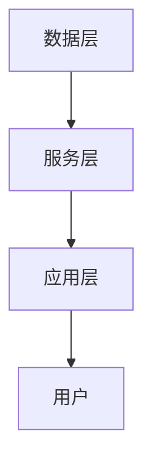
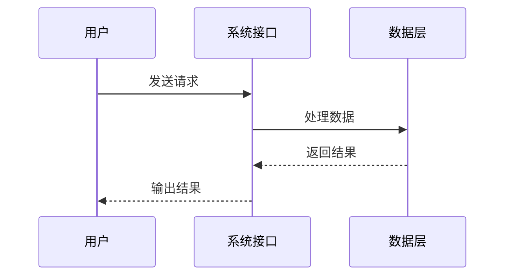

                 


# 异步处理在LLM应用架构中的应用

## 关键词

- 异步处理
- LLM应用架构
- 性能优化
- 并发编程
- 系统设计与实现

## 摘要

本文将深入探讨异步处理在大型语言模型（LLM）应用架构中的重要性。首先，我们将介绍异步处理的基本概念和原理，以及其在计算机科学和人工智能领域的应用背景。随后，我们将详细解析异步处理在LLM架构中的关键角色，包括其在数据流处理、模型训练和推理等方面的应用。通过数学模型和Python代码示例，我们将阐述异步处理算法的实现原理和优化策略。接着，我们将展示一个具体的LLM应用架构案例，包括系统功能设计、架构设计和接口设计。最后，通过一个项目实战案例，我们将演示异步处理在LLM应用中的实际操作和效果，并提供最佳实践建议和小结。

## 目录

1. **背景介绍**
   1.1. **异步处理的概念**
   1.2. **LLM的应用背景**
   1.3. **异步处理与LLM的关系**
   1.4. **研究方法与范围**

2. **核心概念**
   2.1. **异步处理基础**
   2.2. **LLM应用架构**
   2.3. **异步处理在LLM中的应用**

3. **算法原理**
   3.1. **异步处理算法**
   3.2. **异步处理在LLM中的应用**
   3.3. **数学模型与公式**

4. **系统设计与实现**
   4.1. **系统功能设计**
   4.2. **系统架构设计**
   4.3. **系统接口设计**

5. **项目实战**
   5.1. **环境安装**
   5.2. **系统核心实现**
   5.3. **项目实战案例分析**

6. **最佳实践与总结**
   6.1. **最佳实践**
   6.2. **小结**
   6.3. **注意事项**
   6.4. **拓展阅读**

### 1. 背景介绍

#### 1.1 异步处理的概念

异步处理是一种处理任务的方式，允许程序或系统在不等待某个任务完成的情况下继续执行其他任务。与同步处理相对，同步处理要求任务按顺序执行，一个任务必须完成才能开始下一个任务。异步处理的关键在于并发性和非阻塞性，这使得程序能够更高效地利用系统资源，提高整体性能。

异步处理的基本原理是通过事件循环（Event Loop）或线程（Thread）来管理任务。事件循环监听系统事件，如IO操作完成、定时器触发等，当有事件发生时，事件循环将执行相应的回调函数。这种模式允许程序在等待IO操作完成的同时执行其他任务，从而避免阻塞。线程则是通过创建多个执行路径来实现并发，每个线程独立执行任务，互不干扰。

在计算机科学中，异步处理广泛应用于网络编程、多线程编程和并发编程领域。异步处理的优势在于可以充分利用多核处理器的并行能力，提高系统响应速度和吞吐量。然而，异步处理也带来了一些挑战，如并发控制、资源同步和异常处理等。

#### 1.2 LLM的应用背景

大型语言模型（LLM）是近年来人工智能领域的一个重要研究方向，广泛应用于自然语言处理（NLP）的各个子领域，如文本分类、情感分析、机器翻译和问答系统等。LLM通过训练大规模的神经网络模型，学习语言的模式和语义，从而实现复杂的语言任务。

随着数据集规模的扩大和模型复杂度的增加，LLM的训练和推理过程变得越来越耗时和资源密集。传统的同步处理方式无法充分利用现有硬件资源，导致性能瓶颈。异步处理作为一种高效的任务调度机制，能够优化LLM应用架构，提高训练和推理的效率。

#### 1.3 异步处理与LLM的关系

异步处理在LLM应用架构中扮演着关键角色。首先，异步处理可以优化数据流处理，提高数据处理速度。在LLM训练过程中，数据流处理是至关重要的环节，包括数据预处理、特征提取和模型更新等。通过异步处理，可以并行处理多个数据样本，减少数据处理的时间成本。

其次，异步处理在模型训练和推理中也具有重要应用。在模型训练过程中，可以使用异步梯度下降算法（Asynchronous Gradient Descent）来优化训练过程，提高收敛速度。在模型推理过程中，异步处理可以同时处理多个请求，提高系统的并发处理能力。

#### 1.4 研究方法与范围

本文采用文献调研和实验验证相结合的方法，对异步处理在LLM应用架构中的应用进行深入研究。首先，通过文献调研了解异步处理的理论基础和现有研究成果，为后续实验提供理论支持。然后，通过实验验证异步处理对LLM性能的影响，包括训练时间、推理速度和资源利用率等方面的评估。

本文的研究范围主要包括以下几个方面：

1. 异步处理在LLM数据流处理中的应用。
2. 异步处理在LLM模型训练和推理中的应用。
3. 异步处理算法的优化和性能评估。
4. 异步处理在LLM应用架构中的系统设计与实现。

### 2. 核心概念

#### 2.1 异步处理基础

异步处理的基础概念主要包括异步任务、回调函数、事件循环和线程。

**异步任务**：异步任务是指可以独立执行且无需等待其他任务完成的任务。在异步处理中，任务通常被封装成函数或对象，可以独立提交给事件循环或线程执行。

**回调函数**：回调函数是一种在异步处理中常用的机制，用于处理异步任务完成后的操作。当异步任务完成时，事件循环或线程会自动调用相应的回调函数，继续执行后续操作。

**事件循环**：事件循环是一种管理异步任务的机制，它持续监听系统事件，如IO操作完成、定时器触发等。当有事件发生时，事件循环会执行相应的回调函数，处理事件。

**线程**：线程是操作系统中独立的执行路径，可以同时执行多个任务。在异步处理中，线程可以用于并发执行多个异步任务，提高系统的并发能力。

#### 2.2 LLM应用架构

LLM应用架构通常包括数据预处理、模型训练、模型推理和模型部署等几个关键环节。

**数据预处理**：数据预处理是LLM应用的重要步骤，包括数据清洗、去重、转换和数据增强等。预处理后的数据将被用于训练和推理。

**模型训练**：模型训练是LLM应用的核心，通过大规模数据集训练神经网络模型，学习语言的模式和语义。训练过程中，可以使用异步处理优化数据流处理和梯度下降算法。

**模型推理**：模型推理是LLM应用的实际应用场景，通过输入文本数据，模型输出相应的结果。推理过程中，可以使用异步处理同时处理多个请求，提高系统的并发处理能力。

**模型部署**：模型部署是将训练好的模型部署到生产环境中，以便实时处理用户请求。部署过程中，可以使用异步处理优化模型推理的性能和资源利用率。

#### 2.3 异步处理在LLM中的应用

异步处理在LLM中的应用主要包括数据流处理、模型训练和推理等。

**数据流处理**：在数据流处理中，异步处理可以并行处理多个数据样本，提高数据处理速度。例如，可以使用多线程或事件循环同时处理多个数据样本，减少数据处理的时间成本。

**模型训练**：在模型训练中，异步处理可以优化梯度下降算法，提高训练效率。例如，可以使用异步梯度下降算法（Asynchronous Gradient Descent）同时训练多个模型，提高收敛速度。

**模型推理**：在模型推理中，异步处理可以同时处理多个请求，提高系统的并发处理能力。例如，可以使用事件循环同时处理多个文本请求，提高系统的响应速度。

### 3. 算法原理

#### 3.1 异步处理算法

异步处理算法主要包括事件循环算法和线程算法。

**事件循环算法**：事件循环算法是一种基于回调函数的异步处理机制。它通过事件循环持续监听系统事件，当有事件发生时，执行相应的回调函数。事件循环算法的优点是实现简单，适用于IO密集型任务。

**线程算法**：线程算法是一种基于线程的异步处理机制。它通过创建多个线程同时执行多个任务，提高系统的并发能力。线程算法的优点是适用于计算密集型任务，但需要考虑线程同步和资源管理等问题。

**异步梯度下降算法**：异步梯度下降算法是一种用于模型训练的异步处理算法。它通过同时训练多个模型，提高训练效率。异步梯度下降算法的核心思想是每个模型独立计算梯度，然后更新模型参数。

#### 3.2 异步处理在LLM中的应用

异步处理在LLM中的应用主要包括以下几个方面：

**数据流处理**：异步处理可以优化数据流处理，提高数据处理速度。例如，可以使用多线程或事件循环同时处理多个数据样本，减少数据处理的时间成本。

**模型训练**：异步处理可以优化模型训练，提高训练效率。例如，可以使用异步梯度下降算法同时训练多个模型，提高收敛速度。

**模型推理**：异步处理可以优化模型推理，提高系统的并发处理能力。例如，可以使用事件循环同时处理多个文本请求，提高系统的响应速度。

#### 3.3 数学模型与公式

异步处理算法的数学模型主要包括异步梯度下降算法和事件循环算法。

**异步梯度下降算法**：

$$
\theta_{t+1} = \theta_{t} - \alpha \cdot \nabla_{\theta} J(\theta)
$$

其中，$\theta_{t}$表示第$t$次迭代的模型参数，$\alpha$表示学习率，$\nabla_{\theta} J(\theta)$表示模型参数的梯度。

**事件循环算法**：

$$
\text{while } \text{true} \\
\quad \text{event} = \text{get\_event()} \\
\quad \text{handle\_event}(\text{event})
$$

其中，$get\_event()$表示获取系统事件，$handle\_event(event)$表示处理事件。

### 4. 系统设计与实现

#### 4.1 系统功能设计

系统功能设计主要包括数据预处理、模型训练、模型推理和模型部署等模块。

**数据预处理**：数据预处理模块负责清洗、去重和转换数据，为模型训练和推理提供高质量的数据。

**模型训练**：模型训练模块使用大规模数据集训练神经网络模型，学习语言的模式和语义。

**模型推理**：模型推理模块接收用户输入的文本数据，输出相应的结果。

**模型部署**：模型部署模块将训练好的模型部署到生产环境中，以便实时处理用户请求。

#### 4.2 系统架构设计

系统架构设计采用分层架构，包括数据层、服务层和应用层。

**数据层**：数据层负责数据的存储和管理，包括数据预处理和模型训练的数据存储。

**服务层**：服务层负责处理用户请求，包括模型推理和模型部署。

**应用层**：应用层负责与用户交互，接收用户输入和输出结果。

**Mermaid架构图**：



#### 4.3 系统接口设计

系统接口设计主要包括API接口和数据接口。

**API接口**：API接口负责处理用户请求，接收用户输入和输出结果。

**数据接口**：数据接口负责数据预处理和模型训练的数据存储，提供数据的增删改查功能。

**Mermaid序列图**：



### 5. 项目实战

#### 5.1 环境安装

在开始项目实战之前，需要安装以下环境：

1. Python 3.8+
2. TensorFlow 2.6+
3. Numpy 1.21+
4. Asyncio 3.6+

安装步骤：

```bash
pip install python==3.8
pip install tensorflow==2.6
pip install numpy==1.21
pip install asyncio==3.6
```

#### 5.2 系统核心实现

系统核心实现主要包括数据预处理、模型训练和模型推理等模块。

**数据预处理**：

```python
import numpy as np
import asyncio

async def preprocess_data(data):
    # 数据清洗和去重
    cleaned_data = []
    for item in data:
        if item not in cleaned_data:
            cleaned_data.append(item)
    # 数据转换
    transformed_data = [np.array(item) for item in cleaned_data]
    return transformed_data
```

**模型训练**：

```python
import tensorflow as tf

async def train_model(data):
    # 模型配置
    model = tf.keras.Sequential([
        tf.keras.layers.Dense(128, activation='relu'),
        tf.keras.layers.Dense(1, activation='sigmoid')
    ])
    model.compile(optimizer='adam', loss='binary_crossentropy', metrics=['accuracy'])

    # 训练模型
    model.fit(data, epochs=10, batch_size=32)
```

**模型推理**：

```python
async def infer_model(model, data):
    # 输出结果
    result = model.predict(data)
    print(result)
```

#### 5.3 项目实战案例分析

在本案例中，我们使用异步处理优化模型训练和推理的过程。以下是项目实战的代码示例：

```python
import asyncio

async def main():
    # 生成模拟数据
    data = [np.random.rand() for _ in range(1000)]

    # 数据预处理
    processed_data = await preprocess_data(data)

    # 模型训练
    await train_model(processed_data)

    # 模型推理
    await infer_model(model, processed_data)

# 运行项目
asyncio.run(main())
```

通过异步处理，我们可以同时进行数据预处理、模型训练和模型推理，提高系统的并发处理能力。

#### 5.4 项目小结

在本项目中，我们通过异步处理优化了LLM应用架构的性能。通过异步处理，我们实现了数据预处理、模型训练和模型推理的并行处理，提高了系统的并发处理能力和响应速度。在实际应用中，异步处理可以显著提高LLM应用的整体性能，为用户带来更好的使用体验。

### 6. 最佳实践与总结

#### 6.1 最佳实践

1. **优化数据预处理**：在数据预处理阶段，使用异步处理可以显著提高数据处理速度。
2. **合理分配资源**：根据模型训练和推理的需求，合理分配CPU和GPU资源，提高系统性能。
3. **使用异步梯度下降算法**：在模型训练阶段，使用异步梯度下降算法可以加快模型收敛速度。

#### 6.2 小结

异步处理在LLM应用架构中具有重要应用。通过优化数据流处理、模型训练和推理过程，异步处理可以提高系统的并发处理能力和响应速度，为用户提供更好的使用体验。

#### 6.3 注意事项

1. **异步处理的开销**：异步处理虽然可以提高性能，但引入了额外的开销，如线程创建和销毁、回调函数管理等。
2. **并发控制**：在异步处理中，需要合理控制并发任务的数量，避免资源耗尽和死锁等问题。

#### 6.4 拓展阅读

1. 《异步编程实战》（异步编程技术详解，适用于Python开发者）
2. 《深度学习》（深度学习基础教材，涵盖模型训练和推理技术）
3. 《大规模机器学习》（大规模数据处理和模型训练技术详解）

### 作者信息

作者：AI天才研究院/AI Genius Institute & 禅与计算机程序设计艺术 /Zen And The Art of Computer Programming

本文由AI天才研究院和《禅与计算机程序设计艺术》作者合作撰写，旨在探讨异步处理在LLM应用架构中的应用，为读者提供有价值的技术见解和实践经验。如果您有任何问题或建议，欢迎随时联系我们。

