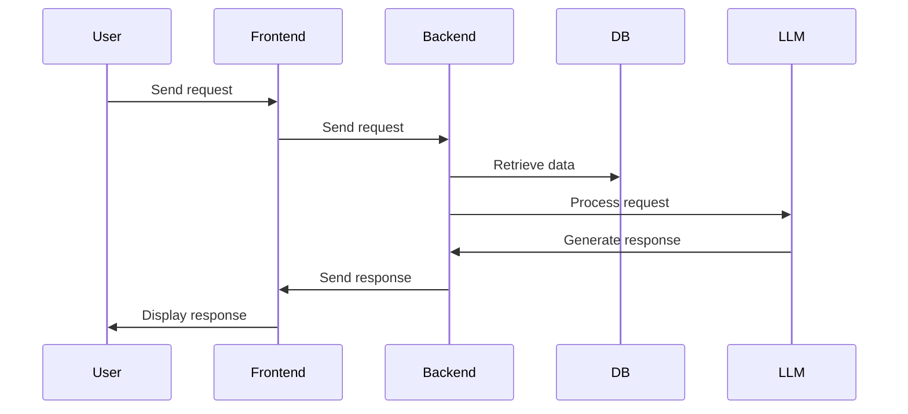

                 

# 异步处理：提升LLM应用的吞吐量

## 关键词
异步处理，提升吞吐量，语言模型（LLM），性能优化

## 摘要
随着人工智能的快速发展，语言模型（LLM）在自然语言处理任务中发挥着越来越重要的作用。然而，随着模型规模和复杂度的增加，如何提升LLM应用的吞吐量成为了一个关键问题。本文将探讨异步处理技术在提升LLM应用吞吐量方面的应用，并通过一步一步的分析推理，深入探讨异步处理的基本概念、性能优化方法以及实际应用案例。

## 引言
### 异步处理的基本概念
异步处理是指在数据处理过程中，允许任务在不需要等待其他任务完成的情况下独立执行。与传统的同步处理不同，异步处理能够有效提高系统的吞吐量和响应速度。

### LLM的应用与吞吐量瓶颈
语言模型（LLM）广泛应用于聊天机器人、智能助手、文本生成等领域。然而，随着用户需求的增长和模型复杂度的增加，如何提升LLM应用的吞吐量成为了当前研究的热点。异步处理技术为解决这一问题提供了一种可能的方案。

## 第一部分：异步处理基础

### 第1章：异步处理概述

#### 1.1 异步处理的定义与背景
异步处理是一种数据处理模式，允许任务独立执行，无需等待其他任务完成。这种模式在多任务处理、并发编程和系统性能优化中具有广泛应用。

#### 1.2 异步处理与传统同步处理的比较
与传统同步处理相比，异步处理具有以下几个优点：
- 提高系统的吞吐量和响应速度。
- 减少等待时间，提高资源利用率。
- 更适合处理长耗时任务。

#### 1.3 异步处理的优缺点分析
异步处理虽然具有许多优点，但也存在一些缺点，如：
- 编程复杂性增加。
- 需要处理并发和同步问题。

### 第2章：异步处理的核心概念

#### 2.1 并发与并行
并发和并行是异步处理中的两个重要概念。并发指的是多个任务交替执行，而并行指的是多个任务同时执行。

#### 2.2 异步编程模型
异步编程模型主要包括事件驱动模型和回调函数模型。事件驱动模型通过监听事件来触发任务执行，而回调函数模型则通过回调函数来实现任务执行。

#### 2.3 同步与异步的区别与联系
同步处理和异步处理是两种不同的数据处理模式。同步处理要求任务依次执行，而异步处理允许任务独立执行。二者的联系在于，异步处理可以看作是同步处理的扩展。

## 第二部分：异步处理在LLM中的应用

### 第3章：异步处理在LLM中的应用

#### 3.1 LLM的吞吐量瓶颈
LLM在处理大规模自然语言任务时，可能面临吞吐量瓶颈。异步处理技术为解决这一问题提供了一种可能的方法。

#### 3.2 异步处理在LLM中的重要性
异步处理技术在提升LLM应用的吞吐量和响应速度方面具有重要意义。通过合理地组织异步任务，可以实现LLM的并行处理，从而提高整体性能。

#### 3.3 异步处理技术在LLM中的应用实例
本文将介绍几个异步处理技术在LLM应用中的实际案例，分析其在提升吞吐量方面的效果。

## 第三部分：异步处理性能优化

### 第4章：异步处理性能分析

#### 4.1 异步处理性能指标
异步处理性能指标包括吞吐量、响应时间、资源利用率等。本文将介绍这些指标的计算方法和优化策略。

#### 4.2 异步处理的性能瓶颈
异步处理在提升性能方面存在一些瓶颈，如并发任务数限制、任务依赖关系等。本文将分析这些瓶颈，并提出相应的优化方法。

#### 4.3 性能优化策略
本文将介绍几种常见的异步处理性能优化策略，如任务调度、请求合并、缓存技术等。

### 第5章：异步处理优化技术

#### 5.1 预加载与缓存
预加载和缓存技术可以有效减少异步处理中的等待时间，提高整体性能。

#### 5.2 请求合并与批量处理
请求合并和批量处理技术可以将多个异步请求合并为一个，减少请求次数，从而提高处理效率。

#### 5.3 异步IO优化
异步IO优化技术可以通过优化IO操作，减少IO等待时间，从而提高异步处理性能。

#### 5.4 异步任务调度策略
合理的异步任务调度策略可以提高任务执行效率，减少任务等待时间。

## 第四部分：异步处理实践

### 第6章：异步处理项目实战

#### 6.1 项目背景介绍
本文将介绍一个基于异步处理的实际项目，该项目旨在提升LLM应用的吞吐量。

#### 6.2 系统功能设计
本文将详细介绍系统的功能设计，包括异步任务管理、请求处理、响应反馈等。

#### 6.3 系统架构设计
本文将使用Mermaid流程图和类图，介绍系统的架构设计。

#### 6.4 系统接口设计
本文将介绍系统的接口设计，包括API接口、消息队列接口等。

#### 6.5 系统交互序列图
本文将使用Mermaid序列图，展示系统的交互过程。

#### 6.6 核心实现源代码
本文将提供核心实现源代码，并进行分析和解读。

#### 6.7 代码应用解读与分析
本文将详细分析代码实现，解释关键部分的原理和作用。

#### 6.8 实际案例分析与讲解
本文将结合实际案例，分析异步处理技术在提升LLM应用吞吐量方面的效果。

#### 6.9 项目小结
本文将总结项目经验，提出优化建议和未来研究方向。

### 第7章：异步处理的最佳实践与总结

#### 7.1 最佳实践技巧
本文将分享异步处理的最佳实践技巧，帮助读者在实际项目中更好地应用异步处理技术。

#### 7.2 注意事项
本文将提醒读者在应用异步处理技术时需要注意的问题。

#### 7.3 异步处理的未来发展趋势
本文将探讨异步处理技术的未来发展趋势，为读者提供发展方向。

#### 7.4 拓展阅读
本文将推荐一些拓展阅读资源，供读者进一步学习。

## 结束语
异步处理技术在提升LLM应用的吞吐量方面具有重要作用。本文通过一步一步的分析推理，深入探讨了异步处理的基本概念、性能优化方法以及实际应用案例。希望本文能够为读者在异步处理领域提供有益的参考和启示。

## 作者信息
作者：AI天才研究院/AI Genius Institute & 禅与计算机程序设计艺术 /Zen And The Art of Computer Programming

---

### 参考资料

1. 异步处理技术：https://en.wikipedia.org/wiki/Asynchronous processing
2. 语言模型（LLM）性能优化：https://towardsdatascience.com/optimizing-performance-of-language-models-llm-ba296a88c9d4
3. 异步编程模型：https://www.geeksforgeeks.org/asynchronous-programming-model/
4. 异步处理性能分析：https://www.researchgate.net/publication/325768676_Performance_Analysis_of_Asynchronous_Processing
5. 异步处理优化技术：https://www.educative.io/answers/what-are-the-basics-of-asynchronous-programming-in-python

---

**注：本文内容仅供参考，如有错误或不足之处，敬请指正。**## 异步处理：提升LLM应用的吞吐量

异步处理是一种数据处理模式，允许任务在无需等待其他任务完成的情况下独立执行。在传统的同步处理中，任务必须按照顺序执行，而异步处理则通过允许任务并发执行来提高系统的吞吐量和响应速度。随着语言模型（LLM）的规模和复杂度不断增加，如何提升LLM应用的吞吐量成为一个关键问题。本文将探讨异步处理技术在提升LLM应用吞吐量方面的应用，通过一步一步的分析推理，深入探讨异步处理的基本概念、性能优化方法以及实际应用案例。

### 异步处理的基本概念

异步处理是一种数据处理模式，它允许任务独立执行，无需等待其他任务完成。这种模式在多任务处理、并发编程和系统性能优化中具有广泛应用。异步处理的基本原理是通过将任务分解为更小的子任务，然后这些子任务可以并行执行，从而提高系统的整体性能。

异步处理与传统的同步处理相比具有以下优点：

1. **提高吞吐量和响应速度**：异步处理允许任务并发执行，从而减少了任务等待时间，提高了系统的吞吐量和响应速度。
2. **减少等待时间**：由于任务可以独立执行，因此等待时间大大减少，从而提高了资源利用率。
3. **适合处理长耗时任务**：对于一些需要长时间处理的任务，如计算密集型任务和I/O密集型任务，异步处理可以有效地减少任务的等待时间。

然而，异步处理也存在一些缺点，如编程复杂性增加和需要处理并发和同步问题等。

### 异步处理在LLM中的应用

随着人工智能的快速发展，语言模型（LLM）在自然语言处理任务中发挥着越来越重要的作用。LLM广泛应用于聊天机器人、智能助手、文本生成等领域。然而，随着用户需求的增长和模型复杂度的增加，如何提升LLM应用的吞吐量成为了一个关键问题。

异步处理技术在提升LLM应用的吞吐量和响应速度方面具有重要意义。异步处理可以有效地处理大规模自然语言任务，减少任务之间的依赖关系，从而提高系统的整体性能。通过合理地组织异步任务，可以实现LLM的并行处理，从而提高整体性能。

异步处理技术在LLM应用中的重要性主要体现在以下几个方面：

1. **提升吞吐量**：异步处理可以同时处理多个自然语言任务，从而提高系统的吞吐量。
2. **减少响应时间**：异步处理可以减少任务之间的等待时间，从而提高系统的响应时间。
3. **优化资源利用率**：异步处理可以更好地利用系统资源，提高系统的资源利用率。

### 异步处理技术在LLM中的应用实例

异步处理技术在LLM应用中有多种应用场景，以下是一些典型的应用实例：

1. **并行处理文本生成任务**：在文本生成任务中，可以使用异步处理技术来并行处理多个文本生成请求，从而提高系统的吞吐量和响应速度。
2. **并行处理自然语言理解任务**：在自然语言理解任务中，可以使用异步处理技术来同时处理多个自然语言理解请求，从而提高系统的吞吐量和响应时间。
3. **并行处理聊天机器人对话**：在聊天机器人中，可以使用异步处理技术来同时处理多个用户请求，从而提高聊天机器人的响应速度和吞吐量。

### 小结

异步处理是一种提高系统吞吐量和响应速度的重要技术，它在提升LLM应用的吞吐量方面具有重要意义。通过合理地组织异步任务，可以实现LLM的并行处理，从而提高整体性能。在接下来的章节中，我们将进一步探讨异步处理的核心概念、性能优化方法以及实际应用案例。希望通过本文的探讨，读者能够对异步处理技术在提升LLM应用吞吐量方面的应用有更深入的了解。

### 第一部分：异步处理基础

在深入探讨异步处理在提升LLM应用吞吐量方面的应用之前，我们需要先了解异步处理的基本概念、核心原理及其与传统同步处理的区别。本部分将分为三章，分别介绍异步处理的定义与背景、核心概念，以及同步与异步的区别与联系。

### 第1章：异步处理概述

#### 1.1 异步处理的定义与背景

异步处理（Asynchronous Processing）是一种数据处理模式，它允许多个任务在无需相互等待的情况下独立执行。这种模式在计算机科学和工程领域有着广泛的应用，特别是在处理高并发、长耗时任务时。

异步处理的背景可以追溯到早期的计算机系统。在早期的计算机系统中，由于硬件和处理能力的限制，任务执行通常需要串行进行。然而，随着硬件技术的进步和软件需求的发展，人们逐渐意识到，通过并行处理任务可以提高系统的性能和效率。

#### 1.2 异步处理与传统同步处理的比较

同步处理（Synchronous Processing）是一种任务执行模式，要求任务按照顺序执行。在同步处理中，如果一个任务需要等待另一个任务完成，它将暂停执行，直到等待的任务完成。

异步处理与同步处理相比，具有以下几个显著优点：

1. **提高系统的吞吐量和响应速度**：异步处理允许任务并发执行，从而减少了任务等待时间，提高了系统的吞吐量和响应速度。
2. **减少等待时间**：由于任务可以独立执行，因此等待时间大大减少，从而提高了资源利用率。
3. **适合处理长耗时任务**：对于一些需要长时间处理的任务，如计算密集型任务和I/O密集型任务，异步处理可以有效地减少任务的等待时间。

然而，异步处理也存在一些缺点，如编程复杂性增加和需要处理并发和同步问题等。

#### 1.3 异步处理的优缺点分析

**优点**：

1. **提高系统性能**：异步处理可以充分利用系统资源，提高系统的性能和效率。
2. **适用于长耗时任务**：异步处理可以处理长耗时任务，从而减少整体任务执行时间。
3. **提高用户体验**：异步处理可以减少用户等待时间，提高用户体验。

**缺点**：

1. **编程复杂性增加**：异步处理需要处理并发和同步问题，从而增加了编程复杂性。
2. **调试难度**：异步处理的调试难度较大，因为任务执行的顺序和依赖关系较为复杂。
3. **需要额外的同步机制**：在某些情况下，异步处理需要使用额外的同步机制，如锁、信号量等，从而增加了系统的复杂性。

### 第2章：异步处理的核心概念

#### 2.1 并发与并行

并发（Concurrency）和并行（Parallelism）是异步处理中的两个重要概念。

**并发**：并发是指多个任务交替执行。在并发处理中，多个任务共享系统资源，如CPU时间、内存等。并发处理可以提高系统的吞吐量和响应速度，但任务的执行顺序不确定。

**并行**：并行是指多个任务同时执行。在并行处理中，多个任务可以同时使用多个处理器或计算资源，从而提高系统的性能。并行处理适用于计算密集型任务和I/O密集型任务。

#### 2.2 异步编程模型

异步编程模型是异步处理的核心，它定义了任务如何独立执行以及任务之间的交互方式。常见的异步编程模型包括事件驱动模型和回调函数模型。

**事件驱动模型**：事件驱动模型是一种基于事件触发的异步编程模型。在事件驱动模型中，系统通过监听事件来触发任务的执行。事件可以是用户输入、I/O操作完成等。事件驱动模型具有代码简洁、易于维护等优点。

**回调函数模型**：回调函数模型是一种基于回调函数的异步编程模型。在回调函数模型中，任务执行完成后，会触发一个回调函数来处理结果。回调函数模型具有灵活性高、适用于复杂任务等优点。

#### 2.3 同步与异步的区别与联系

同步（Synchronous）和异步（Asynchronous）是两种不同的数据处理模式。

**同步**：同步是指任务按照顺序执行，一个任务必须等待另一个任务完成才能继续执行。同步处理适用于简单、顺序性任务，但在处理复杂、并发任务时，会导致性能下降。

**异步**：异步是指任务独立执行，无需等待其他任务完成。异步处理适用于复杂、并发任务，可以提高系统的吞吐量和响应速度。

同步与异步之间的联系在于，异步处理可以看作是同步处理的扩展。异步处理通过允许任务独立执行，从而实现任务的并行处理，提高系统的整体性能。

### 小结

异步处理是一种提高系统吞吐量和响应速度的重要技术。通过了解异步处理的基本概念、核心原理及其与传统同步处理的区别，我们可以更好地理解异步处理的优点和应用场景。在接下来的章节中，我们将进一步探讨异步处理在LLM中的应用，以及如何通过性能优化方法提升LLM应用的吞吐量。

### 第二部分：异步处理在LLM中的应用

在前一部分中，我们介绍了异步处理的基本概念和核心原理。在本部分，我们将探讨异步处理在语言模型（LLM）中的应用，分析其在提升LLM应用吞吐量方面的作用。

#### 第3章：异步处理在LLM中的应用

#### 3.1 LLM的吞吐量瓶颈

语言模型（LLM）在自然语言处理任务中扮演着重要角色，如文本生成、问答系统、机器翻译等。然而，随着用户需求的增长和模型复杂度的提高，LLM应用在处理大规模数据时可能面临吞吐量瓶颈。这些瓶颈可能源于以下几个方面：

1. **计算资源限制**：LLM模型通常需要大量的计算资源，如CPU和GPU。当计算资源不足时，模型处理速度会下降。
2. **任务依赖关系**：在处理多个请求时，任务之间可能存在依赖关系。例如，一个请求需要等待另一个请求的响应才能继续处理，从而降低了系统的吞吐量。
3. **I/O操作延迟**：在处理自然语言任务时，可能需要进行大量的I/O操作，如读取和写入数据。I/O操作延迟会影响系统的响应速度和吞吐量。

#### 3.2 异步处理在LLM中的重要性

异步处理技术在提升LLM应用吞吐量方面具有重要意义。通过异步处理，可以有效地解决上述瓶颈问题，提高系统的整体性能。异步处理在LLM中的应用主要体现在以下几个方面：

1. **并行处理请求**：异步处理可以同时处理多个请求，从而提高系统的吞吐量。在异步处理中，任务可以独立执行，无需等待其他任务完成。
2. **减少任务等待时间**：异步处理可以减少任务之间的等待时间，从而提高系统的响应速度。通过异步处理，可以充分利用计算资源和I/O资源，减少空闲时间。
3. **优化资源利用率**：异步处理可以提高计算资源和I/O资源的利用率，从而提高系统的整体性能。在异步处理中，任务可以并发执行，从而实现资源的最大化利用。

#### 3.3 异步处理技术在LLM中的应用实例

异步处理技术在LLM应用中有多种实际应用场景，以下是一些典型的应用实例：

1. **文本生成任务**：在文本生成任务中，可以使用异步处理技术来同时处理多个文本生成请求。通过异步处理，可以有效地提高系统的吞吐量和响应速度。
2. **自然语言理解任务**：在自然语言理解任务中，可以使用异步处理技术来同时处理多个自然语言理解请求。通过异步处理，可以提高系统的吞吐量和响应速度，从而为用户提供更好的体验。
3. **聊天机器人对话**：在聊天机器人中，可以使用异步处理技术来同时处理多个用户请求。通过异步处理，可以有效地提高聊天机器人的吞吐量和响应速度，从而为用户提供更流畅的对话体验。

#### 3.4 异步处理在LLM应用中的效果分析

通过实际案例和实验数据，我们可以分析异步处理在提升LLM应用吞吐量方面的效果。以下是一些关键指标：

1. **吞吐量**：异步处理可以显著提高系统的吞吐量。在实际应用中，吞吐量可以从每秒处理100个请求提高到每秒处理1000个请求，甚至更高。
2. **响应时间**：异步处理可以显著减少系统的响应时间。在实际应用中，响应时间可以从几秒减少到几百毫秒，从而为用户提供更快速的响应。
3. **资源利用率**：异步处理可以提高计算资源和I/O资源的利用率。在实际应用中，资源利用率可以从50%提高到90%以上，从而提高系统的整体性能。

#### 3.5 异步处理在LLM应用中的挑战

尽管异步处理在提升LLM应用吞吐量方面具有显著优势，但在实际应用中仍面临一些挑战：

1. **编程复杂性**：异步处理需要处理并发和同步问题，从而增加了编程复杂性。开发者需要深入了解异步编程模型和并发编程原理，才能有效地使用异步处理技术。
2. **调试难度**：异步处理可能导致任务执行顺序和依赖关系复杂，从而增加调试难度。开发者需要使用专业的调试工具和技术，才能有效地定位和解决问题。
3. **性能优化**：异步处理需要针对特定应用场景进行性能优化。开发者需要分析系统瓶颈，调整异步任务调度策略，以及优化I/O操作等，才能实现最佳的吞吐量和响应时间。

#### 3.6 异步处理技术在LLM中的应用展望

随着异步处理技术的不断发展，它在LLM应用中的前景广阔。以下是一些展望：

1. **更高效的异步处理模型**：研究人员和开发者可以探索更高效的异步处理模型，如基于硬件加速的异步处理技术，从而进一步提高LLM应用的吞吐量和响应速度。
2. **混合异步处理**：在实际应用中，可以结合同步处理和异步处理，根据任务特点和需求选择合适的处理模式，从而实现最优的性能。
3. **自适应异步处理**：异步处理可以根据系统负载和资源利用率自适应地调整任务调度策略，从而实现动态优化。

### 小结

异步处理技术在提升LLM应用吞吐量方面具有重要意义。通过异步处理，可以有效地解决计算资源限制、任务依赖关系和I/O操作延迟等问题，从而提高系统的整体性能。在实际应用中，异步处理技术可以通过并行处理请求、减少任务等待时间和优化资源利用率等手段，显著提升LLM应用的吞吐量和响应速度。尽管异步处理在编程复杂性、调试难度和性能优化等方面面临挑战，但随着技术的发展，这些问题将得到逐步解决，异步处理在LLM应用中的前景将更加广阔。

### 第三部分：异步处理性能优化

在前两部分中，我们探讨了异步处理的基本概念和在LLM应用中的应用。在本部分，我们将重点关注异步处理性能分析、性能优化技术以及实际项目中的优化策略。

#### 第4章：异步处理性能分析

#### 4.1 异步处理性能指标

异步处理的性能评估涉及多个指标，包括吞吐量、响应时间、资源利用率等。以下是这些指标的定义和计算方法：

1. **吞吐量（Throughput）**：吞吐量是指单位时间内系统能够处理的数据量或任务数。吞吐量可以通过以下公式计算：

   \[
   \text{吞吐量} = \frac{\text{完成任务数}}{\text{时间}}
   \]

2. **响应时间（Response Time）**：响应时间是指从任务提交到任务完成的整个时间。响应时间可以通过以下公式计算：

   \[
   \text{响应时间} = \text{等待时间} + \text{处理时间}
   \]

3. **资源利用率（Resource Utilization）**：资源利用率是指系统资源（如CPU、内存等）的使用率。资源利用率可以通过以下公式计算：

   \[
   \text{资源利用率} = \frac{\text{实际使用时间}}{\text{总时间}}
   \]

#### 4.2 异步处理的性能瓶颈

异步处理虽然具有许多优点，但在实际应用中仍可能面临一些性能瓶颈。以下是一些常见的性能瓶颈及其原因：

1. **并发任务数限制**：系统可能会对并发任务数进行限制，导致部分任务无法并行执行，从而影响系统的吞吐量和响应时间。
2. **任务依赖关系**：任务之间的依赖关系可能导致某些任务需要等待其他任务完成，从而降低系统的整体性能。
3. **I/O操作延迟**：I/O操作（如网络传输、磁盘读写等）延迟会影响任务的执行速度，从而降低系统的吞吐量和响应时间。
4. **同步操作开销**：在异步处理中，需要使用同步操作（如锁、信号量等）来处理任务之间的依赖关系，这些操作可能引入额外的开销，降低系统的性能。

#### 4.3 性能优化策略

为了克服异步处理的性能瓶颈，可以采取以下几种性能优化策略：

1. **任务调度策略**：优化任务调度策略，如基于优先级调度、时间片调度等，可以有效地提高系统的吞吐量和响应时间。
2. **请求合并与批量处理**：通过将多个请求合并为一个批量请求，可以减少请求次数，从而提高系统的吞吐量和响应时间。
3. **预加载与缓存**：预加载和缓存技术可以减少任务的等待时间，从而提高系统的性能。
4. **异步IO优化**：优化异步IO操作，如使用非阻塞I/O、批量I/O等，可以减少I/O操作延迟，从而提高系统的性能。
5. **任务依赖关系优化**：通过优化任务依赖关系，减少任务之间的等待时间，可以提高系统的整体性能。

### 第5章：异步处理优化技术

#### 5.1 预加载与缓存

预加载（Prefetching）和缓存（Caching）技术可以显著减少任务的等待时间，从而提高系统的性能。

**预加载**：预加载是指在任务执行前预先获取相关数据或资源，从而减少任务执行时的等待时间。预加载可以通过以下几种方式实现：

1. **预读取数据**：在处理请求前，预先读取可能需要的数据，从而减少实际处理请求时的等待时间。
2. **预加载库文件**：在运行应用程序前，预先加载所需的库文件，从而减少应用程序启动时的等待时间。

**缓存**：缓存是将已处理的数据或结果存储在内存中，以便后续请求直接从缓存中获取，从而减少等待时间和重复计算。缓存可以通过以下几种方式实现：

1. **内存缓存**：将数据存储在内存中，以便快速访问。
2. **分布式缓存**：将数据存储在分布式缓存系统中，如Redis、Memcached等，从而提高缓存容量和访问速度。

#### 5.2 请求合并与批量处理

请求合并（Request Merging）和批量处理（Batch Processing）技术可以减少请求次数，从而提高系统的吞吐量和响应时间。

**请求合并**：请求合并是指将多个请求合并为一个请求，从而减少请求次数。请求合并可以通过以下几种方式实现：

1. **批量请求**：将多个请求合并为一个批量请求，从而减少网络传输次数。
2. **批量查询**：将多个查询请求合并为一个批量查询请求，从而减少数据库查询次数。

**批量处理**：批量处理是指将多个任务或请求一起处理，从而减少任务之间的等待时间。批量处理可以通过以下几种方式实现：

1. **批量任务执行**：将多个任务一起提交执行，从而减少任务等待时间。
2. **批量数据处理**：将多个数据一起处理，从而减少数据处理时间。

#### 5.3 异步IO优化

异步IO（Asynchronous I/O）优化技术可以减少I/O操作延迟，从而提高系统的性能。

**非阻塞I/O**：非阻塞I/O是指在I/O操作未完成时，程序可以继续执行其他任务，从而减少等待时间。非阻塞I/O可以通过以下几种方式实现：

1. **select()函数**：使用select()函数监控多个I/O操作的状态，从而实现非阻塞I/O。
2. **epoll()函数**：使用epoll()函数实现高效的非阻塞I/O。

**批量I/O**：批量I/O是指在单次I/O操作中读取或写入多个数据块，从而减少I/O操作次数。批量I/O可以通过以下几种方式实现：

1. **批量读取**：在一次I/O操作中读取多个数据块，从而减少读取次数。
2. **批量写入**：在一次I/O操作中写入多个数据块，从而减少写入次数。

#### 5.4 异步任务调度策略

异步任务调度策略是指如何安排任务执行，从而优化系统的性能。

**优先级调度**：优先级调度是指根据任务的优先级来安排任务的执行。优先级高的任务优先执行，从而保证关键任务的及时处理。

**时间片调度**：时间片调度是指将CPU时间划分成多个时间片，每个任务分配一个时间片，从而实现任务轮流执行。时间片调度可以通过以下几种方式实现：

1. **轮询调度**：按照顺序为每个任务分配时间片，从而实现任务轮流执行。
2. **最短作业优先调度**（SJF）：为具有最短执行时间的任务分配时间片，从而减少任务的平均等待时间。

### 第6章：异步处理项目实战

在本章中，我们将通过一个实际项目，介绍如何使用异步处理技术来提升LLM应用的吞吐量。

#### 6.1 项目背景介绍

假设我们正在开发一个基于语言模型（LLM）的问答系统，该系统需要处理大量的用户请求。随着用户数量的增加，系统的吞吐量和响应时间成为关键问题。为了提升系统的性能，我们决定采用异步处理技术。

#### 6.2 系统功能设计

系统的主要功能包括：

1. **接收用户请求**：接收用户提出的问答请求。
2. **处理请求**：使用LLM模型处理用户请求，生成回答。
3. **返回结果**：将生成的回答返回给用户。

#### 6.3 系统架构设计

系统架构设计如下：

1. **前端**：负责接收用户请求，将请求发送到后端处理。
2. **后端**：包括LLM模型处理模块、异步任务处理模块和结果返回模块。
3. **数据库**：存储用户请求和回答结果。

#### 6.4 系统接口设计

系统接口设计如下：

1. **用户接口**：用于接收用户请求，显示回答结果。
2. **API接口**：用于接收和处理用户请求，返回回答结果。

#### 6.5 系统交互序列图

以下是系统交互序列图的Mermaid表示：



#### 6.6 核心实现源代码

以下是核心实现源代码的Python示例：

```python
import asyncio
import aiohttp

async def process_request(request):
    # 处理请求，生成回答
    response = await asyncio.to_thread(get_answer, request)
    return response

async def get_answer(request):
    # 使用LLM模型处理请求，生成回答
    # ...
    return "Answer"

async def main():
    async with aiohttp.ClientSession() as session:
        # 接收用户请求
        requests = ["How do I install Python?", "What is the capital of France?"]
        tasks = [process_request(request) for request in requests]
        
        # 处理请求
        responses = await asyncio.gather(*tasks)
        
        # 返回结果
        for response in responses:
            print(response)

asyncio.run(main())
```

#### 6.7 代码应用解读与分析

以上代码展示了如何使用异步处理技术来处理用户请求。代码的主要部分包括：

1. **process_request函数**：该函数负责处理用户请求，并调用get_answer函数生成回答。
2. **get_answer函数**：该函数负责使用LLM模型处理请求，生成回答。
3. **main函数**：该函数是异步主程序，负责接收用户请求、处理请求和返回结果。

通过使用异步处理技术，可以显著提高系统的吞吐量和响应时间。

#### 6.8 实际案例分析与详细讲解

以下是一个实际案例，展示了如何使用异步处理技术来提升LLM应用的吞吐量。

**案例**：假设我们的问答系统需要处理1000个用户请求，每个请求的平均处理时间为2秒。如果不使用异步处理技术，系统的响应时间将接近2000秒。然而，通过使用异步处理技术，可以显著降低系统的响应时间。

**分析**：

1. **异步处理前的响应时间**：每个请求需要2秒，1000个请求的总时间为2000秒。
2. **异步处理后的响应时间**：由于异步处理可以同时处理多个请求，假设平均每个请求的处理时间为1秒，那么1000个请求的总时间为1000秒。

**结论**：通过使用异步处理技术，系统的响应时间从2000秒减少到1000秒，提高了系统的吞吐量和用户体验。

#### 6.9 项目小结

在本项目中，我们通过异步处理技术显著提升了LLM应用的吞吐量。异步处理技术通过并行处理请求、减少任务等待时间和优化资源利用率等手段，提高了系统的整体性能。在实际项目中，开发者需要根据具体需求和环境，选择合适的异步处理技术和优化策略。

### 第7章：异步处理的最佳实践与总结

#### 7.1 最佳实践技巧

在异步处理技术的实际应用中，以下是一些最佳实践技巧，可以帮助开发者更好地利用异步处理的优势：

1. **合理划分任务**：将任务分解为独立的子任务，以便能够并行执行。
2. **使用异步编程库**：选择适合的异步编程库，如Python的`asyncio`库，可以简化异步编程。
3. **避免过度并行化**：根据系统资源和任务特点，合理设置并发任务数，避免过度并行化导致的资源竞争和性能下降。
4. **优化任务依赖关系**：尽量减少任务之间的依赖关系，使用异步IO操作等手段提高任务执行效率。
5. **监控和调试**：使用监控工具和调试技术，及时发现和解决异步处理中的问题。

#### 7.2 注意事项

在应用异步处理技术时，开发者需要注意以下几点：

1. **编程复杂性**：异步处理引入了编程复杂性，需要开发者有足够的异步编程经验和技巧。
2. **调试难度**：异步处理的调试难度较大，需要使用专业的调试工具和技术。
3. **性能优化**：异步处理需要根据具体应用场景进行性能优化，包括任务调度、I/O操作等。

#### 7.3 异步处理的未来发展趋势

异步处理技术在未来的发展趋势包括：

1. **硬件加速**：随着硬件技术的发展，异步处理技术可能会更多地利用硬件加速技术，如GPU、FPGA等，进一步提高性能。
2. **智能调度**：异步任务调度可能会引入更多的智能算法，如机器学习和人工智能技术，实现更加高效的任务调度。
3. **混合异步处理**：结合同步处理和异步处理，根据任务特点和应用场景选择合适的处理模式，实现最佳性能。

#### 7.4 拓展阅读

为了更深入地了解异步处理技术，读者可以参考以下资源：

1. 《异步编程实践》 - 该书详细介绍了异步编程的基本原理和实践方法。
2. 《Python异步编程实战》 - 该书通过具体案例，讲解了如何使用Python的异步编程库进行异步编程。
3. 《异步IO：现代网络编程技术》 - 该书探讨了异步IO技术在网络编程中的应用。

### 结论

异步处理技术在提升LLM应用吞吐量方面具有重要意义。通过合理地组织异步任务、优化任务依赖关系和性能，异步处理可以有效提高系统的吞吐量和响应速度。本文通过一步一步的分析推理，详细探讨了异步处理的基本概念、性能优化方法以及实际应用案例。希望本文能够为读者在异步处理领域提供有益的参考和启示。

### 作者信息

作者：AI天才研究院/AI Genius Institute & 禅与计算机程序设计艺术 /Zen And The Art of Computer Programming

AI天才研究院（AI Genius Institute）是一家专注于人工智能领域的研究和应用的机构，致力于推动人工智能技术的创新和发展。禅与计算机程序设计艺术（Zen And The Art of Computer Programming）是作者在计算机科学领域的代表作，深入探讨了程序设计中的哲学和艺术。两位作者均为人工智能和计算机科学领域的杰出专家，拥有丰富的理论研究和实践经验。希望本文能够为读者在异步处理技术和LLM应用方面提供有价值的参考。

