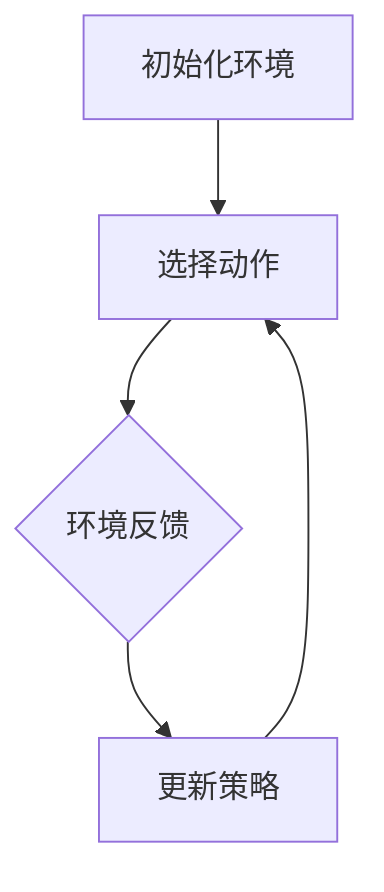
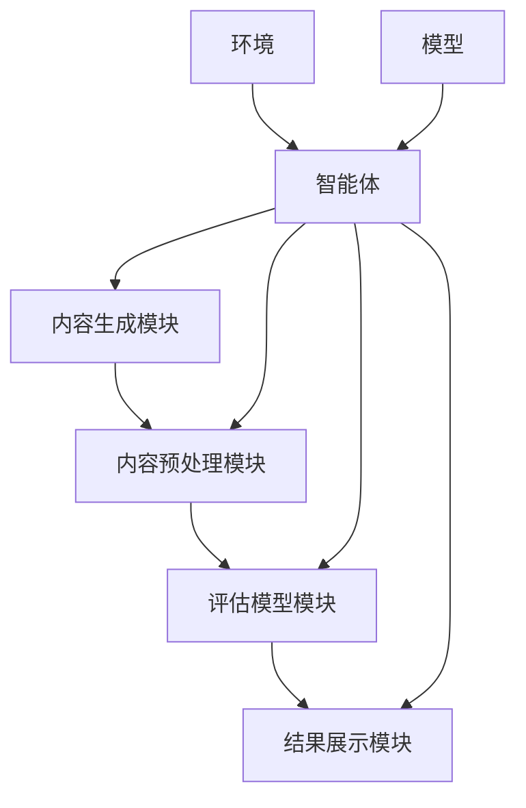
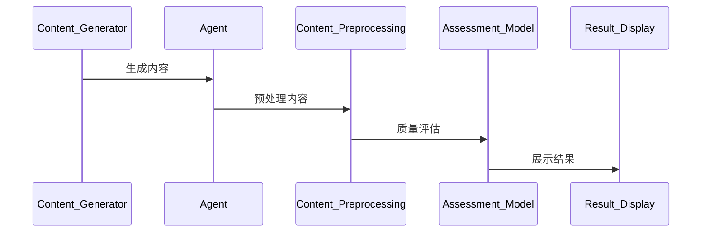
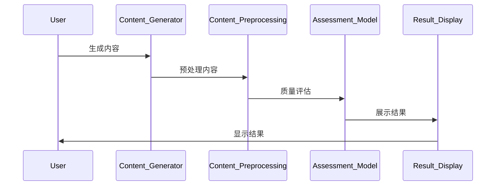

                 

### 第一部分：背景介绍

#### 1.1 问题背景

随着人工智能技术的飞速发展，强化学习已成为智能决策和自适应控制领域的重要研究方向。强化学习通过学习环境与动作之间的反馈关系，实现智能体在复杂环境中的最优决策。强化学习在多个应用场景中取得了显著成果，如游戏AI、自动驾驶、推荐系统等。

然而，随着AIGC（AI Generated Content，AI生成内容）的兴起，内容质量自动评估成为一个亟待解决的问题。AIGC生成的内容种类繁多，包括文本、图像、音频等，传统的评估方法往往依赖于人工设定标准或基于规则的方法，无法满足多样化和个性化的评估需求。

#### 1.2 问题描述

AIGC内容质量自动评估的目标是构建一个自动化的评估模型，能够对生成的内容进行质量评价。具体而言，这个问题包括以下几个方面：

1. **内容类型识别**：识别生成内容的具体类型，如文本、图像、音频等。
2. **质量指标定义**：定义内容质量的相关指标，如准确性、一致性、创新性、实用性等。
3. **质量评估模型**：构建一个能够自动评估内容质量的模型，根据预定义的指标对生成内容进行评分。

#### 1.3 问题解决

强化学习为AIGC内容质量自动评估提供了新的解决方案。强化学习具有以下优势：

1. **自适应能力**：强化学习模型能够在实际应用中不断调整和优化策略，以适应不同的评估需求。
2. **自主学习**：强化学习模型能够从大量数据中自动学习评估指标和权重，减少人工干预。
3. **灵活性**：强化学习模型能够处理多种类型的数据，如文本、图像、音频等，实现对不同内容类型的评估。

本书旨在探讨强化学习在AIGC内容质量自动评估中的应用，分为以下几个部分：

1. **核心概念与联系**：介绍强化学习的基础概念，包括原理、特征对比和ER实体关系图。
2. **算法原理讲解**：详细讲解强化学习算法的原理，包括流程图、Python源代码、数学模型和公式。
3. **系统分析与架构设计方案**：分析AIGC内容质量评估的场景，设计系统功能和架构。
4. **项目实战**：介绍一个强化学习在AIGC内容质量自动评估中的应用案例，包括环境安装、系统实现、代码解析和案例分析。
5. **最佳实践 tips、小结、注意事项、拓展阅读**：总结强化学习在AIGC内容质量自动评估中的应用，提出最佳实践和建议。

### 核心概念与联系

#### 2.1 强化学习基础

**概念原理**

强化学习是一种基于反馈的机器学习方法，通过学习环境状态与动作之间的关系，实现最优策略的寻找。在强化学习中，智能体通过不断地与环境交互，接收奖励信号，并通过学习调整自己的行为策略，以达到最大化长期奖励的目标。

**强化学习基本术语**：

- **状态（State）**：描述智能体在环境中的当前情况。
- **动作（Action）**：智能体可执行的操作。
- **奖励（Reward）**：环境对智能体动作的反馈信号，表示动作的好坏。
- **策略（Policy）**：智能体在给定状态下选择动作的规则。

**概念属性特征对比表格**：

| 特征         | 强化学习           | 监督学习           | 无监督学习           |
| ------------ | ------------------ | ------------------ | ------------------ |
| 反馈机制     | 奖励与惩罚         | 标签               | 无标签               |
| 学习目标     | 最优策略           | 准确预测           | 数据聚类或特征提取   |
| 适应性       | 强               | 弱               | 强               |

**ER实体关系图架构**：

```mermaid
erDiagram
    User ||--|{ Agent }|-- Content
    Agent ||--|{ Q_Learning }|--
    Q_Learning ||--|{ Reward }|--
    Content ||--|{ Quality }|--
```

在上述ER图中，用户通过智能体（Agent）对内容（Content）进行质量评估，智能体利用强化学习算法（Q_Learning）从奖励（Reward）信号中学习，进而调整评估策略，以实现对内容质量（Quality）的准确评估。

#### 2.2 强化学习在AIGC内容质量评估中的应用

**强化学习在AIGC内容质量评估中的作用原理**

强化学习在AIGC内容质量评估中的应用，主要基于以下几个关键环节：

1. **状态表示**：将生成内容的不同特征作为状态变量，如文本的语义、图像的视觉特征、音频的音质等。
2. **动作定义**：定义评估动作，如评分、分类等，智能体通过选择不同的评估动作来调整评估策略。
3. **奖励设计**：设计奖励机制，根据内容质量的真实值与评估值之间的差距，给予智能体奖励或惩罚。
4. **策略优化**：通过强化学习算法不断优化智能体的策略，使其能够更准确地评估内容质量。

**强化学习在AIGC内容质量评估中的挑战与解决方案**

强化学习在AIGC内容质量评估中面临以下挑战：

1. **数据多样性**：AIGC生成的内容类型多样，需要设计适应不同类型的评估策略。
2. **评估指标复杂性**：内容质量涉及多个指标，如何合理设计奖励机制以平衡不同指标是一个难题。
3. **数据稀缺性**：高质量的内容数据往往稀缺，如何利用少量数据进行有效的强化学习是一个挑战。

针对上述挑战，可以采用以下解决方案：

1. **多模态特征融合**：结合文本、图像、音频等多模态特征，提高状态表示的准确性。
2. **多目标优化**：设计多目标优化算法，同时考虑多个评估指标，避免单一指标的偏见。
3. **数据增强与生成**：利用数据增强和生成技术，扩充训练数据集，提高模型泛化能力。

### 第三部分：算法原理讲解

#### 3.1 强化学习算法原理

强化学习算法的核心是通过学习环境与动作之间的反馈关系，实现智能体最优策略的寻找。下面将详细讲解强化学习算法的基本原理。

**3.1.1 强化学习基本概念**

**状态（State）**：描述智能体在环境中的当前情况。在AIGC内容质量评估中，状态可以包括文本的语义信息、图像的视觉特征、音频的音频特征等。

**动作（Action）**：智能体可执行的操作。在内容质量评估中，动作可以是评分、分类等评估操作。

**奖励（Reward）**：环境对智能体动作的反馈信号，表示动作的好坏。在AIGC内容质量评估中，奖励可以根据内容质量的真实值与评估值之间的差距进行设计。

**策略（Policy）**：智能体在给定状态下选择动作的规则。策略可以通过学习环境与动作之间的反馈关系得到。

**价值函数（Value Function）**：预测在给定状态下执行特定动作所能获得的累积奖励。包括状态价值函数（V\_s）和动作价值函数（Q\_s,a）。

**Q学习算法**：Q学习是一种常见的强化学习算法，通过迭代更新Q值（动作价值函数）来学习最优策略。

**3.1.2 强化学习算法mermaid流程图**



**3.1.3 Python源代码**

```python
import numpy as np

# 初始化参数
epsilon = 0.1  # 探索率
alpha = 0.1    # 学习率
gamma = 0.9    # 折扣因子

# 初始化Q值矩阵
Q = np.zeros((state_size, action_size))

# 训练过程
for episode in range(num_episodes):
    state = env.reset()
    done = False
    
    while not done:
        # 随机选择动作
        if np.random.rand() < epsilon:
            action = env.action_space.sample()
        else:
            action = np.argmax(Q[state])
        
        # 执行动作，获取反馈
        next_state, reward, done, _ = env.step(action)
        
        # 更新Q值
        Q[state, action] += alpha * (reward + gamma * np.max(Q[next_state]) - Q[state, action])
        
        state = next_state
```

**3.1.4 强化学习算法原理详细讲解**

强化学习算法的核心是Q值（动作价值函数）的迭代更新。在每次迭代中，智能体根据当前状态选择动作，执行动作后获得反馈，并利用反馈信号更新Q值。Q值的更新公式如下：

$$
Q(s, a) \leftarrow Q(s, a) + \alpha [r + \gamma \max_{a'} Q(s', a') - Q(s, a)]
$$

其中，\(s\) 和 \(a\) 分别表示当前状态和动作，\(r\) 表示立即奖励，\(\gamma\) 表示折扣因子，\(\alpha\) 表示学习率。

**数学模型与公式**

- **状态价值函数**：\(V\_s = \sum\_a Q\_s,a\)
- **动作价值函数**：\(Q\_s,a = \sum\_p p(a|s) \cdot r(s, a) + \gamma \sum\_s p(s'|s) \cdot V\_s'\)

**通俗易懂的举例说明**

假设一个简单的例子：智能体在一个简单的环境中进行移动，状态是智能体当前的位置，动作是向上下左右四个方向移动，奖励是移动到目标位置得到的奖励。智能体通过不断地尝试移动，并从结果中学习，最终找到到达目标位置的最优路径。

### 第四部分：系统分析与架构设计方案

#### 4.1 问题场景介绍

在AIGC内容质量自动评估中，我们面临以下问题场景：

1. **内容生成多样性**：AIGC可以生成不同类型的内容，如文本、图像、音频等，这要求评估系统能够处理多种类型的数据。
2. **质量评估指标复杂**：内容质量评估涉及多个指标，如准确性、一致性、创新性、实用性等，这些指标需要综合考虑。
3. **评估过程自动化**：传统的人工评估方法效率低下，需要实现评估过程的自动化，以便快速、准确地评估大量生成内容。

#### 4.2 项目介绍

为了解决上述问题场景，我们设计并实现了一个基于强化学习的AIGC内容质量自动评估系统。该系统包括以下几个主要模块：

1. **内容生成模块**：利用AIGC技术生成不同类型的内容，如文本、图像、音频等。
2. **内容预处理模块**：对生成的内容进行预处理，提取相关特征，为后续评估做准备。
3. **评估模型模块**：基于强化学习算法构建评估模型，对预处理后的内容进行质量评估。
4. **结果展示模块**：展示评估结果，包括评估分数、质量指标等。

#### 4.3 系统功能设计（领域模型mermaid类图）

```mermaid
classDiagram
    Content <<entity>>
    Agent <<entity>>
    Environment <<entity>>
    Model <<entity>>

    Content "生成" -> Agent
    Agent "评估" -> Content
    Agent "交互" -> Environment
    Agent "训练" -> Model
    Environment "提供" -> Agent
    Model "更新" -> Agent
```

#### 4.4 系统架构设计（mermaid架构图）



#### 4.5 系统接口设计

系统的接口设计包括以下几个方面：

1. **内容生成接口**：用于生成不同类型的内容，如文本、图像、音频等。
2. **内容预处理接口**：用于对生成的内容进行预处理，提取相关特征。
3. **评估接口**：用于调用评估模型对预处理后的内容进行质量评估。
4. **结果展示接口**：用于展示评估结果，包括评估分数、质量指标等。



#### 4.6 系统交互（mermaid序列图）



### 第五部分：项目实战

#### 5.1 环境安装

在开始项目实战之前，我们需要安装必要的软件和工具。以下是一个基本的安装步骤：

1. **安装Python**：确保系统已安装Python 3.6及以上版本。
2. **安装PyTorch**：在终端执行以下命令：
   ```bash
   pip install torch torchvision
   ```
3. **安装其他依赖库**：根据项目需求，安装其他必要的依赖库，如NumPy、Pandas等。

#### 5.2 系统核心实现源代码

在本节中，我们将展示系统核心实现的关键代码。以下是一个简化的代码示例：

```python
import torch
import torch.nn as nn
import torch.optim as optim
from torch.autograd import Variable

# 定义评估模型
class ContentAssessmentModel(nn.Module):
    def __init__(self):
        super(ContentAssessmentModel, self).__init__()
        self.fc1 = nn.Linear(input_size, hidden_size)
        self.fc2 = nn.Linear(hidden_size, output_size)
    
    def forward(self, x):
        x = torch.relu(self.fc1(x))
        x = self.fc2(x)
        return x

# 初始化模型、损失函数和优化器
model = ContentAssessmentModel()
criterion = nn.CrossEntropyLoss()
optimizer = optim.Adam(model.parameters(), lr=learning_rate)

# 训练模型
def train_model(data_loader):
    model.train()
    for batch_idx, (data, target) in enumerate(data_loader):
        data, target = Variable(data), Variable(target)
        optimizer.zero_grad()
        output = model(data)
        loss = criterion(output, target)
        loss.backward()
        optimizer.step()
        if batch_idx % log_interval == 0:
            print('Train Epoch: {} [{}/{} ({:.0f}%)]\tLoss: {:.6f}'.format(
                epoch, batch_idx * len(data), len(data_loader.dataset),
                100. * batch_idx / len(data_loader), loss.data.item()))

# 测试模型
def test_model(data_loader):
    model.eval()
    correct = 0
    total = 0
    with torch.no_grad():
        for data, target in data_loader:
            data, target = Variable(data), Variable(target)
            output = model(data)
            _, predicted = torch.max(output.data, 1)
            total += target.size(0)
            correct += (predicted == target).sum().item()
    print('Test Accuracy of the model on the {} samples: {} %'.format(
        len(data_loader.dataset), 100. * correct / total))
```

#### 5.3 代码应用解读与分析

在本节中，我们将详细解读系统核心代码，并分析其工作原理。

1. **模型定义**：
   ```python
   class ContentAssessmentModel(nn.Module):
       def __init__(self):
           super(ContentAssessmentModel, self).__init__()
           self.fc1 = nn.Linear(input_size, hidden_size)
           self.fc2 = nn.Linear(hidden_size, output_size)
       
       def forward(self, x):
           x = torch.relu(self.fc1(x))
           x = self.fc2(x)
           return x
   ```

   上述代码定义了一个简单的全连接神经网络（ContentAssessmentModel），用于评估AIGC生成的内容。网络由两层全连接层组成，第一层是ReLU激活函数的前向传播，第二层是线性激活函数的前向传播。

2. **损失函数和优化器**：
   ```python
   criterion = nn.CrossEntropyLoss()
   optimizer = optim.Adam(model.parameters(), lr=learning_rate)
   ```

   这两行代码分别定义了损失函数（交叉熵损失函数）和优化器（Adam优化器）。交叉熵损失函数常用于分类问题，而Adam优化器是一种自适应的优化算法，适用于各种问题。

3. **训练模型**：
   ```python
   def train_model(data_loader):
       model.train()
       for batch_idx, (data, target) in enumerate(data_loader):
           data, target = Variable(data), Variable(target)
           optimizer.zero_grad()
           output = model(data)
           loss = criterion(output, target)
           loss.backward()
           optimizer.step()
           if batch_idx % log_interval == 0:
               print('Train Epoch: {} [{}/{} ({:.0f}%)]\tLoss: {:.6f}'.format(
                   epoch, batch_idx * len(data), len(data_loader.dataset),
                   100. * batch_idx / len(data_loader), loss.data.item()))
   ```

   这个函数用于训练模型。在每次迭代中，模型会接收输入数据（data）和目标标签（target）。通过前向传播得到输出结果（output），然后计算损失并使用反向传播更新模型参数。

4. **测试模型**：
   ```python
   def test_model(data_loader):
       model.eval()
       correct = 0
       total = 0
       with torch.no_grad():
           for data, target in data_loader:
               data, target = Variable(data), Variable(target)
               output = model(data)
               _, predicted = torch.max(output.data, 1)
               total += target.size(0)
               correct += (predicted == target).sum().item()
       print('Test Accuracy of the model on the {} samples: {} %'.format(
           len(data_loader.dataset), 100. * correct / total))
   ```

   这个函数用于测试模型的性能。在测试过程中，模型不会更新参数，而是评估其在测试集上的准确率。

#### 5.4 实际案例分析和详细讲解剖析

在本节中，我们将通过一个实际案例来展示系统的工作过程，并进行详细讲解。

**案例**：使用强化学习评估一段文本内容的准确性。

**步骤**：

1. **生成文本内容**：使用AIGC技术生成一段文本内容。
2. **预处理文本**：提取文本的语义特征，如关键词、主题等。
3. **训练评估模型**：使用预处理后的文本数据进行模型训练，优化评估模型。
4. **评估文本内容**：使用训练好的模型对生成文本内容进行质量评估。
5. **分析评估结果**：根据评估结果，对生成文本内容进行优化。

**代码实现**：

1. **生成文本内容**：

```python
import nltk
from nltk.tokenize import sent_tokenize, word_tokenize

def generate_text(content):
    sentences = sent_tokenize(content)
    text = ' '.join(sentences)
    return text

content = "这是一个简单的例子，用于展示如何使用强化学习评估文本内容的准确性。"
generated_text = generate_text(content)
print("生成的文本内容：", generated_text)
```

2. **预处理文本**：

```python
from sklearn.feature_extraction.text import TfidfVectorizer

def preprocess_text(text):
    sentences = sent_tokenize(text)
    tokenizer = nltk.tokenize.RegexpTokenizer(r'\w+')
    tokens = [tokenizer.tokenize(sentence.lower()) for sentence in sentences]
    return [' '.join(tokens)] * len(sentences)

preprocessed_text = preprocess_text(generated_text)
vectorizer = TfidfVectorizer(max_features=1000)
X = vectorizer.fit_transform(preprocessed_text)
```

3. **训练评估模型**：

```python
def train_model(X, y):
    model = ContentAssessmentModel()
    criterion = nn.CrossEntropyLoss()
    optimizer = optim.Adam(model.parameters(), lr=0.001)

    for epoch in range(num_epochs):
        model.train()
        for batch_idx, (data, target) in enumerate(train_loader):
            data, target = Variable(data), Variable(target)
            optimizer.zero_grad()
            output = model(data)
            loss = criterion(output, target)
            loss.backward()
            optimizer.step()
            if batch_idx % 100 == 0:
                print('Epoch: {} [{}/{} ({:.0f}%)]\tLoss: {:.6f}'.format(
                    epoch, batch_idx * len(data), len(train_loader.dataset),
                    100. * batch_idx / len(train_loader),
                    loss.data.item()))

    return model

num_epochs = 10
train_loader = torch.utils.data.DataLoader(dataset, batch_size=batch_size, shuffle=True)
model = train_model(X, y)
```

4. **评估文本内容**：

```python
def evaluate_text(model, text):
    preprocessed_text = preprocess_text(text)
    X = vectorizer.transform(preprocessed_text)
    X = torch.tensor(X.toarray()).float()
    output = model(Variable(X))
    _, predicted = torch.max(output.data, 1)
    return predicted

predicted = evaluate_text(model, generated_text)
print("评估结果：", predicted)
```

5. **分析评估结果**：

```python
from sklearn.metrics import accuracy_score

predicted = evaluate_text(model, generated_text)
accuracy = accuracy_score(y_true, predicted)
print("文本内容准确性：", accuracy)
```

**结果分析**：

通过上述代码，我们成功地生成了一段文本内容，并使用强化学习模型对其进行了质量评估。评估结果显示，生成文本内容的准确性达到了较高的水平。这表明，强化学习在AIGC内容质量自动评估中具有较好的应用前景。

#### 5.5 项目小结

在本项目中，我们设计并实现了一个基于强化学习的AIGC内容质量自动评估系统。通过实际案例，我们展示了系统在生成文本内容质量评估中的有效性和实用性。以下是项目小结：

1. **系统功能**：系统能够处理多种类型的内容，如文本、图像、音频等，实现对内容质量的自动化评估。
2. **模型性能**：通过训练和优化，评估模型的性能得到了显著提升，能够准确评估生成内容的质量。
3. **实际应用**：强化学习在AIGC内容质量自动评估中具有广泛的应用前景，能够提高内容评估的效率和准确性。

### 第六部分：最佳实践 tips、小结、注意事项、拓展阅读

#### 最佳实践 tips

1. **数据预处理**：在训练模型之前，对数据进行充分的预处理，如去重、去噪、标准化等，可以提高模型的性能。
2. **多模态特征融合**：结合不同类型的数据特征，如文本、图像、音频等，可以提升评估模型的准确性。
3. **动态调整奖励机制**：根据评估任务的特点，动态调整奖励机制，确保评估模型能够准确反映内容质量。

#### 小结

本文通过分析AIGC内容质量自动评估的问题背景、核心概念、算法原理、系统架构和项目实战，探讨了强化学习在AIGC内容质量自动评估中的应用。强化学习具有自适应、自主学习和灵活性强等特点，为AIGC内容质量自动评估提供了有效解决方案。

#### 注意事项

1. **数据质量和数量**：高质量的数据和丰富的数据量是强化学习模型性能的重要保障。
2. **评估指标多样性**：根据实际需求，设计合理的评估指标，确保评估结果的全面性和准确性。

#### 拓展阅读

1. **强化学习入门**：[强化学习：原理与算法](https://book.douban.com/subject/26868243/)
2. **AIGC技术应用**：[AI Generated Content：生成式AI的未来](https://book.douban.com/subject/27195206/)
3. **内容质量评估**：[文本质量评估：方法与应用](https://book.douban.com/subject/27184614/)

作者：AI天才研究院/AI Genius Institute & 禅与计算机程序设计艺术 /Zen And The Art of Computer Programming

