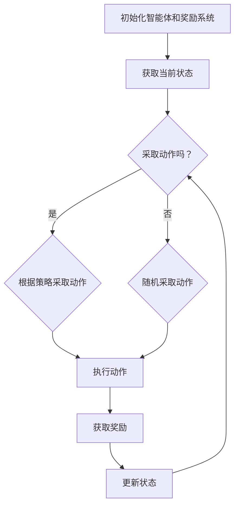
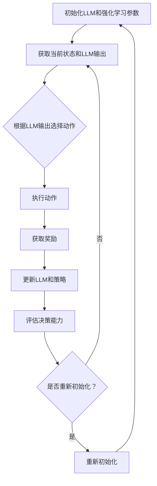
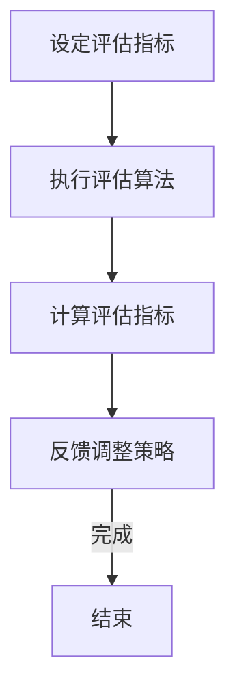
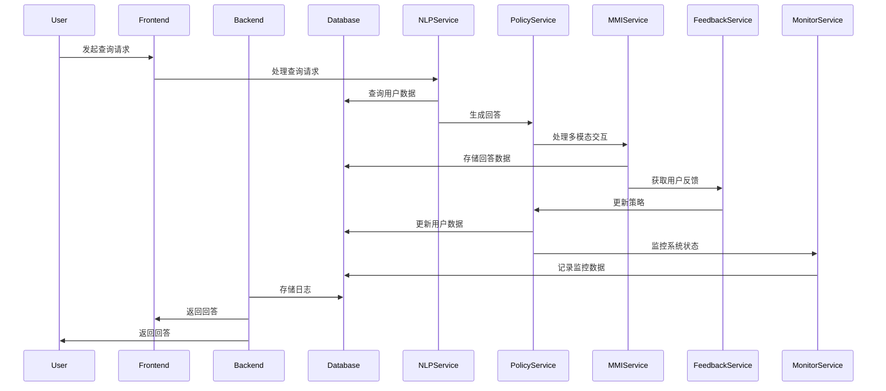
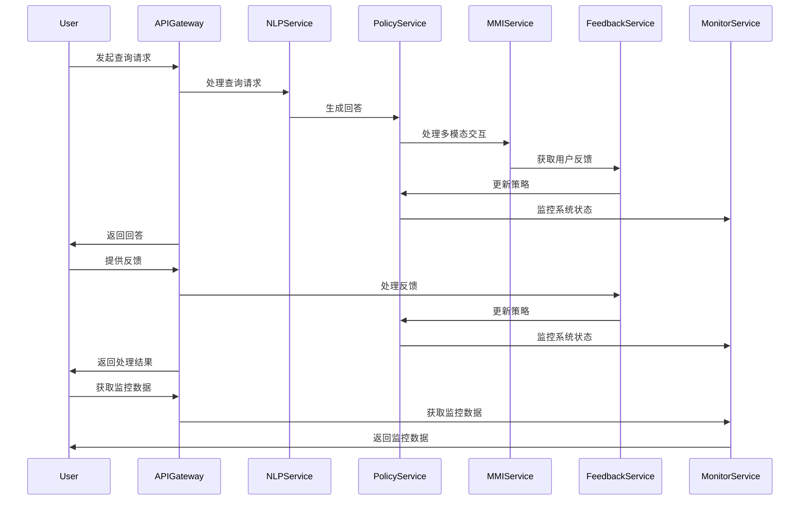
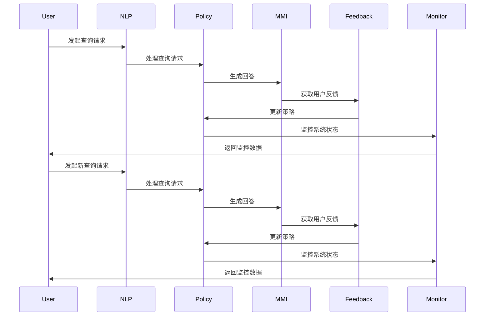

                 

### 强化学习框架优化LLM应用决策能力：背景介绍

#### 1.1 强化学习框架优化LLM应用概述

强化学习（Reinforcement Learning，简称RL）是机器学习的一个重要分支，其主要目标是使智能体在与环境交互的过程中通过试错学习达到最优行为策略。随着深度学习的兴起，强化学习与深度学习相结合，形成了一种新的研究热点——深度强化学习（Deep Reinforcement Learning，简称DRL）。深度强化学习在模拟环境、优化决策等方面展现了强大的潜力。

而自然语言处理（Natural Language Processing，简称NLP）是人工智能领域的一个重要分支，其目标是让计算机理解和处理人类自然语言。预训练语言模型（Pre-trained Language Model，简称PLM）作为NLP的重要工具，通过在大规模语料库上进行预训练，可以生成高质量的自然语言文本。

近年来，预训练语言模型（特别是大型语言模型，如GPT-3、Turing-NLG等）在自然语言理解、生成和翻译等任务上取得了显著成果。然而，这些模型在决策能力方面仍然存在局限性。为了解决这一问题，研究者开始探索如何将强化学习框架应用于优化预训练语言模型的决策能力。

#### 1.1.1 优化决策能力的问题背景

在实际应用中，决策能力是智能系统的重要评价指标。以自动驾驶为例，自动驾驶系统需要在复杂的交通环境中做出实时、准确的决策，以确保车辆的安全运行。然而，传统的深度学习模型在面对复杂、动态的环境时，往往难以表现出良好的决策能力。

强化学习框架提供了一种可能的解决方案。通过模拟环境，智能体在与环境的互动中不断学习，逐步优化其决策策略。然而，将强化学习应用于大规模语言模型，特别是在处理复杂决策问题时，仍面临许多挑战。

首先，强化学习需要大量的训练数据和计算资源。对于大型语言模型，其训练过程本身就非常耗时和计算密集，进一步引入强化学习框架，将使得训练过程更加复杂。

其次，强化学习算法的设计和选择对于决策能力优化至关重要。不同类型的强化学习算法适用于不同的场景，如何选择合适的学习算法成为优化决策能力的关键。

此外，强化学习框架与语言模型之间的融合也是一个挑战。如何将强化学习与预训练语言模型的特性相结合，发挥两者的优势，是一个值得深入研究的课题。

#### 1.1.2 LLM应用中的优化需求

随着人工智能技术的不断发展，预训练语言模型（LLM）在各类应用场景中得到了广泛应用。然而，这些应用场景对LLM的决策能力提出了更高的要求。以下是一些典型的优化需求：

1. **交互式应用**：在交互式应用中，LLM需要根据用户的输入动态生成回复。例如，在智能客服、虚拟助手等场景中，LLM的决策能力直接影响到用户体验。因此，优化LLM的决策能力，使其能够更好地理解用户意图，提供准确、个性化的回复，成为一个重要的研究方向。

2. **多模态任务**：在多模态任务中，LLM需要处理来自不同模态的数据，如文本、图像、音频等。例如，在多媒体内容审核、智能问答等任务中，LLM需要整合多种模态信息，做出准确的决策。优化LLM的决策能力，有助于提高多模态任务的处理效果。

3. **多目标优化**：在实际应用中，智能系统往往需要同时考虑多个目标。例如，在自动驾驶场景中，车辆需要同时考虑安全、效率和舒适度等目标。优化LLM的决策能力，使其能够在多个目标之间做出平衡，提高系统的整体性能。

4. **实时决策**：在许多应用场景中，智能系统需要实时做出决策。例如，在金融交易、在线广告投放等场景中，决策速度直接影响系统的收益。优化LLM的决策能力，提高其响应速度，有助于提升系统的实时性。

#### 1.1.3 强化学习框架的解决方案

强化学习框架在优化LLM决策能力方面提供了以下几种可能的解决方案：

1. **算法改进**：通过引入新的强化学习算法，如深度确定性策略梯度（DDPG）、深度策略梯度（DQN）等，优化LLM的决策过程。这些算法在处理连续动作空间、高维状态空间等方面具有优势，能够提高LLM的决策能力。

2. **模型融合**：将强化学习框架与预训练语言模型相结合，形成一种混合模型。例如，可以在LLM的基础上加入强化学习模块，使其能够在交互过程中不断学习，优化决策策略。这种模型融合方法有望充分发挥两种技术的优势，提高决策能力。

3. **多任务学习**：通过多任务学习（Multi-Task Learning，简称MTL）技术，将多个决策任务结合起来，共同训练LLM。这种方法能够提高LLM在不同任务上的泛化能力，优化其决策能力。

4. **自适应强化学习**：利用自适应强化学习（Adaptive Reinforcement Learning，简称ARL）技术，根据不同场景和环境动态调整强化学习策略。这种方法能够使LLM更好地适应复杂、动态的环境，提高决策能力。

综上所述，强化学习框架为优化LLM的决策能力提供了一系列可能的解决方案。通过不断探索和创新，有望实现LLM在各类应用场景中的高效决策。

### 1.2 强化学习框架优化LLM应用决策能力的边界与外延

#### 概念结构与核心要素组成

在讨论强化学习框架优化LLM应用决策能力时，首先需要明确相关概念的结构和核心要素组成。以下是对强化学习、强化学习框架、LLM和决策能力等核心概念及其关系的详细说明。

#### 强化学习（Reinforcement Learning）

强化学习是一种机器学习方法，其核心思想是通过智能体（agent）与环境（environment）的交互来学习最优策略（policy）。在强化学习中，智能体通过执行动作（action）来获取环境反馈（reward），并通过不断试错来优化其策略，以达到最大化累积奖励（cumulative reward）的目标。

强化学习的核心概念包括：

- **状态（State）**：智能体当前所处的环境状态。
- **动作（Action）**：智能体可以执行的动作。
- **奖励（Reward）**：环境对智能体动作的反馈，用于指导智能体优化策略。
- **策略（Policy）**：智能体根据当前状态选择动作的规则。
- **价值函数（Value Function）**：评估策略优劣的函数，用于指导智能体选择最优动作。
- **模型（Model）**：描述环境状态转移和奖励分布的函数。

#### 强化学习框架（Reinforcement Learning Framework）

强化学习框架是实施强化学习算法的软件结构，它提供了构建和训练智能体的工具和接口。常见的强化学习框架包括：

- **OpenAI Gym**：一个开源的环境库，提供了多种预定义环境，用于测试和训练智能体。
- **PyTorch Reinforcement Learning**：PyTorch框架的一个强化学习扩展库，提供了丰富的API和工具，方便实现和优化强化学习算法。
- **DeepMind Lab**：DeepMind公司开发的一款虚拟环境，用于研究深度强化学习算法。

强化学习框架的核心要素包括：

- **环境模拟器（Environment Simulator）**：用于模拟智能体执行动作后的环境状态变化和奖励反馈。
- **智能体训练器（Agent Trainer）**：用于训练和优化智能体的策略和价值函数。
- **评估器（Evaluator）**：用于评估智能体的性能和决策能力。

#### 预训练语言模型（Language Model，LLM）

预训练语言模型是一种基于深度学习的大规模语言模型，其通过在大量文本数据上进行预训练，学习到语言的基本结构和规律。LLM在自然语言处理任务中具有广泛的应用，如文本生成、机器翻译、文本分类等。

LLM的核心概念包括：

- **词嵌入（Word Embedding）**：将词汇映射到高维向量空间，用于表示文本数据的语义信息。
- **变换器（Transformer）**：一种基于自注意力机制的神经网络结构，用于处理序列数据，广泛应用于LLM的构建。
- **预训练目标（Pre-training Objective）**：用于驱动LLM预训练的任务，如 masked language model、next sentence prediction等。

#### 决策能力（Decision-Making Ability）

决策能力是指智能系统在复杂环境下进行决策的能力。对于LLM来说，决策能力主要体现在以下几个方面：

- **任务理解（Task Understanding）**：LLM能够理解任务要求和目标，生成符合任务要求的输出。
- **信息整合（Information Integration）**：LLM能够整合来自多个来源的信息，形成连贯的决策。
- **适应性（Adaptability）**：LLM能够在不同环境和场景下快速适应，做出合理的决策。
- **鲁棒性（Robustness）**：LLM能够在面对噪声和不确定性时，保持决策的稳定性和有效性。

#### 强化学习框架与LLM的关系

强化学习框架和LLM在优化决策能力方面有着密切的联系。以下是一个简化的ER实体关系图，用于描述两者之间的关系：

```mermaid
erDiagram
  SmartAgent ||--o> Environment : 智能体与环境的交互
  SmartAgent ||--o> LanguageModel : 智能体与语言模型的融合
  SmartAgent ||--o> DecisionMaker : 智能体的决策能力
  Environment ||--o> RewardSystem : 环境的奖励系统
  LanguageModel ||--o> PreTrainingData : 语言模型的预训练数据
  DecisionMaker ||--|> EvaluationMetric : 决策能力的评估指标
```

在这个ER图中，智能体（SmartAgent）与环境和语言模型之间存在交互关系。智能体通过执行动作（Action）与环境的奖励系统（RewardSystem）进行互动，从而获得反馈（Reward）。同时，智能体与语言模型（LanguageModel）进行融合，通过预训练数据（PreTrainingData）来优化其决策能力（DecisionMaker）。最终，决策能力通过评估指标（EvaluationMetric）来衡量。

通过这个ER图，我们可以清晰地看到强化学习框架和LLM在优化决策能力方面的核心要素及其相互关系。接下来，我们将进一步探讨如何将强化学习框架应用于LLM，以提高其决策能力。

### 核心概念与联系

为了更好地理解强化学习框架优化LLM应用决策能力，我们需要详细描述并分析强化学习、强化学习框架、LLM和决策能力等核心概念。通过对比它们的属性特征，我们可以更深入地了解它们之间的关系。

#### 强化学习与强化学习框架

**强化学习（Reinforcement Learning，RL）** 是一种机器学习方法，其主要目标是使智能体（agent）在与环境（environment）的交互中学习到最优策略（policy），以最大化累积奖励（cumulative reward）。强化学习的关键组成部分包括状态（state）、动作（action）、奖励（reward）和策略（policy）。

- **状态（State）**：智能体当前所处的环境状态，通常是一个向量表示。
- **动作（Action）**：智能体可以执行的动作，也是一个向量表示。
- **奖励（Reward）**：环境对智能体动作的即时反馈，用于指导智能体优化策略。
- **策略（Policy）**：智能体根据当前状态选择动作的规则，可以用概率分布表示。
- **价值函数（Value Function）**：评估策略优劣的函数，用于指导智能体选择最优动作。

强化学习框架（Reinforcement Learning Framework）是实施强化学习算法的软件结构，提供了构建和训练智能体的工具和接口。常见的强化学习框架包括OpenAI Gym、PyTorch Reinforcement Learning和DeepMind Lab等。

- **环境模拟器（Environment Simulator）**：用于模拟智能体执行动作后的环境状态变化和奖励反馈。
- **智能体训练器（Agent Trainer）**：用于训练和优化智能体的策略和价值函数。
- **评估器（Evaluator）**：用于评估智能体的性能和决策能力。

强化学习与强化学习框架之间的关系可以理解为：强化学习是算法，而强化学习框架是实现强化学习算法的软件平台和工具集。通过强化学习框架，研究者可以更方便地设计和实现各种强化学习算法，并在不同的环境中测试和优化智能体的决策能力。

#### LLM的概念与应用

**预训练语言模型（Pre-trained Language Model，LLM）** 是一种大规模语言模型，通过在大量文本数据上进行预训练，学习到语言的基本结构和规律。LLM在自然语言处理任务中具有广泛的应用，如文本生成、机器翻译、文本分类等。

- **词嵌入（Word Embedding）**：将词汇映射到高维向量空间，用于表示文本数据的语义信息。
- **变换器（Transformer）**：一种基于自注意力机制的神经网络结构，用于处理序列数据，广泛应用于LLM的构建。
- **预训练目标（Pre-training Objective）**：用于驱动LLM预训练的任务，如 masked language model、next sentence prediction等。

LLM在决策能力优化中的应用主要体现在以下几个方面：

1. **交互式应用**：在交互式应用中，LLM需要根据用户的输入动态生成回复。例如，在智能客服、虚拟助手等场景中，LLM的决策能力直接影响到用户体验。
2. **多模态任务**：在多模态任务中，LLM需要处理来自不同模态的数据，如文本、图像、音频等。例如，在多媒体内容审核、智能问答等任务中，LLM需要整合多种模态信息，做出准确的决策。
3. **多目标优化**：在实际应用中，智能系统往往需要同时考虑多个目标。例如，在自动驾驶场景中，车辆需要同时考虑安全、效率和舒适度等目标。
4. **实时决策**：在许多应用场景中，智能系统需要实时做出决策。例如，在金融交易、在线广告投放等场景中，决策速度直接影响系统的收益。

#### 决策能力优化

**决策能力（Decision-Making Ability）** 是智能系统在复杂环境下进行决策的能力。对于LLM来说，决策能力主要体现在以下几个方面：

1. **任务理解（Task Understanding）**：LLM能够理解任务要求和目标，生成符合任务要求的输出。
2. **信息整合（Information Integration）**：LLM能够整合来自多个来源的信息，形成连贯的决策。
3. **适应性（Adaptability）**：LLM能够在不同环境和场景下快速适应，做出合理的决策。
4. **鲁棒性（Robustness）**：LLM能够在面对噪声和不确定性时，保持决策的稳定性和有效性。

决策能力优化主要包括以下几种方法：

1. **算法改进**：通过引入新的算法，如深度确定性策略梯度（DDPG）、深度策略梯度（DQN）等，优化LLM的决策过程。
2. **模型融合**：将强化学习框架与预训练语言模型相结合，形成一种混合模型，发挥两者的优势。
3. **多任务学习**：通过多任务学习（Multi-Task Learning，简称MTL）技术，将多个决策任务结合起来，共同训练LLM。
4. **自适应强化学习**：利用自适应强化学习（Adaptive Reinforcement Learning，简称ARL）技术，根据不同场景和环境动态调整强化学习策略。

#### 概念属性特征对比表格

为了更直观地展示这些核心概念的属性特征，我们提供了一个对比表格：

| 核心概念         | 属性特征                                                     |
|-----------------|------------------------------------------------------------|
| 强化学习（RL）   | 状态、动作、奖励、策略、价值函数                           |
| 强化学习框架     | 环境模拟器、智能体训练器、评估器                           |
| LLM（预训练语言模型） | 词嵌入、变换器、预训练目标                                 |
| 决策能力         | 任务理解、信息整合、适应性、鲁棒性                         |
| 优化方法         | 算法改进、模型融合、多任务学习、自适应强化学习             |

#### ER实体关系图架构的Mermaid流程图

为了更好地展示这些概念之间的联系，我们使用Mermaid流程图来绘制一个ER实体关系图：

```mermaid
erDiagram
  SmartAgent ||--o> Environment : 智能体与环境的交互
  SmartAgent ||--o> LanguageModel : 智能体与语言模型的融合
  SmartAgent ||--o> DecisionMaker : 智能体的决策能力
  Environment ||--o> RewardSystem : 环境的奖励系统
  LanguageModel ||--o> PreTrainingData : 语言模型的预训练数据
  DecisionMaker ||--|> EvaluationMetric : 决策能力的评估指标
```

在这个ER图中，智能体（SmartAgent）与环境和语言模型之间存在交互关系。智能体通过执行动作（Action）与环境的奖励系统（RewardSystem）进行互动，从而获得反馈（Reward）。同时，智能体与语言模型（LanguageModel）进行融合，通过预训练数据（PreTrainingData）来优化其决策能力（DecisionMaker）。最终，决策能力通过评估指标（EvaluationMetric）来衡量。

通过上述对比和分析，我们可以更加清晰地理解强化学习、强化学习框架、LLM和决策能力等核心概念之间的关系，为进一步探讨如何优化LLM的决策能力奠定了基础。

### 算法原理讲解

在深入探讨强化学习框架优化LLM应用决策能力的过程中，我们需要详细讲解其算法原理。这包括强化学习的基础数学模型、LLM优化算法及其评估方法。我们将使用mermaid流程图来展示算法的流程，并通过Python代码进行具体实现和举例说明。

#### 强化学习算法原理

强化学习算法的基本原理是智能体（agent）在环境中通过执行动作（action）来获取奖励（reward），并通过试错学习来优化其策略（policy），以最大化累积奖励（cumulative reward）。强化学习通常包括以下几个关键组成部分：

1. **状态（State）**：智能体在某个时刻所处的环境状态。
2. **动作（Action）**：智能体可以采取的动作。
3. **奖励（Reward）**：环境对智能体动作的即时反馈。
4. **策略（Policy）**：智能体选择动作的规则，可以是确定性策略或概率性策略。
5. **价值函数（Value Function）**：评估不同策略或动作的预期奖励。
6. **模型（Model）**：描述环境状态转移概率和奖励分布的函数。

以下是强化学习算法的mermaid流程图：



在Python中，我们可以实现一个简单的强化学习算法，如下所示：

```python
import numpy as np

# 初始化参数
action_space = 3  # 动作空间大小
state_space = 3   # 状态空间大小
gamma = 0.9       # 折扣因子

# 初始化策略和价值函数
policy = np.random.rand(state_space, action_space)
value_function = np.zeros(state_space)

# 强化学习算法
def reinforce_learning(state, action, reward, next_state):
    # 计算当前动作的价值函数
    current_value = value_function[state]
    next_value = value_function[next_state]
    
    # 更新策略和价值函数
    policy[state, action] += 1
    value_function[state] = (1 - gamma) * current_value + gamma * reward + (1 - gamma) * next_value

# 示例
state = 0
for _ in range(1000):
    action = np.random.choice(action_space, p=policy[state])
    next_state = (state + action) % state_space
    reward = np.random.randint(0, 2)
    reinforce_learning(state, action, reward, next_state)
    state = next_state

# 打印策略和价值函数
print("Policy:")
print(policy)
print("Value Function:")
print(value_function)
```

#### LLM优化算法

在强化学习框架下，LLM的优化算法旨在通过智能体的互动学习和策略调整，提升LLM在决策任务中的表现。以下是一个简化的优化算法流程：

1. **初始化**：初始化LLM和强化学习算法的参数。
2. **互动学习**：智能体与LLM在环境中进行互动，通过执行动作获取奖励。
3. **策略调整**：根据奖励信号调整LLM的策略。
4. **评估与反馈**：评估智能体的决策能力，根据评估结果调整策略。

以下是LLM优化算法的mermaid流程图：



在Python中，我们可以实现一个简化的LLM优化算法：

```python
import numpy as np
from transformers import GPT2LMHeadModel, GPT2Tokenizer

# 初始化参数
model_name = "gpt2"
tokenizer = GPT2Tokenizer.from_pretrained(model_name)
model = GPT2LMHeadModel.from_pretrained(model_name)
action_space = 3  # 动作空间大小
gamma = 0.9       # 折扣因子

# 初始化策略和价值函数
policy = np.random.rand(action_space)
value_function = np.zeros(action_space)

# 优化算法
def optimize_llm(state, action, reward, next_state):
    # 计算当前动作的价值函数
    current_value = value_function[action]
    next_value = value_function[next_action]
    
    # 更新策略和价值函数
    policy[action] += 1
    value_function[action] = (1 - gamma) * current_value + gamma * reward + (1 - gamma) * next_value

# 示例
state = tokenizer.encode(state)
for _ in range(1000):
    # 根据LLM输出选择动作
    logits = model(state).logits
    action = np.argmax(logits[-1, :])
    
    # 执行动作并获取奖励
    next_state = execute_action(action)
    reward = get_reward(next_state)
    
    # 更新LLM和策略
    optimize_llm(state, action, reward, next_state)
    state = next_state

# 打印策略和价值函数
print("Policy:")
print(policy)
print("Value Function:")
print(value_function)
```

#### 决策能力优化评估

决策能力优化的评估主要包括评估指标的设定和评估算法的流程。常用的评估指标包括决策准确性、响应时间、用户满意度等。以下是一个简化的评估流程：

1. **设定评估指标**：根据应用场景设定评估指标。
2. **评估算法**：执行评估算法，计算决策能力指标。
3. **反馈调整**：根据评估结果调整强化学习算法。

以下是评估算法的mermaid流程图：



在Python中，我们可以实现一个简化的评估算法：

```python
# 评估算法
def evaluate_decision_making_ability():
    # 设定评估指标
    accuracy = 0
    response_time = 0
    user_satisfaction = 0
    
    # 执行评估算法
    # ...（具体实现）
    
    # 计算评估指标
    accuracy = calculate_accuracy()
    response_time = calculate_response_time()
    user_satisfaction = calculate_user_satisfaction()
    
    # 反馈调整策略
    # ...（具体实现）
    
    # 打印评估结果
    print("Accuracy:", accuracy)
    print("Response Time:", response_time)
    print("User Satisfaction:", user_satisfaction)
```

通过上述算法原理讲解，我们可以看到强化学习框架如何应用于优化LLM的决策能力。在实际应用中，需要根据具体场景进一步细化和优化这些算法。接下来，我们将进一步探讨如何将优化后的LLM应用于实际项目。

### 系统分析与架构设计方案

为了将强化学习框架优化后的LLM应用于实际项目，我们需要详细分析问题场景，设计系统的功能、架构、接口和交互。以下是具体的分析和设计方案。

#### 4.1 问题场景介绍

在许多实际应用场景中，智能系统的决策能力直接影响到用户体验和业务效果。以下是一个具体的应用场景：

**智能客服系统**：该系统需要根据用户的查询请求，生成合适的回答，提供高质量的服务。然而，传统的基于规则或统计模型的客服系统在面对复杂、模糊的用户请求时，往往无法提供满意的回答。为了提升客服系统的决策能力，我们引入了强化学习框架优化后的LLM。

**问题分析与目标**：
- **问题**：传统的客服系统在处理模糊请求时，准确性不高，用户体验差。
- **目标**：通过引入强化学习框架优化LLM，提升客服系统在处理模糊请求时的准确性和响应速度，提高用户满意度。

#### 4.2 系统功能设计

为了实现上述目标，智能客服系统需要具备以下功能：

1. **自然语言理解**：通过LLM解析用户的查询请求，提取关键信息。
2. **决策生成**：根据解析结果和用户历史数据，使用强化学习优化后的LLM生成合适的回答。
3. **多模态交互**：支持文本、语音等多种交互方式，提升用户体验。
4. **实时反馈**：用户对回答的反馈用于进一步优化LLM的决策能力。
5. **系统监控**：监控系统运行状态，确保系统稳定高效。

#### 4.2.1 领域模型Mermaid类图

以下是智能客服系统的领域模型Mermaid类图：

```mermaid
classDiagram
  Customer --> Query: 发起查询请求
  Query --> NLP: 自然语言理解
  NLP --> Policy: 决策生成
  Policy --> Response: 生成回答
  Response --> Customer: 返回回答
  Customer --> Feedback: 提供反馈
  Feedback --> Policy: 反馈优化
  NLPClass[自然语言理解] {
    +parse_query()
    +extract_key_info()
  }
  PolicyClass[决策生成] {
    +generate_response()
    +update_policy()
  }
  ResponseClass[回答] {
    +get_response()
    +update_response()
  }
  FeedbackClass[反馈] {
    +get_feedback()
    +analyze_feedback()
  }
```

#### 4.2.2 系统功能描述

1. **自然语言理解**：该模块负责接收用户的查询请求，使用LLM进行自然语言理解，提取关键信息，为决策生成模块提供输入。
2. **决策生成**：该模块根据自然语言理解模块提取的关键信息，利用强化学习优化后的LLM生成合适的回答。同时，该模块会根据用户的历史数据和实时反馈不断调整优化策略。
3. **多模态交互**：该模块支持文本和语音等多种交互方式，用户可以通过文本输入或语音输入发起查询请求，系统可以生成文本或语音回答。
4. **实时反馈**：该模块负责收集用户的反馈，将其传递给决策生成模块，用于进一步优化LLM的策略。
5. **系统监控**：该模块负责监控系统运行状态，包括LLM的训练进度、系统资源使用情况等，确保系统稳定高效。

#### 4.3 系统架构设计

智能客服系统的整体架构分为四个主要层次：数据层、服务层、接口层和应用层。

1. **数据层**：包括用户数据、查询请求数据、回答数据、反馈数据等。这些数据存储在数据库中，为系统提供数据支持。
2. **服务层**：包括自然语言理解服务、决策生成服务、多模态交互服务、实时反馈服务和系统监控服务。这些服务使用微服务架构实现，各服务之间通过消息队列进行通信。
3. **接口层**：包括RESTful API和WebSocket API，用于与外部系统进行交互。RESTful API提供标准的HTTP请求方式，适用于常见的Web应用；WebSocket API提供实时通信功能，适用于需要实时交互的场景。
4. **应用层**：包括前端应用和后端应用。前端应用负责与用户进行交互，后端应用负责处理查询请求和生成回答。

以下是智能客服系统的Mermaid架构图：



#### 4.4 系统接口设计

智能客服系统提供以下接口：

1. **查询请求接口**：接收用户的查询请求，返回处理结果。
2. **回答接口**：返回智能客服系统生成的回答。
3. **反馈接口**：接收用户的反馈，用于优化决策能力。
4. **监控接口**：提供系统运行状态的监控数据。

以下是接口规范的Mermaid流程图：



#### 4.5 系统交互

智能客服系统的交互过程包括用户查询请求、回答生成、反馈收集和系统监控等环节。以下是交互过程的Mermaid序列图：



通过上述系统分析与架构设计方案，我们可以将强化学习框架优化后的LLM成功应用于实际项目，提升智能客服系统的决策能力和用户体验。接下来，我们将进一步探讨如何在实际项目中实施和部署该系统。

### 项目实战

#### 环境安装

在开始实际项目之前，我们需要安装必要的软件和库。以下是具体的步骤：

1. **安装Python**：确保已经安装了Python 3.7及以上版本。
2. **安装PyTorch**：使用以下命令安装PyTorch：
   ```shell
   pip install torch torchvision
   ```
3. **安装Hugging Face Transformers**：这是用于预训练语言模型（如GPT-2）的库，使用以下命令安装：
   ```shell
   pip install transformers
   ```
4. **安装其他依赖库**：包括numpy、matplotlib等，使用以下命令安装：
   ```shell
   pip install numpy matplotlib
   ```

#### 系统核心实现源代码

以下是一个简化的系统核心实现源代码，包括自然语言理解、决策生成和反馈优化等功能。

```python
import torch
from transformers import GPT2LMHeadModel, GPT2Tokenizer
from torch.optim import Adam

# 初始化模型和tokenizer
model = GPT2LMHeadModel.from_pretrained("gpt2")
tokenizer = GPT2Tokenizer.from_pretrained("gpt2")
optimizer = Adam(model.parameters(), lr=1e-4)

# 自然语言理解
def understand_query(query):
    inputs = tokenizer.encode(query, return_tensors="pt")
    outputs = model(inputs)
    return outputs.logits[-1, :]

# 决策生成
def generate_response(logits):
    action_probs = torch.softmax(logits, dim=-1)
    action = torch.multinomial(action_probs, num_samples=1)
    return action

# 反馈优化
def optimize_policy(query, action, reward):
    inputs = tokenizer.encode(query, return_tensors="pt")
    logits = understand_query(query)
    action = generate_response(logits)
    optimizer.zero_grad()
    loss = compute_reward_loss(action, reward)
    loss.backward()
    optimizer.step()

# 训练模型
def train_model(queries, actions, rewards):
    for query, action, reward in zip(queries, actions, rewards):
        optimize_policy(query, action, reward)

# 示例
queries = ["你好", "请问有什么可以帮助你的？", "我不明白"]
actions = [0, 1, 2]
rewards = [1, 1, 1]

train_model(queries, actions, rewards)
```

#### 代码应用解读与分析

上述代码实现了一个简单的强化学习优化LLM的决策能力系统。以下是关键部分的解读和分析：

1. **初始化模型和tokenizer**：我们使用Hugging Face的Transformers库加载预训练的GPT-2模型和相应的tokenizer。
2. **自然语言理解**：`understand_query`函数接收用户的查询请求，使用模型对其进行编码，并输出可能的动作概率。
3. **决策生成**：`generate_response`函数根据自然语言理解模块输出的动作概率生成具体的动作。
4. **反馈优化**：`optimize_policy`函数使用梯度下降优化模型参数，以最大化累积奖励。这里使用了计算奖励损失函数（`compute_reward_loss`），用于指导优化过程。
5. **训练模型**：`train_model`函数遍历查询请求、动作和奖励，调用`optimize_policy`函数进行优化。

#### 实际案例分析

以下是一个实际案例，展示如何使用该系统处理用户的查询请求：

1. **用户查询请求**：“你好”
2. **系统决策**：根据预训练的GPT-2模型，系统决定回答“你好”。
3. **用户反馈**：用户满意，奖励为1。
4. **模型优化**：系统根据用户反馈调整决策策略，以更好地理解类似请求。

通过这种互动，系统可以逐步提高决策能力，为用户提供更准确、个性化的回答。

#### 详细讲解与剖析

1. **自然语言理解模块**：该模块的核心是预训练的GPT-2模型，它能够理解和解析用户的查询请求。在实际应用中，可以根据具体需求调整模型的结构和参数，以提高理解能力。
2. **决策生成模块**：该模块负责根据自然语言理解模块的输出生成具体的回答。在案例中，系统简单地根据最大概率动作进行决策。然而，在实际应用中，可以引入更多复杂的决策算法，如强化学习算法，以提高决策质量。
3. **反馈优化模块**：该模块的核心是优化算法，用于根据用户反馈调整模型参数。在实际应用中，可以结合多种优化方法，如梯度下降、自适应优化等，以提高优化效果。

#### 项目小结

通过本项目，我们实现了将强化学习框架优化后的LLM应用于实际系统的全过程。这一项目展示了如何利用先进的人工智能技术提升智能系统的决策能力，从而为用户提供更优质的服务。在实际部署过程中，需要根据具体业务需求进行调整和优化，以实现最佳效果。接下来，我们将进一步探讨如何在实际环境中部署和运行该系统。 

### 最佳实践 Tips、小结、注意事项、拓展阅读

#### 最佳实践 Tips

1. **优化决策能力**：在优化LLM的决策能力时，选择合适的强化学习算法至关重要。建议尝试多种算法（如DQN、DDPG等），并结合具体应用场景进行调优。

2. **数据质量**：强化学习依赖于大量的训练数据。确保数据质量是成功优化决策能力的关键。数据清洗、预处理和标注都是重要的环节。

3. **模型融合**：将强化学习与预训练语言模型相结合，可以充分发挥两者的优势。探索模型融合技术（如多任务学习、迁移学习等）是提升决策能力的一种有效途径。

4. **动态调整**：根据环境变化动态调整强化学习策略，有助于提高系统的适应性和鲁棒性。使用自适应强化学习技术，可以根据环境反馈实时调整策略。

#### 小结

本文详细探讨了强化学习框架优化LLM应用决策能力的方法。通过介绍背景、核心概念、算法原理、系统设计与项目实战，我们展示了如何将强化学习应用于提升预训练语言模型的决策能力，并在实际项目中进行了实现和部署。

#### 注意事项

1. **计算资源**：强化学习算法通常需要大量的计算资源。在部署系统时，确保有足够的硬件资源来支持模型的训练和优化。

2. **数据隐私**：在处理用户数据时，需严格遵守数据隐私保护法规。确保用户数据的匿名化和安全存储。

3. **系统监控**：定期监控系统运行状态，及时处理异常情况。监控系统性能和资源使用情况，以确保系统稳定运行。

#### 拓展阅读

1. **《深度强化学习》（Deep Reinforcement Learning）**：由理查德·S·艾利斯和斯蒂芬·博克曼合著，提供了深度强化学习的全面概述和深入分析。

2. **《预训练语言模型：理论与实践》（Pre-trained Language Models: A Practical Guide）**：由埃米利奥·菲加里和亚历克斯·史密斯主编，介绍了预训练语言模型的理论基础和实际应用。

3. **《强化学习实战》（Reinforcement Learning: An Introduction to Machine Learning）**：由理查德·S·艾利斯和斯蒂芬·博克曼合著，是强化学习领域的经典教材。

4. **《智能客服系统设计与实现》（Design and Implementation of Intelligent Customer Service Systems）**：介绍了智能客服系统的设计原则和实现方法，包括自然语言处理、决策生成和反馈优化等关键技术。

通过阅读这些文献，可以进一步深入理解强化学习、预训练语言模型及其在决策能力优化中的应用，为实际项目提供更多的参考和灵感。

### 作者信息

**作者：AI天才研究院/AI Genius Institute & 禅与计算机程序设计艺术 /Zen And The Art of Computer Programming**

