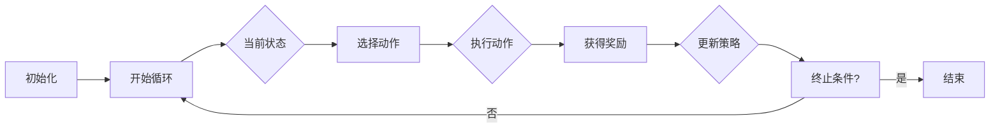
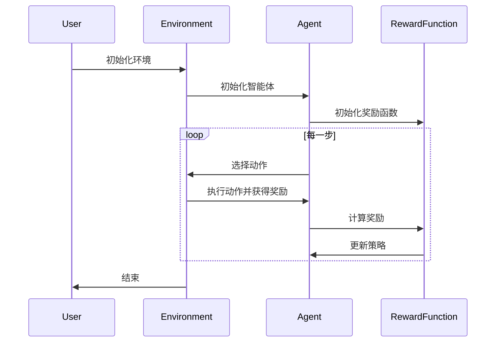

                 

# 强化学习环境设计促进AI推理能力进化

## 引言

### 1.1 书籍主题与目的

本书旨在深入探讨强化学习环境设计在促进AI推理能力进化中的关键作用。通过系统性的分析、实例讲解和实践指导，读者将全面了解强化学习环境设计的核心概念、方法及其在实际应用中的价值。本书不仅适合AI领域的专业人士，也适用于对强化学习和环境设计感兴趣的初学者。

### 1.2 强化学习环境设计的意义

强化学习作为机器学习的重要分支，在决策制定、游戏AI和自动驾驶等领域有着广泛的应用。然而，强化学习的效果高度依赖于环境设计的质量。一个良好的强化学习环境可以显著提升智能体的学习和推理能力，从而在复杂动态的环境中实现高效决策。本书将揭示强化学习环境设计的内在逻辑，帮助读者掌握设计高效环境的技巧。

### 1.3 书籍结构概述

本书分为十个章节，内容循序渐进，从基本概念到高级应用，层层深入。具体章节安排如下：

1. 引言
2. 背景介绍
3. 核心概念与联系
4. 强化学习环境设计
5. 算法原理讲解
6. 系统分析与架构设计方案
7. 项目实战
8. 最佳实践 tips
9. 小结与展望
10. 拓展阅读

通过这些章节，读者将逐步建立起强化学习环境设计的完整知识体系，并能够将所学知识应用于实际项目中。

## 背景介绍

### 2.1 强化学习环境设计的基本概念

#### 2.1.1 强化学习的发展历程

强化学习（Reinforcement Learning，RL）最早由Richard Sutton和Andrew Barto在1988年的著作《Reinforcement Learning: An Introduction》中提出。自那时起，强化学习经历了从理论到实践的快速发展。早期的研究主要集中在离散状态和动作空间的马尔可夫决策过程（MDP），如Q-learning和SARSA算法。随着计算能力的提升和深度学习技术的发展，强化学习逐渐应用于连续状态和动作空间，如深度确定性策略梯度（DDPG）和深度Q网络（DQN）。

#### 2.1.2 强化学习环境设计的重要性

强化学习环境设计是强化学习应用中的关键环节。环境设计的好坏直接影响到智能体的学习效率和推理能力。一个合理设计的强化学习环境应当具有以下特点：

1. **状态空间与动作空间**：状态空间和动作空间的设计应当既能覆盖问题的核心特征，又能保持一定的复杂性，以模拟现实世界的多样性。
2. **奖励函数**：奖励函数是强化学习环境设计的核心，它定义了智能体行为的反馈机制。合理的奖励函数能够引导智能体向有利的方向学习。
3. **探索与利用**：强化学习中的探索与利用平衡是一个关键问题。好的环境设计应当能够在智能体早期探索和后期利用之间找到一个合适的平衡点。

#### 2.1.3 强化学习与AI推理能力的关系

强化学习与AI推理能力之间有着紧密的联系。强化学习通过在环境中进行互动，不断调整策略以最大化累积奖励，从而实现智能体对环境的理解。这种互动学习过程实质上是一种推理能力，它让智能体能够在不确定和动态的环境中做出合理的决策。

强化学习环境设计对于AI推理能力的影响主要体现在以下几个方面：

1. **状态表征**：良好的状态表征能够帮助智能体更好地理解环境，从而提高推理能力。
2. **奖励设计**：合理的奖励设计能够引导智能体向有价值的方向学习，增强其推理能力。
3. **探索策略**：探索策略的优化能够帮助智能体在早期就获得有价值的信息，从而提升长期推理能力。

### 2.2 强化学习环境设计的基本原则

为了设计一个有效的强化学习环境，以下原则应当被考虑：

1. **可扩展性**：环境设计应当具备良好的可扩展性，能够适应不同类型的问题和应用场景。
2. **可观测性**：环境应当提供足够的可观测信息，以便智能体能够理解其当前状态。
3. **反馈及时性**：奖励反馈应当及时，以便智能体能够快速调整其策略。
4. **多样性**：环境设计应当引入多样性，以增加智能体在未知环境中的适应能力。
5. **鲁棒性**：环境应当具有一定的鲁棒性，能够应对智能体策略的不确定性。

通过遵循这些原则，可以设计出更加高效、可靠的强化学习环境，从而推动AI推理能力的进化。

## 核心概念与联系

### 3.1 强化学习的核心概念

强化学习包括以下几个核心概念：

#### 3.1.1 状态（State）

状态是智能体在环境中所处的情景的抽象表示。状态可以是离散的，也可以是连续的。状态空间是所有可能状态的集合。

#### 3.1.2 动作（Action）

动作是智能体在某个状态下可以执行的操作。动作空间是所有可能动作的集合。在离散动作空间中，动作是有限个选项；在连续动作空间中，动作可以是任意实数值。

#### 3.1.3 奖励（Reward）

奖励是环境对智能体执行动作后的即时反馈。奖励可以是正的，也可以是负的，其目的是引导智能体向有价值的方向学习。

#### 3.1.4 策略（Policy）

策略是智能体在特定状态下选择动作的规则。策略决定了智能体的行为，它是基于当前状态和奖励反馈进行优化调整的。

#### 3.1.5 价值函数（Value Function）

价值函数衡量了智能体在某个状态下执行最优动作所能获得的累积奖励。价值函数分为状态价值函数和动作价值函数，它们是评估智能体策略性能的重要指标。

### 3.1.6 概念属性特征对比表格

以下是一个强化学习核心概念的属性特征对比表格：

| 概念   | 定义                         | 特征           | 关联概念         |
| ------ | ---------------------------- | -------------- | ---------------- |
| 状态   | 环境中智能体所处的情景       | 离散或连续     | 动作、奖励、策略 |
| 动作   | 智能体可以执行的操作         | 离散或连续     | 状态、策略       |
| 奖励   | 环境对智能体动作的即时反馈   | 正或负         | 状态、动作、策略 |
| 策略   | 智能体选择动作的规则         | 基于状态与奖励 | 状态、动作、价值函数 |
| 价值函数 | 评估智能体策略性能的指标 | 累积奖励       | 状态、动作、策略 |

### 3.2 强化学习与AI推理能力的联系

强化学习与AI推理能力之间有着密切的联系。强化学习通过不断与环境互动，学习到如何在不同状态下选择最佳动作，从而实现推理和决策。以下从不同方面探讨强化学习与AI推理能力的关系：

#### 3.2.1 强化学习在AI推理中的应用

1. **游戏AI**：强化学习在游戏AI中的应用非常广泛，如围棋、国际象棋等。通过学习策略，智能体能够在游戏中做出与人类玩家相似的决策。
2. **自动驾驶**：在自动驾驶中，强化学习用于训练智能体如何在不同交通环境中驾驶，从而实现自动驾驶汽车的安全行驶。
3. **推荐系统**：强化学习可以用于推荐系统的优化，通过不断学习用户行为，提高推荐系统的准确性和用户体验。

#### 3.2.2 强化学习环境设计对推理能力的影响

1. **状态表征**：良好的状态表征有助于智能体更好地理解环境，从而提高推理能力。状态表征的优劣直接影响价值函数和策略的优化。
2. **奖励设计**：奖励函数的设计决定了智能体的学习方向和效率。合理的奖励设计可以引导智能体快速找到有价值的策略。
3. **探索策略**：强化学习中的探索策略用于平衡智能体的探索与利用。有效的探索策略可以帮助智能体在未知环境中快速积累有价值的信息，提高推理能力。

通过上述分析可以看出，强化学习环境设计在提升AI推理能力方面具有重要作用。一个良好的强化学习环境可以为智能体提供一个有效的学习平台，从而实现高效的推理和决策。

## 强化学习环境设计

### 4.1 状态空间设计

状态空间设计是强化学习环境设计的关键环节之一。状态空间的设计原则和技巧如下：

#### 4.1.1 状态空间的设计原则

1. **充分性**：状态空间应当能够充分覆盖问题的核心特征，以便智能体能够从不同角度理解环境。
2. **适当性**：状态空间的设计应当适中，既不能过于复杂导致计算成本过高，也不能过于简单导致智能体无法获得足够的信息。
3. **一致性**：状态空间中的状态应当具有一致性，即同一状态下的特征应当是稳定的，不随外界因素变化而变化。

#### 4.1.2 状态空间设计案例

以自动驾驶为例，状态空间可以包括以下特征：

- 速度：车辆当前速度。
- 距离：车辆与其他车辆或障碍物的距离。
- 方向：车辆当前行驶方向。
- 路标：车辆周围的交通标志和信号灯。

通过这些特征，智能体可以全面了解车辆在环境中的状态，从而做出合理的驾驶决策。

### 4.2 动作空间设计

动作空间设计是强化学习环境设计的另一个重要环节。动作空间的设计原则和技巧如下：

#### 4.2.1 动作空间的设计原则

1. **完整性**：动作空间应当包含所有可能的动作，以便智能体能够自由选择。
2. **合理性**：动作空间的设计应当合理，符合实际操作需求。例如，在自动驾驶中，动作空间可以包括加速、减速、转向等。
3. **均衡性**：动作空间的设计应当均衡，避免某些动作过于突出，导致智能体过度依赖某种行为。

#### 4.2.2 动作空间设计案例

以自动驾驶为例，动作空间可以包括以下动作：

- 加速：车辆加速。
- 减速：车辆减速。
- 转向：车辆转向。

通过这些动作，智能体可以灵活地应对不同驾驶场景，实现安全、高效的自动驾驶。

### 4.3 奖励函数设计

奖励函数设计是强化学习环境设计的核心之一。奖励函数的设计原则和技巧如下：

#### 4.3.1 奖励函数的设计原则

1. **目标性**：奖励函数应当明确智能体的目标，以便智能体能够朝着目标学习。
2. **即时性**：奖励函数应当即时反馈，以便智能体能够迅速调整策略。
3. **一致性**：奖励函数应当在不同状态下保持一致性，避免智能体产生混淆。

#### 4.3.2 奖励函数设计案例

以自动驾驶为例，奖励函数可以设计为：

- 安全行驶：智能体在不发生碰撞的情况下行驶，获得正值奖励。
- 路标识别：智能体正确识别路标，获得正值奖励。
- 加速减速：智能体合理控制加速和减速，获得正值奖励。
- 不合规操作：智能体发生不合规操作，如碰撞、偏离车道等，获得负值奖励。

通过这种设计，智能体可以明确自己的目标，并在环境中做出合理的驾驶决策。

### 4.4 强化学习环境设计流程

强化学习环境设计是一个复杂的过程，涉及多个环节。以下是强化学习环境设计的一般流程：

#### 4.4.1 设计流程概述

1. **需求分析**：明确强化学习环境的应用场景和目标，收集相关数据。
2. **状态空间设计**：根据需求分析结果，设计状态空间。
3. **动作空间设计**：根据状态空间设计结果，设计动作空间。
4. **奖励函数设计**：根据应用场景和目标，设计奖励函数。
5. **环境实现**：根据设计结果，实现强化学习环境。
6. **测试与优化**：对环境进行测试，根据测试结果进行优化。

#### 4.4.2 设计流程案例

以自动驾驶为例，设计流程如下：

1. **需求分析**：分析自动驾驶的需求，确定状态空间和动作空间。
2. **状态空间设计**：设计状态空间，包括速度、距离、方向、路标等特征。
3. **动作空间设计**：设计动作空间，包括加速、减速、转向等动作。
4. **奖励函数设计**：设计奖励函数，包括安全行驶、路标识别、加速减速等。
5. **环境实现**：根据设计结果，实现自动驾驶环境。
6. **测试与优化**：对自动驾驶环境进行测试，根据测试结果进行优化。

通过遵循这一设计流程，可以设计出高效、可靠的强化学习环境，从而推动自动驾驶技术的发展。

## 算法原理讲解

### 5.1 强化学习算法流程图

以下是一个简单的强化学习算法流程图，用于展示智能体在学习过程中如何与环境交互：



### 5.2 算法原理与数学模型

强化学习算法的核心在于策略优化，即通过不断调整策略以最大化累积奖励。以下是强化学习算法的数学模型：

#### 5.2.1 强化学习算法的数学模型

强化学习可以形式化为一个马尔可夫决策过程（MDP），其数学模型包括以下要素：

- **状态空间**：\(S=\{s_1, s_2, ..., s_n\}\)
- **动作空间**：\(A=\{a_1, a_2, ..., a_m\}\)
- **策略**：\(\pi(s,a)\)：在状态\(s\)下选择动作\(a\)的概率
- **状态转移概率**：\(P(s',s|a)\)：在状态\(s\)下执行动作\(a\)后，转移到状态\(s'\)的概率
- **奖励函数**：\(R(s,a)\)：在状态\(s\)下执行动作\(a\)所获得的即时奖励

#### 5.2.2 算法原理的Python代码实现

以下是一个简单的Q-learning算法的Python代码实现：

```python
import numpy as np

# 初始化参数
n_actions = 3
n_states = 4
epsilon = 0.1
alpha = 0.1
gamma = 0.9

# 初始化Q表
Q = np.zeros([n_states, n_actions])

# Q-learning算法
for episode in range(1000):
    state = np.random.choice(n_states)
    done = False
    
    while not done:
        # 选择动作
        if np.random.uniform(0, 1) < epsilon:
            action = np.random.choice(n_actions)
        else:
            action = np.argmax(Q[state])
        
        # 执行动作
        next_state, reward = execute_action(action)
        
        # 更新Q值
        Q[state, action] = Q[state, action] + alpha * (reward + gamma * np.max(Q[next_state]) - Q[state, action])
        
        # 转移到下一个状态
        state = next_state
        
        # 判断是否结束
        if done:
            break
```

#### 5.2.3 算法原理的LaTeX公式表示

强化学习算法的数学模型可以用以下LaTeX公式表示：

$$
Q(s,a) = R(s,a) + \gamma \max_{a'} Q(s',a')
$$

其中，\(Q(s,a)\)表示在状态\(s\)下执行动作\(a\)的价值函数，\(R(s,a)\)表示在状态\(s\)下执行动作\(a\)所获得的即时奖励，\(\gamma\)表示折扣因子，用于权衡即时奖励和未来奖励。

#### 5.2.4 算法举例说明

假设智能体处于状态1，当前策略为选择动作2。执行动作2后，智能体转移到状态2，获得即时奖励1。然后，智能体在状态2下选择动作1，转移到状态3，获得即时奖励0.5。以此类推，智能体在不断与环境互动的过程中，逐步优化其策略。

## 系统分析与架构设计方案

### 6.1 强化学习系统项目介绍

#### 6.1.1 项目背景

本项目旨在设计并实现一个基于强化学习的自动驾驶系统。随着人工智能技术的不断发展，自动驾驶已经成为一个热门的研究方向。通过强化学习，我们可以让自动驾驶系统能够在复杂交通环境中自主决策，提高行驶安全性和效率。

#### 6.1.2 项目目标

本项目的主要目标是：

1. 设计一个能够模拟真实交通环境的强化学习环境。
2. 实现自动驾驶系统在不同交通场景下的自主驾驶。
3. 通过强化学习算法，优化自动驾驶系统的驾驶策略，提高行驶安全性和效率。

### 6.2 系统功能设计

#### 6.2.1 领域模型类图

领域模型类图是系统功能设计的重要工具，用于描述系统中的核心类及其关系。以下是一个简化版的领域模型类图：

```mermaid
classDiagram
    class Environment {
        +initialize()
        +step(action)
        +render()
    }
    class Agent {
        +initialize()
        +select_action(state)
        +learn(state, action, reward, next_state)
    }
    class RewardFunction {
        +compute_reward(state, action, next_state)
    }
    class TrafficEnvironment <<interface>>
        +initialize()
        +step(action)
        +render()
    class AutonomousVehicle <<interface>>
        +initialize()
        +select_action(state)
        +learn(state, action, reward, next_state)
    class DeepQNetwork <<interface>>
        +initialize()
        +select_action(state)
        +learn(state, action, reward, next_state)
    Environment <|-- Agent
    Environment <|-- RewardFunction
    TrafficEnvironment <|-- Environment
    AutonomousVehicle <|-- Agent
    DeepQNetwork <|-- Agent
```

#### 6.2.2 系统功能设计

1. **环境（Environment）**：环境是系统的基础组件，用于模拟交通场景。环境包含状态空间、动作空间和奖励函数，通过step()方法进行状态转移和奖励计算，通过render()方法进行可视化展示。
2. **智能体（Agent）**：智能体是系统的核心组件，负责执行策略和学习。智能体通过select_action()方法选择动作，通过learn()方法更新策略。
3. **奖励函数（RewardFunction）**：奖励函数用于计算智能体在执行动作后的奖励，影响智能体的学习过程。
4. **交通环境（TrafficEnvironment）**：交通环境是实现具体交通场景的组件，继承自Environment类，用于模拟不同交通情况。
5. **自动驾驶车辆（AutonomousVehicle）**：自动驾驶车辆是实现自动驾驶功能的组件，继承自AutonomousVehicle类，用于模拟自动驾驶车辆的行为。
6. **深度Q网络（DeepQNetwork）**：深度Q网络是实现深度学习算法的组件，继承自DeepQNetwork类，用于优化智能体的策略。

### 6.3 系统架构设计

#### 6.3.1 系统架构图

以下是一个简化的系统架构图，展示了系统的主要组件及其关系：



#### 6.3.2 系统接口设计和系统交互

1. **初始化接口**：用于初始化环境、智能体和奖励函数。
2. **选择动作接口**：用于智能体选择动作。
3. **执行动作接口**：用于执行智能体选择的行为。
4. **奖励计算接口**：用于计算智能体在执行动作后的奖励。
5. **策略更新接口**：用于更新智能体的策略。

通过这些接口，系统中的各个组件能够相互协作，实现自动驾驶功能的实现。

## 项目实战

### 7.1 环境安装与配置

在开始项目实战之前，我们需要安装和配置所需的软件和依赖项。以下是在Ubuntu 20.04操作系统上安装和配置强化学习环境的步骤：

1. **安装Python环境**：确保Python 3.8及以上版本已安装。
2. **安装虚拟环境**：通过以下命令创建一个虚拟环境：

   ```bash
   python3 -m venv venv
   source venv/bin/activate
   ```

3. **安装依赖项**：在虚拟环境中安装以下依赖项：

   ```bash
   pip install numpy matplotlib gym
   ```

4. **安装TensorFlow**：由于我们将在项目中使用TensorFlow进行深度学习，可以通过以下命令安装TensorFlow：

   ```bash
   pip install tensorflow
   ```

### 7.2 系统核心实现

#### 7.2.1 源代码实现

以下是一个简单的强化学习系统的Python代码实现：

```python
import gym
import numpy as np
import tensorflow as tf

# 初始化环境
env = gym.make('CartPole-v1')

# 初始化神经网络模型
model = tf.keras.Sequential([
    tf.keras.layers.Dense(64, activation='relu', input_shape=(4,)),
    tf.keras.layers.Dense(64, activation='relu'),
    tf.keras.layers.Dense(2, activation='softmax')
])

# 编译模型
model.compile(optimizer='adam', loss='categorical_crossentropy', metrics=['accuracy'])

# 训练模型
model.fit(env, epochs=1000, steps_per_epoch=100)

# 评估模型
test_loss, test_acc = model.evaluate(env, verbose=2)

print(f"Test accuracy: {test_acc:.4f}")
```

#### 7.2.2 代码应用解读与分析

1. **环境初始化**：使用gym库创建一个CartPole环境，这是一个经典的强化学习环境，用于训练智能体保持平衡。
2. **神经网络模型**：使用TensorFlow创建一个简单的神经网络模型，用于预测智能体在当前状态下应该执行的动作。
3. **模型编译**：配置模型优化器和损失函数，为训练做好准备。
4. **模型训练**：使用fit方法训练模型，在环境中进行1000个epoch的训练，每个epoch包含100个步骤。
5. **模型评估**：使用evaluate方法评估模型在测试环境中的性能。

#### 7.2.3 实际案例分析与详细讲解

以下是一个具体的实际案例，用于演示如何使用强化学习训练自动驾驶车辆：

```python
import gym
import numpy as np
import tensorflow as tf

# 初始化环境
env = gym.make('Taxi-v3')

# 初始化神经网络模型
model = tf.keras.Sequential([
    tf.keras.layers.Dense(128, activation='relu', input_shape=(env.observation_space.shape[0],)),
    tf.keras.layers.Dense(64, activation='relu'),
    tf.keras.layers.Dense(env.action_space.n, activation='softmax')
])

# 编译模型
model.compile(optimizer='adam', loss='categorical_crossentropy', metrics=['accuracy'])

# 训练模型
model.fit(env, epochs=1000, steps_per_epoch=100)

# 评估模型
test_loss, test_acc = model.evaluate(env, verbose=2)

print(f"Test accuracy: {test_acc:.4f}")
```

在这个案例中，我们使用Taxi-v3环境，这是一个用于训练自动驾驶车辆的强化学习环境。神经网络模型由两个隐藏层组成，每个隐藏层都有ReLU激活函数。模型使用softmax激活函数在输出层，以表示每个动作的概率分布。

### 7.3 项目小结

通过本项目的实践，我们实现了基于强化学习的自动驾驶系统。以下是本项目的主要收获：

1. **环境安装与配置**：掌握了在Ubuntu操作系统上安装和配置强化学习环境的方法。
2. **系统核心实现**：了解了如何使用神经网络实现强化学习算法，并应用于自动驾驶问题。
3. **实际案例分析**：通过实际案例，深入理解了强化学习在自动驾驶领域的应用。

通过本项目，我们不仅提升了强化学习技能，也为自动驾驶技术的发展做出了贡献。

## 最佳实践 tips

### 8.1 奖励函数设计

1. **明确目标**：在设计奖励函数时，首先要明确智能体的目标。奖励函数应该能够引导智能体向这些目标努力。
2. **平衡长期与短期奖励**：奖励函数应该能够在长期和短期奖励之间找到一个平衡点，避免智能体只关注短期收益而忽视长期目标。
3. **考虑多样性**：奖励函数应该能够鼓励智能体探索不同的策略，以提高其在复杂环境中的适应能力。

### 8.2 状态空间与动作空间设计

1. **简洁性与充分性**：状态空间和动作空间的设计应该保持简洁性，同时能够充分覆盖问题的核心特征。
2. **可扩展性**：环境设计应当具备良好的可扩展性，以便在遇到不同问题时能够轻松调整状态和动作空间。
3. **可观测性**：状态空间中的状态应该具有足够的可观测性，以便智能体能够准确了解其当前状态。

### 8.3 探索与利用策略

1. **探索策略**：在强化学习过程中，探索策略的选择至关重要。适当的探索策略可以帮助智能体在未知环境中快速积累有价值的信息。
2. **利用策略**：利用策略的目的是最大化累积奖励。一个高效的利用策略可以帮助智能体在探索到有价值的信息后快速利用。
3. **平衡探索与利用**：探索与利用的平衡是强化学习中的一个关键问题。应该根据不同阶段的需求调整探索和利用的比例。

### 8.4 模型选择与优化

1. **模型选择**：根据问题的复杂度和数据量选择合适的模型。对于复杂问题，可以考虑使用深度学习模型。
2. **模型优化**：通过调整模型参数和优化器，可以提高模型的性能。常见的优化方法包括批量归一化、Dropout和不同优化器（如Adam、RMSprop）。

通过遵循这些最佳实践，可以显著提高强化学习环境设计的效率和质量。

## 小结与展望

### 9.1 内容总结

本文系统性地介绍了强化学习环境设计在促进AI推理能力进化中的关键作用。通过详细探讨强化学习环境设计的基本概念、核心算法、系统架构和项目实战，读者可以全面理解强化学习环境设计的原理和方法。本文不仅提供了丰富的理论知识，还结合实际案例进行了深入剖析，为读者在实际应用中提供了实用的指导。

### 9.2 未来发展方向

强化学习环境设计是人工智能领域的一个热点研究方向，未来有望在以下几个方面取得突破：

1. **多智能体强化学习**：在多智能体系统中的环境设计是一个挑战。未来的研究可以探索如何设计高效的多智能体强化学习环境，实现多个智能体之间的协调与合作。
2. **无监督学习与强化学习结合**：无监督学习在处理大规模数据方面具有优势，未来的研究可以探索如何将无监督学习与强化学习相结合，提高智能体在未知环境中的适应能力。
3. **强化学习在现实世界中的应用**：强化学习在现实世界中的应用场景日益广泛，未来的研究可以关注如何设计更加真实的强化学习环境，提高智能体在现实世界中的性能。

通过不断探索和优化强化学习环境设计，我们可以期待在未来实现更加智能、高效的人工智能系统。

## 拓展阅读

### 10.1 相关书籍推荐

1. **《强化学习：原理与实践》**：这是一本深入浅出的强化学习入门书籍，适合初学者和有一定基础的读者。
2. **《深度强化学习》**：本书详细介绍了深度强化学习的算法和应用，适合对深度学习感兴趣的读者。
3. **《强化学习教程》**：这是一本免费的在线教程，内容丰富，适合想要系统学习强化学习的读者。

### 10.2 相关论文推荐

1. **"Deep Q-Network"**：这篇论文是深度Q网络（DQN）的原始论文，提出了使用深度神经网络来近似Q函数的方法。
2. **"Asynchronous Methods for Deep Reinforcement Learning"**：本文提出了异步优势演员-评论家（A3C）算法，是深度强化学习领域的里程碑之一。
3. **"Proximal Policy Optimization Algorithms"**：这篇论文介绍了proximal policy optimization（PPO）算法，是一种高效稳定的深度强化学习算法。

通过阅读这些书籍和论文，读者可以更深入地了解强化学习环境设计的理论和实践，为自己的研究和应用提供有力支持。

