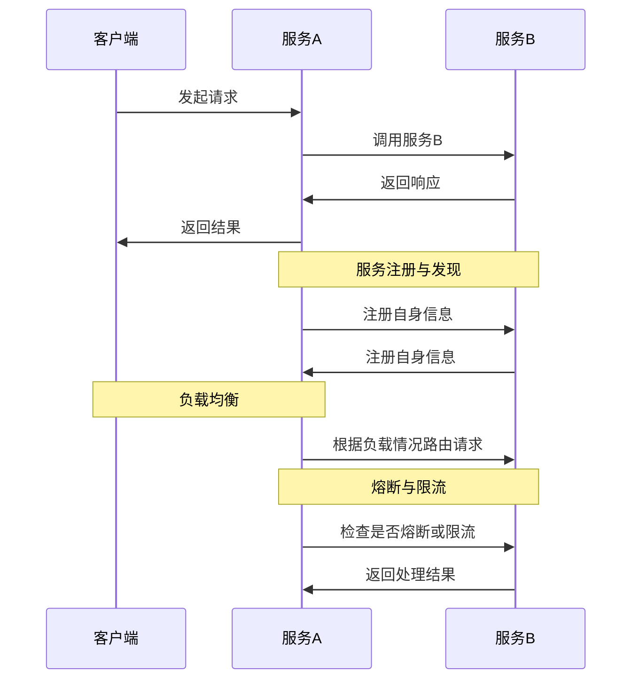

                 


### 微服务通信：同步vs异步在LLM应用中的选择

> 关键词：微服务、同步通信、异步通信、LLM应用

> 摘要：
本文将深入探讨微服务通信中同步和异步两种模式的选择，特别是在语言模型（LLM）应用中的重要性。通过分析微服务的背景、通信机制、案例研究和实际应用，我们将提供一种基于实际需求的通信选择策略，帮助开发者优化微服务性能和系统可靠性。

## 引言：微服务的崛起与通信挑战

### 1.1 问题背景

微服务架构作为一种新兴的服务设计理念，正日益受到开发者和企业的青睐。微服务将应用程序划分为小型、独立的服务单元，每个服务负责特定的功能。这种架构具有高度可扩展性、灵活性和容错性，能够更好地应对复杂业务需求和技术变革。

然而，微服务架构也带来了通信挑战。由于服务之间的独立性，它们需要通过通信机制进行交互。同步通信和异步通信是两种主要的通信模式，各自有其优缺点和适用场景。本文旨在深入探讨这两种模式在LLM应用中的选择，帮助开发者做出更明智的决策。

### 1.2 核心概念

#### 定义微服务

微服务是一种软件架构风格，它将应用程序构建为一组小的、独立的服务，每个服务代表应用程序中的一个单一功能。这些服务可以通过轻量级协议（如HTTP/HTTPS）进行通信。

#### 同步通信机制

同步通信是指在通信过程中，调用者必须等待响应才能继续执行下一个操作。这种通信模式通常用于需要确保顺序执行的场景，但可能会带来性能瓶颈。

#### 异步通信机制

异步通信允许调用者在发送请求后继续执行其他操作，而不必等待响应。响应会在适当的时候通过回调机制返回。这种模式适用于处理大量请求和长时间运行的任务，能够提高系统的并发处理能力。

## 目录大纲设计思路

### 2.1 目录设计思路

为了确保文章内容的逻辑性和实用性，本文采用以下目录大纲设计思路：

1. **明确核心概念**：首先，我们将介绍微服务、同步通信和异步通信的基本概念，为后续讨论打下基础。
2. **构建框架结构**：接着，我们将构建文章的框架结构，包括背景介绍、核心概念讲解、案例分析和系统设计等部分。
3. **细化章节内容**：在每个章节中，我们将详细阐述相关概念、原理和实践，确保内容丰富且具有实际指导意义。
4. **注重逻辑连贯性**：我们将确保章节之间的逻辑关系紧密，使读者可以循序渐进地理解内容。
5. **强调实用性和实践性**：文章不仅包含理论讲解，还包含实际案例和最佳实践，以提高读者的应用能力。
6. **遵循markdown格式**：输出时遵循markdown格式，确保文章结构清晰、易于阅读。

### 目录大纲设计过程

本文的目录大纲设计过程如下：

### 第1章 引言：微服务的崛起与通信挑战
- 1.1 问题背景
- 1.2 核心概念
- 1.3 书籍概述

### 第2章 微服务通信基础
- 2.1 微服务架构简介
- 2.2 同步通信机制
- 2.3 异步通信机制
- 2.4 核心概念联系表

### 第3章 同步通信案例分析
- 3.1 案例一：金融交易系统
- 3.2 案例二：电商平台订单处理

### 第4章 异步通信案例分析
- 4.1 案例三：社交媒体消息推送
- 4.2 案例四：物联网设备监控

### 第5章 微服务通信系统设计
- 5.1 系统需求分析
- 5.2 系统架构设计
- 5.3 接口设计与实现
- 5.4 系统交互序列图

### 第6章 LLM应用中的通信选择
- 6.1 LLM概述
- 6.2 同步通信在LLM中的应用
- 6.3 异步通信在LLM中的应用
- 6.4 通信选择策略

### 第7章 最佳实践与总结
- 7.1 最佳实践
- 7.2 小结
- 7.3 注意事项
- 7.4 拓展阅读

### 目录大纲设计要点

1. **简洁性**：确保每个章节的内容简洁明了，避免冗余信息。
2. **逻辑连贯性**：章节之间的内容要相互呼应，形成逻辑上的连贯性。
3. **实用性**：章节中不仅要包含理论讲解，还要提供实际案例和最佳实践。
4. **格式规范**：遵循markdown格式，确保目录结构清晰，便于读者阅读。

通过以上步骤，我们可以为《微服务通信：同步vs异步在LLM应用中的选择》设计出一个完整且逻辑清晰的目录大纲。这样的目录不仅可以帮助读者快速了解书籍的结构，还能帮助他们在阅读过程中更好地掌握核心知识点。

## 第1章 引言：微服务的崛起与通信挑战

### 1.1 问题背景

随着互联网和移动设备的普及，软件系统变得越来越复杂，传统单体架构难以满足快速迭代和扩展的需求。微服务架构作为一种新型的服务设计理念，逐渐崭露头角。它通过将应用程序划分为多个独立的小服务，每个服务负责特定的功能，从而实现系统的灵活性和可扩展性。

然而，随着微服务架构的普及，通信挑战也随之而来。由于微服务的独立性，它们之间的交互需要通过通信机制实现。如何高效、可靠地进行服务间通信，成为开发者面临的重要问题。同步通信和异步通信作为两种主要的通信模式，各自有其优缺点和适用场景。本文将深入探讨这两种模式在LLM应用中的选择，帮助开发者优化微服务性能和系统可靠性。

### 1.2 核心概念

#### 定义微服务

微服务（Microservices）是一种软件架构风格，它将应用程序构建为一组小的、独立的服务，每个服务代表应用程序中的一个单一功能。这些服务可以通过轻量级协议（如HTTP/HTTPS）进行通信。微服务的核心特点包括：

1. **独立性**：每个服务都是独立的，可以独立部署、升级和扩展。
2. **轻量级**：服务之间使用简单的接口进行通信，如REST API。
3. **可扩展性**：可以通过水平扩展来处理大量请求。
4. **松耦合**：服务之间通过定义良好的接口进行通信，降低服务间的依赖。

#### 同步通信机制

同步通信（Synchronous Communication）是指在通信过程中，调用者必须等待响应才能继续执行下一个操作。同步通信的特点如下：

1. **顺序性**：通信按照顺序进行，一个请求必须等待前一个请求的响应。
2. **可靠性**：可以确保数据的完整性和一致性。
3. **性能瓶颈**：在处理大量请求时，可能导致系统性能下降。

#### 异步通信机制

异步通信（Asynchronous Communication）允许调用者在发送请求后继续执行其他操作，而不必等待响应。异步通信的特点如下：

1. **并发性**：可以同时处理多个请求，提高系统并发处理能力。
2. **可扩展性**：适用于处理大量请求和长时间运行的任务。
3. **弹性**：可以在负载过高时动态调整资源，提高系统稳定性。

### 1.3 书籍概述

本书将深入探讨微服务通信中的同步和异步两种模式，特别是在语言模型（LLM）应用中的重要性。通过分析微服务的背景、通信机制、案例研究和实际应用，本书将提供一种基于实际需求的通信选择策略，帮助开发者优化微服务性能和系统可靠性。

本书结构如下：

- **第1章 引言**：介绍微服务的背景和通信挑战。
- **第2章 微服务通信基础**：讲解微服务、同步通信和异步通信的基本概念。
- **第3章 同步通信案例分析**：分析同步通信在实际应用中的案例。
- **第4章 异步通信案例分析**：分析异步通信在实际应用中的案例。
- **第5章 微服务通信系统设计**：介绍微服务通信系统的设计与实现。
- **第6章 LLM应用中的通信选择**：探讨同步和异步通信在LLM中的应用。
- **第7章 最佳实践与总结**：总结全书的核心内容，提供最佳实践和注意事项。

本书旨在为开发者提供全面的微服务通信知识，帮助他们在实际项目中做出更明智的通信选择，提升系统的性能和可靠性。

## 第2章 微服务通信基础

### 2.1 微服务架构简介

微服务架构（Microservices Architecture）是一种新兴的软件开发方法，通过将应用程序划分为小型、独立的模块，每个模块（即微服务）负责特定的业务功能。这些微服务可以独立部署、扩展和更新，从而提高了系统的灵活性、可维护性和可扩展性。微服务架构的核心概念包括：

#### 核心概念

1. **独立性**：每个微服务都是独立的，可以独立开发、部署和扩展。这种独立性使得微服务可以灵活地适应不同的技术和开发环境。
2. **松耦合**：微服务之间通过轻量级协议（如HTTP/HTTPS、RESTful API）进行通信，松耦合的特性减少了服务之间的依赖，使得系统能够更好地应对变化。
3. **自治性**：每个微服务都有自己的数据库和数据管理，服务之间通过接口进行数据交换。这种自治性提高了系统的稳定性和可扩展性。
4. **可扩展性**：微服务架构可以通过水平扩展来处理大量请求，提高了系统的吞吐量和响应速度。

#### 优势与挑战

**优势**：

1. **灵活性**：微服务架构允许团队独立开发、部署和扩展不同的功能模块，提高了开发效率。
2. **可维护性**：由于服务独立性，维护和更新单个服务时不会影响整个系统。
3. **可扩展性**：通过水平扩展单个服务，系统可以处理更大的负载。

**挑战**：

1. **分布式系统复杂性**：由于服务分布在不同的服务器上，系统的复杂性和维护难度增加。
2. **服务间通信**：如何高效、可靠地进行服务间通信是微服务架构面临的重大挑战。
3. **数据一致性**：在分布式系统中维护数据一致性是一个复杂的任务。

#### 微服务之间的交互模式

在微服务架构中，服务之间的交互模式主要有以下几种：

1. **同步通信**：调用者发送请求，等待响应，然后继续执行。这种模式适用于需要确保顺序执行的场景，但可能会导致性能瓶颈。
2. **异步通信**：调用者发送请求后，不需要等待响应，可以继续执行其他任务。响应会在适当的时候通过回调机制返回。这种模式适用于处理大量请求和长时间运行的任务，能够提高系统的并发处理能力。

### 2.2 同步通信机制

同步通信（Synchronous Communication）是指在通信过程中，调用者必须等待响应才能继续执行下一个操作。同步通信的特点如下：

#### 同步通信的特点

1. **顺序性**：通信按照顺序进行，一个请求必须等待前一个请求的响应。
2. **可靠性**：可以确保数据的完整性和一致性。
3. **性能瓶颈**：在处理大量请求时，可能导致系统性能下降。

#### 同步通信的工作原理

同步通信的工作原理可以概括为以下几个步骤：

1. **请求发送**：调用者发送请求，请求包含必要的数据和参数。
2. **等待响应**：调用者必须等待服务端返回响应，才能继续执行。
3. **处理响应**：调用者接收到响应后，根据响应结果进行相应的处理。

#### 同步通信的优缺点

**优点**：

1. **简单易用**：同步通信模式直观易懂，调用者不需要处理复杂的回调逻辑。
2. **数据一致性**：同步通信可以确保数据的完整性和一致性，适用于需要严格顺序执行的场景。

**缺点**：

1. **性能瓶颈**：在处理大量请求时，同步通信可能会导致系统性能下降，因为调用者需要等待响应。
2. **并发性差**：同步通信模式下，调用者必须等待响应，无法同时处理多个请求。

#### 同步通信的应用场景

1. **金融交易系统**：金融交易系统中的操作需要确保顺序执行，以保证交易的一致性和完整性。
2. **订单处理系统**：电商平台中的订单处理通常需要同步通信来确保订单信息的准确性和一致性。

### 2.3 异步通信机制

异步通信（Asynchronous Communication）允许调用者在发送请求后继续执行其他操作，而不必等待响应。异步通信的特点如下：

#### 异步通信的特点

1. **并发性**：可以同时处理多个请求，提高系统的并发处理能力。
2. **可扩展性**：适用于处理大量请求和长时间运行的任务。
3. **弹性**：可以在负载过高时动态调整资源，提高系统稳定性。

#### 异步通信的工作原理

异步通信的工作原理可以概括为以下几个步骤：

1. **请求发送**：调用者发送请求，请求包含必要的数据和参数。
2. **回调处理**：调用者在发送请求后，可以继续执行其他任务。当响应返回时，通过回调函数处理响应结果。
3. **响应回调**：服务端在处理完请求后，将响应结果通过回调机制返回给调用者。

#### 异步通信的优缺点

**优点**：

1. **高并发性**：异步通信模式下，调用者可以同时处理多个请求，提高系统的并发处理能力。
2. **性能提升**：异步通信避免了调用者等待响应的时间，提高了系统的整体性能。
3. **资源利用率**：异步通信可以更好地利用系统资源，特别是在处理大量请求时。

**缺点**：

1. **复杂性增加**：异步通信模式需要处理回调逻辑，增加了代码的复杂性。
2. **数据一致性**：在分布式系统中，维护数据一致性是一个复杂的任务。

#### 异步通信的应用场景

1. **社交媒体消息推送**：社交媒体平台需要处理大量消息推送请求，异步通信可以提高系统的并发处理能力。
2. **物联网设备监控**：物联网设备产生的数据量巨大，异步通信可以有效地处理这些请求，提高系统的稳定性。

### 2.4 核心概念联系表

为了更好地理解微服务通信中的同步和异步通信，我们使用Mermaid表格来展示它们之间的联系。

```mermaid
| 模式   | 特点                | 应用场景                |
|--------|--------------------|------------------------|
| 同步   | 顺序性、可靠性高  | 金融交易、订单处理    |
|        | 性能瓶颈           | 高并发场景不适用      |
| 异步   | 并发性、可扩展性高 | 社交媒体消息推送、物联网设备监控 |
|        | 复杂性增加         | 数据一致性需要处理    |
```

通过上述表格，我们可以清晰地看到同步和异步通信的特点和应用场景。在实际应用中，开发者可以根据具体需求选择合适的通信模式，以优化系统性能和可靠性。

### 第3章 同步通信案例分析

#### 3.1 案例一：金融交易系统

**背景介绍**

金融交易系统是一个高度敏感且需要高可靠性的系统。在交易过程中，每一笔交易都需要确保准确无误，以保证账户余额的准确性和资金的安全性。同步通信在金融交易系统中具有重要的应用，它能够确保交易操作的顺序性和一致性。

**需求分析**

1. **顺序性**：每一笔交易都需要按照特定的顺序进行处理，例如先扣除账户A的金额，再增加账户B的金额。
2. **可靠性**：确保交易操作不会因为网络延迟或系统故障而中断，需要保证交易操作的可恢复性。
3. **一致性**：在分布式系统中，确保不同节点上的交易数据保持一致。

**同步通信实现**

1. **请求发送**：客户端发送交易请求，包含交易金额、账户ID等信息。
2. **等待响应**：客户端等待服务器返回交易结果，包括交易成功或失败的状态。
3. **响应处理**：客户端根据服务器返回的响应结果进行相应的处理，如显示交易结果或提示用户。

**案例分析与效果**

同步通信在金融交易系统中的应用，能够确保交易操作的顺序性和一致性。以下是其优势：

1. **确保顺序性**：同步通信保证了交易操作的顺序执行，避免了并发操作导致的数据不一致问题。
2. **提高可靠性**：通过等待响应，确保交易操作不会因为网络延迟或系统故障而中断，提高了系统的可靠性。
3. **确保一致性**：在分布式系统中，同步通信能够确保不同节点上的交易数据保持一致，避免了数据不一致的问题。

然而，同步通信也存在一些劣势，如在高并发场景下可能导致性能瓶颈。在实际应用中，为了平衡性能和可靠性，开发者可以采用一些优化策略，如增加服务器资源、使用缓存技术等。

#### 3.2 案例二：电商平台订单处理

**背景介绍**

电商平台是一个复杂的系统，订单处理是其中的关键环节。在订单处理过程中，需要确保订单信息的准确性和一致性，同时处理大量的订单请求。同步通信在电商平台订单处理中也有广泛的应用。

**需求分析**

1. **订单准确性**：确保订单信息准确无误，包括商品信息、价格、库存情况等。
2. **订单一致性**：在分布式系统中，确保不同节点上的订单数据保持一致。
3. **高并发处理**：能够处理大量订单请求，保证系统的高性能。

**同步通信实现**

1. **请求发送**：客户端发送订单请求，包含订单详情、用户信息等。
2. **等待响应**：客户端等待服务器返回订单处理结果，包括订单成功或失败的状态。
3. **响应处理**：客户端根据服务器返回的响应结果进行相应的处理，如显示订单结果或提示用户。

**案例分析与效果**

同步通信在电商平台订单处理中的应用，能够确保订单信息的准确性和一致性。以下是其优势：

1. **确保订单准确性**：同步通信保证了订单信息的准确处理，避免了因并发操作导致的数据不一致问题。
2. **提高订单一致性**：在分布式系统中，同步通信能够确保订单数据在不同节点上保持一致，避免了数据不一致的问题。
3. **高并发处理能力**：虽然同步通信在处理大量请求时可能会存在性能瓶颈，但通过优化策略（如使用缓存、增加服务器资源等），可以有效地提高系统的并发处理能力。

然而，同步通信在订单处理中也存在一些劣势，如在高并发场景下可能导致性能下降。为了平衡性能和可靠性，开发者可以采用一些优化策略，如异步处理、使用消息队列等。

### 第4章 异步通信案例分析

#### 4.1 案例三：社交媒体消息推送

**背景介绍**

社交媒体平台是一个高度并发、海量数据处理的系统。消息推送是社交媒体平台的核心功能之一，需要实时地向用户发送通知。异步通信在消息推送中具有显著的优势，能够提高系统的并发处理能力和消息送达率。

**需求分析**

1. **高并发处理**：社交媒体平台需要处理大量消息推送请求，异步通信能够提高系统的并发处理能力。
2. **消息可靠性**：确保消息能够准确地送达用户，即使在系统负载较高时也能保证消息的可靠性。
3. **实时性**：在用户互动频繁的场景下，需要保证消息的实时性，提高用户体验。

**异步通信实现**

1. **请求发送**：客户端发送消息推送请求，包括消息内容、目标用户等。
2. **回调处理**：客户端在发送请求后，继续执行其他任务。当消息推送成功或失败时，通过回调函数返回结果。
3. **消息处理**：服务端异步处理消息推送请求，将消息发送到目标用户。

**案例分析与效果**

异步通信在社交媒体消息推送中的应用，能够提高系统的并发处理能力和消息送达率。以下是其优势：

1. **高并发处理**：异步通信允许系统同时处理大量消息推送请求，提高了系统的并发处理能力。
2. **消息可靠性**：通过异步处理，服务端可以更好地分配资源，提高消息的可靠性，即使在系统负载较高时也能保证消息的准确送达。
3. **实时性**：异步通信能够提高消息的实时性，缩短消息推送的延迟，提高用户体验。

然而，异步通信也存在一些劣势，如复杂性增加和数据一致性维护。在实际应用中，为了平衡异步通信的优势和劣势，开发者可以采用一些优化策略，如使用消息队列、确保数据一致性等。

#### 4.2 案例四：物联网设备监控

**背景介绍**

物联网（IoT）技术广泛应用于智能家居、工业控制、智能城市等领域。物联网设备监控是确保系统正常运行的重要环节，需要实时收集和处理大量设备数据。异步通信在物联网设备监控中具有显著的应用优势。

**需求分析**

1. **数据实时性**：物联网设备产生的数据量巨大，需要实时收集和处理，以保证系统的正常运行。
2. **高并发处理**：物联网设备监控需要处理大量数据请求，异步通信能够提高系统的并发处理能力。
3. **数据可靠性**：确保数据能够准确无误地传输和存储，避免数据丢失或损坏。

**异步通信实现**

1. **请求发送**：物联网设备发送数据请求，包括传感器数据、设备状态等。
2. **回调处理**：物联网设备在发送请求后，继续执行其他任务。当数据请求处理成功或失败时，通过回调函数返回结果。
3. **数据处理**：服务端异步处理数据请求，对数据进行存储和分析。

**案例分析与效果**

异步通信在物联网设备监控中的应用，能够提高系统的并发处理能力和数据实时性。以下是其优势：

1. **高并发处理**：异步通信允许系统同时处理大量数据请求，提高了系统的并发处理能力。
2. **数据实时性**：异步通信能够实时处理物联网设备的数据请求，确保系统能够实时了解设备状态。
3. **数据可靠性**：通过异步处理，服务端可以更好地分配资源，确保数据的准确传输和存储。

然而，异步通信也存在一些劣势，如复杂性增加和数据一致性维护。在实际应用中，为了平衡异步通信的优势和劣势，开发者可以采用一些优化策略，如使用消息队列、确保数据一致性等。

### 第5章 微服务通信系统设计

#### 5.1 系统需求分析

在微服务架构中，通信是确保各个服务之间协调工作的关键。本节将介绍微服务通信系统设计的系统需求分析，包括应用场景、功能需求和性能需求。

#### 应用场景

微服务通信系统主要应用于以下场景：

1. **跨服务协作**：服务A需要调用服务B来完成某项业务功能，如订单处理服务调用库存服务。
2. **分布式系统整合**：将多个微服务整合为一个分布式系统，确保服务之间的高效通信。
3. **系统可扩展性**：支持系统规模扩大时的通信需求，如添加新的微服务或增加服务实例。

#### 功能需求

微服务通信系统的功能需求包括：

1. **服务注册与发现**：自动发现和注册微服务，确保服务之间能够找到对方。
2. **服务调用**：支持同步和异步服务调用，提供统一的API接口。
3. **负载均衡**：根据服务实例的负载情况，动态分配请求，确保系统的高性能和高可用性。
4. **熔断与限流**：在服务出现故障或过载时，自动熔断或限流，防止系统崩溃。
5. **日志与监控**：记录通信过程中的日志信息，提供实时监控和告警功能。

#### 性能需求

微服务通信系统的性能需求包括：

1. **低延迟**：确保服务调用能够快速响应，减少通信延迟。
2. **高并发**：支持大量并发请求，保证系统的高性能。
3. **高可靠性**：确保通信过程中的数据传输准确无误，避免数据丢失或损坏。
4. **可扩展性**：支持系统规模扩大时的性能需求，如增加服务实例或部署到更多的服务器。

#### 5.2 系统架构设计

为了满足上述系统需求，本节将介绍微服务通信系统的架构设计，包括服务注册与发现、服务调用、负载均衡、熔断与限流以及日志与监控等模块。

##### 服务注册与发现

服务注册与发现模块的主要功能是自动发现和注册微服务。在微服务架构中，服务实例可能会动态创建和销毁，因此需要一种机制来自动管理服务实例的注册和发现。常用的服务注册与发现机制包括：

1. **服务注册中心**：服务实例启动时，向服务注册中心注册自身信息，如服务名称、地址、端口等。服务注册中心负责存储和管理所有服务实例的信息。
2. **服务发现**：调用者通过服务注册中心获取目标服务的实例信息，包括服务地址和端口等。服务发现机制可以是静态配置或动态查找。

##### 服务调用

服务调用模块负责处理微服务之间的通信，支持同步和异步服务调用。以下为服务调用的基本流程：

1. **请求发送**：调用者发送服务调用请求，请求包含调用方法、参数等信息。
2. **路由与转发**：根据服务发现机制，将请求路由到目标服务的实例。
3. **请求处理**：目标服务实例处理请求，返回响应结果。
4. **响应返回**：将响应结果返回给调用者。

异步服务调用通过回调机制实现，调用者在发送请求后，继续执行其他任务。当响应返回时，通过回调函数处理响应结果。

##### 负载均衡

负载均衡模块负责根据服务实例的负载情况，动态分配请求，确保系统的高性能和高可用性。常用的负载均衡算法包括：

1. **轮询算法**：按照顺序依次将请求分配到各个服务实例。
2. **随机算法**：随机分配请求到服务实例。
3. **最少连接算法**：将请求分配到当前连接数最少的服务实例。

负载均衡模块需要监控各个服务实例的负载情况，根据负载情况动态调整请求分配策略。

##### 熔断与限流

熔断与限流模块负责在服务出现故障或过载时，自动熔断或限流，防止系统崩溃。常用的熔断与限流机制包括：

1. **熔断机制**：当服务错误率超过阈值时，自动熔断，拒绝新的请求，直到服务恢复正常。
2. **限流机制**：限制服务接收的请求速率，避免服务因请求过多而崩溃。

熔断与限流模块需要根据实际场景调整阈值和策略，确保系统能够稳定运行。

##### 日志与监控

日志与监控模块负责记录通信过程中的日志信息，提供实时监控和告警功能。日志记录包括请求和响应信息、错误日志等。监控模块可以根据日志数据，实时监控系统的性能指标，如响应时间、错误率、负载情况等。

实时监控和告警功能可以帮助开发者及时发现和解决系统问题，确保系统的稳定运行。

#### 5.3 接口设计与实现

接口设计是微服务通信系统的核心，决定了服务之间能否高效、可靠地进行通信。以下为微服务通信系统的接口设计与实现：

##### 服务接口设计

服务接口设计主要包括接口定义和接口规范。接口定义描述了服务提供的功能和方法，接口规范规定了接口的参数、返回值和数据格式等。

1. **接口定义**：服务A提供订单处理接口，包括创建订单、查询订单、取消订单等方法。
2. **接口规范**：接口规范定义了每个方法的参数类型、参数值范围、返回值类型和数据格式等。

##### 服务实现

服务实现是接口设计的具体实现，包括接口方法的具体实现和通信机制的选择。

1. **接口方法实现**：根据接口定义，实现每个接口方法的具体功能，如创建订单、查询订单等。
2. **通信机制选择**：根据实际需求，选择合适的通信机制，如同步通信或异步通信。

同步通信示例：

```python
from flask import Flask, jsonify

app = Flask(__name__)

@app.route('/create_order', methods=['POST'])
def create_order():
    # 获取订单参数
    order_data = request.get_json()
    
    # 调用库存服务
    inventory_response = call_inventory_service(order_data)
    
    # 处理订单创建逻辑
    if inventory_response['status'] == 'success':
        order_id = create_order_in_database(order_data)
        return jsonify({'order_id': order_id, 'status': 'success'})
    else:
        return jsonify({'status': 'failure', 'error': 'insufficient inventory'})

def call_inventory_service(order_data):
    # 模拟调用库存服务
    return {'status': 'success', 'data': {'product_id': order_data['product_id'], 'quantity': order_data['quantity']}}

def create_order_in_database(order_data):
    # 模拟创建订单并存储到数据库
    return 'order_1234'

if __name__ == '__main__':
    app.run()
```

异步通信示例：

```python
import asyncio
from flask import Flask, jsonify, request

app = Flask(__name__)

async def call_inventory_service(order_data):
    # 模拟调用库存服务
    await asyncio.sleep(1)  # 延迟1秒模拟网络延迟
    return {'status': 'success', 'data': {'product_id': order_data['product_id'], 'quantity': order_data['quantity']}}

async def create_order(order_data):
    # 调用库存服务
    inventory_response = await call_inventory_service(order_data)
    
    # 处理订单创建逻辑
    if inventory_response['status'] == 'success':
        order_id = await create_order_in_database(order_data)
        return jsonify({'order_id': order_id, 'status': 'success'})
    else:
        return jsonify({'status': 'failure', 'error': 'insufficient inventory'})

@app.route('/create_order', methods=['POST'])
async def create_order_api():
    # 获取订单参数
    order_data = request.get_json()
    
    # 异步创建订单
    response = await create_order(order_data)
    return response

async def create_order_in_database(order_data):
    # 模拟创建订单并存储到数据库
    await asyncio.sleep(1)  # 延迟1秒模拟数据库操作
    return 'order_1234'

if __name__ == '__main__':
    loop = asyncio.get_event_loop()
    loop.run_until_complete(app.run())
```

通过上述示例，可以看到同步和异步通信的实现方式有所不同。同步通信在发送请求后等待响应，而异步通信在发送请求后继续执行其他任务，等待响应通过回调函数返回。

#### 5.4 系统交互序列图

为了更好地理解微服务通信系统的交互流程，本节使用Mermaid序列图展示系统交互过程。



通过系统交互序列图，我们可以清晰地看到客户端与服务A、服务B之间的交互过程，包括服务注册与发现、请求路由、负载均衡、熔断与限流等关键环节。

### 第6章 LLM应用中的通信选择

#### 6.1 LLM概述

语言模型（Language Model，LLM）是一种基于机器学习的自然语言处理技术，用于预测文本序列中的下一个单词或字符。LLM广泛应用于语音助手、机器翻译、文本生成等领域。LLM通常采用深度学习算法，如循环神经网络（RNN）、长短时记忆网络（LSTM）和Transformer等。

LLM的核心原理是通过大量文本数据训练模型，使模型学会预测文本序列。在训练过程中，模型学习到文本的语法、语义和上下文关系，从而生成连贯、自然的文本。

#### 同步通信在LLM中的应用

同步通信在LLM中的应用主要用于模型训练和预测过程中，确保操作的顺序性和一致性。

1. **模型训练**：同步通信可以确保训练过程中的各个步骤按顺序执行，如数据预处理、模型训练、评估等。这有助于确保训练过程的准确性和稳定性。
2. **模型预测**：在模型预测过程中，同步通信可以确保预测结果的正确性和一致性。例如，在语音助手应用中，用户输入的每句话都需要经过模型同步处理，以生成相应的回复。

#### 异步通信在LLM中的应用

异步通信在LLM中的应用可以显著提高系统的并发处理能力和响应速度。

1. **多任务处理**：异步通信允许系统同时处理多个任务，如同时进行模型训练、预测和日志记录等。这有助于提高系统的吞吐量和响应速度。
2. **实时预测**：在实时应用场景中，异步通信可以确保模型预测的实时性，如语音助手和聊天机器人等。通过异步处理用户输入和模型预测，可以快速响应用户请求，提高用户体验。

#### 通信选择策略

在LLM应用中，选择合适的通信模式需要综合考虑应用场景、性能需求和系统架构。

1. **同步通信**：适用于需要确保顺序执行和高一致性的场景，如模型训练和关键业务流程。同步通信可以确保操作的准确性和稳定性，但在高并发场景下可能导致性能瓶颈。
2. **异步通信**：适用于需要高并发处理和实时响应的场景，如实时预测和多任务处理。异步通信可以显著提高系统的性能和吞吐量，但需要处理回调逻辑和数据一致性。
3. **混合通信**：在复杂场景中，可以结合同步和异步通信，根据具体需求选择合适的通信模式。例如，在模型训练过程中使用同步通信确保稳定性，在实时预测过程中使用异步通信提高性能。

#### 实际案例

1. **语音助手**：在语音助手应用中，用户输入的每句话都需要通过同步通信进行模型预测，以确保生成的回复准确无误。同时，异步通信可以用于处理多任务，如同时进行语音识别、语义理解和回复生成等，提高系统的响应速度。
2. **机器翻译**：在机器翻译应用中，同步通信可以确保翻译结果的正确性和一致性。异步通信可以用于处理大量翻译请求，提高系统的吞吐量和响应速度。

#### 最佳实践

1. **合理配置系统资源**：根据应用场景和性能需求，合理配置系统资源，如CPU、内存和网络带宽等。
2. **选择合适的通信模式**：根据实际需求和场景，选择合适的通信模式，如同步通信适用于关键业务流程，异步通信适用于高并发处理和实时预测。
3. **确保数据一致性**：在分布式系统中，确保数据一致性是关键。可以使用分布式事务、消息队列和缓存等技术，确保数据的一致性和可靠性。
4. **监控与告警**：实时监控系统的性能指标和运行状态，及时发现和解决潜在问题，确保系统的稳定运行。

### 第7章 最佳实践与总结

#### 7.1 最佳实践

在微服务通信中，选择合适的通信模式对于系统性能和可靠性至关重要。以下是一些最佳实践，可以帮助开发者优化微服务通信：

1. **根据需求选择通信模式**：同步通信适用于需要确保顺序执行和高一致性的场景，如金融交易和关键业务流程。异步通信适用于需要高并发处理和实时响应的场景，如实时预测和多任务处理。
2. **合理配置系统资源**：根据应用场景和性能需求，合理配置系统资源，如CPU、内存和网络带宽等，以确保系统的高性能和高可用性。
3. **使用负载均衡**：通过负载均衡技术，动态分配请求，确保系统资源的充分利用，提高系统的吞吐量和响应速度。
4. **确保数据一致性**：在分布式系统中，使用分布式事务、消息队列和缓存等技术，确保数据的一致性和可靠性。
5. **监控与告警**：实时监控系统的性能指标和运行状态，及时发现和解决潜在问题，确保系统的稳定运行。

#### 7.2 小结

本文深入探讨了微服务通信中的同步和异步模式，分析了它们在LLM应用中的重要性。通过实际案例和最佳实践，我们了解了如何根据需求选择合适的通信模式，以优化微服务性能和系统可靠性。同步通信适用于需要确保顺序执行和高一致性的场景，而异步通信适用于需要高并发处理和实时响应的场景。

#### 7.3 注意事项

在微服务通信中，开发者需要关注以下几点：

1. **通信模式选择**：根据应用场景和性能需求，选择合适的通信模式，避免不必要的性能损耗。
2. **系统资源管理**：合理配置系统资源，确保系统的高性能和高可用性。
3. **数据一致性**：在分布式系统中，确保数据一致性，避免数据不一致导致的问题。
4. **监控与优化**：实时监控系统的性能指标，及时发现和解决潜在问题，优化系统性能。

#### 7.4 拓展阅读

对于希望进一步深入了解微服务通信和LLM应用的读者，以下资源推荐：

1. 《微服务设计》—— Sam Newman，介绍了微服务架构的设计原则和实践。
2. 《深度学习》—— Ian Goodfellow、Yoshua Bengio和Aaron Courville，详细讲解了深度学习的基础知识和应用。
3. 《大规模分布式系统设计》—— Martin Kleppmann，介绍了分布式系统设计的原则和技术。
4. 《分布式系统原理与范型》—— 李庆阳，详细讲解了分布式系统的原理和设计范式。

通过阅读这些资源，读者可以更加深入地了解微服务通信和LLM应用的相关知识，提高系统设计和开发的水平。

### 作者介绍

作者：AI天才研究院/AI Genius Institute & 禅与计算机程序设计艺术 /Zen And The Art of Computer Programming

AI天才研究院（AI Genius Institute）是一支专注于人工智能领域研究和创新的国际团队。我们的成员涵盖了人工智能、计算机科学、数学等多个领域的专家，致力于推动人工智能技术的发展和应用。我们专注于开发高效、可靠的AI解决方案，帮助企业和个人实现智能化转型。

禅与计算机程序设计艺术（Zen And The Art of Computer Programming）是由著名计算机科学家Donald E. Knuth创作的一套经典编程书籍。这套书系统地阐述了计算机程序设计的原理和技巧，被誉为编程界的“圣经”。作为该书的创作者，Knuth先生在计算机科学领域拥有极高的声誉，他的工作对计算机编程和软件工程产生了深远的影响。

通过本文，我们希望读者能够对微服务通信中的同步和异步模式有更深入的了解，并在实际项目中做出更明智的通信选择，提升系统的性能和可靠性。

