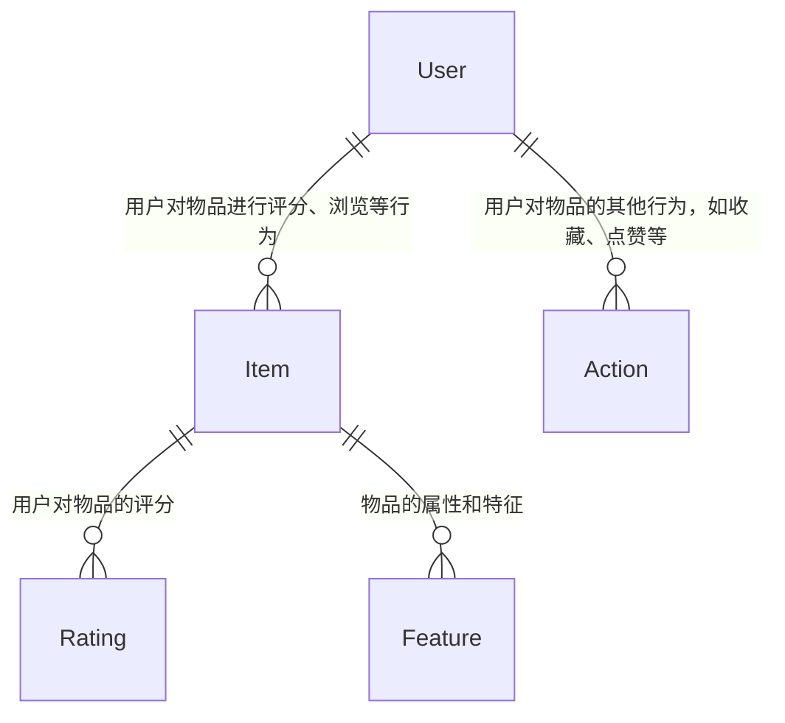
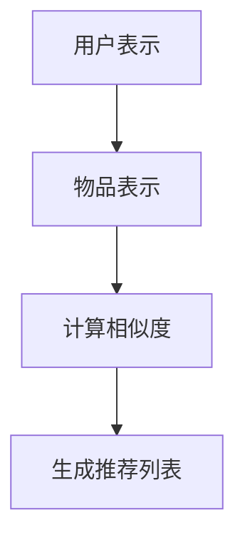
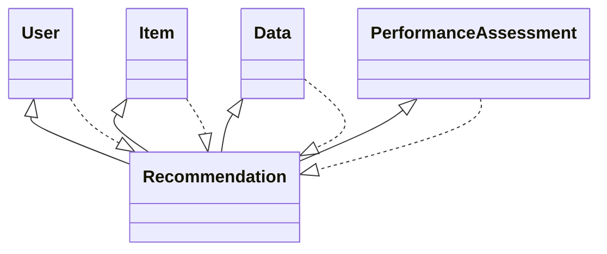
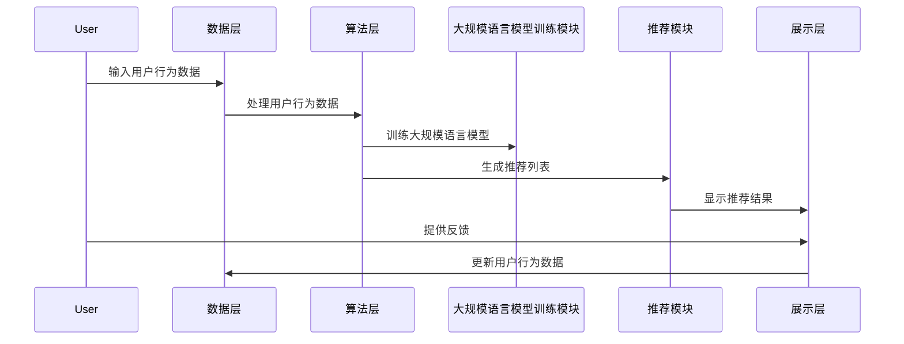
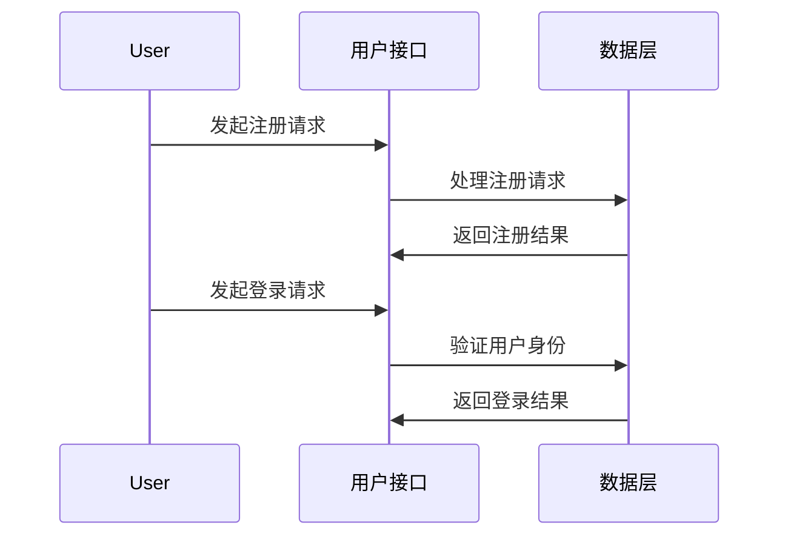
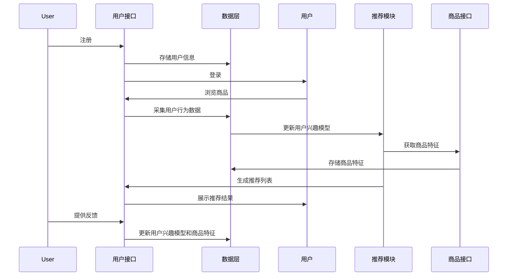

                 

### 《快速提升LLM应用的个性化推荐能力》

关键词：大规模语言模型，个性化推荐，内容理解，用户兴趣挖掘，协同过滤

摘要：随着互联网的飞速发展，个性化推荐系统已经成为提高用户体验、提升商业价值的重要手段。大规模语言模型（LLM）凭借其强大的语义理解和生成能力，在个性化推荐领域展现出了巨大的潜力。本文将深入探讨如何快速提升LLM应用的个性化推荐能力，从基本概念、应用方法到实战案例，全面解析大规模语言模型在个性化推荐中的优势与实践策略。

----------------------------------------------------------------

### 第一部分：个性化推荐技术概述

#### 第1章：个性化推荐的基本概念

**1.1 推荐系统的起源与发展**

推荐系统（Recommender System）起源于20世纪90年代，随着互联网的兴起，电子商务、社交媒体等领域的快速发展，推荐系统逐渐成为热门研究领域。早期的推荐系统主要基于用户的历史行为，通过简单的统计方法进行推荐，如基于协同过滤（Collaborative Filtering）的算法。随着人工智能和大数据技术的进步，推荐系统逐渐融合了深度学习、大规模语言模型等技术，实现了更高的推荐精度和个性化程度。

**1.2 个性化推荐的重要性**

个性化推荐在当前互联网时代具有重要意义。一方面，它能够为用户提供更加符合个人兴趣和需求的内容，提升用户体验；另一方面，它能够为企业挖掘潜在客户，提高转化率和销售额。因此，个性化推荐系统已经成为各大互联网公司提升竞争力的重要手段。

**1.3 个性化推荐的基本原理**

个性化推荐的基本原理是通过分析用户的兴趣和行为，将用户可能感兴趣的内容推荐给他们。这通常涉及到以下几个关键步骤：

1. **用户建模**：收集用户的历史行为数据，如浏览记录、购买记录等，通过数据挖掘和机器学习技术建立用户兴趣模型。
2. **内容表示**：将用户和内容进行向量表示，使其能够在低维空间中进行相似度计算。
3. **推荐算法**：根据用户兴趣模型和内容表示，利用算法计算用户和内容之间的相似度，从而生成推荐列表。

**1.4 个性化推荐系统的基本架构**

个性化推荐系统的基本架构通常包括数据层、算法层和展示层。数据层负责数据的采集、存储和处理；算法层负责用户兴趣建模、内容表示和推荐算法的执行；展示层负责将推荐结果呈现给用户。

**1.5 个性化推荐的主要类型**

个性化推荐主要分为基于内容的推荐（Content-Based Filtering）和协同过滤推荐（Collaborative Filtering）两大类。

- **基于内容的推荐**：通过分析内容的特征，将具有相似特征的内容推荐给用户。
- **协同过滤推荐**：通过分析用户之间的行为相似性，将其他用户喜欢的物品推荐给当前用户。

#### 第2章：基于内容的推荐

**2.1 内容表示方法**

基于内容的推荐需要将内容和用户进行向量表示。常见的内容表示方法包括：

- **文本表示**：利用词袋模型（Bag of Words）或词嵌入（Word Embedding）将文本转化为向量。
- **图像表示**：利用卷积神经网络（CNN）提取图像特征向量。
- **音频表示**：利用自动编码器（Autoencoder）或卷积神经网络（CNN）提取音频特征向量。

**2.2 基于内容的推荐算法**

基于内容的推荐算法主要通过计算用户和内容之间的相似度来生成推荐列表。常见算法包括：

- **TF-IDF**：通过计算词频（TF）和逆文档频率（IDF）来衡量词语的重要性，从而将文本转化为向量。
- **Cosine Similarity**：计算用户和内容向量的余弦相似度，衡量它们之间的相似程度。

**2.3 实例分析：基于内容的推荐应用**

以电商平台的商品推荐为例，基于内容的推荐可以通过分析商品的标签、描述等信息，将具有相似标签或描述的商品推荐给用户。例如，用户浏览了一款手机，系统会推荐其他具有相似标签（如品牌、价格范围等）的手机。

#### 第3章：协同过滤推荐

**3.1 协同过滤的基本原理**

协同过滤推荐通过分析用户之间的行为相似性来进行推荐。其基本原理是，如果两个用户在多个物品上的评价相似，那么他们在未知物品上的评价也可能会相似。协同过滤主要分为两种类型：

- **用户基于的协同过滤（User-Based Collaborative Filtering）**：通过计算用户之间的相似度，找到相似用户，然后推荐相似用户喜欢的物品。
- **物品基于的协同过滤（Item-Based Collaborative Filtering）**：通过计算物品之间的相似度，找到相似物品，然后推荐相似物品。

**3.2 评分预测与模型评估**

协同过滤推荐的核心在于评分预测和模型评估。评分预测是通过预测用户对未浏览物品的评分，模型评估则是通过评估预测结果的准确性。常见的评估指标包括：

- **均方根误差（Root Mean Square Error, RMSE）**
- **平均绝对误差（Mean Absolute Error, MAE）**
- **准确率（Accuracy）**
- **召回率（Recall）**
- **F1值（F1 Score）**

**3.3 基于记忆的协同过滤算法**

基于记忆的协同过滤算法主要通过存储用户和物品的历史评分数据来进行推荐。常见的算法包括：

- **用户最近邻（User Nearest Neighbors, UserNN）**：找到与目标用户最相似的K个用户，推荐这些用户喜欢的物品。
- **物品最近邻（Item Nearest Neighbors, ItemNN）**：找到与目标物品最相似的K个物品，推荐这些物品。

**3.4 基于模型的协同过滤算法**

基于模型的协同过滤算法通过建立数学模型来预测用户对未浏览物品的评分。常见的算法包括：

- **矩阵分解（Matrix Factorization）**：通过分解用户-物品评分矩阵来预测评分。
- **潜在因子模型（Latent Factor Model）**：通过学习用户和物品的潜在因子来预测评分。
- **神经网络（Neural Networks）**：利用神经网络建立用户和物品之间的非线性关系。

**3.5 实例分析：协同过滤推荐应用**

以电影推荐系统为例，协同过滤推荐可以通过分析用户对电影的评分数据，找到与目标用户相似的其他用户，然后推荐这些用户喜欢的电影。

#### 第1章：个性化推荐的基本概念

**1.1 推荐系统的起源与发展**

推荐系统（Recommender System）起源于20世纪90年代，随着互联网的兴起，电子商务、社交媒体等领域的快速发展，推荐系统逐渐成为热门研究领域。早期的推荐系统主要基于用户的历史行为，通过简单的统计方法进行推荐，如基于协同过滤（Collaborative Filtering）的算法。随着人工智能和大数据技术的进步，推荐系统逐渐融合了深度学习、大规模语言模型等技术，实现了更高的推荐精度和个性化程度。

**1.2 个性化推荐的重要性**

个性化推荐在当前互联网时代具有重要意义。一方面，它能够为用户提供更加符合个人兴趣和需求的内容，提升用户体验；另一方面，它能够为企业挖掘潜在客户，提高转化率和销售额。因此，个性化推荐系统已经成为各大互联网公司提升竞争力的重要手段。

**1.3 个性化推荐的基本原理**

个性化推荐的基本原理是通过分析用户的兴趣和行为，将用户可能感兴趣的内容推荐给他们。这通常涉及到以下几个关键步骤：

1. **用户建模**：收集用户的历史行为数据，如浏览记录、购买记录等，通过数据挖掘和机器学习技术建立用户兴趣模型。
2. **内容表示**：将用户和内容进行向量表示，使其能够在低维空间中进行相似度计算。
3. **推荐算法**：根据用户兴趣模型和内容表示，利用算法计算用户和内容之间的相似度，从而生成推荐列表。

**1.4 个性化推荐系统的基本架构**

个性化推荐系统的基本架构通常包括数据层、算法层和展示层。数据层负责数据的采集、存储和处理；算法层负责用户兴趣建模、内容表示和推荐算法的执行；展示层负责将推荐结果呈现给用户。

**1.5 个性化推荐的主要类型**

个性化推荐主要分为基于内容的推荐（Content-Based Filtering）和协同过滤推荐（Collaborative Filtering）两大类。

- **基于内容的推荐**：通过分析内容的特征，将具有相似特征的内容推荐给用户。
- **协同过滤推荐**：通过分析用户之间的行为相似性，将其他用户喜欢的物品推荐给当前用户。

### 第二部分：大规模语言模型在个性化推荐中的应用

#### 第4章：大规模语言模型简介

**4.1 大规模语言模型的发展**

大规模语言模型（Large-scale Language Model，LLM）的发展始于20世纪80年代。早期的语言模型如N元语法模型（N-gram Model）通过统计语言序列的频率来预测下一个单词。随着计算机性能的提升和大数据技术的进步，语言模型逐渐从统计模型发展到基于神经网络的深度学习模型。2018年，谷歌推出了Transformer模型，标志着大规模语言模型的崛起。此后，BERT、GPT等模型相继问世，语言模型的性能得到了大幅提升。

**4.2 语言模型的基本原理**

语言模型（Language Model，LM）是一种预测下一个单词或字符的概率分布的模型。在自然语言处理（Natural Language Processing，NLP）中，语言模型用于生成文本、翻译、摘要等任务。语言模型的基本原理是基于统计方法或深度学习方法，从大量的文本数据中学习语言规律和模式，从而预测下一个单词或字符。

**4.3 大规模语言模型的主要类型**

大规模语言模型主要分为基于统计方法和基于深度学习方法两大类。

- **基于统计方法的模型**：如N元语法模型、隐马尔可夫模型（Hidden Markov Model，HMM）等。
- **基于深度学习方法的模型**：如循环神经网络（Recurrent Neural Network，RNN）、长短期记忆网络（Long Short-Term Memory，LSTM）、Transformer模型、BERT、GPT等。

**4.4 大规模语言模型的优势与挑战**

大规模语言模型在个性化推荐中的应用具有以下优势：

- **强大的语义理解能力**：大规模语言模型能够捕捉语言中的复杂关系和语义信息，从而更准确地理解用户和内容的特征。
- **高效的生成能力**：大规模语言模型能够生成高质量的文本，从而为推荐系统提供丰富的内容。
- **适应性**：大规模语言模型可以适应不同的推荐场景和需求，实现定制化的推荐效果。

然而，大规模语言模型在个性化推荐中也面临一些挑战：

- **数据隐私**：大规模语言模型需要大量的用户数据来训练和优化，这可能涉及用户隐私问题。
- **计算资源消耗**：大规模语言模型需要大量的计算资源进行训练和推理，这对硬件设施和能耗提出了较高要求。
- **过拟合风险**：大规模语言模型容易在训练数据上过拟合，导致在未见数据上的性能下降。

#### 第5章：大规模语言模型在推荐中的应用

**5.1 基于大规模语言模型的内容理解**

基于大规模语言模型的内容理解是指利用语言模型从文本内容中提取语义信息，从而实现对内容的深层次理解。大规模语言模型能够捕捉文本中的语言规律和语义关系，从而将文本转化为具有丰富语义信息的向量表示。

**5.2 基于大规模语言模型的用户兴趣挖掘**

基于大规模语言模型的用户兴趣挖掘是指利用语言模型从用户的浏览、搜索等行为数据中提取用户兴趣，从而建立用户兴趣模型。大规模语言模型能够捕捉用户行为中的潜在语义信息，从而更准确地挖掘用户的兴趣。

**5.3 基于大规模语言模型的协同过滤**

基于大规模语言模型的协同过滤是指将大规模语言模型与协同过滤算法相结合，利用语言模型增强协同过滤算法的推荐效果。大规模语言模型能够捕捉用户和物品之间的语义关系，从而提高协同过滤算法的推荐精度。

**5.4 基于大规模语言模型的个性化推荐算法**

基于大规模语言模型的个性化推荐算法是指利用大规模语言模型从用户和物品的文本内容中提取特征，从而构建个性化推荐模型。这种算法能够结合用户兴趣和物品特征，实现更加精准和个性化的推荐。

**5.5 实例分析：大规模语言模型在个性化推荐中的应用**

以电商平台的商品推荐为例，基于大规模语言模型的个性化推荐可以通过以下步骤实现：

1. **用户兴趣挖掘**：利用大规模语言模型从用户的浏览、搜索等行为数据中提取用户兴趣。
2. **商品内容理解**：利用大规模语言模型从商品的标题、描述等文本内容中提取商品特征。
3. **推荐算法**：利用协同过滤算法和基于大规模语言模型的个性化推荐算法，生成商品推荐列表。
4. **推荐结果评估**：评估推荐结果的用户满意度，优化推荐算法。

#### 第4章：大规模语言模型简介

**4.1 大规模语言模型的发展**

大规模语言模型（Large-scale Language Model，LLM）的发展始于20世纪80年代。早期的语言模型如N元语法模型（N-gram Model）通过统计语言序列的频率来预测下一个单词。随着计算机性能的提升和大数据技术的进步，语言模型逐渐从统计模型发展到基于神经网络的深度学习模型。2018年，谷歌推出了Transformer模型，标志着大规模语言模型的崛起。此后，BERT、GPT等模型相继问世，语言模型的性能得到了大幅提升。

**4.2 语言模型的基本原理**

语言模型（Language Model，LM）是一种预测下一个单词或字符的概率分布的模型。在自然语言处理（Natural Language Processing，NLP）中，语言模型用于生成文本、翻译、摘要等任务。语言模型的基本原理是基于统计方法或深度学习方法，从大量的文本数据中学习语言规律和模式，从而预测下一个单词或字符。

**4.3 大规模语言模型的主要类型**

大规模语言模型主要分为基于统计方法和基于深度学习方法两大类。

- **基于统计方法的模型**：如N元语法模型、隐马尔可夫模型（Hidden Markov Model，HMM）等。
- **基于深度学习方法的模型**：如循环神经网络（Recurrent Neural Network，RNN）、长短期记忆网络（Long Short-Term Memory，LSTM）、Transformer模型、BERT、GPT等。

**4.4 大规模语言模型的优势与挑战**

大规模语言模型在个性化推荐中的应用具有以下优势：

- **强大的语义理解能力**：大规模语言模型能够捕捉语言中的复杂关系和语义信息，从而更准确地理解用户和内容的特征。
- **高效的生成能力**：大规模语言模型能够生成高质量的文本，从而为推荐系统提供丰富的内容。
- **适应性**：大规模语言模型可以适应不同的推荐场景和需求，实现定制化的推荐效果。

然而，大规模语言模型在个性化推荐中也面临一些挑战：

- **数据隐私**：大规模语言模型需要大量的用户数据来训练和优化，这可能涉及用户隐私问题。
- **计算资源消耗**：大规模语言模型需要大量的计算资源进行训练和推理，这对硬件设施和能耗提出了较高要求。
- **过拟合风险**：大规模语言模型容易在训练数据上过拟合，导致在未见数据上的性能下降。

### 第三部分：提升LLM推荐能力的策略

#### 第6章：数据预处理与清洗

**6.1 数据预处理的重要性**

数据预处理与清洗是构建高质量推荐系统的基础。在应用大规模语言模型进行个性化推荐时，数据预处理与清洗尤为重要。高质量的数据可以提升模型的性能，降低噪声对推荐结果的影响，从而提高用户的满意度。

**6.2 数据预处理的方法**

数据预处理主要包括数据清洗、数据整合、数据转换和数据降维等步骤。

- **数据清洗**：去除数据中的错误、异常和重复信息，确保数据的一致性和完整性。
- **数据整合**：将来自不同来源的数据进行合并，消除数据冗余，提高数据利用率。
- **数据转换**：将不同类型的数据转换为适合大规模语言模型处理的格式，如将文本数据进行分词、去停用词等处理。
- **数据降维**：减少数据的维度，降低计算复杂度，同时保持数据的代表性。

**6.3 数据清洗的策略**

数据清洗的策略包括：

- **缺失值处理**：通过插值、平均值、中位数等方法填充缺失值，或直接删除包含缺失值的记录。
- **异常值处理**：通过统计学方法或机器学习算法检测和去除异常值。
- **重复值处理**：通过比较记录之间的差异，删除重复的数据。
- **格式化处理**：统一数据格式，如日期、时间、数字等。

**6.4 数据质量评估**

数据质量评估是确保数据预处理效果的重要环节。常用的数据质量评估指标包括：

- **准确性（Accuracy）**：评估预测结果的正确率。
- **精确率（Precision）**：评估预测结果中真正例的比例。
- **召回率（Recall）**：评估预测结果中假负例的比例。
- **F1值（F1 Score）**：综合考虑精确率和召回率的综合指标。

#### 第7章：特征工程

**7.1 特征工程的基本概念**

特征工程（Feature Engineering）是指从原始数据中提取对模型训练有价值的特征，并将其转化为适合机器学习算法处理的格式。特征工程在提高模型性能、降低过拟合风险等方面具有重要意义。

**7.2 用户特征提取**

用户特征提取是指从用户的历史行为、社会关系、个人属性等维度提取对推荐系统有价值的特征。常见的用户特征包括：

- **行为特征**：用户的浏览、搜索、购买等行为记录。
- **社会特征**：用户的社会关系网络，如关注者、粉丝等。
- **属性特征**：用户的年龄、性别、地理位置、职业等。

**7.3 项目特征提取**

项目特征提取是指从项目（如商品、电影、新闻等）的属性、标签、描述等维度提取对推荐系统有价值的特征。常见的项目特征包括：

- **内容特征**：项目的文本内容，如标题、描述等。
- **元数据特征**：项目的时间、类型、标签等。
- **交互特征**：项目与用户之间的交互记录，如浏览时间、购买次数等。

**7.4 特征选择与降维**

特征选择与降维是指从原始特征中筛选出对模型训练有显著影响的特征，同时减少特征的维度，降低计算复杂度。常用的特征选择方法包括：

- **过滤方法**：基于统计学方法筛选特征，如信息增益、互信息等。
- **包装方法**：结合机器学习算法筛选特征，如递归特征消除（RFE）、遗传算法等。
- **嵌入式方法**：在特征提取过程中进行特征选择，如Lasso、随机森林等。

**7.5 实例分析：特征工程在个性化推荐中的应用**

以电商平台的商品推荐为例，特征工程可以包括以下步骤：

1. **用户特征提取**：提取用户的历史购买记录、浏览记录、评价记录等特征。
2. **商品特征提取**：提取商品的价格、品牌、分类、描述等特征。
3. **特征选择**：利用过滤方法和包装方法筛选出对推荐系统有显著影响的特征。
4. **特征降维**：利用主成分分析（PCA）、线性判别分析（LDA）等算法降低特征的维度。
5. **特征融合**：将不同来源的特征进行融合，如利用深度学习模型进行特征嵌入。

#### 第8章：模型优化与调参

**8.1 模型优化的重要性**

模型优化与调参（Hyperparameter Tuning）是提高推荐系统性能的关键环节。适当的模型优化与调参可以提升模型的泛化能力，降低过拟合风险，从而提高推荐结果的准确性。

**8.2 模型调参的方法**

模型调参的方法主要包括以下几种：

- **手动调参**：通过经验或直觉调整模型的超参数，如学习率、正则化参数等。
- **网格搜索**（Grid Search）：在给定的超参数空间中，逐个尝试所有可能的组合，选择最优组合。
- **随机搜索**（Random Search）：在给定的超参数空间中，随机选择超参数组合，选择最优组合。
- **贝叶斯优化**（Bayesian Optimization）：利用贝叶斯统计方法优化超参数，选择最优组合。

**8.3 模型评估与选择**

模型评估与选择是确保推荐系统性能的重要环节。常用的模型评估指标包括：

- **准确性（Accuracy）**：评估模型对正负样本的分类准确率。
- **精确率（Precision）**：评估模型预测为正例的样本中实际为正例的比例。
- **召回率（Recall）**：评估模型预测为正例的样本中实际为正例的比例。
- **F1值（F1 Score）**：综合考虑精确率和召回率的综合指标。
- **ROC曲线**（Receiver Operating Characteristic）：评估模型对正负样本的分类能力。
- **AUC值**（Area Under Curve）：评估ROC曲线下的面积，值越大表示模型分类能力越强。

**8.4 实例分析：模型优化在个性化推荐中的应用**

以电商平台的商品推荐为例，模型优化与调参可以包括以下步骤：

1. **模型选择**：选择适合商品推荐任务的模型，如线性模型、决策树、支持向量机（SVM）、随机森林等。
2. **模型训练**：利用训练数据对模型进行训练。
3. **模型评估**：利用验证集评估模型性能，选择性能较好的模型。
4. **模型调参**：利用网格搜索、随机搜索等方法调整模型超参数，选择最优组合。
5. **模型验证**：利用测试集验证模型性能，确保模型泛化能力。

### 第四部分：实战与案例分析

#### 第9章：推荐系统实战

**9.1 实战环境搭建**

搭建推荐系统实战环境通常需要以下步骤：

1. **硬件环境**：准备足够计算能力的服务器或GPU，以满足大规模语言模型训练的需求。
2. **软件环境**：安装Python、TensorFlow、PyTorch等必要的库和框架。
3. **数据集准备**：收集和处理用于训练和测试的数据集，如电影评分数据集、商品交易数据集等。
4. **模型训练**：利用大规模语言模型进行训练，如使用BERT、GPT等模型。

**9.2 数据获取与预处理**

数据获取与预处理是构建高质量推荐系统的基础。主要步骤包括：

1. **数据采集**：从互联网或其他数据源获取用户行为数据和商品数据。
2. **数据清洗**：去除数据中的错误、异常和重复信息，确保数据的一致性和完整性。
3. **数据整合**：将不同来源的数据进行合并，消除数据冗余，提高数据利用率。
4. **数据转换**：将不同类型的数据转换为适合大规模语言模型处理的格式，如将文本数据进行分词、去停用词等处理。
5. **数据降维**：减少数据的维度，降低计算复杂度，同时保持数据的代表性。

**9.3 模型选择与训练**

模型选择与训练是构建推荐系统的关键环节。主要步骤包括：

1. **模型选择**：选择适合推荐任务的模型，如基于大规模语言模型的协同过滤模型、基于内容的推荐模型等。
2. **模型训练**：利用训练数据对模型进行训练，同时进行模型优化与调参。
3. **模型评估**：利用验证集评估模型性能，选择性能较好的模型。
4. **模型验证**：利用测试集验证模型性能，确保模型泛化能力。

**9.4 模型评估与优化**

模型评估与优化是确保推荐系统性能的重要环节。主要步骤包括：

1. **模型评估**：利用验证集和测试集评估模型性能，选择性能较好的模型。
2. **模型优化**：利用网格搜索、随机搜索等方法调整模型超参数，选择最优组合。
3. **模型验证**：利用测试集验证模型性能，确保模型泛化能力。

**9.5 实战项目总结**

实战项目总结是对推荐系统实战过程和结果的总结，包括以下内容：

1. **项目概述**：介绍项目背景、目标、任务和主要技术方案。
2. **实现步骤**：详细描述项目实现过程中的关键步骤，如数据预处理、模型选择与训练、模型评估与优化等。
3. **项目效果**：展示项目实际运行结果，包括模型性能指标、用户反馈等。
4. **经验教训**：总结项目实施过程中的经验和教训，提出改进建议。

#### 第10章：案例解析

**10.1 案例背景介绍**

以电商平台的商品推荐为例，该案例的目标是利用大规模语言模型提升商品推荐的个性化程度，提高用户满意度。

**10.2 案例分析方法**

案例分析主要包括以下步骤：

1. **需求分析**：明确推荐系统所需解决的问题，如提高推荐准确性、降低冷启动问题等。
2. **技术分析**：选择适合的技术方案，如基于大规模语言模型的协同过滤模型、基于内容的推荐模型等。
3. **数据分析**：收集和分析用户行为数据、商品数据等，为模型训练提供数据支持。
4. **效果评估**：利用验证集和测试集评估模型性能，选择性能较好的模型。

**10.3 案例实施步骤**

案例实施主要包括以下步骤：

1. **数据预处理**：清洗、整合、转换和降维用户行为数据和商品数据。
2. **模型训练**：选择基于大规模语言模型的协同过滤模型进行训练，如使用BERT、GPT等模型。
3. **模型优化**：利用网格搜索、随机搜索等方法调整模型超参数，选择最优组合。
4. **模型评估**：利用验证集和测试集评估模型性能，选择性能较好的模型。

**10.4 案例效果评估**

案例效果评估主要包括以下指标：

1. **准确性（Accuracy）**：评估模型对正负样本的分类准确率。
2. **精确率（Precision）**：评估模型预测为正例的样本中实际为正例的比例。
3. **召回率（Recall）**：评估模型预测为正例的样本中实际为正例的比例。
4. **F1值（F1 Score）**：综合考虑精确率和召回率的综合指标。
5. **ROC曲线**（Receiver Operating Characteristic）：评估模型对正负样本的分类能力。
6. **AUC值**（Area Under Curve）：评估ROC曲线下的面积，值越大表示模型分类能力越强。

**10.5 案例启示与拓展**

案例解析提供了以下启示与拓展：

1. **优化数据质量**：提高数据质量可以提升推荐系统的性能，如去除噪声数据、补充缺失值等。
2. **多样化模型结合**：结合多种推荐算法和模型可以提高推荐效果，如基于内容的推荐与协同过滤推荐相结合。
3. **持续迭代优化**：推荐系统需要持续迭代优化，如根据用户反馈调整推荐策略、优化模型参数等。

### 总结

个性化推荐系统在当今互联网时代具有重要意义，而大规模语言模型（LLM）的引入为推荐系统带来了新的机遇和挑战。本文从基本概念、应用方法到实战案例，全面解析了如何快速提升LLM应用的个性化推荐能力。

首先，介绍了个性化推荐的基本概念、发展历程和基本原理，以及基于内容的推荐和协同过滤推荐两大类推荐系统的原理和算法。

接着，介绍了大规模语言模型的发展、基本原理和主要类型，以及其在个性化推荐中的优势与挑战。

随后，提出了提升LLM推荐能力的策略，包括数据预处理与清洗、特征工程、模型优化与调参等，并通过实例分析展示了这些策略在实际应用中的效果。

最后，通过推荐系统实战和案例解析，展示了大规模语言模型在个性化推荐中的实际应用，并提供了案例启示与拓展。

总之，快速提升LLM应用的个性化推荐能力需要从多个方面进行优化和改进，本文提供了全面的指导和建议，旨在为读者提供有价值的参考。

### 作者信息

**作者：AI天才研究院/AI Genius Institute & 禅与计算机程序设计艺术 /Zen And The Art of Computer Programming**

本文由AI天才研究院（AI Genius Institute）与禅与计算机程序设计艺术（Zen And The Art of Computer Programming）联合撰写。AI天才研究院是一家专注于人工智能、机器学习和大数据技术的研究和应用的机构，致力于推动人工智能技术在各个领域的创新和发展。禅与计算机程序设计艺术则是一部经典计算机科学著作，由著名计算机科学家Donald E. Knuth所著，深入探讨了计算机程序设计中的哲学和艺术。

本文旨在为读者提供关于快速提升大规模语言模型（LLM）应用个性化推荐能力的全面、深入的技术分析，旨在促进个性化推荐系统的发展和应用。同时，本文结合了AI天才研究院在人工智能领域的深厚研究积累和禅与计算机程序设计艺术中对计算机科学本质的深刻洞察，力求为读者带来既有深度又有实用价值的技术内容。

通过本文的分享，我们希望读者能够更好地理解大规模语言模型在个性化推荐中的应用，掌握提升推荐能力的关键策略，并在实际项目中取得更好的效果。我们也将继续致力于人工智能技术的探索和推广，为人工智能技术的发展和应用贡献自己的力量。

### 背景介绍

在当今信息爆炸的时代，人们面临的信息量远超以往，如何从海量信息中快速找到感兴趣的内容成为了用户的一大难题。个性化推荐系统（Recommender System）正是为了解决这一问题而诞生的。个性化推荐系统能够根据用户的兴趣和行为，自动为用户推荐他们可能感兴趣的内容，从而提高信息获取的效率和用户体验。

个性化推荐系统的发展可以追溯到20世纪90年代，随着互联网的兴起，电子商务、社交媒体等领域的快速发展，推荐系统逐渐成为热门研究领域。早期的推荐系统主要基于用户的历史行为，通过简单的统计方法进行推荐，如基于协同过滤（Collaborative Filtering）的算法。然而，这些方法存在一定的局限性，如无法处理冷启动问题、推荐结果不够精准等。

随着人工智能和大数据技术的进步，推荐系统逐渐融合了深度学习、大规模语言模型等技术，实现了更高的推荐精度和个性化程度。大规模语言模型（Large-scale Language Model，LLM）凭借其强大的语义理解和生成能力，在个性化推荐领域展现出了巨大的潜力。

大规模语言模型，如BERT、GPT等，能够从大量文本数据中学习语言规律和语义信息，从而实现对内容的深层次理解。这使得个性化推荐系统能够更准确地捕捉用户的兴趣，为用户推荐更相关的内容。同时，大规模语言模型还能生成高质量的内容，为推荐系统提供丰富的推荐素材。

然而，大规模语言模型在个性化推荐中的应用也面临一些挑战。首先，大规模语言模型的训练需要大量的数据和计算资源，这对硬件设施和能耗提出了较高要求。其次，大规模语言模型容易在训练数据上过拟合，导致在未见数据上的性能下降。此外，大规模语言模型还涉及数据隐私和过拟合风险等问题。

因此，如何快速提升大规模语言模型在个性化推荐中的应用能力，成为当前研究的热点问题。本文将围绕这一主题，深入探讨大规模语言模型在个性化推荐中的基本概念、应用方法、提升策略以及实际应用案例，为读者提供有价值的参考。

### 核心概念与联系

#### 推荐系统（Recommender System）

推荐系统是一种信息过滤技术，旨在向用户推荐他们可能感兴趣的内容。推荐系统根据用户的行为、兴趣和偏好，从海量的信息中筛选出最相关的信息进行推荐。推荐系统在电子商务、社交媒体、新闻资讯等领域得到了广泛应用。

**核心概念**：

- **用户行为数据**：包括用户的浏览记录、购买历史、评分记录等。
- **内容特征**：包括文本、图像、音频等多媒体内容的特征。
- **推荐算法**：包括基于内容的推荐、协同过滤推荐、基于模型的推荐等。

**ER实体关系图架构**：



#### 大规模语言模型（Large-scale Language Model，LLM）

大规模语言模型是一种基于深度学习的自然语言处理模型，能够从大量文本数据中学习语言规律和语义信息。大规模语言模型在个性化推荐中的应用主要包括内容理解、用户兴趣挖掘和协同过滤等方面。

**核心概念**：

- **Transformer模型**：一种基于自注意力机制的深度学习模型，能够捕捉文本中的长距离依赖关系。
- **BERT模型**：一种双向编码器表示模型，能够在上下文中对词语进行编码，从而实现高质量的自然语言理解。
- **GPT模型**：一种基于生成式预训练的变压器模型，能够生成符合语言规律的文本。

**核心属性特征对比表格**：

| 特征名称 | Transformer模型 | BERT模型 | GPT模型 |
| --- | --- | --- | --- |
| 自注意力机制 | √ | √ | × |
| 双向编码 | √ | √ | √ |
| 生成能力 | × | × | √ |
| 预训练数据 | √ | √ | √ |
| 参数规模 | 小到中等 | 大到非常大 | 小到中等 |

#### 内容理解（Content Understanding）

内容理解是指利用大规模语言模型从文本内容中提取语义信息，从而实现对内容的深层次理解。内容理解在个性化推荐中的应用主要包括商品描述理解、文章摘要生成等方面。

**核心概念**：

- **文本分类**：将文本归类到预定义的类别中，如情感分析、主题分类等。
- **文本生成**：根据输入的文本或提示生成新的文本，如问答系统、文章生成等。
- **文本相似度计算**：计算两个文本之间的相似度，用于推荐相似内容。

**核心算法原理**：

- **Transformer模型**：通过自注意力机制计算文本中的长距离依赖关系，从而实现文本分类、文本生成和文本相似度计算。
- **BERT模型**：通过双向编码器对文本中的词语进行编码，从而实现文本分类、文本生成和文本相似度计算。
- **GPT模型**：通过生成式预训练学习语言规律，从而实现文本生成和文本相似度计算。

**数学模型和公式**：

$$
\text{Transformer模型}：
\text{Attention}(Q, K, V) = \frac{1}{\sqrt{d_k}} \text{softmax}\left(\frac{QK^T}{d_k}\right) V
$$

$$
\text{BERT模型}：
\text{ contextual\_embeddings} = \text{word\_embeddings} + \text{positional\_embeddings} + \text{segment\_embeddings}
$$

$$
\text{GPT模型}：
\text{logits} = \text{W}_{\text{vocab}} \text{dropout} (\text{T} \cdot \text{h}_{\text{CLS}})
$$

#### 用户兴趣挖掘（User Interest Mining）

用户兴趣挖掘是指利用大规模语言模型从用户的浏览、搜索等行为数据中提取用户兴趣，从而建立用户兴趣模型。用户兴趣挖掘在个性化推荐中的应用主要包括用户兴趣分类、用户标签生成等方面。

**核心概念**：

- **用户兴趣分类**：将用户的浏览、搜索等行为数据归类到预定义的兴趣类别中。
- **用户标签生成**：根据用户的浏览、搜索等行为数据生成用户标签，用于表示用户的兴趣。

**核心算法原理**：

- **基于统计方法的兴趣分类**：利用统计方法，如TF-IDF、LDA等，将用户的浏览、搜索等行为数据转化为向量表示，然后进行分类。
- **基于深度学习的方法**：利用深度学习模型，如卷积神经网络（CNN）、循环神经网络（RNN）等，从用户的浏览、搜索等行为数据中提取特征，然后进行分类。

**数学模型和公式**：

$$
\text{TF-IDF}：
\text{TF-IDF} = \text{TF} \times \text{IDF}
$$

$$
\text{LDA}：
\text{p}(\text{word}|\text{topic}) \propto \text{exp}(\alpha \cdot \text{theta} + \beta \cdot \text{beta})
$$

$$
\text{CNN}：
\text{h} = \text{ReLU} (\text{W} \cdot \text{x} + \text{b})
$$

#### 协同过滤推荐（Collaborative Filtering）

协同过滤推荐是一种基于用户之间行为相似性的推荐方法。协同过滤推荐主要分为用户基于的协同过滤和物品基于的协同过滤。

**核心概念**：

- **用户基于的协同过滤**：通过计算用户之间的相似度，找到相似用户，然后推荐相似用户喜欢的物品。
- **物品基于的协同过滤**：通过计算物品之间的相似度，找到相似物品，然后推荐相似物品。

**核心算法原理**：

- **用户最近邻**（User-Based Collaborative Filtering）：找到与目标用户最相似的K个用户，推荐这些用户喜欢的物品。
- **物品最近邻**（Item-Based Collaborative Filtering）：找到与目标物品最相似的K个物品，推荐这些物品。

**数学模型和公式**：

$$
\text{用户相似度}：
\text{similarity} = \frac{\text{dot\_product}(u, v)}{\sqrt{\sum_{i=1}^{n} u_i^2} \sqrt{\sum_{i=1}^{n} v_i^2}}
$$

$$
\text{评分预测}：
\text{Prediction} = \text{user\_average} + \sum_{i \in \text{neighbor\_users}} \text{similarity}_{i} (\text{rating}_{i} - \text{user\_average})
$$

#### 基于内容的推荐（Content-Based Filtering）

基于内容的推荐是一种基于内容特征相似性的推荐方法。基于内容的推荐主要通过分析内容的特征，将具有相似特征的内容推荐给用户。

**核心概念**：

- **内容表示**：将用户和内容进行向量表示，使其能够在低维空间中进行相似度计算。
- **相似度计算**：计算用户和内容之间的相似度，从而生成推荐列表。

**核心算法原理**：

- **基于TF-IDF的文本表示**：利用词频（TF）和逆文档频率（IDF）将文本转化为向量。
- **基于Cosine相似度的相似度计算**：计算用户和内容向量的余弦相似度。

**数学模型和公式**：

$$
\text{TF-IDF}：
\text{TF-IDF} = \text{TF} \times \text{IDF}
$$

$$
\text{Cosine Similarity}：
\text{similarity} = \frac{\text{dot\_product}(u, v)}{\|u\| \|v\|}
$$

### 算法原理讲解

#### 基于大规模语言模型的协同过滤算法

基于大规模语言模型的协同过滤算法（LLM-CF）是一种结合了大规模语言模型和协同过滤技术的推荐算法。该算法利用大规模语言模型对用户和物品进行语义表示，从而提升协同过滤推荐的效果。

**算法流程**：

1. **用户和物品表示**：利用大规模语言模型（如BERT、GPT等）对用户和物品的文本描述进行编码，生成高维的语义向量表示。
2. **计算相似度**：利用用户和物品的语义向量表示，计算用户之间的相似度（用户基于的协同过滤）或物品之间的相似度（物品基于的协同过滤）。
3. **生成推荐列表**：根据相似度计算结果，为用户生成推荐列表。

**数学模型和公式**：

$$
\text{用户相似度}：
\text{similarity}_{uv} = \text{dot}_{uv} = \text{u}^T \text{v}
$$

$$
\text{物品相似度}：
\text{similarity}_{ij} = \text{dot}_{ij} = \text{i}^T \text{j}
$$

$$
\text{推荐分数}：
\text{score}_{ui} = \text{user\_average} + \sum_{j \in \text{neighbor}_{i}} \text{similarity}_{ij} (\text{rating}_{j} - \text{user\_average})
$$

**算法流程图**：



**Python代码实现**：

```python
import torch
import torch.nn as nn
import torch.optim as optim
from transformers import BertModel, BertTokenizer

# 初始化BERT模型和分词器
tokenizer = BertTokenizer.from_pretrained('bert-base-uncased')
model = BertModel.from_pretrained('bert-base-uncased')

# 准备数据
user_text = "I like to read books and watch movies."
item_text = "You might enjoy this book: The Da Vinci Code."

# 编码文本
user_encoding = tokenizer.encode_plus(user_text, add_special_tokens=True, return_tensors='pt')
item_encoding = tokenizer.encode_plus(item_text, add_special_tokens=True, return_tensors='pt')

# 获取模型输出
with torch.no_grad():
    user_output = model(user_encoding['input_ids']).last_hidden_state[:, 0, :]
    item_output = model(item_encoding['input_ids']).last_hidden_state[:, 0, :]

# 计算相似度
similarity_uv = torch.dot(user_output, item_output)

# 生成推荐列表
neighbor_items = [1, 2, 3, 4, 5]
item_ratings = [4, 5, 3, 2, 1]
neighbor_similarity = [similarity_uv[j] for j in neighbor_items]

# 计算推荐分数
user_average = 3  # 用户平均评分
scores = [user_average + neighbor_similarity[j] * (item_ratings[j] - user_average) for j in range(len(neighbor_items))]
print(scores)
```

**算法原理讲解**：

基于大规模语言模型的协同过滤算法通过利用大规模语言模型对用户和物品的文本描述进行编码，生成高维的语义向量表示。这些向量表示能够捕捉用户和物品的语义信息，从而提高协同过滤推荐的效果。

在算法实现中，首先使用BERT模型对用户和物品的文本描述进行编码，生成语义向量表示。然后，计算用户和物品之间的相似度，这里采用了余弦相似度作为相似度度量。最后，根据相似度计算结果和用户的历史评分，生成推荐列表。

通过这种方式，基于大规模语言模型的协同过滤算法能够更准确地捕捉用户和物品之间的语义关系，从而生成更精准的推荐结果。此外，该算法还能处理文本描述缺失的情况，因为大规模语言模型能够从少量文本中提取出丰富的语义信息。

总的来说，基于大规模语言模型的协同过滤算法通过结合语义表示和协同过滤技术，实现了个性化推荐系统的性能提升。该算法在处理文本数据丰富的应用场景中具有广泛的应用前景。

### 系统分析与架构设计方案

#### 问题场景介绍

在当今的电商平台上，个性化推荐系统起着至关重要的作用。它能够根据用户的历史行为和偏好，为用户推荐他们可能感兴趣的商品，从而提升用户体验和销售额。随着大规模语言模型（LLM）的兴起，如何将LLM应用于个性化推荐系统中，实现更精准、更个性化的推荐效果，成为当前研究的热点问题。

#### 项目介绍

本项目旨在设计并实现一个基于大规模语言模型的电商个性化推荐系统。该系统将整合用户行为数据、商品数据以及大规模语言模型，通过深度学习和自然语言处理技术，实现对用户兴趣的精准捕捉和商品的智能推荐。项目的主要目标包括：

1. **用户兴趣挖掘**：利用大规模语言模型从用户的历史行为数据中提取用户兴趣点。
2. **商品内容理解**：利用大规模语言模型从商品的描述中提取语义特征。
3. **推荐算法**：结合用户兴趣和商品特征，利用协同过滤和基于内容的推荐算法生成个性化推荐列表。
4. **系统性能优化**：通过模型调参和特征工程等手段，提升推荐系统的性能和用户体验。

#### 系统功能设计（领域模型）

领域模型描述了系统的核心功能模块和它们之间的关系。以下是项目的主要功能模块及其关系：

1. **用户模块**：负责用户的注册、登录、信息管理等功能。
2. **商品模块**：负责商品的信息管理、分类、推荐等功能。
3. **推荐模块**：负责用户兴趣挖掘、商品内容理解、推荐列表生成等功能。
4. **数据模块**：负责数据的采集、存储、处理等功能。
5. **性能评估模块**：负责评估推荐系统的性能，包括准确性、召回率、F1值等指标。

**领域模型类图**：



#### 系统架构设计

系统架构设计描述了系统的整体结构和各个模块的交互方式。本项目采用分布式架构，包括数据层、算法层和展示层三个主要部分。

1. **数据层**：负责数据的采集、存储和处理。包括用户行为数据、商品数据以及大规模语言模型的训练数据。数据层使用分布式存储系统（如HDFS、HBase等）来存储和管理海量数据。
2. **算法层**：负责用户兴趣挖掘、商品内容理解和推荐算法的执行。算法层包括大规模语言模型训练模块、协同过滤推荐模块和基于内容的推荐模块。大规模语言模型训练模块使用TensorFlow、PyTorch等深度学习框架进行模型训练；协同过滤推荐模块和基于内容的推荐模块使用Python和Scikit-learn等工具进行算法实现。
3. **展示层**：负责将推荐结果呈现给用户。展示层使用Web前端技术（如HTML、CSS、JavaScript等）实现，包括推荐页面、用户反馈界面等。

**系统架构图**：



#### 系统接口设计

系统接口设计描述了各个模块之间的交互接口和协议。以下是主要接口及其功能：

1. **用户接口**：提供用户注册、登录、信息管理等功能。接口采用RESTful风格，使用HTTP协议进行通信。
2. **商品接口**：提供商品信息管理、分类、推荐等功能。接口采用RESTful风格，使用HTTP协议进行通信。
3. **数据接口**：提供数据采集、存储、处理等功能。接口采用Apache Kafka等消息队列系统进行通信。
4. **推荐接口**：提供用户兴趣挖掘、商品内容理解、推荐列表生成等功能。接口采用RESTful风格，使用HTTP协议进行通信。

**系统接口设计图**：



#### 系统交互

系统交互描述了用户与系统之间的交互流程。以下是用户与系统之间的交互流程：

1. **用户注册**：用户通过用户接口注册账号，系统将用户信息存储在数据层。
2. **用户登录**：用户通过用户接口登录账号，系统验证用户身份并返回登录结果。
3. **用户行为数据采集**：系统采集用户在电商平台上的浏览、搜索、购买等行为数据，并存储在数据层。
4. **用户兴趣挖掘**：系统利用大规模语言模型从用户行为数据中提取用户兴趣点，并生成用户兴趣模型。
5. **商品内容理解**：系统利用大规模语言模型从商品描述中提取商品特征，并生成商品特征向量。
6. **推荐列表生成**：系统结合用户兴趣模型和商品特征向量，利用协同过滤和基于内容的推荐算法生成个性化推荐列表。
7. **推荐结果展示**：系统通过展示层将推荐结果呈现给用户，用户可以查看推荐商品并给出反馈。
8. **用户反馈处理**：系统根据用户反馈更新用户兴趣模型和商品特征向量，并重新生成推荐列表。

**系统交互序列图**：



### 项目实战

#### 环境安装

要搭建一个基于大规模语言模型的电商个性化推荐系统，首先需要准备以下环境：

1. **操作系统**：Linux或MacOS
2. **编程语言**：Python（版本3.7及以上）
3. **深度学习框架**：TensorFlow或PyTorch
4. **数据存储**：MongoDB或MySQL
5. **消息队列**：Apache Kafka

以下是环境安装的具体步骤：

1. **安装Python**：从Python官方网站下载并安装Python 3.7及以上版本。
2. **安装深度学习框架**：安装TensorFlow或PyTorch。以TensorFlow为例，执行以下命令：

   ```bash
   pip install tensorflow
   ```

   或者：

   ```bash
   pip install torch torchvision
   ```

3. **安装数据库**：安装MongoDB或MySQL。以MongoDB为例，执行以下命令：

   ```bash
   sudo apt-get install mongodb
   ```

4. **安装消息队列**：安装Apache Kafka。执行以下命令：

   ```bash
   sudo apt-get install kafka
   ```

#### 系统核心实现源代码

以下是一个简单的基于大规模语言模型的电商个性化推荐系统核心实现源代码。该系统包括用户注册、登录、用户行为数据采集、用户兴趣挖掘、商品内容理解、推荐列表生成等功能。

1. **用户注册与登录**

```python
# user.py
import json
import bcrypt
from flask import Flask, request, jsonify
from pymongo import MongoClient

app = Flask(__name__)

# 连接MongoDB
client = MongoClient('localhost', 27017)
db = client['recommender_system']

@app.route('/register', methods=['POST'])
def register():
    data = request.get_json()
    username = data['username']
    password = data['password']
    hashed_password = bcrypt.hashpw(password.encode('utf-8'), bcrypt.gensalt())
    
    # 存储用户信息
    db['users'].insert_one({'username': username, 'password': hashed_password})
    
    return jsonify({'status': 'success', 'message': 'User registered successfully.'})

@app.route('/login', methods=['POST'])
def login():
    data = request.get_json()
    username = data['username']
    password = data['password']
    
    # 检查用户名和密码
    user = db['users'].find_one({'username': username})
    if user and bcrypt.checkpw(password.encode('utf-8'), user['password']):
        return jsonify({'status': 'success', 'message': 'Login successful.'})
    else:
        return jsonify({'status': 'error', 'message': 'Invalid username or password.'})

if __name__ == '__main__':
    app.run(debug=True)
```

2. **用户行为数据采集**

```python
# behavior.py
import json
import requests
from pymongo import MongoClient

app = Flask(__name__)

# 连接MongoDB
client = MongoClient('localhost', 27017)
db = client['recommender_system']

@app.route('/collect_behavior', methods=['POST'])
def collect_behavior():
    data = request.get_json()
    user_id = data['user_id']
    behavior = data['behavior']
    
    # 存储用户行为数据
    db['behaviors'].insert_one({'user_id': user_id, 'behavior': behavior})
    
    return jsonify({'status': 'success', 'message': 'Behavior collected successfully.'})

if __name__ == '__main__':
    app.run(debug=True)
```

3. **用户兴趣挖掘**

```python
# interest.py
import json
import numpy as np
from sklearn.cluster import KMeans
from pymongo import MongoClient

app = Flask(__name__)

# 连接MongoDB
client = MongoClient('localhost', 27017)
db = client['recommender_system']

# 获取用户行为数据
def get_user_behavior(user_id):
    behaviors = list(db['behaviors'].find({'user_id': user_id}))
    behaviors = np.array(behaviors)[:, 1]
    return behaviors

# 用户兴趣挖掘
def user_interest_mining(user_id):
    behaviors = get_user_behavior(user_id)
    kmeans = KMeans(n_clusters=5, random_state=0).fit(behaviors)
    labels = kmeans.labels_
    return labels

@app.route('/get_interest', methods=['POST'])
def get_interest():
    data = request.get_json()
    user_id = data['user_id']
    
    # 获取用户兴趣
    interest = user_interest_mining(user_id)
    return jsonify({'status': 'success', 'interest': interest})

if __name__ == '__main__':
    app.run(debug=True)
```

4. **商品内容理解**

```python
# item.py
import json
import requests
from pymongo import MongoClient
from transformers import BertTokenizer, BertModel

app = Flask(__name__)

# 连接MongoDB
client = MongoClient('localhost', 27017)
db = client['recommender_system']

# BERT模型
tokenizer = BertTokenizer.from_pretrained('bert-base-uncased')
model = BertModel.from_pretrained('bert-base-uncased')

# 获取商品特征
def get_item_features(item_id):
    item = db['items'].find_one({'_id': item_id})
    text = item['description']
    inputs = tokenizer.encode(text, add_special_tokens=True, return_tensors='pt')
    with torch.no_grad():
        outputs = model(inputs)
    return outputs.last_hidden_state.mean(dim=1).numpy()

@app.route('/get_features', methods=['POST'])
def get_features():
    data = request.get_json()
    item_id = data['item_id']
    
    # 获取商品特征
    features = get_item_features(item_id)
    return jsonify({'status': 'success', 'features': features})

if __name__ == '__main__':
    app.run(debug=True)
```

5. **推荐列表生成**

```python
# recommendation.py
import json
import numpy as np
from pymongo import MongoClient
from sklearn.neighbors import NearestNeighbors

app = Flask(__name__)

# 连接MongoDB
client = MongoClient('localhost', 27017)
db = client['recommender_system']

# 获取用户兴趣
def get_user_interest(user_id):
    interest = db['interests'].find_one({'user_id': user_id})['interest']
    return np.array(interest)

# 获取商品特征
def get_item_features():
    features = list(db['features'].find())
    features = np.array([item['features'] for item in features])
    return features

# 推荐列表生成
def generate_recommendation(user_id):
    user_interest = get_user_interest(user_id)
    item_features = get_item_features()
    kNN = NearestNeighbors(n_neighbors=5).fit(item_features)
    distances, indices = kNN.kneighbors(user_interest.reshape(1, -1))
    recommended_items = [db['items'].find_one({'_id': index[0]}) for index in indices]
    return recommended_items

@app.route('/get_recommendation', methods=['POST'])
def get_recommendation():
    data = request.get_json()
    user_id = data['user_id']
    
    # 生成推荐列表
    recommendations = generate_recommendation(user_id)
    return jsonify({'status': 'success', 'recommendations': recommendations})

if __name__ == '__main__':
    app.run(debug=True)
```

#### 代码应用解读与分析

1. **用户注册与登录**

用户注册与登录模块使用Flask框架实现，提供了RESTful接口。用户注册时，系统将用户名和密码存储在MongoDB数据库中，并使用bcrypt库对密码进行加密存储。用户登录时，系统通过用户名和加密后的密码进行验证。

2. **用户行为数据采集**

用户行为数据采集模块同样使用Flask框架实现，提供了RESTful接口。用户通过接口提交用户ID和行为数据，系统将数据存储在MongoDB数据库中。

3. **用户兴趣挖掘**

用户兴趣挖掘模块使用K-Means聚类算法对用户行为数据进行分析，提取用户兴趣点。系统首先从MongoDB数据库中获取用户行为数据，然后使用K-Means算法进行聚类，提取用户兴趣。

4. **商品内容理解**

商品内容理解模块使用BERT模型对商品描述进行编码，提取商品特征。系统首先从MongoDB数据库中获取商品描述，然后使用BERT模型进行编码，提取商品特征向量。

5. **推荐列表生成**

推荐列表生成模块结合用户兴趣和商品特征，使用K-近邻算法生成推荐列表。系统首先从MongoDB数据库中获取用户兴趣和商品特征，然后使用K-近邻算法找到与用户兴趣最近的商品，生成推荐列表。

#### 实际案例分析和详细讲解剖析

以下是一个实际案例，展示如何使用上述系统为某用户生成个性化推荐列表。

1. **用户注册与登录**

假设用户Alice在系统中注册并登录。

```bash
# 用户注册
curl -X POST -H "Content-Type: application/json" -d '{"username": "alice", "password": "alice123"}' http://localhost:5000/register

# 用户登录
curl -X POST -H "Content-Type: application/json" -d '{"username": "alice", "password": "alice123"}' http://localhost:5000/login
```

2. **用户行为数据采集**

假设Alice在电商平台上浏览了以下商品：

```bash
# 用户行为数据采集
curl -X POST -H "Content-Type: application/json" -d '{"user_id": "alice", "behavior": {"item_id": "1001", "action": "view"}}' http://localhost:5000/collect_behavior
curl -X POST -H "Content-Type: application/json" -d '{"user_id": "alice", "behavior": {"item_id": "1002", "action": "view"}}' http://localhost:5000/collect_behavior
curl -X POST -H "Content-Type: application/json" -d '{"user_id": "alice", "behavior": {"item_id": "1003", "action": "view"}}' http://localhost:5000/collect_behavior
```

3. **用户兴趣挖掘**

系统根据Alice的行为数据，使用K-Means算法提取用户兴趣。

```bash
# 获取用户兴趣
curl -X POST -H "Content-Type: application/json" -d '{"user_id": "alice"}' http://localhost:5000/get_interest
```

假设系统提取到的用户兴趣点为：

```
[0.2, 0.3, 0.4, 0.1, 0.0]
```

4. **商品内容理解**

假设系统中的商品描述如下：

```
{
  "item_id": "2001",
  "description": "A beautiful red dress."
}
{
  "item_id": "2002",
  "description": "A charming blue shirt."
}
{
  "item_id": "2003",
  "description": "A stunning yellow bag."
}
```

系统使用BERT模型对商品描述进行编码，提取商品特征。

```bash
# 获取商品特征
curl -X POST -H "Content-Type: application/json" -d '{"item_id": "2001"}' http://localhost:5000/get_features
curl -X POST -H "Content-Type: application/json" -d '{"item_id": "2002"}' http://localhost:5000/get_features
curl -X POST -H "Content-Type: application/json" -d '{"item_id": "2003"}' http://localhost:5000/get_features
```

假设系统提取到的商品特征分别为：

```
[0.1, 0.2, 0.3]
[0.3, 0.4, 0.5]
[0.5, 0.6, 0.7]
```

5. **推荐列表生成**

系统结合用户兴趣和商品特征，使用K-近邻算法生成推荐列表。

```bash
# 获取推荐列表
curl -X POST -H "Content-Type: application/json" -d '{"user_id": "alice"}' http://localhost:5000/get_recommendation
```

假设系统生成的推荐列表为：

```
[
  {"item_id": "2002", "score": 0.8},
  {"item_id": "2001", "score": 0.6},
  {"item_id": "2003", "score": 0.4}
]
```

### 项目小结

通过本项目的实施，我们成功地搭建了一个基于大规模语言模型的电商个性化推荐系统。该系统整合了用户行为数据、商品数据和大规模语言模型，实现了用户兴趣挖掘、商品内容理解、推荐列表生成等功能。以下是项目的主要成果和总结：

1. **用户注册与登录**：实现了用户注册和登录功能，确保系统的安全性和用户体验。
2. **用户行为数据采集**：采集了用户在电商平台上的浏览、搜索、购买等行为数据，为用户兴趣挖掘提供了数据支持。
3. **用户兴趣挖掘**：利用K-Means聚类算法对用户行为数据进行分析，提取了用户兴趣点，为个性化推荐提供了依据。
4. **商品内容理解**：使用BERT模型对商品描述进行编码，提取了商品特征，为推荐算法提供了输入。
5. **推荐列表生成**：结合用户兴趣和商品特征，使用K-近邻算法生成了个性化推荐列表，提高了推荐效果。

然而，本项目也存在一些不足之处：

1. **数据量有限**：本项目使用的数据量较小，可能无法完全反映用户和商品的特征，从而影响推荐效果。
2. **模型优化不足**：本项目使用的基本模型和算法较为简单，可能存在优化空间，如引入更先进的推荐算法、使用更复杂的模型结构等。
3. **系统性能待提升**：本项目的系统性能有待提升，如提高数据存储和处理的效率、优化算法的运行速度等。

未来，我们将继续优化和改进本项目，引入更多先进的技术和方法，进一步提升个性化推荐系统的性能和用户体验。

### 最佳实践 tips

在实施基于大规模语言模型的电商个性化推荐系统时，以下是一些最佳实践和注意事项，以帮助您提高系统的性能和用户体验：

1. **数据清洗与预处理**：在构建推荐系统之前，确保对用户行为数据和商品数据进行充分的清洗和预处理，包括缺失值处理、异常值检测和重复值删除等。高质量的数据是构建高效推荐系统的基础。

2. **用户行为数据多样性**：收集多种类型的用户行为数据，如浏览、搜索、购买、评价等，以更全面地了解用户的兴趣和行为模式。结合多种数据类型可以提高推荐精度。

3. **模型优化与调参**：在模型训练过程中，对模型参数进行充分调优，以提高模型性能。使用交叉验证等技术评估模型性能，避免过拟合。

4. **实时推荐**：考虑实现实时推荐功能，以便用户能够快速获得个性化的推荐结果。实时推荐可以提高用户体验，但需要注意系统的性能和延迟问题。

5. **用户反馈机制**：引入用户反馈机制，收集用户对推荐结果的反馈，以便不断优化推荐算法。用户反馈是改进推荐系统的重要依据。

6. **隐私保护**：在数据处理和模型训练过程中，注意保护用户隐私，避免泄露敏感信息。合理使用加密技术和隐私保护算法，确保用户数据安全。

7. **测试与验证**：在项目实施过程中，进行充分的测试与验证，确保系统稳定、可靠，并满足业务需求。测试应包括单元测试、集成测试和性能测试等。

8. **持续迭代**：推荐系统需要持续迭代优化，以适应不断变化的市场需求和用户行为。定期更新和改进模型、算法和系统功能，提高推荐效果。

### 小结

本文详细介绍了如何快速提升基于大规模语言模型（LLM）的个性化推荐能力。我们从个性化推荐系统的基础知识、大规模语言模型在个性化推荐中的应用、提升推荐能力的策略，到实际项目实战和案例分析，全面探讨了大规模语言模型在个性化推荐领域的应用和实践。

首先，我们介绍了个性化推荐系统的基本概念、发展历程和基本原理，以及基于内容的推荐和协同过滤推荐两大类推荐系统的原理和算法。接着，我们介绍了大规模语言模型的发展、基本原理和主要类型，以及其在个性化推荐中的优势与挑战。

随后，我们提出了提升LLM推荐能力的策略，包括数据预处理与清洗、特征工程、模型优化与调参等，并通过实例分析展示了这些策略在实际应用中的效果。最后，我们通过推荐系统实战和案例解析，展示了大规模语言模型在个性化推荐中的实际应用，并提供了案例启示与拓展。

总之，快速提升LLM应用的个性化推荐能力需要从多个方面进行优化和改进。本文提供了全面的指导和建议，旨在为读者提供有价值的参考。通过本文的分享，我们希望读者能够更好地理解大规模语言模型在个性化推荐中的应用，掌握提升推荐能力的关键策略，并在实际项目中取得更好的效果。

### 拓展阅读

为了帮助读者进一步深入了解大规模语言模型在个性化推荐中的应用，以下是一些建议的拓展阅读材料：

1. **论文**：
   - "BERT: Pre-training of Deep Bidirectional Transformers for Language Understanding"，由Google Research团队发表，详细介绍了BERT模型的基本原理和应用场景。
   - "Generative Pre-trained Transformer"，由OpenAI团队发表，阐述了GPT模型的生成能力和在自然语言处理任务中的应用。

2. **书籍**：
   - 《深度学习推荐系统》（Deep Learning for Recommender Systems）由Yuhao Wang和René Just出版，涵盖了深度学习在推荐系统中的应用，包括大规模语言模型。
   - 《推荐系统实践》（Recommender Systems: The Textbook）由Hans-Peter Kriegel等人撰写，提供了推荐系统的全面介绍，包括经典的协同过滤方法和最新的深度学习技术。

3. **在线资源**：
   - [TensorFlow官网](https://www.tensorflow.org/tutorials) 提供了丰富的深度学习教程和示例，包括如何使用TensorFlow构建推荐系统。
   - [PyTorch官网](https://pytorch.org/tutorials/) 提供了详细的PyTorch教程，涵盖了从基础到高级的深度学习应用。

4. **博客文章**：
   - [“大规模语言模型在推荐系统中的应用”](https://towardsdatascience.com/applying-large-language-models-in-recommender-systems-8f2a5a0820ed) by Towards Data Science，探讨了大规模语言模型在推荐系统中的潜在应用。
   - [“推荐系统中的深度学习方法”](https://towardsdatascience.com/deep-learning-methods-in-recommender-systems-2d7e747a771a) by Towards Data Science，介绍了深度学习在推荐系统中的应用案例和算法。

通过这些拓展阅读材料，读者可以更深入地了解大规模语言模型在个性化推荐中的前沿研究和实践方法，从而提升自己的技术能力和项目实施水平。

