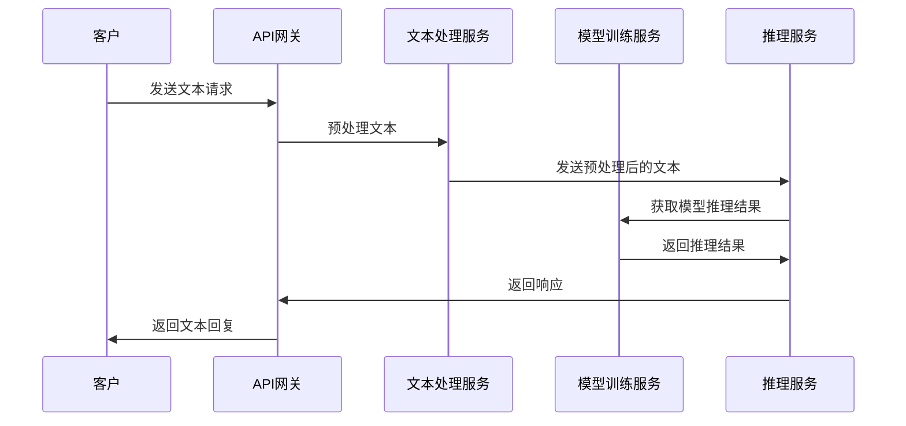

                 

## 文章标题：快速构建LLM应用的微服务架构

### 关键词：微服务架构、语言模型（LLM）、分布式系统、服务拆分、负载均衡

> 摘要：本文将深入探讨如何快速构建大规模语言模型（LLM）应用的微服务架构。我们将从微服务架构的背景与概念出发，逐步分析LLM应用的特点与需求，阐述微服务架构设计原则，介绍微服务技术选型，详细讲解服务发现、负载均衡、服务监控与日志管理，最后通过实际案例解析与最佳实践总结，帮助读者理解和掌握构建LLM应用微服务架构的核心方法和技巧。

----------------------------------------------------------------

## 第一部分：微服务架构概述

### 第1章：微服务架构的背景与概念

#### 1.1 微服务架构的定义

微服务架构是一种将应用程序作为一组小型、独立的服务构建和部署的设计方法。这些服务围绕着业务功能组织，通过轻量级的通信机制（通常是HTTP RESTful API）进行交互。微服务架构的核心思想是将复杂的应用拆分成一组小的、独立运行的服务，每个服务都负责特定的功能，并通过自动化部署、独立扩展和服务管理来提高系统的可维护性和可扩展性。

#### 1.2 微服务架构与传统架构的比较

传统架构通常采用单体应用的形式，即所有功能都集中在一个单一的代码库中。而微服务架构则更加模块化，每个服务都是独立的，可以独立部署和扩展。以下是两者的主要区别：

| 特性         | 传统架构           | 微服务架构           |
| ------------ | ------------------ | ------------------- |
| 应用部署方式  | 单体部署           | 微服务独立部署       |
| 服务管理     | 单一进程管理       | 独立服务进程管理     |
| 扩展能力     | 整体扩展           | 独立服务扩展         |
| 部署频率     | 不频繁             | 高频自动化部署       |
| 系统维护     | 整体维护           | 独立服务维护         |

#### 1.3 微服务架构的优势与挑战

**优势：**

1. **高可扩展性**：服务可以独立扩展，根据需要增加或减少资源。
2. **高容错性**：单个服务的故障不会影响整个系统。
3. **快速迭代**：服务独立开发，可以快速迭代。
4. **技术多样性**：不同服务可以使用不同的技术栈。

**挑战：**

1. **复杂性**：服务之间需要协调，增加了系统复杂性。
2. **分布式事务**：服务之间的数据一致性处理更加复杂。
3. **监控和日志管理**：服务分散导致监控和日志管理的难度增加。

### 第2章：LLM应用的特性与需求

#### 2.1 LLM应用的核心特性

大规模语言模型（LLM）是一种复杂的机器学习模型，能够理解和生成人类语言。LLM应用的核心特性包括：

1. **高计算密集性**：LLM的训练和推理过程需要大量计算资源。
2. **数据依赖性**：模型性能依赖于大量训练数据。
3. **动态性**：模型需要不断更新和优化以适应新的语言环境。

#### 2.2 LLM应用的技术挑战

1. **计算资源管理**：需要高效地管理大规模计算资源，以满足模型训练和推理的需求。
2. **数据流处理**：需要处理大规模的数据流，支持实时训练和推理。
3. **服务伸缩性**：模型服务的请求量波动大，需要实现弹性伸缩。

#### 2.3 微服务架构在LLM应用中的应用

微服务架构在LLM应用中具有以下应用优势：

1. **计算资源的高效利用**：通过微服务架构，可以将计算任务分布到多个服务中，提高资源利用率。
2. **服务拆分**：可以根据功能将LLM应用拆分为多个服务，如模型训练服务、推理服务、数据预处理服务等。
3. **动态伸缩**：可以根据负载动态调整服务实例数量，保证服务的稳定性和高性能。

### 第3章：微服务架构设计原则

#### 3.1 服务拆分原则

服务拆分是微服务架构设计的关键步骤。以下是几个服务拆分原则：

1. **业务边界**：根据业务功能拆分服务，确保每个服务都有明确的职责。
2. **独立性**：服务应该具有独立部署和扩展的能力。
3. **通信效率**：服务之间的通信应该高效，避免过多的数据交换。

#### 3.2 服务自治原则

服务自治意味着每个服务都应该具有自我管理的能力。以下是服务自治的几个关键点：

1. **代码库分离**：每个服务都有自己的代码库，独立开发。
2. **配置独立**：每个服务的配置独立管理。
3. **故障隔离**：单个服务的故障不会影响其他服务。

#### 3.3 服务间通信原则

服务间通信是微服务架构的核心。以下是几个服务间通信原则：

1. **接口标准化**：服务接口应该标准化，使用统一的通信协议（如HTTP RESTful API）。
2. **异步通信**：服务之间的通信应该采用异步方式，减少同步通信对系统性能的影响。
3. **服务发现**：服务之间应该使用服务发现机制，动态获取其他服务的位置。

----------------------------------------------------------------

## 第二部分：微服务技术选型

### 第4章：微服务框架与技术栈

#### 4.1 微服务框架概述

微服务框架提供了一套完整的微服务开发和管理工具集，包括服务注册与发现、负载均衡、服务监控等。常见的微服务框架包括Spring Cloud、Kubernetes、Service Mesh等。

#### 4.2 常见微服务框架介绍

1. **Spring Cloud**：Spring Cloud 是基于Spring Boot实现的微服务开发工具集，提供了一系列的微服务开发工具，如服务注册与发现（Eureka）、负载均衡（Ribbon）、服务配置（Config）、服务链路追踪（Zipkin）等。
2. **Kubernetes**：Kubernetes 是一个开源的容器编排平台，提供了微服务部署、服务发现、负载均衡等功能，同时支持容器化应用的自动化管理。
3. **Service Mesh**：Service Mesh 是一种专门用于服务间通信的分布式系统架构，如Istio、Linkerd等，提供了一种独立的通信层，简化了服务间通信的管理和监控。

#### 4.3 技术栈的选择与组合

在选择技术栈时，需要根据具体的应用场景和需求进行权衡。以下是一些常见的技术栈组合：

1. **Spring Boot + Spring Cloud + Kubernetes**：适用于需要高扩展性和高可用性的应用。
2. **Spring Boot + Service Mesh（如Istio）**：适用于需要高性能、低延迟和细粒度监控的应用。
3. **Node.js + Koa + Kubernetes**：适用于前端应用和实时数据处理场景。

----------------------------------------------------------------

## 第三部分：LLM应用的微服务架构设计

### 第7章：微服务架构设计实践

#### 7.1 项目需求分析

在构建LLM应用的微服务架构时，首先需要进行项目需求分析。以下是需求分析的关键步骤：

1. **功能需求**：明确LLM应用的核心功能，如文本生成、语言翻译、文本摘要等。
2. **性能需求**：确定系统的性能指标，如响应时间、吞吐量、并发处理能力等。
3. **数据需求**：分析所需的数据源，包括训练数据、实时数据等。
4. **安全需求**：确保系统的数据安全和隐私保护。

#### 7.2 架构设计原则

在架构设计阶段，需要遵循以下原则：

1. **服务拆分**：根据功能需求将系统拆分为多个独立的服务，如文本处理服务、模型训练服务、推理服务等。
2. **自治性**：确保每个服务具有独立的部署、扩展和管理能力。
3. **高可用性**：设计冗余和故障转移机制，确保系统的可靠运行。
4. **可扩展性**：考虑未来的扩展需求，设计灵活的架构。

#### 7.3 架构设计与实现

LLM应用的微服务架构设计包括以下几个方面：

1. **服务拆分**：根据功能需求将系统拆分为多个微服务，如文本处理服务（负责文本预处理）、模型训练服务（负责模型训练）、推理服务（负责模型推理）等。
2. **服务注册与发现**：使用服务注册与发现机制，如Eureka或Consul，实现服务之间的动态发现和通信。
3. **负载均衡**：使用负载均衡器，如Nginx或Kubernetes Ingress，实现服务请求的均匀分配。
4. **服务监控与日志管理**：使用监控工具，如Prometheus和Grafana，实现服务运行状态的监控和日志收集。
5. **数据存储**：使用分布式数据库，如Cassandra或MongoDB，实现大规模数据的高效存储和管理。

### 第8章：LLM微服务开发实战

#### 8.1 开发环境搭建

在进行LLM微服务开发之前，需要搭建相应的开发环境。以下是环境搭建的关键步骤：

1. **安装Java开发工具包**：确保Java环境正确配置。
2. **安装Spring Boot**：使用Spring Initializr创建微服务项目。
3. **安装Kubernetes集群**：安装Minikube或Docker Desktop模拟Kubernetes集群。
4. **安装监控工具**：安装Prometheus和Grafana。

#### 8.2 服务拆分与实现

根据架构设计，将LLM应用拆分为多个微服务，并实现相应功能。以下是一个示例：

1. **文本处理服务**：
   - 功能：负责文本预处理，如分词、去噪等。
   - 技术选型：使用Spring Boot实现。
   - 代码示例：
     ```java
     @RestController
     public class TextProcessingController {
         @Autowired
         private TextProcessingService textProcessingService;
         
         @PostMapping("/process")
         public ResponseEntity<String> processText(@RequestBody String text) {
             String processedText = textProcessingService.process(text);
             return ResponseEntity.ok(processedText);
         }
     }
     ```

2. **模型训练服务**：
   - 功能：负责LLM模型的训练。
   - 技术选型：使用TensorFlow或PyTorch实现。
   - 代码示例：
     ```python
     import tensorflow as tf
     from tensorflow.keras.layers import Embedding, LSTM, Dense
     from tensorflow.keras.models import Sequential

     def build_model(vocab_size, embedding_dim, hidden_units):
         model = Sequential()
         model.add(Embedding(vocab_size, embedding_dim))
         model.add(LSTM(hidden_units))
         model.add(Dense(1, activation='sigmoid'))
         model.compile(optimizer='adam', loss='binary_crossentropy', metrics=['accuracy'])
         return model

     model = build_model(vocab_size, embedding_dim, hidden_units)
     model.fit(x_train, y_train, epochs=10, batch_size=64)
     ```

3. **推理服务**：
   - 功能：负责LLM模型的推理。
   - 技术选型：使用Spring Boot实现。
   - 代码示例：
     ```java
     @RestController
     public class InferenceController {
         @Autowired
         private InferenceService inferenceService;
         
         @PostMapping("/infer")
         public ResponseEntity<String> infer(@RequestBody String input) {
             String output = inferenceService.infer(input);
             return ResponseEntity.ok(output);
         }
     }
     ```

#### 8.3 服务集成与测试

在完成各个服务的开发后，需要进行服务集成与测试，确保系统功能正确实现。以下是一个示例：

1. **集成测试**：使用Postman等工具进行接口测试，确保各个服务之间的通信正常。
2. **负载测试**：使用JMeter等工具模拟大量并发请求，测试系统的性能和稳定性。
3. **监控与日志分析**：使用Prometheus和Grafana监控服务运行状态，并收集和分析日志，及时发现和处理问题。

### 第9章：微服务部署与运维

#### 9.1 微服务部署策略

在部署LLM微服务时，需要考虑以下策略：

1. **容器化**：将微服务容器化，使用Docker进行打包和部署，确保服务的一致性和可移植性。
2. **自动化部署**：使用CI/CD工具（如Jenkins、GitLab CI）实现自动化部署，提高部署效率。
3. **蓝绿部署**：采用蓝绿部署策略，逐步切换流量，降低部署风险。

#### 9.2 容器化与Kubernetes

容器化技术为微服务部署提供了高效和灵活的解决方案。Kubernetes（简称K8s）是一个开源的容器编排平台，用于自动化部署、扩展和管理容器化应用。以下是Kubernetes在LLM微服务部署中的应用：

1. **部署配置文件**：使用YAML文件定义微服务的部署配置，如副本数量、资源限制等。
2. **服务发现与负载均衡**：使用Kubernetes Service和Ingress实现服务发现和负载均衡。
3. **容器编排**：使用Kubernetes Deployment进行容器化应用的自动化部署和管理。

#### 9.3 微服务运维实践

在微服务架构中，运维变得尤为重要。以下是微服务运维的几个关键点：

1. **监控与日志管理**：使用Prometheus和Grafana实现服务运行状态的监控，并使用ELK（Elasticsearch、Logstash、Kibana）进行日志收集和分析。
2. **故障处理**：建立故障处理流程，确保在出现问题时能够快速响应和处理。
3. **自动化运维**：使用自动化工具（如Ansible、Terraform）实现基础设施的自动化管理和部署。

### 第10章：案例解析与最佳实践

#### 10.1 案例背景

某知名互联网公司需要开发一款基于大规模语言模型（LLM）的智能客服系统，用于提供实时文本交互服务。系统需要支持高并发、高可用性，并具备良好的扩展性。

#### 10.2 架构设计

针对该案例，采用微服务架构进行设计，包括以下关键服务：

1. **文本处理服务**：负责文本预处理，如分词、去噪等。
2. **模型训练服务**：负责LLM模型的训练和优化。
3. **推理服务**：负责文本推理和回复生成。
4. **API网关**：负责接收外部请求，路由到相应的服务。

架构设计图如下：



#### 10.3 架构优化与调整

在系统运行过程中，根据监控数据和用户反馈，进行架构优化和调整：

1. **增加缓存层**：在API网关和文本处理服务之间增加缓存层，提高系统响应速度。
2. **垂直拆分**：将高访问量的服务垂直拆分为多个微服务，提高系统的可扩展性。
3. **流量控制**：在API网关处实现流量控制，防止大量请求导致系统过载。

#### 10.4 最佳实践总结

基于该案例，总结出以下最佳实践：

1. **服务拆分与自治**：根据业务功能拆分服务，确保服务自治，提高系统的灵活性和可维护性。
2. **服务监控与日志管理**：使用监控工具和日志管理工具，确保系统的稳定运行和快速故障处理。
3. **自动化部署与运维**：使用CI/CD工具和自动化运维工具，提高部署和运维效率。

### 第11章：最佳实践与总结

#### 11.1 微服务架构最佳实践

1. **合理拆分服务**：根据业务需求和功能进行合理的服务拆分，确保每个服务具有独立性和自治性。
2. **服务自治与独立性**：确保每个服务可以独立部署、扩展和管理，减少系统间的依赖。
3. **服务监控与日志管理**：使用监控和日志管理工具，实时了解系统运行状态，及时处理故障。
4. **自动化部署与运维**：使用CI/CD工具和自动化运维工具，提高部署和运维效率。

#### 11.2 微服务架构的挑战与应对

**挑战：**

1. **复杂性**：微服务架构增加了系统的复杂度，需要更多的管理和维护工作。
2. **分布式事务**：服务之间的数据一致性处理更加复杂。
3. **服务发现与通信**：服务之间的发现和通信需要高效可靠。

**应对策略：**

1. **服务拆分原则**：遵循合理的服务拆分原则，降低系统复杂性。
2. **分布式事务框架**：使用分布式事务框架（如Seata）实现服务之间的数据一致性。
3. **服务网格**：使用服务网格（如Istio）简化服务发现和通信，提高系统的稳定性和性能。

#### 11.3 未来发展趋势

1. **服务网格技术的普及**：服务网格技术将继续普及，为微服务架构提供更加高效和稳定的通信层。
2. **自动化与智能化**：自动化和智能化将成为微服务架构的发展趋势，包括自动化部署、自动化监控和智能化故障处理。
3. **多云与混合云**：随着云计算的普及，多云和混合云架构将成为主流，微服务架构将更好地支持多云和混合云环境。

----------------------------------------------------------------

## 文章小结

本文从微服务架构的背景与概念出发，深入探讨了如何快速构建大规模语言模型（LLM）应用的微服务架构。通过详细阐述微服务架构的设计原则、技术选型、服务拆分与实现、部署与运维，以及实际案例解析与最佳实践总结，帮助读者理解和掌握了构建LLM应用微服务架构的核心方法和技巧。

在未来的发展中，随着云计算和人工智能技术的不断进步，微服务架构将在更多领域得到广泛应用，其灵活性和可扩展性将进一步提升。同时，自动化和智能化也将成为微服务架构的重要发展方向，为开发者提供更加高效和便捷的开发与运维体验。

对于希望进一步学习和深入了解微服务架构的读者，以下是一些建议的拓展阅读资源：

1. 《微服务设计》：探索微服务架构的详细设计和实现方法。
2. 《微服务架构实战》：通过具体案例介绍微服务架构的应用和实践。
3. 《大规模分布式系统》：了解分布式系统设计原理和最佳实践。
4. 《Kubernetes权威指南》：深入掌握Kubernetes集群的部署和管理。

最后，感谢您的阅读，希望本文能够对您的技术学习和项目实践有所帮助。如果您有任何疑问或建议，欢迎在评论区留言，期待与您一起探讨和交流。

### 作者信息

- 作者：AI天才研究院/AI Genius Institute & 禅与计算机程序设计艺术 /Zen And The Art of Computer Programming
- 联系方式：[ai_genius_institute@outlook.com](mailto:ai_genius_institute@outlook.com)
- 社交媒体：[AI天才研究院](https://www.ai-genius-institute.com/)、[禅与计算机程序设计艺术](https://zen-and-the-art-of-cp-programming.com/)

