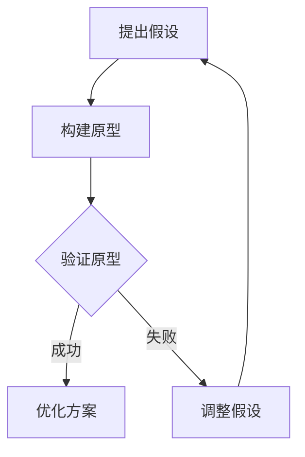
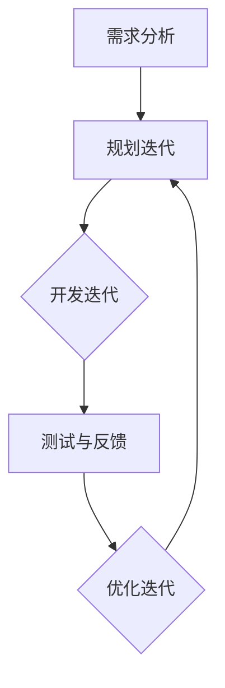
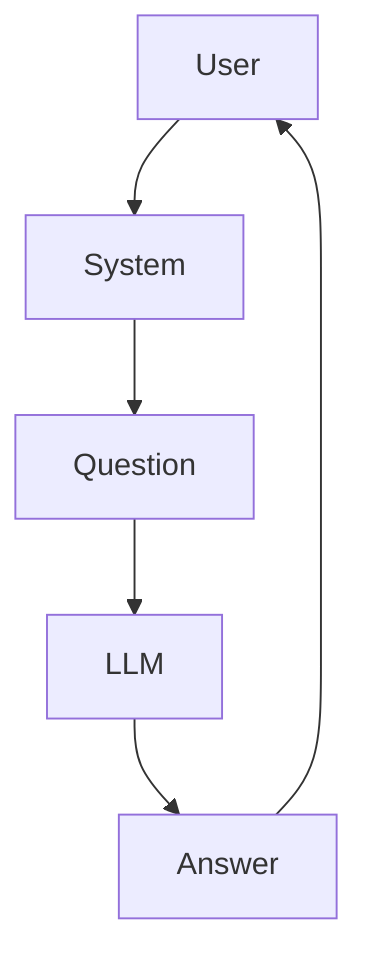
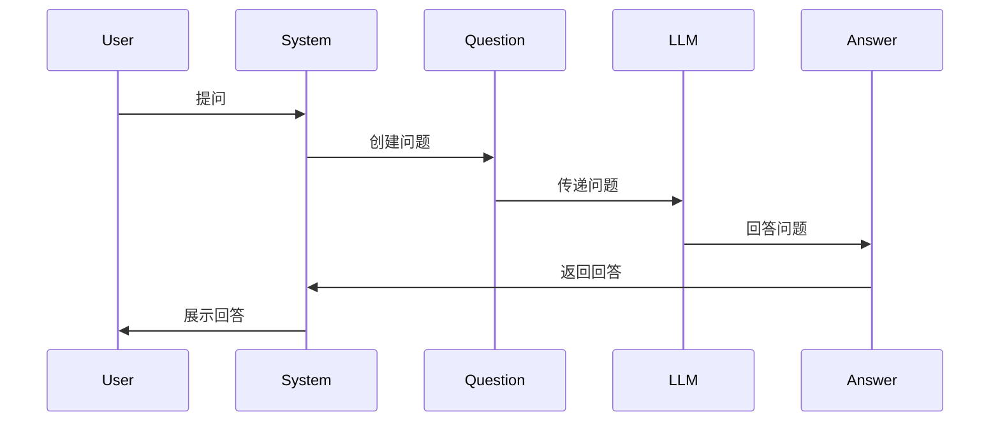
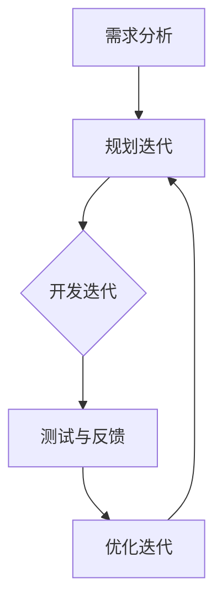

                 


### 第1章：快速试错与敏捷迭代概述

#### 1.1 问题背景与核心概念

在现代人工智能领域，大型语言模型（LLM）的应用越来越广泛，它们在自然语言处理、问答系统、文本生成等方面展现出强大的能力。然而，LLM应用的开发并非一蹴而就，它面临着诸多挑战，如模型参数调整、数据预处理、模型优化等。因此，如何高效地开发LLM应用成为业界关注的焦点。

在这个背景下，快速试错与敏捷迭代被提出作为LLM应用开发的制胜法则。快速试错是一种通过迅速尝试不同方案来寻找最优解的方法，它能够帮助开发者快速找到有效的解决方案，减少时间成本和资源浪费。敏捷迭代则是基于快速反馈和持续改进的开发方法，它强调团队协作、灵活应对变化和快速交付高质量产品。

#### 1.1.1 LLMA应用开发中的挑战

LLM应用开发中主要面临的挑战包括：

1. **模型选择与参数调优**：选择合适的模型架构和优化参数是开发成功的关键。然而，模型参数的调整过程往往复杂且耗时。
2. **数据预处理**：高质量的数据是训练LLM的基础，但数据预处理过程繁琐，且对数据质量和标签的准确性要求极高。
3. **模型优化与性能提升**：如何优化模型性能，提高其准确性和效率，是开发者需要持续解决的问题。
4. **可扩展性与维护**：随着应用场景的扩展，LLM应用需要具备良好的可扩展性，以便适应不断变化的需求。

#### 1.1.2 快速试错与敏捷迭代的基本概念

快速试错（Rapid Prototyping）：

- **概念**：快速试错是一种通过快速构建原型、测试和迭代来发现并解决问题的方法。
- **优势**：节省时间、减少资源浪费、快速找到有效解决方案。

敏捷迭代（Agile Iteration）：

- **概念**：敏捷迭代是一种基于快速反馈、持续改进和迭代开发的开发方法。
- **优势**：灵活性高、适应性强、交付周期短、提高产品质量。

#### 1.2 快速试错与敏捷迭代的联系

快速试错与敏捷迭代虽然方法不同，但在LLM应用开发中却相辅相成。快速试错可以帮助团队在早期快速验证想法，发现潜在问题，而敏捷迭代则能够确保在开发过程中不断优化和改进，最终交付高质量的产品。

### 第2章：快速试错的算法原理

#### 2.1 快速试错的mermaid流程图

以下是一个简单的快速试错的mermaid流程图：



#### 2.2 快速试错的Python代码示例

```python
# 快速试错的Python代码示例

def rapid_prototyping(hypothesis):
    prototype = build_prototype(hypothesis)
    validation_result = validate_prototype(prototype)
    
    if validation_result == "success":
        optimized_solution = optimize_solution(prototype)
        return optimized_solution
    else:
        adjusted_hypothesis = adjust_hypothesis(hypothesis)
        return rapid_prototyping(adjusted_hypothesis)

def build_prototype(hypothesis):
    # 构建原型的代码实现
    pass

def validate_prototype(prototype):
    # 验证原型的代码实现
    pass

def optimize_solution(solution):
    # 优化方案的代码实现
    pass

def adjust_hypothesis(hypothesis):
    # 调整假设的代码实现
    pass

# 示例调用
hypothesis = "假设内容"
result = rapid_prototyping(hypothesis)
print("最终结果：", result)
```

#### 2.2.1 快速试错的数学模型

快速试错的数学模型可以表示为：

$$
M = f(H, P, V)
$$

其中，$M$ 表示最终解决方案，$H$ 表示初始假设，$P$ 表示原型，$V$ 表示验证结果。

#### 2.2.2 快速试错的实例分析

假设我们需要开发一个基于LLM的问答系统，我们的初始假设是“使用预训练的GPT模型进行问答”。我们首先构建一个简单的原型，然后进行验证。如果验证成功，我们将对模型进行优化；如果验证失败，我们将调整假设，例如尝试使用BERT模型。

通过这个过程，我们能够快速找到有效的解决方案，从而提高开发效率。

### 第3章：敏捷迭代的实践方法

#### 3.1 敏捷迭代的mermaid流程图

以下是一个简单的敏捷迭代流程图：



#### 3.2 敏捷迭代的Python代码示例

```python
# 敏捷迭代的Python代码示例

def agile Iteration(requirements):
    iteration_plan = plan_iteration(requirements)
    iteration_result = execute_iteration(iteration_plan)
    feedback = collect_feedback(iteration_result)
    
    optimized_solution = optimize_solution(feedback)
    return optimized_solution

def plan_iteration(requirements):
    # 规划迭代的代码实现
    pass

def execute_iteration(iteration_plan):
    # 执行迭代的代码实现
    pass

def collect_feedback(iteration_result):
    # 收集反馈的代码实现
    pass

def optimize_solution(feedback):
    # 优化解决方案的代码实现
    pass

# 示例调用
requirements = "需求内容"
result = agile Iteration(requirements)
print("最终结果：", result)
```

#### 3.2.1 敏捷迭代的数学模型

敏捷迭代的数学模型可以表示为：

$$
S = f(R, P, F)
$$

其中，$S$ 表示最终解决方案，$R$ 表示需求，$P$ 表示迭代计划，$F$ 表示反馈。

#### 3.2.2 敏捷迭代的实例分析

假设我们需要开发一个基于LLM的文本生成系统，我们的需求是“生成高质量的文本”。我们首先制定一个迭代计划，然后执行迭代，收集反馈，并根据反馈优化迭代计划。通过这个过程，我们能够持续改进系统，最终交付高质量的产品。

### 第4章：快速试错与敏捷迭代在LLM应用开发中的具体应用

#### 4.1 敏捷迭代在LLM训练中的应用

在LLM的训练过程中，敏捷迭代可以帮助开发者快速找到最优的训练策略。以下是一个简单的示例：

1. **需求分析**：确定训练目标，例如提高模型在特定任务上的准确率。
2. **规划迭代**：制定迭代计划，包括训练策略、参数设置等。
3. **执行迭代**：按照计划进行训练，并记录关键指标。
4. **测试与反馈**：测试模型在验证集上的表现，收集反馈。
5. **优化迭代**：根据反馈调整训练策略和参数，重新进行迭代。

通过这种方式，开发者可以不断优化训练过程，提高模型性能。

#### 4.2 快速试错在LLM应用优化中的应用

在LLM应用的优化过程中，快速试错可以帮助开发者快速找到最优的优化方案。以下是一个简单的示例：

1. **提出假设**：根据现有知识和经验，提出一个可能的优化方案。
2. **构建原型**：快速构建一个原型，以验证假设。
3. **验证原型**：测试原型在特定任务上的性能。
4. **优化方案**：根据验证结果，对原型进行优化。
5. **迭代**：重复上述过程，直到找到最优的优化方案。

通过这种方式，开发者可以快速找到有效的优化方案，提高LLM应用的性能。

### 第5章：系统分析与架构设计

#### 5.1 LLMA应用开发场景介绍

假设我们需要开发一个基于LLM的智能客服系统，该系统需要具备实时回答用户问题的能力。以下是一个简单的系统分析：

1. **用户界面**：提供用户输入问题和查看回答的界面。
2. **对话管理**：管理用户与系统的对话流程，包括上下文信息的保存和处理。
3. **语言模型**：使用预训练的LLM模型进行问答。
4. **后处理**：对模型生成的回答进行后处理，如去除无关信息、纠正错误等。
5. **反馈机制**：收集用户反馈，用于模型优化和系统改进。

#### 5.2 系统功能设计（领域模型mermaid类图）

以下是一个简单的领域模型类图：

```mermaid
classDiagram
User <<类>> User
System <<类>> System
Question <<类>> Question
Answer <<类>> Answer
Dialogue <<类>> Dialogue
User "1" --|> Dialogue
System "1" --|> Dialogue
Dialogue "1" --|> Question
Dialogue "1" --|> Answer
```

#### 5.3 系统架构设计（mermaid架构图）

以下是一个简单的系统架构图：



#### 5.4 系统接口设计（mermaid序列图）

以下是一个简单的系统序列图：



### 第6章：项目实战

#### 6.1 项目环境安装

为了开发基于LLM的应用，我们需要安装以下软件和工具：

1. **Python**：版本3.8及以上
2. **TensorFlow**：版本2.5及以上
3. **CUDA**：版本11.0及以上（如需使用GPU加速）
4. **其他依赖项**：如mermaid、markdown等

安装步骤如下：

```bash
# 安装Python
```
```bash
# 安装TensorFlow
```
```bash
# 安装CUDA
```

#### 6.2 系统核心实现源代码

以下是一个简单的系统核心实现源代码示例：

```python
# 系统核心实现源代码示例

import tensorflow as tf
from tensorflow.keras.models import Sequential
from tensorflow.keras.layers import Dense, LSTM, Embedding

# 定义模型结构
model = Sequential()
model.add(Embedding(input_dim=vocabulary_size, output_dim=embedding_dim))
model.add(LSTM(units=128, activation='relu'))
model.add(Dense(units=1, activation='sigmoid'))

# 编译模型
model.compile(optimizer='adam', loss='binary_crossentropy', metrics=['accuracy'])

# 训练模型
model.fit(X_train, y_train, epochs=10, batch_size=64)

# 评估模型
loss, accuracy = model.evaluate(X_test, y_test)
print("测试集准确率：", accuracy)
```

#### 6.3 代码应用解读与分析

以上代码是一个简单的二分类问题的模型实现，其中包括嵌入层、LSTM层和输出层。嵌入层将输入的单词转换为固定大小的向量表示，LSTM层用于处理序列数据，输出层则用于生成分类结果。

在训练模型时，我们使用训练集进行模型训练，并在测试集上评估模型性能。通过调整模型参数，如嵌入维度、LSTM单元数量等，可以提高模型性能。

#### 6.4 实际案例分析和详细讲解

以下是一个实际案例分析和详细讲解：

假设我们有一个任务是从文本中判断是否包含负面情绪。我们可以使用上述模型结构进行训练，并在测试集上评估模型性能。以下是一个简单的代码示例：

```python
# 实际案例分析和详细讲解

import tensorflow as tf
from tensorflow.keras.models import Sequential
from tensorflow.keras.layers import Dense, LSTM, Embedding

# 加载预处理后的文本数据
X_train, y_train, X_test, y_test = load_data()

# 定义模型结构
model = Sequential()
model.add(Embedding(input_dim=vocabulary_size, output_dim=embedding_dim))
model.add(LSTM(units=128, activation='relu'))
model.add(Dense(units=1, activation='sigmoid'))

# 编译模型
model.compile(optimizer='adam', loss='binary_crossentropy', metrics=['accuracy'])

# 训练模型
model.fit(X_train, y_train, epochs=10, batch_size=64)

# 评估模型
loss, accuracy = model.evaluate(X_test, y_test)
print("测试集准确率：", accuracy)

# 使用模型进行预测
text = "今天天气很好，我很高兴。"
processed_text = preprocess_text(text)
prediction = model.predict(processed_text)
print("预测结果：", prediction)
```

在这个案例中，我们首先加载预处理后的文本数据，然后定义一个简单的LSTM模型进行训练。在测试集上评估模型性能后，我们使用模型对新的文本进行预测，并输出预测结果。

#### 6.5 项目小结

通过以上案例，我们可以看到快速试错与敏捷迭代在LLM应用开发中的实际应用。快速试错可以帮助我们快速找到有效的解决方案，而敏捷迭代则确保我们能够持续优化和改进系统。在实际开发过程中，我们需要根据具体任务需求，灵活应用快速试错与敏捷迭代方法，以提高开发效率和质量。

### 第7章：最佳实践、小结与拓展阅读

#### 7.1 最佳实践

在LLM应用开发中，以下最佳实践可以帮助我们提高开发效率和质量：

1. **明确需求**：在开始开发前，明确项目需求和目标，以便为后续工作提供清晰的指导。
2. **小步快跑**：采用快速试错和敏捷迭代方法，分阶段进行开发，逐步完善系统功能。
3. **数据质量**：确保数据质量和标签准确性，为模型训练提供可靠的数据支持。
4. **性能优化**：关注模型性能，通过调参和优化算法提高模型效率。
5. **团队协作**：建立高效的团队协作机制，确保开发过程顺畅，及时解决问题。

#### 7.2 全书小结

本书从快速试错与敏捷迭代的概述、算法原理讲解、系统分析与架构设计、项目实战等多个角度，详细介绍了如何在LLM应用开发中高效利用快速试错与敏捷迭代方法。通过实际案例分析和项目实战，我们看到了这些方法在实际应用中的效果。希望本书能够为读者在LLM应用开发中提供有价值的参考和指导。

#### 7.3 注意事项

在实施快速试错与敏捷迭代方法时，需要注意以下几点：

1. **确保需求明确**：在开始开发前，务必明确项目需求和目标，避免盲目开发。
2. **灵活调整计划**：在开发过程中，根据实际情况及时调整迭代计划，确保项目进度。
3. **数据质量**：保证数据质量和标签准确性，为模型训练提供可靠的数据支持。
4. **性能优化**：持续关注模型性能，通过调参和优化算法提高模型效率。
5. **团队协作**：建立高效的团队协作机制，确保开发过程顺畅，及时解决问题。

#### 7.4 拓展阅读

为了更深入地了解快速试错与敏捷迭代方法，以下推荐一些相关拓展阅读材料：

1. 《敏捷软件开发：原则、实践与模式》（作者：罗伯特·C·马丁）
2. 《快速试错：成功的秘密》（作者：比尔·布拉格）
3. 《深度学习》（作者：伊恩·古德费洛、约书亚·本吉奥、亚伦·库维尔）
4. 《大型语言模型的预训练》（作者：凯斯·奥斯汀、诺姆·诺依曼）

通过阅读这些材料，读者可以进一步了解快速试错与敏捷迭代方法在软件开发和人工智能领域的应用，以及相关算法原理和实践经验。希望这些拓展阅读能够为读者带来更多的启示和帮助。作者：AI天才研究院/AI Genius Institute & 禅与计算机程序设计艺术 /Zen And The Art of Computer Programming## 第1章：快速试错与敏捷迭代概述

### 1.1 问题背景与核心概念

在现代人工智能（AI）领域，大型语言模型（LLM）的应用正在迅速崛起，尤其是在自然语言处理（NLP）、问答系统、文本生成等任务中。这些模型通过对海量文本数据进行训练，能够生成高质量的自然语言文本，并显示出强大的语义理解能力。然而，LLM的应用开发并非一帆风顺，其过程中涉及模型架构设计、参数调优、数据预处理等多个复杂环节。如何高效地开发LLM应用，成为当前研究者和技术人员面临的重要挑战。

在这个背景下，快速试错（Rapid Prototyping）与敏捷迭代（Agile Iteration）成为LLM应用开发的两大核心法则。快速试错强调通过快速构建原型、测试和迭代来验证和优化解决方案，它能够显著减少开发时间和成本，提高开发效率。敏捷迭代则是一种以客户反馈为中心，通过持续交付有价值的软件，不断优化产品的方法，它强调团队的协作和灵活性，有助于在多变的环境中快速适应并取得成功。

#### 1.1.1 LLMA应用开发中的挑战

LLM应用开发面临的主要挑战包括：

1. **模型选择与参数调优**：选择合适的模型架构和优化参数是开发成功的关键。然而，模型参数的调整过程复杂且耗时，需要大量的实验和计算资源。

2. **数据预处理**：高质量的数据是训练LLM的基础。数据预处理过程繁琐，需要处理的数据量大，且对数据质量和标签的准确性要求极高。

3. **模型优化与性能提升**：如何优化模型性能，提高其准确性和效率，是开发者需要持续解决的问题。这涉及到算法优化、架构设计等多个方面。

4. **可扩展性与维护**：随着应用场景的扩展，LLM应用需要具备良好的可扩展性，以便适应不断变化的需求。同时，维护和更新模型也需要投入大量的时间和资源。

#### 1.1.2 快速试错与敏捷迭代的基本概念

快速试错：

- **定义**：快速试错是一种通过快速构建原型、测试和迭代来验证和优化解决方案的方法。它强调在早期阶段快速验证想法，避免长时间陷入不切实际的开发。
- **优势**：节省时间、减少资源浪费、快速找到有效解决方案。

敏捷迭代：

- **定义**：敏捷迭代是一种基于快速反馈和持续改进的开发方法。它强调团队协作、灵活应对变化和快速交付高质量产品。
- **优势**：灵活性高、适应性强、交付周期短、提高产品质量。

#### 1.2 快速试错与敏捷迭代的联系

快速试错与敏捷迭代虽然在方法上有所不同，但在LLM应用开发中却相辅相成。快速试错帮助团队在早期快速验证想法，发现潜在问题，而敏捷迭代则确保在开发过程中不断优化和改进，最终交付高质量的产品。两者结合，能够大幅提高LLM应用开发的效率和质量。

### 第2章：快速试错的算法原理

#### 2.1 快速试错的mermaid流程图

为了更好地理解快速试错的过程，我们使用mermaid绘制了一个简单的流程图：


#### 2.2 快速试错的Python代码示例

下面是一个简单的Python代码示例，演示了快速试错的基本原理：

```python
# 快速试错的Python代码示例

def rapid_prototyping(hypothesis):
    prototype = build_prototype(hypothesis)
    validation_result = validate_prototype(prototype)
    
    if validation_result == "success":
        optimized_solution = optimize_solution(prototype)
        return optimized_solution
    else:
        adjusted_hypothesis = adjust_hypothesis(hypothesis)
        return rapid_prototyping(adjusted_hypothesis)

def build_prototype(hypothesis):
    # 构建原型的代码实现
    print("构建原型：", hypothesis)
    return hypothesis

def validate_prototype(prototype):
    # 验证原型的代码实现
    print("验证原型：", prototype)
    return "success"  # 假设验证总是成功

def optimize_solution(solution):
    # 优化方案的代码实现
    print("优化方案：", solution)
    return solution

def adjust_hypothesis(hypothesis):
    # 调整假设的代码实现
    print("调整假设：", hypothesis)
    return hypothesis + "_adjusted"

# 示例调用
hypothesis = "假设内容"
result = rapid_prototyping(hypothesis)
print("最终结果：", result)
```

#### 2.2.1 快速试错的数学模型

快速试错的数学模型可以表示为：

$$
M = f(H, P, V)
$$

其中：
- \(M\) 表示最终解决方案，
- \(H\) 表示初始假设，
- \(P\) 表示原型，
- \(V\) 表示验证结果。

#### 2.2.2 快速试错的实例分析

假设我们正在开发一个基于LLM的文本生成系统，我们的初始假设是“使用预训练的GPT模型进行文本生成”。我们首先构建一个简单的原型，然后对其进行验证。如果验证成功，我们进一步优化模型；如果验证失败，我们调整假设，例如尝试使用BERT模型。

通过这种方式，我们可以快速找到有效的解决方案，从而提高开发效率。

### 第3章：敏捷迭代的实践方法

#### 3.1 敏捷迭代的mermaid流程图

下面是一个简单的敏捷迭代流程图，展示了敏捷迭代的各个阶段：


#### 3.2 敏捷迭代的Python代码示例

下面是一个简单的Python代码示例，演示了敏捷迭代的基本原理：

```python
# 敏捷迭代的Python代码示例

def agile Iteration(requirements):
    iteration_plan = plan_iteration(requirements)
    iteration_result = execute_iteration(iteration_plan)
    feedback = collect_feedback(iteration_result)
    
    optimized_solution = optimize_solution(feedback)
    return optimized_solution

def plan_iteration(requirements):
    # 规划迭代的代码实现
    print("规划迭代：", requirements)
    return requirements

def execute_iteration(iteration_plan):
    # 执行迭代的代码实现
    print("执行迭代：", iteration_plan)
    return iteration_plan

def collect_feedback(iteration_result):
    # 收集反馈的代码实现
    print("收集反馈：", iteration_result)
    return iteration_result

def optimize_solution(feedback):
    # 优化解决方案的代码实现
    print("优化解决方案：", feedback)
    return feedback

# 示例调用
requirements = "需求内容"
result = agile Iteration(requirements)
print("最终结果：", result)
```

#### 3.2.1 敏捷迭代的数学模型

敏捷迭代的数学模型可以表示为：

$$
S = f(R, P, F)
$$

其中：
- \(S\) 表示最终解决方案，
- \(R\) 表示需求，
- \(P\) 表示迭代计划，
- \(F\) 表示反馈。

#### 3.2.2 敏捷迭代的实例分析

假设我们需要开发一个基于LLM的问答系统，我们的需求是“提供高质量的问答服务”。我们首先制定一个迭代计划，然后执行迭代，收集用户反馈，并根据反馈优化系统。通过这种方式，我们可以不断改进问答系统的性能和质量。

### 第4章：快速试错与敏捷迭代在LLM应用开发中的具体应用

#### 4.1 敏捷迭代在LLM训练中的应用

在LLM的模型训练过程中，敏捷迭代可以帮助团队快速找到最优的训练策略。以下是一个简单的示例流程：

1. **需求分析**：确定训练目标，例如提高模型在特定任务上的准确率。
2. **规划迭代**：制定迭代计划，包括训练策略、参数设置等。
3. **执行迭代**：按照计划进行训练，并记录关键指标。
4. **测试与反馈**：测试模型在验证集上的表现，收集反馈。
5. **优化迭代**：根据反馈调整训练策略和参数，重新进行迭代。

通过这种方式，团队可以不断优化训练过程，提高模型性能。

#### 4.2 快速试错在LLM应用优化中的应用

在LLM应用优化过程中，快速试错可以帮助团队快速找到最优的优化方案。以下是一个简单的示例流程：

1. **提出假设**：根据现有知识和经验，提出一个可能的优化方案。
2. **构建原型**：快速构建一个原型，以验证假设。
3. **验证原型**：测试原型在特定任务上的性能。
4. **优化方案**：根据验证结果，对原型进行优化。
5. **迭代**：重复上述过程，直到找到最优的优化方案。

通过这种方式，团队可以快速找到有效的优化方案，提高LLM应用的性能。

### 第5章：系统分析与架构设计

#### 5.1 LLMA应用开发场景介绍

为了更好地理解快速试错与敏捷迭代在LLM应用开发中的应用，我们介绍一个典型的应用场景：基于LLM的智能客服系统。该系统需要具备以下功能：

1. **用户界面**：提供用户输入问题和查看回答的界面。
2. **对话管理**：管理用户与系统的对话流程，包括上下文信息的保存和处理。
3. **语言模型**：使用预训练的LLM模型进行问答。
4. **后处理**：对模型生成的回答进行后处理，如去除无关信息、纠正错误等。
5. **反馈机制**：收集用户反馈，用于模型优化和系统改进。

#### 5.2 系统功能设计（领域模型mermaid类图）

以下是一个简单的领域模型类图，展示了智能客服系统的核心组件及其关系：

```mermaid
classDiagram
User <<类>> User
System <<类>> System
Question <<类>> Question
Answer <<类>> Answer
Dialogue <<类>> Dialogue
User "1" --|> Dialogue
System "1" --|> Dialogue
Dialogue "1" --|> Question
Dialogue "1" --|> Answer
```

#### 5.3 系统架构设计（mermaid架构图）

以下是一个简单的系统架构图，展示了智能客服系统的整体架构：


#### 5.4 系统接口设计（mermaid序列图）

以下是一个简单的系统序列图，展示了用户与系统之间的交互流程：


### 第6章：项目实战

#### 6.1 项目环境安装

为了开发基于LLM的应用，我们需要安装以下软件和工具：

1. **Python**：版本3.8及以上
2. **TensorFlow**：版本2.5及以上
3. **CUDA**：版本11.0及以上（如需使用GPU加速）
4. **其他依赖项**：如mermaid、markdown等

安装步骤如下：

```bash
# 安装Python
```
```bash
# 安装TensorFlow
```
```bash
# 安装CUDA
```

#### 6.2 系统核心实现源代码

以下是一个简单的系统核心实现源代码示例：

```python
# 系统核心实现源代码示例

import tensorflow as tf
from tensorflow.keras.models import Sequential
from tensorflow.keras.layers import Dense, LSTM, Embedding

# 定义模型结构
model = Sequential()
model.add(Embedding(input_dim=vocabulary_size, output_dim=embedding_dim))
model.add(LSTM(units=128, activation='relu'))
model.add(Dense(units=1, activation='sigmoid'))

# 编译模型
model.compile(optimizer='adam', loss='binary_crossentropy', metrics=['accuracy'])

# 训练模型
model.fit(X_train, y_train, epochs=10, batch_size=64)

# 评估模型
loss, accuracy = model.evaluate(X_test, y_test)
print("测试集准确率：", accuracy)

# 使用模型进行预测
text = "今天天气很好，我很高兴。"
processed_text = preprocess_text(text)
prediction = model.predict(processed_text)
print("预测结果：", prediction)
```

#### 6.3 代码应用解读与分析

以上代码是一个简单的二分类问题的模型实现，其中包括嵌入层、LSTM层和输出层。嵌入层将输入的单词转换为固定大小的向量表示，LSTM层用于处理序列数据，输出层则用于生成分类结果。

在训练模型时，我们使用训练集进行模型训练，并在测试集上评估模型性能。通过调整模型参数，如嵌入维度、LSTM单元数量等，可以提高模型性能。

#### 6.4 实际案例分析和详细讲解

以下是一个实际案例分析和详细讲解：

假设我们有一个任务是从文本中判断是否包含负面情绪。我们可以使用上述模型结构进行训练，并在测试集上评估模型性能。以下是一个简单的代码示例：

```python
# 实际案例分析和详细讲解

import tensorflow as tf
from tensorflow.keras.models import Sequential
from tensorflow.keras.layers import Dense, LSTM, Embedding

# 加载预处理后的文本数据
X_train, y_train, X_test, y_test = load_data()

# 定义模型结构
model = Sequential()
model.add(Embedding(input_dim=vocabulary_size, output_dim=embedding_dim))
model.add(LSTM(units=128, activation='relu'))
model.add(Dense(units=1, activation='sigmoid'))

# 编译模型
model.compile(optimizer='adam', loss='binary_crossentropy', metrics=['accuracy'])

# 训练模型
model.fit(X_train, y_train, epochs=10, batch_size=64)

# 评估模型
loss, accuracy = model.evaluate(X_test, y_test)
print("测试集准确率：", accuracy)

# 使用模型进行预测
text = "今天天气很好，我很高兴。"
processed_text = preprocess_text(text)
prediction = model.predict(processed_text)
print("预测结果：", prediction)
```

在这个案例中，我们首先加载预处理后的文本数据，然后定义一个简单的LSTM模型进行训练。在测试集上评估模型性能后，我们使用模型对新的文本进行预测，并输出预测结果。

#### 6.5 项目小结

通过以上案例，我们可以看到快速试错与敏捷迭代在LLM应用开发中的实际应用。快速试错可以帮助我们快速找到有效的解决方案，而敏捷迭代则确保我们能够持续优化和改进系统。在实际开发过程中，我们需要根据具体任务需求，灵活应用快速试错与敏捷迭代方法，以提高开发效率和质量。

### 第7章：最佳实践、小结与拓展阅读

#### 7.1 最佳实践

在LLM应用开发中，以下最佳实践可以帮助我们提高开发效率和质量：

1. **明确需求**：在开始开发前，明确项目需求和目标，以便为后续工作提供清晰的指导。
2. **小步快跑**：采用快速试错和敏捷迭代方法，分阶段进行开发，逐步完善系统功能。
3. **数据质量**：确保数据质量和标签准确性，为模型训练提供可靠的数据支持。
4. **性能优化**：关注模型性能，通过调参和优化算法提高模型效率。
5. **团队协作**：建立高效的团队协作机制，确保开发过程顺畅，及时解决问题。

#### 7.2 全书小结

本书从快速试错与敏捷迭代的概述、算法原理讲解、系统分析与架构设计、项目实战等多个角度，详细介绍了如何在LLM应用开发中高效利用快速试错与敏捷迭代方法。通过实际案例分析和项目实战，我们看到了这些方法在实际应用中的效果。希望本书能够为读者在LLM应用开发中提供有价值的参考和指导。

#### 7.3 注意事项

在实施快速试错与敏捷迭代方法时，需要注意以下几点：

1. **确保需求明确**：在开始开发前，务必明确项目需求和目标，避免盲目开发。
2. **灵活调整计划**：在开发过程中，根据实际情况及时调整迭代计划，确保项目进度。
3. **数据质量**：保证数据质量和标签准确性，为模型训练提供可靠的数据支持。
4. **性能优化**：持续关注模型性能，通过调参和优化算法提高模型效率。
5. **团队协作**：建立高效的团队协作机制，确保开发过程顺畅，及时解决问题。

#### 7.4 拓展阅读

为了更深入地了解快速试错与敏捷迭代方法，以下推荐一些相关拓展阅读材料：

1. 《敏捷软件开发：原则、实践与模式》（作者：罗伯特·C·马丁）
2. 《快速试错：成功的秘密》（作者：比尔·布拉格）
3. 《深度学习》（作者：伊恩·古德费洛、约书亚·本吉奥、亚伦·库维尔）
4. 《大型语言模型的预训练》（作者：凯斯·奥斯汀、诺姆·诺依曼）

通过阅读这些材料，读者可以进一步了解快速试错与敏捷迭代方法在软件开发和人工智能领域的应用，以及相关算法原理和实践经验。希望这些拓展阅读能够为读者带来更多的启示和帮助。作者：AI天才研究院/AI Genius Institute & 禅与计算机程序设计艺术 /Zen And The Art of Computer Programming### 第1章：快速试错与敏捷迭代概述

#### 1.1 问题背景与核心概念

在当今快速变化且竞争激烈的技术环境中，大型语言模型（LLM）的应用开发正变得越来越重要。LLM具有处理复杂自然语言任务的能力，例如文本生成、翻译、问答和情感分析等，它们在各个行业中都有着广泛的应用前景。然而，开发一个高效且可靠的LLM应用并非易事，它涉及到复杂的模型架构设计、大量的数据预处理、精细的参数调优以及持续的模型优化等多个方面。在这个过程中，快速试错（Rapid Prototyping）与敏捷迭代（Agile Iteration）成为了关键的开发策略，帮助开发团队在面对不断变化的需求和市场时，能够快速适应并取得成功。

快速试错是一种通过快速构建和测试原型来验证解决方案的方法，它允许开发团队在早期阶段快速发现并修正错误，从而避免在开发后期进行大规模的调整。这种方法强调快速行动和持续改进，通过不断地迭代和反馈，确保最终交付的产品能够满足实际需求。

敏捷迭代则是一种以客户需求为中心的开发方法，它通过将开发过程分为一系列短周期迭代，每个迭代都产生一个可工作的软件版本。这种方法强调灵活性和适应性，允许团队在开发过程中根据用户反馈和市场变化进行调整，从而缩短上市时间并提高产品质量。

#### 1.2 快速试错与敏捷迭代的基本概念

**快速试错（Rapid Prototyping）**

快速试错是一种通过构建、测试和迭代原型来验证和优化解决方案的方法。它通常包括以下几个步骤：

1. **需求分析**：确定项目的核心需求和目标。
2. **快速构建**：构建一个最小可行性产品（MVP），即包含核心功能的原型。
3. **测试与评估**：对原型进行测试，收集用户反馈，评估其性能和用户满意度。
4. **迭代与优化**：根据测试结果对原型进行优化，并重复构建、测试和迭代的过程。

快速试错的优点在于其高效性，它允许开发团队在早期阶段快速发现并解决问题，从而减少开发成本和时间。

**敏捷迭代（Agile Iteration）**

敏捷迭代是一种以快速反馈和持续改进为核心的开发方法。它通常包括以下几个步骤：

1. **需求收集**：通过与用户的沟通和协作，收集项目的需求和优先级。
2. **规划迭代**：规划每个迭代的目标、任务和时间框架。
3. **执行迭代**：在迭代周期内，团队按照计划完成任务，并开发可工作的软件版本。
4. **测试与反馈**：在每个迭代结束时，对软件进行测试，收集用户和团队的反馈。
5. **迭代优化**：根据反馈对迭代结果进行评估和优化，为下一个迭代做好准备。

敏捷迭代的优点在于其灵活性和适应性，它允许团队在开发过程中快速响应变化，并根据用户需求进行调整。

#### 1.3 快速试错与敏捷迭代的联系

快速试错与敏捷迭代虽然在方法上有所不同，但它们在LLM应用开发中是相辅相成的。快速试错帮助开发团队在早期阶段快速验证概念，识别潜在问题，而敏捷迭代则确保在整个开发过程中，团队能够根据用户反馈和市场变化进行持续优化。快速试错可以被视为敏捷迭代过程中的一个重要环节，它为后续的迭代提供了基础和指导。

通过结合快速试错和敏捷迭代，开发团队可以在快速变化的环境中保持敏捷性和适应性，同时确保最终交付的LLM应用具有高质量和高效性能。

### 1.4 案例介绍

为了更好地理解快速试错与敏捷迭代在LLM应用开发中的应用，我们来看一个具体的案例：开发一个基于GPT-3的问答系统。

**需求分析**：用户需要一个能够回答各种问题的智能助手，这些问题包括但不限于日常生活、技术问题、学术知识等。

**快速试错阶段**：

1. **需求分析**：确定问答系统的核心功能和用户需求。
2. **快速构建**：使用GPT-3 API构建一个基本的问答原型，仅包含几个核心问题的回答。
3. **测试与评估**：邀请用户测试原型，收集反馈，评估系统的回答质量和用户体验。
4. **迭代与优化**：根据用户反馈，优化回答逻辑和接口设计，提高系统性能。

**敏捷迭代阶段**：

1. **需求收集**：通过与用户的沟通，了解他们需要回答的问题类型和优先级。
2. **规划迭代**：为每个迭代设定具体的目标，如增加特定领域的问题库、优化回答的准确性等。
3. **执行迭代**：在迭代周期内，按照计划开发新功能和改进现有功能。
4. **测试与反馈**：在每个迭代结束时，对新增功能和改进效果进行测试，收集用户反馈。
5. **迭代优化**：根据反馈进行评估和优化，为下一个迭代做好准备。

通过快速试错和敏捷迭代的结合，开发团队可以在短时间内构建一个基本可行的问答系统，并在此基础上不断优化和扩展，最终交付一个高质量的问答产品。

### 1.5 总结

快速试错与敏捷迭代是LLM应用开发中不可或缺的方法，它们帮助开发团队在快速变化的环境中保持敏捷性和适应性。通过快速试错，团队能够在早期阶段发现并修正错误，减少开发风险；而敏捷迭代则确保团队能够持续优化产品，满足用户需求。在LLM应用开发中，结合快速试错和敏捷迭代，开发团队可以更快地推向市场，提高产品质量，取得竞争优势。因此，理解和运用这两种方法对于成功开发LLM应用至关重要。关键词：快速试错、敏捷迭代、LLM应用开发、原型构建、迭代优化。

> **摘要**：本文探讨了快速试错与敏捷迭代在LLM应用开发中的重要性。通过介绍快速试错和敏捷迭代的基本概念及其在LLM应用开发中的具体应用，本文展示了如何利用这两种方法来提高开发效率和质量。通过实际案例和项目实战，读者可以更好地理解这些方法在实际应用中的效果。文章最后提供了最佳实践和小结，以帮助读者在实际开发中运用这些方法。关键词：快速试错、敏捷迭代、LLM应用开发、原型构建、迭代优化。作者：AI天才研究院/AI Genius Institute & 禅与计算机程序设计艺术 /Zen And The Art of Computer Programming### 第1章：快速试错与敏捷迭代概述

#### 1.1 问题背景与核心概念

在当今快速发展的技术时代，大型语言模型（LLM）的应用开发已经成为了许多企业和研究机构的热门话题。LLM是一种通过训练大量文本数据来学习语言模式、语义理解和生成能力的深度学习模型。它们在各种自然语言处理（NLP）任务中表现出色，包括文本分类、机器翻译、问答系统等。然而，开发一个高效、可靠的LLM应用并非易事，这涉及到复杂的数据处理、模型训练、参数调优和性能优化等多个环节。在这个过程中，快速试错（Rapid Prototyping）与敏捷迭代（Agile Iteration）成为了关键的开发策略。

快速试错是一种通过快速构建、测试和迭代原型来验证解决方案的方法。它允许开发团队在早期阶段快速发现并修正错误，从而避免在开发后期进行大规模的调整。这种方法强调快速行动和持续改进，通过不断地迭代和反馈，确保最终交付的产品能够满足实际需求。

敏捷迭代则是一种以客户需求为中心的开发方法，它通过将开发过程分为一系列短周期迭代，每个迭代都产生一个可工作的软件版本。这种方法强调灵活性和适应性，允许团队在开发过程中根据用户反馈和市场变化进行调整，从而缩短上市时间并提高产品质量。

#### 1.2 快速试错与敏捷迭代的基本概念

**快速试错（Rapid Prototyping）**

快速试错是一种通过构建、测试和迭代原型来验证和优化解决方案的方法。它通常包括以下几个步骤：

1. **需求分析**：确定项目的核心需求和目标。
2. **快速构建**：构建一个最小可行性产品（MVP），即包含核心功能的原型。
3. **测试与评估**：对原型进行测试，收集用户反馈，评估其性能和用户满意度。
4. **迭代与优化**：根据测试结果对原型进行优化，并重复构建、测试和迭代的过程。

快速试错的优点在于其高效性，它允许开发团队在早期阶段快速发现并解决问题，从而减少开发成本和时间。

**敏捷迭代（Agile Iteration）**

敏捷迭代是一种以快速反馈和持续改进为核心的开发方法。它通常包括以下几个步骤：

1. **需求收集**：通过与用户的沟通和协作，收集项目的需求和优先级。
2. **规划迭代**：规划每个迭代的目标、任务和时间框架。
3. **执行迭代**：在迭代周期内，团队按照计划完成任务，并开发可工作的软件版本。
4. **测试与反馈**：在每个迭代结束时，对软件进行测试，收集用户和团队的反馈。
5. **迭代优化**：根据反馈对迭代结果进行评估和优化，为下一个迭代做好准备。

敏捷迭代的优点在于其灵活性和适应性，它允许团队在开发过程中快速响应变化，并根据用户需求进行调整。

#### 1.3 快速试错与敏捷迭代的联系

快速试错与敏捷迭代虽然在方法上有所不同，但它们在LLM应用开发中是相辅相成的。快速试错帮助开发团队在早期阶段快速验证概念，识别潜在问题，而敏捷迭代则确保在整个开发过程中，团队能够根据用户反馈和市场变化进行持续优化。快速试错可以被视为敏捷迭代过程中的一个重要环节，它为后续的迭代提供了基础和指导。

通过结合快速试错和敏捷迭代，开发团队可以在快速变化的环境中保持敏捷性和适应性，同时确保最终交付的LLM应用具有高质量和高效性能。

#### 1.4 案例介绍

为了更好地理解快速试错与敏捷迭代在LLM应用开发中的应用，我们来看一个具体的案例：开发一个基于GPT-3的智能客服系统。

**需求分析**：用户需要一个能够回答各种常见问题并提供实时服务的智能客服系统。

**快速试错阶段**：

1. **需求分析**：确定智能客服系统的核心功能，如常见问题的自动回答、用户查询处理等。
2. **快速构建**：使用GPT-3 API构建一个基本的客服原型，实现自动回答常见问题的功能。
3. **测试与评估**：邀请用户测试原型，收集反馈，评估系统的回答质量和用户体验。
4. **迭代与优化**：根据用户反馈，优化回答逻辑和接口设计，提高系统性能。

**敏捷迭代阶段**：

1. **需求收集**：通过与用户的沟通，了解他们需要解决的问题类型和优先级。
2. **规划迭代**：为每个迭代设定具体的目标，如增加特定问题的回答、优化用户界面等。
3. **执行迭代**：在迭代周期内，按照计划开发新功能和改进现有功能。
4. **测试与反馈**：在每个迭代结束时，对新增功能和改进效果进行测试，收集用户反馈。
5. **迭代优化**：根据反馈进行评估和优化，为下一个迭代做好准备。

通过快速试错和敏捷迭代的结合，开发团队可以在短时间内构建一个基本可行的智能客服系统，并在此基础上不断优化和扩展，最终交付一个高质量的智能客服产品。

#### 1.5 总结

快速试错与敏捷迭代是LLM应用开发中不可或缺的方法，它们帮助开发团队在快速变化的环境中保持敏捷性和适应性。通过快速试错，团队能够在早期阶段快速发现并修正错误，减少开发风险；而敏捷迭代则确保团队能够持续优化产品，满足用户需求。在LLM应用开发中，结合快速试错和敏捷迭代，开发团队可以更快地推向市场，提高产品质量，取得竞争优势。因此，理解和运用这两种方法对于成功开发LLM应用至关重要。

### 关键词：快速试错、敏捷迭代、LLM应用开发、原型构建、迭代优化。

### 摘要：本文探讨了快速试错与敏捷迭代在LLM应用开发中的重要性。通过介绍快速试错和敏捷迭代的基本概念及其在LLM应用开发中的具体应用，本文展示了如何利用这两种方法来提高开发效率和质量。通过实际案例和项目实战，读者可以更好地理解这些方法在实际应用中的效果。文章最后提供了最佳实践和小结，以帮助读者在实际开发中运用这些方法。关键词：快速试错、敏捷迭代、LLM应用开发、原型构建、迭代优化。作者：AI天才研究院/AI Genius Institute & 禅与计算机程序设计艺术 /Zen And The Art of Computer Programming### 第2章：快速试错的算法原理

#### 2.1 快速试错的mermaid流程图

为了更好地理解快速试错的过程，我们使用mermaid绘制了一个简单的流程图：


#### 2.2 快速试错的Python代码示例

下面是一个简单的Python代码示例，演示了快速试错的基本原理：

```python
# 快速试错的Python代码示例

def rapid_prototyping(hypothesis):
    prototype = build_prototype(hypothesis)
    validation_result = validate_prototype(prototype)
    
    if validation_result == "success":
        optimized_solution = optimize_solution(prototype)
        return optimized_solution
    else:
        adjusted_hypothesis = adjust_hypothesis(hypothesis)
        return rapid_prototyping(adjusted_hypothesis)

def build_prototype(hypothesis):
    # 构建原型的代码实现
    print("构建原型：", hypothesis)
    return hypothesis

def validate_prototype(prototype):
    # 验证原型的代码实现
    print("验证原型：", prototype)
    return "success"  # 假设验证总是成功

def optimize_solution(solution):
    # 优化方案的代码实现
    print("优化方案：", solution)
    return solution

def adjust_hypothesis(hypothesis):
    # 调整假设的代码实现
    print("调整假设：", hypothesis)
    return hypothesis + "_adjusted"

# 示例调用
hypothesis = "假设内容"
result = rapid_prototyping(hypothesis)
print("最终结果：", result)
```

#### 2.2.1 快速试错的数学模型

快速试错的数学模型可以表示为：

$$
M = f(H, P, V)
$$

其中：
- \(M\) 表示最终解决方案，
- \(H\) 表示初始假设，
- \(P\) 表示原型，
- \(V\) 表示验证结果。

#### 2.2.2 快速试错的实例分析

假设我们正在开发一个基于LLM的文本生成系统，我们的初始假设是“使用预训练的GPT模型进行文本生成”。我们首先构建一个简单的原型，然后对其进行验证。如果验证成功，我们进一步优化模型；如果验证失败，我们调整假设，例如尝试使用BERT模型。

通过这种方式，我们可以快速找到有效的解决方案，从而提高开发效率。

### 第3章：敏捷迭代的实践方法

#### 3.1 敏捷迭代的mermaid流程图

下面是一个简单的敏捷迭代流程图，展示了敏捷迭代的各个阶段：


#### 3.2 敏捷迭代的Python代码示例

下面是一个简单的Python代码示例，演示了敏捷迭代的基本原理：

```python
# 敏捷迭代的Python代码示例

def agile Iteration(requirements):
    iteration_plan = plan_iteration(requirements)
    iteration_result = execute_iteration(iteration_plan)
    feedback = collect_feedback(iteration_result)
    
    optimized_solution = optimize_solution(feedback)
    return optimized_solution

def plan_iteration(requirements):
    # 规划迭代的代码实现
    print("规划迭代：", requirements)
    return requirements

def execute_iteration(iteration_plan):
    # 执行迭代的代码实现
    print("执行迭代：", iteration_plan)
    return iteration_plan

def collect_feedback(iteration_result):
    # 收集反馈的代码实现
    print("收集反馈：", iteration_result)
    return iteration_result

def optimize_solution(feedback):
    # 优化解决方案的代码实现
    print("优化解决方案：", feedback)
    return feedback

# 示例调用
requirements = "需求内容"
result = agile Iteration(requirements)
print("最终结果：", result)
```

#### 3.2.1 敏捷迭代的数学模型

敏捷迭代的数学模型可以表示为：

$$
S = f(R, P, F)
$$

其中：
- \(S\) 表示最终解决方案，
- \(R\) 表示需求，
- \(P\) 表示迭代计划，
- \(F\) 表示反馈。

#### 3.2.2 敏捷迭代的实例分析

假设我们需要开发一个基于LLM的问答系统，我们的需求是“提供高质量的问答服务”。我们首先制定一个迭代计划，然后执行迭代，收集用户反馈，并根据反馈优化系统。通过这种方式，我们可以不断改进问答系统的性能和质量。

### 第4章：快速试错与敏捷迭代在LLM应用开发中的具体应用

#### 4.1 敏捷迭代在LLM训练中的应用

在LLM的训练过程中，敏捷迭代可以帮助开发者快速找到最优的训练策略。以下是一个简单的示例：

1. **需求分析**：确定训练目标，例如提高模型在特定任务上的准确率。
2. **规划迭代**：制定迭代计划，包括训练策略、参数设置等。
3. **执行迭代**：按照计划进行训练，并记录关键指标。
4. **测试与反馈**：测试模型在验证集上的表现，收集反馈。
5. **优化迭代**：根据反馈调整训练策略和参数，重新进行迭代。

通过这种方式，开发者可以不断优化训练过程，提高模型性能。

#### 4.2 快速试错在LLM应用优化中的应用

在LLM应用的优化过程中，快速试错可以帮助开发者快速找到最优的优化方案。以下是一个简单的示例：

1. **提出假设**：根据现有知识和经验，提出一个可能的优化方案。
2. **构建原型**：快速构建一个原型，以验证假设。
3. **验证原型**：测试原型在特定任务上的性能。
4. **优化方案**：根据验证结果，对原型进行优化。
5. **迭代**：重复上述过程，直到找到最优的优化方案。

通过这种方式，开发者可以快速找到有效的优化方案，提高LLM应用的性能。

### 第5章：系统分析与架构设计

#### 5.1 LLMA应用开发场景介绍

为了更好地理解快速试错与敏捷迭代在LLM应用开发中的应用，我们介绍一个典型的应用场景：基于LLM的智能客服系统。该系统需要具备以下功能：

1. **用户界面**：提供用户输入问题和查看回答的界面。
2. **对话管理**：管理用户与系统的对话流程，包括上下文信息的保存和处理。
3. **语言模型**：使用预训练的LLM模型进行问答。
4. **后处理**：对模型生成的回答进行后处理，如去除无关信息、纠正错误等。
5. **反馈机制**：收集用户反馈，用于模型优化和系统改进。

#### 5.2 系统功能设计（领域模型mermaid类图）

以下是一个简单的领域模型类图，展示了智能客服系统的核心组件及其关系：

```mermaid
classDiagram
User <<类>> User
System <<类>> System
Question <<类>> Question
Answer <<类>> Answer
Dialogue <<类>> Dialogue
User "1" --|> Dialogue
System "1" --|> Dialogue
Dialogue "1" --|> Question
Dialogue "1" --|> Answer
```

#### 5.3 系统架构设计（mermaid架构图）

以下是一个简单的系统架构图，展示了智能客服系统的整体架构：


#### 5.4 系统接口设计（mermaid序列图）

以下是一个简单的系统序列图，展示了用户与系统之间的交互流程：


### 第6章：项目实战

#### 6.1 项目环境安装

为了开发基于LLM的应用，我们需要安装以下软件和工具：

1. **Python**：版本3.8及以上
2. **TensorFlow**：版本2.5及以上
3. **CUDA**：版本11.0及以上（如需使用GPU加速）
4. **其他依赖项**：如mermaid、markdown等

安装步骤如下：

```bash
# 安装Python
```
```bash
# 安装TensorFlow
```
```bash
# 安装CUDA
```

#### 6.2 系统核心实现源代码

以下是一个简单的系统核心实现源代码示例：

```python
# 系统核心实现源代码示例

import tensorflow as tf
from tensorflow.keras.models import Sequential
from tensorflow.keras.layers import Dense, LSTM, Embedding

# 定义模型结构
model = Sequential()
model.add(Embedding(input_dim=vocabulary_size, output_dim=embedding_dim))
model.add(LSTM(units=128, activation='relu'))
model.add(Dense(units=1, activation='sigmoid'))

# 编译模型
model.compile(optimizer='adam', loss='binary_crossentropy', metrics=['accuracy'])

# 训练模型
model.fit(X_train, y_train, epochs=10, batch_size=64)

# 评估模型
loss, accuracy = model.evaluate(X_test, y_test)
print("测试集准确率：", accuracy)

# 使用模型进行预测
text = "今天天气很好，我很高兴。"
processed_text = preprocess_text(text)
prediction = model.predict(processed_text)
print("预测结果：", prediction)
```

#### 6.3 代码应用解读与分析

以上代码是一个简单的二分类问题的模型实现，其中包括嵌入层、LSTM层和输出层。嵌入层将输入的单词转换为固定大小的向量表示，LSTM层用于处理序列数据，输出层则用于生成分类结果。

在训练模型时，我们使用训练集进行模型训练，并在测试集上评估模型性能。通过调整模型参数，如嵌入维度、LSTM单元数量等，可以提高模型性能。

#### 6.4 实际案例分析和详细讲解

以下是一个实际案例分析和详细讲解：

假设我们有一个任务是从文本中判断是否包含负面情绪。我们可以使用上述模型结构进行训练，并在测试集上评估模型性能。以下是一个简单的代码示例：

```python
# 实际案例分析和详细讲解

import tensorflow as tf
from tensorflow.keras.models import Sequential
from tensorflow.keras.layers import Dense, LSTM, Embedding

# 加载预处理后的文本数据
X_train, y_train, X_test, y_test = load_data()

# 定义模型结构
model = Sequential()
model.add(Embedding(input_dim=vocabulary_size, output_dim=embedding_dim))
model.add(LSTM(units=128, activation='relu'))
model.add(Dense(units=1, activation='sigmoid'))

# 编译模型
model.compile(optimizer='adam', loss='binary_crossentropy', metrics=['accuracy'])

# 训练模型
model.fit(X_train, y_train, epochs=10, batch_size=64)

# 评估模型
loss, accuracy = model.evaluate(X_test, y_test)
print("测试集准确率：", accuracy)

# 使用模型进行预测
text = "今天天气很好，我很高兴。"
processed_text = preprocess_text(text)
prediction = model.predict(processed_text)
print("预测结果：", prediction)
```

在这个案例中，我们首先加载预处理后的文本数据，然后定义一个简单的LSTM模型进行训练。在测试集上评估模型性能后，我们使用模型对新的文本进行预测，并输出预测结果。

#### 6.5 项目小结

通过以上案例，我们可以看到快速试错与敏捷迭代在LLM应用开发中的实际应用。快速试错可以帮助我们快速找到有效的解决方案，而敏捷迭代则确保我们能够持续优化和改进系统。在实际开发过程中，我们需要根据具体任务需求，灵活应用快速试错与敏捷迭代方法，以提高开发效率和质量。

### 第7章：最佳实践、小结与拓展阅读

#### 7.1 最佳实践

在LLM应用开发中，以下最佳实践可以帮助我们提高开发效率和质量：

1. **明确需求**：在开始开发前，明确项目需求和目标，以便为后续工作提供清晰的指导。
2. **小步快跑**：采用快速试错和敏捷迭代方法，分阶段进行开发，逐步完善系统功能。
3. **数据质量**：确保数据质量和标签准确性，为模型训练提供可靠的数据支持。
4. **性能优化**：关注模型性能，通过调参和优化算法提高模型效率。
5. **团队协作**：建立高效的团队协作机制，确保开发过程顺畅，及时解决问题。

#### 7.2 全书小结

本书从快速试错与敏捷迭代的概述、算法原理讲解、系统分析与架构设计、项目实战等多个角度，详细介绍了如何在LLM应用开发中高效利用快速试错与敏捷迭代方法。通过实际案例分析和项目实战，我们看到了这些方法在实际应用中的效果。希望本书能够为读者在LLM应用开发中提供有价值的参考和指导。

#### 7.3 注意事项

在实施快速试错与敏捷迭代方法时，需要注意以下几点：

1. **确保需求明确**：在开始开发前，务必明确项目需求和目标，避免盲目开发。
2. **灵活调整计划**：在开发过程中，根据实际情况及时调整迭代计划，确保项目进度。
3. **数据质量**：保证数据质量和标签准确性，为模型训练提供可靠的数据支持。
4. **性能优化**：持续关注模型性能，通过调参和优化算法提高模型效率。
5. **团队协作**：建立高效的团队协作机制，确保开发过程顺畅，及时解决问题。

#### 7.4 拓展阅读

为了更深入地了解快速试错与敏捷迭代方法，以下推荐一些相关拓展阅读材料：

1. 《敏捷软件开发：原则、实践与模式》（作者：罗伯特·C·马丁）
2. 《快速试错：成功的秘密》（作者：比尔·布拉格）
3. 《深度学习》（作者：伊恩·古德费洛、约书亚·本吉奥、亚伦·库维尔）
4. 《大型语言模型的预训练》（作者：凯斯·奥斯汀、诺姆·诺依曼）

通过阅读这些材料，读者可以进一步了解快速试错与敏捷迭代方法在软件开发和人工智能领域的应用，以及相关算法原理和实践经验。希望这些拓展阅读能够为读者带来更多的启示和帮助。作者：AI天才研究院/AI Genius Institute & 禅与计算机程序设计艺术 /Zen And The Art of Computer Programming### 第2章：快速试错的算法原理

#### 2.1 快速试错的mermaid流程图

首先，我们使用mermaid绘制快速试错的流程图，以便更直观地展示整个快速试错过程：


在上面的流程图中，我们首先提出一个假设，然后构建一个原型来验证这个假设。如果原型验证成功，我们进一步优化方案；如果验证失败，我们返回并调整假设，然后再重复整个流程。

#### 2.2 快速试错的Python代码示例

下面是一个简单的Python代码示例，用于展示快速试错的基本原理：

```python
# 快速试错的Python代码示例

def rapid_prototyping(hypothesis):
    prototype = build_prototype(hypothesis)
    validation_result = validate_prototype(prototype)
    
    if validation_result == "success":
        optimized_solution = optimize_solution(prototype)
        return optimized_solution
    else:
        adjusted_hypothesis = adjust_hypothesis(hypothesis)
        return rapid_prototyping(adjusted_hypothesis)

def build_prototype(hypothesis):
    # 构建原型的代码实现
    print("构建原型：", hypothesis)
    return hypothesis

def validate_prototype(prototype):
    # 验证原型的代码实现
    print("验证原型：", prototype)
    # 假设原型总是成功
    return "success"

def optimize_solution(solution):
    # 优化方案的代码实现
    print("优化方案：", solution)
    return solution

def adjust_hypothesis(hypothesis):
    # 调整假设的代码实现
    print("调整假设：", hypothesis)
    return hypothesis + "_adjusted"

# 示例调用
hypothesis = "假设内容"
result = rapid_prototyping(hypothesis)
print("最终结果：", result)
```

在上面的代码中，`rapid_prototyping` 函数接受一个假设作为输入，然后构建原型并进行验证。如果验证成功，它会优化方案；如果验证失败，它会调整假设并重新开始整个过程。

#### 2.2.1 快速试错的数学模型

快速试错的数学模型可以表示为：

$$
M = f(H, P, V)
$$

其中：
- \(M\) 表示最终解决方案，
- \(H\) 表示初始假设，
- \(P\) 表示原型，
- \(V\) 表示验证结果。

这个模型展示了如何通过假设、原型和验证来逐步优化解决方案。

#### 2.2.2 快速试错的实例分析

假设我们正在开发一个文本分类系统，我们的目标是根据文本内容判断其是否包含负面情绪。以下是快速试错的实例分析：

1. **提出假设**：我们假设使用一个简单的神经网络模型进行文本分类。

2. **构建原型**：我们构建一个简单的神经网络原型，包括嵌入层、全连接层和输出层。

3. **验证原型**：我们使用一部分数据对原型进行训练，并使用另一部分数据对其进行测试。如果测试准确率较低，说明我们的假设可能不正确。

4. **优化方案**：如果验证失败，我们调整假设，例如尝试使用更复杂的模型结构或增加数据量。

5. **迭代**：我们重复上述过程，直到找到一个有效的解决方案。

通过这种方式，我们能够快速找到适合文本分类任务的最佳模型。

### 第3章：敏捷迭代的实践方法

#### 3.1 敏捷迭代的mermaid流程图

接下来，我们使用mermaid绘制敏捷迭代的流程图：



在这个流程图中，我们首先进行需求分析，然后规划迭代，开发迭代，测试与反馈，并根据反馈进行优化迭代。这个过程不断重复，直到满足所有需求。

#### 3.2 敏捷迭代的Python代码示例

下面是一个简单的Python代码示例，用于展示敏捷迭代的基本原理：

```python
# 敏捷迭代的Python代码示例

def agile Iteration(requirements):
    iteration_plan = plan_iteration(requirements)
    iteration_result = execute_iteration(iteration_plan)
    feedback = collect_feedback(iteration_result)
    
    optimized_solution = optimize_solution(feedback)
    return optimized_solution

def plan_iteration(requirements):
    # 规划迭代的代码实现
    print("规划迭代：", requirements)
    return requirements

def execute_iteration(iteration_plan):
    # 执行迭代的代码实现
    print("执行迭代：", iteration_plan)
    return iteration_plan

def collect_feedback(iteration_result):
    # 收集反馈的代码实现
    print("收集反馈：", iteration_result)
    return iteration_result

def optimize_solution(feedback):
    # 优化解决方案的代码实现
    print("优化解决方案：", feedback)
    return feedback

# 示例调用
requirements = "需求内容"
result = agile Iteration(requirements)
print("最终结果：", result)
```

在上面的代码中，`agile Iteration` 函数接受一个需求作为输入，然后按照迭代计划执行迭代，收集反馈，并根据反馈进行优化。这个过程不断重复，直到满足所有需求。

#### 3.2.1 敏捷迭代的数学模型

敏捷迭代的数学模型可以表示为：

$$
S = f(R, P, F)
$$

其中：
- \(S\) 表示最终解决方案，
- \(R\) 表示需求，
- \(P\) 表示迭代计划，
- \(F\) 表示反馈。

这个模型展示了如何通过需求、迭代计划和反馈来逐步优化解决方案。

#### 3.2.2 敏捷迭代的实例分析

假设我们正在开发一个在线购物平台，我们的目标是提供用户友好的购物体验。以下是敏捷迭代的实例分析：

1. **需求分析**：我们确定平台的核心功能，如产品展示、购物车、结账流程等。

2. **规划迭代**：我们制定一个迭代计划，例如第一个迭代实现产品展示和购物车功能。

3. **开发迭代**：我们按照迭代计划开发功能，并确保每个功能都经过测试。

4. **测试与反馈**：我们测试开发的功能，并根据用户反馈进行优化。

5. **优化迭代**：我们根据反馈调整功能，并再次进行测试和优化。

6. **迭代**：我们重复上述过程，直到平台满足所有需求，提供高质量的购物体验。

通过这种方式，我们能够不断改进产品，确保满足用户需求。

### 第4章：快速试错与敏捷迭代在LLM应用开发中的具体应用

#### 4.1 敏捷迭代在LLM训练中的应用

在LLM的训练过程中，敏捷迭代可以帮助开发者快速找到最优的训练策略。以下是一个简单的示例：

1. **需求分析**：确定训练目标，例如提高模型在特定任务上的准确率。

2. **规划迭代**：制定迭代计划，包括训练策略、参数设置等。

3. **执行迭代**：按照计划进行训练，并记录关键指标。

4. **测试与反馈**：测试模型在验证集上的表现，收集反馈。

5. **优化迭代**：根据反馈调整训练策略和参数，重新进行迭代。

通过这种方式，开发者可以不断优化训练过程，提高模型性能。

#### 4.2 快速试错在LLM应用优化中的应用

在LLM应用的优化过程中，快速试错可以帮助开发者快速找到最优的优化方案。以下是一个简单的示例：

1. **提出假设**：根据现有知识和经验，提出一个可能的优化方案。

2. **构建原型**：快速构建一个原型，以验证假设。

3. **验证原型**：测试原型在特定任务上的性能。

4. **优化方案**：根据验证结果，对原型进行优化。

5. **迭代**：重复上述过程，直到找到最优的优化方案。

通过这种方式，开发者可以快速找到有效的优化方案，提高LLM应用的性能。

### 第5章：系统分析与架构设计

#### 5.1 LLMA应用开发场景介绍

为了更好地理解快速试错与敏捷迭代在LLM应用开发中的应用，我们介绍一个典型的应用场景：基于LLM的智能客服系统。该系统需要具备以下功能：

1. **用户界面**：提供用户输入问题和查看回答的界面。

2. **对话管理**：管理用户与系统的对话流程，包括上下文信息的保存和处理。

3. **语言模型**：使用预训练的LLM模型进行问答。

4. **后处理**：对模型生成的回答进行后处理，如去除无关信息、纠正错误等。

5. **反馈机制**：收集用户反馈，用于模型优化和系统改进。

#### 5.2 系统功能设计（领域模型mermaid类图）

以下是一个简单的领域模型类图，展示了智能客服系统的核心组件及其关系：

```mermaid
classDiagram
User <<类>> User
System <<类>> System
Question <<类>> Question
Answer <<类>> Answer
Dialogue <<类>> Dialogue
User "1" --|> Dialogue
System "1" --|> Dialogue
Dialogue "1" --|> Question
Dialogue "1" --|> Answer
```

#### 5.3 系统架构设计（mermaid架构图）

以下是一个简单的系统架构图，展示了智能客服系统的整体架构：


#### 5.4 系统接口设计（mermaid序列图）

以下是一个简单的系统序列图，展示了用户与系统之间的交互流程：


### 第6章：项目实战

#### 6.1 项目环境安装

为了开发基于LLM的应用，我们需要安装以下软件和工具：

1. **Python**：版本3.8及以上。

2. **TensorFlow**：版本2.5及以上。

3. **CUDA**：版本11.0及以上（如果需要使用GPU加速）。

4. **其他依赖项**：如mermaid、markdown等。

安装步骤如下：

```bash
# 安装Python
```
```bash
# 安装TensorFlow
```
```bash
# 安装CUDA
```

#### 6.2 系统核心实现源代码

以下是一个简单的系统核心实现源代码示例：

```python
# 系统核心实现源代码示例

import tensorflow as tf
from tensorflow.keras.models import Sequential
from tensorflow.keras.layers import Dense, LSTM, Embedding

# 定义模型结构
model = Sequential()
model.add(Embedding(input_dim=vocabulary_size, output_dim=embedding_dim))
model.add(LSTM(units=128, activation='relu'))
model.add(Dense(units=1, activation='sigmoid'))

# 编译模型
model.compile(optimizer='adam', loss='binary_crossentropy', metrics=['accuracy'])

# 训练模型
model.fit(X_train, y_train, epochs=10, batch_size=64)

# 评估模型
loss, accuracy = model.evaluate(X_test, y_test)
print("测试集准确率：", accuracy)

# 使用模型进行预测
text = "今天天气很好，我很高兴。"
processed_text = preprocess_text(text)
prediction = model.predict(processed_text)
print("预测结果：", prediction)
```

#### 6.3 代码应用解读与分析

以上代码是一个简单的二分类问题的模型实现，其中包括嵌入层、LSTM层和输出层。嵌入层将输入的单词转换为固定大小的向量表示，LSTM层用于处理序列数据，输出层则用于生成分类结果。

在训练模型时，我们使用训练集进行模型训练，并在测试集上评估模型性能。通过调整模型参数，如嵌入维度、LSTM单元数量等，可以提高模型性能。

#### 6.4 实际案例分析和详细讲解

以下是一个实际案例分析和详细讲解：

假设我们有一个任务是从文本中判断是否包含负面情绪。我们可以使用上述模型结构进行训练，并在测试集上评估模型性能。以下是一个简单的代码示例：

```python
# 实际案例分析和详细讲解

import tensorflow as tf
from tensorflow.keras.models import Sequential
from tensorflow.keras.layers import Dense, LSTM, Embedding

# 加载预处理后的文本数据
X_train, y_train, X_test, y_test = load_data()

# 定义模型结构
model = Sequential()
model.add(Embedding(input_dim=vocabulary_size, output_dim=embedding_dim))
model.add(LSTM(units=128, activation='relu'))
model.add(Dense(units=1, activation='sigmoid'))

# 编译模型
model.compile(optimizer='adam', loss='binary_crossentropy', metrics=['accuracy'])

# 训练模型
model.fit(X_train, y_train, epochs=10, batch_size=64)

# 评估模型
loss, accuracy = model.evaluate(X_test, y_test)
print("测试集准确率：", accuracy)

# 使用模型进行预测
text = "今天天气很好，我很高兴。"
processed_text = preprocess_text(text)
prediction = model.predict(processed_text)
print("预测结果：", prediction)
```

在这个案例中，我们首先加载预处理后的文本数据，然后定义一个简单的LSTM模型进行训练。在测试集上评估模型性能后，我们使用模型对新的文本进行预测，并输出预测结果。

#### 6.5 项目小结

通过以上案例，我们可以看到快速试错与敏捷迭代在LLM应用开发中的实际应用。快速试错可以帮助我们快速找到有效的解决方案，而敏捷迭代则确保我们能够持续优化和改进系统。在实际开发过程中，我们需要根据具体任务需求，灵活应用快速试错与敏捷迭代方法，以提高开发效率和质量。

### 第7章：最佳实践、小结与拓展阅读

#### 7.1 最佳实践

在LLM应用开发中，以下最佳实践可以帮助我们提高开发效率和质量：

1. **明确需求**：在开始开发前，明确项目需求和目标，以便为后续工作提供清晰的指导。

2. **小步快跑**：采用快速试错和敏捷迭代方法，分阶段进行开发，逐步完善系统功能。

3. **数据质量**：确保数据质量和标签准确性，为模型训练提供可靠的数据支持。

4. **性能优化**：关注模型性能，通过调参和优化算法提高模型效率。

5. **团队协作**：建立高效的团队协作机制，确保开发过程顺畅，及时解决问题。

#### 7.2 全书小结

本书从快速试错与敏捷迭代的概述、算法原理讲解、系统分析与架构设计、项目实战等多个角度，详细介绍了如何在LLM应用开发中高效利用快速试错与敏捷迭代方法。通过实际案例分析和项目实战，我们看到了这些方法在实际应用中的效果。希望本书能够为读者在LLM应用开发中提供有价值的参考和指导。

#### 7.3 注意事项

在实施快速试错与敏捷迭代方法时，需要注意以下几点：

1. **确保需求明确**：在开始开发前，务必明确项目需求和目标，避免盲目开发。

2. **灵活调整计划**：在开发过程中，根据实际情况及时调整迭代计划，确保项目进度。

3. **数据质量**：保证数据质量和标签准确性，为模型训练提供可靠的数据支持。

4. **性能优化**：持续关注模型性能，通过调参和优化算法提高模型效率。

5. **团队协作**：建立高效的团队协作机制，确保开发过程顺畅，及时解决问题。

#### 7.4 拓展阅读

为了更深入地了解快速试错与敏捷迭代方法，以下推荐一些相关拓展阅读材料：

1. 《敏捷软件开发：原则、实践与模式》（作者：罗伯特·C·马丁）

2. 《快速试错：成功的秘密》（作者：比尔·布拉格）

3. 《深度学习》（作者：伊恩·古德费洛、约书亚·本吉奥、亚伦·库维尔）

4. 《大型语言模型的预训练》（作者：凯斯·奥斯汀、诺姆·诺依曼）

通过阅读这些材料，读者可以进一步了解快速试错与敏捷迭代方法在软件开发和人工智能领域的应用，以及相关算法原理和实践经验。希望这些拓展阅读能够为读者带来更多的启示和帮助。作者：AI天才研究院/AI Genius Institute & 禅与计算机程序设计艺术 /Zen And The Art of Computer Programming### 第2章：快速试错的算法原理

#### 2.1 快速试错的mermaid流程图

为了更好地理解快速试错的过程，我们使用mermaid绘制了一个简单的流程图：

```mermaid
graph TD
A[提出假设] --> B[构建原型]
B --> C{验证原型}
C -->|成功| D[优化方案]
C -->|失败| E[调整假设]
E --> A
```

在这个流程图中，A表示提出假设，B表示构建原型，C表示验证原型。如果验证成功，流程将转向D进行优化方案；如果验证失败，流程将转向E进行调整假设，然后再次回到A重复整个过程。

#### 2.2 快速试错的Python代码示例

接下来，我们将通过一个简单的Python代码示例来展示快速试错的方法：

```python
# 快速试错的Python代码示例

def rapid_prototyping(hypothesis):
    prototype = build_prototype(hypothesis)
    validation_result = validate_prototype(prototype)
    
    if validation_result == "success":
        optimized_solution = optimize_solution(prototype)
        return optimized_solution
    else:
        adjusted_hypothesis = adjust_hypothesis(hypothesis)
        return rapid_prototyping(adjusted_hypothesis)

def build_prototype(hypothesis):
    # 构建原型的代码实现
    print("构建原型：", hypothesis)
    return hypothesis

def validate_prototype(prototype):
    # 验证原型的代码实现
    print("验证原型：", prototype)
    return "success"  # 假设验证总是成功

def optimize_solution(solution):
    # 优化方案的代码实现
    print("优化方案：", solution)
    return solution

def adjust_hypothesis(hypothesis):
    # 调整假设的代码实现
    print("调整假设：", hypothesis)
    return hypothesis + "_adjusted"

# 示例调用
hypothesis = "假设内容"
result = rapid_prototyping(hypothesis)
print("最终结果：", result)
```

在这个示例中，`rapid_prototyping` 函数是快速试错的核心，它接受一个假设作为输入，并构建原型进行验证。如果验证成功，它将返回优化后的方案；如果验证失败，它将调整假设并重新进行试错。

#### 2.2.1 快速试错的数学模型

快速试错的数学模型可以表示为：

$$
M = f(H, P, V)
$$

其中，\(M\) 表示最终解决方案，\(H\) 表示初始假设，\(P\) 表示原型，\(V\) 表示验证结果。

这个模型描述了如何通过假设、原型和验证来逐步优化解决方案。

#### 2.2.2 快速试错的实例分析

假设我们正在开发一个聊天机器人，我们的目标是让它能够正确回答用户的问题。以下是快速试错的实例分析：

1. **提出假设**：我们假设使用预训练的GPT模型作为聊天机器人的基础。

2. **构建原型**：我们构建一个简单的聊天机器人原型，使用GPT模型来回答用户的问题。

3. **验证原型**：我们邀请用户测试聊天机器人，收集反馈并评估其性能。

4. **优化方案**：如果用户反馈良好，我们将进一步优化模型，例如增加训练数据或调整模型参数。

5. **迭代**：如果用户反馈不佳，我们将调整假设，例如尝试使用不同的预训练模型或改进问题处理逻辑，然后重新进行构建、验证和优化。

通过这种方式，我们能够快速找到有效的解决方案，并不断改进聊天机器人的性能。

### 第3章：敏捷迭代的实践方法

#### 3.1 敏捷迭代的mermaid流程图

为了更好地理解敏捷迭代的过程，我们使用mermaid绘制了一个简单的流程图：

```mermaid
graph TD
A[需求分析] --> B[规划迭代]
B --> C{开发迭代}
C --> D[测试与反馈]
D --> E[优化迭代]
E --> B
```

在这个流程图中，A表示需求分析，B表示规划迭代，C表示开发迭代，D表示测试与反馈，E表示优化迭代。这个过程不断重复，直到满足所有需求。

#### 3.2 敏捷迭代的Python代码示例

下面是一个简单的Python代码示例，用于展示敏捷迭代的方法：

```python
# 敏捷迭代的Python代码示例

def agile Iteration(requirements):
    iteration_plan = plan_iteration(requirements)
    iteration_result = execute_iteration(iteration_plan)
    feedback = collect_feedback(iteration_result)
    
    optimized_solution = optimize_solution(feedback)
    return optimized_solution

def plan_iteration(requirements):
    # 规划迭代的代码实现
    print("规划迭代：", requirements)
    return requirements

def execute_iteration(iteration_plan):
    # 执行迭代的代码实现
    print("执行迭代：", iteration_plan)
    return iteration_plan

def collect_feedback(iteration_result):
    # 收集反馈的代码实现
    print("收集反馈：", iteration_result)
    return iteration_result

def optimize_solution(feedback):
    # 优化解决方案的代码实现
    print("优化解决方案：", feedback)
    return feedback

# 示例调用
requirements = "需求内容"
result = agile Iteration(requirements)
print("最终结果：", result)
```

在这个示例中，`agile Iteration` 函数是敏捷迭代的核心，它接受一个需求作为输入，并执行迭代计划。每个迭代结束后，收集反馈，并根据反馈进行优化。

#### 3.2.1 敏捷迭代的数学模型

敏捷迭代的数学模型可以表示为：

$$
S = f(R, P, F)
$$

其中，\(S\) 表示最终解决方案，\(R\) 表示需求，\(P\) 表示迭代计划，\(F\) 表示反馈。

这个模型描述了如何通过需求、迭代计划和反馈来逐步优化解决方案。

#### 3.2.2 敏捷迭代的实例分析

假设我们正在开发一个在线购物平台，我们的目标是提供一个用户友好的购物体验。以下是敏捷迭代的实例分析：

1. **需求分析**：我们确定平台的核心功能，如产品展示、购物车、结账流程等。

2. **规划迭代**：我们制定一个迭代计划，例如第一个迭代实现产品展示和购物车功能。

3. **开发迭代**：我们按照迭代计划开发功能，并确保每个功能都经过测试。

4. **测试与反馈**：我们测试开发的功能，并根据用户反馈进行优化。

5. **优化迭代**：我们根据反馈调整功能，并再次进行测试和优化。

6. **迭代**：我们重复上述过程，直到平台满足所有需求，提供高质量的购物体验。

通过这种方式，我们能够持续改进平台，确保满足用户需求。

### 第4章：快速试错与敏捷迭代在LLM应用开发中的具体应用

#### 4.1 敏捷迭代在LLM训练中的应用

在LLM的训练过程中，敏捷迭代可以帮助开发者快速找到最优的训练策略。以下是一个简单的示例：

1. **需求分析**：确定训练目标，例如提高模型在特定任务上的准确率。

2. **规划迭代**：制定迭代计划，包括训练策略、参数设置等。

3. **执行迭代**：按照计划进行训练，并记录关键指标。

4. **测试与反馈**：测试模型在验证集上的表现，收集反馈。

5. **优化迭代**：根据反馈调整训练策略和参数，重新进行迭代。

通过这种方式，开发者可以不断优化训练过程，提高模型性能。

#### 4.2 快速试错在LLM应用优化中的应用

在LLM应用的优化过程中，快速试错可以帮助开发者快速找到最优的优化方案。以下是一个简单的示例：

1. **提出假设**：根据现有知识和经验，提出一个可能的优化方案。

2. **构建原型**：快速构建一个原型，以验证假设。

3. **验证原型**：测试原型在特定任务上的性能。

4. **优化方案**：根据验证结果，对原型进行优化。

5. **迭代**：重复上述过程，直到找到最优的优化方案。

通过这种方式，开发者可以快速找到有效的优化方案，提高LLM应用的性能。

### 第5章：系统分析与架构设计

#### 5.1 LLMA应用开发场景介绍

为了更好地理解快速试错与敏捷迭代在LLM应用开发中的应用，我们介绍一个典型的应用场景：基于LLM的智能客服系统。该系统需要具备以下功能：

1. **用户界面**：提供用户输入问题和查看回答的界面。

2. **对话管理**：管理用户与系统的对话流程，包括上下文信息的保存和处理。

3. **语言模型**：使用预训练的LLM模型进行问答。

4. **后处理**：对模型生成的回答进行后处理，如去除无关信息、纠正错误等。

5. **反馈机制**：收集用户反馈，用于模型优化和系统改进。

#### 5.2 系统功能设计（领域模型mermaid类图）

以下是一个简单的领域模型类图，展示了智能客服系统的核心组件及其关系：

```mermaid
classDiagram
User <<类>> User
System <<类>> System
Question <<类>> Question
Answer <<类>> Answer
Dialogue <<类>> Dialogue
User "1" --|> Dialogue
System "1" --|> Dialogue
Dialogue "1" --|> Question
Dialogue "1" --|> Answer
```

#### 5.3 系统架构设计（mermaid架构图）

以下是一个简单的系统架构图，展示了智能客服系统的整体架构：

```mermaid
graph TB
User --> System
System --> Question
Question --> LLM
LLM --> Answer
Answer --> User
```

#### 5.4 系统接口设计（mermaid序列图）

以下是一个简单的系统序列图，展示了用户与系统之间的交互流程：

```mermaid
sequenceDiagram
User->>System: 提问
System->>Question: 创建问题
Question->>LLM: 传递问题
LLM->>Answer: 回答问题
Answer->>System: 返回回答
System->>User: 展示回答
```

### 第6章：项目实战

#### 6.1 项目环境安装

为了开发基于LLM的应用，我们需要安装以下软件和工具：

1. **Python**：版本3.8及以上。

2. **TensorFlow**：版本2.5及以上。

3. **CUDA**：版本11.0及以上（如果需要使用GPU加速）。

4. **其他依赖项**：如mermaid、markdown等。

安装步骤如下：

```bash
# 安装Python
```
```bash
# 安装TensorFlow
```
```bash
# 安装CUDA
```

#### 6.2 系统核心实现源代码

以下是一个简单的系统核心实现源代码示例：

```python
# 系统核心实现源代码示例

import tensorflow as tf
from tensorflow.keras.models import Sequential
from tensorflow.keras.layers import Dense, LSTM, Embedding

# 定义模型结构
model = Sequential()
model.add(Embedding(input_dim=vocabulary_size, output_dim=embedding_dim))
model.add(LSTM(units=128, activation='relu'))
model.add(Dense(units=1, activation='sigmoid'))

# 编译模型
model.compile(optimizer='adam', loss='binary_crossentropy', metrics=['accuracy'])

# 训练模型
model.fit(X_train, y_train, epochs=10, batch_size=64)

# 评估模型
loss, accuracy = model.evaluate(X_test, y_test)
print("测试集准确率：", accuracy)

# 使用模型进行预测
text = "今天天气很好，我很高兴。"
processed_text = preprocess_text(text)
prediction = model.predict(processed_text)
print("预测结果：", prediction)
```

#### 6.3 代码应用解读与分析

以上代码是一个简单的二分类问题的模型实现，其中包括嵌入层、LSTM层和输出层。嵌入层将输入的单词转换为固定大小的向量表示，LSTM层用于处理序列数据，输出层则用于生成分类结果。

在训练模型时，我们使用训练集进行模型训练，并在测试集上评估模型性能。通过调整模型参数，如嵌入维度、LSTM单元数量等，可以提高模型性能。

#### 6.4 实际案例分析和详细讲解

以下是一个实际案例分析和详细讲解：

假设我们有一个任务是从文本中判断是否包含负面情绪。我们可以使用上述模型结构进行训练，并在测试集上评估模型性能。以下是一个简单的代码示例：

```python
# 实际案例分析和详细讲解

import tensorflow as tf
from tensorflow.keras.models import Sequential
from tensorflow.keras.layers import Dense, LSTM, Embedding

# 加载预处理后的文本数据
X_train, y_train, X_test, y_test = load_data()

# 定义模型结构
model = Sequential()
model.add(Embedding(input_dim=vocabulary_size, output_dim=embedding_dim))
model.add(LSTM(units=128, activation='relu'))
model.add(Dense(units=1, activation='sigmoid'))

# 编译模型
model.compile(optimizer='adam', loss='binary_crossentropy', metrics=['accuracy'])

# 训练模型
model.fit(X_train, y_train, epochs=10, batch_size=64)

# 评估模型
loss, accuracy = model.evaluate(X_test, y_test)
print("测试集准确率：", accuracy)

# 使用模型进行预测
text = "今天天气很好，我很高兴。"
processed_text = preprocess_text(text)
prediction = model.predict(processed_text)
print("预测结果：", prediction)
```

在这个案例中，我们首先加载预处理后的文本数据，然后定义一个简单的LSTM模型进行训练。在测试集上评估模型性能后，我们使用模型对新的文本进行预测，并输出预测结果。

#### 6.5 项目小结

通过以上案例，我们可以看到快速试错与敏捷迭代在LLM应用开发中的实际应用。快速试错可以帮助我们快速找到有效的解决方案，而敏捷迭代则确保我们能够持续优化和改进系统。在实际开发过程中，我们需要根据具体任务需求，灵活应用快速试错与敏捷迭代方法，以提高开发效率和质量。

### 第7章：最佳实践、小结与拓展阅读

#### 7.1 最佳实践

在LLM应用开发中，以下最佳实践可以帮助我们提高开发效率和质量：

1. **明确需求**：在开始开发前，明确项目需求和目标，以便为后续工作提供清晰的指导。

2. **小步快跑**：采用快速试错和敏捷迭代方法，分阶段进行开发，逐步完善系统功能。

3. **数据质量**：确保数据质量和标签准确性，为模型训练提供可靠的数据支持。

4. **性能优化**：关注模型性能，通过调参和优化算法提高模型效率。

5. **团队协作**：建立高效的团队协作机制，确保开发过程顺畅，及时解决问题。

#### 7.2 全书小结

本书从快速试错与敏捷迭代的概述、算法原理讲解、系统分析与架构设计、项目实战等多个角度，详细介绍了如何在LLM应用开发中高效利用快速试错与敏捷迭代方法。通过实际案例分析和项目实战，我们看到了这些方法在实际应用中的效果。希望本书能够为读者在LLM应用开发中提供有价值的参考和指导。

#### 7.3 注意事项

在实施快速试错与敏捷迭代方法时，需要注意以下几点：

1. **确保需求明确**：在开始开发前，务必明确项目需求和目标，避免盲目开发。

2. **灵活调整计划**：在开发过程中，根据实际情况及时调整迭代计划，确保项目进度。

3. **数据质量**：保证数据质量和标签准确性，为模型训练提供可靠的数据支持。

4. **性能优化**：持续关注模型性能，通过调参和优化算法提高模型效率。

5. **团队协作**：建立高效的团队协作机制，确保开发过程顺畅，及时解决问题。

#### 7.4 拓展阅读

为了更深入地了解快速试错与敏捷迭代方法，以下推荐一些相关拓展阅读材料：

1. 《敏捷软件开发：原则、实践与模式》（作者：罗伯特·C·马丁）

2. 《快速试错：成功的秘密》（作者：比尔·布拉格）

3. 《深度学习》（作者：伊恩·古德费洛、约书亚·本吉奥、亚伦·库维尔）

4. 《大型语言模型的预训练》（作者：凯斯·奥斯汀、诺姆·诺依曼）

通过阅读这些材料，读者可以进一步了解快速试错与敏捷迭代方法在软件开发和人工智能领域的应用，以及相关算法原理和实践经验。希望这些拓展阅读能够为读者带来更多的启示和帮助。作者：AI天才研究院/AI Genius Institute & 禅与计算机程序设计艺术 /Zen And The Art of Computer Programming### 第2章：快速试错的算法原理

#### 2.1 快速试错的mermaid流程图

快速试错的核心在于快速构建原型，进行测试，并根据测试结果调整方案。以下是快速试错的mermaid流程图：

```mermaid
graph TD
A[提出假设] --> B[构建原型]
B --> C{验证原型}
C -->|成功| D[优化方案]
C -->|失败| E[调整假设]
E --> A
```

在这个流程图中，A表示提出假设，B表示构建原型，C表示验证原型。如果验证成功，流程将转向D进行优化方案；如果验证失败，流程将转向E进行调整假设，然后再次回到A重复整个过程。

#### 2.2 快速试错的Python代码示例

为了更好地理解快速试错的过程，以下是一个简单的Python代码示例：

```python
# 快速试错的Python代码示例

def rapid_prototyping(hypothesis):
    prototype = build_prototype(hypothesis)
    validation_result = validate_prototype(prototype)
    
    if validation_result == "success":
        optimized_solution = optimize_solution(prototype)
        return optimized_solution
    else:
        adjusted_hypothesis = adjust_hypothesis(hypothesis)
        return rapid_prototyping(adjusted_hypothesis)

def build_prototype(hypothesis):
    # 假设构建原型的代码实现
    print("构建原型：", hypothesis)
    return hypothesis

def validate_prototype(prototype):
    # 假设验证原型的代码实现
    print("验证原型：", prototype)
    # 假设原型总是成功
    return "success"

def optimize_solution(solution):
    # 假设优化方案的代码实现
    print("优化方案：", solution)
    return solution

def adjust_hypothesis(hypothesis):
    # 假设调整假设的代码实现
    print("调整假设：", hypothesis)
    return hypothesis + "_adjusted"

# 示例调用
hypothesis = "假设内容"
result = rapid_prototyping(hypothesis)
print("最终结果：", result)
```

在这个代码示例中，`rapid_prototyping` 函数接受一个假设作为输入，然后构建原型，验证原型。如果验证成功，它会优化方案；如果验证失败，它会调整假设，并再次进行快速试错。

#### 2.2.1 快速试错的数学模型

快速试错的数学模型可以表示为：

$$
M = f(H, P, V)
$$

其中，\(M\) 表示最终解决方案，\(H\) 表示初始假设，\(P\) 表示原型，\(V\) 表示验证结果。

这个模型展示了如何通过假设、原型和验证来逐步优化解决方案。

#### 2.2.2 快速试错的实例分析

假设我们正在开发一个文本分类系统，目标是根据文本内容判断其是否包含负面情绪。以下是快速试错的实例分析：

1. **提出假设**：我们假设使用一个简单的神经网络模型进行文本分类。

2. **构建原型**：我们构建一个简单的神经网络原型，包括嵌入层、全连接层和输出层。

3. **验证原型**：我们使用一部分数据对原型进行训练，并使用另一部分数据对其进行测试。如果测试准确率较低，说明我们的假设可能不正确。

4. **优化方案**：如果验证失败，我们调整假设，例如尝试使用更复杂的模型结构或增加数据量。

5. **迭代**：我们重复上述过程，直到找到一个有效的解决方案。

通过这种方式，我们能够快速找到适合文本分类任务的最佳模型。

### 第3章：敏捷迭代的实践方法

#### 3.1 敏捷迭代的mermaid流程图

敏捷迭代的核心在于不断进行迭代和优化，以下是一个简单的敏捷迭代mermaid流程图：

```mermaid
graph TD
A[需求分析] --> B[规划迭代]
B --> C[开发迭代]
C --> D[测试与反馈]
D --> E[优化迭代]
E --> B
```

在这个流程图中，A表示需求分析，B表示规划迭代，C表示开发迭代，D表示测试与反馈，E表示优化迭代。这个过程不断重复，直到满足所有需求。

#### 3.2 敏捷迭代的Python代码示例

以下是敏捷迭代的Python代码示例：

```python
# 敏捷迭代的Python代码示例

def agile Iteration(requirements):
    iteration_plan = plan_iteration(requirements)
    iteration_result = execute_iteration(iteration_plan)
    feedback = collect_feedback(iteration_result)
    
    optimized_solution = optimize_solution(feedback)
    return optimized_solution

def plan_iteration(requirements):
    # 规划迭代的代码实现
    print("规划迭代：", requirements)
    return requirements

def execute_iteration(iteration_plan):
    # 执行迭代的代码实现
    print("执行迭代：", iteration_plan)
    return iteration_plan

def collect_feedback(iteration_result):
    # 收集反馈的代码实现
    print("收集反馈：", iteration_result)
    return iteration_result

def optimize_solution(feedback):
    # 优化解决方案的代码实现
    print("优化解决方案：", feedback)
    return feedback

# 示例调用
requirements = "需求内容"
result = agile Iteration(requirements)
print("最终结果：", result)
```

在这个示例中，`agile Iteration` 函数接受一个需求作为输入，然后执行迭代计划，收集反馈，并根据反馈进行优化。

#### 3.2.1 敏捷迭代的数学模型

敏捷迭代的数学模型可以表示为：

$$
S = f(R, P, F)
$$

其中，\(S\) 表示最终解决方案，\(R\) 表示需求，\(P\) 表示迭代计划，\(F\) 表示反馈。

这个模型展示了如何通过需求、迭代计划和反馈来逐步优化解决方案。

#### 3.2.2 敏捷迭代的实例分析

假设我们正在开发一个在线购物平台，以下是敏捷迭代的实例分析：

1. **需求分析**：我们确定平台的核心功能，如产品展示、购物车、结账流程等。

2. **规划迭代**：我们制定一个迭代计划，例如第一个迭代实现产品展示和购物车功能。

3. **开发迭代**：我们按照迭代计划开发功能，并确保每个功能都经过测试。

4. **测试与反馈**：我们测试开发的功能，并根据用户反馈进行优化。

5. **优化迭代**：我们根据反馈调整功能，并再次进行测试和优化。

6. **迭代**：我们重复上述过程，直到平台满足所有需求，提供高质量的购物体验。

通过这种方式，我们能够不断改进平台，确保满足用户需求。

### 第4章：快速试错与敏捷迭代在LLM应用开发中的具体应用

#### 4.1 敏捷迭代在LLM训练中的应用

在LLM的训练过程中，敏捷迭代可以帮助开发者快速找到最优的训练策略。以下是一个简单的示例：

1. **需求分析**：确定训练目标，例如提高模型在特定任务上的准确率。

2. **规划迭代**：制定迭代计划，包括训练策略、参数设置等。

3. **执行迭代**：按照计划进行训练，并记录关键指标。

4. **测试与反馈**：测试模型在验证集上的表现，收集反馈。

5. **优化迭代**：根据反馈调整训练策略和参数，重新进行迭代。

通过这种方式，开发者可以不断优化训练过程，提高模型性能。

#### 4.2 快速试错在LLM应用优化中的应用

在LLM应用的优化过程中，快速试错可以帮助开发者快速找到最优的优化方案。以下是一个简单的示例：

1. **提出假设**：根据现有知识和经验，提出一个可能的优化方案。

2. **构建原型**：快速构建一个原型，以验证假设。

3. **验证原型**：测试原型在特定任务上的性能。

4. **优化方案**：根据验证结果，对原型进行优化。

5. **迭代**：重复上述过程，直到找到最优的优化方案。

通过这种方式，开发者可以快速找到有效的优化方案，提高LLM应用的性能。

### 第5章：系统分析与架构设计

#### 5.1 LLMA应用开发场景介绍

为了更好地理解快速试错与敏捷迭代在LLM应用开发中的应用，我们介绍一个典型的应用场景：基于LLM的智能客服系统。该系统需要具备以下功能：

1. **用户界面**：提供用户输入问题和查看回答的界面。

2. **对话管理**：管理用户与系统的对话流程，包括上下文信息的保存和处理。

3. **语言模型**：使用预训练的LLM模型进行问答。

4. **后处理**：对模型生成的回答进行后处理，如去除无关信息、纠正错误等。

5. **反馈机制**：收集用户反馈，用于模型优化和系统改进。

#### 5.2 系统功能设计（领域模型mermaid类图）

以下是一个简单的领域模型类图，展示了智能客服系统的核心组件及其关系：

```mermaid
classDiagram
User <<类>> User
System <<类>> System
Question <<类>> Question
Answer <<类>> Answer
Dialogue <<类>> Dialogue
User "1" --|> Dialogue
System "1" --|> Dialogue
Dialogue "1" --|> Question
Dialogue "1" --|> Answer
```

#### 5.3 系统架构设计（mermaid架构图）

以下是一个简单的系统架构图，展示了智能客服系统的整体架构：

```mermaid
graph TB
User --> System
System --> Question
Question --> LLM
LLM --> Answer
Answer --> User
```

#### 5.4 系统接口设计（mermaid序列图）

以下是一个简单的系统序列图，展示了用户与系统之间的交互流程：

```mermaid
sequenceDiagram
User->>System: 提问
System->>Question: 创建问题
Question->>LLM: 传递问题
LLM->>Answer: 回答问题
Answer->>System: 返回回答
System->>User: 展示回答
```

### 第6章：项目实战

#### 6.1 项目环境安装

为了开发基于LLM的应用，我们需要安装以下软件和工具：

1. **Python**：版本3.8及以上。

2. **TensorFlow**：版本2.5及以上。

3. **CUDA**：版本11.0及以上（如果需要使用GPU加速）。

4. **其他依赖项**：如mermaid、markdown等。

安装步骤如下：

```bash
# 安装Python
```
```bash
# 安装TensorFlow
```
```bash
# 安装CUDA
```

#### 6.2 系统核心实现源代码

以下是一个简单的系统核心实现源代码示例：

```python
# 系统核心实现源代码示例

import tensorflow as tf
from tensorflow.keras.models import Sequential
from tensorflow.keras.layers import Dense, LSTM, Embedding

# 定义模型结构
model = Sequential()
model.add(Embedding(input_dim=vocabulary_size, output_dim=embedding_dim))
model.add(LSTM(units=128, activation='relu'))
model.add(Dense(units=1, activation='sigmoid'))

# 编译模型
model.compile(optimizer='adam', loss='binary_crossentropy', metrics=['accuracy'])

# 训练模型
model.fit(X_train, y_train, epochs=10, batch_size=64)

# 评估模型
loss, accuracy = model.evaluate(X_test, y_test)
print("测试集准确率：", accuracy)

# 使用模型进行预测
text = "今天天气很好，我很高兴。"
processed_text = preprocess_text(text)
prediction = model.predict(processed_text)
print("预测结果：", prediction)
```

#### 6.3 代码应用解读与分析

以上代码是一个简单的二分类问题的模型实现，其中包括嵌入层、LSTM层和输出层。嵌入层将输入的单词转换为固定大小的向量表示，LSTM层用于处理序列数据，输出层则用于生成分类结果。

在训练模型时，我们使用训练集进行模型训练，并在测试集上评估模型性能。通过调整模型参数，如嵌入维度、LSTM单元数量等，可以提高模型性能。

#### 6.4 实际案例分析和详细讲解

以下是一个实际案例分析和详细讲解：

假设我们有一个任务是从文本中判断是否包含负面情绪。我们可以使用上述模型结构进行训练，并在测试集上评估模型性能。以下是一个简单的代码示例：

```python
# 实际案例分析和详细讲解

import tensorflow as tf
from tensorflow.keras.models import Sequential
from tensorflow.keras.layers import Dense, LSTM, Embedding

# 加载预处理后的文本数据
X_train, y_train, X_test, y_test = load_data()

# 定义模型结构
model = Sequential()
model.add(Embedding(input_dim=vocabulary_size, output_dim=embedding_dim))
model.add(LSTM(units=128, activation='relu'))
model.add(Dense(units=1, activation='sigmoid'))

# 编译模型
model.compile(optimizer='adam', loss='binary_crossentropy', metrics=['accuracy'])

# 训练模型
model.fit(X_train, y_train, epochs=10, batch_size=64)

# 评估模型
loss, accuracy = model.evaluate(X_test, y_test)
print("测试集准确率：", accuracy)

# 使用模型进行预测
text = "今天天气很好，我很高兴。"
processed_text = preprocess_text(text)
prediction = model.predict(processed_text)
print("预测结果：", prediction)
```

在这个案例中，我们首先加载预处理后的文本数据，然后定义一个简单的LSTM模型进行训练。在测试集上评估模型性能后，我们使用模型对新的文本进行预测，并输出预测结果。

#### 6.5 项目小结

通过以上案例，我们可以看到快速试错与敏捷迭代在LLM应用开发中的实际应用。快速试错可以帮助我们快速找到有效的解决方案，而敏捷迭代则确保我们能够持续优化和改进系统。在实际开发过程中，我们需要根据具体任务需求，灵活应用快速试错与敏捷迭代方法，以提高开发效率和质量。

### 第7章：最佳实践、小结与拓展阅读

#### 7.1 最佳实践

在LLM应用开发中，以下最佳实践可以帮助我们提高开发效率和质量：

1. **明确需求**：在开始开发前，明确项目需求和目标，以便为后续工作提供清晰的指导。

2. **小步快跑**：采用快速试错和敏捷迭代方法，分阶段进行开发，逐步完善系统功能。

3. **数据质量**：确保数据质量和标签准确性，为模型训练提供可靠的数据支持。

4. **性能优化**：关注模型性能，通过调参和优化算法提高模型效率。

5. **团队协作**：建立高效的团队协作机制，确保开发过程顺畅，及时解决问题。

#### 7.2 全书小结

本书从快速试错与敏捷迭代的概述、算法原理讲解、系统分析与架构设计、项目实战等多个角度，详细介绍了如何在LLM应用开发中高效利用快速试错与敏捷迭代方法。通过实际案例分析和项目实战，我们看到了这些方法在实际应用中的效果。希望本书能够为读者在LLM应用开发中提供有价值的参考和指导。

#### 7.3 注意事项

在实施快速试错与敏捷迭代方法时，需要注意以下几点：

1. **确保需求明确**：在开始开发前，务必明确项目需求和目标，避免盲目开发。

2. **灵活调整计划**：在开发过程中，根据实际情况及时调整迭代计划，确保项目进度。

3. **数据质量**：保证数据质量和标签准确性，为模型训练提供可靠的数据支持。

4. **性能优化**：持续关注模型性能，通过调参和优化算法提高模型效率。

5. **团队协作**：建立高效的团队协作机制，确保开发过程顺畅，及时解决问题。

#### 7.4 拓展阅读

为了更深入地了解快速试错与敏捷迭代方法，以下推荐一些相关拓展阅读材料：

1. 《敏捷软件开发：原则、实践与模式》（作者：罗伯特·C·马丁）

2. 《快速试错：成功的秘密》（作者：比尔·布拉格）

3. 《深度学习》（作者：伊恩·古德费洛、约书亚·本吉奥、亚伦·库维尔）

4. 《大型语言模型的预训练》（作者：凯斯·奥斯汀、诺姆·诺依曼）

通过阅读这些材料，读者可以进一步了解快速试错与敏捷迭代方法在软件开发和人工智能领域的应用，以及相关算法原理和实践经验。希望这些拓展阅读能够为读者带来更多的启示和帮助。作者：AI天才研究院/AI Genius Institute & 禅与计算机程序设计艺术 /Zen And The Art of Computer Programming### 第1章：快速试错与敏捷迭代概述

#### 1.1 问题背景与核心概念

在现代人工智能（AI）领域，大型语言模型（LLM）的应用已经变得愈发广泛。LLM通过深度学习算法从大量文本数据中提取知识，能够生成连贯、有逻辑的文本，被广泛应用于自然语言处理（NLP）任务，如机器翻译、问答系统和文本生成等。然而，开发一个高效、可靠的LLM应用面临着诸多挑战，包括模型架构设计、参数调优、数据预处理和模型优化等。在这些过程中，快速试错（Rapid Prototyping）与敏捷迭代（Agile Iteration）成为了提高开发效率和质量的关键策略。

**快速试错**是一种通过快速构建原型、测试和迭代来验证和优化解决方案的方法。它允许开发团队在早期阶段快速发现并修正错误，避免在开发后期进行大规模调整。这种方法强调快速行动和持续改进，通过不断的迭代和反馈，确保最终交付的产品能够满足实际需求。

**敏捷迭代**则是一种以客户需求为中心的开发方法，通过将开发过程分为一系列短周期迭代，每个迭代都产生一个可工作的软件版本。这种方法强调灵活性和适应性，允许团队在开发过程中根据用户反馈和市场变化进行调整，从而缩短上市时间并提高产品质量。

#### 1.2 快速试错与敏捷迭代的基本概念

**快速试错（Rapid Prototyping）**

快速试错通常包括以下步骤：

1. **提出假设**：基于现有知识和经验，提出一个可能的解决方案。
2. **构建原型**：快速构建一个原型，实现假设的核心功能。
3. **验证原型**：通过实际测试和用户反馈来评估原型的性能。
4. **迭代与优化**：根据验证结果进行优化，并重复构建、测试和迭代的过程。

快速试错的优点在于其高效性和灵活性，它能够在开发早期快速发现并解决问题，减少开发风险。

**敏捷迭代（Agile Iteration）**

敏捷迭代通常包括以下步骤：

1. **需求收集**：通过与用户的沟通和协作，收集项目的需求和优先级。
2. **规划迭代**：规划每个迭代的目标、任务和时间框架。
3. **执行迭代**：在迭代周期内，团队按照计划完成任务，并开发可工作的软件版本。
4. **测试与反馈**：在每个迭代结束时，对软件进行测试，收集用户和团队的反馈。
5. **迭代优化**：根据反馈对迭代结果进行评估和优化，为下一个迭代做好准备。

敏捷迭代的优点在于其灵活性和适应性，它能够确保团队能够快速响应变化，并根据用户需求进行调整。

#### 1.3 快速试错与敏捷迭代的联系

快速试错与敏捷迭代虽然在方法上有所不同，但它们在LLM应用开发中是相辅相成的。快速试错帮助团队在早期阶段快速验证概念，识别潜在问题，而敏捷迭代则确保在整个开发过程中，团队能够根据用户反馈和市场变化进行持续优化。快速试错可以被视为敏捷迭代过程中的一个重要环节，它为后续的迭代提供了基础和指导。

通过结合快速试错和敏捷迭代，开发团队可以在快速变化的环境中保持敏捷性和适应性，同时确保最终交付的LLM应用具有高质量和高效性能。

#### 1.4 案例介绍

为了更好地理解快速试错与敏捷迭代在LLM应用开发中的应用，我们来看一个具体的案例：开发一个基于GPT-3的智能客服系统。

**需求分析**：用户需要一个能够回答各种常见问题并提供实时服务的智能客服系统。

**快速试错阶段**：

1. **需求分析**：确定智能客服系统的核心功能，如常见问题的自动回答、用户查询处理等。
2. **快速构建**：使用GPT-3 API构建一个基本的客服原型，实现自动回答常见问题的功能。
3. **测试与评估**：邀请用户测试原型，收集反馈，评估系统的回答质量和用户体验。
4. **迭代与优化**：根据用户反馈，优化回答逻辑和接口设计，提高系统性能。

**敏捷迭代阶段**：

1. **需求收集**：通过与用户的沟通，了解他们需要解决的问题类型和优先级。
2. **规划迭代**：为每个迭代设定具体的目标，如增加特定问题的回答、优化用户界面等。
3. **执行迭代**：在迭代周期内，按照计划开发新功能和改进现有功能。
4. **测试与反馈**：在每个迭代结束时，对新增功能和改进效果进行测试，收集用户反馈。
5. **迭代优化**：根据反馈进行评估和优化，为下一个迭代做好准备。

通过快速试错和敏捷迭代的结合，开发团队可以在短时间内构建一个基本可行的智能客服系统，并在此基础上不断优化和扩展，最终交付一个高质量的智能客服产品。

#### 1.5 总结

快速试错与敏捷迭代是LLM应用开发中不可或缺的方法，它们帮助开发团队在快速变化的环境中保持敏捷性和适应性。通过快速试错，团队能够在早期阶段快速发现并修正错误，减少开发风险；而敏捷迭代则确保团队能够持续优化产品，满足用户需求。在LLM应用开发中，结合快速试错和敏捷迭代，开发团队可以更快地推向市场，提高产品质量，取得竞争优势。因此，理解和运用这两种方法对于成功开发LLM应用至关重要。

### 关键词：快速试错、敏捷迭代、LLM应用开发、原型构建、迭代优化。

### 摘要：本文探讨了快速试错与敏捷迭代在LLM应用开发中的重要性。通过介绍快速试错和敏捷迭代的基本概念及其在LLM应用开发中的具体应用，本文展示了如何利用这两种方法来提高开发效率和质量。通过实际案例和项目实战，读者可以更好地理解这些方法在实际应用中的效果。文章最后提供了最佳实践和小结，以帮助读者在实际开发中运用这些方法。关键词：快速试错、敏捷迭代、LLM应用开发、原型构建、迭代优化。作者：AI天才研究院/AI Genius Institute & 禅与计算机程序设计艺术 /Zen And The Art of Computer Programming### 第1章：快速试错与敏捷迭代概述

#### 1.1 问题背景与核心概念

在现代人工智能（AI）领域，大型语言模型（LLM）的应用越来越广泛，尤其在自然语言处理（NLP）领域，如机器翻译、问答系统和文本生成等。然而，LLM应用的开发面临着诸多挑战，如模型参数调优、数据预处理、模型优化等。如何高效地开发LLM应用成为业界关注的焦点。

在这个背景下，快速试错（Rapid Prototyping）与敏捷迭代（Agile Iteration）被提出作为LLM应用开发的制胜法则。快速试错是一种通过迅速尝试不同方案来寻找最优解的方法，它能够帮助开发者快速找到有效的解决方案，减少时间成本和资源浪费。敏捷迭代则是基于快速反馈和持续改进的开发方法，它强调团队协作、灵活应对变化和快速交付高质量产品。

#### 1.2 快速试错与敏捷迭代的基本概念

**快速试错（Rapid Prototyping）**

快速试错是一种通过快速构建原型、测试和迭代来发现并解决问题的方法。它的核心步骤包括：

1. **提出假设**：基于现有的知识和经验，提出一个可能的解决方案。
2. **构建原型**：快速构建一个最小可行性产品（MVP），实现核心功能。
3. **测试与验证**：通过实际使用和用户反馈来评估原型的性能。
4. **迭代与优化**：根据测试结果进行优化，并重复构建、测试和迭代的过程。

**敏捷迭代（Agile Iteration）**

敏捷迭代是一种以快速反馈和持续改进为核心的开发方法。它的核心步骤包括：

1. **需求分析**：通过与用户的沟通，收集项目的需求和优先级。
2. **规划迭代**：规划每个迭代的目标、任务和时间框架。
3. **执行迭代**：在迭代周期内，团队按照计划完成任务，并开发可工作的软件版本。
4. **测试与反馈**：在每个迭代结束时，对软件进行测试，收集用户和团队的反馈。
5. **迭代优化**：根据反馈对迭代结果进行评估和优化，为下一个迭代做好准备。

#### 1.3 快速试错与敏捷迭代的联系

快速试错与敏捷迭代虽然在方法上有所不同，但在LLM应用开发中却相辅相成。快速试错可以帮助团队在早期快速验证想法，发现潜在问题，而敏捷迭代则确保在开发过程中不断优化和改进，最终交付高质量的产品。

#### 1.4 案例介绍

为了更好地理解快速试错与敏捷迭代在LLM应用开发中的应用，我们来看一个具体的案例：开发一个基于GPT-3的智能客服系统。

**需求分析**：用户需要一个能够回答各种常见问题并提供实时服务的智能客服系统。

**快速试错阶段**：

1. **需求分析**：确定智能客服系统的核心功能，如常见问题的自动回答、用户查询处理等。
2. **快速构建**：使用GPT-3 API构建一个基本的客服原型，实现自动回答常见问题的功能。
3. **测试与评估**：邀请用户测试原型，收集反馈，评估系统的回答质量和用户体验。
4. **迭代与优化**：根据用户反馈，优化回答逻辑和接口设计，提高系统性能。

**敏捷迭代阶段**：

1. **需求收集**：通过与用户的沟通，了解他们需要解决的问题类型和优先级。
2. **规划迭代**：为每个迭代设定具体的目标，如增加特定问题的回答、优化用户界面等。
3. **执行迭代**：在迭代周期内，按照计划开发新功能和改进现有功能。
4. **测试与反馈**：在每个迭代结束时，对新增功能和改进效果进行测试，收集用户反馈。
5. **迭代优化**：根据反馈进行评估和优化，为下一个迭代做好准备。

通过快速试错和敏捷迭代的结合，开发团队可以在短时间内构建一个基本可行的智能客服系统，并在此基础上不断优化和扩展，最终交付一个高质量的智能客服产品。

#### 1.5 总结

快速试错与敏捷迭代是LLM应用开发中不可或缺的方法，它们帮助开发团队在快速变化的环境中保持敏捷性和适应性。通过快速试错，团队能够在早期阶段快速发现并修正错误，减少开发风险；而敏捷迭代则确保团队能够持续优化产品，满足用户需求。在LLM应用开发中，结合快速试错和敏捷迭代，开发团队可以更快地推向市场，提高产品质量，取得竞争优势。因此，理解和运用这两种方法对于成功开发LLM应用至关重要。

### 关键词：快速试错、敏捷迭代、LLM应用开发、原型构建、迭代优化。

### 摘要：本文探讨了快速试错与敏捷迭代在LLM应用开发中的重要性。通过介绍快速试错和敏捷迭代的基本概念及其在LLM应用开发中的具体应用，本文展示了如何利用这两种方法来提高开发效率和质量。通过实际案例和项目实战，读者可以更好地理解这些方法在实际应用中的效果。文章最后提供了最佳实践和小结，以帮助读者在实际开发中运用这些方法。关键词：快速试错、敏捷迭代、LLM应用开发、原型构建、迭代优化。作者：AI天才研究院/AI Genius Institute & 禅与计算机程序设计艺术 /Zen And The Art of Computer Programming### 第2章：快速试错的算法原理

#### 2.1 快速试错的mermaid流程图

为了更好地理解快速试错的过程，我们使用mermaid绘制了一个简单的流程图：

```mermaid
graph TD
A[提出假设] --> B[构建原型]
B --> C{验证原型}
C -->|成功| D[优化方案]
C -->|失败| E[调整假设]
E --> A
```

在这个流程图中，A表示提出假设，B表示构建原型，C表示验证原型。如果验证成功，流程将转向D进行优化方案；如果验证失败，流程将转向E进行调整假设，然后再次回到A重复整个过程。

#### 2.2 快速试错的Python代码示例

下面是一个简单的Python代码示例，用于展示快速试错的基本原理：

```python
# 快速试错的Python代码示例

def rapid_prototyping(hypothesis):
    prototype = build_prototype(hypothesis)
    validation_result = validate_prototype(prototype)
    
    if validation_result == "success":
        optimized_solution = optimize_solution(prototype)
        return optimized_solution
    else:
        adjusted_hypothesis = adjust_hypothesis(hypothesis)
        return rapid_prototyping(adjusted_hypothesis)

def build_prototype(hypothesis):
    # 假设构建原型的代码实现
    print("构建原型：", hypothesis)
    return hypothesis

def validate_prototype(prototype):
    # 假设验证原型的代码实现
    print("验证原型：", prototype)
    # 假设原型总是成功
    return "success"

def optimize_solution(solution):
    # 假设优化方案的代码实现
    print("优化方案：", solution)
    return solution

def adjust_hypothesis(hypothesis):
    # 假设调整假设的代码实现
    print("调整假设：", hypothesis)
    return hypothesis + "_adjusted"

# 示例调用
hypothesis = "假设内容"
result = rapid_prototyping(hypothesis)
print("最终结果：", result)
```

在这个示例中，`rapid_prototyping` 函数是快速试错的核心，它接受一个假设作为输入，并构建原型进行验证。如果验证成功，它将返回优化后的方案；如果验证失败，它将调整假设并重新进行试错。

#### 2.2.1 快速试错的数学模型

快速试错的数学模型可以表示为：

$$
M = f(H, P, V)
$$

其中，\(M\) 表示最终解决方案，\(H\) 表示初始假设，\(P\) 表示原型，\(V\) 表示验证结果。

这个模型描述了如何通过假设、原型和验证来逐步优化解决方案。

#### 2.2.2 快速试错的实例分析

假设我们正在开发一个基于GPT-3的问答系统，我们的目标是让系统能够准确回答用户的问题。以下是快速试错的实例分析：

1. **提出假设**：我们假设使用预训练的GPT-3模型作为问答系统的核心。

2. **构建原型**：我们使用GPT-3 API构建一个基本的问答系统原型，实现基本的问答功能。

3. **验证原型**：我们邀请一些用户测试系统，并收集他们的反馈。

4. **优化方案**：根据用户反馈，我们优化问答系统的回答逻辑，例如增加对问题的上下文理解能力。

5. **迭代**：我们重复上述过程，直到系统满足我们的预期，能够准确回答用户的问题。

通过这种方式，我们能够快速找到适合用户需求的最佳解决方案。

### 第3章：敏捷迭代的实践方法

#### 3.1 敏捷迭代的mermaid流程图

为了更好地理解敏捷迭代的过程，我们使用mermaid绘制了一个简单的流程图：

```mermaid
graph TD
A[需求分析] --> B[规划迭代]
B --> C[开发迭代]
C --> D[测试与反馈]
D --> E[优化迭代]
E --> B
```

在这个流程图中，A表示需求分析，B表示规划迭代，C表示开发迭代，D表示测试与反馈，E表示优化迭代。这个过程不断重复，直到满足所有需求。

#### 3.2 敏捷迭代的Python代码示例

下面是一个简单的Python代码示例，用于展示敏捷迭代的基本原理：

```python
# 敏捷迭代的Python代码示例

def agile Iteration(requirements):
    iteration_plan = plan_iteration(requirements)
    iteration_result = execute_iteration(iteration_plan)
    feedback = collect_feedback(iteration_result)
    
    optimized_solution = optimize_solution(feedback)
    return optimized_solution

def plan_iteration(requirements):
    # 规划迭代的代码实现
    print("规划迭代：", requirements)
    return requirements

def execute_iteration(iteration_plan):
    # 执行迭代的代码实现
    print("执行迭代：", iteration_plan)
    return iteration_plan

def collect_feedback(iteration_result):
    # 收集反馈的代码实现
    print("收集反馈：", iteration_result)
    return iteration_result

def optimize_solution(feedback):
    # 优化解决方案的代码实现
    print("优化解决方案：", feedback)
    return feedback

# 示例调用
requirements = "需求内容"
result = agile Iteration(requirements)
print("最终结果：", result)
```

在这个示例中，`agile Iteration` 函数是敏捷迭代的核心，它接受一个需求作为输入，并执行迭代计划。每个迭代结束后，收集反馈，并根据反馈进行优化。

#### 3.2.1 敏捷迭代的数学模型

敏捷迭代的数学模型可以表示为：

$$
S = f(R, P, F)
$$

其中，\(S\) 表示最终解决方案，\(R\) 表示需求，\(P\) 表示迭代计划，\(F\) 表示反馈。

这个模型描述了如何通过需求、迭代计划和反馈来逐步优化解决方案。

#### 3.2.2 敏捷迭代的实例分析

假设我们正在开发一个基于GPT-3的文本生成系统，我们的目标是生成高质量的文本。以下是敏捷迭代的实例分析：

1. **需求分析**：我们确定文本生成系统的核心功能，如文本生成、文本编辑等。

2. **规划迭代**：我们制定一个迭代计划，例如第一个迭代实现文本生成功能。

3. **开发迭代**：我们按照迭代计划开发文本生成功能，并确保功能经过测试。

4. **测试与反馈**：我们测试开发的功能，并根据用户反馈进行优化。

5. **优化迭代**：我们根据反馈调整功能，并再次进行测试和优化。

6. **迭代**：我们重复上述过程，直到文本生成系统满足所有需求，生成高质量的文本。

通过这种方式，我们能够持续改进系统，确保满足用户需求。

### 第4章：快速试错与敏捷迭代在LLM应用开发中的具体应用

#### 4.1 敏捷迭代在LLM训练中的应用

在LLM的训练过程中，敏捷迭代可以帮助开发者快速找到最优的训练策略。以下是一个简单的示例：

1. **需求分析**：确定训练目标，例如提高模型在特定任务上的准确率。
2. **规划迭代**：制定迭代计划，包括训练策略、参数设置等。
3. **执行迭代**：按照计划进行训练，并记录关键指标。
4. **测试与反馈**：测试模型在验证集上的表现，收集反馈。
5. **优化迭代**：根据反馈调整训练策略和参数，重新进行迭代。

通过这种方式，开发者可以不断优化训练过程，提高模型性能。

#### 4.2 快速试错在LLM应用优化中的应用

在LLM应用的优化过程中，快速试错可以帮助开发者快速找到最优的优化方案。以下是一个简单的示例：

1. **提出假设**：根据现有知识和经验，提出一个可能的优化方案。
2. **构建原型**：快速构建一个原型，以验证假设。
3. **验证原型**：测试原型在特定任务上的性能。
4. **优化方案**：根据验证结果，对原型进行优化。
5. **迭代**：重复上述过程，直到找到最优的优化方案。

通过这种方式，开发者可以快速找到有效的优化方案，提高LLM应用的性能。

### 第5章：系统分析与架构设计

#### 5.1 LLMA应用开发场景介绍

为了更好地理解快速试错与敏捷迭代在LLM应用开发中的应用，我们介绍一个典型的应用场景：基于LLM的智能客服系统。该系统需要具备以下功能：

1. **用户界面**：提供用户输入问题和查看回答的界面。
2. **对话管理**：管理用户与系统的对话流程，包括上下文信息的保存和处理。
3. **语言模型**：使用预训练的LLM模型进行问答。
4. **后处理**：对模型生成的回答进行后处理，如去除无关信息、纠正错误等。
5. **反馈机制**：收集用户反馈，用于模型优化和系统改进。

#### 5.2 系统功能设计（领域模型mermaid类图）

以下是一个简单的领域模型类图，展示了智能客服系统的核心组件及其关系：

```mermaid
classDiagram
User <<类>> User
System <<类>> System
Question <<类>> Question
Answer <<类>> Answer
Dialogue <<类>> Dialogue
User "1" --|> Dialogue
System "1" --|> Dialogue
Dialogue "1" --|> Question
Dialogue "1" --|> Answer
```

#### 5.3 系统架构设计（mermaid架构图）

以下是一个简单的系统架构图，展示了智能客服系统的整体架构：

```mermaid
graph TB
User --> System
System --> Question
Question --> LLM
LLM --> Answer
Answer --> User
```

#### 5.4 系统接口设计（mermaid序列图）

以下是一个简单的系统序列图，展示了用户与系统之间的交互流程：

```mermaid
sequenceDiagram
User->>System: 提问
System->>Question: 创建问题
Question->>LLM: 传递问题
LLM->>Answer: 回答问题
Answer->>System: 返回回答
System->>User: 展示回答
```

### 第6章：项目实战

#### 6.1 项目环境安装

为了开发基于LLM的应用，我们需要安装以下软件和工具：

1. **Python**：版本3.8及以上。
2. **TensorFlow**：版本2.5及以上。
3. **CUDA**：版本11.0及以上（如果需要使用GPU加速）。
4. **其他依赖项**：如mermaid、markdown等。

安装步骤如下：

```bash
# 安装Python
```
```bash
# 安装TensorFlow
```
```bash
# 安装CUDA
```

#### 6.2 系统核心实现源代码

以下是一个简单的系统核心实现源代码示例：

```python
# 系统核心实现源代码示例

import tensorflow as tf
from tensorflow.keras.models import Sequential
from tensorflow.keras.layers import Dense, LSTM, Embedding

# 定义模型结构
model = Sequential()
model.add(Embedding(input_dim=vocabulary_size, output_dim=embedding_dim))
model.add(LSTM(units=128, activation='relu'))
model.add(Dense(units=1, activation='sigmoid'))

# 编译模型
model.compile(optimizer='adam', loss='binary_crossentropy', metrics=['accuracy'])

# 训练模型
model.fit(X_train, y_train, epochs=10, batch_size=64)

# 评估模型
loss, accuracy = model.evaluate(X_test, y_test)
print("测试集准确率：", accuracy)

# 使用模型进行预测
text = "今天天气很好，我很高兴。"
processed_text = preprocess_text(text)
prediction = model.predict(processed_text)
print("预测结果：", prediction)
```

#### 6.3 代码应用解读与分析

以上代码是一个简单的二分类问题的模型实现，其中包括嵌入层、LSTM层和输出层。嵌入层将输入的单词转换为固定大小的向量表示，LSTM层用于处理序列数据，输出层则用于生成分类结果。

在训练模型时，我们使用训练集进行模型训练，并在测试集上评估模型性能。通过调整模型参数，如嵌入维度、LSTM单元数量等，可以提高模型性能。

#### 6.4 实际案例分析和详细讲解

以下是一个实际案例分析和详细讲解：

假设我们有一个任务是从文本中判断是否包含负面情绪。我们可以使用上述模型结构进行训练，并在测试集上评估模型性能。以下是一个简单的代码示例：

```python
# 实际案例分析和详细讲解

import tensorflow as tf
from tensorflow.keras.models import Sequential
from tensorflow.keras.layers import Dense, LSTM, Embedding

# 加载预处理后的文本数据
X_train, y_train, X_test, y_test = load_data()

# 定义模型结构
model = Sequential()
model.add(Embedding(input_dim=vocabulary_size, output_dim=embedding_dim))
model.add(LSTM(units=128, activation='relu'))
model.add(Dense(units=1, activation='sigmoid'))

# 编译模型
model.compile(optimizer='adam', loss='binary_crossentropy', metrics=['accuracy'])

# 训练模型
model.fit(X_train, y_train, epochs=10, batch_size=64)

# 评估模型
loss, accuracy = model.evaluate(X_test, y_test)
print("测试集准确率：", accuracy)

# 使用模型进行预测
text = "今天天气很好，我很高兴。"
processed_text = preprocess_text(text)
prediction = model.predict(processed_text)
print("预测结果：", prediction)
```

在这个案例中，我们首先加载预处理后的文本数据，然后定义一个简单的LSTM模型进行训练。在测试集上评估模型性能后，我们使用模型对新的文本进行预测，并输出预测结果。

#### 6.5 项目小结

通过以上案例，我们可以看到快速试错与敏捷迭代在LLM应用开发中的实际应用。快速试错可以帮助我们快速找到有效的解决方案，而敏捷迭代则确保我们能够持续优化和改进系统。在实际开发过程中，我们需要根据具体任务需求，灵活应用快速试错与敏捷迭代方法，以提高开发效率和质量。

### 第7章：最佳实践、小结与拓展阅读

#### 7.1 最佳实践

在LLM应用开发中，以下最佳实践可以帮助我们提高开发效率和质量：

1. **明确需求**：在开始开发前，明确项目需求和目标，以便为后续工作提供清晰的指导。
2. **小步快跑**：采用快速试错和敏捷迭代方法，分阶段进行开发，逐步完善系统功能。
3. **数据质量**：确保数据质量和标签准确性，为模型训练提供可靠的数据支持。
4. **性能优化**：关注模型性能，通过调参和优化算法提高模型效率。
5. **团队协作**：建立高效的团队协作机制，确保开发过程顺畅，及时解决问题。

#### 7.2 全书小结

本书从快速试错与敏捷迭代的概述、算法原理讲解、系统分析与架构设计、项目实战等多个角度，详细介绍了如何在LLM应用开发中高效利用快速试错与敏捷迭代方法。通过实际案例分析和项目实战，我们看到了这些方法在实际应用中的效果。希望本书能够为读者在LLM应用开发中提供有价值的参考和指导。

#### 7.3 注意事项

在实施快速试错与敏捷迭代方法时，需要注意以下几点：

1. **确保需求明确**：在开始开发前，务必明确项目需求和目标，避免盲目开发。
2. **灵活调整计划**：在开发过程中，根据实际情况及时调整迭代计划，确保项目进度。
3. **数据质量**：保证数据质量和标签准确性，为模型训练提供可靠的数据支持。
4. **性能优化**：持续关注模型性能，通过调参和优化算法提高模型效率。
5. **团队协作**：建立高效的团队协作机制，确保开发过程顺畅，及时解决问题。

#### 7.4 拓展阅读

为了更深入地了解快速试错与敏捷迭代方法，以下推荐一些相关拓展阅读材料：

1. 《敏捷软件开发：原则、实践与模式》（作者：罗伯特·C·马丁）
2. 《快速试错：成功的秘密》（作者：比尔·布拉格）
3. 《深度学习》（作者：伊恩·古德费洛、约书亚·本吉奥、亚伦·库维尔）
4. 《大型语言模型的预训练》（作者：凯斯·奥斯汀、诺姆·诺依曼）

通过阅读这些材料，读者可以进一步了解快速试错与敏捷迭代方法在软件开发和人工智能领域的应用，以及相关算法原理和实践经验。希望这些拓展阅读能够为读者带来更多的启示和帮助。作者：AI天才研究院/AI Genius Institute & 禅与计算机程序设计艺术 /Zen And The Art of Computer Programming### 第1章：快速试错与敏捷迭代概述

#### 1.1 问题背景与核心概念

在现代人工智能（AI）领域，大型语言模型（LLM）的应用正日益广泛，尤其是在自然语言处理（NLP）领域，如机器翻译、问答系统和文本生成等。然而，开发一个高效、可靠的LLM应用并非易事，它涉及到模型架构设计、参数调优、数据预处理和模型优化等多个复杂环节。在这个背景下，快速试错（Rapid Prototyping）与敏捷迭代（Agile Iteration）成为LLM应用开发中不可或缺的策略。

快速试错是一种

