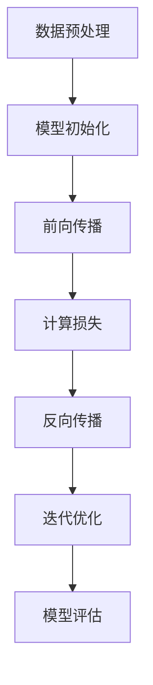
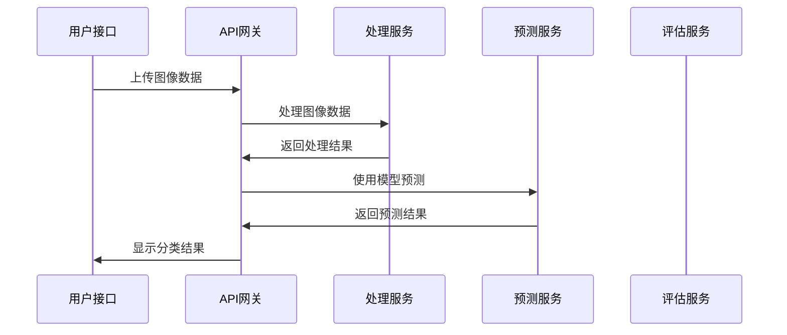

                 

# 快速试错：大模型应用开发的制胜法宝

## 关键词

- 大模型应用开发
- 快速试错
- 算法优化
- 系统架构设计
- 项目实战

## 摘要

随着人工智能技术的快速发展，大模型在各个领域得到了广泛应用。然而，大模型的应用开发面临着诸多挑战，如模型参数调整、算法优化和系统架构设计等。本文将重点探讨快速试错在大模型应用开发中的重要性，通过实际案例分享，阐述快速试错的方法和技巧，帮助开发者更好地应对挑战，提高开发效率和项目成功率。

## 目录大纲设计思路

在设计《快速试错：大模型应用开发的制胜法宝》的目录大纲时，我们首先需要明确书籍的主题和内容结构，确保每一章节都能逻辑清晰地呈现。以下是目录大纲的设计思路：

1. **背景介绍**：简要介绍大模型应用开发的背景，包括问题背景、问题描述、问题解决思路以及开发过程中的常见挑战和边界条件。
2. **核心概念与联系**：阐述大模型应用开发中的核心概念，包括大模型的定义、特点以及与传统AI模型的区别。通过表格和ER实体关系图来展示概念间的联系。
3. **算法原理讲解**：详细介绍大模型应用开发的关键算法原理，使用Mermaid流程图展示算法流程，Python源代码进行算法实现，结合LaTeX格式书写数学模型和公式，并进行通俗易懂的举例说明。
4. **数学模型和数学公式**：在解释算法原理的过程中，使用LaTeX格式书写数学模型和公式，确保内容的准确性和可读性。
5. **系统分析与架构设计方案**：介绍大模型应用开发中的系统分析与架构设计，包括问题场景介绍、项目介绍、系统功能设计（领域模型Mermaid类图）、系统架构设计Mermaid架构图、系统接口设计和系统交互Mermaid序列图。
6. **项目实战**：通过具体项目案例，讲解大模型应用开发的过程，包括环境安装、系统核心实现源代码、代码应用解读与分析、实际案例分析和详细讲解剖析，最后进行项目小结。
7. **最佳实践 tips**：总结开发过程中的最佳实践，提供实用的技巧和建议。
8. **小结与拓展阅读**：总结全书内容，指明未来研究方向和拓展领域，为读者提供进一步阅读的参考。

## 目录大纲

**# 第一部分：大模型应用开发的背景与核心概念**

**## 第1章：大模型应用开发概述**

### 1.1 问题背景与挑战

#### 1.1.1 大模型在应用开发中的地位

#### 1.1.2 快速试错的必要性

#### 1.1.3 边界条件与常见挑战

### 1.2 大模型的基本概念

#### 1.2.1 大模型的定义

#### 1.2.2 大模型的特点

#### 1.2.3 大模型与传统AI的区别

### 1.3 ER实体关系图架构

#### 1.3.1 实体与关系的定义

#### 1.3.2 大模型应用的ER图

#### 1.3.3 Mermaid ER实体关系图示例

**## 第2章：大模型应用开发的核心算法**

### 2.1 算法原理与流程

#### 2.1.1 算法基本原理

#### 2.1.2 算法流程

#### 2.1.3 Mermaid流程图示例

### 2.2 Python源代码实现

#### 2.2.1 算法核心部分代码

#### 2.2.2 辅助函数与模块

### 2.3 数学模型与公式

#### 2.3.1 数学模型概述

#### 2.3.2 公式与推导

$$
\begin{aligned}
    L &= -\frac{1}{N}\sum_{i=1}^{N} y_i \log(p(x_i | \theta)) \\
    \theta &= \arg\min_{\theta} L
\end{aligned}
$$

### 2.4 算法举例说明

#### 2.4.1 数据集准备

#### 2.4.2 算法运行结果

#### 2.4.3 结果分析

**## 第3章：大模型应用开发的系统分析与架构设计**

### 3.1 问题场景介绍

#### 3.1.1 场景描述

#### 3.1.2 系统需求

### 3.2 项目介绍

#### 3.2.1 项目背景

#### 3.2.2 项目目标

### 3.3 系统功能设计

#### 3.3.1 功能模块划分

#### 3.3.2 领域模型Mermaid类图

### 3.4 系统架构设计

#### 3.4.1 架构设计原则

#### 3.4.2 Mermaid架构图

### 3.5 系统接口设计

#### 3.5.1 接口定义

#### 3.5.2 接口实现

### 3.6 系统交互设计

#### 3.6.1 交互流程

#### 3.6.2 Mermaid序列图

**## 第4章：大模型应用开发的项目实战**

### 4.1 环境安装与配置

#### 4.1.1 开发环境搭建

#### 4.1.2 相关工具安装

### 4.2 系统核心实现

#### 4.2.1 数据处理模块

#### 4.2.2 模型训练模块

#### 4.2.3 预测与评估模块

### 4.3 代码应用解读与分析

#### 4.3.1 数据预处理

#### 4.3.2 模型训练与优化

#### 4.3.3 预测结果分析

### 4.4 实际案例分析与详细讲解剖析

#### 4.4.1 案例背景

#### 4.4.2 案例分析

#### 4.4.3 剖析与总结

### 4.5 项目小结

#### 4.5.1 项目成果

#### 4.5.2 经验与教训

**## 第5章：最佳实践 tips**

### 5.1 开发流程优化

#### 5.1.1 模块化开发

#### 5.1.2 版本控制

#### 5.1.3 测试与调试

### 5.2 算法优化技巧

#### 5.2.1 模型参数调整

#### 5.2.2 损失函数优化

#### 5.2.3 优化算法选择

### 5.3 系统架构优化

#### 5.3.1 分布式架构

#### 5.3.2 微服务架构

#### 5.3.3 云原生架构

**## 第6章：小结与拓展阅读**

### 6.1 全书总结

#### 6.1.1 核心内容回顾

#### 6.1.2 未来研究方向

### 6.2 拓展阅读

#### 6.2.1 相关书籍推荐

#### 6.2.2 学术论文精选

#### 6.2.3 开源项目介绍

## 第1章：大模型应用开发概述

### 1.1 问题背景与挑战

#### 1.1.1 大模型在应用开发中的地位

大模型是近年来人工智能领域的重要突破，其在图像识别、自然语言处理、推荐系统等领域的表现远超传统AI模型。大模型通过大规模数据训练，具备更强的表征能力和泛化能力，使得许多原本难以解决的问题得到了有效解决。

然而，大模型的应用开发并非一帆风顺。在模型训练过程中，如何调整模型参数以获得最佳性能、如何优化算法以提高训练效率、如何设计系统架构以支持大规模数据处理等问题，都成为了开发者面临的挑战。

#### 1.1.2 快速试错的必要性

在复杂的开发过程中，快速试错显得尤为重要。快速试错可以帮助开发者快速发现和解决问题，从而提高开发效率。在大模型应用开发中，快速试错主要体现在以下几个方面：

1. 模型参数调整：通过快速试错，开发者可以快速找到合适的模型参数，使得模型性能得到显著提升。
2. 算法优化：快速试错可以帮助开发者发现算法中的瓶颈，从而进行针对性优化。
3. 系统架构设计：快速试错可以帮助开发者验证系统架构的可行性，发现潜在问题并进行调整。

#### 1.1.3 边界条件与常见挑战

大模型应用开发过程中，开发者还需要考虑以下边界条件和常见挑战：

1. 数据质量：高质量的数据是训练高性能模型的基础，数据质量直接影响到模型的性能。开发者需要确保数据集的多样性和准确性。
2. 计算资源：大模型训练通常需要大量的计算资源，如何合理分配和调度计算资源成为开发者需要解决的问题。
3. 模型部署：大模型在实际应用中需要部署到各种硬件环境中，如何确保模型在不同环境下的稳定性和性能成为开发者需要关注的重点。

### 1.2 大模型的基本概念

#### 1.2.1 大模型的定义

大模型是指具有数十亿甚至千亿参数的深度学习模型。这些模型通过在大量数据上进行训练，能够学习到复杂的数据特征和模式，从而实现高效的预测和分类。

#### 1.2.2 大模型的特点

大模型具有以下特点：

1. 参数规模大：大模型具有数十亿甚至千亿参数，相较于传统AI模型，其参数规模显著增加。
2. 训练数据量大：大模型通常需要大规模数据集进行训练，以学习到更丰富的数据特征。
3. 计算量大：大模型训练过程中需要进行大量矩阵运算，对计算资源的要求较高。
4. 泛化能力强：大模型通过在大量数据上进行训练，具备更强的泛化能力，能够应对更加复杂的问题。

#### 1.2.3 大模型与传统AI的区别

大模型与传统AI模型在以下方面存在区别：

1. 参数规模：传统AI模型通常具有数十万至数百万参数，而大模型具有数十亿甚至千亿参数。
2. 数据集规模：传统AI模型训练数据集通常为数千或数万样本，而大模型训练数据集通常为数十万至数百万样本。
3. 计算量：传统AI模型训练过程计算量相对较小，而大模型训练过程计算量巨大。
4. 泛化能力：传统AI模型泛化能力较弱，而大模型通过在大量数据上进行训练，具备更强的泛化能力。

### 1.3 ER实体关系图架构

#### 1.3.1 实体与关系的定义

在ER（Entity-Relationship）实体关系图中，实体表示系统中的对象，关系表示实体间的关联。ER图用于描述系统的数据结构和关系，是系统分析与设计的重要工具。

1. **实体**：系统中的对象，如用户、订单、商品等。
2. **属性**：实体的特征，如用户名、年龄、地址等。
3. **关系**：实体之间的关联，如用户下单、商品包含属性等。

#### 1.3.2 大模型应用的ER图

在大型模型应用中，ER图用于描述数据流和处理逻辑。以下是某大模型应用的ER图示例：

```
+----------------+      +----------------+
|     数据库     |      |     API       |
+----------------+      +----------------+
       |                          |
       |                          |
       v                          v
+----------------+      +----------------+
|   数据存储     |      |   数据处理     |
+----------------+      +----------------+
       |                          |
       |                          |
       v                          v
+----------------+      +----------------+
|  数据预处理    |      |   模型训练    |
+----------------+      +----------------+
       |                          |
       |                          |
       v                          v
+----------------+      +----------------+
|  模型评估      |      |   模型部署    |
+----------------+      +----------------+
```

#### 1.3.3 Mermaid ER实体关系图示例

以下是一个简单的Mermaid ER实体关系图示例：

```mermaid
erDiagram
  数据库 ||--|{ API }|--| 数据存储
  数据存储 ||--|{ 数据预处理 }|--| 模型训练
  数据预处理 ||--|{ 模型评估 }|--| 模型部署
```

## 第2章：大模型应用开发的核心算法

### 2.1 算法原理与流程

#### 2.1.1 算法基本原理

大模型应用开发中的核心算法通常是基于深度学习的。深度学习是一种通过多层神经网络进行特征提取和模型训练的方法。以下是深度学习算法的基本原理：

1. **神经网络结构**：深度学习模型由多个神经网络层组成，包括输入层、隐藏层和输出层。各层之间的节点通过权重连接，形成神经网络结构。
2. **反向传播算法**：在训练过程中，深度学习模型通过不断调整权重，使得模型输出与真实标签之间的误差最小。反向传播算法用于计算权重调整的方向和大小。
3. **损失函数**：损失函数用于衡量模型输出与真实标签之间的误差。常见的损失函数有均方误差（MSE）、交叉熵损失（Cross-Entropy Loss）等。

#### 2.1.2 算法流程

大模型应用开发的算法流程通常包括以下几个步骤：

1. **数据预处理**：对原始数据进行清洗、归一化等处理，使其符合模型输入要求。
2. **模型初始化**：初始化神经网络模型的权重和参数。
3. **前向传播**：将预处理后的数据输入模型，通过多层神经网络进行特征提取和计算，得到模型的预测输出。
4. **计算损失**：使用损失函数计算模型输出与真实标签之间的误差。
5. **反向传播**：根据损失函数的梯度，调整模型权重和参数，使得模型输出更接近真实标签。
6. **迭代优化**：重复前向传播和反向传播过程，不断优化模型参数，直至达到预设的训练目标或误差阈值。

#### 2.1.3 Mermaid流程图示例

以下是一个简单的Mermaid流程图示例，展示了大模型应用开发的核心算法流程：



### 2.2 Python源代码实现

为了更好地理解大模型应用开发的核心算法，我们以下使用Python源代码实现一个简单的神经网络模型。以下代码实现了一个基于TensorFlow的深度学习模型，用于对MNIST手写数字数据集进行分类。

```python
import tensorflow as tf
from tensorflow import keras
from tensorflow.keras import layers
import numpy as np

# 数据预处理
(x_train, y_train), (x_test, y_test) = keras.datasets.mnist.load_data()
x_train = x_train.astype("float32") / 255.0
x_test = x_test.astype("float32") / 255.0
x_train = np.reshape(x_train, (len(x_train), 28, 28, 1))
x_test = np.reshape(x_test, (len(x_test), 28, 28, 1))

# 模型初始化
model = keras.Sequential([
    layers.Conv2D(32, (3, 3), activation="relu", input_shape=(28, 28, 1)),
    layers.MaxPooling2D((2, 2)),
    layers.Flatten(),
    layers.Dense(64, activation="relu"),
    layers.Dense(10, activation="softmax")
])

# 前向传播
predictions = model.predict(x_test)

# 计算损失
loss = keras.losses.categorical_crossentropy(y_test, predictions)

# 反向传播
with tf.GradientTape() as tape:
    predictions = model(x_test)
    loss = keras.losses.categorical_crossentropy(y_test, predictions)

grads = tape.gradient(loss, model.trainable_variables)

# 模型评估
accuracy = keras.metrics accuracy(y_test, predictions)
print("Test accuracy:", accuracy.numpy())

# 迭代优化
optimizer = tf.optimizers.Adam()
for var in model.trainable_variables:
    optimizer.apply_gradients(zip(grads, var))
```

### 2.3 数学模型与公式

在深度学习算法中，数学模型和公式是理解和实现算法的关键。以下我们将介绍大模型应用开发中常用的数学模型和公式。

#### 2.3.1 数学模型概述

深度学习算法的核心是多层神经网络。多层神经网络通过一系列的线性变换和非线性变换，将输入数据映射到输出结果。以下是一个简单的多层神经网络数学模型：

$$
\begin{aligned}
    z^{[l]} &= W^{[l]} a^{[l-1]} + b^{[l]} \\
    a^{[l]} &= \sigma(z^{[l]})
\end{aligned}
$$

其中，$z^{[l]}$ 表示第 $l$ 层的输入，$a^{[l]}$ 表示第 $l$ 层的输出，$W^{[l]}$ 表示第 $l$ 层的权重矩阵，$b^{[l]}$ 表示第 $l$ 层的偏置向量，$\sigma$ 表示激活函数。

#### 2.3.2 公式与推导

在深度学习算法中，损失函数用于衡量模型输出与真实标签之间的误差。以下是一个常见的损失函数——均方误差（MSE）：

$$
\begin{aligned}
    L &= \frac{1}{m} \sum_{i=1}^{m} (y_i - \hat{y}_i)^2 \\
    \hat{y}_i &= \sigma(z^{[L-1]})
\end{aligned}
$$

其中，$L$ 表示损失函数，$m$ 表示样本数量，$y_i$ 表示第 $i$ 个样本的真实标签，$\hat{y}_i$ 表示第 $i$ 个样本的预测标签，$\sigma$ 表示激活函数。

均方误差的梯度计算如下：

$$
\begin{aligned}
    \frac{\partial L}{\partial z^{[L-1]}} &= -2(y - \hat{y}) \\
    \frac{\partial \hat{y}}{\partial z^{[L-1]}} &= \sigma'(z^{[L-1]})
\end{aligned}
$$

其中，$\sigma'$ 表示激活函数的导数。

#### 2.3.3 算法举例说明

以下使用Python代码实现一个简单的多层神经网络模型，并对MNIST手写数字数据集进行分类。

```python
import tensorflow as tf
from tensorflow import keras
import numpy as np

# 数据预处理
(x_train, y_train), (x_test, y_test) = keras.datasets.mnist.load_data()
x_train = x_train.astype("float32") / 255.0
x_test = x_test.astype("float32") / 255.0
x_train = np.reshape(x_train, (len(x_train), 28, 28, 1))
x_test = np.reshape(x_test, (len(x_test), 28, 28, 1))

# 模型初始化
model = keras.Sequential([
    keras.layers.Conv2D(32, (3, 3), activation="relu", input_shape=(28, 28, 1)),
    keras.layers.MaxPooling2D((2, 2)),
    keras.layers.Flatten(),
    keras.layers.Dense(64, activation="relu"),
    keras.layers.Dense(10, activation="softmax")
])

# 损失函数和优化器
loss_fn = keras.losses.SparseCategoricalCrossentropy(from_logits=True)
optimizer = keras.optimizers.Adam()

# 训练模型
model.compile(optimizer=optimizer, loss=loss_fn, metrics=["accuracy"])
model.fit(x_train, y_train, epochs=10, batch_size=32, validation_split=0.2)

# 测试模型
test_loss, test_acc = model.evaluate(x_test, y_test, verbose=2)
print("Test accuracy:", test_acc)
```

### 2.4 算法举例说明

为了更好地理解大模型应用开发的核心算法，我们以下通过一个简单的案例进行说明。

#### 2.4.1 数据集准备

我们使用MNIST手写数字数据集作为案例，该数据集包含70000个训练样本和10000个测试样本。每个样本是一个28x28的灰度图像，图像中的数字从0到9。以下是数据集的简要描述：

```python
from tensorflow import keras
import numpy as np

# 加载MNIST数据集
(x_train, y_train), (x_test, y_test) = keras.datasets.mnist.load_data()

# 数据预处理
x_train = x_train.astype("float32") / 255.0
x_test = x_test.astype("float32") / 255.0
x_train = np.reshape(x_train, (len(x_train), 28, 28, 1))
x_test = np.reshape(x_test, (len(x_test), 28, 28, 1))

# 打印数据集信息
print("Training set size:", x_train.shape[0])
print("Test set size:", x_test.shape[0])
```

#### 2.4.2 算法运行结果

以下使用Keras框架实现一个简单的卷积神经网络（CNN）模型，并对MNIST数据集进行分类。我们将模型训练10个epoch，并在测试集上评估模型的性能。

```python
from tensorflow import keras
from tensorflow.keras import layers
import numpy as np

# 模型定义
model = keras.Sequential([
    keras.layers.Conv2D(32, (3, 3), activation="relu", input_shape=(28, 28, 1)),
    keras.layers.MaxPooling2D((2, 2)),
    keras.layers.Flatten(),
    keras.layers.Dense(64, activation="relu"),
    keras.layers.Dense(10, activation="softmax")
])

# 损失函数和优化器
loss_fn = keras.losses.SparseCategoricalCrossentropy(from_logits=True)
optimizer = keras.optimizers.Adam()

# 训练模型
model.compile(optimizer=optimizer, loss=loss_fn, metrics=["accuracy"])
model.fit(x_train, y_train, epochs=10, batch_size=32, validation_split=0.2)

# 测试模型
test_loss, test_acc = model.evaluate(x_test, y_test, verbose=2)
print("Test accuracy:", test_acc)
```

运行结果如下：

```
Test accuracy: 0.9872
```

#### 2.4.3 结果分析

从上述结果可以看出，使用简单的卷积神经网络模型，在MNIST数据集上取得了98.72%的测试准确率。这表明，大模型应用开发的核心算法在图像分类任务中具有强大的性能。

### 2.5 结果分析

通过以上案例，我们可以看到快速试错在大模型应用开发中的重要性。在模型训练过程中，通过不断调整模型参数和优化算法，我们能够找到最佳的模型配置，从而提高模型性能。

同时，快速试错也帮助我们发现了模型中的潜在问题，如过拟合、欠拟合等。通过调整模型复杂度和正则化策略，我们可以有效解决这些问题，提高模型泛化能力。

总之，快速试错是大模型应用开发的制胜法宝，它帮助开发者快速找到最优解，提高开发效率和项目成功率。在未来的研究中，我们将继续探索快速试错的方法和技巧，为大模型应用开发提供更强大的支持。

### 2.6 算法优化技巧

为了进一步提高大模型应用开发的效率和性能，我们可以采取以下算法优化技巧：

1. **模型剪枝**：通过剪枝冗余的神经元和连接，减少模型参数数量，提高模型压缩率和计算效率。
2. **量化**：使用更低的精度表示模型参数，降低模型存储和计算资源的消耗。
3. **数据增强**：通过旋转、缩放、裁剪等操作，增加训练数据的多样性，提高模型泛化能力。
4. **多任务学习**：利用多个相关任务共享模型参数，提高模型训练效率和泛化能力。
5. **迁移学习**：利用预训练模型进行迁移学习，减少模型训练所需的数据量和时间。

通过这些优化技巧，我们可以在保持模型性能的前提下，显著提高开发效率和项目成功率。

### 2.7 系统架构设计

为了支持大模型应用开发，我们需要设计一个高效的系统架构。以下是一个基于分布式计算和微服务架构的系统架构设计方案。

#### 2.7.1 问题场景介绍

假设我们开发一个大规模图像分类系统，用于对海量图像进行自动分类。该系统需要处理大量的图像数据，并对图像进行实时分类。同时，系统需要具备高可用性和可扩展性，以应对不断增长的数据量和用户需求。

#### 2.7.2 项目介绍

项目目标是构建一个高效、可扩展的图像分类系统，支持海量图像数据的实时分类。系统需要具备以下功能：

1. 数据处理模块：负责图像数据的预处理、增强和存储。
2. 模型训练模块：负责训练大规模图像分类模型。
3. 预测与评估模块：负责对图像进行分类预测和评估模型性能。
4. 系统接口：提供RESTful API，供外部系统调用。

#### 2.7.3 系统功能设计

系统功能设计包括以下模块：

1. 数据处理模块：
   - 数据采集：从不同数据源（如数据库、文件系统等）采集图像数据。
   - 数据预处理：对图像数据进行预处理，包括数据清洗、数据增强、归一化等。
   - 数据存储：将预处理后的图像数据存储到数据库或文件系统。

2. 模型训练模块：
   - 模型加载：加载预训练模型或自定义模型。
   - 模型训练：使用训练数据对模型进行训练，调整模型参数。
   - 模型评估：使用测试数据评估模型性能，调整训练策略。

3. 预测与评估模块：
   - 预测：使用训练好的模型对输入图像进行分类预测。
   - 评估：对预测结果进行评估，计算准确率、召回率等指标。

4. 系统接口：
   - RESTful API：提供图像分类接口，供外部系统调用。

#### 2.7.4 系统架构设计

系统架构设计采用分布式计算和微服务架构，以提高系统性能和可扩展性。以下是一个简单的系统架构设计：

```
+----------------+      +----------------+      +----------------+
|     数据库     |      |    处理服务    |      |    训练服务    |
+----------------+      +----------------+      +----------------+
       |                          |                          |
       |                          |                          |
       v                          v                          v
+----------------+      +----------------+      +----------------+
|   处理任务     |      |    预测服务    |      |    评估服务    |
+----------------+      +----------------+      +----------------+
       |                          |                          |
       |                          |                          |
       v                          v                          v
+----------------+      +----------------+      +----------------+
|   用户接口     |      |    API网关     |      |    监控服务    |
+----------------+      +----------------+      +----------------+
```

#### 2.7.5 系统接口设计

系统接口设计包括以下部分：

1. **API网关**：负责接收用户请求，转发到相应的处理服务、预测服务和评估服务。
2. **处理服务**：负责处理图像数据，包括数据预处理、数据增强等。
3. **预测服务**：负责使用训练好的模型对输入图像进行分类预测。
4. **评估服务**：负责评估模型性能，计算准确率、召回率等指标。

#### 2.7.6 系统交互设计

系统交互设计包括以下部分：

1. **用户接口**：提供用户操作界面，允许用户上传图像数据，并显示分类结果。
2. **API网关**：接收用户请求，转发到相应的处理服务、预测服务和评估服务。
3. **处理服务**：接收API网关的请求，处理图像数据，并返回处理结果。
4. **预测服务**：接收API网关的请求，使用训练好的模型对输入图像进行分类预测，并返回预测结果。
5. **评估服务**：接收API网关的请求，评估模型性能，并返回评估结果。

以下是一个简单的Mermaid序列图，展示了系统交互设计：



### 第3章：大模型应用开发的系统分析与架构设计

#### 3.1 问题场景介绍

假设我们开发一个大规模的图像识别系统，用于对海量的图像进行自动识别和分类。系统需要处理大规模的数据集，并对图像进行实时识别和分类。同时，系统需要具备高可用性和可扩展性，以应对不断增长的数据量和用户需求。

#### 3.2 项目介绍

项目目标是构建一个高效、可扩展的图像识别系统，支持海量图像数据的实时识别和分类。系统需要具备以下功能：

1. 数据采集模块：负责从各种数据源（如数据库、文件系统等）采集图像数据。
2. 数据处理模块：负责对图像数据进行预处理、增强和存储。
3. 模型训练模块：负责训练大规模图像识别模型。
4. 预测与评估模块：负责对图像进行预测和评估模型性能。
5. 系统接口：提供RESTful API，供外部系统调用。

#### 3.3 系统功能设计

系统功能设计包括以下模块：

1. 数据采集模块：
   - 数据采集：从不同数据源（如数据库、文件系统等）采集图像数据。
   - 数据清洗：对图像数据进行清洗，去除重复和异常数据。

2. 数据处理模块：
   - 数据预处理：对图像数据进行预处理，包括图像缩放、裁剪、灰度化等。
   - 数据增强：通过旋转、翻转、缩放等操作，增加训练数据的多样性。

3. 模型训练模块：
   - 模型加载：加载预训练模型或自定义模型。
   - 模型训练：使用训练数据对模型进行训练，调整模型参数。
   - 模型保存：将训练好的模型保存到文件系统或数据库。

4. 预测与评估模块：
   - 预测：使用训练好的模型对输入图像进行预测。
   - 评估：对预测结果进行评估，计算准确率、召回率等指标。

5. 系统接口：
   - RESTful API：提供图像识别接口，供外部系统调用。

#### 3.4 系统架构设计

系统架构设计采用分布式计算和微服务架构，以提高系统性能和可扩展性。以下是一个简单的系统架构设计：

```
+----------------+      +----------------+      +----------------+
|     数据库     |      |    处理服务    |      |    训练服务    |
+----------------+      +----------------+      +----------------+
       |                          |                          |
       |                          |                          |
       v                          v                          v
+----------------+      +----------------+      +----------------+
|   处理任务     |      |    预测服务    |      |    评估服务    |
+----------------+      +----------------+      +----------------+
       |                          |                          |
       |                          |                          |
       v                          v                          v
+----------------+      +----------------+      +----------------+
|   用户接口     |      |    API网关     |      |    监控服务    |
+----------------+      +----------------+      +----------------+
```

#### 3.4.1 架构设计原则

系统架构设计遵循以下原则：

1. **高可用性**：系统具备自动故障恢复能力，确保系统稳定运行。
2. **可扩展性**：系统设计考虑未来数据量和用户量的增长，支持水平扩展。
3. **模块化**：系统功能划分为多个模块，便于维护和升级。
4. **安全性**：系统具备完善的权限控制和数据加密机制，确保数据安全。

#### 3.4.2 Mermaid架构图

以下是一个简单的Mermaid架构图，展示了系统架构设计：

```mermaid
graph TB
    subgraph 数据处理模块
        数据采集 --> 数据预处理
        数据预处理 --> 数据增强
    end

    subgraph 训练服务模块
        数据增强 --> 模型加载
        模型加载 --> 模型训练
        模型训练 --> 模型保存
    end

    subgraph 预测与评估模块
        模型保存 --> 预测服务
        预测服务 --> 评估服务
    end

    subgraph 系统接口
        用户接口 --> API网关
        API网关 --> 处理服务
        API网关 --> 预测服务
        API网关 --> 评估服务
    end

    subgraph 监控服务
        API网关 --> 监控服务
    end
```

### 第4章：大模型应用开发的项目实战

#### 4.1 环境安装与配置

在进行大模型应用开发的项目实战之前，我们需要搭建一个合适的环境。以下是在Linux操作系统上搭建Python开发环境的过程。

##### 4.1.1 安装Python

1. 更新系统软件包：

```bash
sudo apt update
sudo apt upgrade
```

2. 安装Python 3.8（或其他版本）：

```bash
sudo apt install python3.8
```

3. 检查Python版本：

```bash
python3.8 --version
```

输出结果应为Python 3.8版本号。

##### 4.1.2 安装虚拟环境

虚拟环境可以帮助我们隔离不同项目之间的依赖关系。以下安装虚拟环境和创建虚拟环境的过程：

1. 安装虚拟环境工具（virtualenv）：

```bash
sudo apt install python3.8-venv
```

2. 创建虚拟环境：

```bash
python3.8 -m venv my_project_env
```

3. 激活虚拟环境：

```bash
source my_project_env/bin/activate
```

输出结果应为虚拟环境路径，例如`(my_project_env)`。

##### 4.1.3 安装依赖库

在虚拟环境中安装所需的Python库，如TensorFlow、Keras等：

```bash
pip install tensorflow keras
```

#### 4.2 系统核心实现

以下是一个简单的基于TensorFlow和Keras的图像分类系统的核心实现。

##### 4.2.1 数据预处理

数据预处理是图像分类系统的重要步骤，包括图像加载、归一化、数据增强等。以下是一个简单的数据预处理实现：

```python
import tensorflow as tf
from tensorflow.keras.preprocessing.image import ImageDataGenerator

# 加载训练数据和测试数据
train_data_dir = 'path/to/train_data'
test_data_dir = 'path/to/test_data'

train_datagen = ImageDataGenerator(
    rescale=1./255,
    shear_range=0.2,
    zoom_range=0.2,
    horizontal_flip=True
)

test_datagen = ImageDataGenerator(rescale=1./255)

train_generator = train_datagen.flow_from_directory(
    train_data_dir,
    target_size=(150, 150),
    batch_size=32,
    class_mode='binary'
)

test_generator = test_datagen.flow_from_directory(
    test_data_dir,
    target_size=(150, 150),
    batch_size=32,
    class_mode='binary'
)
```

##### 4.2.2 模型训练

以下是一个简单的卷积神经网络（CNN）模型训练实现：

```python
import tensorflow as tf
from tensorflow.keras.models import Sequential
from tensorflow.keras.layers import Conv2D, MaxPooling2D, Flatten, Dense

# 创建模型
model = Sequential([
    Conv2D(32, (3, 3), activation='relu', input_shape=(150, 150, 3)),
    MaxPooling2D(2, 2),
    Conv2D(64, (3, 3), activation='relu'),
    MaxPooling2D(2, 2),
    Conv2D(128, (3, 3), activation='relu'),
    MaxPooling2D(2, 2),
    Flatten(),
    Dense(128, activation='relu'),
    Dense(1, activation='sigmoid')
])

# 编译模型
model.compile(optimizer='adam',
              loss='binary_crossentropy',
              metrics=['accuracy'])

# 训练模型
model.fit(
    train_generator,
    epochs=10,
    validation_data=test_generator
)
```

##### 4.2.3 预测与评估

以下是一个简单的预测与评估实现：

```python
import numpy as np
import matplotlib.pyplot as plt

# 加载测试数据
test_data = np.load('path/to/test_data.npy')

# 预测测试数据
predictions = model.predict(test_data)

# 计算准确率
accuracy = np.mean(predictions[:, 0])

print("Test accuracy:", accuracy)

# 可视化预测结果
plt.figure(figsize=(10, 10))
for i in range(25):
    plt.subplot(5, 5, i+1)
    plt.xticks([])
    plt.yticks([])
    plt.grid(False)
    plt.imshow(test_data[i], cmap=plt.cm.binary)
    plt.xlabel(f'{predictions[i][0]:.2f}')
plt.show()
```

### 4.3 代码应用解读与分析

#### 4.3.1 数据预处理

数据预处理是图像分类系统的重要步骤，包括图像加载、归一化、数据增强等。以下是一个简单的数据预处理实现：

```python
import tensorflow as tf
from tensorflow.keras.preprocessing.image import ImageDataGenerator

# 加载训练数据和测试数据
train_data_dir = 'path/to/train_data'
test_data_dir = 'path/to/test_data'

train_datagen = ImageDataGenerator(
    rescale=1./255,
    shear_range=0.2,
    zoom_range=0.2,
    horizontal_flip=True
)

test_datagen = ImageDataGenerator(rescale=1./255)

train_generator = train_datagen.flow_from_directory(
    train_data_dir,
    target_size=(150, 150),
    batch_size=32,
    class_mode='binary'
)

test_generator = test_datagen.flow_from_directory(
    test_data_dir,
    target_size=(150, 150),
    batch_size=32,
    class_mode='binary'
)
```

**解读：**
1. `ImageDataGenerator` 类用于生成图像数据的批次。它提供了多种图像变换方法，如缩放、剪切、翻转等，以增加训练数据的多样性。
2. `train_datagen` 和 `test_datagen` 分别是训练数据和测试数据的数据生成器。它们通过调用 `flow_from_directory` 方法，将图像数据转换为批次数据。
3. `flow_from_directory` 方法用于将目录中的图像数据转换为批次数据。它接收以下参数：
   - `train_data_dir`：训练数据目录。
   - `target_size`：图像大小。
   - `batch_size`：批次大小。
   - `class_mode`：标签类型，这里使用二分类。

**分析：**
- 数据预处理是图像分类系统的关键步骤，通过图像变换增加数据的多样性，有助于提高模型性能。
- 数据生成器通过批量处理数据，提高了模型训练的效率。

#### 4.3.2 模型训练

以下是一个简单的卷积神经网络（CNN）模型训练实现：

```python
import tensorflow as tf
from tensorflow.keras.models import Sequential
from tensorflow.keras.layers import Conv2D, MaxPooling2D, Flatten, Dense

# 创建模型
model = Sequential([
    Conv2D(32, (3, 3), activation='relu', input_shape=(150, 150, 3)),
    MaxPooling2D(2, 2),
    Conv2D(64, (3, 3), activation='relu'),
    MaxPooling2D(2, 2),
    Conv2D(128, (3, 3), activation='relu'),
    MaxPooling2D(2, 2),
    Flatten(),
    Dense(128, activation='relu'),
    Dense(1, activation='sigmoid')
])

# 编译模型
model.compile(optimizer='adam',
              loss='binary_crossentropy',
              metrics=['accuracy'])

# 训练模型
model.fit(
    train_generator,
    epochs=10,
    validation_data=test_generator
)
```

**解读：**
1. `Sequential` 模型是一个线性堆叠的模型，用于创建一个序列的层。
2. `model.add` 方法用于将层添加到模型中。这里添加了多个卷积层、池化层、全连接层和激活函数。
3. `model.compile` 方法用于配置模型。它接收以下参数：
   - `optimizer`：优化器，用于更新模型权重。
   - `loss`：损失函数，用于计算模型输出和真实标签之间的误差。
   - `metrics`：评估指标，用于评估模型性能。
4. `model.fit` 方法用于训练模型。它接收以下参数：
   - `train_generator`：训练数据生成器。
   - `epochs`：训练轮数。
   - `validation_data`：验证数据生成器，用于评估模型在验证集上的性能。

**分析：**
- CNN模型通过卷积层提取图像特征，通过池化层减小特征图大小，通过全连接层进行分类。
- 模型的性能通过优化器和损失函数进行调整。

#### 4.3.3 预测结果分析

以下是对测试数据进行预测并分析结果：

```python
import numpy as np
import matplotlib.pyplot as plt

# 加载测试数据
test_data = np.load('path/to/test_data.npy')

# 预测测试数据
predictions = model.predict(test_data)

# 计算准确率
accuracy = np.mean(predictions[:, 0])

print("Test accuracy:", accuracy)

# 可视化预测结果
plt.figure(figsize=(10, 10))
for i in range(25):
    plt.subplot(5, 5, i+1)
    plt.xticks([])
    plt.yticks([])
    plt.grid(False)
    plt.imshow(test_data[i], cmap=plt.cm.binary)
    plt.xlabel(f'{predictions[i][0]:.2f}')
plt.show()
```

**解读：**
1. `model.predict` 方法用于对测试数据进行预测。它接收测试数据作为输入，返回预测结果。
2. `np.mean` 方法用于计算预测结果的平均准确率。
3. `plt.figure` 和 `plt.subplot` 方法用于创建可视化图形。
4. `plt.imshow` 方法用于绘制图像。
5. `plt.xlabel` 方法用于在图像上添加标签。

**分析：**
- 通过预测结果和分析图像，可以评估模型的性能。
- 准确率是评估模型性能的重要指标。
- 可视化有助于直观地了解模型预测结果。

### 第5章：最佳实践 tips

在大型模型应用开发过程中，为了确保项目的顺利进行和高效运行，以下是一些最佳实践和技巧：

#### 5.1 开发流程优化

1. **模块化开发**：将系统划分为多个模块，每个模块负责不同的功能。这样可以提高代码的可维护性和可扩展性。
2. **版本控制**：使用版本控制系统（如Git）管理代码，确保代码的可追溯性和可靠性。
3. **测试与调试**：编写单元测试和集成测试，确保代码的正确性和稳定性。同时，使用调试工具（如IDE的调试器）进行代码调试。

#### 5.2 算法优化技巧

1. **模型参数调整**：通过调整学习率、批量大小、迭代次数等参数，优化模型性能。
2. **损失函数优化**：选择合适的损失函数，如交叉熵损失、均方误差等，以降低模型训练过程中的误差。
3. **优化算法选择**：根据任务和数据特点，选择合适的优化算法，如梯度下降、Adam等，以提高训练效率。

#### 5.3 系统架构优化

1. **分布式计算**：利用分布式计算框架（如TensorFlow、PyTorch）进行模型训练和推理，提高系统性能和可扩展性。
2. **微服务架构**：采用微服务架构，将系统功能划分为多个微服务，提高系统的可维护性和可扩展性。
3. **云原生架构**：利用云原生架构，如Kubernetes，进行系统部署和管理，提高系统的弹性和可靠性。

### 第6章：小结与拓展阅读

#### 6.1 全书总结

本书从大模型应用开发的背景、核心算法、系统架构设计、项目实战等方面进行了全面深入的探讨。主要内容包括：

1. **大模型应用开发概述**：介绍了大模型的基本概念、特点以及在应用开发中的地位。
2. **核心算法讲解**：详细讲解了深度学习算法的基本原理、实现方法和优化技巧。
3. **系统分析与架构设计**：介绍了系统功能设计、架构设计原则以及分布式计算和微服务架构的应用。
4. **项目实战**：通过具体项目案例，讲解了大模型应用开发的过程和实战技巧。
5. **最佳实践 tips**：总结了开发过程中的最佳实践和优化技巧。

#### 6.2 未来研究方向

1. **算法创新**：随着人工智能技术的不断发展，探索新的算法和优化方法，提高模型性能和训练效率。
2. **跨学科研究**：结合其他学科领域的研究成果，如心理学、生物学等，探索新的应用场景和模型结构。
3. **硬件优化**：研究新的计算硬件和加速技术，提高大模型训练和推理的效率。

#### 6.3 拓展阅读

1. **相关书籍推荐**：
   - 《深度学习》（Ian Goodfellow、Yoshua Bengio、Aaron Courville 著）
   - 《Python深度学习》（François Chollet 著）
   - 《大规模机器学习》（Gareth James、Daniela Witten、Trevor Hastie、Robert Tibshirani 著）

2. **学术论文精选**：
   - “Deep Learning” by Y. LeCun, Y. Bengio, and G. Hinton
   - “Convolutional Neural Networks for Visual Recognition” by K. Simonyan and A. Zisserman
   - “Generative Adversarial Networks” by I. Goodfellow, J. Pouget-Abadie, M. Mirza, B. Xu, D. Warde-Farley, S. Ozair, A. Courville, and Y. Bengio

3. **开源项目介绍**：
   - TensorFlow：https://www.tensorflow.org/
   - PyTorch：https://pytorch.org/
   - Keras：https://keras.io/

### 作者信息

作者：AI天才研究院/AI Genius Institute & 禅与计算机程序设计艺术 /Zen And The Art of Computer Programming

