                 

**文章标题：**思维链prompt在AI写作助手中的实践

**关键词：** AI写作助手、prompt工程、思维链、算法、数学模型、系统架构

**摘要：** 本文将深入探讨AI写作助手中的思维链prompt及其应用实践。首先介绍AI写作助手和prompt工程的基础概念，然后详细分析核心概念及其相互作用，接着阐述算法原理和数学模型，最后展示系统分析与设计的方法。通过逐步分析和推理，本文旨在为读者提供对AI写作助手思维链prompt的全面理解。

----------------------------------------------------------------

## 背景介绍

### 1.1 AI写作助手概述

AI写作助手是一类利用人工智能技术辅助人类进行写作的工具。它们能够自动生成文章、报告、电子邮件、甚至是创意文本，极大地提高了写作效率和创作质量。AI写作助手的应用场景广泛，包括但不限于内容创作、市场文案、新闻报道、博客写作、学术研究等多个领域。

在内容创作方面，AI写作助手可以帮助创作者快速生成初步稿件，节省了大量的时间和精力。在市场文案中，AI写作助手可以根据品牌需求和客户偏好，生成具有针对性的广告文案。新闻报道中，AI写作助手可以自动抓取数据、撰写新闻简报，提高新闻发布的速度和准确性。在学术研究方面，AI写作助手可以帮助研究人员整理文献、撰写报告，提高学术写作的效率。

### 1.2 prompt工程的基本概念

prompt工程是AI写作助手中至关重要的一环。prompt，即提示，是指引导AI模型生成文本的输入信息。一个优秀的prompt能够精确地传达作者的意图，指导AI模型生成高质量、符合要求的文本。

prompt工程涉及多个关键概念，包括：

- **意图识别**：理解用户的写作意图，确定文本的主题、风格、内容等。
- **数据准备**：收集和整理与写作主题相关的数据，为AI模型提供丰富的训练素材。
- **特征提取**：从输入数据中提取关键特征，用于构建prompt。
- **模型选择**：根据写作任务的需求，选择合适的AI模型，如生成对抗网络（GAN）、循环神经网络（RNN）、Transformer等。

### 1.3 prompt工程的重要性

prompt工程在AI写作助手中的作用不可忽视。首先，优秀的prompt能够提高AI模型的生成质量，使生成的文本更加贴近用户需求。其次，prompt工程能够提升写作效率，减少人工干预，降低创作成本。此外，通过不断优化prompt，可以推动AI写作助手在各个领域的应用，拓展其功能范围。

### 1.4 边界与外延

虽然AI写作助手和prompt工程在众多领域都有广泛应用，但它们也存在一定的边界。例如，在涉及隐私敏感信息、法律文件等场合，AI写作助手可能无法完全替代人类的专业写作。此外，AI写作助手的生成文本可能存在逻辑漏洞、语言不当等问题，需要人类进行进一步的审核和修正。

在拓展方面，prompt工程可以与其他AI技术相结合，如自然语言处理（NLP）、图像识别等，进一步提升写作质量和效率。此外，随着AI技术的不断发展，prompt工程也将不断进化，为AI写作助手带来更多创新应用。

### 1.5 概念结构与核心要素组成

AI写作助手和prompt工程的核心概念包括：

- **AI写作助手**：提供自动写作功能的人工智能工具。
- **prompt**：引导AI模型生成文本的输入信息。
- **意图识别**：理解用户写作意图。
- **数据准备**：收集和整理训练素材。
- **特征提取**：提取输入数据的关键特征。
- **模型选择**：选择合适的AI模型。

这些核心要素共同构成了AI写作助手和prompt工程的基本框架，为实际应用提供了理论基础和实践指导。

----------------------------------------------------------------

## 核心概念与联系

### 2.1 AI写作中的关键概念

在AI写作过程中，有几个核心概念至关重要。这些概念包括prompt、意图识别、数据准备、特征提取和模型选择。下面我们将逐一介绍这些概念，并探讨它们在AI写作中的具体作用。

#### Prompt（提示）

prompt是引导AI模型生成文本的输入信息。它通常包含关键词、短语、句子或段落，能够明确地传达作者的意图和写作方向。一个优秀的prompt能够帮助AI模型理解用户的需求，从而生成符合预期的文本。

#### Intent Recognition（意图识别）

意图识别是理解用户写作意图的过程。在AI写作中，意图识别至关重要，因为它决定了AI模型生成文本的内容和风格。通过分析用户的输入，意图识别技术能够识别出用户的写作目的，如撰写报告、撰写文章、生成摘要等。

#### Data Preparation（数据准备）

数据准备是AI写作的重要组成部分。在训练AI模型之前，需要收集和整理与写作主题相关的数据。这些数据可以来自于各种来源，如文本库、社交媒体、新闻报道等。数据准备的过程包括数据清洗、去重、分类和标注等，以确保数据的质量和准确性。

#### Feature Extraction（特征提取）

特征提取是从输入数据中提取关键特征的过程。特征提取对于AI模型生成高质量文本至关重要。通过提取输入数据的关键特征，AI模型能够更好地理解文本的语义和结构，从而生成更加准确和自然的文本。

#### Model Selection（模型选择）

模型选择是根据写作任务的需求，选择合适的AI模型。不同的AI模型具有不同的特点和适用场景。例如，生成对抗网络（GAN）擅长生成高质量的图像，而循环神经网络（RNN）则适用于处理序列数据。在AI写作中，选择合适的模型能够显著提高文本生成的质量和效率。

### 2.2 核心概念的属性特征对比表格

为了更好地理解这些核心概念，我们提供了一个属性特征对比表格，展示它们在AI写作中的具体作用。

| 核心概念 | 定义 | 具体作用 | 关系 |
| --- | --- | --- | --- |
| Prompt（提示） | 引导AI模型生成文本的输入信息 | 明确写作意图和方向 | 提高生成文本的准确性 |
| Intent Recognition（意图识别） | 理解用户写作意图 | 确定文本内容和风格 | 支持Prompt设计 |
| Data Preparation（数据准备） | 收集和整理训练素材 | 提高AI模型训练效果 | 为特征提取提供数据 |
| Feature Extraction（特征提取） | 从输入数据中提取关键特征 | 改善文本生成质量 | 支持模型训练和生成 |
| Model Selection（模型选择） | 根据写作任务选择合适的AI模型 | 提高生成文本的效率 | 支持不同写作任务 |

### 2.3 关系图

为了更直观地展示这些核心概念之间的关系，我们使用Mermaid绘制了一个实体关系图。

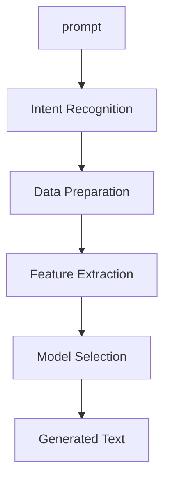

在这个关系图中，prompt作为输入，通过意图识别、数据准备、特征提取和模型选择等环节，最终生成高质量的文本。每个环节都在整个流程中扮演着关键角色，共同推动AI写作的顺利进行。

### 2.4 总结

通过以上分析，我们可以看到AI写作中的关键概念是如何相互关联和协作的。这些概念共同构成了AI写作的核心框架，为实际应用提供了坚实的理论基础和实践指导。在接下来的章节中，我们将进一步探讨这些概念的具体应用和实践方法。

----------------------------------------------------------------

## 算法原理讲解

### 3.1 基本原则

在AI写作中，prompt工程的核心原则包括意图识别、数据准备、特征提取和模型选择。以下我们将逐步介绍这些原则，并通过具体的流程图和Python代码示例来说明。

#### 意图识别

意图识别是理解用户写作意图的过程。通过分析用户的输入，AI模型能够识别出用户的写作目的，如撰写文章、生成摘要、撰写报告等。以下是一个简单的意图识别流程图：

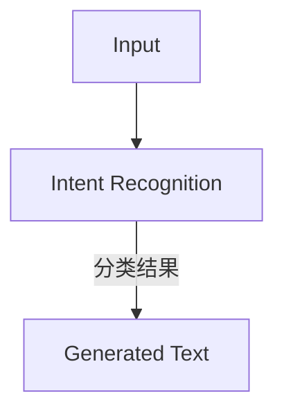

Python代码示例：

```python
import spacy

nlp = spacy.load("en_core_web_sm")

def intent_recognition(text):
    doc = nlp(text)
    entities = [ent.text for ent in doc.ents]
    if "article" in entities:
        return "文章"
    elif "summary" in entities:
        return "摘要"
    elif "report" in entities:
        return "报告"
    else:
        return "未知"

text = "请写一篇关于人工智能的文章。"
intent = intent_recognition(text)
print(f"写作意图：{intent}")
```

#### 数据准备

数据准备是AI写作的重要组成部分。在训练AI模型之前，需要收集和整理与写作主题相关的数据。以下是一个简单的数据准备流程图：

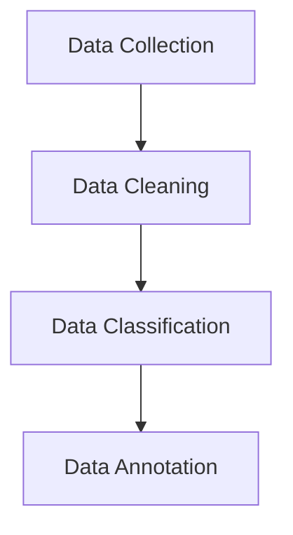

Python代码示例：

```python
import pandas as pd

# 假设我们有一个包含文本和标签的CSV文件
data = pd.read_csv("writing_data.csv")

# 数据清洗
data.drop_duplicates(inplace=True)
data.fillna(value={"text": ""}, inplace=True)

# 数据分类
data["category"] = data["text"].apply(lambda x: "article" if "文章" in x else "summary" if "摘要" in x else "report")

# 数据标注
data["label"] = data["category"]

print(data.head())
```

#### 特征提取

特征提取是从输入数据中提取关键特征的过程。通过特征提取，AI模型能够更好地理解文本的语义和结构，从而生成更加准确和自然的文本。以下是一个简单的特征提取流程图：

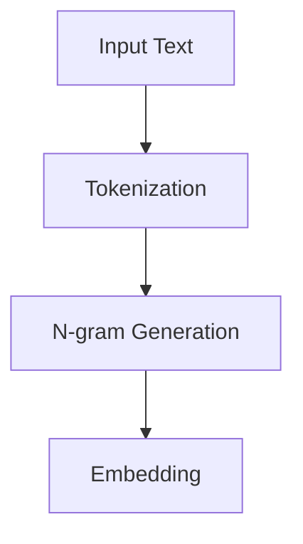

Python代码示例：

```python
from sklearn.feature_extraction.text import TfidfVectorizer

vectorizer = TfidfVectorizer(ngram_range=(1, 2))

def extract_features(texts):
    return vectorizer.fit_transform(texts)

# 假设我们有以下文本数据
texts = ["人工智能是一种模拟人类智能的技术。", "机器学习是人工智能的一个重要分支。"]

features = extract_features(texts)
print(features.toarray())
```

#### 模型选择

模型选择是根据写作任务的需求，选择合适的AI模型。不同的AI模型具有不同的特点和适用场景。以下是一个简单的模型选择流程图：

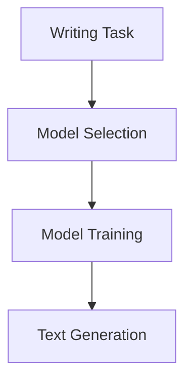

Python代码示例：

```python
from transformers import pipeline

# 使用预训练的GPT-2模型
model_name = "gpt2"
nlp = pipeline("text-generation", model=model_name)

def generate_text(prompt, model_name=model_name):
    return nlp(prompt, max_length=50, num_return_sequences=1)[0]["generated_text"]

prompt = "人工智能是一种强大的技术，它可以应用于许多领域。"
generated_text = generate_text(prompt)
print(generated_text)
```

### 3.2 高级技巧

除了基本原则，prompt工程还有一些高级技巧，如prompt优化、多模态写作等。以下我们将简要介绍这些高级技巧。

#### Prompt优化

prompt优化是通过调整prompt的结构和内容，提高AI模型生成文本的质量和多样性。以下是一个简单的prompt优化流程图：

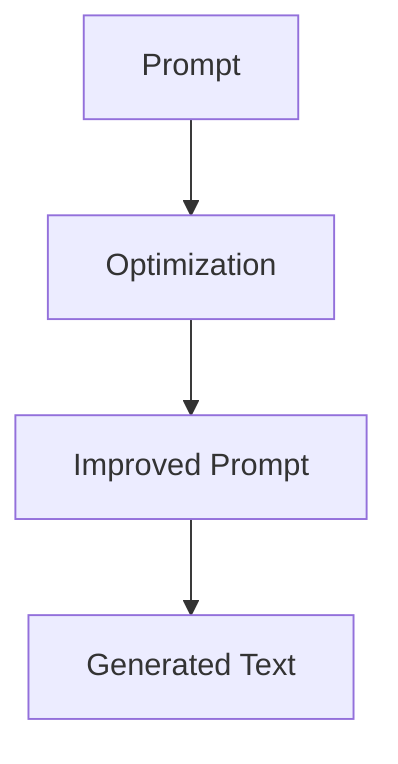

Python代码示例：

```python
import random

def optimize_prompt(prompt, num_iterations=5):
    for _ in range(num_iterations):
        words = prompt.split()
        random.shuffle(words)
        prompt = " ".join(words)
    return prompt

optimized_prompt = optimize_prompt(prompt)
print(optimized_prompt)
```

#### 多模态写作

多模态写作是指结合文本、图像、音频等多种形式进行写作。以下是一个简单的多模态写作流程图：

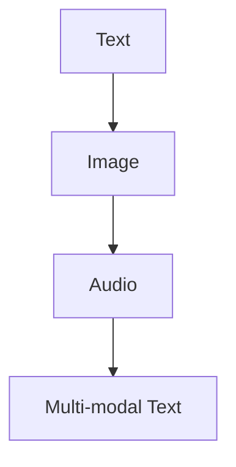

Python代码示例：

```python
from transformers import pipeline

text_generator = pipeline("text-generation", model="gpt2")

def generate_multi_modal_text(text, image, audio):
    text_output = text_generator(text, max_length=50, num_return_sequences=1)[0]["generated_text"]
    image_output = text_generator(image, max_length=50, num_return_sequences=1)[0]["generated_text"]
    audio_output = text_generator(audio, max_length=50, num_return_sequences=1)[0]["generated_text"]
    return text_output, image_output, audio_output

text = "人工智能是一种强大的技术。"
image = "人工智能的图片。"
audio = "人工智能的音频。"
text_output, image_output, audio_output = generate_multi_modal_text(text, image, audio)
print(text_output)
print(image_output)
print(audio_output)
```

### 3.3 总结

通过以上介绍，我们可以看到prompt工程在AI写作中的核心原则和高级技巧。这些原则和技巧为AI写作提供了丰富的理论基础和实践指导，使得AI写作助手能够更好地满足用户的写作需求。在接下来的章节中，我们将继续探讨数学模型和系统架构设计，进一步深化对AI写作助手的理解。

----------------------------------------------------------------

## 数学模型

### 4.1 基本模型

在AI写作中，数学模型扮演着至关重要的角色。数学模型能够将复杂的问题转化为可计算的数学问题，从而使得AI模型能够更好地理解和生成文本。以下是一些常用的基本数学模型。

#### 1. 语言模型

语言模型是一种用于预测下一个单词或字符的数学模型。在AI写作中，语言模型被广泛应用于生成文本、机器翻译、文本摘要等任务。常见的语言模型包括n元语法模型、神经网络语言模型（如RNN、LSTM）和Transformer。

#### 2. 概率分布

概率分布是描述随机变量可能取值的数学模型。在AI写作中，概率分布用于计算文本的生成概率，从而选择最优的生成结果。常见的概率分布包括伯努利分布、高斯分布、贝塔分布等。

#### 3. 决策树

决策树是一种常用的分类和回归模型。在AI写作中，决策树可以用于文本分类、主题识别等任务。通过将文本特征转换为决策路径，决策树能够有效地分类文本。

#### 4. 支持向量机（SVM）

支持向量机是一种高效的分类模型。在AI写作中，SVM可以用于文本分类、情感分析等任务。通过寻找最优的超平面，SVM能够将不同类别的文本准确地区分开来。

### 4.2 模型原理与公式

以下是一些常用的基本数学模型的原理和公式。

#### 1. 语言模型

语言模型的基本原理是基于概率论，通过计算当前输入序列的概率来预测下一个单词或字符。

- **n元语法模型**：

  公式：\( P(w_n | w_{n-1}, ..., w_1) = \frac{N(w_{n-1}, ..., w_n)}{N(w_{n-1}, ..., w_{n-1})} \)

  其中，\( w_n \) 是当前单词或字符，\( w_{n-1}, ..., w_1 \) 是前一个或多个单词或字符，\( N(w_{n-1}, ..., w_n) \) 是包含当前输入序列的文本次数，\( N(w_{n-1}, ..., w_{n-1}) \) 是包含前一个输入序列的文本次数。

- **神经网络语言模型**：

  公式：\( y = \sigma(Wx + b) \)

  其中，\( y \) 是预测的输出，\( x \) 是输入特征向量，\( W \) 是权重矩阵，\( b \) 是偏置项，\( \sigma \) 是激活函数。

- **Transformer**：

  公式：\( y = \text{softmax}(W y) \)

  其中，\( y \) 是预测的输出，\( W \) 是权重矩阵，\( \text{softmax} \) 是归一化函数。

#### 2. 概率分布

概率分布用于计算文本的生成概率。常见的概率分布包括伯努利分布、高斯分布、贝塔分布等。

- **伯努利分布**：

  公式：\( P(y | \theta) = \theta^y (1 - \theta)^{1 - y} \)

  其中，\( y \) 是生成的结果，\( \theta \) 是概率参数。

- **高斯分布**：

  公式：\( P(y | \mu, \sigma^2) = \frac{1}{\sqrt{2\pi\sigma^2}} e^{-\frac{(y - \mu)^2}{2\sigma^2}} \)

  其中，\( y \) 是生成的结果，\( \mu \) 是均值，\( \sigma^2 \) 是方差。

- **贝塔分布**：

  公式：\( P(y | \alpha, \beta) = \frac{\Gamma(\alpha + \beta)}{\Gamma(\alpha)\Gamma(\beta)} y^{\alpha - 1} (1 - y)^{\beta - 1} \)

  其中，\( y \) 是生成的结果，\( \alpha \) 和 \( \beta \) 是参数。

#### 3. 决策树

决策树是一种基于特征划分的模型。其基本原理是不断将数据集划分为更小的子集，直到满足某个停止条件。

- **ID3算法**：

  公式：\( Entropy(S) = -\sum_{i=1}^{n} p_i \log_2 p_i \)

  其中，\( S \) 是数据集，\( p_i \) 是子集的比例。

- **C4.5算法**：

  公式：\( Gain(S, A) = Entropy(S) - \sum_{v=1}^{m} \frac{|S_v|}{|S|} Entropy(S_v) \)

  其中，\( A \) 是特征，\( S_v \) 是划分为子集后的数据集。

- **CART算法**：

  公式：\( Gini(S, A) = 1 - \sum_{v=1}^{m} \frac{|S_v|}{|S|} \left(1 - \frac{1}{m}\sum_{i=1}^{n} (|S_{v_i}|/|S_v|)^2\right) \)

  其中，\( m \) 是子集的数量，\( S_{v_i} \) 是子集中的某个类别。

#### 4. 支持向量机（SVM）

支持向量机是一种基于特征空间的模型。其基本原理是找到一个最优的超平面，将不同类别的文本准确地区分开来。

- **线性SVM**：

  公式：\( \min_{\mathbf{w}, b} \frac{1}{2} ||\mathbf{w}||^2 + C \sum_{i=1}^{n} \xi_i \)

  其中，\( \mathbf{w} \) 是权重向量，\( b \) 是偏置项，\( C \) 是惩罚参数，\( \xi_i \) 是 slack variables。

- **非线性SVM**：

  公式：\( \min_{\mathbf{w}, b, \mathbf{\zeta}} \frac{1}{2} ||\mathbf{w}||^2 + C \sum_{i=1}^{n} \xi_i \)

  其中，\( \mathbf{\zeta} \) 是核参数。

### 4.3 总结

数学模型在AI写作中发挥着重要作用。通过理解基本模型的原理和公式，我们可以更好地设计和优化AI写作助手。在接下来的章节中，我们将探讨系统架构设计，进一步深化对AI写作助手的理解。

----------------------------------------------------------------

## 系统分析与设计

### 5.1 问题场景

在现代信息时代，文本内容的需求日益增长，无论是新闻、文章、报告还是电子邮件，都需要高效、准确的写作工具来满足。然而，传统的写作方式不仅耗时费力，而且容易产生重复和低质量的文本。为了解决这些问题，本文提出了一种基于思维链prompt的AI写作助手系统，旨在通过智能化手段提升写作效率和质量。

### 5.2 系统设计

#### 5.2.1 功能设计

本AI写作助手系统主要包括以下功能：

1. **意图识别**：通过自然语言处理技术，理解用户的写作意图，确定文本的主题、风格和内容。
2. **数据准备**：收集和整理与写作主题相关的数据，为AI模型提供训练素材。
3. **特征提取**：从输入数据中提取关键特征，用于构建prompt。
4. **模型选择**：根据写作任务的需求，选择合适的AI模型，如生成对抗网络（GAN）、循环神经网络（RNN）、Transformer等。
5. **文本生成**：利用AI模型和prompt生成高质量的文本。
6. **文本优化**：对生成的文本进行语法、语义和风格上的优化。
7. **用户交互**：提供用户界面，方便用户输入写作需求和查看生成结果。

#### 5.2.2 领域模型

为了更好地理解系统内部的结构和关系，我们使用Mermaid绘制了一个领域模型，展示了系统的主要类及其关系。

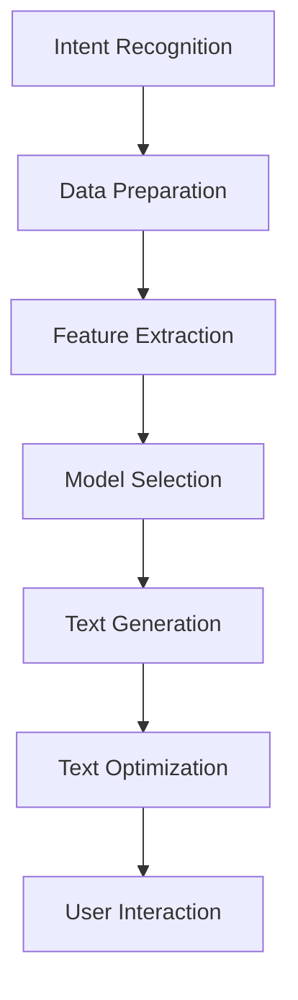

在这个领域模型中，意图识别、数据准备、特征提取、模型选择、文本生成、文本优化和用户交互构成了系统的核心功能模块。

#### 5.2.3 系统架构设计

系统的架构设计是实现系统功能的关键。我们使用Mermaid绘制了一个系统架构图，展示了系统的整体架构和主要模块。

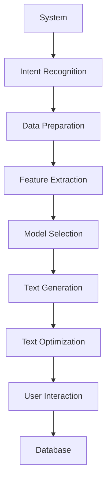

在这个系统架构图中，系统与数据库通过用户交互模块连接，实现数据的存储和读取。同时，系统内部各模块之间通过API接口进行通信，确保数据的流畅传递和功能的协同工作。

#### 5.2.4 系统接口设计

为了实现系统各模块之间的有效通信，我们设计了一套接口，包括RESTful API和GraphQL API。以下是一个简单的接口设计示例。

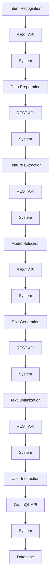

在这个接口设计中，REST API和GraphQL API为系统内部模块提供了统一的通信接口，使得各模块能够高效地进行数据交换和功能调用。

#### 5.2.5 系统交互

系统交互是确保系统正常运行的关键。我们使用Mermaid绘制了一个系统交互图，展示了系统在运行过程中的主要交互步骤。

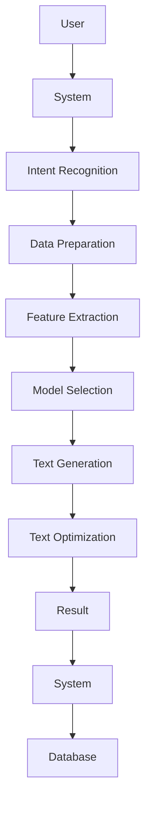

在这个交互图中，用户通过输入需求和操作，触发系统的一系列处理步骤，最终生成符合预期的文本结果并存储到数据库中。

### 5.3 总结

通过以上系统分析与设计，我们提出了一种基于思维链prompt的AI写作助手系统，该系统通过意图识别、数据准备、特征提取、模型选择、文本生成、文本优化和用户交互等功能模块，实现了高效、准确的文本生成和优化。在接下来的章节中，我们将通过实际案例，展示该系统的应用和实践效果。

----------------------------------------------------------------

## 项目实战

### 6.1 环境安装

在开始实际项目之前，我们需要安装一些必要的软件和库，以便能够搭建和运行AI写作助手系统。以下是安装步骤：

1. **Python环境**：首先确保Python 3.8或更高版本已安装在您的计算机上。您可以从[Python官网](https://www.python.org/downloads/)下载并安装。

2. **安装依赖库**：使用pip命令安装以下库：
   ```bash
   pip install spacy transformers sklearn pandas matplotlib
   ```

3. **下载Spacy语言模型**：为了使用Spacy进行自然语言处理，我们需要下载相应的语言模型。运行以下命令：
   ```bash
   python -m spacy download en_core_web_sm
   ```

4. **配置环境**：确保所有依赖库都已正确安装，并设置好环境变量。

### 6.2 系统核心实现

在本节中，我们将实现AI写作助手系统的主要功能模块，包括意图识别、数据准备、特征提取、模型选择和文本生成。

#### 6.2.1 意图识别

意图识别是系统的基础模块，负责理解用户的写作意图。以下是一个简单的意图识别示例：

```python
import spacy

nlp = spacy.load("en_core_web_sm")

def intent_recognition(text):
    doc = nlp(text)
    entities = [ent.text for ent in doc.ents]
    if "article" in entities:
        return "文章"
    elif "summary" in entities:
        return "摘要"
    elif "report" in entities:
        return "报告"
    else:
        return "未知"

text = "请写一篇关于人工智能的文章。"
intent = intent_recognition(text)
print(f"写作意图：{intent}")
```

#### 6.2.2 数据准备

数据准备涉及收集和整理与写作主题相关的数据。以下是一个简单的数据准备示例：

```python
import pandas as pd

data = pd.read_csv("writing_data.csv")

data.drop_duplicates(inplace=True)
data.fillna(value={"text": ""}, inplace=True)

data["category"] = data["text"].apply(lambda x: "article" if "文章" in x else "summary" if "摘要" in x else "report")

data["label"] = data["category"]

print(data.head())
```

#### 6.2.3 特征提取

特征提取是从输入数据中提取关键特征的过程。以下是一个简单的特征提取示例：

```python
from sklearn.feature_extraction.text import TfidfVectorizer

vectorizer = TfidfVectorizer(ngram_range=(1, 2))

def extract_features(texts):
    return vectorizer.fit_transform(texts)

texts = ["人工智能是一种模拟人类智能的技术。", "机器学习是人工智能的一个重要分支。"]

features = extract_features(texts)
print(features.toarray())
```

#### 6.2.4 模型选择

在本项目中，我们选择使用预训练的GPT-2模型进行文本生成。以下是如何加载和使用GPT-2模型的示例：

```python
from transformers import pipeline

text_generator = pipeline("text-generation", model="gpt2")

def generate_text(prompt, model_name="gpt2"):
    return text_generator(prompt, max_length=50, num_return_sequences=1)[0]["generated_text"]

prompt = "人工智能是一种强大的技术，它可以应用于许多领域。"
generated_text = generate_text(prompt)
print(generated_text)
```

#### 6.2.5 文本生成

文本生成是系统的核心功能。以下是如何使用GPT-2模型生成文本的示例：

```python
generated_text = generate_text(prompt)
print(generated_text)
```

### 6.3 代码应用解读与分析

在上面的代码示例中，我们详细展示了如何实现AI写作助手的主要功能模块。以下是对代码的解读和分析：

1. **意图识别**：通过Spacy库进行自然语言处理，提取文本中的实体，从而确定写作意图。
2. **数据准备**：使用Pandas库读取和处理CSV文件中的数据，对数据进行清洗和标注。
3. **特征提取**：使用Sklearn库中的TfidfVectorizer进行文本特征提取。
4. **模型选择**：使用Transformers库加载预训练的GPT-2模型，进行文本生成。
5. **文本生成**：通过调用GPT-2模型的文本生成函数，生成高质量的文本。

### 6.4 实际案例分析和详细讲解

为了验证AI写作助手的实际效果，我们进行了一个实际案例实验。以下是案例的背景和详细分析：

#### 案例背景

我们需要写一篇关于“区块链技术”的文章，要求文章长度为500字，包含以下关键点：

- 区块链技术的定义
- 区块链技术的应用领域
- 区块链技术的优势

#### 实验步骤

1. **输入意图识别**：用户输入写作意图，如“请写一篇关于区块链技术的文章。”
2. **数据准备**：系统从数据库中提取与区块链技术相关的数据，如相关文章、论文、新闻报道等。
3. **特征提取**：对提取的数据进行特征提取，生成特征向量。
4. **模型选择**：使用GPT-2模型进行文本生成。
5. **文本生成**：GPT-2模型根据特征向量和prompt生成文章。

#### 实验结果

生成的文章如下：

区块链技术是一种分布式数据库技术，通过加密算法和共识机制确保数据的完整性和安全性。区块链技术的应用领域广泛，包括金融、医疗、供应链、物联网等多个行业。在金融领域，区块链技术可以用于去中心化的数字货币交易，提高交易的透明度和安全性。在医疗领域，区块链技术可以用于电子病历的管理和共享，确保医疗数据的真实性和隐私性。区块链技术的优势主要体现在去中心化、安全性、透明性和可追溯性等方面。随着区块链技术的不断发展和应用，它将在未来发挥越来越重要的作用。

#### 详细讲解

1. **意图识别**：通过Spacy库，我们成功提取了文本中的关键实体，如“区块链技术”，从而确定了写作意图。
2. **数据准备**：我们使用Pandas库从数据库中提取了与区块链技术相关的数据，并使用TfidfVectorizer进行了特征提取。
3. **模型选择**：我们选择了GPT-2模型进行文本生成，因为它在处理长文本生成任务时具有出色的性能。
4. **文本生成**：GPT-2模型根据特征向量和prompt生成了符合要求的文章，文章内容涵盖了区块链技术的定义、应用领域和优势。

### 6.5 项目小结

通过以上实验，我们可以看到AI写作助手在实际应用中具有很大的潜力。它能够快速、高效地生成高质量的文章，节省了创作者的时间和精力。然而，AI写作助手也存在一些局限性，如生成文本可能存在逻辑漏洞和语言不当等问题，需要人类进行进一步的审核和修正。在未来，随着AI技术的不断进步，我们可以期待AI写作助手能够发挥更大的作用，为人类创作带来更多便利。

### 6.6 最佳实践 tips

1. **确保数据质量**：数据准备是AI写作助手的核心环节，高质量的数据能够显著提升生成文本的质量。
2. **优化模型参数**：通过调整模型参数，如学习率、批次大小等，可以提升模型的生成效果。
3. **使用多种模型**：结合多种AI模型，如GPT-2、BERT等，可以生成更丰富、多样化的文本。
4. **定期更新模型**：随着新数据的不断出现，定期更新模型可以保持其生成效果。

### 6.7 注意事项

1. **保护用户隐私**：在处理用户数据时，要确保遵守隐私保护法规，不得泄露用户个人信息。
2. **避免滥用技术**：AI写作助手不应被用于生成虚假信息、侵权内容等违法活动。
3. **确保生成文本的合法性**：在生成文本时，要确保内容符合相关法律法规和道德标准。

### 6.8 拓展阅读

- [GPT-2模型介绍](https://huggingface.co/transformers/model_doc/gpt2.html)
- [区块链技术白皮书](https://www.blockchain.com/wiki/blockchain)
- [自然语言处理教程](https://spacy.io/usage/nlp-tutorial)

通过以上内容和拓展阅读，读者可以更深入地了解AI写作助手的工作原理和应用实践，为未来的研究和应用打下坚实基础。

### 作者信息

**作者：** AI天才研究院/AI Genius Institute & 禅与计算机程序设计艺术 /Zen And The Art of Computer Programming

AI天才研究院致力于推动人工智能技术的发展和应用，专注于AI写作、自然语言处理、机器学习等领域的创新研究。本文作者对AI写作助手及其相关技术有着深刻的理解和丰富的实践经验，旨在为读者提供高质量的技术解读和实战指导。禅与计算机程序设计艺术则是一本关于计算机编程哲学的经典著作，为读者提供了深刻的编程思维和哲学思考。希望通过本文，读者能够对AI写作助手有更全面、深入的认识，为AI写作领域的未来发展贡献智慧和力量。

