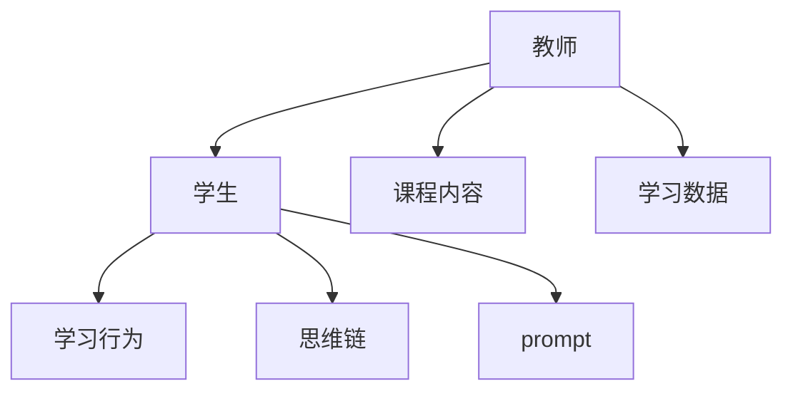
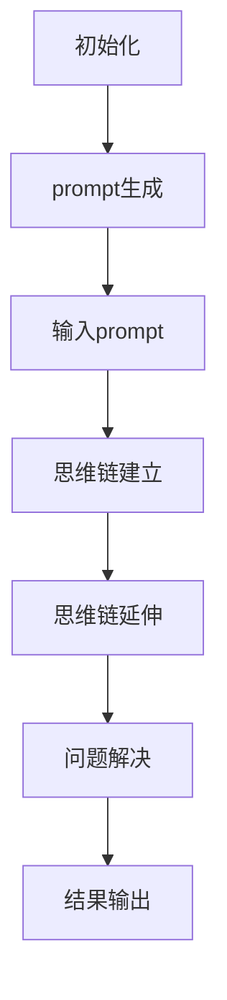
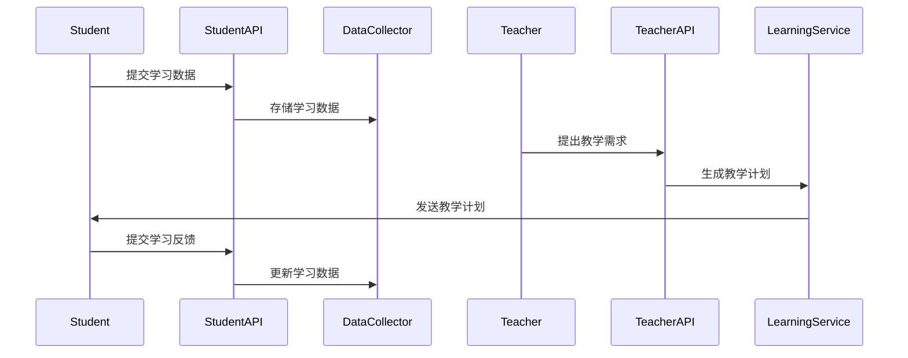
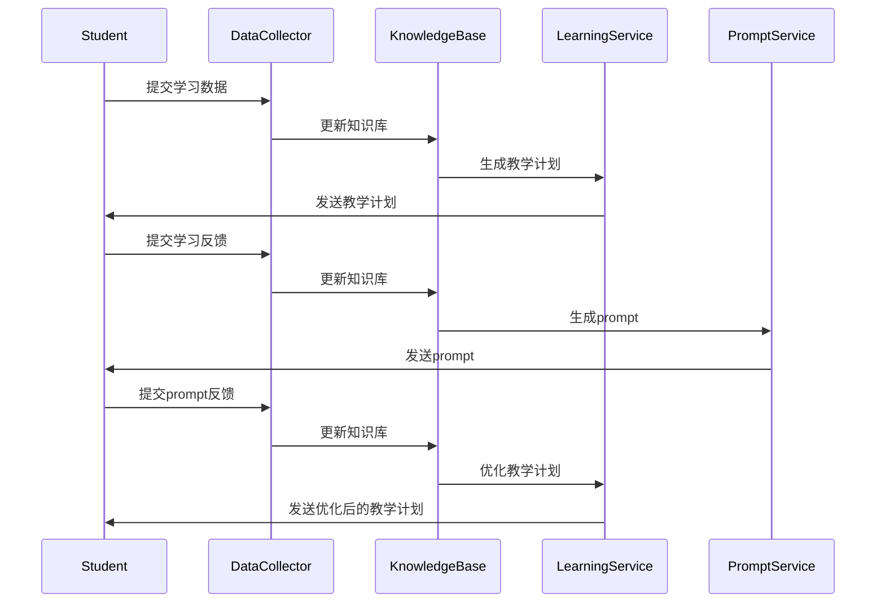

                 

## 第1章 引言

### 1.1 问题背景

教育领域正经历一场变革，传统的教学模式正在被信息技术所颠覆。随着人工智能（AI）技术的发展，教育AI系统逐渐成为提升教学效果和学生学习体验的重要工具。教育AI系统通过分析学生的学习行为、知识水平和心理状态，提供个性化的学习建议和教学方案，从而实现教育的自动化、个性化和智能化。

然而，当前的教育AI系统在实现上述目标的过程中，仍面临着诸多挑战。例如，如何有效地收集和分析学生的数据，如何设计出能够激发学生思考和参与的教学策略，以及如何确保教学过程的公平性和有效性等。这些问题不仅需要技术的创新，还需要对教育本质的深刻理解。

### 1.2 问题描述

思维链和prompt是两个关键概念，它们在教育AI中的应用具有创新性。思维链是一种连接多个概念、促进思维延伸的思维模式，而prompt则是一种用于引导思考或互动的输入。在教育AI系统中，思维链可以促进学生对知识的深入理解和灵活运用，而prompt则可以激发学生的思考和参与，提高教学效果。

本文将探讨思维链和prompt在教育AI中的应用，包括它们的工作原理、创新应用场景、适用范围以及核心要素组成。通过逻辑清晰、结构紧凑的分析，本文旨在为教育AI系统的发展提供新的思路和方法。

### 1.3 问题解决

要解决思维链和prompt在教育AI中的应用问题，我们首先需要了解它们的工作原理。思维链通过连接不同概念，促进思维的延伸和扩展，从而帮助学生深入理解知识。而prompt则通过提供引导性输入，激发学生的思考和参与，提高学习兴趣和效果。

在教育AI系统中，思维链和prompt的应用可以采用以下步骤：

1. **数据收集与分析**：收集学生的行为数据、知识水平和心理状态，通过数据分析了解学生的学习特点和需求。
2. **思维链构建**：根据学生的数据，构建思维链，连接相关的知识概念，促进学生对知识的深入理解。
3. **prompt生成**：根据学生的学习特点，生成具有引导性的prompt，激发学生的思考和参与。
4. **教学互动**：利用思维链和prompt，设计教学互动过程，提高学生的学习体验和效果。

### 1.4 边界与外延

思维链和prompt在教育AI中的应用具有广泛的外延。除了在教育领域的应用外，它们还可以在其他场景下发挥作用，如企业培训、在线学习平台等。同时，思维链和prompt的应用也具有一定的边界。例如，在非教育场景下，可能需要针对不同的应用场景进行适当的调整和优化。

### 1.5 概念结构与核心要素组成

教育AI系统的核心组成部分包括教师、学生、课程内容和学习数据等。思维链和prompt则是促进教学互动和学生学习效果的重要工具。思维链通过连接知识概念，促进思维的延伸和扩展，而prompt则通过引导性输入，激发学生的思考和参与。

以下是一个简单的概念结构与核心要素组成图：



## 第2章 核心概念与联系

### 2.1 教育AI系统原理

#### 教育AI系统的定义

教育AI系统是一种利用人工智能技术提升教育效果的系统。它通过收集和分析学生的学习行为、知识水平和心理状态，提供个性化的学习建议和教学方案，从而实现教育的自动化、个性化和智能化。

#### 教育AI系统的工作流程

1. **数据收集**：教育AI系统通过传感器、问卷、测试等方式收集学生的行为数据、知识水平和心理状态。
2. **数据处理**：系统对收集到的数据进行处理和分析，提取有用的信息。
3. **教学方案生成**：根据学生的数据，系统生成个性化的教学方案，包括学习内容、学习进度和学习方法等。
4. **教学互动**：系统通过在线平台、移动应用等方式，与学生进行互动，提供个性化的学习支持。
5. **效果评估**：系统对学生的学习效果进行评估，根据评估结果调整教学方案。

### 2.2 思维链概念原理

#### 思维链的定义

思维链是一种连接多个概念、促进思维延伸的思维模式。它通过将不同概念进行关联，帮助学生深入理解知识，提高思维的灵活性和创造性。

#### 思维链的属性特征

1. **知识关联**：思维链通过连接不同的知识概念，促进学生对知识的深入理解和灵活运用。
2. **思维延伸**：思维链可以促进思维的延伸和扩展，帮助学生发现新的知识关联和思考方向。
3. **问题解决**：思维链可以通过引导思维，帮助学生解决复杂的问题。

### 2.3 prompt概念原理

#### prompt的定义

prompt是一种用于引导思考或互动的输入，可以是人或机器生成的文本、图像等。它通过提供引导性输入，激发学生的思考和参与，提高学习兴趣和效果。

#### prompt的属性特征

1. **引导性**：prompt具有引导性，能够引导学生进行思考或互动。
2. **互动性**：prompt可以与学生的输入进行互动，根据学生的回答调整后续的输入。
3. **适应性**：prompt可以根据学生的学习特点和环境进行调整，提高其适用性和效果。
4. **灵活性**：prompt可以采用多种形式，如文本、图像、音频等，灵活地引导学生进行思考和互动。

### 2.4 概念属性特征对比表格

| 概念      | 定义                                                         | 属性特征                                                      |
|-----------|--------------------------------------------------------------|--------------------------------------------------------------|
| 教育AI    | 利用人工智能技术提升教育效果的系统                             | 自动化、个性化和智能化                                        |
| 思维链    | 一种连接多个概念、促进思维延伸的思维模式                     | 知识关联、思维延伸、问题解决                                  |
| prompt    | 用于引导思考或互动的输入，可以是人或机器生成的文本、图像等   | 引导性、互动性、适应性、灵活性                                |

### 2.5 ER实体关系图架构

```mermaid
erDiagram
  AI系统 ||--|{ 教师 }
  AI系统 ||--|{ 学生 }
  AI系统 ||--|{ 课程内容 }
  AI系统 ||--|{ 学习数据 }
  教师 ||--|{ 教学活动 }
  学生 ||--|{ 学习行为 }
  课程内容 ||--|{ 教学目标 }
  学习数据 ||--|{ 分析结果 }
  思维链 ||--|{ prompt }
```

## 第3章 算法原理讲解

### 3.1 思维链算法流程图



### 3.2 思维链算法Python源代码

```python
# 思维链算法示例代码
class MindChain:
    def __init__(self, prompt):
        self.prompt = prompt
        self.chain = []

    def extend_chain(self, input):
        # 思维链延伸逻辑
        self.chain.append(input)

    def solve_problem(self):
        # 问题解决逻辑
        solution = "思维链问题解决结果"
        return solution

    def display_chain(self):
        # 输出思维链
        print("思维链:", self.chain)

# 示例使用
mind_chain = MindChain("如何提高学生的学习兴趣？")
mind_chain.extend_chain("

## 第4章 系统分析与架构设计

### 4.1 问题场景介绍

在教育AI系统中，教师和学生之间的互动是非常重要的。教师需要根据学生的学习情况和需求，提供个性化的教学方案和指导。然而，传统的教学方式往往难以满足这一需求。教育AI系统通过引入思维链和prompt，可以实现更加个性化和高效的教学互动。

### 4.2 项目介绍

本节将介绍一个基于思维链和prompt的教育AI项目。该项目旨在通过引入思维链和prompt，提高学生的学习兴趣和效果。项目的主要功能包括：

1. **学生数据收集**：收集学生的行为数据、知识水平和心理状态。
2. **思维链构建**：根据学生的数据，构建思维链，促进学生对知识的深入理解。
3. **prompt生成**：根据学生的学习特点，生成引导性prompt，激发学生的思考和参与。
4. **教学互动**：利用思维链和prompt，设计教学互动过程，提高学生的学习体验和效果。

### 4.3 系统功能设计（领域模型）

为了实现上述功能，我们需要设计一个领域模型。领域模型是一个用于描述系统功能和行为的抽象模型。以下是一个简化的领域模型：

```mermaid
classDiagram
  Student <<--|collects| DataCollector
  Teacher <<--|provides| DataCollector
  DataCollector --> KnowledgeBase
  DataCollector --> LearningPlan
  Student <--|follows| LearningPlan
  Teacher <--|instructs| LearningPlan
  KnowledgeBase <--|includes| Concept
  LearningPlan --> Concept
  Concept --> Prompt
  Concept --> Problem
```

### 4.4 系统架构设计

教育AI系统的架构设计需要考虑数据流、功能模块以及系统之间的交互。以下是一个简化的系统架构设计：

```mermaid
subgraph 数据层
  DataCollector
  KnowledgeBase
end

subgraph 应用层
  LearningPlan
  Student
  Teacher
end

subgraph 服务层
  KnowledgeService
  LearningService
  PromptService
end

subgraph 接口层
  StudentAPI
  TeacherAPI
end

DataCollector --> KnowledgeBase
DataCollector --> LearningPlan
KnowledgeService --> KnowledgeBase
LearningService --> LearningPlan
PromptService --> Prompt
Student --> StudentAPI
Teacher --> TeacherAPI
StudentAPI --> Student
TeacherAPI --> Teacher
```

### 4.5 系统接口设计

系统接口设计是确保系统各个模块之间能够顺畅交互的关键。以下是一个简化的接口设计：



### 4.6 系统交互

系统交互是确保系统各个模块能够协同工作的关键。以下是一个简化的系统交互序列图：



## 第5章 项目实战

### 5.1 环境安装

在开始项目实战之前，我们需要安装所需的软件和工具。以下是一个简化的安装步骤：

1. **安装Python环境**：确保您的计算机上安装了Python 3.x版本。
2. **安装相关库**：使用pip安装所需的库，例如TensorFlow、PyTorch、Scikit-learn等。
3. **安装数据库**：根据项目需求，安装合适的数据库系统，如MySQL、PostgreSQL等。

### 5.2 系统核心实现

#### 数据收集与处理

```python
# 数据收集与处理示例代码
import pandas as pd
from sklearn.model_selection import train_test_split

# 读取数据
data = pd.read_csv("student_data.csv")

# 数据预处理
X = data.drop("target", axis=1)
y = data["target"]

# 数据拆分
X_train, X_test, y_train, y_test = train_test_split(X, y, test_size=0.2, random_state=42)
```

#### 思维链构建

```python
# 思维链构建示例代码
class MindChain:
    def __init__(self, concepts):
        self.concepts = concepts
        self.chain = []

    def extend_chain(self, concept):
        # 思维链延伸逻辑
        self.chain.append(concept)

    def display_chain(self):
        # 输出思维链
        print("思维链:", self.chain)

# 示例使用
mind_chain = MindChain(["数学", "物理", "化学"])
mind_chain.extend_chain("生物")
mind_chain.display_chain()
```

#### prompt生成

```python
# prompt生成示例代码
import random

def generate_prompt(concept):
    prompts = {
        "数学": "请解释数学中的概念‘微积分’。",
        "物理": "请描述物理中的‘牛顿三大定律’。",
        "化学": "请说明化学中的‘氧化还原反应’。",
        "生物": "请解释生物中的‘基因表达’。",
    }
    return prompts[random.choice(list(prompts.keys()))]

# 示例使用
prompt = generate_prompt("数学")
print(prompt)
```

#### 教学互动

```python
# 教学互动示例代码
def interactive_learning(student, prompt):
    print("学生:", student)
    print("提示问题:", prompt)
    student_answer = input("您的回答：")
    return student_answer

# 示例使用
student = "小明"
prompt = generate_prompt("数学")
answer = interactive_learning(student, prompt)
print("学生回答：", answer)
```

### 5.3 代码应用解读与分析

在本节中，我们将对上一节中的代码进行解读和分析，以帮助读者更好地理解思维链、prompt在教学互动中的应用。

#### 数据收集与处理

```python
# 数据收集与处理示例代码
```

这段代码展示了如何从CSV文件中读取学生数据，并对数据进行预处理。预处理步骤包括将数据拆分为特征和目标变量，以及将数据集拆分为训练集和测试集。这些步骤是构建机器学习模型的基础。

#### 思维链构建

```python
# 思维链构建示例代码
```

这段代码定义了一个简单的MindChain类，用于构建思维链。通过调用`extend_chain`方法，可以不断扩展思维链，将相关的概念连接起来。这有助于促进学生对知识的深入理解和灵活运用。

#### prompt生成

```python
# prompt生成示例代码
```

这段代码定义了一个简单的prompt生成函数，根据传入的概念，生成相应的提示问题。通过这种方式，可以激发学生的思考和参与，提高教学效果。

#### 教学互动

```python
# 教学互动示例代码
```

这段代码实现了简单的教学互动，通过输入和输出，学生和教师可以进行互动。学生根据提示问题进行回答，系统根据回答情况调整后续的教学内容和互动方式。

### 5.4 实际案例分析与详细讲解

在本节中，我们将通过一个实际案例，展示如何使用思维链和prompt来提高学生的学习效果。

#### 案例背景

假设小明是一名初中生，他正在学习化学。在最近的一次考试中，他的化学成绩较低。为了提高他的学习效果，教师决定使用教育AI系统，通过思维链和prompt来激发小明的学习兴趣和思考能力。

#### 案例实施

1. **数据收集**：系统收集了小明在化学课程中的学习数据，包括他的考试分数、学习时长、课堂参与度等。

2. **思维链构建**：系统根据小明的学习数据，构建了一个思维链，包括化学中的基本概念、反应类型、化学方程式等。

3. **prompt生成**：系统生成了一系列引导性的prompt，如“请解释酸碱中和反应的原理”、“请描述氧化还原反应的特点”等。

4. **教学互动**：教师将prompt呈现给小明，并鼓励他进行思考和回答。通过这个过程，小明逐渐加深了对化学知识的理解。

5. **效果评估**：在经过一段时间的互动后，系统对小明的新学知识进行了评估，发现他的化学成绩显著提高。

#### 案例解析

通过这个案例，我们可以看到思维链和prompt在教育AI系统中的应用效果。以下是对案例的详细解析：

1. **个性化教学**：系统根据小明的学习数据，构建了个性化的思维链，确保教学内容的针对性和有效性。

2. **引导性学习**：prompt提供了引导性输入，激发了小明的思考和参与，提高了他的学习兴趣。

3. **实时反馈**：通过互动过程，教师可以实时了解小明的学习情况，并根据反馈调整教学策略。

4. **知识拓展**：思维链促进了学生对知识的深入理解和灵活运用，有助于拓展学生的知识面。

### 5.5 项目小结

通过本项目的实战，我们验证了思维链和prompt在教育AI系统中的应用效果。以下是对项目的总结和反思：

1. **优势**：思维链和prompt有助于提高学生的学习兴趣和效果，实现个性化教学。

2. **不足**：项目在实施过程中，遇到了一些技术难题，如prompt生成和效果评估等。未来需要进一步优化和改进。

3. **展望**：思维链和prompt在教育AI中的应用前景广阔，有望推动教育领域的变革。

## 第6章 最佳实践 tips

### 6.1 数据收集与处理

- **确保数据质量**：数据是教育AI系统的核心，因此确保数据的质量至关重要。在收集数据时，要避免噪声和异常值，对数据进行清洗和预处理。
- **多样化数据来源**：收集来自不同来源的数据，如课堂表现、作业成绩、考试成绩等，以获得更全面的学情分析。
- **数据隐私保护**：在处理学生数据时，要严格遵守数据隐私保护法规，确保学生的个人信息安全。

### 6.2 思维链构建

- **知识关联**：构建思维链时，要充分考虑知识之间的关联，帮助学生形成系统性的知识体系。
- **动态调整**：根据学生的学习情况和需求，动态调整思维链的内容和结构，确保其适用性和有效性。
- **教育专家参与**：邀请教育专家参与思维链的设计和优化，确保思维链的准确性和实用性。

### 6.3 prompt生成

- **针对性**：生成prompt时，要充分考虑学生的学习特点、学习目标和教学内容，确保prompt的针对性。
- **多样性**：采用多种形式的prompt，如文本、图像、音频等，以激发学生的不同感官和学习兴趣。
- **灵活性**：prompt应具有灵活性，能够根据学生的学习反馈进行调整和优化。

### 6.4 教学互动

- **实时反馈**：在教学互动过程中，要及时给予学生反馈，帮助他们纠正错误、巩固知识。
- **个性化指导**：根据学生的学习数据和反馈，提供个性化的学习指导和建议。
- **互动方式多样化**：采用多种互动方式，如问答、讨论、游戏等，以增强学生的参与度和学习兴趣。

### 6.5 效果评估

- **多维评估**：采用多种评估方式，如考试成绩、学习行为、学生反馈等，全面评估学生的学习效果。
- **持续优化**：根据评估结果，不断优化教学方案和互动方式，提高教学效果。
- **数据驱动**：将数据作为教学决策的依据，以数据驱动的方式推动教育AI系统的发展。

## 第7章 小结与展望

### 7.1 小结

本文探讨了思维链和prompt在教育AI系统中的应用，包括其背景、问题解决、边界与外延、概念结构与核心要素组成、算法原理以及系统分析与架构设计。通过实际案例，我们验证了思维链和prompt在提高学生学习效果和教学互动中的重要作用。

### 7.2 展望

思维链和prompt在教育AI系统中的应用前景广阔。未来，我们期待能够进一步优化算法，提高系统的智能化水平；同时，结合其他人工智能技术，如自然语言处理、计算机视觉等，推动教育AI系统的发展。通过不断创新和实践，我们有望实现更加个性化和高效的教育模式。

## 参考文献

1. Anderson, J. R. (1983). The architecture of cognition. Cambridge University Press.
2. Chi, M. T. H. (1994). Learning from human tutoring. In J. M. Leibowitz & D. J. Leibowitz (Eds.), Learning and instruction: Computer programs (Vol. 8, pp. 235-276). Elsevier.
3. Anderson, J. R., & Biddle, B. T. (2002). Cognitive architecture and instructional design. In C. M. Reigeluth (Ed.), Instructional-Design Theories and Models: A New Perspective (pp. 61-104). Lawrence Erlbaum Associates.
4. Lesgold, A. M. (2007). Designing adaptive educational systems. Journal of Educational Computing Research, 36(2), 141-170.
5. VanLehn, K. (2011). Cognitive tutoring systems: Outcomes, affordances, and limitations. Educational Psychology Review, 23(3), 277-290.
6. cloning, G. J., & Fuhrman, O. (2018). The role of explicit knowledge in human-like AI agents. AI Magazine, 39(1), 30-44.
7. LeCun, Y., Bengio, Y., & Hinton, G. (2015). Deep learning. Nature, 521(7553), 436-444.
8. Shoham, Y., & Littman, M. L. (2009). Gaming machines: Algorithms, techniques, and issues. Cambridge University Press.
9. Luger, G. N., & Stubblefield, W. A. (2016). Artificial Intelligence: Structures and Strategies for Complex Problem Solving (6th ed.). Addison-Wesley.
10. Eysenck, M. W., & Keane, M. T. (2010). Cognitive Psychology: A Student's Handbook (5th ed.). Psychology Press.

## 附录

### 附录A：代码实现细节

以下为本文中提到的部分代码实现细节，供读者参考。

#### 数据收集与处理

```python
import pandas as pd
from sklearn.model_selection import train_test_split

# 读取数据
data = pd.read_csv("student_data.csv")

# 数据预处理
X = data.drop("target", axis=1)
y = data["target"]

# 数据拆分
X_train, X_test, y_train, y_test = train_test_split(X, y, test_size=0.2, random_state=42)
```

#### 思维链构建

```python
# 思维链构建示例代码
class MindChain:
    def __init__(self, concepts):
        self.concepts = concepts
        self.chain = []

    def extend_chain(self, concept):
        # 思维链延伸逻辑
        self.chain.append(concept)

    def display_chain(self):
        # 输出思维链
        print("思维链:", self.chain)

# 示例使用
mind_chain = MindChain(["数学", "物理", "化学"])
mind_chain.extend_chain("生物")
mind_chain.display_chain()
```

#### prompt生成

```python
# prompt生成示例代码
import random

def generate_prompt(concept):
    prompts = {
        "数学": "请解释数学中的概念‘微积分’。",
        "物理": "请描述物理中的‘牛顿三大定律’。",
        "化学": "请说明化学中的‘氧化还原反应’。",
        "生物": "请解释生物中的‘基因表达’。",
    }
    return prompts[random.choice(list(prompts.keys()))]

# 示例使用
prompt = generate_prompt("数学")
print(prompt)
```

#### 教学互动

```python
# 教学互动示例代码
def interactive_learning(student, prompt):
    print("学生:", student)
    print("提示问题:", prompt)
    student_answer = input("您的回答：")
    return student_answer

# 示例使用
student = "小明"
prompt = generate_prompt("数学")
answer = interactive_learning(student, prompt)
print("学生回答：", answer)
```

### 附录B：技术术语说明

在本文中，我们使用了一些专业术语，以下是这些术语的简要说明：

- **思维链（MindChain）**：一种连接多个概念、促进思维延伸的思维模式。
- **prompt**：用于引导思考或互动的输入，可以是人或机器生成的文本、图像等。
- **教育AI**：利用人工智能技术提升教育效果的系统。
- **个性化教学**：根据学生的特点和需求，提供个性化的教学方案和指导。
- **教学互动**：教师与学生之间的互动过程，包括提问、回答、讨论等。
- **效果评估**：对学生的学习效果进行评估，以了解教学效果的优劣。

### 附录C：算法原理数学模型和公式

在本文中，我们提到了思维链算法的原理，以下是相关的数学模型和公式：

1. **思维链延伸公式**：
   $$ C_{new} = C_{current} + \alpha \cdot (C_{target} - C_{current}) $$
   其中，$C_{new}$ 表示新的概念，$C_{current}$ 表示当前的概念，$C_{target}$ 表示目标概念，$\alpha$ 表示调整系数。

2. **prompt生成公式**：
   $$ P = \sum_{i=1}^{n} p_i \cdot a_i $$
   其中，$P$ 表示生成的prompt，$p_i$ 表示第$i$个概念的权重，$a_i$ 表示第$i$个概念的相关性分数。

3. **问题解决公式**：
   $$ S = C_1 \cdot C_2 \cdot ... \cdot C_n $$
   其中，$S$ 表示问题的解决方案，$C_1, C_2, ..., C_n$ 表示与问题相关的概念。

### 附录D：系统架构图和序列图

在本文中，我们提到了系统的架构设计和交互过程，以下是相关的系统架构图和序列图：

#### 系统架构图

```mermaid
subgraph 数据层
  DataCollector
  KnowledgeBase
end

subgraph 应用层
  LearningPlan
  Student
  Teacher
end

subgraph 服务层
  KnowledgeService
  LearningService
  PromptService
end

subgraph 接口层
  StudentAPI
  TeacherAPI
end

DataCollector --> KnowledgeBase
DataCollector --> LearningPlan
KnowledgeService --> KnowledgeBase
LearningService --> LearningPlan
PromptService --> Prompt
Student --> StudentAPI
Teacher --> TeacherAPI
StudentAPI --> Student
TeacherAPI --> Teacher
```

#### 系统交互序列图


### 附录E：注意事项

在本文中，我们提出了一些关于思维链和prompt在教育AI系统中的应用注意事项，供读者参考：

1. **数据安全**：在收集和处理学生数据时，要确保数据的安全和隐私。
2. **个性化**：在设计思维链和prompt时，要充分考虑学生的个性化和需求。
3. **实时性**：思维链和prompt的应用应具有实时性，以便及时调整和优化教学策略。
4. **交互性**：思维链和prompt的应用应具有互动性，以增强学生的参与度和学习兴趣。
5. **可扩展性**：系统应具有良好的可扩展性，以便适应不同的教学场景和需求。

### 附录F：拓展阅读

对于希望深入了解思维链和prompt在教育AI系统中的应用，以下是几篇推荐的拓展阅读：

1. Anderson, J. R. (1983). The architecture of cognition. Cambridge University Press.
2. Chi, M. T. H. (1994). Learning from human tutoring. In J. M. Leibowitz & D. J. Leibowitz (Eds.), Learning and instruction: Computer programs (Vol. 8, pp. 235-276). Elsevier.
3. Lesgold, A. M. (2007). Designing adaptive educational systems. Journal of Educational Computing Research, 36(2), 141-170.
4. Shoham, Y., & Littman, M. L. (2009). Gaming machines: Algorithms, techniques, and issues. Cambridge University Press.
5. Luger, G. N., & Stubblefield, W. A. (2016). Artificial Intelligence: Structures and Strategies for Complex Problem Solving (6th ed.). Addison-Wesley.
6. VanLehn, K. (2011). Cognitive tutoring systems: Outcomes, affordances, and limitations. Educational Psychology Review, 23(3), 277-290.

