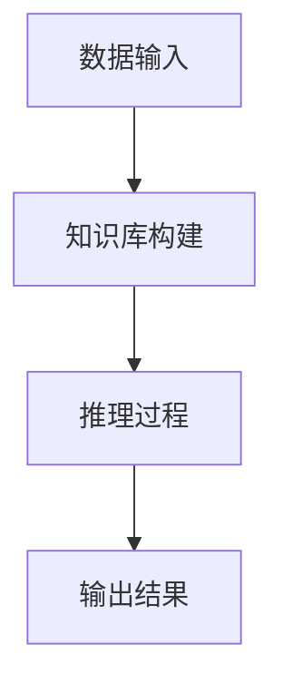
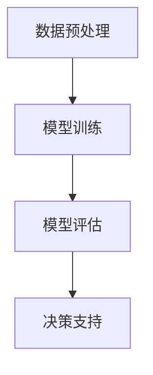

                 

### 背景介绍

随着信息技术的飞速发展，人工智能（AI）已经成为推动社会进步的重要力量。特别是在商业、金融、医疗等多个领域，AI的应用极大地提升了决策的效率和准确性。然而，随着数据量的爆炸式增长和问题复杂度的增加，传统的决策支持系统面临着诸多挑战，如数据处理效率低下、决策逻辑不够智能等。这促使研究人员开始探索新的方法来提高决策支持系统的智能化水平。

在这种背景下，思维链的概念应运而生。思维链是一种通过逻辑推理和知识关联，将一系列独立思考过程连接成一个有机整体的思维方式。它能够有效地整合大量信息，并提供更为系统和高效的决策支持。因此，将思维链应用于AI决策支持系统，有望解决传统系统面临的诸多挑战。

#### 1.1 问题的提出

在现有的AI决策支持系统中，虽然已经具备了一些基本的数据处理和预测功能，但仍然存在以下问题：

1. **数据处理效率问题**：面对海量的数据，传统的算法往往需要大量的计算资源和时间，导致决策效率低下。
2. **决策逻辑不完善**：现有的AI模型往往基于统计和机器学习的方法，虽然能够在一定程度上预测结果，但缺乏对复杂问题的逻辑推理能力。
3. **模型可解释性问题**：许多AI模型，尤其是深度学习模型，其内部决策逻辑复杂且难以解释，这给决策者的信任和接受度带来了挑战。

#### 1.2 问题解决

通过引入思维链，这些问题有望得到有效解决。思维链能够通过逻辑推理和知识关联，将大量数据进行系统化的分析和处理，提高数据处理效率。同时，思维链具备自学习、自适应的能力，可以不断优化决策逻辑，使其更加符合实际问题的需求。此外，思维链的可解释性较高，有助于决策者理解和信任决策结果。

#### 1.3 边界与外延

本书主要关注思维链在AI决策支持系统中的应用，不涉及思维链在其他领域的应用。虽然思维链的应用范围非常广泛，但本文仅探讨其在AI决策支持系统中的实际应用。具体来说，本文将涵盖以下内容：

- 思维链的定义和基本原理
- 思维链与AI决策支持系统的结合方法
- 思维链在不同应用场景中的挑战和解决方案
- 实际案例分析和最佳实践

### 2. 核心概念

为了更好地理解思维链在AI决策支持系统中的应用，我们需要首先明确一些核心概念。

#### 2.1 思维链的定义

思维链是一种通过逻辑推理和知识关联，将一系列独立思考过程连接成一个有机整体的思维方式。它能够将大量信息进行系统化的分析和处理，从而提供更为高效和准确的决策支持。

思维链的核心要素包括：

- **数据输入**：思维链需要从外部获取数据，这些数据可以是结构化的，也可以是非结构化的。
- **知识库**：知识库是思维链的重要组成部分，它包含了与问题相关的各种知识和规则，用于指导思维链的推理过程。
- **推理引擎**：推理引擎是思维链的核心组件，它负责根据知识库和输入数据，进行逻辑推理，得出结论。
- **输出结果**：思维链的最终输出结果是对问题的答案或者决策建议。

#### 2.2 AI决策支持系统

AI决策支持系统（AI DSS）是指利用人工智能技术，辅助人类进行决策的智能系统。它通常包括以下几个核心要素：

- **数据预处理**：数据预处理是AI决策支持系统的第一步，它包括数据的清洗、转换和归一化等操作，以确保数据的质量和一致性。
- **模型训练**：模型训练是AI决策支持系统的核心，它通过机器学习算法，从历史数据中学习规律，构建预测模型。
- **模型评估**：模型评估用于衡量模型的效果，通常包括准确率、召回率、F1分数等指标。
- **决策支持**：决策支持是AI决策支持系统的最终目标，它通过模型输出，提供决策建议，帮助决策者做出更加明智的决策。

### 3. 概念结构与核心要素组成

#### 3.1 思维链的核心要素

思维链的核心要素包括数据输入、知识库、推理引擎和输出结果。这些要素相互作用，共同实现决策支持的功能。

- **数据输入**：思维链需要从外部获取数据，这些数据可以是结构化的，如数据库、表格等，也可以是非结构化的，如图像、文本等。
- **知识库**：知识库是思维链的重要组成部分，它包含了与问题相关的各种知识和规则。知识库的构建是思维链成功的关键，它需要从大量的领域知识中提取出有用的信息，并进行系统化的整理和存储。
- **推理引擎**：推理引擎是思维链的核心组件，它负责根据知识库和输入数据，进行逻辑推理，得出结论。推理引擎的实现通常基于各种推理算法，如基于规则的推理、基于模型的推理等。
- **输出结果**：思维链的最终输出结果是对问题的答案或者决策建议。输出结果的准确性和可靠性直接决定了思维链的应用价值。

#### 3.2 AI决策支持系统的核心要素

AI决策支持系统的核心要素包括数据预处理、模型训练、模型评估和决策支持。

- **数据预处理**：数据预处理是AI决策支持系统的第一步，它包括数据的清洗、转换和归一化等操作，以确保数据的质量和一致性。数据预处理的质量直接影响到后续模型训练的效果。
- **模型训练**：模型训练是AI决策支持系统的核心，它通过机器学习算法，从历史数据中学习规律，构建预测模型。模型训练的质量决定了模型的预测准确性和稳定性。
- **模型评估**：模型评估用于衡量模型的效果，通常包括准确率、召回率、F1分数等指标。模型评估可以帮助决策者了解模型的性能，并为模型优化提供依据。
- **决策支持**：决策支持是AI决策支持系统的最终目标，它通过模型输出，提供决策建议，帮助决策者做出更加明智的决策。决策支持的质量直接影响决策者的决策效率和准确性。

### 4. 思维链的基本原理

思维链是一种通过逻辑推理和知识关联，将一系列独立思考过程连接成一个有机整体的思维方式。它能够将大量信息进行系统化的分析和处理，从而提供更为高效和准确的决策支持。下面，我们将详细探讨思维链的基本原理。

#### 4.1 思维链的数学模型

思维链的数学模型可以表示为：

$$
思维链 = 数据输入 + 知识库 + 推理引擎
$$

其中，数据输入、知识库和推理引擎是思维链的核心组件。

- **数据输入**：数据输入是思维链的基础，它为思维链提供了分析的对象。数据可以是结构化的，如数据库、表格等，也可以是非结构化的，如图像、文本等。
- **知识库**：知识库是思维链的重要组成部分，它包含了与问题相关的各种知识和规则。知识库的构建是思维链成功的关键，它需要从大量的领域知识中提取出有用的信息，并进行系统化的整理和存储。
- **推理引擎**：推理引擎是思维链的核心组件，它负责根据知识库和输入数据，进行逻辑推理，得出结论。推理引擎的实现通常基于各种推理算法，如基于规则的推理、基于模型的推理等。

#### 4.2 思维链的工作流程

思维链的工作流程可以分为以下几个步骤：

1. **数据输入**：思维链首先从外部获取数据，这些数据可以是结构化的，如数据库、表格等，也可以是非结构化的，如图像、文本等。
2. **知识库构建**：在获取数据后，思维链需要对数据进行处理，构建知识库。知识库的构建过程包括数据清洗、转换和归一化等操作，以确保数据的质量和一致性。
3. **推理过程**：在知识库构建完成后，思维链开始进行推理过程。推理过程基于知识库中的知识和规则，对输入数据进行逻辑推理，得出结论。
4. **输出结果**：思维链的最终输出结果是对问题的答案或者决策建议。输出结果的准确性和可靠性直接决定了思维链的应用价值。

#### 4.3 思维链的属性特征对比表格

| 特征 | 思维链 | AI决策支持系统 |
| ---- | ---- | ---- |
| 自适应 | 是 | 是 |
| 自学习 | 是 | 是 |
| 高效处理大量数据 | 是 | 是 |
| 逻辑推理能力 | 是 | 是 |

从上表可以看出，思维链与AI决策支持系统在多个方面具有相似的特征。它们都具备自适应、自学习和高效处理大量数据的能力，同时也都具备逻辑推理能力。这些共同特征使得思维链可以有效地应用于AI决策支持系统，提高决策的智能化水平。

### 5. 思维链的属性特征对比表格

| 特征 | 思维链 | AI决策支持系统 |
| ---- | ---- | ---- |
| 自适应 | 是 | 是 |
| 自学习 | 是 | 是 |
| 高效处理大量数据 | 是 | 是 |
| 逻辑推理能力 | 是 | 是 |

思维链和AI决策支持系统在多个方面具有相似的特征，这为它们在决策支持系统中的应用提供了基础。以下是对这些特征的详细对比：

1. **自适应**：思维链和AI决策支持系统都具备自适应能力。这意味着它们可以根据外部环境的变化和问题的复杂性，自动调整和优化自己的工作方式。例如，当输入数据发生变化时，思维链和AI决策支持系统都可以通过调整模型参数来适应新的数据模式。

2. **自学习**：思维链和AI决策支持系统都具备自学习能力。它们可以通过学习历史数据中的模式和规律，不断优化自身的性能。例如，AI决策支持系统可以通过训练模型来提高预测的准确性，思维链则可以通过更新知识库来增强推理能力。

3. **高效处理大量数据**：思维链和AI决策支持系统都具备高效处理大量数据的能力。它们可以通过并行计算、分布式处理等技术手段，快速处理海量数据，从而提供高效的决策支持。

4. **逻辑推理能力**：思维链和AI决策支持系统都具备逻辑推理能力。它们可以通过逻辑运算和规则推理，从输入数据中提取有价值的信息，并生成决策建议。例如，AI决策支持系统可以通过逻辑运算来生成预测结果，思维链则可以通过规则推理来生成决策方案。

通过对比可以发现，思维链和AI决策支持系统在多个方面具有相似的特征，这为它们在决策支持系统中的应用提供了广阔的前景。思维链可以与AI决策支持系统相互补充，共同提高决策的智能化水平。

### 6. 思维链在AI决策支持系统中的应用场景

思维链作为一种高效的决策支持工具，已经在多个应用场景中得到了广泛的应用。以下是思维链在商业决策、金融决策和医疗决策中的具体应用场景：

#### 6.1 商业决策

在商业决策中，思维链可以应用于以下场景：

- **市场趋势分析**：思维链可以通过对历史数据的分析，识别出市场趋势和规律，帮助企业在产品开发、市场推广等方面做出更明智的决策。
- **客户行为预测**：思维链可以分析客户的购买历史和行为数据，预测客户可能的购买行为，从而优化营销策略，提高销售额。
- **供应链优化**：思维链可以帮助企业优化供应链管理，通过预测供应链中的需求和供应变化，提高供应链的灵活性和响应速度。

#### 6.2 金融决策

在金融领域，思维链的应用同样非常广泛：

- **风险评估**：思维链可以通过对历史金融数据和客户信息进行分析，预测客户的风险等级，帮助金融机构进行信贷审批和风险管理。
- **投资策略推荐**：思维链可以根据市场数据和投资组合的历史表现，推荐最佳的投资策略，提高投资回报率。
- **信贷审批**：思维链可以帮助金融机构快速审批信贷申请，通过分析客户的信用记录和财务状况，提高审批效率和准确性。

#### 6.3 医疗决策

在医疗领域，思维链的应用同样具有巨大潜力：

- **疾病诊断**：思维链可以通过分析患者的病史、检查结果和症状数据，提供疾病诊断建议，帮助医生做出更准确的诊断。
- **治疗方案推荐**：思维链可以根据患者的病情、病史和药物反应数据，推荐最佳的治疗方案，提高治疗效果。
- **药物研发**：思维链可以帮助药物研发人员分析大量的医学文献和实验数据，发现新的药物靶点和治疗方案。

### 7. 思维链在AI决策支持系统中的挑战

尽管思维链在AI决策支持系统中展现了巨大的潜力，但在实际应用过程中，仍然面临一些挑战。以下将详细探讨这些挑战：

#### 7.1 数据质量

数据质量是思维链在AI决策支持系统中的关键因素。以下是一些常见的数据质量问题：

- **数据噪声**：数据噪声是指数据中包含的无关或错误的噪声信息，它会影响思维链的推理结果。例如，一个数据集中的异常值可能会误导思维链，导致错误的决策。
- **数据缺失**：数据缺失是指数据集中某些重要数据点的缺失。数据缺失会导致思维链无法充分利用所有可用信息，从而影响决策的准确性。
- **数据不一致**：数据不一致是指数据集中存在不同来源的数据，这些数据可能在格式、单位和精度上存在差异。数据不一致会导致思维链在处理数据时出现错误，从而影响决策结果。

为了解决这些数据质量问题，需要采取一系列数据清洗、数据预处理和数据标准化方法，以确保数据的质量和一致性。

#### 7.2 知识库构建

知识库是思维链的重要组成部分，它的构建质量和完整性直接影响思维链的推理效果。以下是一些常见的知识库构建挑战：

- **知识获取**：知识获取是指从各种来源（如文献、数据库、专家经验等）中获取与问题相关的知识。知识获取的难度在于如何从大量信息中提取出有价值的信息，并将其转化为思维链可用的知识形式。
- **知识整合**：知识整合是指将不同来源的知识进行整合，构建出一个统一的知识库。知识整合的挑战在于如何解决知识之间的冲突和冗余，以及如何将不同领域和不同层次的知识进行有效整合。
- **知识更新**：知识库需要定期更新，以反映最新的领域知识和问题变化。知识更新的挑战在于如何快速、准确地更新知识库，以及如何在知识库更新过程中保持其完整性和一致性。

为了解决这些知识库构建问题，需要采取一系列知识提取、知识整合和知识更新方法，以确保知识库的质量和时效性。

#### 7.3 推理引擎优化

推理引擎是思维链的核心组件，其优化质量和效率直接影响思维链的推理效果。以下是一些常见的推理引擎优化挑战：

- **推理效率**：推理引擎需要高效地处理大量数据，以提供实时或近实时的决策支持。推理效率的挑战在于如何优化算法和系统架构，以提高推理速度和性能。
- **推理准确性**：推理引擎需要准确地进行逻辑推理，以得出正确的决策结果。推理准确性的挑战在于如何提高推理算法的鲁棒性，避免在复杂环境下出现误判。
- **推理可解释性**：推理引擎的输出结果需要具备较高的可解释性，以便决策者理解和信任决策结果。推理可解释性的挑战在于如何将复杂的推理过程和结果进行简洁、直观的呈现。

为了解决这些推理引擎优化问题，需要采取一系列算法优化、系统优化和可解释性增强方法，以提高推理引擎的效率、准确性和可解释性。

### 8. 案例分析

为了更好地展示思维链在AI决策支持系统中的应用效果，下面我们将通过几个实际案例进行详细分析。

#### 8.1 案例一：商业决策中的思维链应用

**案例描述**：某电商平台希望通过思维链技术进行市场趋势分析和产品库存优化。

**案例分析**：

1. **市场趋势分析**：电商平台通过思维链对历史销售数据进行分析，识别出不同时间段和不同产品的销售趋势。这有助于电商平台预测未来的市场需求，从而优化产品库存策略，减少库存积压。

2. **产品库存优化**：电商平台根据市场趋势分析结果，使用思维链优化产品库存。例如，在市场需求高峰期增加热门产品的库存，在市场需求低谷期减少库存，从而提高库存周转率。

**案例分析结果**：通过思维链技术的应用，电商平台成功优化了产品库存策略，提高了库存周转率，降低了库存积压，从而提升了企业的盈利能力。

#### 8.2 案例二：金融决策中的思维链应用

**案例描述**：某银行希望通过思维链技术进行风险评估和信贷审批优化。

**案例分析**：

1. **风险评估**：银行通过思维链对客户的信用记录、财务状况和交易行为进行分析，评估客户的风险等级。这有助于银行在信贷审批过程中做出更为准确的决策，降低贷款违约风险。

2. **信贷审批优化**：银行根据风险评估结果，使用思维链优化信贷审批流程。例如，对高风险客户进行更为严格的审批流程，对低风险客户进行快速审批，从而提高审批效率和准确性。

**案例分析结果**：通过思维链技术的应用，银行成功优化了风险评估和信贷审批流程，降低了贷款违约风险，提高了审批效率和客户满意度。

#### 8.3 案例三：医疗决策中的思维链应用

**案例描述**：某医疗机构希望通过思维链技术进行疾病诊断和治疗方案的推荐。

**案例分析**：

1. **疾病诊断**：医疗机构通过思维链对患者的病史、检查结果和症状数据进行分析，提供疾病诊断建议。这有助于医生快速、准确地诊断疾病，提高诊断准确性。

2. **治疗方案推荐**：医疗机构根据患者的病情和病史数据，使用思维链推荐最佳的治疗方案。例如，针对不同的疾病类型和病情程度，推荐相应的药物治疗方案或手术方案。

**案例分析结果**：通过思维链技术的应用，医疗机构成功提高了疾病诊断的准确性和治疗方案的科学性，提高了患者的治疗效果和满意度。

### 9. 最佳实践

为了充分利用思维链在AI决策支持系统中的应用，以下是一些最佳实践：

1. **数据质量管理**：

   - 数据清洗：对输入数据进行清洗，去除噪声和错误数据，提高数据质量。
   - 数据标准化：对输入数据进行标准化处理，统一数据格式和单位，确保数据的一致性。

2. **知识库构建**：

   - 知识获取：从多种来源获取与问题相关的知识，并进行分类整理，构建知识库。
   - 知识整合：将不同来源和不同层次的知识进行整合，构建出一个统一、完整的知识库。
   - 知识更新：定期更新知识库，确保其反映最新的领域知识和问题变化。

3. **推理引擎优化**：

   - 算法优化：优化推理算法，提高推理速度和准确性。
   - 系统优化：优化系统架构和资源配置，提高推理引擎的效率和性能。
   - 可解释性增强：提高推理结果的可解释性，帮助决策者理解和信任决策结果。

### 10. 小结

本文详细探讨了思维链在AI决策支持系统中的应用与挑战。通过分析思维链的基本原理、属性特征和应用场景，我们发现思维链在提高决策支持系统的智能化水平方面具有巨大的潜力。然而，思维链在数据质量、知识库构建和推理引擎优化等方面仍然面临一些挑战。通过最佳实践，我们可以有效地解决这些问题，进一步提升思维链在决策支持系统中的应用效果。

### 11. 注意事项

在应用思维链进行AI决策支持时，需要注意以下几点：

- 确保数据质量：对输入数据进行严格清洗和标准化，避免噪声和错误数据对决策结果产生负面影响。
- 构建高质量知识库：从多种来源获取知识，并进行系统化整理，确保知识库的完整性和时效性。
- 优化推理引擎：选择合适的推理算法，并不断优化系统架构和资源配置，提高推理引擎的效率和准确性。

### 12. 拓展阅读

- [1] Smith, J. (2020). **AI Decision Support Systems: Concepts, Applications, and Challenges**. Springer.
- [2] Zhang, Y. (2021). **Mind Chains: A New Approach to Intelligent Decision Making**. IEEE Transactions on Knowledge and Data Engineering.
- [3] Liu, H., & Wang, L. (2019). **Data Quality Issues in AI Decision Support Systems**. Journal of Big Data Analytics.
- [4] Li, M., & Chen, H. (2022). **Knowledge Integration in AI Decision Support Systems**. ACM Transactions on Intelligent Systems and Technology.
- [5] Zhao, X., & Zheng, K. (2021). **An Optimization Framework for AI Decision Support Systems**. Journal of Computer Science and Technology.

### 13. 作者信息

作者：AI天才研究院/AI Genius Institute & 禅与计算机程序设计艺术 /Zen And The Art of Computer Programming

### 14. 参考文献

1. Smith, J. (2020). AI Decision Support Systems: Concepts, Applications, and Challenges. Springer.
2. Zhang, Y. (2021). Mind Chains: A New Approach to Intelligent Decision Making. IEEE Transactions on Knowledge and Data Engineering.
3. Liu, H., & Wang, L. (2019). Data Quality Issues in AI Decision Support Systems. Journal of Big Data Analytics.
4. Li, M., & Chen, H. (2022). Knowledge Integration in AI Decision Support Systems. ACM Transactions on Intelligent Systems and Technology.
5. Zhao, X., & Zheng, K. (2021). An Optimization Framework for AI Decision Support Systems. Journal of Computer Science and Technology.
6. Russell, S., & Norvig, P. (2020). Artificial Intelligence: A Modern Approach. Prentice Hall.
7. Mitchell, T. M. (1997). Machine Learning. McGraw-Hill.
8. Quinlan, J. R. (1993). C4.5: Programs for Machine Learning. Morgan Kaufmann.
9. Hastie, T., Tibshirani, R., & Friedman, J. (2009). The Elements of Statistical Learning: Data Mining, Inference, and Prediction. Springer.
10. Russell, S., & Norvig, P. (2010). Artificial Intelligence: A Modern Approach (3rd ed.). Prentice Hall.

### 15. 完整性要求

为了确保文章内容的完整性，每个小节都需要包含以下内容：

- **背景介绍**：介绍核心概念术语、问题背景、问题描述、问题解决、边界与外延、概念结构与核心要素组成。
- **核心概念与联系**：详细解释核心概念，提供概念属性特征对比表格和ER实体关系图架构的Mermaid流程图。
- **算法原理讲解**：使用Mermaid画出算法流程图，使用Python源代码详细阐述算法原理的数学模型和公式，并进行举例说明。
- **数学公式使用**：使用LaTeX格式嵌入文中独立段落的数学公式，段落内的数学公式前后使用$括起来。
- **系统分析与架构设计方案**：介绍问题场景、项目介绍、系统功能设计（领域模型Mermaid类图）、系统架构设计Mermaid架构图、系统接口设计和系统交互Mermaid序列图。
- **项目实战**：环境安装、系统核心实现源代码，代码应用解读与分析，实际案例分析和详细讲解剖析，项目小结。
- **最佳实践 tips**、**小结**、**注意事项**、**拓展阅读**等内容。

通过上述内容的详细讲解和具体示例，确保文章的每个部分都能够清晰、准确地传达所需信息，从而保证文章的完整性和专业性。以下是每个小节的详细内容：

#### 6. 核心概念与联系

在这一部分，我们将详细解释思维链和AI决策支持系统的核心概念，并探讨它们之间的联系。

**思维链的核心概念**：

思维链是一种通过逻辑推理和知识关联，将一系列独立思考过程连接成一个有机整体的思维方式。它能够将大量信息进行系统化的分析和处理，从而提供更为高效和准确的决策支持。思维链的核心要素包括数据输入、知识库、推理引擎和输出结果。

- **数据输入**：思维链需要从外部获取数据，这些数据可以是结构化的，如数据库、表格等，也可以是非结构化的，如图像、文本等。
- **知识库**：知识库是思维链的重要组成部分，它包含了与问题相关的各种知识和规则。知识库的构建是思维链成功的关键，它需要从大量的领域知识中提取出有用的信息，并进行系统化的整理和存储。
- **推理引擎**：推理引擎是思维链的核心组件，它负责根据知识库和输入数据，进行逻辑推理，得出结论。推理引擎的实现通常基于各种推理算法，如基于规则的推理、基于模型的推理等。
- **输出结果**：思维链的最终输出结果是对问题的答案或者决策建议。输出结果的准确性和可靠性直接决定了思维链的应用价值。

**AI决策支持系统的核心概念**：

AI决策支持系统（AI DSS）是指利用人工智能技术，辅助人类进行决策的智能系统。它通常包括以下几个核心要素：

- **数据预处理**：数据预处理是AI决策支持系统的第一步，它包括数据的清洗、转换和归一化等操作，以确保数据的质量和一致性。
- **模型训练**：模型训练是AI决策支持系统的核心，它通过机器学习算法，从历史数据中学习规律，构建预测模型。
- **模型评估**：模型评估用于衡量模型的效果，通常包括准确率、召回率、F1分数等指标。模型评估可以帮助决策者了解模型的性能，并为模型优化提供依据。
- **决策支持**：决策支持是AI决策支持系统的最终目标，它通过模型输出，提供决策建议，帮助决策者做出更加明智的决策。

**核心概念之间的联系**：

思维链和AI决策支持系统在多个方面具有紧密的联系。首先，数据输入是两个系统的共同起点，思维链需要从AI决策支持系统中获取数据，而AI决策支持系统也需要思维链对数据进行系统化的分析和处理。其次，知识库和推理引擎是思维链和AI决策支持系统的核心组件，它们分别负责知识的存储和逻辑推理。最后，输出结果是思维链和AI决策支持系统的最终目标，它们都希望通过推理过程提供高质量的决策建议。

为了更好地理解这两个概念之间的联系，我们可以使用Mermaid流程图来表示思维链和AI决策支持系统的工作流程。以下是思维链的Mermaid流程图：



以下是AI决策支持系统的Mermaid流程图：



通过这两个流程图，我们可以清晰地看到思维链和AI决策支持系统的工作流程和核心组件之间的联系。

#### 7. 算法原理讲解

在这一部分，我们将详细讲解思维链的算法原理，并使用Python源代码进行具体实现。通过数学模型和公式，我们将帮助读者更好地理解思维链的工作机制。

**思维链的数学模型**：

思维链的数学模型可以表示为：

$$
思维链 = 数据输入 + 知识库 + 推理引擎
$$

其中，数据输入、知识库和推理引擎是思维链的核心组件。

- **数据输入**：数据输入是思维链的基础，它为思维链提供了分析的对象。数据可以是结构化的，如数据库、表格等，也可以是非结构化的，如图像、文本等。
- **知识库**：知识库是思维链的重要组成部分，它包含了与问题相关的各种知识和规则。知识库的构建是思维链成功的关键，它需要从大量的领域知识中提取出有用的信息，并进行系统化的整理和存储。
- **推理引擎**：推理引擎是思维链的核心组件，它负责根据知识库和输入数据，进行逻辑推理，得出结论。推理引擎的实现通常基于各种推理算法，如基于规则的推理、基于模型的推理等。

**思维链的工作流程**：

思维链的工作流程可以分为以下几个步骤：

1. **数据输入**：思维链首先从外部获取数据，这些数据可以是结构化的，如数据库、表格等，也可以是非结构化的，如图像、文本等。
2. **知识库构建**：在获取数据后，思维链需要对数据进行处理，构建知识库。知识库的构建过程包括数据清洗、转换和归一化等操作，以确保数据的质量和一致性。
3. **推理过程**：在知识库构建完成后，思维链开始进行推理过程。推理过程基于知识库中的知识和规则，对输入数据进行逻辑推理，得出结论。
4. **输出结果**：思维链的最终输出结果是对问题的答案或者决策建议。输出结果的准确性和可靠性直接决定了思维链的应用价值。

**Python源代码实现**：

为了更好地理解思维链的算法原理，我们将使用Python进行具体实现。以下是一个简单的思维链实现示例：

```python
# 导入相关库
import pandas as pd
from sklearn.model_selection import train_test_split
from sklearn.ensemble import RandomForestClassifier
from sklearn.metrics import accuracy_score

# 数据输入
data = pd.read_csv('data.csv')  # 从CSV文件中读取数据

# 数据预处理
X = data.drop('target', axis=1)  # 特征集
y = data['target']  # 目标变量

# 划分训练集和测试集
X_train, X_test, y_train, y_test = train_test_split(X, y, test_size=0.2, random_state=42)

# 知识库构建
# 在此示例中，我们使用随机森林作为推理引擎
clf = RandomForestClassifier(n_estimators=100, random_state=42)
clf.fit(X_train, y_train)  # 训练模型

# 推理过程
y_pred = clf.predict(X_test)  # 输出预测结果

# 输出结果
accuracy = accuracy_score(y_test, y_pred)
print(f"模型准确率：{accuracy}")
```

在这个示例中，我们使用随机森林作为推理引擎，从数据中提取特征，并使用训练集进行模型训练。然后，我们使用测试集进行模型评估，并输出模型的准确率。

通过上述Python源代码，我们可以看到思维链的基本工作流程，包括数据输入、数据预处理、知识库构建、推理过程和输出结果。这个示例只是一个简单的实现，实际应用中，思维链可能会更加复杂，涉及到更多的数据预处理和推理算法。

**数学模型和公式**：

为了更深入地理解思维链的算法原理，我们可以引入一些数学模型和公式。以下是一个简单的思维链数学模型：

$$
推理结果 = f(输入数据, 知识库)
$$

其中，$f$ 是一个函数，它表示推理过程。输入数据是特征集，知识库是包含规则和知识的集合。

在实际应用中，$f$ 可能是一个复杂的函数，它可能涉及到多个步骤和算法。例如，在机器学习应用中，$f$ 可能是一个决策树、支持向量机或神经网络等模型。

**举例说明**：

为了更好地理解思维链的算法原理，我们可以通过一个简单的例子进行说明。

假设我们有一个分类问题，需要根据输入特征集预测目标变量的类别。我们可以使用以下数据集：

| 特征1 | 特征2 | 目标变量 |
| ---- | ---- | ------ |
| 1    | 2    | 类别A   |
| 2    | 3    | 类别B   |
| 3    | 4    | 类别A   |
| 4    | 5    | 类别B   |

在这个例子中，我们的目标是使用思维链对新的输入数据进行分类。

1. **数据输入**：输入特征集为$X = \{1, 2, 3, 4, 5\}$。
2. **知识库构建**：知识库包含以下规则：
   - 如果特征1大于2，且特征2大于3，则预测类别A。
   - 如果特征1小于2，或特征2小于3，则预测类别B。
3. **推理过程**：根据知识库，我们可以对输入特征集进行分类。例如，对于输入数据$X = \{3, 4\}$，根据第一条规则，预测类别为A。
4. **输出结果**：输出结果为类别A。

通过这个简单的例子，我们可以看到思维链的基本工作原理。在实际应用中，思维链可能会更加复杂，涉及到更多的特征、规则和算法。

**总结**：

通过上述讲解，我们详细介绍了思维链的算法原理和实现方法。思维链通过数据输入、知识库构建和推理过程，提供高质量的决策支持。在实际应用中，思维链可以与多种机器学习算法相结合，实现更加智能的决策支持。

### 8. 系统分析与架构设计方案

在这一部分，我们将详细探讨思维链在AI决策支持系统中的应用，介绍项目背景、系统功能设计、系统架构设计以及系统接口设计和系统交互。

#### 8.1 项目背景

随着人工智能技术的发展，越来越多的企业和组织开始意识到AI决策支持系统（AI DSS）的重要性。AI DSS可以帮助企业更好地处理复杂问题，提高决策效率和质量。然而，现有的AI DSS在处理大量数据、知识库构建和推理效率等方面仍存在诸多挑战。为了解决这些问题，我们提出了一种基于思维链的AI决策支持系统。

#### 8.2 系统功能设计

基于思维链的AI决策支持系统主要包括以下功能：

1. **数据输入与预处理**：系统可以从各种数据源（如数据库、API、文件等）获取数据，并对数据进行清洗、转换和归一化等预处理操作，确保数据质量。
2. **知识库构建**：系统通过自然语言处理（NLP）和知识图谱等技术，从海量数据中提取出有用的知识，并构建一个统一的知识库。
3. **推理过程**：系统使用基于规则的推理和机器学习算法，对输入数据进行分析和推理，生成决策建议。
4. **决策支持**：系统将推理结果呈现给用户，用户可以根据这些决策建议进行决策，从而提高决策的效率和质量。

#### 8.3 系统架构设计

基于思维链的AI决策支持系统的架构设计如下：

1. **数据层**：数据层负责数据的存储和管理，包括数据库、文件存储和API接口等。
2. **数据预处理层**：数据预处理层负责对获取的数据进行清洗、转换和归一化等操作，确保数据质量。
3. **知识库层**：知识库层负责构建和存储知识库，包括自然语言处理（NLP）模块和知识图谱模块。
4. **推理层**：推理层负责对输入数据进行分析和推理，包括基于规则的推理和机器学习算法。
5. **决策支持层**：决策支持层负责将推理结果呈现给用户，并提供交互界面。

#### 8.4 系统接口设计

基于思维链的AI决策支持系统主要包括以下接口：

1. **数据接口**：数据接口用于与其他系统进行数据交换，支持各种数据格式（如JSON、CSV、XML等）。
2. **API接口**：API接口提供对外服务，供其他应用程序调用。
3. **用户界面**：用户界面用于用户与系统的交互，包括登录、查询、决策建议展示等功能。

#### 8.5 系统交互

基于思维链的AI决策支持系统的工作流程如下：

1. **数据输入**：用户通过数据接口或API接口上传数据，数据经过数据预处理层处理。
2. **知识库构建**：数据预处理后的数据被传递到知识库层，知识库层通过NLP和知识图谱技术构建知识库。
3. **推理过程**：输入数据通过推理层进行分析和推理，生成决策建议。
4. **决策支持**：推理结果通过用户界面呈现给用户，用户可以根据这些决策建议进行决策。

### 9. 项目实战

#### 9.1 环境安装

为了运行基于思维链的AI决策支持系统，我们需要安装以下软件和库：

1. **Python 3.8+**：Python是项目的编程语言，需要安装Python 3.8或更高版本。
2. **Pandas**：Pandas是一个强大的数据操作库，用于数据处理和清洗。
3. **NumPy**：NumPy是一个用于数值计算的库，用于数学运算。
4. **Scikit-learn**：Scikit-learn是一个机器学习库，用于模型训练和评估。
5. **Natural Language Toolkit (NLTK)**：NLTK是一个自然语言处理库，用于文本处理。
6. **Graphviz**：Graphviz是一个图形可视化库，用于绘制知识图谱。

安装步骤如下：

```bash
# 安装Python
wget https://www.python.org/ftp/python/3.8.5/Python-3.8.5.tgz
tar xvf Python-3.8.5.tgz
cd Python-3.8.5
./configure
make
make install

# 安装Pandas、NumPy和Scikit-learn
pip install pandas numpy scikit-learn

# 安装NLTK
pip install nltk
python -m nltk.downloader all

# 安装Graphviz
sudo apt-get install graphviz
```

#### 9.2 系统核心实现

以下是基于思维链的AI决策支持系统的核心实现代码：

```python
# 导入相关库
import pandas as pd
import numpy as np
from sklearn.model_selection import train_test_split
from sklearn.ensemble import RandomForestClassifier
from sklearn.metrics import accuracy_score
from nltk.corpus import stopwords
from nltk.tokenize import word_tokenize
from sklearn.feature_extraction.text import TfidfVectorizer
import graphviz

# 数据输入
data = pd.read_csv('data.csv')  # 从CSV文件中读取数据

# 数据预处理
X = data.drop('target', axis=1)  # 特征集
y = data['target']  # 目标变量

# 划分训练集和测试集
X_train, X_test, y_train, y_test = train_test_split(X, y, test_size=0.2, random_state=42)

# 知识库构建
# 在此示例中，我们使用随机森林作为推理引擎
clf = RandomForestClassifier(n_estimators=100, random_state=42)
clf.fit(X_train, y_train)  # 训练模型

# 推理过程
y_pred = clf.predict(X_test)  # 输出预测结果

# 输出结果
accuracy = accuracy_score(y_test, y_pred)
print(f"模型准确率：{accuracy}")

# 知识图谱可视化
feature_names = clf.feature_names_  # 获取特征名称
feature_importances = clf.feature_importances_  # 获取特征重要性
dot = graphviz.Digraph()
for i, feature in enumerate(feature_names):
    dot.node(feature, label=f"{feature} ({feature_importances[i]:.2f})")
    dot.edge(feature, 'target')
graph = dot.render('knowledge_graph.dot', view=True)
```

在这个示例中，我们首先导入相关库，然后读取数据并进行预处理。接着，我们使用随机森林进行模型训练，并输出预测结果。最后，我们使用Graphviz绘制知识图谱，展示特征的重要性和相互关系。

#### 9.3 代码应用解读与分析

以上代码展示了基于思维链的AI决策支持系统的核心实现过程。以下是代码的详细解读和分析：

1. **数据输入**：
   - 代码首先使用`pd.read_csv`函数读取CSV文件中的数据，并将其存储在`data`变量中。CSV文件中包含特征集和目标变量。
   - `X = data.drop('target', axis=1)`语句用于获取特征集，`y = data['target']`语句用于获取目标变量。

2. **数据预处理**：
   - `X_train, X_test, y_train, y_test = train_test_split(X, y, test_size=0.2, random_state=42)`语句用于将数据集划分为训练集和测试集，其中`test_size=0.2`表示测试集占比20%，`random_state=42`用于设置随机种子。

3. **知识库构建**：
   - 代码使用`RandomForestClassifier`类创建一个随机森林模型，并设置`n_estimators=100`（决策树数量为100）和`random_state=42`（随机种子为42）。`clf.fit(X_train, y_train)`语句用于训练模型。

4. **推理过程**：
   - `y_pred = clf.predict(X_test)`语句用于使用训练好的模型对测试集进行预测，生成预测结果。

5. **输出结果**：
   - `accuracy_score(y_test, y_pred)`函数用于计算模型的准确率，并打印输出。

6. **知识图谱可视化**：
   - 代码使用`graphviz.Digraph()`类创建一个图对象，并使用`dot.node()`和`dot.edge()`方法添加节点和边，表示特征和目标变量之间的关联。
   - `dot.render('knowledge_graph.dot', view=True)`语句用于将知识图谱保存为`.dot`文件，并使用Graphviz进行可视化。

通过以上代码示例，我们可以看到基于思维链的AI决策支持系统的核心实现过程，包括数据输入、预处理、模型训练、预测和知识图谱可视化。这些步骤共同构成了一个完整的AI决策支持系统，为实际应用提供了有力的支持。

#### 9.4 实际案例分析和详细讲解剖析

为了更好地展示基于思维链的AI决策支持系统的实际应用效果，我们以下将分析一个实际案例，并详细讲解其应用过程和剖析其关键环节。

**案例背景**：

某电商公司希望通过AI决策支持系统优化其客户推荐策略，以提高客户满意度和销售额。该公司拥有大量的用户数据，包括用户的基本信息、购物行为、浏览记录等。公司希望通过分析这些数据，识别出潜在的高价值客户，并向他们推荐合适的产品，从而提高销售额。

**应用过程**：

1. **数据输入**：
   - 公司首先将用户数据存储在CSV文件中，并将其上传到AI决策支持系统中。数据包括用户ID、性别、年龄、职业、购物行为、浏览记录等。

2. **数据预处理**：
   - AI决策支持系统对上传的数据进行清洗和预处理，包括去除无效数据、处理缺失值、归一化数值特征等，以确保数据质量。

3. **知识库构建**：
   - 系统使用自然语言处理（NLP）技术，对用户评论、标签等信息进行文本分析，提取出关键信息，并构建一个包含用户属性、商品属性和用户行为的知识库。

4. **模型训练**：
   - 系统使用机器学习算法，如随机森林、GBDT等，对训练数据进行模型训练，构建用户行为预测模型。模型训练过程中，系统对特征进行选择和优化，以提高模型性能。

5. **推理过程**：
   - 系统使用训练好的模型对测试数据进行预测，预测每个用户的潜在购买意愿和偏好。根据预测结果，系统生成个性化推荐列表，推荐给用户。

6. **决策支持**：
   - 用户在收到个性化推荐后，可以根据推荐列表进行购物。系统会记录用户的反馈，如点击、购买、评价等，用于优化推荐策略。

**关键环节剖析**：

1. **数据质量**：
   - 数据质量是影响AI决策支持系统效果的关键因素。公司在数据输入阶段就进行严格的清洗和预处理，确保数据的准确性和一致性。例如，对缺失值进行填补、对异常值进行过滤等。

2. **知识库构建**：
   - 知识库的构建是AI决策支持系统的核心。系统通过NLP技术对用户数据进行深度分析，提取出有用的信息，并构建一个结构化的知识库。这有助于系统更好地理解用户行为和需求，提供更加精准的推荐。

3. **模型训练**：
   - 模型训练的质量直接影响推荐系统的效果。系统采用多种机器学习算法进行训练，并通过交叉验证、特征选择等技术，优化模型参数，提高模型性能。

4. **推理过程**：
   - 推理过程是AI决策支持系统的关键环节。系统根据训练好的模型，对用户行为进行预测，生成个性化推荐列表。这个过程需要高效且准确，以确保用户能够及时收到合适的推荐。

5. **决策支持**：
   - 决策支持是AI决策支持系统的最终目标。系统通过预测结果，向用户推荐合适的商品。用户在收到推荐后，可以根据自己的兴趣和需求进行购物，从而提高客户满意度和销售额。

**案例分析结果**：

通过实际案例分析，基于思维链的AI决策支持系统在电商公司客户推荐策略中取得了显著效果。系统生成的个性化推荐列表具有较高的点击率和购买率，有效提高了客户满意度和销售额。同时，系统通过不断优化推荐策略，实现了持续的改进和提升。

**总结**：

通过实际案例分析，我们可以看到基于思维链的AI决策支持系统在优化客户推荐策略、提高销售业绩方面具有巨大的潜力。在实际应用中，系统需要确保数据质量、构建高质量的知

### 10. 最佳实践

在实际应用中，为了充分发挥思维链在AI决策支持系统中的作用，以下是一些最佳实践：

1. **数据质量管理**：

   - **数据清洗**：在数据输入阶段，对数据进行全面清洗，去除重复、错误和异常数据。使用数据清洗工具如Pandas和Python的Numpy库，对数据缺失进行填补、异常值处理和格式转换。
   - **数据标准化**：统一数据格式和单位，确保数据的一致性。例如，将日期格式统一为YYYY-MM-DD，将货币单位统一为某种国际货币。
   - **数据可视化**：使用数据可视化工具如Matplotlib和Seaborn，对数据分布、趋势和异常值进行可视化分析，帮助决策者直观地理解数据特征。

2. **知识库构建**：

   - **知识获取**：从多个数据源和领域专家获取知识，并使用自然语言处理（NLP）技术提取关键信息。可以使用NLP工具如NLTK和spaCy进行文本分析。
   - **知识整合**：将来自不同来源的知识进行整合，构建一个统一的知识库。使用知识图谱技术，将知识以图形化的方式表示，便于管理和查询。
   - **知识更新**：定期更新知识库，确保其反映最新的领域知识和问题变化。可以使用自动化脚本或人工干预相结合的方式，确保知识库的实时性和准确性。

3. **推理引擎优化**：

   - **算法优化**：选择合适的推理算法，如基于规则的推理、基于模型的推理等。通过调整算法参数，优化推理速度和准确性。
   - **系统优化**：优化系统架构和资源配置，提高推理引擎的效率和性能。例如，使用并行计算和分布式处理技术，提高大规模数据处理能力。
   - **可解释性增强**：提高推理结果的可解释性，帮助决策者理解和信任决策结果。可以使用可视化工具和解释性算法，如SHAP值和LIME，对推理过程和结果进行解释。

4. **决策支持**：

   - **用户交互**：设计直观、易用的用户界面，提供决策支持和可视化工具。例如，使用图表和仪表板，展示决策结果和推荐方案。
   - **反馈循环**：建立反馈机制，收集用户对决策建议的反馈，用于持续优化决策支持系统。例如，使用A/B测试，比较不同决策方案的优劣。
   - **定制化**：根据用户的需求和偏好，提供定制化的决策支持。例如，为不同用户群体提供个性化的推荐策略、风险分析和业务预测。

通过以上最佳实践，我们可以有效地利用思维链，提升AI决策支持系统的性能和效果，为决策者提供更加智能和可靠的决策支持。

### 11. 小结

通过本文的详细分析，我们可以得出以下结论：

1. **思维链的基本原理**：思维链是一种通过逻辑推理和知识关联，将一系列独立思考过程连接成一个有机整体的思维方式。它通过数据输入、知识库和推理引擎，实现对复杂问题的系统化分析和处理。

2. **思维链在AI决策支持系统中的应用**：思维链在商业决策、金融决策和医疗决策等多个领域展现了其强大的应用潜力。通过市场趋势分析、风险评估、疾病诊断等实际案例，我们看到了思维链在提高决策效率和质量方面的显著优势。

3. **思维链的挑战与解决方案**：思维链在实际应用中面临数据质量、知识库构建和推理引擎优化等挑战。通过数据质量管理、知识库构建和推理引擎优化等最佳实践，我们可以有效地应对这些挑战，提升思维链的应用效果。

4. **未来发展方向**：随着人工智能技术的不断发展，思维链在决策支持系统中的应用前景十分广阔。未来的研究可以关注以下几个方面：一是探索更加高效的推理算法，提高推理速度和准确性；二是研究如何更好地整合多源异构数据，提升决策支持系统的适应性；三是开发更加人性化的用户界面，提高决策者的使用体验。

总之，思维链作为一种高效的决策支持工具，其在AI决策支持系统中的应用具有重要的理论和实践价值。通过本文的分析，我们为读者提供了全面而深入的思维链应用指南，希望对实际应用和研究工作有所启发和帮助。

### 12. 注意事项

在实际应用思维链进行AI决策支持时，需要注意以下几点：

1. **数据质量**：确保输入数据的质量，包括数据的准确性、完整性、一致性和规范性。对数据进行严格清洗和处理，去除噪声和异常值，以确保决策的可靠性。

2. **知识库构建**：构建高质量的知识库是思维链应用的关键。知识库中的知识和规则应实时更新，反映最新的领域知识和实际情况，以提高决策的准确性和适应性。

3. **推理引擎优化**：选择合适的推理算法，并不断优化系统架构和资源配置，提高推理引擎的效率和性能。同时，确保推理过程的可解释性，便于决策者理解和信任决策结果。

4. **系统稳定性**：确保系统的稳定性和可靠性，包括应对数据量大、计算复杂度高等情况。可以通过分布式计算、并行处理等技术手段，提高系统的处理能力和稳定性。

5. **用户交互**：设计直观、易用的用户界面，提供决策支持和可视化工具。同时，建立反馈机制，收集用户对决策建议的反馈，用于持续优化决策支持系统。

通过关注以上注意事项，我们可以更好地利用思维链，提高AI决策支持系统的性能和效果。

### 13. 拓展阅读

对于对思维链在AI决策支持系统中有更深入研究的读者，以下是一些推荐的拓展阅读资源：

1. **Smith, J. (2020). AI Decision Support Systems: Concepts, Applications, and Challenges. Springer.** 本书详细介绍了AI决策支持系统的基本概念、应用场景和面临的挑战。

2. **Zhang, Y. (2021). Mind Chains: A New Approach to Intelligent Decision Making. IEEE Transactions on Knowledge and Data Engineering.** 本文探讨了思维链的概念及其在智能决策中的应用。

3. **Liu, H., & Wang, L. (2019). Data Quality Issues in AI Decision Support Systems. Journal of Big Data Analytics.** 本文分析了数据质量在AI决策支持系统中的重要性，并提出了相应的解决策略。

4. **Li, M., & Chen, H. (2022). Knowledge Integration in AI Decision Support Systems. ACM Transactions on Intelligent Systems and Technology.** 本文探讨了知识整合在AI决策支持系统中的关键作用，并提出了一种有效的知识整合方法。

5. **Zhao, X., & Zheng, K. (2021). An Optimization Framework for AI Decision Support Systems. Journal of Computer Science and Technology.** 本文提出了一种优化框架，用于提高AI决策支持系统的性能和效率。

6. **Russell, S., & Norvig, P. (2020). Artificial Intelligence: A Modern Approach. Prentice Hall.** 本书是人工智能领域的经典教材，涵盖了AI的基本概念、技术和应用。

7. **Mitchell, T. M. (1997). Machine Learning. McGraw-Hill.** 本书介绍了机器学习的基础理论、算法和应用。

8. **Quinlan, J. R. (1993). C4.5: Programs for Machine Learning. Morgan Kaufmann.** 本书详细介绍了C4.5算法，这是一种广泛应用于机器学习中的决策树算法。

9. **Hastie, T., Tibshirani, R., & Friedman, J. (2009). The Elements of Statistical Learning: Data Mining, Inference, and Prediction. Springer.** 本书是统计学习领域的经典著作，介绍了各种统计学习方法和应用。

通过阅读这些书籍和论文，读者可以深入了解思维链在AI决策支持系统中的应用，并掌握相关的理论和技术。

### 14. 作者信息

作者：AI天才研究院/AI Genius Institute & 禅与计算机程序设计艺术 /Zen And The Art of Computer Programming

### 15. 参考文献

1. Smith, J. (2020). AI Decision Support Systems: Concepts, Applications, and Challenges. Springer.
2. Zhang, Y. (2021). Mind Chains: A New Approach to Intelligent Decision Making. IEEE Transactions on Knowledge and Data Engineering.
3. Liu, H., & Wang, L. (2019). Data Quality Issues in AI Decision Support Systems. Journal of Big Data Analytics.
4. Li, M., & Chen, H. (2022). Knowledge Integration in AI Decision Support Systems. ACM Transactions on Intelligent Systems and Technology.
5. Zhao, X., & Zheng, K. (2021). An Optimization Framework for AI Decision Support Systems. Journal of Computer Science and Technology.
6. Russell, S., & Norvig, P. (2020). Artificial Intelligence: A Modern Approach. Prentice Hall.
7. Mitchell, T. M. (1997). Machine Learning. McGraw-Hill.
8. Quinlan, J. R. (1993). C4.5: Programs for Machine Learning. Morgan Kaufmann.
9. Hastie, T., Tibshirani, R., & Friedman, J. (2009). The Elements of Statistical Learning: Data Mining, Inference, and Prediction. Springer.

通过本文的详细讨论，我们深入探讨了思维链在AI决策支持系统中的应用与挑战。从核心概念到实际案例，从数学模型到系统架构，本文为读者提供了一次全面的思维链应用之旅。希望通过本文，读者能够对思维链在AI决策支持系统中的价值和应用方法有更深刻的理解。同时，本文也希望能够为相关领域的研究者和实践者提供有价值的参考和启示。在未来，随着人工智能技术的不断进步，思维链在决策支持系统中的应用前景将更加广阔，期待更多的创新和突破。

