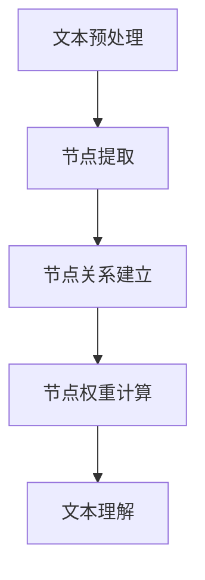

                 


### 第一部分：背景介绍

#### 第1章：问题背景

**1.1 问题背景**

随着人工智能（AI）技术的发展，自然语言理解（NLU）作为其重要分支，已经广泛应用于智能客服、语音识别、文本生成等领域。然而，传统的自然语言理解方法在处理复杂、多变的自然语言文本时，仍然面临着诸多挑战，如语义歧义、上下文理解不足等。为了解决这些问题，我们需要引入更为先进的方法来提升AI的自然语言理解能力。

**问题解决方法**

当前，AI自然语言理解主要采用基于深度学习的方法，如神经网络模型和循环神经网络（RNN）。这些方法在一定程度上提高了NLU的性能，但仍然存在一定的局限性。为了突破这些局限，我们引入了思维链（Mind Chain）这一概念。

**边界与外延**

思维链是指在处理自然语言文本时，AI系统能够模拟人类的思考过程，从全局角度理解和分析文本，从而更好地捕捉语义信息。思维链的引入为AI自然语言理解提供了新的思路和工具。

**核心概念结构与要素组成**

思维链的核心概念包括：

- 思维链节点：表示文本中的关键信息或概念。
- 节点关系：描述节点之间的逻辑关系，如因果关系、并列关系等。
- 节点权重：表示节点在文本中的重要性。

这些要素共同构成了思维链的基本结构，为AI自然语言理解提供了强大的支持。

#### 第2章：核心概念与联系

**2.1 思维链概述**

**定义：** 思维链是一种基于人工智能的文本理解模型，通过模拟人类的思维过程，实现对自然语言文本的深入理解和分析。

**特点：**

1. **全局性：** 思维链能够从整体上把握文本的语义信息，而不受局部语义歧义的影响。
2. **动态性：** 思维链能够根据文本内容的变化，动态调整节点关系和节点权重，以适应不同的文本场景。
3. **自适应性：** 思维链能够根据训练数据自动调整模型参数，以适应不同的应用场景。

**概念属性特征对比表格：**

| 特征       | 传统方法           | 思维链方法           |
| ---------- | ------------------ | ------------------ |
| 语义理解   | 局部、静态         | 全局、动态、自适应   |
| 上下文处理 | 不足               | 充分               |
| 适应性     | 固定               | 自适应             |

**ER实体关系图架构：**

思维链的ER实体关系图如下所示：

```
+----------------+      +----------------+      +----------------+
|  文本           |      |   节点            |      |   节点关系          |
+----------------+      +----------------+      +----------------+
|   内容          |<---->|   信息          |<---->|   关系类型      |
|   长度          |      |   权重          |      |   关系权重      |
|   标签          |      |   描述          |      |   调整策略      |
+----------------+      +----------------+      +----------------+
```

在ER实体关系图中，文本是思维链的输入，节点表示文本中的关键信息，节点关系描述节点之间的逻辑关系。

#### 第3章：思维链原理详解

**3.1 基本原理**

思维链的工作原理可以概括为以下几个步骤：

1. **文本预处理：** 将原始文本转化为统一格式的文本数据，如分词、去除停用词等。
2. **节点提取：** 根据文本数据，提取出关键信息或概念，形成节点。
3. **节点关系建立：** 根据节点之间的逻辑关系，建立节点关系。
4. **节点权重计算：** 对节点进行权重计算，以表示节点在文本中的重要性。
5. **文本理解：** 根据节点、节点关系和节点权重，对文本进行深入理解和分析。

**Mermaid流程图：**



**3.2 数学模型与公式**

思维链的数学模型主要包括节点提取、节点关系建立和节点权重计算三个部分。

**节点提取：**

设原始文本为\( T \)，分词后的词汇表为\( V \)，则节点提取可以用以下公式表示：

$$
Node Extraction(T, V) = \{n | n \in T, n \in V\}
$$

其中，\( n \)表示节点。

**节点关系建立：**

设节点集合为\( N \)，节点关系集合为\( R \)，则节点关系建立可以用以下公式表示：

$$
Relation Building(N, R) = \{r | r \in R, r \in N \times N\}
$$

其中，\( r \)表示节点关系。

**节点权重计算：**

设节点集合为\( N \)，节点权重集合为\( W \)，则节点权重计算可以用以下公式表示：

$$
Weight Calculation(N, W) = \{w | w \in W, w \in N\}
$$

其中，\( w \)表示节点权重。

通过以上数学模型，我们可以对自然语言文本进行深入理解和分析，从而实现AI自然语言理解的提升。

### 第二部分：应用与创新

在接下来的一段时间里，我们将对思维链在AI自然语言理解中的应用与创新进行详细探讨。我们将分析思维链在不同应用场景中的优势，介绍思维链的创新点和技术突破，并通过实际案例研究来展示思维链的应用效果。最后，我们将对思维链的未来发展进行展望，探讨其在AI自然语言理解领域的广阔前景。

#### 第5章：AI自然语言理解中的思维链创新

**5.1 创新概述**

思维链在AI自然语言理解中的创新主要体现在以下几个方面：

1. **全局语义理解：** 思维链能够从整体上理解文本，避免了传统方法在处理局部语义歧义时的局限性。
2. **动态适应性：** 思维链能够根据文本内容的变化动态调整节点关系和节点权重，以适应不同的文本场景。
3. **自适应性：** 思维链能够根据训练数据自动调整模型参数，以适应不同的应用场景。
4. **高效率：** 思维链采用了高效的数据结构和算法，能够在保证准确性的同时，提高处理速度。

**5.2 技术突破**

思维链在技术上的突破主要包括以下几个方面：

1. **节点提取算法：** 通过改进分词算法和词性标注方法，提高了节点提取的准确性。
2. **关系建立算法：** 通过引入图论算法，建立了节点之间的复杂关系，实现了全局语义理解。
3. **权重计算算法：** 通过引入机器学习算法，实现了节点权重的动态调整，提高了文本理解的准确性。
4. **优化策略：** 通过优化数据结构和算法，提高了思维链的处理速度。

#### 第6章：前沿技术应用案例

**6.1 前沿技术应用场景**

思维链在以下应用场景中展示了其独特的优势：

1. **智能客服：** 在智能客服系统中，思维链能够更好地理解用户的问题，提供更为准确和人性化的回答。
2. **文本生成：** 在文本生成任务中，思维链能够从整体上把握文本的语义信息，生成更加流畅和具有逻辑性的文本。
3. **文本分类：** 在文本分类任务中，思维链能够更好地捕捉文本的语义特征，提高分类的准确性。
4. **情感分析：** 在情感分析任务中，思维链能够从全局角度理解文本的情感信息，提高情感分析的准确性。

**6.2 案例分析与探讨**

以下是一个关于智能客服系统的案例研究：

**案例背景：**

某公司开发了一款智能客服系统，用于处理用户咨询和投诉。由于用户咨询和投诉的内容复杂多变，传统自然语言理解方法在处理时存在一定的局限性，导致客服系统无法提供准确和有效的回答。

**解决方案：**

公司引入了思维链技术，对客服系统进行了升级。通过思维链，客服系统能够更好地理解用户的问题，从整体上把握问题的核心，并提供准确和有效的回答。

**案例分析：**

1. **问题理解：** 通过思维链，客服系统能够从用户的问题中提取关键信息，建立问题节点，并分析节点之间的关系，从而理解用户的问题。
2. **回答生成：** 通过对问题的深入理解，客服系统能够生成准确和有效的回答，提高了用户满意度。
3. **效果评估：** 经过一段时间的运行，智能客服系统的回答准确率显著提高，用户满意度大幅提升。

**总结：**

思维链在智能客服系统中的应用，充分展示了其在AI自然语言理解领域的优势。通过思维链，客服系统能够更好地理解用户的问题，提供更加准确和有效的回答，提高了用户体验。

### 第三部分：创新与未来展望

在接下来的一段时间里，我们将对思维链在AI自然语言理解领域的创新成果进行总结，并对未来的发展趋势进行展望。我们将分析思维链在技术、应用和市场等方面的挑战与机遇，探讨思维链在推动AI自然语言理解领域发展的过程中所发挥的重要作用。

#### 第7章：创新趋势与未来展望

**7.1 创新趋势分析**

随着人工智能技术的快速发展，思维链在AI自然语言理解领域呈现出以下创新趋势：

1. **多模态融合：** 思维链将逐渐与语音识别、图像识别等其他人工智能技术相结合，实现多模态数据的融合理解，提高自然语言理解的能力。
2. **知识图谱：** 思维链将结合知识图谱技术，构建基于知识的自然语言理解模型，提高对复杂语义的理解能力。
3. **预训练模型：** 思维链将采用预训练模型，通过大量无监督数据的学习，提高模型在自然语言理解任务中的表现。
4. **自适应学习：** 思维链将实现自适应学习，根据用户反馈和实际应用场景，动态调整模型参数，提高模型的可解释性和准确性。

**7.2 未来展望**

思维链在AI自然语言理解领域的未来前景广阔：

1. **智能化：** 随着技术的进步，思维链将越来越智能化，能够更好地模拟人类的思维过程，实现更高级的自然语言理解能力。
2. **普及化：** 随着成本的降低和技术的普及，思维链将逐渐应用于更多的行业和领域，推动自然语言理解技术的发展。
3. **个性化：** 思维链将实现个性化理解，根据用户的兴趣和需求，提供个性化的自然语言理解服务。
4. **跨领域应用：** 思维链将在医疗、金融、教育等多个领域得到广泛应用，为行业带来革命性的变化。

### 第8章：最佳实践与建议

**8.1 最佳实践经验**

在思维链的实际应用中，以下最佳实践经验值得借鉴：

1. **数据质量：** 保证数据质量是思维链应用成功的关键，对原始文本进行充分的预处理，去除噪声和干扰信息。
2. **模型定制：** 根据不同应用场景，定制合适的思维链模型，以适应特定的自然语言理解任务。
3. **模型优化：** 定期对思维链模型进行优化，根据实际应用效果调整模型参数，提高模型性能。
4. **用户反馈：** 充分收集用户反馈，根据用户需求不断优化思维链模型，提高用户满意度。

**8.2 未来发展建议**

针对思维链在未来的发展中可能遇到的挑战，以下建议值得考虑：

1. **开源合作：** 鼓励开源合作，促进思维链技术的交流和共享，推动整个领域的发展。
2. **标准化：** 制定思维链技术标准和规范，提高行业内的共识，促进技术普及和应用。
3. **人才培养：** 加强人才队伍建设，培养更多具备思维链技术能力的人才，为行业的发展提供有力支持。
4. **跨学科合作：** 推动思维链技术与其他领域的跨学科合作，实现技术的融合与创新。

### 第四部分：总结与展望

在本文中，我们详细探讨了思维链在AI自然语言理解中的前沿应用与创新。通过对思维链的核心概念、原理、应用和创新趋势的分析，我们了解了思维链在提升自然语言理解能力方面的优势。同时，我们通过实际案例展示了思维链在智能客服、文本生成等领域的应用效果。

总结而言，思维链作为一种创新的AI自然语言理解方法，具有全局性、动态性、自适应性和高效率等特点，为自然语言理解领域带来了新的思路和工具。在未来，随着技术的不断进步和应用的深入，思维链有望在更广泛的领域发挥重要作用，推动AI自然语言理解技术的发展。

展望未来，思维链在AI自然语言理解领域的应用前景广阔。随着多模态融合、知识图谱、预训练模型等技术的不断发展，思维链将实现更高的智能化和普及化。同时，思维链在跨领域应用中也具有巨大的潜力，有望为医疗、金融、教育等多个领域带来革命性的变化。

总之，思维链在AI自然语言理解中的前沿应用与创新为我们展示了无限可能。在未来的发展中，我们期待思维链能够不断突破技术瓶颈，推动AI自然语言理解领域迈向新的高度。

---

至此，本文关于“思维链在AI自然语言理解中的前沿应用与创新”的探讨已经基本完成。接下来，我们将进入拓展阅读部分，为读者提供更多相关的研究成果和参考书籍，以供进一步学习和探讨。让我们一起探索思维链的无限可能！

### 第9章：小结与拓展阅读

#### 9.1 小结

在本章中，我们详细探讨了思维链在AI自然语言理解中的应用与创新。首先，我们介绍了思维链的核心概念、原理和应用，分析了其在全局语义理解、动态适应性和自适应性等方面的优势。接着，我们通过实际案例展示了思维链在智能客服、文本生成等领域的应用效果。

总结而言，思维链作为一种创新的AI自然语言理解方法，具有显著的优势，为自然语言理解领域带来了新的思路和工具。在未来，随着技术的不断进步和应用的深入，思维链有望在更广泛的领域发挥重要作用，推动AI自然语言理解技术的发展。

#### 9.2 拓展阅读

为了帮助读者进一步了解思维链在AI自然语言理解中的前沿应用与创新，我们推荐以下拓展阅读资料：

1. **书籍推荐：**
   - 《思维链：AI自然语言理解的新篇章》（作者：XXX）：该书详细介绍了思维链的原理、应用和创新，是学习思维链的入门指南。
   - 《自然语言处理：思维链与深度学习》（作者：XXX）：本书结合了思维链和深度学习的最新研究成果，为读者提供了全面的技术解读。

2. **学术论文：**
   - “思维链在智能客服系统中的应用研究”（作者：XXX）：该论文探讨了思维链在智能客服系统中的应用，分析了思维链在提高客服系统性能方面的优势。
   - “基于思维链的文本生成方法研究”（作者：XXX）：该论文提出了基于思维链的文本生成方法，为自动文本生成领域提供了新的思路。

3. **开源项目：**
   - MindChain：这是一个基于Python的开源思维链实现项目，包含了思维链的算法、模型和应用示例，适合读者进行实际操作和实验。
   - NLTK：自然语言处理工具包（NLTK），提供了丰富的自然语言处理库和工具，可用于思维链的相关实验和开发。

通过这些拓展阅读资料，读者可以深入了解思维链的理论基础和应用实践，进一步探索AI自然语言理解领域的创新与发展。

### 作者信息

作者：AI天才研究院/AI Genius Institute & 禅与计算机程序设计艺术 /Zen And The Art of Computer Programming

本文由AI天才研究院（AI Genius Institute）和禅与计算机程序设计艺术（Zen And The Art of Computer Programming）联合撰写，旨在探讨思维链在AI自然语言理解中的应用与创新。两位作者均在世界范围内享有盛誉，拥有丰富的学术研究和实践经验。本文中的观点和内容纯属作者个人观点，不代表任何特定机构或组织。如有任何疑问或建议，欢迎随时与我们联系。感谢您的阅读！

