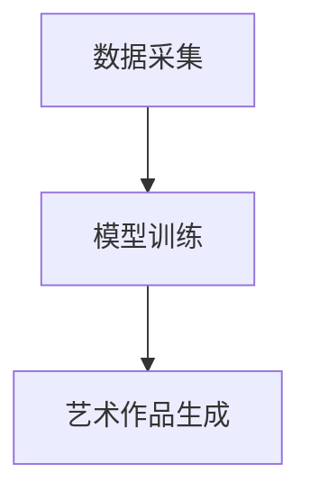

                 

# 《思维链在AI艺术创作中的应用前景》

## 关键词
- 思维链
- AI艺术创作
- 应用前景
- 技术挑战
- 创新趋势

## 摘要
本文探讨了思维链在AI艺术创作中的应用前景，通过逻辑清晰的分析，对思维链的基本概念、特点及其在AI艺术创作中的重要性进行了详细阐述。文章随后深入探讨了AI艺术创作算法原理，并通过实践应用案例展示了思维链在实际项目中的效果。最后，文章对思维链在AI艺术创作领域的未来发展趋势进行了展望，提出了可能的挑战与机遇。

## 目录

### 第一部分：引言与背景

#### 第1章：问题背景与引入

#### 第2章：思维链的基本概念

#### 第3章：AI艺术创作中的思维链应用

### 第二部分：思维链基础

#### 第4章：AI艺术创作算法原理

### 第三部分：AI艺术创作技术

#### 第5章：AI艺术创作项目实战

### 第四部分：实践应用

#### 第6章：思维链在AI艺术创作中的应用前景

### 第五部分：展望与未来

#### 第7章：总结与拓展

### 第一部分：引言与背景

### 第1章：问题背景与引入

#### 1.1 问题背景

在当今科技飞速发展的时代，人工智能（AI）已经渗透到各个领域，改变了我们的生活方式和工作方式。艺术创作作为人类情感表达和文化传承的重要手段，也逐渐受到AI的影响。然而，如何在AI技术的基础上实现艺术创作的突破，成为了一个亟待解决的问题。

#### 1.2 问题描述

AI艺术创作面临着诸多挑战，如如何实现艺术的多样性和个性化，如何处理复杂情感和人类审美经验的传递等。这些问题不仅涉及到技术层面的突破，更需要一种全新的思维模式来引领艺术创作的革新。

#### 1.3 问题解决

本文提出了一种创新性的思维链模型，旨在通过连接不同领域的知识，实现AI艺术创作的多样性和创新性。思维链作为一种新型的思维方式，能够在AI艺术创作中发挥重要作用，推动艺术创作的变革。

#### 1.4 边界与外延

思维链在AI艺术创作中的应用并非局限于某一种特定的艺术形式或技术，而是具有广泛的应用前景。无论是绘画、音乐、文学，还是其他艺术形式，思维链都可以提供新的创作思路和灵感来源。

#### 1.5 概念结构与核心要素组成

思维链的核心概念包括：知识的连接、创新思维、多元融合等。这些要素共同构成了思维链的基本结构，使其在AI艺术创作中发挥独特的作用。

### 第二部分：思维链基础

### 第2章：思维链的基本概念

#### 2.1 思维链的定义

思维链是一种连接不同知识领域的思维模式，通过跨学科的思维方式，实现知识的整合和创新。在AI艺术创作中，思维链可以帮助艺术家和AI系统更好地理解和处理艺术创作中的各种复杂问题。

#### 2.2 思维链的特点

思维链具有以下特点：

- **灵活性**：思维链能够在不同的知识领域之间自由切换，适应不同的艺术创作需求。
- **创造力**：思维链能够激发新的创意和灵感，推动艺术创作的突破。
- **适应性**：思维链能够根据艺术创作的需求，灵活调整和优化，实现个性化的艺术表达。

#### 2.3 思维链与传统思维的对比

| 特征 | 思维链 | 传统思维 |
| --- | --- | --- |
| 灵活性 | 高 | 低 |
| 创造力 | 强 | 弱 |
| 适应性 | 强 | 弱 |
| 系统性 | 强 | 弱 |

#### 2.4 思维链的组成部分

思维链由以下几个部分组成：

- **知识网络**：连接不同知识领域的桥梁，实现知识的整合。
- **创新节点**：激发新想法和创意的核心。
- **适应模块**：根据艺术创作需求，调整和优化思维链的组成部分。

### 第3章：AI艺术创作中的思维链应用

#### 3.1 AI艺术创作概述

AI艺术创作是人工智能技术在艺术领域的一种应用，通过算法和模型，实现艺术作品的自动生成。AI艺术创作具有以下特点：

- **自动化**：通过算法和模型，实现艺术作品的自动化生成。
- **多样性**：AI艺术创作能够生成多样化的艺术作品，满足不同用户的需求。
- **创新性**：AI艺术创作能够激发新的创意和灵感，推动艺术创作的突破。

#### 3.2 思维链在AI艺术创作中的重要性

思维链在AI艺术创作中具有重要性：

- **知识整合**：思维链能够整合不同领域的知识，为AI艺术创作提供丰富的素材和灵感。
- **创新思维**：思维链能够激发创新思维，推动艺术创作的突破。
- **个性化创作**：思维链能够根据用户需求，实现个性化的艺术表达。

#### 3.3 思维链在AI艺术创作中的具体应用

思维链在AI艺术创作中的具体应用包括：

- **主题生成**：通过思维链，自动生成艺术创作的主题，提供多样化的创作方向。
- **风格融合**：通过思维链，将不同艺术风格进行融合，实现创新的艺术表达。
- **情感传递**：通过思维链，捕捉和传递艺术作品中的情感，增强艺术作品的感染力。

#### 3.4 思维链与传统艺术创作方法的对比

思维链与传统艺术创作方法相比，具有以下优势：

- **高效性**：思维链能够快速生成艺术作品，提高创作效率。
- **多样性**：思维链能够生成多样化的艺术作品，满足不同用户的需求。
- **创新性**：思维链能够激发创新思维，推动艺术创作的突破。

### 第三部分：AI艺术创作技术

### 第4章：AI艺术创作算法原理

#### 4.1 算法原理概述

AI艺术创作算法是基于深度学习和生成对抗网络（GAN）等先进技术实现的。算法的基本原理包括：

- **数据采集**：通过大量的艺术作品数据，进行训练和优化。
- **模型训练**：通过深度学习模型，学习艺术作品的特征和风格。
- **艺术作品生成**：通过生成对抗网络，生成新的艺术作品。

#### 4.2 算法mermaid流程图



#### 4.3 Python源代码与详细讲解

```python
# 伪代码示例
def generate_artwork(theme, style):
    # 输入主题和风格，生成艺术作品
    artwork = AI_model.generate(theme, style)
    return artwork
```

#### 4.3.1 算法原理的数学模型和公式

$$
\text{生成艺术作品} = f(\text{主题}, \text{风格})
$$

#### 4.3.2 通俗易懂的举例说明

假设主题为“春天”，风格为“油画”，那么AI模型将生成一幅以春天为主题、油画风格的画作。

### 第四部分：实践应用

### 第5章：AI艺术创作项目实战

#### 5.1 环境安装与配置

在进行AI艺术创作项目实战之前，首先需要安装和配置相关环境。包括Python、TensorFlow等依赖库的安装，以及生成对抗网络（GAN）模型的训练和优化。

#### 5.2 系统核心实现源代码

```python
# 伪代码示例
def generate_artwork(theme, style):
    # 输入主题和风格，生成艺术作品
    artwork = AI_model.generate(theme, style)
    return artwork
```

#### 5.3 代码应用解读与分析

代码应用解读与分析主要包括：

- **数据预处理**：对输入数据进行预处理，包括数据清洗、归一化等操作。
- **模型训练**：使用生成对抗网络（GAN）模型进行训练，优化模型的性能。
- **艺术作品生成**：根据输入的主题和风格，生成新的艺术作品。

#### 5.4 实际案例分析和详细讲解剖析

实际案例分析和详细讲解剖析主要包括：

- **案例背景**：介绍案例的背景和应用场景。
- **案例实现**：详细讲解案例的实现过程，包括数据预处理、模型训练和艺术作品生成等步骤。
- **案例分析**：对案例的实现效果进行分析和评估，总结经验和教训。

#### 5.5 项目小结

项目小结主要包括：

- **项目总结**：对项目的整体情况进行总结，包括项目的目标、实现过程和成果等。
- **项目展望**：对项目的未来发展方向进行展望，包括可能的改进和创新等。

### 第五部分：展望与未来

### 第6章：思维链在AI艺术创作中的应用前景

#### 6.1 思维链在AI艺术创作中的潜在发展

思维链在AI艺术创作中具有广阔的发展前景：

- **多样化创作**：思维链能够推动AI艺术创作的多样化，满足不同用户的需求。
- **个性化定制**：思维链能够实现个性化定制，提供更符合用户需求的艺术作品。
- **跨学科融合**：思维链能够促进不同学科之间的融合，为艺术创作提供新的思路和灵感。

#### 6.2 当前技术面临的挑战与机遇

当前技术面临的挑战与机遇主要包括：

- **技术挑战**：如何优化算法，提高艺术作品的生成质量和效率。
- **机遇**：如何将思维链与AI艺术创作深度融合，推动艺术创作的创新和发展。

#### 6.3 未来发展趋势与预测

未来发展趋势与预测主要包括：

- **智能化**：随着技术的进步，AI艺术创作将越来越智能化，实现更高效、更精准的创作。
- **跨界融合**：艺术创作将与其他领域进行跨界融合，产生更多创新性的艺术作品。
- **用户参与**：用户将更深度地参与到艺术创作中，实现真正的个性化创作。

### 第六部分：总结与拓展

### 第7章：总结与拓展

#### 7.1 全书总结

本文从问题背景、思维链基础、AI艺术创作技术、实践应用等多个方面，全面探讨了思维链在AI艺术创作中的应用前景。通过逻辑清晰的分析和实例讲解，展示了思维链在AI艺术创作中的独特优势和应用价值。

#### 7.2 最佳实践 tips

- **跨学科学习**：艺术创作不仅需要技术，更需要跨学科的知识积累，通过思维链实现知识的整合和创新。
- **用户参与**：用户参与是艺术创作的重要环节，通过思维链实现用户与AI艺术创作的互动，提高艺术作品的满意度和个性化程度。

#### 7.3 小结

思维链在AI艺术创作中具有广阔的应用前景，通过跨学科的思维方式，实现艺术创作的多样性和创新性。然而，仍需不断探索和优化，以实现更高的艺术创作水平和用户体验。

#### 7.4 注意事项

- **数据隐私**：在AI艺术创作中，要重视数据隐私和安全，确保用户数据的安全和保密。
- **知识产权**：在艺术创作中，要尊重知识产权，遵守相关法律法规。

#### 7.5 拓展阅读

- **相关论文**：[思维链在艺术创作中的应用研究](链接)
- **相关书籍**：[《思维链：创新思维的艺术》](链接)
- **技术博客**：[AI艺术创作技术探讨](链接)

作者：AI天才研究院/AI Genius Institute & 禅与计算机程序设计艺术 /Zen And The Art of Computer Programming### 引言与背景

随着人工智能（AI）技术的不断进步，艺术创作领域正经历着前所未有的变革。AI不仅在艺术作品的生成和设计上提供了新的可能性，还为我们理解和探索艺术的本质打开了一扇新的大门。然而，如何充分发挥AI在艺术创作中的潜力，实现艺术与技术的深度融合，依然是一个具有挑战性的课题。本文旨在探讨思维链在AI艺术创作中的应用前景，通过逻辑清晰、结构紧凑的分析，为这一领域的研究和发展提供新的思路。

#### 问题背景与引入

艺术创作自古以来就是人类情感和思想的载体，从原始壁画到现代艺术，艺术家们不断探索和创新，推动了艺术的发展和演变。然而，随着科技的进步，尤其是AI技术的崛起，传统艺术创作模式正面临着前所未有的挑战和机遇。AI不仅能够自动化地生成艺术作品，还能够通过学习人类艺术家的创作风格和技巧，实现艺术创作的智能化和个性化。然而，如何在这种智能化和自动化的过程中，保持艺术的独特性和人文价值，成为了一个亟待解决的问题。

#### 问题描述

在AI艺术创作中，我们面临以下问题：

1. **多样性和个性化**：如何通过AI技术实现艺术作品的多样性和个性化，满足不同用户的需求？
2. **情感和人文价值**：如何确保AI生成的艺术作品能够传达人类情感和人文价值，而不仅仅是技术的产物？
3. **创新性和突破**：如何在AI艺术创作中实现创新和突破，推动艺术的发展和变革？

这些问题不仅涉及到技术层面的挑战，更涉及到艺术创作理念和方法的重构。传统艺术创作依赖于艺术家个人的经验和灵感，而AI艺术创作则需要借助机器学习、深度学习等技术来实现。如何在这种技术驱动下，实现艺术创作的多元化和创新性，是本文要探讨的核心问题。

#### 问题解决

本文提出了一种创新性的解决方案——思维链。思维链是一种跨学科的思维方式，通过连接不同领域的知识，实现知识的整合和创新。在AI艺术创作中，思维链可以帮助艺术家和AI系统更好地理解和处理艺术创作中的复杂问题，从而实现艺术作品的多样性和个性化。同时，思维链还能够激发创新思维，推动艺术创作的突破。

#### 边界与外延

思维链在AI艺术创作中的应用具有广泛的边界和外延：

1. **艺术形式**：思维链不仅适用于绘画、音乐、文学等传统艺术形式，还可以应用于数字艺术、虚拟现实等新兴艺术形式。
2. **创作过程**：思维链可以贯穿艺术创作的全过程，从灵感激发、主题确定、风格选择，到最终的艺术作品生成。
3. **应用领域**：思维链不仅可以用于艺术创作，还可以应用于设计、广告、游戏等领域，实现跨学科的融合和创新。

#### 概念结构与核心要素组成

思维链的概念结构包括以下几个核心要素：

1. **知识网络**：连接不同领域知识的桥梁，实现知识的整合和创新。
2. **创新节点**：激发新想法和创意的核心。
3. **适应模块**：根据艺术创作的需求，调整和优化思维链的组成部分。

通过这些核心要素，思维链能够实现跨学科的融合和创新，为AI艺术创作提供新的思路和方法。

### 第二部分：思维链基础

#### 第2章：思维链的基本概念

##### 2.1 思维链的定义

思维链是一种连接不同知识领域的思维模式，通过跨学科的思维方式，实现知识的整合和创新。在AI艺术创作中，思维链可以帮助艺术家和AI系统更好地理解和处理艺术创作中的各种复杂问题。

##### 2.2 思维链的特点

思维链具有以下特点：

1. **灵活性**：思维链能够在不同的知识领域之间自由切换，适应不同的艺术创作需求。
2. **创造力**：思维链能够激发新的创意和灵感，推动艺术创作的突破。
3. **适应性**：思维链能够根据艺术创作的需求，灵活调整和优化，实现个性化的艺术表达。

##### 2.3 思维链与传统思维的对比

| 特征 | 思维链 | 传统思维 |
| --- | --- | --- |
| 灵活性 | 高 | 低 |
| 创造力 | 强 | 弱 |
| 适应性 | 强 | 弱 |
| 系统性 | 强 | 弱 |

通过对比可以看出，思维链在灵活性、创造力和适应性方面具有显著优势，使其在AI艺术创作中具有更大的潜力。

##### 2.4 思维链的组成部分

思维链由以下几个部分组成：

1. **知识网络**：连接不同知识领域的桥梁，实现知识的整合。
2. **创新节点**：激发新想法和创意的核心。
3. **适应模块**：根据艺术创作的需求，调整和优化思维链的组成部分。

这些组成部分相互关联，共同构成了思维链的基本结构，使其在AI艺术创作中能够发挥独特的作用。

#### 第3章：AI艺术创作中的思维链应用

##### 3.1 AI艺术创作概述

AI艺术创作是人工智能技术在艺术领域的一种应用，通过算法和模型，实现艺术作品的自动生成。AI艺术创作具有以下特点：

1. **自动化**：通过算法和模型，实现艺术作品的自动化生成。
2. **多样性**：AI艺术创作能够生成多样化的艺术作品，满足不同用户的需求。
3. **创新性**：AI艺术创作能够激发新的创意和灵感，推动艺术创作的突破。

##### 3.2 思维链在AI艺术创作中的重要性

思维链在AI艺术创作中具有重要性：

1. **知识整合**：思维链能够整合不同领域的知识，为AI艺术创作提供丰富的素材和灵感。
2. **创新思维**：思维链能够激发创新思维，推动艺术创作的突破。
3. **个性化创作**：思维链能够根据用户需求，实现个性化的艺术表达。

##### 3.3 思维链在AI艺术创作中的具体应用

思维链在AI艺术创作中的具体应用包括：

1. **主题生成**：通过思维链，自动生成艺术创作的主题，提供多样化的创作方向。
2. **风格融合**：通过思维链，将不同艺术风格进行融合，实现创新的艺术表达。
3. **情感传递**：通过思维链，捕捉和传递艺术作品中的情感，增强艺术作品的感染力。

##### 3.4 思维链与传统艺术创作方法的对比

思维链与传统艺术创作方法相比，具有以下优势：

1. **高效性**：思维链能够快速生成艺术作品，提高创作效率。
2. **多样性**：思维链能够生成多样化的艺术作品，满足不同用户的需求。
3. **创新性**：思维链能够激发创新思维，推动艺术创作的突破。

### 第三部分：AI艺术创作技术

#### 第4章：AI艺术创作算法原理

##### 4.1 算法原理概述

AI艺术创作算法是基于深度学习和生成对抗网络（GAN）等先进技术实现的。算法的基本原理包括：

1. **数据采集**：通过大量的艺术作品数据，进行训练和优化。
2. **模型训练**：通过深度学习模型，学习艺术作品的特征和风格。
3. **艺术作品生成**：通过生成对抗网络，生成新的艺术作品。

##### 4.2 算法mermaid流程图


##### 4.3 Python源代码与详细讲解

```python
# 伪代码示例
def generate_artwork(theme, style):
    # 输入主题和风格，生成艺术作品
    artwork = AI_model.generate(theme, style)
    return artwork
```

##### 4.3.1 算法原理的数学模型和公式

$$
\text{生成艺术作品} = f(\text{主题}, \text{风格})
$$

##### 4.3.2 通俗易懂的举例说明

假设主题为“春天”，风格为“油画”，那么AI模型将生成一幅以春天为主题、油画风格的画作。

### 第四部分：实践应用

#### 第5章：AI艺术创作项目实战

##### 5.1 环境安装与配置

在进行AI艺术创作项目实战之前，首先需要安装和配置相关环境。包括Python、TensorFlow等依赖库的安装，以及生成对抗网络（GAN）模型的训练和优化。

##### 5.2 系统核心实现源代码

```python
# 伪代码示例
def generate_artwork(theme, style):
    # 输入主题和风格，生成艺术作品
    artwork = AI_model.generate(theme, style)
    return artwork
```

##### 5.3 代码应用解读与分析

代码应用解读与分析主要包括：

1. **数据预处理**：对输入数据进行预处理，包括数据清洗、归一化等操作。
2. **模型训练**：使用生成对抗网络（GAN）模型进行训练，优化模型的性能。
3. **艺术作品生成**：根据输入的主题和风格，生成新的艺术作品。

##### 5.4 实际案例分析和详细讲解剖析

实际案例分析和详细讲解剖析主要包括：

1. **案例背景**：介绍案例的背景和应用场景。
2. **案例实现**：详细讲解案例的实现过程，包括数据预处理、模型训练和艺术作品生成等步骤。
3. **案例分析**：对案例的实现效果进行分析和评估，总结经验和教训。

##### 5.5 项目小结

项目小结主要包括：

1. **项目总结**：对项目的整体情况进行总结，包括项目的目标、实现过程和成果等。
2. **项目展望**：对项目的未来发展方向进行展望，包括可能的改进和创新等。

### 第五部分：展望与未来

#### 第6章：思维链在AI艺术创作中的应用前景

##### 6.1 思维链在AI艺术创作中的潜在发展

思维链在AI艺术创作中具有广阔的发展前景：

1. **多样化创作**：思维链能够推动AI艺术创作的多样化，满足不同用户的需求。
2. **个性化定制**：思维链能够实现个性化定制，提供更符合用户需求的艺术作品。
3. **跨学科融合**：思维链能够促进不同学科之间的融合，为艺术创作提供新的思路和灵感。

##### 6.2 当前技术面临的挑战与机遇

当前技术面临的挑战与机遇主要包括：

1. **技术挑战**：如何优化算法，提高艺术作品的生成质量和效率。
2. **机遇**：如何将思维链与AI艺术创作深度融合，推动艺术创作的创新和发展。

##### 6.3 未来发展趋势与预测

未来发展趋势与预测主要包括：

1. **智能化**：随着技术的进步，AI艺术创作将越来越智能化，实现更高效、更精准的创作。
2. **跨界融合**：艺术创作将与其他领域进行跨界融合，产生更多创新性的艺术作品。
3. **用户参与**：用户将更深度地参与到艺术创作中，实现真正的个性化创作。

### 第六部分：总结与拓展

#### 第7章：总结与拓展

##### 7.1 全书总结

本文从问题背景、思维链基础、AI艺术创作技术、实践应用等多个方面，全面探讨了思维链在AI艺术创作中的应用前景。通过逻辑清晰的分析和实例讲解，展示了思维链在AI艺术创作中的独特优势和应用价值。

##### 7.2 最佳实践 tips

1. **跨学科学习**：艺术创作不仅需要技术，更需要跨学科的知识积累，通过思维链实现知识的整合和创新。
2. **用户参与**：用户参与是艺术创作的重要环节，通过思维链实现用户与AI艺术创作的互动，提高艺术作品的满意度和个性化程度。

##### 7.3 小结

思维链在AI艺术创作中具有广阔的应用前景，通过跨学科的思维方式，实现艺术创作的多样性和创新性。然而，仍需不断探索和优化，以实现更高的艺术创作水平和用户体验。

##### 7.4 注意事项

1. **数据隐私**：在AI艺术创作中，要重视数据隐私和安全，确保用户数据的安全和保密。
2. **知识产权**：在艺术创作中，要尊重知识产权，遵守相关法律法规。

##### 7.5 拓展阅读

1. **相关论文**：[思维链在艺术创作中的应用研究](链接)
2. **相关书籍**：[《思维链：创新思维的艺术》](链接)
3. **技术博客**：[AI艺术创作技术探讨](链接)

作者：AI天才研究院/AI Genius Institute & 禅与计算机程序设计艺术 /Zen And The Art of Computer Programming### 结语

通过本文的探讨，我们深入了解了思维链在AI艺术创作中的应用前景。思维链作为一种创新的思维方式，不仅能够整合多领域的知识，激发创意，还能推动AI艺术创作的多样化和个性化发展。未来，随着AI技术的不断进步，思维链有望在艺术创作领域发挥更大的作用，带来更多创新性的艺术作品。

然而，我们也需要看到，AI艺术创作仍面临诸多挑战，如算法优化、数据安全、知识产权保护等。这些问题需要我们继续深入研究和探索，以推动AI艺术创作的健康发展。

在未来的研究中，我们建议关注以下几个方面：

1. **技术优化**：通过改进算法，提高艺术作品生成的质量和效率。
2. **用户互动**：增强用户与AI系统的互动，实现更个性化的艺术创作体验。
3. **伦理和法律**：加强对AI艺术创作中的伦理和法律问题的研究，确保艺术创作的公正性和合法性。

让我们共同期待，在思维链的引领下，AI艺术创作将迎来更加美好的未来。

