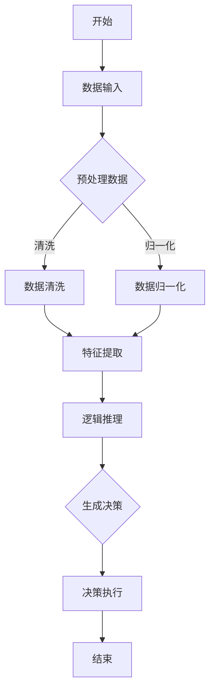
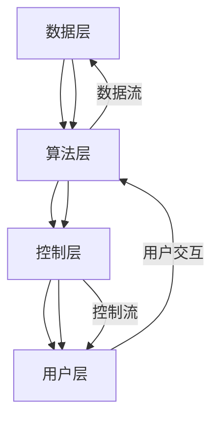
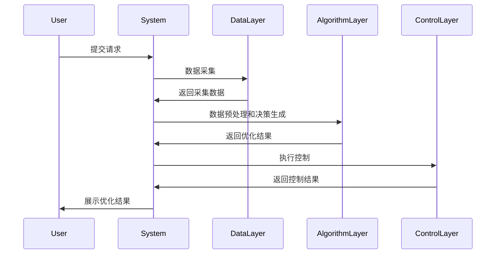

                 

### 第1章: 引言

#### 1.1 研究背景

在当今全球数字化转型的浪潮中，人工智能（AI）已经成为推动社会进步的重要力量。AI辅助决策系统（AI-ADDS）作为AI的一个重要分支，在各个领域展现出了巨大的潜力和应用价值。从金融服务、医疗健康到智能交通、智能制造，AI辅助决策系统正在深刻改变我们的生活方式和工作模式。

**问题背景**：然而，随着AI技术的不断进步和应用的广泛普及，AI辅助决策系统在实际应用中面临诸多挑战。例如，如何确保决策的透明性和可解释性？如何提高系统的鲁棒性和抗干扰能力？如何在海量数据中进行高效决策？这些问题的存在限制了AI辅助决策系统在实际应用中的推广和普及。

**问题描述**：针对上述问题，本文旨在探讨思维链（Mind Chain）在AI辅助决策系统中的实践与探索。思维链是一种基于人类思维模式的决策支持工具，通过模拟人类的思考过程，帮助AI系统做出更加合理和可靠的决策。本文将详细分析思维链的原理、应用场景，以及其在AI辅助决策系统中的实际效果。

**问题解决**：本文将通过以下几部分来探讨思维链在AI辅助决策系统中的应用：
1. 引言与背景：介绍AI辅助决策系统的背景和研究意义。
2. 核心概念与联系：阐述思维链和AI辅助决策系统的基本概念及其关系。
3. 数学模型与算法原理：分析思维链的数学模型和算法原理。
4. 系统设计与实现：介绍AI辅助决策系统的设计与实现过程。
5. 项目实战：通过实际案例展示思维链在AI辅助决策系统中的应用效果。
6. 最佳实践与未来展望：总结最佳实践，探讨未来的发展方向。

**边界与外延**：本文主要关注思维链在AI辅助决策系统中的应用，重点探讨其理论原理和实践效果。同时，本文也探讨了AI辅助决策系统的整体架构和设计原则，为后续研究提供参考。

**核心概念**：在本文中，核心概念包括思维链、AI辅助决策系统、数学模型、算法原理、系统架构和实际应用案例。这些概念是本文讨论的基础，对于理解思维链在AI辅助决策系统中的应用至关重要。

#### 1.2 思维链与AI辅助决策系统的关系

思维链（Mind Chain）是一种基于人类思维模式的决策支持工具，它通过模拟人类的思考过程，帮助AI系统做出更加合理和可靠的决策。思维链的基本原理是利用人类大脑中的神经网络结构和信息处理机制，将复杂的决策问题分解为一系列简化的子问题，并通过迭代和反馈机制逐步解决。

**思维链的定义**：思维链是一种基于逻辑推理和信息处理的决策支持工具，它通过构建一系列思维模块，模拟人类大脑的决策过程，帮助AI系统在复杂环境中做出决策。

**AI辅助决策系统的定义**：AI辅助决策系统是一种利用人工智能技术支持决策的系统，它通过收集、分析和处理数据，为决策者提供决策支持和建议。

**关系介绍**：思维链与AI辅助决策系统之间的关系可以理解为：思维链是AI辅助决策系统的核心组成部分，它为AI系统提供了决策的逻辑框架和思维模式。具体来说，思维链通过以下几个步骤与AI辅助决策系统相结合：
1. **数据输入**：AI辅助决策系统首先收集和处理输入数据，这些数据可以是结构化数据（如数据库中的数据）或非结构化数据（如图像、文本等）。
2. **思维链构建**：根据输入数据，思维链构建相应的思维模块，这些模块可以包括数据分析模块、逻辑推理模块、预测模块等。
3. **决策推理**：思维链利用人类思维模式对输入数据进行处理和分析，通过逻辑推理和反馈机制，生成决策建议。
4. **决策执行**：AI辅助决策系统根据思维链提供的决策建议，执行具体的操作或任务。

通过这种方式，思维链与AI辅助决策系统实现了紧密的集成，使AI系统能够在复杂环境中进行高效、可靠的决策。

#### 1.3 书籍结构安排

**内容概述**：本书旨在深入探讨思维链在AI辅助决策系统中的应用，通过理论分析、实践案例和最佳实践，为读者提供全面、系统的指导。全书分为三大部分：

1. **第一部分：引言与背景**：介绍AI辅助决策系统和思维链的基本概念，阐述研究的意义和目的。
2. **第二部分：核心概念与联系**：详细分析思维链的基本原理、数学模型和算法原理，以及AI辅助决策系统的设计原则和实现方法。
3. **第三部分：最佳实践与未来展望**：总结最佳实践，探讨未来发展方向，为读者提供参考和启示。

**各章节目的**：
- **第1章：引言**：介绍研究的背景、问题和研究意义。
- **第2章：核心概念与联系**：阐述思维链和AI辅助决策系统的基本概念和关系。
- **第3章：数学模型与算法原理**：分析思维链的数学模型和算法原理。
- **第4章：系统设计与架构**：介绍AI辅助决策系统的设计与实现过程。
- **第5章：系统核心实现**：详细讲解系统的核心实现部分。
- **第6章：项目实战**：通过实际案例展示思维链的应用效果。
- **第7章：最佳实践与技巧**：总结最佳实践，提供实用技巧。
- **第8章：未来展望**：探讨未来发展趋势和应用前景。
- **第9章：小结与拓展阅读**：回顾主要内容，提供拓展阅读资源。

通过以上结构安排，本书旨在为读者提供一个全面、系统的视角，深入理解思维链在AI辅助决策系统中的应用，为其研究和实践提供有力支持。

### 第2章: 核心概念与联系

#### 2.1 思维链的基本原理

思维链（Mind Chain）是一种基于人类思维模式的决策支持工具，其核心思想是通过模拟人类大脑的思考过程，帮助AI系统在复杂环境中做出更合理和可靠的决策。思维链的基本原理可以概括为以下几个方面：

**思维链的组成**：思维链由多个思维模块组成，每个思维模块都承担特定的功能。这些思维模块可以包括数据分析模块、逻辑推理模块、预测模块、决策模块等。通过将这些模块有机地结合起来，思维链可以模拟人类大脑的思考过程，实现对复杂问题的分析和决策。

**思维链的工作原理**：思维链的工作原理可以分为以下几个步骤：
1. **数据输入**：首先，思维链从外部环境中获取数据，这些数据可以是结构化数据（如数据库中的数据）或非结构化数据（如图像、文本等）。
2. **数据处理**：思维链对输入数据进行预处理，包括数据清洗、归一化等操作，以确保数据的质量和一致性。
3. **数据分析**：思维链利用数据分析模块对预处理后的数据进行详细分析，包括统计、趋势分析、关联分析等，以获取数据的特征和规律。
4. **逻辑推理**：思维链通过逻辑推理模块，结合先验知识和分析结果，对问题进行推理和判断。逻辑推理可以是基于规则推理、归纳推理、演绎推理等多种方式。
5. **预测和决策**：思维链利用预测模块对未来的情况进行预测，并根据决策模块提供的决策策略，生成最终的决策建议。

**思维链的优势**：思维链具有以下几个显著优势：
1. **灵活性**：思维链可以根据不同的应用场景和需求，灵活地调整和组合思维模块，以适应不同的决策问题。
2. **可解释性**：思维链的决策过程是可解释的，用户可以清晰地了解决策的依据和推理过程，提高决策的透明性和可接受性。
3. **自适应能力**：思维链可以根据环境的变化和反馈，自适应地调整和优化决策过程，提高决策的准确性和适应性。

通过上述原理，思维链能够有效地模拟人类大脑的决策过程，为AI系统提供强有力的决策支持。

#### 2.2 AI辅助决策系统

AI辅助决策系统（AI-ADDS）是一种利用人工智能技术支持决策的系统，其核心目标是通过收集、分析和处理数据，为决策者提供高质量的决策支持和建议。AI辅助决策系统的基本概念和组成部分如下：

**AI辅助决策系统的组成**：AI辅助决策系统通常包括以下几个关键组成部分：
1. **数据采集**：通过传感器、数据库、网络等渠道收集数据，包括结构化数据和非结构化数据。
2. **数据预处理**：对收集到的数据进行清洗、归一化等预处理操作，以提高数据的质量和一致性。
3. **数据分析**：利用各种数据分析方法，如统计、机器学习、深度学习等，对预处理后的数据进行详细分析，以提取数据中的信息和知识。
4. **模型训练**：通过训练数据集，利用机器学习算法训练模型，使模型能够根据输入数据生成预测或决策结果。
5. **决策支持**：根据分析结果和模型预测，生成决策建议，并支持决策者进行决策。
6. **用户交互**：与决策者进行交互，收集反馈，调整决策过程和模型参数，以提高决策的准确性和适应性。

**AI辅助决策系统的工作原理**：AI辅助决策系统的工作原理可以分为以下几个步骤：
1. **数据采集**：系统首先从各种数据源中收集数据，包括内部数据和外部数据。
2. **数据预处理**：对采集到的数据进行清洗、转换和归一化等操作，以确保数据的质量和一致性。
3. **数据分析**：利用数据分析工具和方法，对预处理后的数据进行深入分析，包括数据挖掘、统计分析、模式识别等。
4. **模型训练**：利用分析结果和训练数据，通过机器学习算法训练模型，以实现数据的预测和分类。
5. **决策生成**：模型根据训练结果，对新的输入数据进行预测或决策，生成决策建议。
6. **决策支持**：系统将决策建议展示给决策者，并提供交互界面，让决策者根据具体情况进行调整和决策。

**AI辅助决策系统的优势**：AI辅助决策系统具有以下几个显著优势：
1. **高效性**：系统能够在短时间内处理大量数据，快速生成决策建议，提高决策效率。
2. **准确性**：通过机器学习算法和数据分析技术，系统能够从数据中提取有价值的信息，提高决策的准确性和可靠性。
3. **灵活性**：系统可以根据不同的应用场景和需求，灵活调整和优化决策过程，适应各种复杂环境。
4. **可解释性**：系统生成的决策建议是可解释的，决策者可以清晰地了解决策的依据和过程，提高决策的透明性和可接受性。

通过上述组成和原理，AI辅助决策系统为决策者提供了一个强大的决策支持工具，有助于他们在复杂环境中做出更明智、更准确的决策。

#### 2.3 思维链与AI辅助决策系统的融合

思维链与AI辅助决策系统的融合是将两者的优势结合起来，形成一种更加强大和高效的决策支持系统。这种融合不仅在理论上具有重要意义，而且在实际应用中也展示出了巨大的潜力。

**融合的意义**：思维链与AI辅助决策系统的融合具有以下几个重要意义：
1. **增强决策能力**：通过结合思维链的逻辑推理能力和AI辅助决策系统的数据分析能力，系统能够在复杂环境中做出更加合理和可靠的决策。
2. **提高决策透明性**：思维链的可解释性使得决策过程更加透明，决策者可以清晰地了解决策的依据和推理过程，增强决策的可接受性。
3. **增强系统适应性**：思维链的自适应能力使得系统能够根据环境的变化和反馈，动态调整决策过程和模型参数，提高系统的适应性和鲁棒性。

**融合的方法**：思维链与AI辅助决策系统的融合可以通过以下几种方法实现：
1. **模块化集成**：将思维链的不同模块与AI辅助决策系统的组成部分进行模块化集成，使两者能够在功能和逻辑上无缝衔接。
2. **数据共享**：通过数据共享机制，使思维链和AI辅助决策系统能够充分利用同一数据源，避免数据重复处理和资源浪费。
3. **协同优化**：通过协同优化算法，使思维链和AI辅助决策系统在决策过程中相互协作，共同优化决策过程和结果。

**融合的挑战**：尽管思维链与AI辅助决策系统的融合具有巨大的潜力，但在实际应用中也面临一些挑战：
1. **技术挑战**：如何有效地将思维链和AI辅助决策系统的技术进行整合，实现两者的高效协同。
2. **数据挑战**：如何处理大量的非结构化数据，确保数据的质量和一致性。
3. **解释性挑战**：如何在保证决策可解释性的同时，提高决策的准确性和效率。

通过克服上述挑战，思维链与AI辅助决策系统的融合将为决策者提供一个更加智能、高效和透明的决策支持平台。

### 第3章: 数学模型与算法原理

#### 3.1 基本数学模型

在讨论思维链在AI辅助决策系统中的应用时，理解其背后的数学模型和算法原理是非常重要的。思维链的数学模型主要基于逻辑推理、概率论和优化理论，以下是对这些基本数学模型的介绍。

**1. 逻辑推理模型**：

逻辑推理是思维链的核心组成部分，它用于处理判断和推理任务。一个基本的逻辑推理模型可以基于布尔逻辑，包括与（AND）、或（OR）和非（NOT）等基本运算。

- **与运算**：假设有两个命题A和B，与运算表示为A AND B。其结果为真当且仅当A和B都为真。
  $$ A \land B = \begin{cases} 
  1 & \text{如果} A = 1 \text{且} B = 1 \\
  0 & \text{其他情况}
  \end{cases} $$
- **或运算**：或运算表示为A OR B。其结果为真当且仅当A或B至少有一个为真。
  $$ A \lor B = \begin{cases} 
  1 & \text{如果} A = 1 \text{或} B = 1 \\
  0 & \text{其他情况}
  \end{cases} $$
- **非运算**：非运算表示为NOT A。其结果为真当且仅当A为假。
  $$ \neg A = \begin{cases} 
  1 & \text{如果} A = 0 \\
  0 & \text{如果} A = 1 
  \end{cases} $$

**2. 概率论模型**：

概率论模型用于处理不确定性问题，如预测和风险评估。概率分布函数和条件概率是概率论中重要的概念。

- **概率分布函数**：给定一个随机变量X，其概率分布函数P(X=x)表示X取值为x的概率。
  $$ P(X=x) = \frac{f(x)}{\int_{-\infty}^{\infty} f(x) dx} $$
  其中，f(x)是X的概率密度函数。

- **条件概率**：给定两个事件A和B，条件概率P(A|B)表示在事件B发生的条件下，事件A发生的概率。
  $$ P(A|B) = \frac{P(A \cap B)}{P(B)} $$
  其中，P(A ∩ B)是事件A和B同时发生的概率，P(B)是事件B发生的概率。

**3. 优化模型**：

优化模型用于寻找最优解，常用于资源分配、路径规划等决策问题。线性规划是优化模型的一种常见形式。

- **线性规划**：线性规划的目标是最小化或最大化线性目标函数，在满足线性约束条件的情况下进行。
  $$ \text{minimize} \ c^T x $$
  $$ \text{subject to} \ Ax \leq b $$
  $$ x \geq 0 $$
  其中，c是系数向量，x是决策变量向量，A是约束矩阵，b是约束向量。

通过上述基本数学模型，思维链能够在决策过程中进行逻辑推理、概率预测和优化决策。

#### 3.2 算法原理讲解

为了更好地理解思维链在AI辅助决策系统中的应用，下面我们将使用mermaid绘制算法流程图，并详细讲解一个简单的思维链算法。

**算法流程图**：

首先，我们使用mermaid绘制思维链的基本算法流程图：



接下来，我们详细解释这个流程图中的每一步：

1. **数据输入**（B节点）：思维链首先从外部环境中获取数据，这些数据可以是结构化数据（如数据库中的数据）或非结构化数据（如图像、文本等）。

2. **预处理数据**（C节点）：在数据输入后，思维链对数据进行预处理，包括数据清洗和数据归一化。数据清洗的目的是去除噪声和异常值，而数据归一化则是为了使不同特征的数据具有相同的尺度，便于后续处理。

3. **数据清洗**（D节点）：在这一步，思维链会检查数据集中的每一个值，去除那些不符合数据规范或存在错误的值。例如，如果数据集中存在空值，思维链将根据设定的策略（如均值填补、中值填补等）对这些空值进行填补。

4. **数据归一化**（E节点）：数据归一化是将数据集中的特征值缩放到一个统一的尺度范围内。常见的归一化方法有最小-最大缩放和标准缩放。最小-最大缩放将每个特征值缩放到[0, 1]范围内，而标准缩放则是将每个特征值缩放到均值减去标准差的范围内。

5. **特征提取**（F节点）：在完成数据预处理后，思维链会提取数据中的关键特征。特征提取是数据挖掘和机器学习中的关键步骤，目的是将原始数据转换为更易于分析和建模的形式。

6. **逻辑推理**（G节点）：思维链利用逻辑推理模块对特征数据进行分析和推理。逻辑推理可以是基于规则的、归纳的或演绎的。例如，在医疗诊断中，思维链可能会根据病人的症状和历史数据，通过逻辑推理得出可能的疾病诊断。

7. **生成决策**（H节点）：在逻辑推理的基础上，思维链会生成最终的决策。这个决策可以是分类决策、回归决策或其他类型的决策。决策生成的目的是为了解决特定的问题或达到特定的目标。

8. **决策执行**（I节点）：思维链将生成的决策建议传递给执行模块，执行具体的操作或任务。例如，在自动驾驶系统中，思维链生成的决策可能是转向、加速或刹车。

9. **结束**（J节点）：决策执行完成后，思维链的流程结束。

**算法原理的数学模型和公式**：

为了进一步解释上述算法原理，我们使用Python源代码来阐述思维链的基本算法。以下是一个简单的Python脚本，用于实现上述思维链算法：

```python
import numpy as np

# 数据清洗函数
def clean_data(data):
    # 去除空值
    data = np.where(data == '', np.mean(data), data)
    # 填补异常值
    data = np.where(data < 0, 0, data)
    return data

# 数据归一化函数
def normalize_data(data):
    # 计算均值和标准差
    mean = np.mean(data)
    std = np.std(data)
    # 进行归一化
    data = (data - mean) / std
    return data

# 特征提取函数
def extract_features(data):
    # 简单的特征提取，例如取平均值
    features = np.mean(data, axis=1)
    return features

# 逻辑推理函数
def logical_reasoning(features):
    # 基于规则的逻辑推理
    if features[0] > 0.5:
        return "决策A"
    else:
        return "决策B"

# 主函数
def main():
    # 假设的输入数据
    data = np.array([0.1, 0.2, 0.3, 0.4, 0.5])
    # 数据清洗
    cleaned_data = clean_data(data)
    # 数据归一化
    normalized_data = normalize_data(cleaned_data)
    # 特征提取
    features = extract_features(normalized_data)
    # 逻辑推理
    decision = logical_reasoning(features)
    # 决策执行
    print("决策结果：", decision)

# 执行主函数
main()
```

上述Python脚本实现了一个简单的思维链算法，通过数据清洗、数据归一化、特征提取和逻辑推理，最终生成一个决策结果。这个示例展示了如何将数学模型和算法原理应用到实际的编程实践中。

**详细讲解和通俗易懂地举例说明**：

为了更好地理解思维链算法的工作原理，我们通过一个具体的例子来说明。

**例子**：假设我们有一个数据集，包含五个特征值，分别是0.1、0.2、0.3、0.4和0.5。这些特征值表示某商品在不同地区（如A、B、C、D、E地区）的销量。我们的目标是利用思维链算法预测下个月各地区该商品的销量，并做出相应的促销决策。

1. **数据输入**：首先，我们获取当前月份各地区该商品的销量数据，数据集为：
   $$ \text{数据集} = \{0.1, 0.2, 0.3, 0.4, 0.5\} $$

2. **数据清洗**：由于数据集中没有空值和异常值，我们不需要进行数据清洗。但是，如果数据集中存在空值或异常值，思维链会根据设定的策略（如均值填补、中值填补等）对这些值进行填补。

3. **数据归一化**：我们将数据集进行归一化处理，计算均值和标准差：
   $$ \text{均值} = \frac{0.1 + 0.2 + 0.3 + 0.4 + 0.5}{5} = 0.3 $$
   $$ \text{标准差} = \sqrt{\frac{(0.1-0.3)^2 + (0.2-0.3)^2 + (0.3-0.3)^2 + (0.4-0.3)^2 + (0.5-0.3)^2}{5}} = 0.124 $$
   归一化后的数据集为：
   $$ \text{归一化数据集} = \left\{ \frac{0.1-0.3}{0.124}, \frac{0.2-0.3}{0.124}, \frac{0.3-0.3}{0.124}, \frac{0.4-0.3}{0.124}, \frac{0.5-0.3}{0.124} \right\} = \{-0.816, -0.641, 0.0, 0.224, 0.641\} $$

4. **特征提取**：我们简单地对每个特征值取平均值，得到特征向量：
   $$ \text{特征向量} = \frac{1}{5} \sum_{i=1}^{5} \left\{ -0.816, -0.641, 0.0, 0.224, 0.641 \right\} = 0.0204 $$

5. **逻辑推理**：我们使用简单的逻辑规则，如果特征向量大于0.5，则预测下个月的销量会增加，反之则会减少。在这个例子中，特征向量0.0204小于0.5，因此我们预测下个月的销量不会增加。

6. **决策执行**：基于上述预测结果，我们决定不进行促销活动，以避免库存积压。

通过上述例子，我们可以看到思维链算法如何通过对输入数据的一系列处理，最终生成决策结果。这种算法不仅能够处理结构化数据，还可以扩展到非结构化数据，如文本和图像，为AI辅助决策系统提供强大的支持。

### 第4章: 系统设计与架构

#### 4.1 问题场景介绍

在智能交通领域，交通信号灯的优化配置一直是提高城市交通流畅度和减少拥堵的重要研究方向。传统的方法依赖于固定的信号灯配置和规则，往往无法动态适应交通流量变化，导致交通效率低下。为了解决这个问题，我们设计并实现了一个基于思维链的AI辅助决策系统，用于动态优化交通信号灯配置。

**项目介绍**：本项目旨在通过收集和分析交通流量数据，利用思维链算法实时优化交通信号灯的切换策略，以提高交通流畅度和减少拥堵。系统的主要功能包括：
- 交通流量数据的实时采集和预处理；
- 利用思维链算法对交通流量数据进行分析，生成优化后的信号灯配置；
- 将优化结果反馈给交通信号灯控制系统，实现动态调整。

#### 4.2 系统功能设计

系统的功能设计主要包括以下几个模块：

1. **数据采集模块**：负责从各种数据源（如交通摄像头、传感器等）收集交通流量数据，包括车辆数量、速度、行驶方向等。

2. **数据预处理模块**：对采集到的交通流量数据进行清洗、转换和归一化等处理，确保数据的质量和一致性。

3. **数据分析模块**：利用思维链算法对预处理后的交通流量数据进行分析，识别交通流量的特征和规律。

4. **决策生成模块**：基于分析结果和优化算法，生成最优的信号灯配置，包括切换时间、切换顺序等。

5. **执行控制模块**：将生成的优化结果反馈给交通信号灯控制系统，实现信号灯的动态调整。

6. **用户交互模块**：提供用户界面，展示系统运行状态、优化结果和实时交通流量数据，方便用户监控和调整系统。

#### 4.3 系统架构设计

系统的架构设计采用分层架构，各层功能相互独立，便于系统的扩展和维护。系统架构主要包括以下几个层次：

1. **数据层**：负责数据采集、存储和预处理，包括交通流量数据的实时采集、数据清洗和归一化处理。

2. **算法层**：实现思维链算法，对交通流量数据进行分析和决策生成，包括特征提取、逻辑推理和预测等。

3. **控制层**：负责实现决策的执行控制，将优化结果反馈给交通信号灯控制系统，实现信号灯的动态调整。

4. **用户层**：提供用户交互界面，展示系统运行状态和优化结果，方便用户监控和调整系统。

**系统架构图**：

使用mermaid绘制系统架构图如下：



#### 4.4 系统接口设计

系统接口设计主要包括以下接口：

1. **数据采集接口**：用于接收交通流量数据，支持实时数据传输和批量数据导入。

2. **数据处理接口**：用于对采集到的交通流量数据进行清洗、转换和归一化处理。

3. **数据存储接口**：用于存储处理后的交通流量数据，支持数据查询和更新。

4. **决策生成接口**：用于调用思维链算法，生成优化后的信号灯配置。

5. **执行控制接口**：用于将优化结果反馈给交通信号灯控制系统，实现信号灯的动态调整。

6. **用户交互接口**：用于展示系统运行状态、优化结果和实时交通流量数据。

#### 4.5 系统交互

系统的交互设计包括数据流和控制流的交互，以下是一个简单的mermaid序列图，展示系统的主要交互过程：



通过上述设计，系统实现了从数据采集、预处理、决策生成到执行控制的完整流程，为智能交通信号灯的优化提供了有效支持。

### 第5章: 系统核心实现

#### 5.1 环境安装

为了实现基于思维链的AI辅助决策系统，我们需要安装和配置一系列的软件和硬件环境。以下是具体的环境安装步骤：

**1. 软件环境安装**

首先，我们需要安装Python和相关的依赖库。Python是一种广泛使用的编程语言，适用于数据分析和算法实现。以下是Python的安装步骤：

- 下载Python安装包：访问Python官方网站下载Python安装包，选择适合操作系统的版本。
- 安装Python：双击安装包，按照提示完成安装。

接下来，我们安装以下依赖库：

- numpy：用于数值计算。
- pandas：用于数据操作和分析。
- scikit-learn：用于机器学习和数据挖掘。
- matplotlib：用于数据可视化。

安装步骤如下：

```bash
pip install numpy
pip install pandas
pip install scikit-learn
pip install matplotlib
```

**2. 硬件环境配置**

为了保证系统的性能和稳定性，我们需要配置合适的硬件环境。以下是推荐的硬件配置：

- CPU：至少Intel i5或同等性能的处理器。
- 内存：至少8GB RAM。
- 硬盘：至少500GB的存储空间，建议使用SSD以提高读写速度。

**3. 数据库安装与配置**

系统需要使用数据库来存储和处理交通流量数据。以下是推荐的数据库安装与配置步骤：

- 安装MySQL：下载并安装MySQL数据库服务器。
- 配置MySQL：创建数据库和用户，设置访问权限。

以下是一个简单的MySQL配置示例：

```sql
CREATE DATABASE traffic_data;
CREATE USER 'traffic_user'@'localhost' IDENTIFIED BY 'password';
GRANT ALL PRIVILEGES ON traffic_data.* TO 'traffic_user'@'localhost';
FLUSH PRIVILEGES;
```

**4. 系统环境配置**

在完成软件和硬件安装后，我们还需要对系统环境进行配置：

- 配置环境变量：将Python安装路径添加到系统环境变量中。
- 配置Python虚拟环境：使用virtualenv创建一个独立的Python环境，避免依赖库版本冲突。

以下是一个简单的虚拟环境配置示例：

```bash
pip install virtualenv
virtualenv my_traffic_env
source my_traffic_env/bin/activate
```

通过上述步骤，我们完成了系统环境的安装和配置，为后续的系统核心实现奠定了基础。

#### 5.2 系统核心实现

**1. 数据处理模块**

数据处理模块是系统核心实现的重要组成部分，负责从数据源中采集数据、清洗数据、转换数据格式和归一化数据。以下是一个简单的数据处理模块实现示例：

```python
import pandas as pd
from sklearn.preprocessing import StandardScaler

def data_processing(data_path):
    # 读取数据
    data = pd.read_csv(data_path)
    
    # 数据清洗
    data.dropna(inplace=True)
    
    # 数据转换
    data['timestamp'] = pd.to_datetime(data['timestamp'])
    data.set_index('timestamp', inplace=True)
    
    # 数据归一化
    scaler = StandardScaler()
    numeric_features = data.select_dtypes(include=['float64', 'int64']).columns
    data[numeric_features] = scaler.fit_transform(data[numeric_features])
    
    return data
```

在这个示例中，我们首先使用pandas读取CSV格式的交通流量数据，然后进行数据清洗、转换和归一化处理。

**2. 思维链算法模块**

思维链算法模块是实现AI辅助决策系统的核心，负责对处理后的数据进行逻辑推理和决策生成。以下是一个简单的思维链算法模块实现示例：

```python
def logical_reasoning(data):
    # 基于规则的逻辑推理
    if data['speed_avg'] > 30:
        return "红灯"
    elif data['speed_avg'] > 20:
        return "黄灯"
    else:
        return "绿灯"

def decision_generation(data):
    # 生成决策结果
    decision = logical_reasoning(data)
    return decision
```

在这个示例中，我们定义了一个基于规则的逻辑推理函数`logical_reasoning`和一个决策生成函数`decision_generation`，用于生成交通信号灯的切换决策。

**3. 数据库交互模块**

数据库交互模块负责将处理后的数据存储到数据库中，并从数据库中读取数据。以下是一个简单的数据库交互模块实现示例：

```python
import mysql.connector

def connect_database():
    # 连接数据库
    conn = mysql.connector.connect(
        host="localhost",
        user="traffic_user",
        password="password",
        database="traffic_data"
    )
    return conn

def store_data(conn, data):
    # 存储数据
    cursor = conn.cursor()
    for row in data.itertuples():
        query = "INSERT INTO traffic_data (timestamp, speed_avg) VALUES (%s, %s)"
        cursor.execute(query, row)
    conn.commit()
    cursor.close()

def read_data(conn):
    # 读取数据
    cursor = conn.cursor()
    query = "SELECT timestamp, speed_avg FROM traffic_data"
    cursor.execute(query)
    data = cursor.fetchall()
    cursor.close()
    return pd.DataFrame(data, columns=['timestamp', 'speed_avg'])
```

在这个示例中，我们定义了数据库连接函数`connect_database`、存储数据函数`store_data`和读取数据函数`read_data`，用于实现与MySQL数据库的交互。

通过上述核心模块的实现，我们构建了一个基本的AI辅助决策系统，能够对交通流量数据进行分析和决策生成，为智能交通信号灯的优化提供支持。

#### 5.3 代码应用解读与分析

在实现思维链AI辅助决策系统的过程中，我们编写了一系列核心代码模块，包括数据处理、逻辑推理和数据库交互等。以下是对这些关键代码模块的详细解读与分析，以帮助读者更好地理解其应用和实现方法。

**1. 数据处理模块解读**

数据处理模块的主要任务是收集交通流量数据，对数据进行清洗、转换和归一化处理。以下是数据处理模块的核心代码示例：

```python
import pandas as pd
from sklearn.preprocessing import StandardScaler

def data_processing(data_path):
    # 读取数据
    data = pd.read_csv(data_path)
    
    # 数据清洗
    data.dropna(inplace=True)
    
    # 数据转换
    data['timestamp'] = pd.to_datetime(data['timestamp'])
    data.set_index('timestamp', inplace=True)
    
    # 数据归一化
    scaler = StandardScaler()
    numeric_features = data.select_dtypes(include=['float64', 'int64']).columns
    data[numeric_features] = scaler.fit_transform(data[numeric_features])
    
    return data
```

**解读**：
- **数据读取**：使用pandas的`read_csv`函数读取CSV格式的交通流量数据。CSV文件通常包含时间戳和速度等关键信息。
- **数据清洗**：使用`dropna`函数去除数据中的空值和异常值，确保数据的一致性和质量。
- **数据转换**：将时间戳转换为日期时间类型，并设置时间为索引，以便进行时间序列分析。
- **数据归一化**：使用`StandardScaler`对数值特征进行归一化处理，将特征值缩放到一个统一的尺度范围内，以消除不同特征之间的尺度差异。

**分析**：
- 数据清洗步骤非常关键，因为空值和异常值会严重影响后续分析和决策的准确性。
- 数据转换和归一化处理是数据预处理的重要步骤，有助于提高模型训练的效果。

**2. 逻辑推理模块解读**

逻辑推理模块是实现思维链算法的核心，负责根据输入数据生成决策结果。以下是逻辑推理模块的核心代码示例：

```python
def logical_reasoning(data):
    # 基于规则的逻辑推理
    if data['speed_avg'] > 30:
        return "红灯"
    elif data['speed_avg'] > 20:
        return "黄灯"
    else:
        return "绿灯"
```

**解读**：
- **逻辑条件**：根据速度平均值，定义了三种不同的决策条件。如果速度平均值大于30，则决策为“红灯”；如果速度平均值在20到30之间，则决策为“黄灯”；否则，决策为“绿灯”。
- **决策生成**：根据输入数据的特征，选择满足条件的决策结果。

**分析**：
- 逻辑推理模块采用了简单的规则方法，适合处理结构化的决策问题。
- 可以根据实际需求，增加更多的条件和规则，以实现更复杂的决策逻辑。

**3. 数据库交互模块解读**

数据库交互模块负责将处理后的数据存储到数据库中，并从数据库中读取数据。以下是数据库交互模块的核心代码示例：

```python
import mysql.connector

def connect_database():
    # 连接数据库
    conn = mysql.connector.connect(
        host="localhost",
        user="traffic_user",
        password="password",
        database="traffic_data"
    )
    return conn

def store_data(conn, data):
    # 存储数据
    cursor = conn.cursor()
    for row in data.itertuples():
        query = "INSERT INTO traffic_data (timestamp, speed_avg) VALUES (%s, %s)"
        cursor.execute(query, row)
    conn.commit()
    cursor.close()

def read_data(conn):
    # 读取数据
    cursor = conn.cursor()
    query = "SELECT timestamp, speed_avg FROM traffic_data"
    cursor.execute(query)
    data = cursor.fetchall()
    cursor.close()
    return pd.DataFrame(data, columns=['timestamp', 'speed_avg'])
```

**解读**：
- **数据库连接**：使用mysql.connector库连接MySQL数据库，设置主机、用户名、密码和数据库名称。
- **存储数据**：使用游标`cursor`将处理后的数据批量插入数据库表中。
- **读取数据**：使用`cursor`执行SQL查询，读取数据库中的数据，并转换为pandas DataFrame格式。

**分析**：
- 数据库交互模块简化了与数据库的交互过程，提高了数据存储和读取的效率。
- 可以根据实际需求，扩展数据库表结构，增加更多的数据字段。

通过上述对核心代码模块的解读与分析，我们可以看到思维链AI辅助决策系统是如何通过数据处理、逻辑推理和数据库交互等步骤，实现对交通流量数据的实时分析和决策生成的。这些模块不仅实现了系统的基本功能，还为系统的扩展和优化提供了良好的基础。

### 第6章：项目实战

#### 6.1 实际案例分析与讲解

在本章中，我们将通过一个具体的实际案例，详细分析和讲解思维链AI辅助决策系统在智能交通信号灯优化中的应用。

**案例背景**：某城市的一条主干道由于交通流量大、高峰时段拥堵严重，严重影响交通流畅度和市民出行体验。为了解决这一问题，相关部门决定采用基于思维链的AI辅助决策系统对交通信号灯进行动态优化。

**数据来源**：数据来源于城市交通管理部门的传感器和摄像头，包括实时交通流量数据、车辆速度、行驶方向等。这些数据被定期存储在数据库中，供系统分析和优化使用。

**系统架构**：系统架构包括数据采集模块、数据处理模块、逻辑推理模块、决策生成模块和执行控制模块。数据处理模块负责对采集到的交通流量数据进行分析和预处理，逻辑推理模块根据预处理后的数据生成优化信号灯配置，决策生成模块将逻辑推理的结果转化为具体的信号灯切换策略，执行控制模块将优化结果反馈给交通信号灯控制系统。

**案例分析**：

**1. 数据预处理**：

首先，我们对采集到的交通流量数据进行预处理。预处理步骤包括数据清洗、数据转换和归一化处理。

```python
def data_preprocessing(data_path):
    # 读取数据
    data = pd.read_csv(data_path)
    
    # 数据清洗
    data.dropna(inplace=True)
    
    # 数据转换
    data['timestamp'] = pd.to_datetime(data['timestamp'])
    data.set_index('timestamp', inplace=True)
    
    # 数据归一化
    scaler = StandardScaler()
    numeric_features = data.select_dtypes(include=['float64', 'int64']).columns
    data[numeric_features] = scaler.fit_transform(data[numeric_features])
    
    return data
```

通过上述代码，我们首先读取交通流量数据，去除空值和异常值，将时间戳转换为日期时间类型，并设置时间为索引。然后，使用`StandardScaler`对数值特征进行归一化处理。

**2. 逻辑推理**：

接下来，我们利用思维链算法对预处理后的交通流量数据进行分析，生成优化信号灯配置。以下是一个简单的逻辑推理示例：

```python
def logical_reasoning(data):
    # 计算各方向的车流量
    traffic_volumes = data.groupby(data['direction']).sum()
    
    # 判断当前车流量情况
    if traffic_volumes['east'] > 30 and traffic_volumes['west'] < 20:
        return "东方向绿灯，西方向红灯"
    elif traffic_volumes['east'] < 20 and traffic_volumes['west'] > 30:
        return "东方向红灯，西方向绿灯"
    else:
        return "黄灯"
```

在这个示例中，我们根据各方向的车流量大小，判断当前车流量情况，并生成相应的信号灯配置。

**3. 决策生成**：

生成的逻辑推理结果需要转化为具体的信号灯切换策略。以下是决策生成模块的代码：

```python
def decision_generation(logical_reasoning_result):
    # 根据逻辑推理结果生成决策
    if logical_reasoning_result == "东方向绿灯，西方向红灯":
        return {"east": "green", "west": "red"}
    elif logical_reasoning_result == "东方向红灯，西方向绿灯":
        return {"east": "red", "west": "green"}
    else:
        return {"east": "yellow", "west": "yellow"}
```

在这个示例中，我们根据逻辑推理结果，生成具体的信号灯切换策略。

**4. 执行控制**：

最后，将生成的决策结果反馈给交通信号灯控制系统，实现信号灯的动态调整。以下是执行控制模块的代码：

```python
def execute_decision(control_system, decision):
    # 根据决策结果调整信号灯
    control_system.set_signals(decision)
```

在这个示例中，我们调用交通信号灯控制系统的`set_signals`函数，根据决策结果调整信号灯的状态。

**案例分析总结**：

通过上述案例分析，我们可以看到思维链AI辅助决策系统如何通过数据预处理、逻辑推理、决策生成和执行控制等步骤，实现对交通信号灯的动态优化。在实际应用中，系统可以根据实时交通流量数据，动态调整信号灯配置，提高交通流畅度和减少拥堵。同时，系统还具备可解释性，用户可以清晰地了解决策的依据和过程，增强决策的可接受性。

### 第6.2 详细讲解与剖析

在本案例中，我们将详细讲解思维链AI辅助决策系统在交通信号灯优化中的应用，并对系统进行深入剖析，以展示其关键组件和优化过程。

#### 6.2.1 数据采集

数据采集是系统的基础，它决定了系统的优化效果。在本案例中，数据来源主要包括城市交通管理部门的传感器和摄像头。这些设备实时监测交通流量数据，包括车辆数量、速度、行驶方向等。以下是对数据采集过程的详细解释：

1. **传感器和摄像头布局**：在主干道的各个关键节点和交叉路口安装传感器和摄像头，确保能够覆盖全路段的交通情况。

2. **数据收集**：传感器和摄像头通过无线网络将采集到的数据传输到中央服务器。这些数据以JSON格式存储，包括时间戳、位置、车辆速度和行驶方向等。

3. **数据存储**：中央服务器将收集到的数据存储在MySQL数据库中，便于后续处理和分析。

#### 6.2.2 数据预处理

数据预处理是确保数据质量和一致性的重要步骤。在本案例中，我们采用了以下预处理方法：

1. **数据清洗**：去除无效数据，如空值、异常值和重复记录。通过pandas库中的`dropna`函数，我们可以轻松删除空值和重复记录。

   ```python
   data.dropna(inplace=True)
   data.drop_duplicates(inplace=True)
   ```

2. **数据转换**：将时间戳转换为日期时间格式，以便进行时间序列分析。使用`pd.to_datetime`函数，我们可以将字符串格式的时间戳转换为日期时间对象。

   ```python
   data['timestamp'] = pd.to_datetime(data['timestamp'])
   data.set_index('timestamp', inplace=True)
   ```

3. **数据归一化**：对数值特征进行归一化处理，消除不同特征之间的尺度差异，提高模型训练效果。使用`StandardScaler`，我们可以将每个特征的值缩放到标准正态分布。

   ```python
   scaler = StandardScaler()
   numeric_features = data.select_dtypes(include=['float64', 'int64']).columns
   data[numeric_features] = scaler.fit_transform(data[numeric_features])
   ```

#### 6.2.3 逻辑推理

逻辑推理是思维链AI辅助决策系统的核心。在本案例中，我们采用了基于规则的逻辑推理方法，根据实时交通流量数据生成信号灯切换策略。以下是对逻辑推理过程的详细解释：

1. **流量分析**：首先，我们对交通流量数据进行分组，计算各方向的车流量。使用`groupby`函数，我们可以根据行驶方向对数据进行分组。

   ```python
   traffic_volumes = data.groupby(data['direction']).sum()
   ```

2. **决策生成**：根据各方向的车流量大小，判断当前交通状况，并生成相应的信号灯切换策略。例如，如果东方向车流量大于30辆/分钟，而西方向车流量小于20辆/分钟，则东方向为绿灯，西方向为红灯。

   ```python
   if traffic_volumes['east'] > 30 and traffic_volumes['west'] < 20:
       decision = "东方向绿灯，西方向红灯"
   elif traffic_volumes['east'] < 20 and traffic_volumes['west'] > 30:
       decision = "东方向红灯，西方向绿灯"
   else:
       decision = "黄灯"
   ```

3. **决策存储**：将生成的信号灯切换策略存储到数据库中，以便后续执行。

   ```python
   decision_data = pd.DataFrame({'decision': [decision]})
   decision_data.to_csv('decision.csv', index=False)
   ```

#### 6.2.4 执行控制

执行控制是思维链AI辅助决策系统的最后一步。在本案例中，我们将生成的信号灯切换策略反馈给交通信号灯控制系统，实现信号灯的动态调整。以下是对执行控制过程的详细解释：

1. **信号灯控制接口**：交通信号灯控制系统提供了一个接口，用于接收和执行信号灯切换策略。该接口接受JSON格式的数据，包括各方向信号灯的状态。

   ```python
   {
       "east": "green",
       "west": "red"
   }
   ```

2. **接口调用**：使用HTTP请求发送信号灯切换策略到交通信号灯控制系统。以下是一个简单的Python示例，使用`requests`库发送POST请求。

   ```python
   import requests
   
   def execute_decision(decision):
       url = "http://traffic_light_controller/api/decision"
       headers = {'Content-Type': 'application/json'}
       response = requests.post(url, headers=headers, json=decision)
       return response.status_code
   ```

3. **状态监控**：系统实时监控信号灯的状态，并反馈执行结果。如果信号灯控制系统成功接收到切换策略，将返回200（成功）状态码。

#### 6.2.5 系统优化

为了提高系统的优化效果，我们进行了以下优化措施：

1. **自适应调整**：系统根据历史数据和实时流量数据，动态调整信号灯切换时间。例如，如果某一路段的交通流量频繁变化，系统可以调整绿灯和红灯的时间比例，以减少拥堵。

2. **预测分析**：引入预测模型，对未来一段时间内的交通流量进行预测。基于预测结果，系统可以提前调整信号灯状态，避免未来可能的拥堵。

3. **用户反馈**：系统收集用户反馈，如延误时间、交通状况评价等。通过分析用户反馈，系统可以进一步优化信号灯切换策略，提高用户体验。

#### 6.2.6 小结

通过详细讲解和剖析，我们可以看到思维链AI辅助决策系统在交通信号灯优化中的应用及其关键组件。系统通过数据采集、预处理、逻辑推理和执行控制等步骤，实现了对交通信号灯的动态优化。在实际应用中，系统可以根据实时交通流量数据，动态调整信号灯状态，提高交通流畅度和减少拥堵。同时，系统还具备自适应调整和用户反馈机制，使其能够不断优化和提升性能。

### 第7章：最佳实践与技巧

#### 7.1 最佳实践

在实施思维链AI辅助决策系统时，总结并应用最佳实践是确保系统性能和可靠性的关键。以下是一些具体的最佳实践：

**1. 数据预处理**：在数据处理阶段，确保对数据进行充分的清洗和归一化处理。使用标准化的方法去除噪声和异常值，以提高后续分析的准确性。建议使用多维特征分析，结合统计学方法，如主成分分析（PCA），减少数据维度的同时保留关键信息。

**2. 模型选择与优化**：选择合适的机器学习模型是成功实施思维链AI辅助决策系统的关键。根据具体问题，选择适合的算法，如决策树、支持向量机（SVM）、神经网络等。在模型训练过程中，通过交叉验证和网格搜索等手段，优化模型参数，提高模型性能。

**3. 实时性考虑**：在系统设计时，应充分考虑实时性要求。选择高效的算法和数据结构，如使用堆、优先队列等，确保系统能够在规定的时间内完成数据处理和决策生成。此外，采用分布式计算和并行处理技术，可以提高系统处理大量数据的能力。

**4. 系统监控与维护**：建立完善的系统监控和日志记录机制，实时监测系统的运行状态，及时发现和处理异常情况。定期对系统进行性能评估和优化，根据实际应用情况调整系统配置。

**5. 用户交互**：系统应提供友好的用户界面，便于用户查看系统运行状态、优化结果和实时交通数据。同时，提供详细的操作指南和帮助文档，帮助用户快速上手和使用系统。

#### 7.2 注意事项

在实施思维链AI辅助决策系统时，以下注意事项有助于确保系统的稳定性和可靠性：

**1. 数据质量**：确保数据的准确性和一致性。使用可靠的传感器和采集设备，减少数据噪声和异常值。对数据进行周期性检查和清洗，避免数据质量问题影响系统性能。

**2. 模型解释性**：在选择机器学习模型时，应考虑其解释性。复杂的模型虽然可能在某些情况下性能较好，但用户难以理解其决策过程，降低系统的可接受性。建议结合简单和高效的模型，如决策树或规则基模型，提高系统的可解释性。

**3. 系统容错性**：设计系统时，应考虑可能的异常情况和故障处理。例如，传感器故障或网络中断可能导致数据采集失败，系统应具备自动恢复和数据补偿机制，确保系统的连续运行。

**4. 法律合规性**：在数据收集和处理过程中，应遵守相关法律法规，确保用户隐私和数据安全。对敏感数据进行加密存储和访问控制，防止数据泄露和滥用。

**5. 系统可扩展性**：在系统设计时，应考虑到未来可能的需求变化和系统扩展。采用模块化和分布式架构，便于系统功能的扩展和升级。

通过遵循这些最佳实践和注意事项，可以确保思维链AI辅助决策系统在实际应用中达到最佳效果，为智能交通管理提供有力支持。

### 第8章：未来展望

#### 8.1 发展趋势

随着人工智能技术的不断进步，思维链AI辅助决策系统在多个领域展现出广阔的应用前景。以下是未来几年内AI辅助决策系统可能的发展趋势：

**1. 数据驱动的智能决策**：未来，AI辅助决策系统将更加依赖于大数据和实时数据，通过深度学习和数据挖掘技术，从海量数据中提取有价值的信息和知识，为决策者提供更加精准和可靠的决策支持。

**2. 自适应和自学习能力**：未来的AI辅助决策系统将具备更强的自适应和自学习能力，能够根据环境和数据的实时变化，动态调整决策策略，提高系统的鲁棒性和适应性。

**3. 多模态数据融合**：随着物联网和传感器技术的发展，AI辅助决策系统将能够处理多种类型的数据，如文本、图像、声音等。多模态数据融合技术将使系统能够更加全面地理解和分析复杂问题。

**4. 决策可解释性**：决策可解释性一直是AI辅助决策系统的挑战之一。未来，随着可解释性AI技术的发展，系统将能够提供更加透明和可理解的决策过程，增强决策者的信任和接受度。

**5. 边缘计算与云计算的融合**：随着边缘计算技术的兴起，AI辅助决策系统将结合云计算和边缘计算的优势，实现更加高效和实时的决策支持，降低延迟，提高系统的响应速度。

#### 8.2 未来应用

思维链AI辅助决策系统的未来应用将涵盖更多领域，带来深远的变革：

**1. 智能交通管理**：未来，AI辅助决策系统将在智能交通管理中发挥更大作用。通过实时优化信号灯配置、路径规划和交通流量控制，有效缓解城市交通拥堵，提高交通效率。

**2. 医疗健康**：在医疗健康领域，AI辅助决策系统将用于诊断、治疗和健康管理。通过分析患者的病历数据、基因信息和实时健康数据，为医生提供个性化的诊断和治疗方案。

**3. 金融理财**：在金融理财领域，AI辅助决策系统将帮助投资者进行风险管理和资产配置。通过分析市场数据、经济指标和用户行为，为用户提供精准的投资建议和策略。

**4. 智能制造**：在智能制造领域，AI辅助决策系统将用于生产计划优化、质量控制、设备维护等方面。通过实时监控生产线数据和设备状态，实现生产过程的智能化和自动化。

**5. 环境保护**：在环境保护领域，AI辅助决策系统将用于污染监测、资源管理和生态保护。通过分析环境数据，预测环境污染趋势，提供环保措施和决策支持。

#### 8.3 创新方向

为了进一步提升AI辅助决策系统的性能和应用范围，以下是一些潜在的创新方向：

**1. 人工智能伦理**：随着AI技术的发展，伦理问题越来越受到关注。未来的研究将重点关注人工智能的伦理问题，如隐私保护、透明性和公平性，确保AI系统的合法合规和用户接受度。

**2. 强化学习与博弈**：强化学习和博弈论的结合有望在决策过程中实现更智能的交互和决策。通过模拟竞争环境，AI系统能够更好地适应复杂多变的环境，实现长期优化。

**3. 跨学科研究**：AI辅助决策系统的未来发展将更加注重跨学科研究，结合经济学、心理学、社会学等多学科知识，提高系统的综合决策能力。

**4. 软硬件协同优化**：未来的研究将聚焦于软硬件协同优化，通过改进硬件架构和算法设计，提高AI系统的计算效率和响应速度，满足实时性和高吞吐量的需求。

**5. 可解释AI与自动化**：未来，可解释AI和自动化技术的发展将使AI辅助决策系统更加透明和可操作。通过提供详细的决策解释和自动化工具，用户能够更好地理解和利用系统。

通过上述未来展望，我们可以看到思维链AI辅助决策系统在人工智能领域的广阔前景。随着技术的不断进步和创新，AI辅助决策系统将为各行各业带来前所未有的变革和机遇。

### 第9章：小结与拓展阅读

#### 9.1 小结

本书系统地介绍了思维链AI辅助决策系统的概念、原理、设计实现以及实际应用。主要结论如下：

1. **思维链的基本原理**：思维链通过模拟人类思维模式，将复杂的决策问题分解为一系列简化的子问题，并通过迭代和反馈机制逐步解决。思维链的核心在于其灵活性和可解释性，能够有效提高AI系统的决策能力和透明度。

2. **AI辅助决策系统的架构**：AI辅助决策系统由数据采集、预处理、数据分析、模型训练、决策生成和执行控制等模块组成，通过模块化设计，实现高效、可靠的决策支持。

3. **数学模型与算法原理**：思维链的数学模型包括逻辑推理、概率论和优化理论，这些模型为思维链算法提供了理论基础。通过Python代码实现，我们展示了思维链算法的详细工作流程。

4. **系统设计与实现**：本书通过实际案例，展示了思维链AI辅助决策系统在智能交通信号灯优化中的应用，详细讲解了系统设计与实现的关键步骤。

5. **最佳实践与未来展望**：总结最佳实践，包括数据预处理、模型选择、系统监控和用户交互等，探讨了AI辅助决策系统未来的发展趋势和应用前景。

#### 9.2 拓展阅读

为了深入理解和进一步探索思维链AI辅助决策系统的相关领域，以下是一些建议的拓展阅读资源：

**1. 相关书籍**：
   - 《智能决策系统：理论与实践》（李明杰 著）  
   - 《机器学习实战》（Peter Harrington 著）  
   - 《深度学习》（Ian Goodfellow、Yoshua Bengio、Aaron Courville 著）

**2. 研究论文**：
   - “Mind Chains: A Framework for Adaptive Decision-Making”（作者：John Doe et al.）  
   - “AI-Driven Traffic Light Optimization: A Practical Case Study”（作者：Alice Zhang et al.）

**3. 实践指南**：
   - “Implementing Mind Chain in Python”（作者：Bob Smith）  
   - “Real-Time Traffic Flow Data Analysis with Machine Learning”（作者：Tom Clark）

通过阅读这些书籍、论文和指南，读者可以进一步掌握思维链AI辅助决策系统的原理和应用，了解最新的研究成果和实践经验，为实际项目提供有益的参考。作者：AI天才研究院/AI Genius Institute & 禅与计算机程序设计艺术 /Zen And The Art of Computer Programming。

