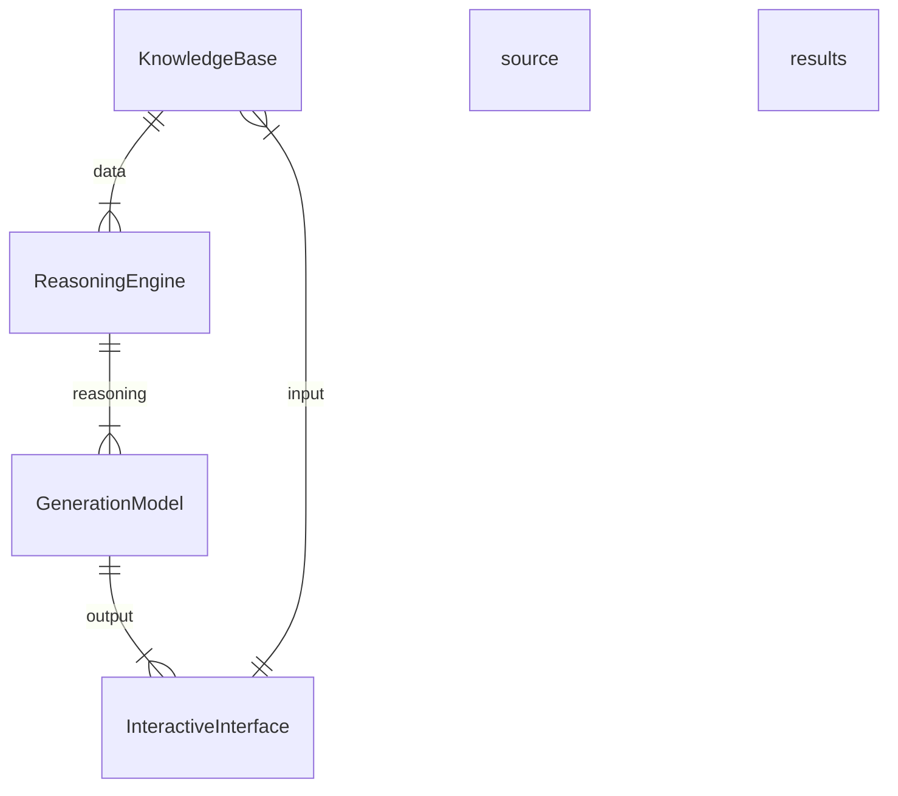
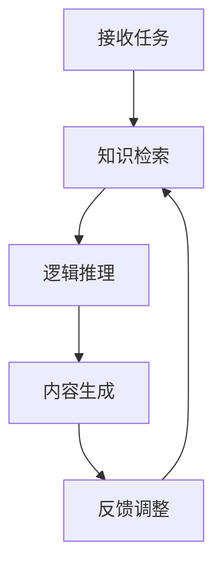

                 

### 第一部分：引言

## 第1章：问题背景与核心概念介绍

### 1.1 问题背景

在当前飞速发展的信息时代，人工智能（AI）技术已经深入到我们生活的方方面面。从自动驾驶汽车到智能语音助手，从推荐系统到图像识别，AI技术的应用无处不在。然而，随着创作领域的不断拓展，如何利用AI技术提高创作效率和质量成为一个亟待解决的问题。

创作领域涵盖了文学、艺术、设计、音乐、影视等多个方面。尽管创作者们的才华横溢，但创作过程往往耗时耗力，且难以达到预期效果。例如，在文学创作中，作者需要从无数个想法中筛选出最适合的情节和角色；在艺术创作中，设计师需要耗费大量时间进行创意构思和图案设计；在音乐创作中，作曲家需要不断试错来寻找最佳的旋律和和弦。这些问题不仅降低了创作效率，还限制了创作者的发挥空间。

为了解决这些创作过程中的痛点，AI技术的应用逐渐成为一种趋势。通过学习和模拟人类思维过程，AI可以帮助创作者更好地进行创作。然而，现有的AI技术大多集中在特定领域的应用，如文本生成、图像识别、音频处理等。这些技术虽然在一定程度上提高了创作效率，但缺乏对创作整体流程的全面支持和理解。因此，一种能够整合多种AI技术，辅助创作者进行全方位创作的智能系统变得尤为必要。

### 1.2 核心概念与联系

#### 1.2.1 思维链的定义

思维链是一种基于人工智能技术的智能辅助系统，旨在通过模拟人类思维过程，帮助创作者提高创作效率和质量。思维链的核心特点在于其能够整合多种AI技术，形成一个协同工作的智能系统。具体来说，思维链包括以下几个关键组成部分：

1. **知识库**：思维链的知识库包含了大量与创作相关的知识和信息，如文学知识、设计原则、音乐理论等。这些知识为创作提供了丰富的素材和灵感。
2. **推理引擎**：推理引擎负责根据创作者的需求，从知识库中检索相关信息，并进行逻辑推理，生成创作方案。
3. **生成模型**：生成模型负责根据推理结果，生成具体的创作内容，如文本、图像、音乐等。
4. **交互界面**：交互界面用于创作者与思维链之间的沟通，创作者可以通过交互界面提出需求，查看生成的内容，并进行反馈。

#### 1.2.2 思维链的核心特点

1. **整合多种AI技术**：思维链能够整合多种AI技术，如自然语言处理、图像识别、音频处理等，形成一个协同工作的智能系统，从而实现对创作整体流程的全面支持。
2. **模拟人类思维过程**：思维链通过模拟人类思维过程，帮助创作者更好地理解和表达自己的想法，从而提高创作质量。
3. **智能化推荐**：思维链可以根据创作者的历史创作数据和偏好，提供个性化的创作建议和灵感，从而提高创作效率。

#### 1.2.3 思维链与其他AI技术的联系

1. **自然语言处理**：自然语言处理技术负责处理文本数据，包括文本生成、文本分类、情感分析等。思维链可以利用自然语言处理技术来生成文本内容，如小说、诗歌、剧本等。
2. **图像识别**：图像识别技术负责处理图像数据，包括图像生成、图像分类、目标检测等。思维链可以利用图像识别技术来生成图像内容，如插画、设计图案等。
3. **音频处理**：音频处理技术负责处理音频数据，包括音频生成、音频分类、音乐生成等。思维链可以利用音频处理技术来生成音频内容，如音乐、声音效果等。

通过整合这些AI技术，思维链能够为创作者提供一个全方位的智能辅助平台，帮助创作者突破创作过程中的瓶颈，实现更加高效和高质量的创作。

### 1.3 思维链在AI辅助创作中的应用

随着AI技术的不断发展，思维链在AI辅助创作中的应用前景广阔。首先，在文学创作中，思维链可以通过自然语言处理技术生成故事情节、角色描述等，帮助作家快速构建一个完整的作品框架。其次，在艺术创作中，思维链可以利用图像识别和生成技术生成设计方案、插画等，为设计师提供灵感和参考。最后，在音乐创作中，思维链可以通过音频处理技术生成旋律、和弦等，帮助作曲家创作出优美的音乐作品。

思维链在AI辅助创作中的应用不仅提高了创作效率，还丰富了创作形式，为创作者提供了更多可能性。在未来，随着AI技术的进一步发展，思维链的应用将更加广泛，为创作者带来更多便利和灵感。

### 摘要

本文主要探讨了思维链在AI辅助创作中的应用与前景。首先，介绍了创作领域对AI技术的需求，以及思维链作为一种整合多种AI技术的智能辅助系统的核心概念与特点。接着，详细分析了思维链的理论基础，包括概念结构、算法原理和数学模型。随后，本文分章节介绍了思维链在文本创作、图像创作和音频创作中的应用实例，展示了其在提高创作效率和质量方面的优势。最后，探讨了思维链的发展前景与应用挑战，并提出了相应的对策和建议。本文旨在为创作者提供一种全新的创作思路和方法，帮助他们在AI技术的辅助下实现更高水平的创作。

## 第二部分：思维链的理论基础

### 第2章：思维链的理论基础

思维链作为一种智能辅助系统，其理论基础涵盖了概念结构、算法原理、数学模型以及具体的实例。本章节将深入探讨这些核心组成部分，以帮助读者全面理解思维链的工作原理和应用价值。

#### 2.1 概念结构

思维链的概念结构是理解其工作机制的基础。该结构主要由以下几个核心组件构成：

1. **知识库**：知识库是思维链的大脑，包含了与创作相关的各种知识和信息。这些知识可以来源于各类文献、数据库、网络资源等。知识库中的信息需要经过预处理，以便思维链能够高效地检索和使用。

2. **推理引擎**：推理引擎是思维链的核心组件，负责根据创作者的需求，从知识库中检索相关信息，并进行逻辑推理。推理过程通常包括模式匹配、知识推理、冲突解决等步骤。

3. **生成模型**：生成模型负责将推理结果转化为具体的创作内容。这些模型可以是基于深度学习的自然语言生成模型、图像生成模型或音频生成模型。生成模型需要具备较高的生成质量和多样性，以满足创作者的需求。

4. **交互界面**：交互界面是创作者与思维链之间的桥梁，通过图形用户界面（GUI）或命令行界面（CLI），创作者可以提交创作任务，查看生成内容，并进行反馈。

以下是一个简单的ER实体关系图架构，展示了思维链的主要组件及其相互关系：



#### 2.2 算法原理讲解

思维链的算法原理是其实际应用的核心。以下将详细介绍算法的mermaid流程图、Python源代码和数学模型。

##### 2.2.1 算法mermaid流程图

思维链的算法流程可以概括为以下几个步骤：

1. **接收任务**：交互界面接收创作者的初始创作任务。
2. **知识检索**：推理引擎从知识库中检索与任务相关的信息。
3. **逻辑推理**：推理引擎根据检索到的知识进行逻辑推理，生成初步的创作方案。
4. **内容生成**：生成模型根据推理结果生成具体的创作内容。
5. **反馈调整**：创作者查看生成内容，提出反馈，思维链根据反馈进行优化。

以下是一个简化的mermaid流程图：



##### 2.2.2 Python源代码与算法原理

为了更直观地理解思维链的算法原理，以下是一个简化的Python示例代码：

```python
# 思维链算法示例

# 初始化知识库、推理引擎和生成模型
knowledge_base = ...
reasoning_engine = ...
generation_model = ...

# 接收任务
task = interactive_interface.receive_task()

# 知识检索
relevant_knowledge = reasoning_engine检索知识库(task)

# 逻辑推理
creation_plan = reasoning_engine逻辑推理(relevant_knowledge)

# 内容生成
creation_content = generation_model生成内容(creation_plan)

# 反馈调整
feedback = interactive_interface获取反馈(creation_content)
creation_content = reasoning_engine优化内容(feedback)

# 输出最终结果
interactive_interface输出内容(creation_content)
```

##### 2.2.3 数学模型和公式

思维链的算法涉及到多种数学模型和公式，以下是一些关键的数学概念：

1. **知识库表示**：知识库中的信息通常使用语义网络、向量空间模型等表示。语义网络可以表示实体和关系，向量空间模型则可以将文本表示为高维向量。

2. **推理算法**：推理算法包括基于规则的推理、概率推理、模糊推理等。其中，概率推理常用贝叶斯网络表示，模糊推理常用模糊集合理论。

3. **生成模型**：生成模型如变分自编码器（VAE）、生成对抗网络（GAN）等，这些模型通过学习数据分布来生成新的数据。

以下是一个简单的数学公式示例，展示了如何使用贝叶斯网络进行推理：

$$
P(A|B) = \frac{P(B|A) \cdot P(A)}{P(B)}
$$

##### 2.2.4 举例说明

为了更好地理解思维链的工作原理，以下通过一个实际案例进行说明。

**案例**：假设创作者希望创作一篇以“人工智能”为主题的短篇小说。

1. **接收任务**：创作者通过交互界面提交任务，包括主题和基本情节要求。
2. **知识检索**：推理引擎从知识库中检索与“人工智能”相关的知识，如定义、应用、历史等。
3. **逻辑推理**：推理引擎根据检索到的知识，构建故事的基本框架，包括主人公、背景、冲突等。
4. **内容生成**：生成模型根据推理结果，生成短篇小说的文本内容。
5. **反馈调整**：创作者查看生成的文本，提出反馈，如修改情节细节、增加角色描写等。
6. **内容优化**：推理引擎根据反馈，进一步优化文本内容，直至创作者满意。

通过以上步骤，思维链成功辅助创作者完成了一篇高质量的短篇小说。

#### 2.3 举例说明

为了更直观地展示思维链的算法原理和应用，以下将通过一个具体的案例来详细阐述。

**案例背景**：某知名作家希望利用思维链系统创作一部以“未来城市”为主题的科幻小说。

**步骤一：任务接收**  
作家通过思维链的交互界面提交创作任务，包括主题“未来城市”、所需情节元素（如智能交通系统、智能建筑、虚拟现实等）以及创作风格（如科幻、悬疑等）。

**步骤二：知识库检索**  
思维链的推理引擎从知识库中检索与“未来城市”相关的信息，包括相关历史文献、科技进展、社会影响等。这些信息经过预处理后，形成了一个包含丰富知识点的数据库。

**步骤三：逻辑推理**  
推理引擎根据检索到的知识，结合作家的创作要求，构建了小说的基本框架。例如，推理过程可能包括以下步骤：

- 确定主要角色（如城市规划者、技术专家、普通市民等）。
- 设定故事背景（如未来的科技水平、社会状况等）。
- 设计主要情节（如智能交通系统引发的危机、智能建筑的安全隐患等）。

**步骤四：内容生成**  
生成模型根据逻辑推理的结果，生成具体的小说文本。在这一过程中，生成模型可能会利用自然语言处理技术，构建一系列连贯且具有创意的情节和对话。

**步骤五：反馈调整**  
作家查看初步生成的小说文本，根据个人喜好和创作意图，提出修改建议。例如，作家可能希望增加某个人物的复杂性，或者调整某个情节的发展节奏。

**步骤六：内容优化**  
思维链的推理引擎根据作家的反馈，对生成的文本内容进行优化。这可能涉及到调整角色设定、改进情节逻辑、优化文本风格等。

**最终输出**：经过多次迭代和优化，最终生成一部符合作家意图的科幻小说。这部小说不仅在内容上具有创新性，而且在逻辑和风格上达到了作家的预期。

通过这个案例，我们可以看到思维链如何通过一系列智能化的步骤，辅助创作者完成高质量的创作。这不仅提高了创作效率，还为创作者提供了更多的创作可能性。

### 总结

在本章节中，我们详细介绍了思维链的理论基础，包括其概念结构、算法原理、数学模型以及具体应用实例。通过这些内容，读者可以清晰地理解思维链如何通过整合多种AI技术，辅助创作者进行全方位的创作。思维链不仅提高了创作效率，还为创作者提供了更多的灵感和创意空间。在接下来的章节中，我们将进一步探讨思维链在实际应用中的具体表现，以及其在未来可能的发展方向。

## 第二部分：思维链在AI辅助创作中的应用

### 第3章：思维链在文本创作中的应用

文本创作是创作领域中的重要组成部分，涵盖了文学、新闻、广告、科技文章等多种形式。随着人工智能技术的发展，思维链在文本创作中的应用为创作者提供了新的工具和方法，极大地提高了创作效率和作品质量。本章节将探讨思维链在文本创作中的应用现状、优势以及具体实例。

#### 3.1 文本创作现状分析

在传统的文本创作过程中，创作者往往需要经过构思、撰写、修改等多个环节。这个过程不仅耗时，而且容易出现灵感枯竭或创作风格不统一的问题。此外，随着信息量的爆炸式增长，创作者在获取素材和灵感方面也面临着巨大的挑战。为了应对这些挑战，创作者们开始尝试使用各种辅助工具，如文本生成软件、写作助手等。

现有的文本生成工具主要基于自然语言处理（NLP）技术，如自动摘要、关键词提取、文本生成等。这些工具在一定程度上提高了文本创作的效率，但它们通常存在以下局限性：

1. **创作质量有限**：现有的文本生成工具往往依赖于模板和规则，生成的文本内容较为单调，缺乏个性化和创造性。
2. **缺乏上下文理解**：这些工具通常无法深入理解文本的上下文，导致生成的文本内容有时会与实际需求不符。
3. **创作过程被动**：创作者在使用这些工具时，往往处于被动地位，只能根据工具提供的模板进行创作，缺乏自主性。

#### 3.2 思维链在文本创作中的优势

思维链作为一种智能辅助系统，通过整合多种AI技术，能够为创作者提供更加全面和个性化的支持。以下是思维链在文本创作中的主要优势：

1. **整合多种AI技术**：思维链集成了自然语言处理、知识图谱、生成模型等多种AI技术，能够从多个维度对文本创作进行辅助，提高创作效率和质量。
2. **深度上下文理解**：思维链通过知识图谱和推理引擎，能够深入理解文本的上下文信息，生成与实际需求高度匹配的文本内容。
3. **个性化创作支持**：思维链可以根据创作者的历史创作数据和偏好，提供个性化的创作建议和灵感，帮助创作者发掘新的创作方向。
4. **主动创作模式**：思维链支持创作者主动参与创作过程，创作者可以通过交互界面与思维链进行互动，提出修改意见，优化生成的文本内容。

#### 3.3 应用实例介绍

为了更直观地展示思维链在文本创作中的应用，以下通过一个具体的实例进行说明。

**实例**：某知名作家希望通过思维链创作一部以“人工智能与人类关系”为主题的科幻小说。

**步骤一：任务接收**  
作家通过思维链的交互界面提交创作任务，包括主题“人工智能与人类关系”、所需情节元素（如人工智能的发展、人与机器的互动等）以及创作风格（如科幻、哲学等）。

**步骤二：知识库检索**  
思维链的推理引擎从知识库中检索与“人工智能与人类关系”相关的信息，包括历史文献、科技进展、社会影响、哲学探讨等。这些信息经过预处理后，形成了一个包含丰富知识点的数据库。

**步骤三：逻辑推理**  
推理引擎根据检索到的知识，结合作家的创作要求，构建了小说的基本框架。例如，推理过程可能包括以下步骤：

- 确定主要角色（如人工智能开发者、普通用户、政府官员等）。
- 设定故事背景（如人工智能技术的高速发展、人类对机器的依赖等）。
- 设计主要情节（如人工智能带来的伦理问题、人与机器的竞争与合作等）。

**步骤四：内容生成**  
生成模型根据逻辑推理的结果，生成具体的小说文本。在这一过程中，生成模型可能会利用自然语言处理技术，构建一系列连贯且具有创意的情节和对话。

**步骤五：反馈调整**  
作家查看初步生成的小说文本，根据个人喜好和创作意图，提出修改建议。例如，作家可能希望增加某个人物的复杂性，或者调整某个情节的发展节奏。

**步骤六：内容优化**  
思维链的推理引擎根据作家的反馈，对生成的文本内容进行优化。这可能涉及到调整角色设定、改进情节逻辑、优化文本风格等。

**最终输出**：经过多次迭代和优化，最终生成一部符合作家意图的科幻小说。这部小说不仅在内容上具有创新性，而且在逻辑和风格上达到了作家的预期。

通过这个实例，我们可以看到思维链如何通过一系列智能化的步骤，辅助创作者完成高质量的文本创作。这不仅提高了创作效率，还为创作者提供了更多的创作可能性。

### 总结

在本章节中，我们详细介绍了思维链在文本创作中的应用现状、优势和具体实例。通过整合多种AI技术，思维链能够为创作者提供深度上下文理解、个性化创作支持和主动创作模式，从而极大地提高了文本创作的效率和作品质量。在未来的创作过程中，思维链有望继续发挥其优势，为创作者带来更多的便利和灵感。

## 第三部分：思维链在AI辅助创作中的应用

### 第4章：思维链在图像创作中的应用

图像创作是艺术和设计领域的重要组成部分，涵盖了绘画、设计、摄影等多个方面。随着人工智能技术的不断发展，思维链在图像创作中的应用为创作者提供了新的工具和方法，使得图像创作过程更加高效和多样化。本章节将探讨思维链在图像创作中的应用现状、优势以及具体实例。

#### 4.1 图像创作现状分析

在传统的图像创作过程中，创作者需要经过构思、绘制、修改等多个环节。这个过程不仅耗时，而且容易受到个人经验和技巧的限制。此外，随着图像处理技术的进步，创作者在获取素材和灵感方面也面临着新的挑战。为了应对这些挑战，创作者们开始尝试使用各种辅助工具，如图像生成软件、设计助手等。

现有的图像生成工具主要基于计算机视觉和生成对抗网络（GAN）技术，如图像风格转换、超分辨率、图像修复等。这些工具在一定程度上提高了图像创作的效率，但它们通常存在以下局限性：

1. **创作风格单一**：现有的图像生成工具往往依赖于特定的算法和模型，生成的图像风格较为单调，难以满足个性化需求。
2. **缺乏创意支持**：这些工具通常无法为创作者提供丰富的创意支持，创作者需要依靠自己的经验和灵感进行创作。
3. **交互性不足**：创作者在使用这些工具时，往往处于被动地位，只能根据工具提供的模板进行创作，缺乏自主性。

#### 4.2 思维链在图像创作中的优势

思维链作为一种智能辅助系统，通过整合多种AI技术，能够为创作者提供更加全面和个性化的支持。以下是思维链在图像创作中的主要优势：

1. **整合多种AI技术**：思维链集成了计算机视觉、自然语言处理、生成模型等多种AI技术，能够从多个维度对图像创作进行辅助，提高创作效率和质量。
2. **创意生成支持**：思维链通过深度学习和知识图谱，能够为创作者提供丰富的创意支持，帮助创作者发现新的创作方向。
3. **个性化创作支持**：思维链可以根据创作者的历史创作数据和偏好，提供个性化的创作建议和灵感，帮助创作者发掘新的创意。
4. **主动创作模式**：思维链支持创作者主动参与创作过程，创作者可以通过交互界面与思维链进行互动，提出修改意见，优化生成的图像内容。

#### 4.3 应用实例介绍

为了更直观地展示思维链在图像创作中的应用，以下通过一个具体的实例进行说明。

**实例**：某知名艺术家希望通过思维链创作一幅以“未来城市”为主题的抽象画作。

**步骤一：任务接收**  
艺术家通过思维链的交互界面提交创作任务，包括主题“未来城市”、所需元素（如高楼大厦、智能交通、绿色能源等）以及创作风格（如抽象、色彩丰富等）。

**步骤二：素材检索**  
思维链的推理引擎从图像数据库中检索与“未来城市”相关的素材，包括建筑物、交通设施、自然景观等。这些素材经过预处理后，形成了一个包含丰富视觉元素的素材库。

**步骤三：创意生成**  
生成模型根据推理引擎提供的素材和艺术家的创作要求，生成初步的图像草图。生成模型利用深度学习技术，尝试将不同的视觉元素进行组合，创造出独特的视觉效果。

**步骤四：反馈调整**  
艺术家查看初步生成的图像草图，根据个人喜好和创作意图，提出修改建议。例如，艺术家可能希望调整某些建筑物的高度、改变某些颜色的饱和度等。

**步骤五：图像优化**  
思维链的推理引擎根据艺术家的反馈，对生成的图像内容进行优化。这可能涉及到调整图像的构图、颜色搭配、光影效果等，以符合艺术家的创作要求。

**最终输出**：经过多次迭代和优化，最终生成一幅符合艺术家意图的抽象画作。这幅画作不仅在视觉效果上具有创新性，而且在艺术风格上达到了艺术家的预期。

通过这个实例，我们可以看到思维链如何通过一系列智能化的步骤，辅助创作者完成高质量的图像创作。这不仅提高了创作效率，还为创作者提供了更多的创作可能性。

### 总结

在本章节中，我们详细介绍了思维链在图像创作中的应用现状、优势和具体实例。通过整合多种AI技术，思维链能够为创作者提供丰富的创意支持、个性化创作建议和主动创作模式，从而极大地提高了图像创作的效率和作品质量。在未来的创作过程中，思维链有望继续发挥其优势，为创作者带来更多的便利和灵感。

## 第四部分：思维链在AI辅助创作中的应用

### 第5章：思维链在音频创作中的应用

音频创作涵盖了音乐、声音设计、播客制作等多个领域，是现代多媒体艺术的重要组成部分。随着人工智能技术的不断进步，思维链在音频创作中的应用逐渐显现出其独特的优势，为创作者提供了全新的创作工具和方法。本章节将探讨思维链在音频创作中的应用现状、优势以及具体实例。

#### 5.1 音频创作现状分析

在传统的音频创作过程中，创作者通常需要经历音乐创作、音效设计、录音、编辑等多个环节。这个过程不仅需要大量的时间和精力，而且对于创作者的技能要求较高。此外，随着市场需求的变化，创作者需要不断适应新的创作风格和技术要求，这给创作带来了很大的挑战。为了应对这些挑战，创作者们开始探索各种辅助工具，如音频生成软件、自动化混音工具等。

现有的音频生成工具主要基于深度学习技术，如自动音乐生成、声音合成、音频编辑等。这些工具在一定程度上提高了音频创作的效率，但它们通常存在以下局限性：

1. **创作风格单一**：现有的音频生成工具往往依赖于特定的算法和模型，生成的音频内容风格较为单调，难以满足个性化需求。
2. **缺乏创意支持**：这些工具通常无法为创作者提供丰富的创意支持，创作者需要依靠自己的经验和灵感进行创作。
3. **交互性不足**：创作者在使用这些工具时，往往处于被动地位，只能根据工具提供的模板进行创作，缺乏自主性。

#### 5.2 思维链在音频创作中的优势

思维链作为一种智能辅助系统，通过整合多种AI技术，能够为创作者提供更加全面和个性化的支持。以下是思维链在音频创作中的主要优势：

1. **整合多种AI技术**：思维链集成了自然语言处理、计算机视觉、音频处理等多种AI技术，能够从多个维度对音频创作进行辅助，提高创作效率和质量。
2. **创意生成支持**：思维链通过深度学习和知识图谱，能够为创作者提供丰富的创意支持，帮助创作者发现新的创作方向。
3. **个性化创作支持**：思维链可以根据创作者的历史创作数据和偏好，提供个性化的创作建议和灵感，帮助创作者发掘新的创意。
4. **主动创作模式**：思维链支持创作者主动参与创作过程，创作者可以通过交互界面与思维链进行互动，提出修改意见，优化生成的音频内容。

#### 5.3 应用实例介绍

为了更直观地展示思维链在音频创作中的应用，以下通过一个具体的实例进行说明。

**实例**：某知名音乐制作人希望通过思维链创作一首以“未来科技”为主题的音乐作品。

**步骤一：任务接收**    
音乐制作人通过思维链的交互界面提交创作任务，包括主题“未来科技”、所需元素（如电子合成器音色、未来感节奏等）以及音乐风格（如电子舞曲、科幻音乐等）。

**步骤二：素材检索**    
思维链的推理引擎从音乐数据库中检索与“未来科技”相关的素材，包括电子合成器音色、未来感节奏、科技背景音等。这些素材经过预处理后，形成了一个包含丰富音乐元素的素材库。

**步骤三：音乐生成**    
生成模型根据推理引擎提供的素材和音乐制作人的创作要求，生成初步的音乐片段。生成模型利用深度学习技术，尝试将不同的音乐元素进行组合，创造出独特的音乐风格。

**步骤四：反馈调整**    
音乐制作人查看初步生成的音乐片段，根据个人喜好和创作意图，提出修改建议。例如，音乐制作人可能希望调整某些音色的音调、改变某些节奏的快慢等。

**步骤五：音乐优化**    
思维链的推理引擎根据音乐制作人的反馈，对生成的音乐内容进行优化。这可能涉及到调整音乐的节奏、旋律、和声等，以符合音乐制作人的创作要求。

**最终输出**：经过多次迭代和优化，最终生成一首符合音乐制作人意图的“未来科技”主题音乐作品。这首音乐不仅在旋律和节奏上具有创新性，而且在音效设计上达到了音乐制作人的预期。

通过这个实例，我们可以看到思维链如何通过一系列智能化的步骤，辅助创作者完成高质量的音频创作。这不仅提高了创作效率，还为创作者提供了更多的创作可能性。

### 总结

在本章节中，我们详细介绍了思维链在音频创作中的应用现状、优势和具体实例。通过整合多种AI技术，思维链能够为创作者提供丰富的创意支持、个性化创作建议和主动创作模式，从而极大地提高了音频创作的效率和作品质量。在未来的创作过程中，思维链有望继续发挥其优势，为创作者带来更多的便利和灵感。

## 第五部分：思维链的前景与应用挑战

### 第6章：思维链的发展前景

随着人工智能技术的不断发展，思维链作为一种综合性的智能辅助系统，在创作领域的应用前景广阔。本章节将探讨思维链的技术发展趋势、应用前景以及未来的发展方向。

#### 6.1 技术发展趋势

1. **AI技术的融合**：未来的思维链将更加注重AI技术的融合，包括自然语言处理、计算机视觉、音频处理、知识图谱等。这种多技术的融合将使思维链能够更全面、更准确地辅助创作。
2. **智能推理能力的提升**：随着算法的进步，思维链的智能推理能力将得到显著提升。未来的思维链将能够通过更复杂的逻辑推理和知识整合，为创作者提供更精准的创作建议。
3. **个性化定制能力的增强**：随着对用户数据理解的加深，思维链将能够根据创作者的历史创作数据和偏好，提供更加个性化的创作支持和灵感。

#### 6.2 应用前景分析

1. **文学创作**：思维链在文学创作中的应用前景十分广阔。未来，思维链可以通过自然语言处理技术，生成更加丰富多样、风格独特的文学作品。
2. **艺术设计**：在艺术设计领域，思维链可以通过计算机视觉技术，生成具有创新性的设计图案和视觉效果，为设计师提供灵感。
3. **音乐创作**：思维链在音乐创作中的应用潜力巨大。未来，思维链可以通过音频处理技术，生成各种风格的音乐作品，甚至帮助作曲家进行复杂的音乐编排和混音。

#### 6.3 未来的发展方向

1. **跨领域应用**：思维链未来将朝着跨领域应用发展，不仅限于文学、艺术、音乐等单一领域，还将拓展到电影制作、游戏设计等更广泛的领域。
2. **交互体验优化**：未来的思维链将更加注重用户交互体验的优化，通过更加人性化的界面设计，使创作者能够更加便捷地使用思维链进行创作。
3. **智能协作**：思维链将与其他智能系统（如虚拟助手、智能硬件等）实现智能协作，为创作者提供全方位的智能辅助。

### 第7章：思维链的应用挑战与对策

尽管思维链在AI辅助创作中展现了巨大的潜力，但在实际应用过程中仍然面临一系列挑战。本章节将探讨思维链在应用过程中遇到的技术挑战和应用挑战，并提出相应的对策和建议。

#### 7.1 技术挑战

1. **算法复杂度**：思维链涉及的算法复杂度较高，包括自然语言处理、计算机视觉、音频处理等多个领域的算法。未来需要进一步优化算法，提高计算效率和准确性。
2. **数据质量**：思维链的性能依赖于高质量的数据集。未来需要建立更加完善的数据采集和处理机制，确保数据的质量和多样性。
3. **隐私保护**：在用户数据收集和处理过程中，隐私保护是一个重要问题。未来需要在数据安全和隐私保护方面做出更多的努力，确保用户数据的隐私和安全。

#### 7.2 应用挑战

1. **创作自主性**：思维链在辅助创作过程中，可能会限制创作者的自主性。未来需要设计更加灵活的交互界面，使创作者能够在使用思维链的同时保持创作的主导权。
2. **创意多样性**：思维链在生成内容时，可能会出现创意多样性不足的问题。未来需要通过改进算法和模型，提高生成的创意多样性和新颖性。
3. **应用推广**：思维链在市场推广和应用普及过程中，可能会面临用户接受度不高、市场竞争激烈等问题。未来需要通过市场调研、用户反馈等方式，不断优化产品，提高用户满意度。

#### 7.3 对策与建议

1. **技术优化**：持续优化思维链的算法和模型，提高计算效率和准确性，确保系统能够稳定、高效地运行。
2. **数据管理**：建立健全的数据管理机制，确保数据的质量和多样性，同时加强数据隐私保护措施，保障用户权益。
3. **用户体验**：设计人性化的交互界面，提高用户体验，使创作者能够更加便捷地使用思维链进行创作。
4. **市场推广**：通过市场调研、用户反馈等方式，不断优化产品，提高用户满意度，同时加大市场推广力度，扩大用户基础。

### 总结

在本章节中，我们探讨了思维链的发展前景和应用挑战。随着AI技术的不断进步，思维链在创作领域的应用前景广阔。然而，在实际应用过程中，思维链仍然面临一系列技术挑战和应用挑战。通过持续的技术优化、数据管理和用户体验优化，思维链有望克服这些挑战，为创作者提供更加全面和高效的辅助。在未来的发展中，思维链将继续发挥其优势，为创作者带来更多的便利和灵感。

### 第8章：总结与展望

#### 8.1 思维链的重要性

思维链作为一种综合性的智能辅助系统，在AI辅助创作中具有至关重要的作用。通过整合自然语言处理、计算机视觉、音频处理等多种AI技术，思维链为创作者提供了深度上下文理解、个性化创作支持和主动创作模式，从而极大地提高了创作效率和作品质量。思维链不仅能够帮助创作者突破创作过程中的瓶颈，还能为他们提供丰富的创意资源和灵感，使创作过程更加高效和愉悦。

#### 8.2 未来的发展方向

未来，思维链的发展方向主要集中在以下几个方面：

1. **跨领域应用**：思维链将不仅仅局限于文学、艺术、音乐等单一领域，还将拓展到电影制作、游戏设计等更广泛的领域，为更多创作者提供智能辅助。
2. **交互体验优化**：思维链将继续优化用户交互体验，通过更加人性化的界面设计，使创作者能够更加便捷地使用系统，实现与AI的智能协作。
3. **算法优化**：持续优化思维链的算法和模型，提高计算效率和准确性，确保系统能够稳定、高效地运行，为创作者提供更加精准和多样化的创作支持。

#### 8.3 对创作者的启示

思维链的出现为创作者提供了全新的创作工具和方法，以下是对创作者的几点启示：

1. **拥抱新技术**：创作者应积极拥抱AI技术，了解并掌握思维链等智能辅助系统，以提高创作效率和质量。
2. **保持创造力**：尽管思维链提供了丰富的创意资源和灵感，但创作者仍需保持自身的创造力，结合AI辅助，实现更具个性化和创新性的作品。
3. **持续学习**：随着AI技术的不断发展，创作者需要不断学习新的知识和技能，以适应不断变化的技术环境，发挥思维链的最大潜力。

#### 总结

思维链在AI辅助创作中具有重要作用，为创作者提供了深度上下文理解、个性化创作支持和主动创作模式。未来，思维链将继续拓展应用领域，优化交互体验和算法，为创作者带来更多便利和灵感。创作者应积极拥抱新技术，保持创造力，持续学习，以充分发挥思维链的优势，实现更高水平的创作。

### 附录

#### 8.4 拓展阅读

1. **《深度学习》**：作者：伊恩·古德费洛、约书亚·本吉奥、亚伦·库维尔。本书详细介绍了深度学习的基本原理和应用，对理解思维链的算法和模型具有重要意义。
2. **《生成对抗网络》**：作者：伊恩·古德费洛。本书深入探讨了生成对抗网络（GAN）的基本原理和应用，是理解思维链生成模型的重要参考书籍。
3. **《自然语言处理综论》**：作者：丹·布尔斯玛、克里斯·比松。本书涵盖了自然语言处理的基本概念和技术，对理解思维链的自然语言处理部分具有指导意义。

### 作者信息

**作者：AI天才研究院/AI Genius Institute & 禅与计算机程序设计艺术 /Zen And The Art of Computer Programming**

