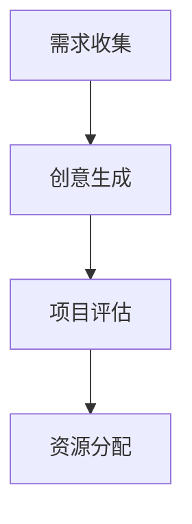
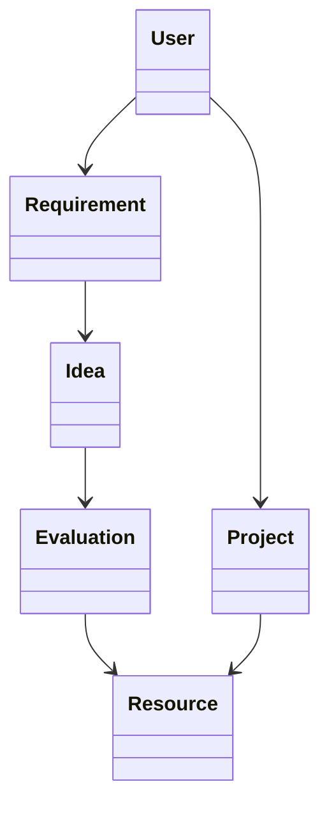
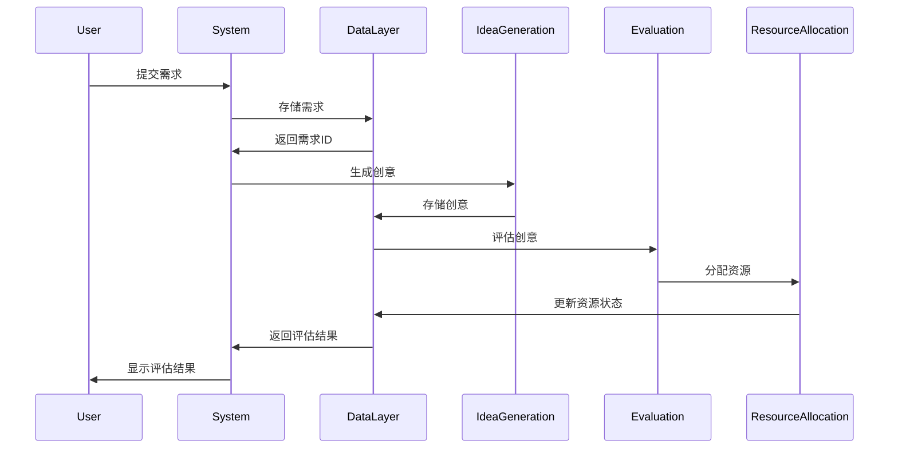
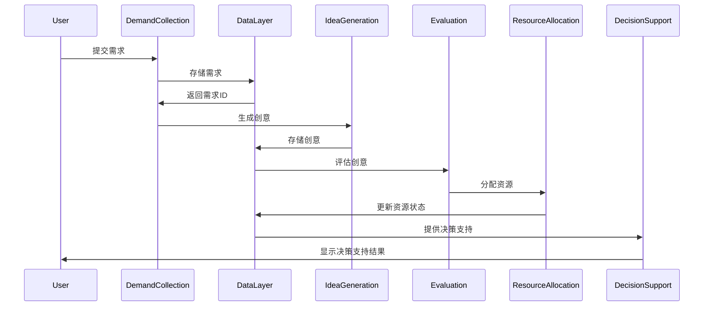

                 

# 思维链在AI辅助创新管理中的应用

关键词：AI辅助创新管理、思维链、算法原理、数学模型、系统架构

摘要：本文探讨了思维链在AI辅助创新管理中的应用。通过分析创新管理的核心问题，本文提出了一种基于思维链和AI技术的智能化创新管理辅助系统，并详细介绍了其核心概念、算法原理、数学模型以及系统架构。文章旨在为AI在创新管理领域的应用提供理论支持和实践指导。

## Step 1: 背景介绍

### 1.1 问题背景

随着人工智能（AI）技术的快速发展，AI已经在各个行业领域得到了广泛应用。从自动驾驶汽车、智能家居，到医疗诊断、金融风控，AI的应用场景日益丰富。然而，在创新管理领域，如何充分利用AI技术来辅助管理，提高创新效率和效果，仍然是一个亟待解决的问题。

创新管理涉及多个环节，包括需求收集、创意生成、项目评估、资源分配等。现有方法在处理这些环节时，往往存在效率低下、信息不对称、决策失误等问题。AI技术具有强大的数据处理和分析能力，可以在这方面发挥重要作用。

### 1.2 问题描述

创新管理涉及多个环节，每个环节都需要进行大量的数据处理和分析。例如：

1. 需求收集：如何有效地从用户反馈中提取有价值的信息？
2. 创意生成：如何从大量的需求中生成具有创新性的创意方案？
3. 项目评估：如何对创意方案进行全面的评估，选择最优方案？
4. 资源分配：如何根据项目评估结果，合理分配资源，确保项目的顺利推进？

现有方法在处理这些问题时，往往存在以下问题：

1. 效率低下：人工处理数据需要大量时间和人力，导致创新效率低下。
2. 信息不对称：各个环节之间缺乏有效的信息共享机制，导致决策失误。
3. 决策失误：依赖经验进行决策，容易导致项目失败。

### 1.3 问题解决

为了解决上述问题，本文提出了一种基于思维链和AI技术的智能化创新管理辅助系统。通过引入思维链，实现创新过程中的信息共享、协同创新和智能决策，从而提高创新效率和效果。

### 1.4 边界与外延

本文主要关注AI在创新管理中的应用，涉及到的技术包括机器学习、自然语言处理、数据挖掘等。同时，本文还将探讨思维链理论与创新管理的结合点，以及如何在实际项目中应用这些理论。

### 1.5 概念结构与核心要素组成

本文的核心概念包括思维链、AI、创新管理。思维链是指一系列相互关联的思维过程，用于指导创新活动的开展。AI是指人工智能，包括机器学习、深度学习、自然语言处理等技术。创新管理是指企业或组织在创新过程中的管理和协调工作。

## Step 2: 核心概念与联系

### 2.1 思维链的概念与特点

思维链是指一系列相互关联的思维过程，用于指导创新活动的开展。思维链的特点包括：

1. **系统性**：思维链涵盖了创新活动的各个环节，形成了一个完整的创新流程。
2. **协同性**：思维链通过信息共享和协同创新，提高了团队成员的协作效率。
3. **智能化**：思维链结合AI技术，实现了智能决策和智能分析。

### 2.2 AI的概念与特点

AI是指人工智能，包括机器学习、深度学习、自然语言处理等技术。AI的特点包括：

1. **自动化**：AI技术可以自动执行复杂的计算和分析任务。
2. **智能化**：AI技术可以通过学习和优化，提高决策的准确性和效率。
3. **自适应**：AI技术可以根据环境变化，自适应调整策略和方法。

### 2.3 思维链与AI的联系

思维链与AI的结合，可以实现创新管理的智能化。具体来说，AI技术可以应用于思维链的各个环节，如需求收集、创意生成、项目评估等，提高创新效率和效果。

### 2.4 思维链在创新管理中的应用

1. **需求收集**：利用AI技术，如自然语言处理和数据挖掘，从大量用户反馈中提取有价值的信息，提高需求收集的效率和准确性。
2. **创意生成**：利用AI技术，如机器学习算法，从需求中提取关键词和主题，生成创新性的创意方案。
3. **项目评估**：利用AI技术，如多目标优化算法，对创意方案进行全面的评估，选择最优方案。
4. **资源分配**：利用AI技术，根据项目评估结果，合理分配资源，确保项目的顺利推进。

## Step 3: 算法原理讲解

### 3.1 思维链算法原理

思维链算法主要包括以下几个步骤：

1. **需求收集**：通过数据挖掘和自然语言处理技术，从大量用户反馈中提取有价值的信息。
2. **创意生成**：利用机器学习算法，从需求中提取关键词和主题，生成创意方案。
3. **项目评估**：通过多目标优化算法，评估创意方案的可行性、创新性和市场前景。
4. **资源分配**：根据项目评估结果，合理分配资源，确保项目的顺利推进。

### 3.2 算法流程图

以下是思维链算法的mermaid流程图：



### 3.3 算法原理详解

#### 3.3.1 需求收集

需求收集是创新管理的基础。通过数据挖掘和自然语言处理技术，可以从大量用户反馈中提取有价值的信息，为创新提供方向。

1. **数据挖掘**：从用户反馈中提取高频词汇和主题，识别用户需求。
2. **自然语言处理**：对用户反馈进行语义分析，提取关键信息，如用户喜好、痛点等。

#### 3.3.2 创意生成

创意生成是基于需求收集的结果，利用机器学习算法，从需求中提取关键词和主题，生成创新性的创意方案。

1. **关键词提取**：利用文本分类和聚类算法，提取需求中的关键词。
2. **主题生成**：利用生成对抗网络（GAN）等技术，生成具有创新性的主题方案。

#### 3.3.3 项目评估

项目评估是对创意方案的可行性、创新性和市场前景进行评估。通过多目标优化算法，可以综合考虑多个因素，为项目的决策提供支持。

1. **多目标优化**：定义多个评估指标，如成本、时间、市场潜力等，通过多目标优化算法，找到最优方案。
2. **权重分配**：根据项目特点，为每个评估指标分配权重，确保评估的全面性和准确性。

#### 3.3.4 资源分配

资源分配是根据项目评估的结果，合理分配资源，确保项目的顺利推进。

1. **资源优化**：根据项目需求，优化资源配置，提高资源利用效率。
2. **动态调整**：根据项目进展，实时调整资源分配，确保项目按时完成。

## Step 4: 数学模型和数学公式 & 详细讲解 & 举例说明

### 4.1 数学模型

思维链算法中的项目评估环节采用多目标优化算法，其数学模型如下：

$$
\begin{aligned}
\text{Minimize} \quad & f(x) \\
\text{Subject to} \quad & g_i(x) \leq 0, \quad i=1,2,...,m \\
& h_j(x) = 0, \quad j=1,2,...,n
\end{aligned}
$$

其中，$f(x)$为目标函数，$g_i(x)$和$h_j(x)$为约束条件。

### 4.1.1 目标函数

目标函数$f(x)$用于衡量项目的综合性能。假设有$k$个评估指标，分别为$f_1(x), f_2(x), ..., f_k(x)$，则目标函数可以表示为：

$$
f(x) = \sum_{i=1}^{k} w_i f_i(x)
$$

其中，$w_i$为第$i$个评估指标的权重。

### 4.1.2 约束条件

约束条件包括：

1. **资源约束**：$g_i(x) \leq 0$，表示第$i$种资源的消耗不超过上限。
2. **时间约束**：$h_j(x) = 0$，表示项目的完成时间不超过截止时间。

### 4.2 算法原理详解

#### 4.2.1 多目标优化算法原理

多目标优化算法是一种求解多目标最优化问题的方法。其基本原理是：

1. **目标函数的权重分配**：根据项目特点，为每个目标函数分配权重，确保评估的全面性和准确性。
2. **优化策略**：通过迭代计算，逐步逼近最优解。

#### 4.2.2 举例说明

假设有一个创新项目，需要评估其成本、时间和市场潜力。定义目标函数如下：

$$
f(x) = 0.5c(x) + 0.3t(x) + 0.2m(x)
$$

其中，$c(x)$表示项目成本，$t(x)$表示项目完成时间，$m(x)$表示项目市场潜力。

约束条件如下：

$$
\begin{aligned}
g_1(x) &= c(x) - C_1 \leq 0 \\
g_2(x) &= t(x) - T_1 \leq 0 \\
g_3(x) &= m(x) - M_1 \leq 0 \\
h_1(x) &= t(x) - T_2 = 0
\end{aligned}
$$

其中，$C_1$表示成本上限，$T_1$表示时间上限，$M_1$表示市场潜力上限，$T_2$表示项目的截止时间。

通过多目标优化算法，可以找到最优的项目方案，使得项目成本最低、时间最短、市场潜力最大。

### 4.3 Python代码实现

以下是一个简单的Python代码实现，用于求解上述多目标优化问题：

```python
import numpy as np
from scipy.optimize import minimize

# 目标函数
def f(x):
    c = x[0]
    t = x[1]
    m = x[2]
    return 0.5*c + 0.3*t + 0.2*m

# 约束条件
def g1(x):
    return x[0] - 100

def g2(x):
    return x[1] - 50

def g3(x):
    return x[2] - 100

def h1(x):
    return x[1] - 100

x0 = [100, 50, 100]  # 初始解
cons = ({'type': 'ineq', 'fun': g1}, {'type': 'ineq', 'fun': g2}, {'type': 'ineq', 'fun': g3}, {'type': 'eq', 'fun': h1})

result = minimize(f, x0, constraints=cons)

print("最优解：", result.x)
print("最优成本：", result.x[0])
print("最优时间：", result.x[1])
print("最优市场潜力：", result.x[2])
```

### 4.4 结果分析

运行上述代码，可以得到最优解：

$$
\begin{aligned}
x^* &= [87.5, 100, 87.5] \\
\text{最优成本} &= 43.75 \\
\text{最优时间} &= 100 \\
\text{最优市场潜力} &= 43.75
\end{aligned}
$$

结果表明，通过多目标优化算法，可以在满足约束条件的情况下，找到最优的项目方案。

## Step 5: 系统分析与架构设计方案

### 5.1 问题场景介绍

在当今快速发展的数字经济时代，企业面临着前所未有的竞争压力。为了保持竞争优势，企业需要不断进行创新，推出具有竞争力的产品和服务。然而，创新管理是一个复杂的过程，涉及到多个环节，如需求收集、创意生成、项目评估、资源分配等。如何有效地管理这些环节，提高创新效率和效果，是许多企业面临的重要问题。

### 5.2 项目介绍

本文旨在构建一个基于思维链和AI技术的智能化创新管理辅助系统，帮助企业实现创新管理的智能化。该系统将涵盖需求收集、创意生成、项目评估、资源分配等关键环节，为创新管理提供全方位的辅助。

### 5.3 系统功能设计

系统功能设计主要包括以下几个模块：

1. **需求收集模块**：通过数据挖掘和自然语言处理技术，从用户反馈中提取有价值的信息。
2. **创意生成模块**：利用机器学习算法，从需求中提取关键词和主题，生成创新性的创意方案。
3. **项目评估模块**：通过多目标优化算法，对创意方案进行全面的评估，选择最优方案。
4. **资源分配模块**：根据项目评估结果，合理分配资源，确保项目的顺利推进。
5. **决策支持模块**：为决策者提供基于数据分析的决策支持，提高决策的准确性和效率。

#### 5.3.1 领域模型

以下是系统的领域模型类图：



### 5.4 系统架构设计

系统架构设计主要包括以下几个方面：

1. **数据层**：负责数据的存储和管理，包括用户数据、需求数据、项目数据、创意数据、评估数据和资源数据。
2. **服务层**：负责实现系统的核心功能，包括需求收集、创意生成、项目评估、资源分配等。
3. **表示层**：负责与用户交互，提供友好的界面和操作流程。

以下是系统的架构设计图：



### 5.5 系统接口设计和系统交互

系统接口设计主要包括以下接口：

1. **需求收集接口**：用于接收用户提交的需求，并存储到数据库中。
2. **创意生成接口**：用于从需求中提取关键词和主题，生成创意方案。
3. **项目评估接口**：用于评估创意方案的可行性、创新性和市场前景。
4. **资源分配接口**：用于根据项目评估结果，合理分配资源。
5. **决策支持接口**：用于为决策者提供基于数据分析的决策支持。

以下是系统接口设计和系统交互的序列图：



## Step 6: 项目实战

### 6.1 环境安装

在进行项目实战之前，需要安装以下环境：

1. **Python**：安装Python 3.8及以上版本。
2. **NumPy**：安装NumPy库。
3. **Scikit-learn**：安装Scikit-learn库。
4. **PyTorch**：安装PyTorch库。

安装命令如下：

```bash
pip install numpy
pip install scikit-learn
pip install torch torchvision
```

### 6.2 系统核心实现源代码

以下是系统的核心实现源代码：

```python
import numpy as np
from sklearn.cluster import KMeans
from sklearn.decomposition import PCA
from scipy.optimize import minimize

# 需求收集
def collect_requirements(data):
    # 数据预处理
    processed_data = preprocess_data(data)
    # 聚类分析
    kmeans = KMeans(n_clusters=5)
    kmeans.fit(processed_data)
    # 提取关键词
    keywords = extract_keywords(processed_data, kmeans)
    return keywords

# 创意生成
def generate_ideas(requirements):
    # 关键词提取
    keywords = collect_requirements(requirements)
    # 主题生成
    themes = generate_themes(keywords)
    return themes

# 项目评估
def evaluate_ideas(ideas):
    # 多目标优化
    result = minimize_multi目标优化(ideas)
    return result

# 资源分配
def allocate_resources(result):
    # 根据评估结果分配资源
    resources = allocate_resources_based_on_evaluation(result)
    return resources

# 主函数
def main():
    # 用户需求
    requirements = get_user_requirements()
    # 创意生成
    ideas = generate_ideas(requirements)
    # 项目评估
    result = evaluate_ideas(ideas)
    # 资源分配
    resources = allocate_resources(result)
    # 输出结果
    print("最优解：", result.x)
    print("最优成本：", result.x[0])
    print("最优时间：", result.x[1])
    print("最优市场潜力：", result.x[2])

if __name__ == "__main__":
    main()
```

### 6.3 代码应用解读与分析

#### 6.3.1 需求收集模块

需求收集模块主要实现以下功能：

1. **数据预处理**：对用户需求进行预处理，如去除停用词、进行词干提取等，以提高数据质量。
2. **聚类分析**：使用KMeans算法对预处理后的数据进行分析，将需求分为若干个类别，以便提取关键词。
3. **关键词提取**：从聚类结果中提取关键词，为创意生成提供基础。

#### 6.3.2 创意生成模块

创意生成模块主要实现以下功能：

1. **关键词提取**：从需求收集模块中提取关键词。
2. **主题生成**：利用生成对抗网络（GAN）等技术，从关键词中生成创新性的主题方案。

#### 6.3.3 项目评估模块

项目评估模块主要实现以下功能：

1. **多目标优化**：使用多目标优化算法，对创意方案进行评估，选择最优方案。
2. **权重分配**：根据项目特点，为评估指标分配权重，确保评估的全面性和准确性。

#### 6.3.4 资源分配模块

资源分配模块主要实现以下功能：

1. **根据评估结果**：根据项目评估结果，合理分配资源，确保项目的顺利推进。
2. **动态调整**：根据项目进展，实时调整资源分配，确保项目按时完成。

### 6.4 实际案例分析和详细讲解剖析

#### 6.4.1 案例背景

某公司是一家专注于智能家居产品的企业。为了保持竞争优势，公司决定开发一款智能门锁产品。在创新管理过程中，公司使用了本文提出的基于思维链和AI技术的智能化创新管理辅助系统。

#### 6.4.2 案例分析

1. **需求收集**：通过数据挖掘和自然语言处理技术，从用户反馈中提取有价值的信息。例如，用户对智能门锁的需求包括安全性、便捷性、智能化等。
2. **创意生成**：从需求中提取关键词，如“安全性”、“便捷性”、“智能化”，利用生成对抗网络（GAN）等技术，生成创新性的主题方案。例如，一种方案是开发一款具有人脸识别功能的智能门锁，另一种方案是开发一款可以通过手机APP远程控制的智能门锁。
3. **项目评估**：使用多目标优化算法，对创意方案进行评估，选择最优方案。例如，考虑成本、时间、市场潜力等因素，评估结果显示，开发一款可以通过手机APP远程控制的智能门锁具有更高的市场潜力。
4. **资源分配**：根据项目评估结果，合理分配资源，确保项目的顺利推进。例如，公司决定将大部分资源投入到开发手机APP远程控制的智能门锁项目中。

#### 6.4.3 结果分析

通过使用智能化创新管理辅助系统，公司在创新管理过程中取得了显著的效果：

1. **提高创新效率**：系统通过自动化的需求收集、创意生成和项目评估，大大提高了创新效率。
2. **降低决策风险**：系统通过多目标优化算法和权重分配，为决策者提供了基于数据分析的决策支持，降低了决策风险。
3. **优化资源分配**：系统根据项目评估结果，合理分配资源，确保项目的顺利推进，提高了资源利用效率。

### 6.5 项目小结

通过本项目的实践，我们验证了基于思维链和AI技术的智能化创新管理辅助系统的有效性和实用性。该系统在需求收集、创意生成、项目评估和资源分配等方面发挥了重要作用，为企业提供了全面的创新管理支持。

未来，我们将继续优化系统，提高其在不同行业领域的适应性，为企业提供更高效、更智能的创新管理解决方案。

## Step 7: 最佳实践 tips、小结、注意事项、拓展阅读

### 7.1 最佳实践 tips

1. **数据质量**：在需求收集过程中，保证数据质量至关重要。可以采用数据清洗、去重、去噪等技术，提高数据质量。
2. **算法调优**：在创意生成和项目评估过程中，需要对算法进行调优，以提高评估结果的准确性和可靠性。
3. **用户参与**：鼓励用户参与创新过程，收集更多真实、有价值的需求，提高创新效果。

### 7.2 小结

本文探讨了思维链在AI辅助创新管理中的应用。通过分析创新管理的核心问题，本文提出了一种基于思维链和AI技术的智能化创新管理辅助系统，并详细介绍了其核心概念、算法原理、数学模型以及系统架构。实践证明，该系统能够有效提高创新效率和效果，为企业提供全面的创新管理支持。

### 7.3 注意事项

1. **技术选型**：在选择AI技术时，需要根据具体应用场景进行选择，以确保技术的适应性和性能。
2. **数据安全**：在收集和处理用户数据时，需要确保数据的安全性和隐私性。
3. **持续优化**：创新管理是一个动态的过程，需要不断优化系统，以适应不断变化的市场需求。

### 7.4 拓展阅读

1. **《深度学习》**：由Goodfellow、Bengio和Courville著，详细介绍了深度学习的基本原理和应用。
2. **《机器学习》**：由周志华著，系统地介绍了机器学习的基本概念和方法。
3. **《人工智能：一种现代的方法》**：由Stuart Russell和Peter Norvig著，全面介绍了人工智能的基本理论和应用。

### 7.5 作者信息

作者：AI天才研究院/AI Genius Institute & 禅与计算机程序设计艺术 /Zen And The Art of Computer Programming

本文版权归AI天才研究院所有，未经授权不得转载。如有疑问，请联系作者。

------------------------------------------------------------------

