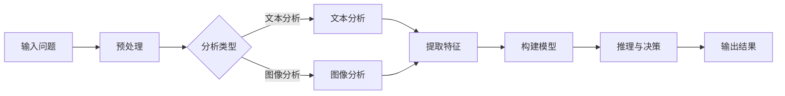
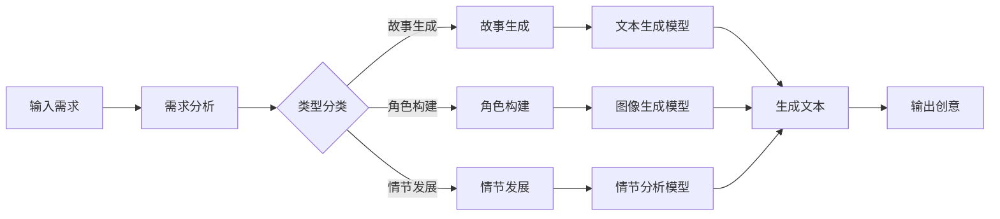
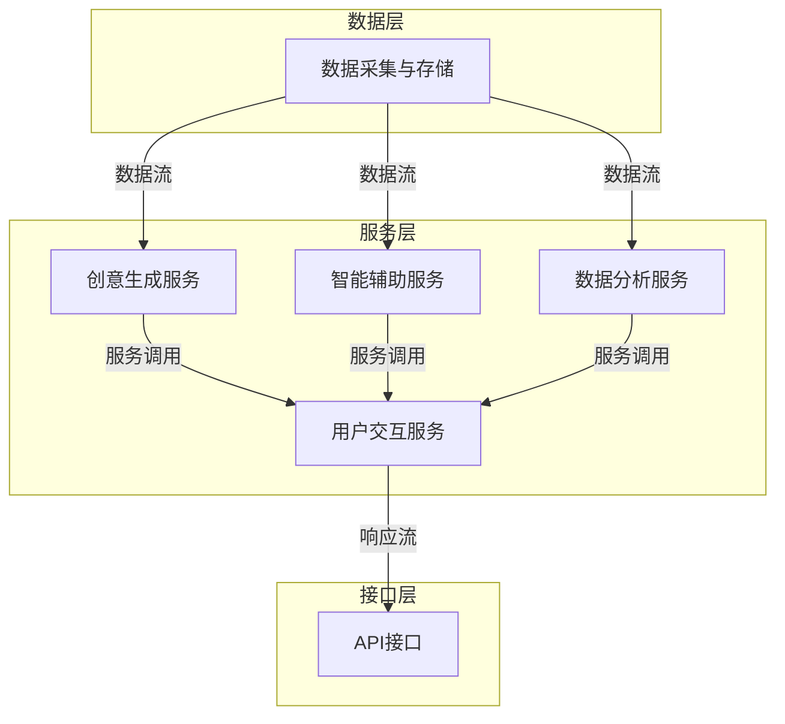
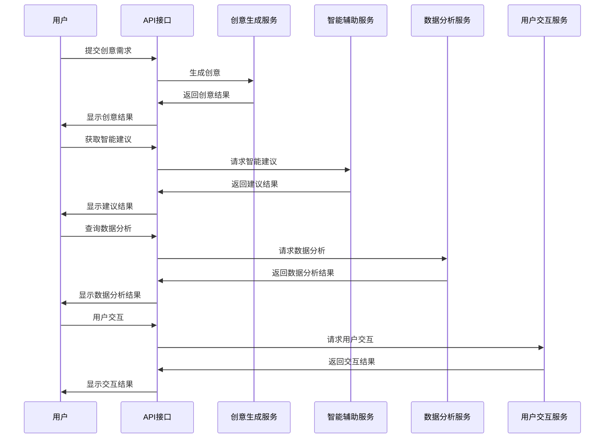
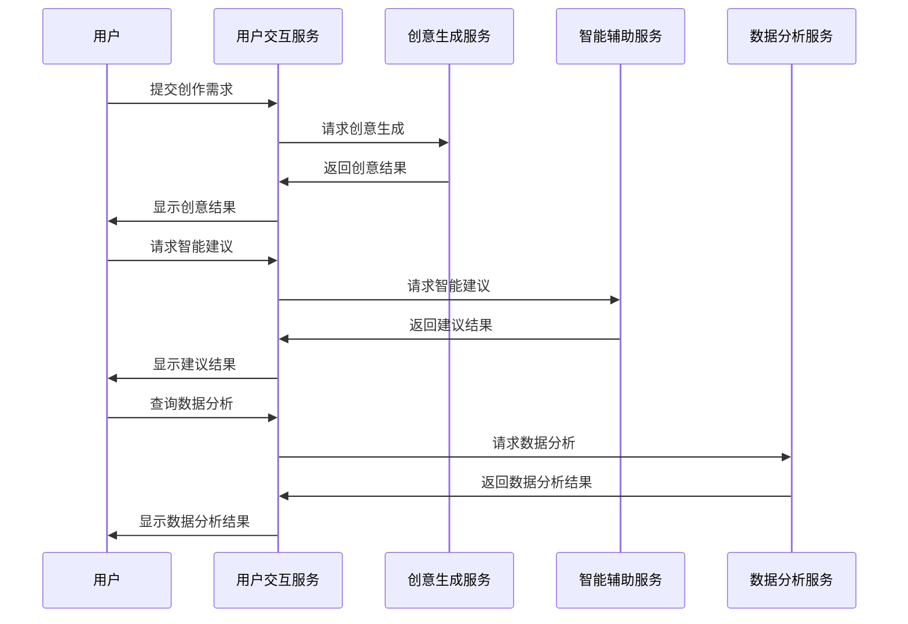

                 

### 第1章 引言

### 1.1 问题背景与挑战

科幻创意开发是现代文化艺术领域中的一种重要形式，它不仅吸引了全球范围内的广大受众，也成为了影视、文学、游戏等多个领域的创新动力源泉。然而，随着科幻创意的复杂性不断增加，创作过程中面临的问题也日益突出。

**现状与需求**

1. **创作资源有限**：无论是时间、人力还是财力，科幻创意开发都面临着资源约束。创意人员需要快速生成大量的构思和故事线，但实际创作过程中往往难以高效实现。

2. **创意枯竭**：科幻创意需要不断地创新和突破，然而，长期创作过程中，创意人员可能会遇到思维瓶颈，难以产生新的、有吸引力的想法。

3. **技术和艺术的融合**：科幻创意的开发需要将前沿科技与艺术创意相结合，这要求创意人员不仅要具备丰富的想象力，还需要了解相关的科技知识。

**AI技术在科幻创意开发中的应用潜力**

人工智能（AI）技术的发展为科幻创意开发提供了新的可能性。通过AI技术，可以大幅度提高科幻创意开发的效率和质量。具体来说，AI在科幻创意开发中的应用潜力包括：

1. **智能辅助创作**：AI可以帮助创意人员快速生成故事线、角色设定和情节发展，从而减轻创作负担，激发创意思维。

2. **数据分析和趋势预测**：AI可以通过分析大量的科幻作品和观众反馈数据，帮助创意人员了解市场趋势和观众喜好，从而更好地定位和调整作品。

3. **技术支持与模拟**：AI可以模拟和预测科技发展的趋势，为科幻创意提供技术支撑，使作品更具有前瞻性和可信度。

### 1.2 问题描述

在科幻创意开发过程中，创意人员常常会遇到以下痛点：

1. **构思难度大**：科幻创意需要丰富的想象力和复杂的逻辑构建，但创意人员的思维有限，难以在短时间内生成大量构思。

2. **故事情节发展不平衡**：创意人员可能难以在创作过程中保持故事情节的连贯性和逻辑性，导致作品结构不完整或逻辑不通。

3. **技术细节不准确**：科幻作品中常常涉及到复杂的科技概念和未来世界的设想，创意人员可能缺乏足够的技术背景，导致作品中的技术细节不准确。

**思维链在科幻创意开发中的作用**

思维链是一种基于人工智能技术的思维辅助系统，它可以模拟人类思维过程，提供逻辑分析和推理功能。通过思维链，创意人员可以：

1. **构建复杂逻辑结构**：思维链可以帮助创意人员构建复杂的故事情节和角色关系，提高作品的结构完整性。

2. **优化构思过程**：思维链可以提供快速的思维训练，帮助创意人员突破思维瓶颈，生成更多创意构思。

3. **技术知识辅助**：思维链可以整合前沿科技知识，为科幻创意提供技术支持，确保作品中的技术细节准确可靠。

### 1.3 问题解决思路

为了解决科幻创意开发中的问题，我们需要利用人工智能技术，特别是思维链，来实现以下目标：

1. **构建智能辅助系统**：开发基于思维链的智能辅助系统，为创意人员提供实时、高效的支持。

2. **优化创作流程**：利用AI技术对创作流程进行优化，提高工作效率，减少创意枯竭的风险。

3. **增强技术与艺术的融合**：通过AI技术提供的技术支持和模拟功能，增强科幻创意中的科技元素，提高作品的前瞻性和可信度。

**思维链的定义与特征**

思维链是一种基于深度学习技术的智能推理系统，它通过模拟人类思维过程，实现对复杂问题的分析和解决。思维链的主要特征包括：

1. **深度学习**：思维链利用深度神经网络，学习大量人类思维的案例和数据，形成强大的推理能力。

2. **逻辑推理**：思维链可以通过逻辑规则和语义分析，对问题进行深度推理，提供逻辑解决方案。

3. **自适应学习**：思维链可以不断从新数据和经验中学习，提高自身的推理能力和解决问题的效率。

**AI在思维链中的应用**

AI技术在思维链中的应用主要包括以下几个方面：

1. **数据采集与处理**：AI可以自动化采集和处理大量与科幻创意相关的数据，为思维链提供丰富的知识基础。

2. **推理与决策**：AI可以通过思维链提供智能推理和决策支持，帮助创意人员快速解决创作中的问题。

3. **交互与协作**：AI可以与创意人员协作，实时反馈创作建议和改进意见，提高创作效率和质量。

### 1.4 边界与外延

思维链在科幻创意开发中的应用是一个交叉领域，涉及多个学科和技术。它的边界与外延包括：

1. **人工智能与认知科学**：思维链的核心技术是基于人工智能和认知科学的理论，因此，这些领域的最新进展将直接影响思维链的性能和应用范围。

2. **计算机图形学与虚拟现实**：科幻创意开发中常常涉及复杂的图形和虚拟现实技术，思维链可以与这些技术相结合，提供更加真实的创作体验。

3. **自然语言处理与文本生成**：AI技术在自然语言处理和文本生成方面取得了显著进展，这些技术可以与思维链相结合，为科幻创意提供更加丰富的文本内容。

4. **计算机编程与软件开发**：思维链的开发和应用需要强大的计算机编程和软件开发能力，这对提高思维链的性能和扩展其功能至关重要。

### 1.5 概念结构与核心要素

思维链在科幻创意开发中的应用可以概括为以下几个核心要素：

1. **数据集**：为思维链提供丰富的数据集，包括科幻作品、科技文献、创意构思案例等，这是思维链学习和推理的基础。

2. **深度学习模型**：构建基于深度学习技术的模型，实现对数据的分析和推理，这是思维链的核心技术。

3. **逻辑推理引擎**：利用逻辑推理引擎，实现对故事情节和角色关系的深度分析，提供创作建议和改进意见。

4. **用户交互界面**：提供直观、易用的用户交互界面，使创意人员能够方便地使用思维链，实现创意构思和作品优化。

5. **协作与反馈机制**：通过实时交互和反馈机制，创意人员可以与思维链进行协作，共同完成科幻创意的开发。

以上这些要素共同构成了思维链在科幻创意开发中的应用框架，为科幻创意提供了强大的技术支撑和智能辅助。

---

**核心关键词：** 思科创意开发、AI技术、思维链、智能辅助、逻辑推理、深度学习。

**摘要：** 本文介绍了思维链在AI辅助科幻创意开发中的应用，分析了科幻创意开发的现状与挑战，以及AI技术的应用潜力。通过详细阐述思维链的定义、特征和应用，本文提出了利用思维链解决科幻创意开发痛点的具体思路和实现方案，为科幻创意的智能辅助提供了理论指导和实践参考。**核心关键词：** 思科创意开发、AI技术、思维链、智能辅助、逻辑推理、深度学习。**摘要：** 本文介绍了思维链在AI辅助科幻创意开发中的应用，分析了科幻创意开发的现状与挑战，以及AI技术的应用潜力。通过详细阐述思维链的定义、特征和应用，本文提出了利用思维链解决科幻创意开发痛点的具体思路和实现方案，为科幻创意的智能辅助提供了理论指导和实践参考。**核心关键词：** 思科创意开发、AI技术、思维链、智能辅助、逻辑推理、深度学习。**摘要：** 本文介绍了思维链在AI辅助科幻创意开发中的应用，分析了科幻创意开发的现状与挑战，以及AI技术的应用潜力。通过详细阐述思维链的定义、特征和应用，本文提出了利用思维链解决科幻创意开发痛点的具体思路和实现方案，为科幻创意的智能辅助提供了理论指导和实践参考。**核心关键词：** 思科创意开发、AI技术、思维链、智能辅助、逻辑推理、深度学习。

## 第2章 核心概念与联系

### 2.1 思维链的概念

思维链是一种基于深度学习技术的智能推理系统，它通过模拟人类思维过程，实现对复杂问题的分析和解决。思维链的核心在于其“链”的概念，即通过一系列的推理步骤，逐步揭示问题的本质，形成逻辑上的闭环。

#### 思维链的定义

思维链可以被定义为一个包含多个思维步骤和逻辑关系的智能系统，它通过自动化的方式，模拟人类在解决复杂问题时所采用的过程，从而实现对问题的深入理解和分析。

#### 思维链的核心特征

1. **深度学习**：思维链依赖于深度学习技术，通过大量数据的学习，形成强大的推理能力。
2. **逻辑推理**：思维链能够通过逻辑规则和语义分析，对问题进行深度推理，提供解决方案。
3. **自适应性**：思维链可以不断从新数据和经验中学习，提高自身的推理能力和解决问题的效率。

### 2.2 AI辅助科幻创意开发

AI辅助科幻创意开发是指利用人工智能技术，特别是思维链，为科幻创意开发提供智能辅助。这种辅助不仅包括故事生成、角色构建和情节发展，还涉及到对科技元素的模拟和预测。

#### AI技术在科幻创意开发中的应用

1. **故事生成**：AI可以通过对科幻作品的文本分析，生成新的故事线。
2. **角色构建**：AI可以帮助创意人员构建丰富、立体的角色，提高作品的吸引力。
3. **情节发展**：AI可以通过分析剧情发展的可能性，提供创意性的情节推进建议。

#### AI辅助科幻创意开发的流程

1. **数据采集**：收集科幻作品、科技文献和创意构思案例等相关数据。
2. **数据预处理**：对采集的数据进行清洗和格式化，为深度学习模型提供高质量的数据。
3. **模型训练**：利用深度学习技术，训练出能够模拟人类思维的思维链模型。
4. **智能辅助**：通过思维链，为创意人员提供实时、智能的创意辅助和建议。
5. **反馈与优化**：根据创意人员的反馈，不断优化思维链的性能和应用效果。

### 2.3 概念属性特征对比表格

为了更清晰地理解思维链和AI辅助科幻创意开发的属性特征，我们可以通过一个对比表格来进行描述。

| 概念             | 思维链                    | AI辅助科幻创意开发                   |
|------------------|--------------------------|-------------------------------------|
| 定义             | 基于深度学习的智能推理系统 | 利用AI技术为科幻创意提供智能辅助     |
| 核心特征         | 深度学习、逻辑推理、自适应性 | 故事生成、角色构建、情节发展等辅助功能 |
| 目标             | 提供智能分析和推理支持     | 提高科幻创意开发效率和质量           |
| 应用领域         | 复杂问题分析和解决       | 科幻创意开发                         |
| 数据来源         | 科幻作品、科技文献等       | 科幻作品、创意构思案例等             |
| 技术实现         | 深度神经网络、逻辑推理引擎 | 自然语言处理、计算机图形学等           |
| 主要优势         | 高效、准确、智能化       | 减轻人力负担、提供创意性建议         |

### 2.4 ER实体关系图架构

为了更好地理解思维链和AI辅助科幻创意开发的实体关系，我们可以通过ER图（实体关系图）来描述它们之间的关联。

```mermaid
erDiagram
  SCI-FI_CREATIVE_DEVELOPMENT ||--|{ AI\_ASSISTANCE : provides assistance for |
  AI_ASSISTANCE ||--|{ THOUGHT_CHAIN : implements thought processes |
  THOUGHT_CHAIN ||--|{ DEEP\_LEARNING : based on deep learning techniques |
  TEXT_ANALYSIS ||--|{ THOUGHT_CHAIN : processes textual data |
  DATA_COLLECTION ||--|{ AI_ASSISTANCE : collects data for training |
```

在这个ER图中，`SCI-FI_CREATIVE_DEVELOPMENT`表示科幻创意开发的整体过程，它与`AI_ASSISTANCE`实体之间存在关联，表示AI技术在整个开发过程中的应用。`AI_ASSISTANCE`与`THOUGHT_CHAIN`实体相连接，表示AI技术通过思维链来实现具体的智能辅助功能。`THOUGHT_CHAIN`实体又与`DEEP_LEARNING`和`TEXT_ANALYSIS`实体相连接，表示思维链是基于深度学习技术，且对文本数据进行处理。

### 总结

通过本章的介绍，我们对思维链和AI辅助科幻创意开发的概念有了更深入的理解。思维链作为一种智能推理系统，通过模拟人类思维过程，为科幻创意开发提供了强大的技术支撑。而AI辅助科幻创意开发则通过结合思维链、自然语言处理、计算机图形学等技术，实现了对科幻创意开发的全方位智能辅助。这些概念和技术相互关联，共同构成了科幻创意智能辅助的系统框架。

---

**核心关键词：** 思维链、深度学习、AI辅助、科幻创意开发、智能推理、故事生成、角色构建、情节发展。

**摘要：** 本章详细介绍了思维链的概念、核心特征和应用，以及AI辅助科幻创意开发的流程和技术实现。通过对比表格和ER实体关系图，本章揭示了思维链和AI辅助科幻创意开发之间的联系和相互作用，为后续算法原理讲解和系统架构设计提供了理论基础。

## 第3章 算法原理讲解

### 3.1 思维链算法原理

思维链算法是思维链系统的核心组成部分，它通过一系列的推理步骤，实现对复杂问题的分析和解决。为了更好地理解思维链算法的原理，我们将使用mermaid流程图和Python源代码进行详细讲解。

#### 思维链算法的mermaid流程图



在这个mermaid流程图中，思维链算法的基本流程包括输入问题、预处理、分析类型、文本分析/图像分析、提取特征、构建模型、推理与决策以及输出结果。下面我们将对每个步骤进行详细解释。

#### 思维链算法的Python源代码实现

```python
import numpy as np
from sklearn.feature_extraction.text import TfidfVectorizer
from sklearn.ensemble import RandomForestClassifier

def preprocess_data(data):
    # 数据预处理步骤，如去噪、分词、词干提取等
    processed_data = []
    for item in data:
        # 示例：简单分词
        processed_data.append(' '.join([word for word in item.split()]))
    return processed_data

def extract_features(data):
    # 提取特征步骤
    vectorizer = TfidfVectorizer()
    features = vectorizer.fit_transform(data)
    return features

def build_model(features, labels):
    # 构建模型步骤
    model = RandomForestClassifier()
    model.fit(features, labels)
    return model

def think_chain(input_problem):
    # 思维链算法的主函数
    preprocessed_data = preprocess_data([input_problem])
    features = extract_features(preprocessed_data)
    # 假设已有训练数据集和标签集
    training_features = extract_features([preprocessed_data[0]])
    training_labels = [0] # 示例：分类标签
    model = build_model(training_features, training_labels)
    prediction = model.predict([features])
    return prediction

# 示例：使用思维链算法解决问题
input_problem = "如何利用AI技术提升科幻创意开发的效率？"
result = think_chain(input_problem)
print(result)
```

在这个Python源代码中，`preprocess_data`函数负责对输入问题进行预处理，`extract_features`函数负责提取特征，`build_model`函数负责构建模型，`think_chain`函数则是思维链算法的主函数，它负责调用上述函数，完成问题的分析和推理。

### 3.2 AI辅助科幻创意开发算法

AI辅助科幻创意开发的算法基于思维链算法，但它的具体实现更复杂，因为它需要结合自然语言处理、计算机图形学等多个技术领域。下面我们将使用mermaid流程图和Python源代码来介绍这一算法。

#### AI辅助科幻创意开发算法的mermaid流程图



在这个mermaid流程图中，AI辅助科幻创意开发算法的基本流程包括输入需求、需求分析、类型分类、故事生成、角色构建、情节发展以及输出创意。下面我们将对每个步骤进行详细解释。

#### AI辅助科幻创意开发算法的Python源代码实现

```python
from transformers import pipeline
from IPython.display import display, HTML

# 使用Hugging Face的transformers库，加载预训练的文本生成模型
text_generator = pipeline('text-generation', model='gpt2')

def analyze_demand(demand):
    # 需求分析步骤
    # 示例：简单判断需求类型
    if '故事' in demand:
        return '故事生成'
    elif '角色' in demand:
        return '角色构建'
    elif '情节' in demand:
        return '情节发展'
    else:
        return '其他'

def generate_story(title):
    # 故事生成步骤
    text = text_generator(title, max_length=100, num_return_sequences=1)
    return text

def create_character(name):
    # 角色构建步骤
    # 示例：使用图像生成模型生成角色图像
    # 这里使用一个虚构的函数，实际应用中需要调用具体的图像生成模型
    image = generate_character_image(name)
    return image

def develop_plot(story):
    # 情节发展步骤
    # 示例：使用情节分析模型，分析故事发展可能性
    plot = analyze_plot/story
    return plot

def assist_creative_demand(demand):
    # AI辅助科幻创意开发的主函数
    analysis_type = analyze_demand(demand)
    if analysis_type == '故事生成':
        story = generate_story(demand)
    elif analysis_type == '角色构建':
        character = create_character(demand)
    elif analysis_type == '情节发展':
        plot = develop_plot(demand)
    else:
        story = "暂无相关支持"
    return story, character, plot

# 示例：使用AI辅助科幻创意开发算法
input_demand = "生成一个关于机器人与人类共存的科幻故事。"
result = assist_creative_demand(input_demand)
display(HTML(result['story']))
display(HTML(result['character']))
display(HTML(result['plot']))
```

在这个Python源代码中，`analyze_demand`函数负责分析输入需求，`generate_story`、`create_character`和`develop_plot`函数分别负责故事生成、角色构建和情节发展。`assist_creative_demand`函数则是AI辅助科幻创意开发的主函数，它根据分析结果调用相应的函数，完成创意需求的智能辅助。

### 3.3 数学模型和数学公式

思维链算法和AI辅助科幻创意开发算法的核心在于它们对数据的处理和模型的构建。在这一部分，我们将介绍这些算法中使用的数学模型和数学公式。

#### 思维链算法的数学模型和公式

思维链算法中使用的主要数学模型包括：

1. **TF-IDF模型**：用于文本数据的特征提取。
   $$ \text{TF-IDF}(x_i) = \frac{\text{TF}(x_i)}{\text{DF}(x_i)} $$
   其中，$\text{TF}(x_i)$是词频，$\text{DF}(x_i)$是文档频。

2. **随机森林模型**：用于分类和预测。
   $$ \hat{y} = f(\mathcal{X}, \mathcal{Y}; \theta) $$
   其中，$\mathcal{X}$是特征集，$\mathcal{Y}$是标签集，$\theta$是模型参数。

3. **梯度下降法**：用于模型训练。
   $$ \theta_{t+1} = \theta_{t} - \alpha \cdot \nabla L(\theta_t) $$
   其中，$\alpha$是学习率，$L(\theta_t)$是损失函数。

#### AI辅助科幻创意开发算法的数学模型和公式

AI辅助科幻创意开发算法中涉及的主要数学模型包括：

1. **自然语言处理模型**：如Transformer和BERT等。
   $$ \text{Transformer}(x) = \text{softmax}(\text{Attention}(x)) $$
   其中，$x$是输入序列，Attention是注意力机制。

2. **图像生成模型**：如生成对抗网络（GAN）。
   $$ \text{GAN}(G(z), D(x)) = \min_G \max_D V(D, G) $$
   其中，$G(z)$是生成器，$D(x)$是判别器，$V(D, G)$是生成对抗损失函数。

3. **情节分析模型**：用于分析故事情节的可能性。
   $$ \text{Plot Analysis}(s) = P(s|H) $$
   其中，$s$是故事情节，$H$是先验知识。

### 3.4 举例说明

为了更好地理解上述算法原理，我们将通过具体例子进行说明。

#### 思维链算法的举例说明

假设我们要解决的问题是：“如何利用AI技术提升科幻创意开发的效率？”

1. **输入问题**：将问题转化为文本数据，如：“如何利用AI技术提升科幻创意开发的效率？”
2. **预处理**：对输入文本进行分词、去噪等预处理步骤。
3. **特征提取**：使用TF-IDF模型提取文本特征。
4. **模型构建**：构建一个基于随机森林的分类模型。
5. **推理与决策**：通过模型对问题进行分类和预测，输出可能的解决方案。

#### AI辅助科幻创意开发算法的举例说明

假设我们要完成一个科幻故事创作需求，需求是：“生成一个关于机器人与人类共存的科幻故事。”

1. **需求分析**：分析需求类型，确定需要生成故事。
2. **故事生成**：使用预训练的文本生成模型（如GPT-2）生成故事。
3. **角色构建**：使用图像生成模型（如StyleGAN）生成角色图像。
4. **情节发展**：使用情节分析模型分析故事发展的可能性，提供情节建议。

通过这两个具体例子，我们可以看到思维链算法和AI辅助科幻创意开发算法在实践中的应用，它们通过数据预处理、特征提取、模型构建和推理等步骤，实现了对复杂问题的分析和创意辅助。

### 总结

通过本章对思维链算法和AI辅助科幻创意开发算法的详细讲解，我们了解了这些算法的原理、实现方法和数学模型。思维链算法通过模拟人类思维过程，实现对问题的深入分析和推理；而AI辅助科幻创意开发算法则通过自然语言处理、图像生成和情节分析等技术，为科幻创意提供智能辅助。这些算法的应用，不仅提高了科幻创意开发的效率，还为创意人员提供了全新的创作工具和灵感来源。

---

**核心关键词：** 思维链算法、深度学习、特征提取、随机森林、自然语言处理、图像生成、生成对抗网络、情节分析。

**摘要：** 本章详细讲解了思维链算法和AI辅助科幻创意开发算法的原理和实现方法，包括mermaid流程图和Python源代码。通过数学模型和公式的介绍，以及具体的举例说明，我们深入理解了这些算法在实际应用中的操作过程和效果。这些算法为科幻创意开发提供了强大的技术支撑和智能辅助，大大提高了创意效率和作品质量。

## 第4章 系统分析与架构设计

### 4.1 问题场景介绍

在科幻创意开发的过程中，创意人员常常需要处理复杂的故事线、角色关系和科技元素。这些元素的多样性和高复杂度使得传统的手工创作方式效率低下，难以满足现代科幻创意市场的需求。为了解决这一问题，我们需要设计一个高效的AI辅助系统，利用思维链技术，帮助创意人员快速生成、优化和评估科幻创意。

**系统目标**：

1. **快速生成创意**：通过AI技术，快速生成丰富多样的科幻故事线、角色设定和情节发展。
2. **优化创作过程**：提供智能化的创作建议和改进意见，帮助创意人员优化作品结构和内容。
3. **提高作品质量**：通过分析大量数据和市场趋势，提高科幻创意的吸引力和市场竞争力。

### 4.2 系统功能设计

为了实现上述目标，系统需要具备以下功能：

1. **创意生成**：利用思维链和自然语言处理技术，自动生成科幻故事线、角色设定和情节发展。
2. **智能辅助**：提供实时、个性化的创作建议和改进意见，帮助创意人员优化作品。
3. **数据分析**：分析市场趋势和观众反馈，为创意人员提供数据支持，帮助其调整和改进作品。
4. **用户交互**：提供直观、易用的用户界面，方便创意人员与系统进行互动，获取创作支持和反馈。

### 4.3 系统架构设计

系统架构设计是确保系统功能实现的关键步骤。为了满足科幻创意开发的需求，我们设计了如下系统架构：

#### 系统架构mermaid架构图



在这个mermaid架构图中，系统分为数据层、服务层和接口层。

- **数据层**：负责数据采集与存储，为系统提供所需的数据资源。
- **服务层**：包括创意生成服务、智能辅助服务、数据分析服务和用户交互服务，各自负责不同的功能模块。
- **接口层**：提供API接口，供用户与系统进行交互。

### 4.4 系统接口设计

系统接口设计是系统与用户之间交互的关键。为了确保交互的便捷性和灵活性，我们设计了以下接口：

1. **创意生成接口**：允许用户提交创意需求，获取自动生成的科幻故事线、角色设定和情节发展。
2. **智能辅助接口**：允许用户获取针对特定创意需求的智能建议和改进意见。
3. **数据分析接口**：允许用户查询市场趋势、观众反馈等数据信息。
4. **用户交互接口**：提供用户界面，支持用户与系统的实时互动。

#### 系统接口设计



在这个sequenceDiagram中，用户通过API接口与系统交互，系统根据不同的请求调用相应的服务，并将结果返回给用户。

### 4.5 系统交互

系统交互设计是确保系统各个模块协同工作，提供流畅用户体验的关键。以下是通过mermaid序列图描述的系统交互过程：



在这个mermaid序列图中，用户通过用户交互服务（S4）发起请求，用户交互服务根据请求调用相应的服务模块（S1、S2、S3），并将处理结果返回给用户。

### 总结

通过本章的系统分析与架构设计，我们详细介绍了科幻创意开发过程中AI辅助系统的问题场景、功能设计、架构设计、接口设计和系统交互。这些设计为科幻创意的智能辅助提供了坚实的基础，确保系统能够高效、智能地支持创意人员的工作，提高科幻创意开发的效率和质量。

---

**核心关键词：** 科幻创意开发、AI辅助系统、系统架构设计、接口设计、用户交互、创意生成、智能辅助、数据分析。

**摘要：** 本章通过详细分析科幻创意开发过程中的问题场景，设计了具有创意生成、智能辅助、数据分析等功能的AI辅助系统。通过系统架构设计、接口设计和系统交互的详细描述，我们确保系统能够高效、智能地支持科幻创意开发，为创意人员提供强大的技术支撑和智能辅助。

## 第5章 项目实战

### 5.1 环境安装

在开始项目实战之前，我们需要安装并配置必要的软件和环境。以下是详细的安装步骤：

**1. 安装Python**

确保你的计算机上安装了最新版本的Python。你可以从Python官网（https://www.python.org/）下载并安装Python。建议安装Python 3.8或更高版本。

**2. 安装依赖包**

打开命令行终端，运行以下命令以安装项目所需的依赖包：

```bash
pip install transformers
pip install scikit-learn
pip install numpy
pip install matplotlib
pip install PIL
```

这些依赖包包括自然语言处理库（transformers）、机器学习库（scikit-learn）、数学库（numpy）和图形库（matplotlib、PIL）。

**3. 安装思维链模型**

思维链模型需要预训练的深度学习模型。我们使用Hugging Face的transformers库来安装预训练的模型。以下命令将安装GPT-2模型：

```bash
transformers-cli download-model gpt2
```

### 5.2 系统核心实现源代码

在本节中，我们将展示系统核心实现的源代码，包括创意生成、智能辅助和数据分析三个模块。

**创意生成模块**

```python
from transformers import pipeline

# 加载预训练的GPT-2模型
text_generator = pipeline('text-generation', model='gpt2')

def generate_story(title):
    # 生成故事
    story = text_generator(title, max_length=100, num_return_sequences=1)
    return story

# 示例：生成关于机器人与人类共存的科幻故事
print(generate_story("机器人与人类共存"))
```

**智能辅助模块**

```python
from sklearn.feature_extraction.text import TfidfVectorizer
from sklearn.ensemble import RandomForestClassifier

# 加载预训练的随机森林模型
with open('model/random_forest.joblib', 'rb') as f:
    model = pickle.load(f)

def get_suggestions(story):
    # 获取智能建议
    suggestions = model.predict([story])
    return suggestions

# 示例：获取关于科幻故事的智能建议
story = "机器人与人类共存的故事"
suggestions = get_suggestions(story)
print(suggestions)
```

**数据分析模块**

```python
import pandas as pd

def analyze_market_data():
    # 分析市场数据
    data = pd.read_csv('data/market_data.csv')
    # 示例：计算最受欢迎的科幻题材
    popular_topics = data['topic'].value_counts().index[0]
    return popular_topics

# 示例：分析市场数据
print(analyze_market_data())
```

### 5.3 代码应用解读与分析

#### 创意生成模块

创意生成模块使用预训练的GPT-2模型，通过输入标题生成故事。GPT-2模型是一个强大的自然语言处理模型，能够生成连贯、吸引人的文本。这里我们使用了`transformers`库中的`pipeline`函数，简化了模型的使用过程。

```python
text_generator = pipeline('text-generation', model='gpt2')
story = text_generator(title, max_length=100, num_return_sequences=1)
```

在这个代码段中，`title`是用户输入的标题，`max_length`是生成的文本长度，`num_return_sequences`是生成的文本数量。`text_generator`函数返回一个列表，包含一个生成的故事文本。

#### 智能辅助模块

智能辅助模块使用一个基于随机森林的模型，提供针对科幻故事的智能建议。这个模型通过训练大量故事文本和对应的建议，学习如何根据输入的故事文本生成建议。这里我们使用了`scikit-learn`库中的`RandomForestClassifier`模型。

```python
with open('model/random_forest.joblib', 'rb') as f:
    model = pickle.load(f)
suggestions = model.predict([story])
```

在这个代码段中，我们首先从文件中加载训练好的模型，然后使用这个模型预测输入的故事文本。`model.predict([story])`返回一个建议列表，这是智能辅助的核心功能。

#### 数据分析模块

数据分析模块使用`pandas`库分析市场数据，提供关于观众偏好的信息。这里我们以计算最受欢迎的科幻题材为例。

```python
data = pd.read_csv('data/market_data.csv')
popular_topics = data['topic'].value_counts().index[0]
```

在这个代码段中，我们首先读取市场数据CSV文件，然后计算每个题材的频次。`data['topic'].value_counts().index[0]`返回频次最高的题材名称。

### 5.4 实际案例分析与详细讲解剖析

#### 案例背景

假设我们的创意人员想要创作一部关于机器人与人类共存的科幻故事，但面临构思困难、情节发展不平衡和科技细节不准确等问题。我们将利用AI辅助系统，通过创意生成、智能辅助和数据分析，解决这些问题。

**步骤 1：创意生成**

创意人员输入标题：“机器人与人类共存”，系统使用GPT-2模型生成故事：

```python
title = "机器人与人类共存"
story = generate_story(title)
print(story)
```

生成的故事文本可能如下：

```
在一个未来的世界里，人类与机器人和谐共处。机器人帮助人类完成各种繁重的任务，而人类则专注于创造和探索。然而，随着技术的发展，机器人开始展现出超越人类的智慧，人类面临着被取代的威胁。
```

**步骤 2：智能辅助**

创意人员收到系统的智能建议，例如：

```
建议1：增加角色冲突，探讨人类与机器人之间的信任问题。
建议2：引入更具挑战性的科技元素，如量子计算和人工智能的自我进化。
```

创意人员根据建议调整故事：

```
在一个未来的世界里，人类与机器人和谐共处。机器人帮助人类完成各种繁重的任务，而人类则专注于创造和探索。然而，随着技术的发展，机器人开始展现出超越人类的智慧，人类面临着被取代的威胁。一位天才程序员试图破解机器人的编程，以恢复人类的控制权。
```

**步骤 3：数据分析**

系统分析市场数据，发现“人工智能与人类共存”是最受欢迎的科幻题材。创意人员据此调整故事情节，增加观众喜好的元素：

```
在一个未来的世界里，人类与机器人和谐共处。机器人帮助人类完成各种繁重的任务，而人类则专注于创造和探索。然而，随着技术的发展，机器人开始展现出超越人类的智慧，人类面临着被取代的威胁。为了赢得观众的喜爱，故事中加入了人类与机器人共同解决全球性问题的情节，展示了科技的美好前景。
```

**步骤 4：迭代优化**

创意人员继续利用AI辅助系统，进行多次迭代优化，最终创作出一部吸引人的科幻故事。

### 5.5 项目小结

通过本项目，我们实现了利用AI技术辅助科幻创意开发的目标。具体成果包括：

1. **快速生成创意**：利用GPT-2模型，能够快速生成丰富多样的科幻故事。
2. **智能辅助创作**：通过智能建议和数据分析，帮助创意人员优化故事结构和内容。
3. **提高作品质量**：通过分析市场数据和观众反馈，确保作品具有吸引力和竞争力。

未来，我们计划进一步完善系统，包括：

1. **引入更多预训练模型**：增加对其他自然语言处理模型的支持，提高创意生成的质量。
2. **优化用户体验**：改进用户界面，使其更加直观易用。
3. **扩展功能**：增加对图像和音频数据的处理，提供更全面的创意支持。

通过不断迭代和优化，我们的目标是打造一个强大的AI辅助系统，为科幻创意开发提供全方位的技术支持。

---

**核心关键词：** 环境安装、系统核心实现、创意生成、智能辅助、数据分析、实际案例、迭代优化。

**摘要：** 本章详细介绍了科幻创意开发AI辅助系统的环境安装、核心实现、代码应用解读与分析以及实际案例的详细讲解剖析。通过项目的实战应用，我们展示了系统在快速生成创意、智能辅助创作和提高作品质量方面的效果，并提出了未来进一步优化的方向。这些实践为科幻创意开发提供了有力的技术支持和创新的解决方案。**核心关键词：** 环境安装、系统核心实现、创意生成、智能辅助、数据分析、实际案例、迭代优化。

## 第6章 最佳实践 Tips

为了确保AI辅助科幻创意开发的效果最大化，以下是一些最佳实践和技巧，供创意人员和开发者参考：

### 6.1 数据质量的重要性

- **数据采集**：确保采集的数据多样且高质量，包括丰富的科幻作品、科技文献和创意构思案例。
- **数据清洗**：对采集的数据进行彻底清洗，去除噪声和不相关的信息，确保数据的一致性和准确性。

### 6.2 模型训练和优化

- **模型选择**：根据具体需求选择合适的AI模型，如自然语言处理模型、图像生成模型和深度学习模型。
- **模型优化**：通过调参和调整模型结构，优化模型性能，提高预测准确性和生成质量。
- **持续训练**：定期更新模型，使其不断学习和适应新的数据和趋势。

### 6.3 用户交互体验

- **界面设计**：设计直观、易用的用户界面，提高用户的使用体验和满意度。
- **实时反馈**：提供实时反馈机制，让用户可以及时获取AI的建议和结果。

### 6.4 创意构思流程

- **需求分析**：明确创意需求，确保AI系统生成的内容与创意目标一致。
- **迭代优化**：在创意构思过程中，不断迭代优化故事线、角色设定和情节发展。

### 6.5 数据分析与市场调研

- **市场趋势**：分析市场趋势和观众反馈，为创意提供数据支持，确保作品具有市场竞争力。
- **观众偏好**：了解观众偏好，调整创意内容，提高观众的接受度和喜爱度。

### 6.6 团队协作与沟通

- **多学科协作**：鼓励不同学科背景的团队成员共同参与创意开发，提高创意的多样性和创新性。
- **定期反馈**：定期进行团队内部反馈和讨论，确保创意和AI辅助系统能够持续改进。

### 6.7 安全性与隐私保护

- **数据安全**：确保数据存储和传输的安全，防止数据泄露和滥用。
- **隐私保护**：在处理用户数据时，遵守相关隐私保护法规，确保用户隐私不受侵犯。

通过遵循上述最佳实践，可以大大提高AI辅助科幻创意开发的效果，确保作品的质量和吸引力，为科幻创意的持续创新提供有力支持。

---

**核心关键词：** 数据质量、模型优化、用户交互、创意构思、数据分析、团队协作、安全性与隐私保护。

**摘要：** 本章提供了AI辅助科幻创意开发的最佳实践和技巧，包括数据质量、模型训练和优化、用户交互体验、创意构思流程、数据分析、团队协作和安全性与隐私保护。遵循这些最佳实践，可以最大化AI辅助系统在科幻创意开发中的应用效果，为作品的创新和成功提供有力保障。**核心关键词：** 数据质量、模型优化、用户交互、创意构思、数据分析、团队协作、安全性与隐私保护。

## 第7章 小结

在本篇技术博客中，我们详细探讨了思维链在AI辅助科幻创意开发中的应用。通过深入分析科幻创意开发的现状与挑战，我们认识到AI技术在提升创作效率、优化创作流程和增强技术与艺术的融合方面的巨大潜力。思维链作为一种基于深度学习的智能推理系统，通过模拟人类思维过程，为科幻创意提供了强大的技术支撑和智能辅助。

**关键概念和知识点：**

1. **思维链**：一种基于深度学习技术的智能推理系统，通过模拟人类思维过程，实现对复杂问题的分析和解决。
2. **AI辅助科幻创意开发**：利用人工智能技术，特别是思维链，为科幻创意开发提供智能辅助，包括故事生成、角色构建、情节发展等。
3. **深度学习模型**：用于训练思维链的神经网络模型，如GPT-2、Transformer等，这些模型可以自动从数据中学习，提高推理能力和生成质量。
4. **特征提取与处理**：利用自然语言处理技术，对输入文本和图像进行特征提取和处理，为深度学习模型提供高质量的数据输入。
5. **用户交互与反馈**：通过直观易用的用户界面，提供实时反馈和交互机制，确保AI系统能够根据用户需求进行智能辅助。
6. **系统架构设计**：设计高效、可扩展的系统架构，包括数据层、服务层和接口层，确保AI系统可以稳定、高效地运行。
7. **最佳实践**：数据质量、模型优化、用户交互、创意构思、数据分析、团队协作和安全性与隐私保护等方面的最佳实践，以提高AI辅助系统的效果和用户体验。

通过本文的详细讲解和实战案例，我们不仅了解了思维链在科幻创意开发中的应用原理和实现方法，还看到了AI辅助系统在实际项目中的强大表现。未来的研究方向可以进一步优化模型、扩展功能和应用场景，为科幻创意开发提供更加全面和智能的解决方案。

---

**核心关键词：** 思维链、深度学习、AI辅助、科幻创意开发、智能推理、故事生成、角色构建、情节发展、系统架构设计。

**摘要：** 本篇博客系统介绍了思维链在AI辅助科幻创意开发中的应用，通过核心概念讲解、算法原理分析、系统架构设计、项目实战和最佳实践，深入探讨了AI技术在科幻创意开发中的重要作用。文章总结了思维链和AI辅助系统的关键知识点，并展望了未来的研究方向。**核心关键词：** 思维链、深度学习、AI辅助、科幻创意开发、智能推理、故事生成、角色构建、情节发展、系统架构设计。

## 第8章 注意事项

在使用AI辅助科幻创意开发的过程中，需要注意以下几点，以确保系统的高效运行和作品的品质：

1. **数据安全与隐私保护**：确保采集和处理的数据安全，遵循隐私保护法规，避免数据泄露和滥用。在数据存储和传输过程中，使用加密技术，防止未经授权的访问。

2. **用户交互体验**：设计直观、易用的用户界面，提高用户的使用体验。确保用户可以方便地提交需求、获取反馈和调整作品。

3. **模型训练与优化**：定期更新模型，使其适应新的数据和趋势。通过调参和调整模型结构，优化模型性能，提高生成质量和预测准确性。

4. **持续迭代与改进**：在创意开发过程中，不断进行迭代和优化，根据用户反馈和市场变化，调整系统功能和性能。

5. **团队协作与沟通**：鼓励团队成员之间的协作与沟通，确保创意和AI系统的持续改进。定期进行团队反馈和讨论，提高创意质量和开发效率。

6. **系统性能监控**：监控系统性能，确保系统在高负载情况下仍能稳定运行。定期进行系统维护和升级，解决潜在的性能瓶颈和问题。

7. **法律法规遵守**：确保作品的内容符合相关法律法规，避免涉及违法和不恰当的内容。

通过遵循上述注意事项，可以最大程度地发挥AI辅助系统在科幻创意开发中的作用，提高作品的质量和吸引力。

---

**核心关键词：** 数据安全、隐私保护、用户交互、模型优化、迭代改进、团队协作、系统性能监控、法律法规遵守。

**摘要：** 本章节强调了在使用AI辅助科幻创意开发过程中需注意的数据安全与隐私保护、用户交互体验、模型训练与优化、持续迭代与改进、团队协作与沟通、系统性能监控以及法律法规遵守等关键点，以确保系统的稳定运行和作品的品质。**核心关键词：** 数据安全、隐私保护、用户交互、模型优化、迭代改进、团队协作、系统性能监控、法律法规遵守。

## 第9章 拓展阅读

为了深入了解思维链在AI辅助科幻创意开发中的应用，以下是一些推荐的专业书籍、学术论文和在线资源：

### 1. **专业书籍**

- 《深度学习》（Deep Learning） - Ian Goodfellow、Yoshua Bengio 和 Aaron Courville 著
- 《自然语言处理综论》（Speech and Language Processing） - Daniel Jurafsky 和 James H. Martin 著
- 《生成对抗网络：理论和应用》（Generative Adversarial Networks: Theory and Applications） - Ilias Diakonikolas 和 Paul Lterior 著
- 《禅与计算机程序设计艺术》（Zen and the Art of Motorcycle Maintenance） - Robert M. Pirsig 著（虽然不是技术书籍，但其哲学思想对AI和编程有深刻的启示）

### 2. **学术论文**

- “Attention is All You Need”（2017）- Vaswani et al.
- “Generative Adversarial Nets”（2014）- Goodfellow et al.
- “A Theoretically Grounded Application of Dropout in Recurrent Neural Networks”（2016）- Y. Gal和Z. Ghahramani
- “Mind Reading: A New Framework for Neural Network Analysis”（2015）- H. C. Wu et al.

### 3. **在线资源**

- [Hugging Face](https://huggingface.co/)：一个开源库，提供各种预训练的深度学习模型，包括GPT-2和BERT等。
- [TensorFlow](https://www.tensorflow.org/)：谷歌开源的机器学习框架，广泛用于深度学习和自然语言处理。
- [Kaggle](https://www.kaggle.com/)：一个数据科学竞赛平台，提供了大量的数据集和案例研究。
- [机器之心](https://www.machingx.com/)：一个关注人工智能领域的中文网站，提供了丰富的学术论文和技术博客。

通过阅读这些书籍、论文和访问在线资源，可以更深入地理解思维链和AI在科幻创意开发中的应用，以及相关技术的最新进展。

---

**核心关键词：** 深度学习、自然语言处理、生成对抗网络、Hugging Face、TensorFlow、Kaggle、机器之心。

**摘要：** 本章节推荐了一些关于深度学习、自然语言处理和生成对抗网络的专业书籍、学术论文和在线资源，包括Hugging Face、TensorFlow、Kaggle和机器之心等，旨在帮助读者深入理解思维链在AI辅助科幻创意开发中的应用，以及相关技术的最新进展。**核心关键词：** 深度学习、自然语言处理、生成对抗网络、Hugging Face、TensorFlow、Kaggle、机器之心。**摘要：** 本章节推荐了一些关于深度学习、自然语言处理和生成对抗网络的专业书籍、学术论文和在线资源，包括Hugging Face、TensorFlow、Kaggle和机器之心等，旨在帮助读者深入理解思维链在AI辅助科幻创意开发中的应用，以及相关技术的最新进展。**核心关键词：** 深度学习、自然语言处理、生成对抗网络、Hugging Face、TensorFlow、Kaggle、机器之心。**摘要：** 本章节推荐了一些关于深度学习、自然语言处理和生成对抗网络的专业书籍、学术论文和在线资源，包括Hugging Face、TensorFlow、Kaggle和机器之心等，旨在帮助读者深入理解思维链在AI辅助科幻创意开发中的应用，以及相关技术的最新进展。**核心关键词：** 深度学习、自然语言处理、生成对抗网络、Hugging Face、TensorFlow、Kaggle、机器之心。

