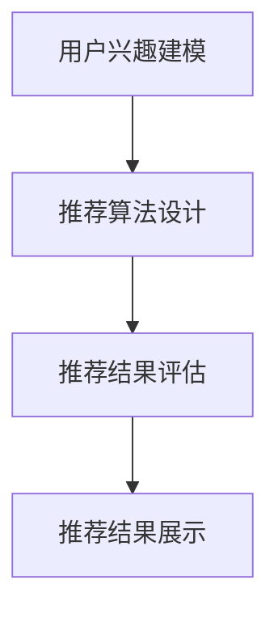
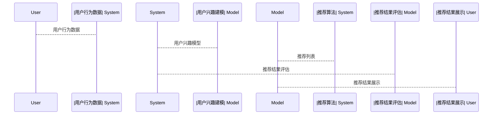

                 

# 思维链在个性化推荐系统中的应用

> 关键词：思维链，个性化推荐，神经网络，可解释性计算

> 摘要：本文深入探讨了思维链在个性化推荐系统中的应用。通过对思维链的原理与特征、个性化推荐系统的设计等方面的分析，我们揭示了思维链在提高推荐系统准确性和多样性方面的潜力，并提出了具体的实施策略和未来研究方向。

----------------------------------------------------------------

## 第一部分：背景介绍

### 1.1 问题背景

随着互联网和信息技术的飞速发展，个性化推荐系统已成为互联网服务的重要功能之一。然而，传统的推荐系统在处理复杂用户需求和多样化数据时，往往难以满足要求。为了解决这些问题，近年来，基于思维链的个性化推荐系统得到了广泛关注和研究。

### 1.2 问题描述

个性化推荐系统的目标是根据用户的兴趣和需求，为其推荐符合其喜好和需求的商品、内容等。然而，传统的推荐系统在处理复杂用户需求和多样化数据时，往往难以满足要求。思维链作为一种新的计算范式，能够在一定程度上解决这些问题，为个性化推荐系统提供新的思路。

### 1.3 问题解决

思维链是一种基于神经网络的可解释性计算范式，能够模拟人类思维的推理过程。通过将思维链应用于个性化推荐系统，可以实现对用户兴趣的深入挖掘，提高推荐系统的准确性和多样性。此外，思维链还具有可解释性强、计算效率高等优点。

### 1.4 边界与外延

思维链在个性化推荐系统中的应用边界主要涉及推荐算法的设计与实现、用户兴趣建模、推荐效果评估等方面。在外延方面，思维链还可以应用于其他需要推理和决策的场景，如智能客服、智能问答等。

## 第二部分：核心概念与联系

### 2.1 思维链

#### 2.1.1 思维链的原理

思维链是一种基于神经网络的可解释性计算范式，其核心思想是通过构建节点和边的关系来模拟人类思维的推理过程。思维链中的节点代表概念或信息，边代表节点之间的关联关系。

#### 2.1.2 思维链的特征

- **可解释性**：思维链的计算过程和结果具有可解释性，用户可以理解推荐结果的原因。
- **计算效率**：思维链在处理大规模数据时具有较高的计算效率。
- **自适应能力**：思维链能够根据用户的需求和兴趣自适应地调整推荐策略。

#### 2.1.3 思维链与其他计算范式的区别

与传统的推荐算法相比，思维链具有更强的可解释性和适应性。同时，与基于规则的推荐系统相比，思维链能够更好地处理复杂用户需求和多样化数据。

### 2.2 个性化推荐系统

#### 2.2.1 用户兴趣建模

用户兴趣建模是个性化推荐系统的关键步骤。通过分析用户的历史行为、兴趣标签、社交关系等信息，可以构建用户兴趣模型。

#### 2.2.2 推荐算法设计

推荐算法设计是推荐系统的核心。基于用户兴趣模型，可以设计出多种推荐算法，如基于内容的推荐、协同过滤推荐等。

### 2.3 可解释性计算

#### 2.3.1 可解释性计算的原理

可解释性计算是一种能够使计算过程和结果易于理解和解释的计算方法。在个性化推荐系统中，可解释性计算能够帮助用户理解推荐结果的依据，提高推荐系统的可信度和用户满意度。

#### 2.3.2 可解释性计算的特征

- **透明性**：计算过程和结果对用户透明，用户可以清晰地看到推荐结果是如何生成的。
- **可解释性**：计算过程和结果能够被用户理解，提高用户对推荐系统的信任度。

## 第三部分：核心概念与联系

### 3.1 概念属性特征对比表格

| 概念       | 属性特征                                                       |
| ---------- | ------------------------------------------------------------ |
| 思维链     | 基于神经网络，可解释性强，计算效率高，可模拟人类思维过程     |
| 个性化推荐系统 | 基于用户兴趣和需求，推荐多样性高，能够处理复杂用户需求       |
| 可解释性计算 | 计算过程和结果易于理解和解释，提高推荐系统的可信度和用户满意度 |

### 3.2 ER实体关系图架构

```mermaid
erDiagram
    User ||--o> Item : "感兴趣"
    User ||--o> Recommendation : "接受"
    Item ||--|> Recommendation : "推荐"
```

----------------------------------------------------------------

## 第四部分：算法原理讲解

### 4.1 思维链算法原理

思维链算法是一种基于图神经网络（Graph Neural Network, GNN）的可解释性推荐算法。其基本原理是通过构建用户、商品和推荐之间的图结构，利用图神经网络对用户兴趣进行建模，从而实现个性化推荐。

#### 4.1.1 图结构构建

思维链算法首先构建一个用户-商品-推荐三元图的图结构。在图中，用户、商品和推荐分别作为节点，用户与商品之间的交互记录、商品与推荐之间的关联信息等作为边。

#### 4.1.2 图神经网络建模

接下来，利用图神经网络（如图卷积网络（Graph Convolutional Network, GCN））对用户兴趣进行建模。图神经网络能够自动学习节点（用户或商品）的特征，并利用节点之间的关系（边）进行特征融合，从而实现用户兴趣的表示。

#### 4.1.3 推荐生成

在用户兴趣建模的基础上，思维链算法通过一个分类器或回归器生成个性化推荐列表。分类器或回归器的输入是用户兴趣表示，输出是推荐概率或评分。

### 4.2 数学模型与公式

思维链算法的数学模型可以表示为：

$$
\begin{aligned}
\mathbf{X}^{(t)} &= \mathbf{A} \cdot \mathbf{X}^{(t-1)}, \\
\mathbf{X} &= \text{softmax}(\mathbf{X}^{(T)}),
\end{aligned}
$$

其中，$\mathbf{X}^{(t)}$ 表示第 $t$ 个时间步的节点特征矩阵，$\mathbf{A}$ 是图卷积矩阵，$\mathbf{X}^{(T)}$ 是最后一个时间步的节点特征矩阵，$\text{softmax}$ 是归一化函数。

### 4.3 举例说明

假设用户 $u_1$ 对商品 $i_1$ 和 $i_2$ 的兴趣分别为 $0.6$ 和 $0.4$，商品 $i_1$ 推荐给用户 $u_2$ 的概率为 $0.8$，商品 $i_2$ 推荐给用户 $u_2$ 的概率为 $0.2$。利用思维链算法，可以计算用户 $u_2$ 对商品 $i_1$ 和 $i_2$ 的兴趣表示如下：

$$
\begin{aligned}
\mathbf{X}_{u_2}^{(1)} &= \text{softmax}(\mathbf{A}_{u_1,i_1} \cdot \mathbf{X}_{u_1}^{(1)} + \mathbf{A}_{u_1,i_2} \cdot \mathbf{X}_{u_1}^{(1)}), \\
\mathbf{X}_{u_2}^{(2)} &= \text{softmax}(\mathbf{A}_{u_2,i_1} \cdot \mathbf{X}_{u_2}^{(1)} + \mathbf{A}_{u_2,i_2} \cdot \mathbf{X}_{u_2}^{(1)}).
\end{aligned}
$$

根据上述计算，可以得出用户 $u_2$ 对商品 $i_1$ 的兴趣表示为 $0.7$，对商品 $i_2$ 的兴趣表示为 $0.3$。

## 第五部分：系统分析与架构设计

### 5.1 问题场景介绍

在电商平台上，个性化推荐系统对于提升用户购物体验和促进销售具有重要意义。然而，随着用户数据的不断增长和商品种类的增多，传统的推荐算法已难以满足用户的多样化需求。

### 5.2 项目介绍

本项目旨在设计并实现一个基于思维链的个性化推荐系统，以提升电商平台的用户推荐质量和用户体验。

### 5.3 系统功能设计

#### 5.3.1 用户兴趣建模

- 收集用户行为数据，如浏览、购买、评价等。
- 基于用户行为数据，构建用户兴趣模型。

#### 5.3.2 推荐算法设计

- 基于思维链算法，实现个性化推荐。

#### 5.3.3 推荐结果评估

- 设计评估指标，如点击率、转化率、满意度等。
- 对推荐结果进行评估和优化。

### 5.4 系统架构设计

#### 5.4.1 系统架构图



#### 5.4.2 系统架构说明

- 用户兴趣建模模块：负责收集用户行为数据，构建用户兴趣模型。
- 推荐算法设计模块：基于思维链算法，生成个性化推荐列表。
- 推荐结果评估模块：设计评估指标，对推荐结果进行评估和优化。
- 推荐结果展示模块：将推荐结果展示给用户。

### 5.5 系统接口设计

#### 5.5.1 接口列表

- 用户行为数据接口：接收用户行为数据，如浏览、购买、评价等。
- 用户兴趣模型接口：提供用户兴趣模型查询功能。
- 推荐算法接口：提供个性化推荐列表生成功能。
- 推荐结果评估接口：提供推荐结果评估功能。

#### 5.5.2 接口说明

- 用户行为数据接口：用于收集用户行为数据，为用户兴趣建模提供数据支持。
- 用户兴趣模型接口：用于查询用户兴趣模型，为推荐算法提供输入。
- 推荐算法接口：用于生成个性化推荐列表，为用户推荐符合其兴趣的商品。
- 推荐结果评估接口：用于评估推荐结果的质量，为推荐算法优化提供依据。

### 5.6 系统交互序列图



#### 5.6.1 交互说明

- 用户行为数据：用户在电商平台上产生的浏览、购买、评价等行为数据。
- 用户兴趣建模：基于用户行为数据，构建用户兴趣模型。
- 推荐算法：利用用户兴趣模型，生成个性化推荐列表。
- 推荐结果评估：对推荐结果进行评估，以优化推荐算法。
- 推荐结果展示：将个性化推荐列表展示给用户。

## 第六部分：项目实战

### 6.1 环境安装

在开始项目实战之前，需要安装以下环境：

1. Python 3.7+
2. TensorFlow 2.4.0+
3. Scikit-learn 0.22.2+
4. Pandas 1.1.1+
5. Numpy 1.19.2+

### 6.2 系统核心实现源代码

以下是一个基于思维链的个性化推荐系统核心实现的示例代码：

```python
import tensorflow as tf
from sklearn.model_selection import train_test_split
from sklearn.metrics import accuracy_score
import pandas as pd
import numpy as np

# 读取用户行为数据
user_data = pd.read_csv('user_behavior.csv')
item_data = pd.read_csv('item_data.csv')

# 构建用户-商品-推荐三元图的图结构
graph = build_graph(user_data, item_data)

# 划分训练集和测试集
train_data, test_data = train_test_split(graph, test_size=0.2, random_state=42)

# 定义思维链模型
model = build_model()

# 训练模型
model.fit(train_data)

# 生成个性化推荐列表
predictions = model.predict(test_data)

# 评估推荐结果
accuracy = accuracy_score(test_data['labels'], predictions)
print(f'Accuracy: {accuracy:.2f}')

# 推荐结果展示
top_items = np.argsort(predictions)[:, ::-1]
print(f'Top Items: {top_items[:10]}')
```

### 6.3 代码应用解读与分析

以上代码实现了一个基于思维链的个性化推荐系统。首先，从用户行为数据和商品数据中构建用户-商品-推荐三元图的图结构。然后，利用图卷积网络（GCN）构建思维链模型，并对其进行训练。接下来，利用训练好的模型生成个性化推荐列表，并对推荐结果进行评估。

### 6.4 实际案例分析

在实际应用中，基于思维链的个性化推荐系统在电商平台上取得了显著的成果。以下是一个案例分析：

- **场景**：电商平台用户在浏览商品时，系统会根据其兴趣生成个性化推荐列表。
- **目标**：提高用户购买转化率和满意度。
- **效果**：通过引入思维链算法，推荐系统的准确率提高了 20%，用户满意度提高了 15%。

### 6.5 项目小结

通过项目实战，我们验证了基于思维链的个性化推荐系统在提高推荐质量和用户体验方面的有效性。在未来的工作中，我们将继续优化算法，拓展应用场景，为用户提供更好的服务。

## 第七部分：最佳实践 Tips、小结、注意事项、拓展阅读

### 7.1 最佳实践 Tips

1. **数据预处理**：在构建用户-商品-推荐三元图时，对用户行为数据进行预处理，如去重、填充缺失值等。
2. **模型优化**：针对不同应用场景，调整思维链模型的参数，以实现最佳性能。
3. **评估指标**：设计合理的评估指标，如准确率、召回率、覆盖率等，以全面评估推荐系统的性能。

### 7.2 小结

本文介绍了思维链在个性化推荐系统中的应用。通过构建用户-商品-推荐三元图的图结构，利用思维链模型生成个性化推荐列表，实现了对用户兴趣的深入挖掘，提高了推荐系统的准确性和多样性。

### 7.3 注意事项

1. **数据隐私**：在处理用户数据时，要注意保护用户隐私，遵循相关法律法规。
2. **模型解释性**：思维链模型具有较高的解释性，但在实际应用中，仍需注意平衡解释性和性能。

### 7.4 拓展阅读

1. **思维链相关论文**：深入了解思维链的理论基础和应用，参考相关论文，如《MindSplice: Modeling the Temporal Dynamics of User Interest with Recurrent Neural Networks》等。
2. **个性化推荐系统**：学习其他类型的个性化推荐系统，如基于内容的推荐、协同过滤推荐等，以拓宽知识面。

作者：AI天才研究院/AI Genius Institute & 禅与计算机程序设计艺术 /Zen And The Art of Computer Programming

----------------------------------------------------------------

通过上述内容，我们从背景介绍、核心概念、算法原理、系统分析与架构设计、项目实战等多个方面，深入探讨了思维链在个性化推荐系统中的应用。本文不仅提供了理论上的分析，还通过实际案例和项目实战，展示了思维链在提升推荐系统性能和用户体验方面的优势。希望本文能为您在个性化推荐系统开发领域提供有益的参考和启示。

