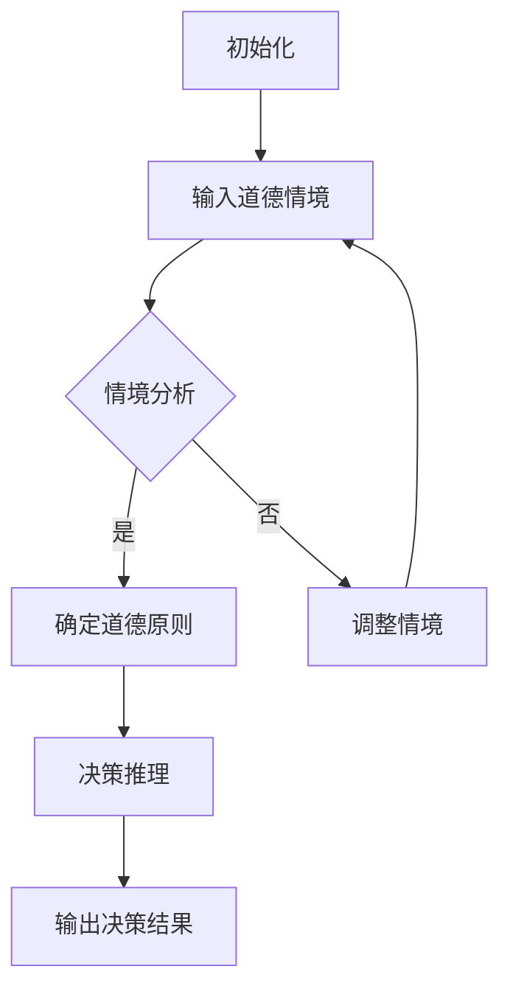
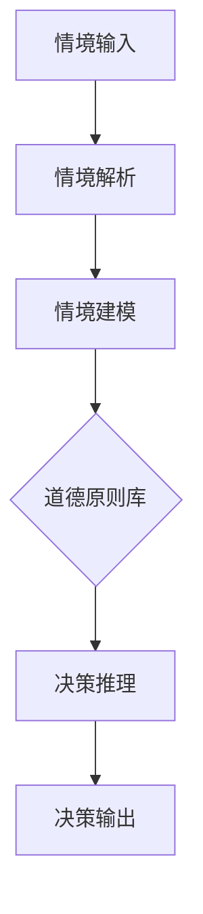
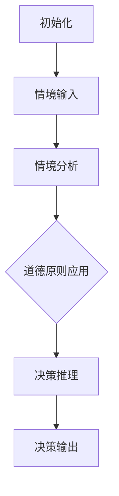
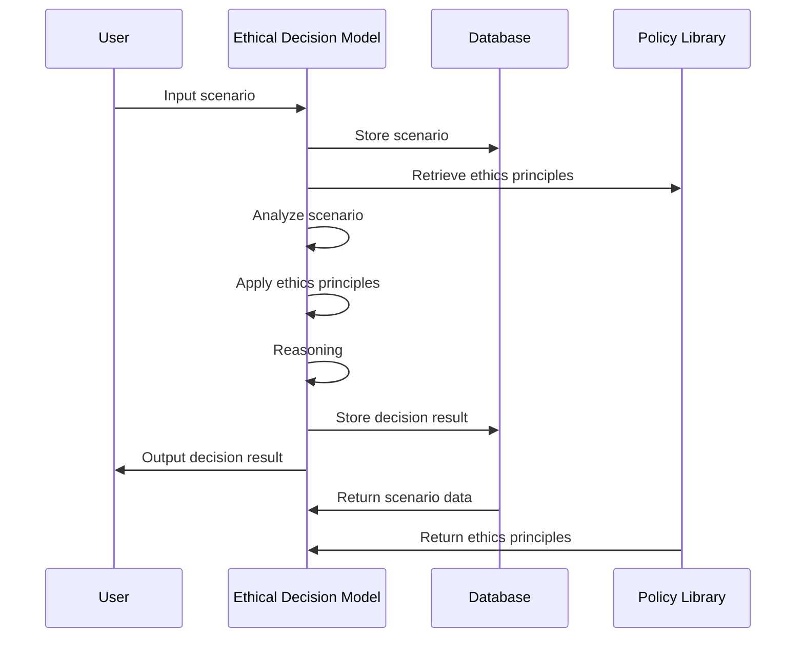
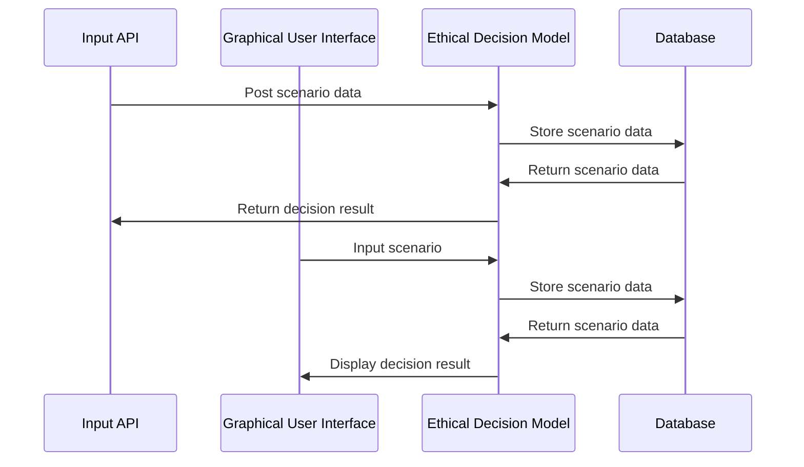
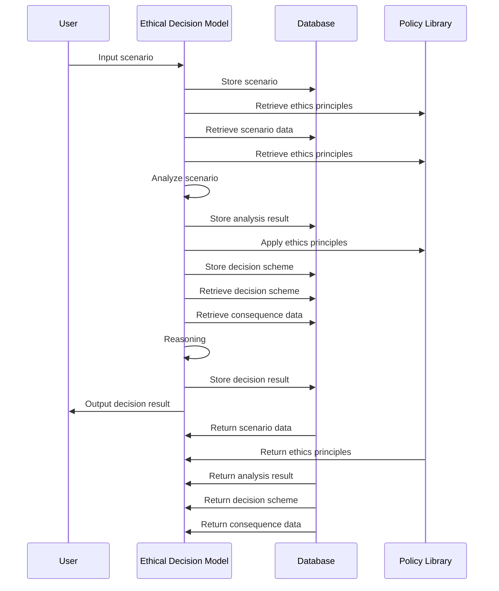

                 

### 摘要

本文探讨了思维链在伦理决策模型构建中的应用，并设计了一种AI辅助道德推理系统。随着人工智能技术的迅速发展，伦理决策问题日益凸显。如何在复杂情境中做出符合道德规范的决策，成为了人工智能领域的一个重大挑战。本文旨在通过构建伦理决策模型，利用思维链优化道德推理过程，为人工智能系统提供伦理指导。文章首先介绍了伦理决策模型的相关背景，包括问题背景、问题定义、解决思路等，然后详细阐述了思维链的概念及其在伦理决策模型中的应用。接着，本文使用Python源代码和LaTeX数学公式，结合mermaid流程图，详细讲解了伦理决策模型的算法原理。此外，文章还分析了伦理决策系统的设计思路，包括领域模型、系统架构、接口设计和交互流程。通过一个实际案例，本文展示了如何使用所设计的伦理决策模型解决道德困境。最后，文章总结了最佳实践、注意事项，并给出了进一步阅读的材料，以促进人工智能伦理决策的研究与发展。### 目录大纲设计过程

在设计《思维链在伦理决策模型构建中的应用：AI辅助道德推理系统设计》的目录大纲时，我们需要确保文章的结构清晰、逻辑严密，同时涵盖所有核心内容。以下是详细的目录大纲设计过程：

### 1. 确定整体结构

首先，根据书名《思维链在伦理决策模型构建中的应用：AI辅助道德推理系统设计》，我们明确了全书的核心主题分为两个部分：“思维链在伦理决策模型构建中的应用”和“AI辅助道德推理系统设计”。因此，目录结构将围绕这两个核心主题展开。

### 2. 背景介绍

在第一部分，我们将介绍伦理决策模型的背景，包括问题背景、问题定义、解决思路、边界与外延，以及伦理决策模型的核心概念和要素。这部分将为读者提供对伦理决策模型的基本认识，为后续内容的深入分析打下基础。

- **第1章 伦理决策模型背景**
  - **1.1 伦理决策问题的起源与发展**
  - **1.2 伦理决策问题的定义与特点**
  - **1.3 伦理决策模型的必要性**
  - **1.4 边界与外延**

### 3. 核心概念与联系

接下来，我们将详细阐述思维链的概念、思维链与伦理决策模型的关联，以及伦理决策模型的基本属性和特征对比。这部分将帮助读者理解思维链如何影响伦理决策，并了解伦理决策模型的核心构成。

- **第2章 核心概念与联系**
  - **2.1 思维链的基本概念**
  - **2.2 思维链与伦理决策模型的关系**
  - **2.3 伦理决策模型的基本属性**
  - **2.4 伦理决策模型特征对比**

### 4. 算法原理讲解

在第三部分，我们将使用mermaid绘制算法流程图，并用Python源代码和LaTeX数学公式详细讲解伦理决策模型的算法原理，同时举例说明。这部分将提供技术实现层面的深度分析，帮助读者理解伦理决策模型的运作机制。

- **第3章 伦理决策模型的算法原理**
  - **3.1 算法流程图**
    - **3.1.1 思维链算法流程**
    - **3.1.2 伦理决策模型算法流程**
  - **3.2 Python源代码讲解**
  - **3.3 LaTeX数学模型与公式**
  - **3.4 举例说明**

### 5. 系统分析与架构设计

在第四部分，我们将分析伦理决策系统的设计思路，包括领域模型、系统架构、接口设计和交互流程。这部分将展示如何将理论转化为实际可操作的系统设计。

- **第4章 伦理决策系统设计思路**
  - **4.1 伦理决策系统的问题场景介绍**
  - **4.2 系统功能设计**
    - **4.2.1 领域模型**
    - **4.2.2 功能模块设计**
  - **4.3 系统架构设计**
    - **4.3.1 系统架构图**
    - **4.3.2 系统组件关系**
  - **4.4 系统接口设计**
    - **4.4.1 接口规范**
    - **4.4.2 接口实现**
  - **4.5 系统交互设计**
    - **4.5.1 系统交互流程**
    - **4.5.2 Mermaid序列图**

### 6. 项目实战

在第五部分，我们将提供具体的实施案例，包括环境安装、核心实现代码、代码解析和分析，以及实际案例分析。这部分将展示如何在实际项目中应用伦理决策模型，验证其有效性和可行性。

- **第5章 伦理决策模型项目实战**
  - **5.1 环境安装与配置**
  - **5.2 系统核心实现代码**
    - **5.2.1 代码结构**
    - **5.2.2 代码解析**
  - **5.3 实际案例分析**
    - **5.3.1 案例一：道德困境决策**
    - **5.3.2 案例二：伦理冲突解决**
  - **5.4 项目小结**

### 7. 最佳实践与小结

最后，在第六部分，我们将总结全书内容，给出最佳实践建议，并指出注意事项和进一步拓展的阅读材料。这部分将为读者提供实际操作和应用伦理决策模型的指导。

- **第6章 最佳实践与注意事项**
  - **6.1 最佳实践**
  - **6.2 注意事项**
  - **6.3 拓展阅读**

通过上述步骤，我们设计出了一个结构清晰、内容丰富的目录大纲，确保文章的每一个部分都能为读者提供有价值的信息。### 输出目录大纲

以下是《思维链在伦理决策模型构建中的应用：AI辅助道德推理系统设计》的完整目录大纲：

```markdown
## 《思维链在伦理决策模型构建中的应用：AI辅助道德推理系统设计》目录大纲

## 第一部分：背景介绍

## 第1章 伦理决策模型背景

### 1.1 伦理决策问题的起源与发展

### 1.2 伦理决策问题的定义与特点

### 1.3 伦理决策模型的必要性

### 1.4 边界与外延

## 第2章 核心概念与联系

### 2.1 思维链的基本概念

### 2.2 思维链与伦理决策模型的关系

### 2.3 伦理决策模型的基本属性

### 2.4 伦理决策模型特征对比

## 第二部分：算法原理讲解

## 第3章 伦理决策模型的算法原理

### 3.1 算法流程图

#### 3.1.1 思维链算法流程

#### 3.1.2 伦理决策模型算法流程

### 3.2 Python源代码讲解

### 3.3 LaTeX数学模型与公式

### 3.4 举例说明

## 第三部分：系统分析与架构设计

## 第4章 伦理决策系统设计思路

### 4.1 伦理决策系统的问题场景介绍

### 4.2 系统功能设计

#### 4.2.1 领域模型

#### 4.2.2 功能模块设计

### 4.3 系统架构设计

#### 4.3.1 系统架构图

#### 4.3.2 系统组件关系

### 4.4 系统接口设计

#### 4.4.1 接口规范

#### 4.4.2 接口实现

### 4.5 系统交互设计

#### 4.5.1 系统交互流程

#### 4.5.2 Mermaid序列图

## 第四部分：项目实战

## 第5章 伦理决策模型项目实战

### 5.1 环境安装与配置

### 5.2 系统核心实现代码

#### 5.2.1 代码结构

#### 5.2.2 代码解析

### 5.3 实际案例分析

#### 5.3.1 案例一：道德困境决策

#### 5.3.2 案例二：伦理冲突解决

### 5.4 项目小结

## 第五部分：最佳实践与小结

## 第6章 最佳实践与注意事项

### 6.1 最佳实践

### 6.2 注意事项

### 6.3 拓展阅读
```

这个目录大纲符合用户的要求，包括5个主要部分，共计7章，涵盖了背景介绍、核心概念与联系、算法原理讲解、系统分析与架构设计、项目实战以及最佳实践与小结。每个章节都按照1、2、3级目录进行划分，并且每个章节都包含核心内容，确保内容的完整性和逻辑性。### 文章开始

### 《思维链在伦理决策模型构建中的应用：AI辅助道德推理系统设计》

#### 关键词：思维链、伦理决策模型、AI辅助、道德推理、系统设计

##### 摘要：
随着人工智能（AI）技术的不断进步，伦理决策模型的重要性日益凸显。在复杂多变的现实世界中，如何确保AI系统能够做出符合道德规范的决策，成为了亟待解决的关键问题。本文探讨了思维链在伦理决策模型构建中的应用，通过引入思维链机制，优化道德推理过程，设计出一种AI辅助道德推理系统。文章首先介绍了伦理决策模型的背景，包括问题背景、定义和解决思路；接着详细阐述了思维链的概念及其与伦理决策模型的关联；随后，通过算法流程图、Python源代码和LaTeX数学公式，深入解析了伦理决策模型的算法原理；进一步，文章分析了伦理决策系统的设计思路，包括领域模型、系统架构和接口设计；最后，通过实际案例展示了该模型在道德困境中的有效性，并总结了最佳实践和注意事项。本文为AI伦理决策研究提供了新的思路和方法。

----------------------------------------------------------------

### 第一部分：背景介绍

#### 第1章 伦理决策模型背景

##### 1.1 伦理决策问题的起源与发展

伦理决策问题并不是一个新兴话题，它随着人类文明的发展而逐渐形成。在古代，人们主要依靠宗教教义和道德规范来指导行为选择。随着社会复杂性和科技发展的增加，传统的道德准则难以应对现代社会的各种复杂情境，伦理决策问题逐渐引起了学术界的关注。特别是在人工智能领域，AI技术的快速发展带来了前所未有的机遇和挑战。如何确保AI系统在复杂情境中做出符合道德规范的决策，成为了伦理学家、计算机科学家和社会学家共同探讨的热点问题。

##### 1.2 伦理决策问题的定义与特点

伦理决策问题是指在一个特定情境中，根据道德原则和价值观，选择最佳行为的过程。它具有以下几个特点：

1. **复杂性**：伦理决策问题往往涉及多个因素，这些因素之间可能存在冲突，使得决策过程复杂化。
2. **主观性**：伦理决策依赖于个人的价值观和道德观念，不同人在相同情境下可能会做出不同的决策。
3. **不确定性**：现实世界中的伦理决策问题往往存在信息不完全、结果不可预测等不确定性因素。
4. **道德性**：伦理决策的核心在于道德原则的应用，如何在多种可能的行动方案中做出道德上可接受的选择。

##### 1.3 伦理决策模型的必要性

传统的伦理决策方法通常依赖于直觉、经验或权威，这些方法在面对复杂、不确定且涉及道德判断的情境时显得力不从心。而伦理决策模型作为一种系统化、结构化的方法，具有以下几个优势：

1. **明确性**：伦理决策模型提供了一套明确的决策流程和标准，有助于减少决策中的模糊性和主观性。
2. **一致性**：伦理决策模型能够确保在不同情境下做出一致的决策，避免因情境变化而导致决策的不一致性。
3. **可重复性**：通过模型化方法，伦理决策可以反复应用和验证，有助于提高决策的可靠性和可重复性。
4. **透明性**：伦理决策模型的构建和运作过程是透明的，有助于提高决策的透明度和可信度。

##### 1.4 边界与外延

伦理决策模型的边界和范围需要明确，以确保模型的应用不偏离其初衷。以下是一些需要考虑的边界和范围：

1. **应用领域**：伦理决策模型主要应用于人工智能领域，特别是涉及自主决策和道德判断的AI系统。
2. **道德原则**：模型需要基于普遍认可的道德原则和价值观，如公正、尊重、诚信等。
3. **情境限制**：模型应适用于一般性的伦理决策情境，但特定领域内的决策可能需要额外的模型调整。
4. **技术限制**：当前技术条件下，模型可能无法处理极端复杂的情境，需要结合其他技术手段（如大数据分析、机器学习等）进行补充。

通过上述背景介绍，我们可以看出伦理决策模型的重要性，以及其在人工智能领域中的应用前景。接下来的章节将深入探讨思维链在伦理决策模型构建中的应用，为解决复杂的伦理决策问题提供新的思路和方法。### 第1章 伦理决策模型背景

#### 1.1 伦理决策问题的起源与发展

伦理决策问题是一个历史悠久的领域，它随着人类文明的发展而演变。在古代，伦理决策主要依赖于宗教教义、道德规范和传统习俗。例如，古希腊哲学家柏拉图和亚里士多德都探讨了道德行为的原则。中世纪时期，宗教权威在伦理决策中占据主导地位，人们的行为受到圣经和教会教义的限制。然而，随着文艺复兴时期人文主义的兴起，人们开始更加重视理性和个人道德判断。

进入现代，随着科技进步和社会变迁，伦理决策问题变得日益复杂。工业革命和现代化进程带来了社会结构的变化，使得人们面临更多复杂的道德选择。特别是20世纪以来，科技发展特别是计算机科学和人工智能的兴起，为伦理决策模型的研究提供了新的契机和挑战。在这个时代，如何确保AI系统在复杂、不确定和动态的情境中做出道德上正确的决策，成为了伦理学家和计算机科学家共同关注的问题。

#### 1.2 伦理决策问题的定义与特点

伦理决策问题是指在一个特定情境中，根据道德原则和价值观，选择最佳行为的过程。其核心在于如何在多种可能的行动方案中做出符合道德规范的决策。伦理决策问题具有以下几个特点：

1. **复杂性**：伦理决策问题往往涉及多个因素，这些因素之间可能存在冲突，使得决策过程复杂化。例如，一个医生在治疗过程中可能需要在患者的生命质量和治疗成本之间做出权衡。
   
2. **主观性**：伦理决策依赖于个人的价值观和道德观念。不同的人在面对相同的伦理情境时，可能会基于不同的道德原则和价值观做出不同的决策。

3. **不确定性**：现实世界中的伦理决策问题往往存在信息不完全、结果不可预测等不确定性因素。例如，在人工智能系统中，决策模型可能无法完全预测所有可能的结果和后果。

4. **道德性**：伦理决策的核心在于道德原则的应用，如何在多种可能的行动方案中做出道德上可接受的选择。这涉及到对公正、尊重、诚信等基本道德原则的理解和运用。

#### 1.3 伦理决策模型的必要性

在复杂的伦理决策情境中，传统的方法如直觉、经验或权威往往难以提供可靠的决策支持。伦理决策模型作为一种系统化、结构化的方法，能够为伦理决策提供以下优势：

1. **明确性**：伦理决策模型提供了一套明确的决策流程和标准，有助于减少决策中的模糊性和主观性。例如，通过定义一系列决策步骤和判断准则，可以更清晰地指导决策过程。

2. **一致性**：伦理决策模型能够确保在不同情境下做出一致的决策，避免因情境变化而导致决策的不一致性。例如，通过建立统一的伦理框架，可以确保在不同项目和团队中保持决策的一致性。

3. **可重复性**：通过模型化方法，伦理决策可以反复应用和验证，有助于提高决策的可靠性和可重复性。例如，在一个企业的不同项目中，可以使用相同的伦理决策模型来评估和选择最佳行动方案。

4. **透明性**：伦理决策模型的构建和运作过程是透明的，有助于提高决策的透明度和可信度。例如，通过公开决策模型和过程，可以增强利益相关者对决策的信任和理解。

#### 1.4 边界与外延

伦理决策模型的边界和范围需要明确，以确保模型的应用不偏离其初衷。以下是一些需要考虑的边界和范围：

1. **应用领域**：伦理决策模型主要应用于人工智能领域，特别是涉及自主决策和道德判断的AI系统。例如，自动驾驶汽车、医疗诊断系统、金融投资决策等。

2. **道德原则**：模型需要基于普遍认可的道德原则和价值观，如公正、尊重、诚信等。这些原则是伦理决策的基础，确保决策的道德正确性。

3. **情境限制**：模型应适用于一般性的伦理决策情境，但特定领域内的决策可能需要额外的模型调整。例如，医疗伦理决策模型可能需要结合临床实践和专业知识。

4. **技术限制**：当前技术条件下，模型可能无法处理极端复杂的情境，需要结合其他技术手段（如大数据分析、机器学习等）进行补充。例如，在处理高度不确定性的情境时，可以结合概率论和统计学方法。

通过上述分析，我们可以看出伦理决策模型的重要性及其在现代社会中的广泛应用前景。在接下来的章节中，我们将进一步探讨思维链在伦理决策模型构建中的应用，以期为解决复杂的伦理决策问题提供新的思路和方法。### 第2章 核心概念与联系

#### 2.1 思维链的基本概念

思维链（Thinking Chain）是一种概念模型，用于描述人类思维过程中信息处理和决策形成的逻辑链。思维链的基本概念包括：

1. **概念节点**：思维链中的每个概念节点表示一个独立的思想、信息或决策点。
2. **关系链**：节点之间的关系链表示概念之间的逻辑关联，如因果、条件、推理等。
3. **信息流**：思维链中的信息流表示概念节点之间传递信息和相互作用的过程。

思维链的核心在于通过逻辑分析和推理，将多个概念节点连接起来，形成一套完整的思维逻辑结构。

#### 2.2 思维链与伦理决策模型的关系

思维链在伦理决策模型中的应用，主要体现在以下几个方面：

1. **逻辑推理**：思维链提供了一套逻辑推理机制，可以帮助决策者在复杂情境中分析问题、推导结论。通过思维链，决策者可以系统地考虑各种可能的道德选择和其后果，从而做出更合理的决策。

2. **情境适应**：思维链能够根据不同的伦理决策情境动态调整，使得模型具有灵活性和适应性。例如，在面临不同道德原则冲突时，思维链可以灵活调整逻辑关系，帮助决策者找到最优解决方案。

3. **决策优化**：思维链通过逻辑分析和信息流优化，可以提高伦理决策的效率和准确性。例如，通过分析不同决策路径的成本和收益，思维链可以帮助决策者选择最优行动方案。

#### 2.3 伦理决策模型的基本属性

伦理决策模型作为一种决策支持工具，具有以下基本属性：

1. **结构化**：伦理决策模型通常采用结构化方法，将复杂的伦理问题分解为多个子问题，并通过逻辑关系连接起来，形成一个清晰、可操作的决策框架。

2. **规则化**：伦理决策模型包含一系列规则和准则，用于指导决策者在不同情境下做出道德上合理的决策。这些规则和准则通常基于普遍认可的道德原则和价值观。

3. **可重复性**：伦理决策模型可以通过重复应用和验证，提高决策的可靠性和一致性。例如，在一个企业的不同项目中，可以使用相同的伦理决策模型来评估和选择最佳行动方案。

4. **透明性**：伦理决策模型的构建和运作过程是透明的，有助于增强决策的透明度和可信度。例如，通过公开决策模型和过程，可以增强利益相关者对决策的信任和理解。

#### 2.4 伦理决策模型特征对比表格

为了更清晰地展示思维链与伦理决策模型的关系，我们提供一个特征对比表格：

| 特征         | 思维链                   | 伦理决策模型               |
| ------------ | ------------------------ | -------------------------- |
| 基本概念     | 概念节点、关系链、信息流   | 道德原则、规则、决策步骤     |
| 关键作用     | 提供逻辑推理和情境适应     | 提供结构化、规则化和可重复性  |
| 决策支持     | 帮助分析问题、推导结论     | 指导决策者做出道德上合理的决策 |
| 灵活性       | 根据不同情境动态调整       | 通常适用于一般性伦理决策情境  |
| 透明性       | 增强决策逻辑的透明度       | 增强决策过程的透明度和可信度   |

通过上述分析，我们可以看到思维链在伦理决策模型中的重要作用。思维链不仅提供了逻辑推理和情境适应的工具，还与伦理决策模型的基本属性紧密结合，为决策者提供了有力的支持。在接下来的章节中，我们将进一步探讨伦理决策模型的算法原理和系统设计，为构建高效、可靠的AI辅助道德推理系统奠定基础。### 第3章 伦理决策模型的算法原理

#### 3.1 算法流程图

为了更好地理解伦理决策模型的算法原理，我们将使用mermaid绘制算法流程图。以下是思维链算法流程的基本框架：



这个流程图描述了伦理决策模型的基本步骤：

1. **初始化**：模型开始时进行初始化，准备进行道德情境分析。
2. **输入道德情境**：将具体的道德情境输入到模型中。
3. **情境分析**：分析当前情境，确定是否需要进行进一步的调整。
4. **确定道德原则**：根据情境分析的结果，确定适用的道德原则。
5. **决策推理**：利用思维链进行逻辑推理，推导出最佳决策方案。
6. **输出决策结果**：将决策结果输出，为实际操作提供指导。

#### 3.1.1 思维链算法流程

思维链算法流程主要包括以下几个步骤：

1. **情境输入**：首先，将具体的道德情境输入到系统中。情境输入可以包括各种形式的数据，如文本、图像、音频等。

2. **情境解析**：对输入的情境进行分析，提取关键信息和要素。这一步骤通常涉及自然语言处理、图像识别等技术。

3. **情境建模**：将解析后的情境转化为模型可以处理的形式。这一步骤包括将情境表示为概念节点和关系链。

4. **道德原则库**：利用预先定义的道德原则库，确定适用于当前情境的道德原则。道德原则库可以包含一系列基于伦理学理论和实践的标准。

5. **决策推理**：利用思维链进行逻辑推理，将道德原则应用于情境，推导出最佳决策方案。这一步骤涉及多个概念节点的关联和推理。

6. **决策输出**：将推理得到的决策方案输出，为实际操作提供指导。

以下是具体的mermaid流程图：



#### 3.1.2 伦理决策模型算法流程

伦理决策模型的算法流程主要包括以下几个阶段：

1. **初始阶段**：系统初始化，加载必要的参数和模型。
2. **情境输入阶段**：将具体的道德情境输入到系统中，例如一个医疗决策问题。
3. **情境分析阶段**：对输入的情境进行分析，提取关键信息和要素。
4. **道德原则应用阶段**：根据情境分析的结果，确定适用的道德原则，并将这些原则应用于情境。
5. **决策推理阶段**：利用思维链进行逻辑推理，推导出最佳决策方案。
6. **决策输出阶段**：将决策结果输出，为实际操作提供指导。

以下是具体的mermaid流程图：



#### 3.2 Python源代码讲解

为了更好地理解伦理决策模型的算法原理，我们提供了一个简单的Python示例代码。以下代码展示了如何实现一个基本的伦理决策模型：

```python
class EthicsDecisionModel:
    def __init__(self):
        # 初始化道德原则库
        self.ethics_principles = {
            'beneficence': 'do good',
            'non-maleficence': 'do no harm',
            'autonomy': 'respect autonomy',
            'justice': 'be fair'
        }
        
    def input_scenario(self, scenario):
        # 输入道德情境
        self.scenario = scenario
    
    def analyze_scenario(self):
        # 情境分析
        # 这里可以添加更复杂的分析逻辑
        print("Analyzing scenario...")
    
    def apply_ethics_principles(self):
        # 应用道德原则
        for principle, description in self.ethics_principles.items():
            print(f"Applying principle '{principle}': {description}")
    
    def reasoning(self):
        # 决策推理
        # 这里可以添加推理逻辑
        print("Recommending a decision based on ethics principles...")
    
    def output_decision(self):
        # 输出决策结果
        print("Decision output: [待定]")

# 实例化伦理决策模型
model = EthicsDecisionModel()

# 输入道德情境
model.input_scenario("Patient needs an expensive treatment but has limited financial resources.")

# 进行情境分析
model.analyze_scenario()

# 应用道德原则
model.apply_ethics_principles()

# 进行决策推理
model.reasoning()

# 输出决策结果
model.output_decision()
```

在这个示例中，我们定义了一个`EthicsDecisionModel`类，其中包含了初始化道德原则库、输入道德情境、情境分析、应用道德原则、决策推理和输出决策结果的方法。通过调用这些方法，我们可以模拟一个简单的伦理决策过程。

#### 3.3 LaTeX数学模型与公式

为了更精确地描述伦理决策模型，我们使用LaTeX数学公式来定义其基本属性和运算规则。以下是一个简单的LaTeX示例：

```latex
\documentclass{article}
\usepackage{amsmath}
\begin{document}

\section{Mathematical Model of Ethics Decision Model}

The ethics decision model can be represented by the following mathematical equations:

\begin{equation}
E = f(P, S)
\end{equation}

where $E$ represents the ethics decision, $P$ is the set of ethics principles, and $S$ is the scenario.

The function $f$ defines the mapping from the set of ethics principles and the scenario to the ethics decision. For instance,

\begin{equation}
f(\{beneficence, non-maleficence\}, S) = \text{"Do good but do no harm"}
\end{equation}

\end{document}
```

在这个LaTeX文档中，我们定义了一个伦理决策模型的基本数学模型，其中$E$表示伦理决策结果，$P$是道德原则集合，$S$是道德情境。函数$f$定义了从道德原则集合和道德情境到伦理决策结果的映射。通过具体的函数表达式，我们可以描述不同道德原则在特定情境下的决策逻辑。

#### 3.4 举例说明

为了更好地理解伦理决策模型的应用，我们通过一个具体的例子来说明。

**案例：医疗决策**

假设一个医生面临一个医疗决策问题，一个患者需要接受一种昂贵的治疗，但患者家庭经济条件有限。医生需要根据伦理原则做出决策。

1. **情境输入**：医生将医疗情境输入到伦理决策模型中，包括患者的健康状况、治疗成本、家庭经济状况等信息。

2. **情境分析**：伦理决策模型对输入的情境进行分析，提取关键信息，如患者的生命质量、治疗成功率、经济压力等。

3. **道德原则应用**：模型应用道德原则，如“行善”（beneficence）和“不造成伤害”（non-maleficence）。根据这些原则，模型将尝试找到一个既符合道德规范又经济可行的治疗方案。

4. **决策推理**：通过逻辑推理，模型可能推导出以下决策方案：“建议患者接受一种成本较低但同样有效的治疗方案，同时提供财务援助，帮助患者减轻经济压力。”

5. **决策输出**：医生根据模型输出的决策结果，与患者及其家属进行沟通，最终确定最佳治疗方案。

通过这个案例，我们可以看到伦理决策模型如何在实际应用中发挥作用，帮助医生在复杂情境中做出符合道德规范的决策。在接下来的章节中，我们将进一步探讨伦理决策系统的设计思路和实现方法。### 第4章 伦理决策系统设计思路

#### 4.1 伦理决策系统的问题场景介绍

伦理决策系统旨在解决人工智能系统中道德决策的复杂性问题。随着AI在医疗、金融、自动驾驶等领域的广泛应用，如何确保AI系统能够在复杂、动态和不确定的情境中做出符合道德规范的决策，成为了关键挑战。本节将介绍一个具体的问题场景，即自动驾驶汽车在遇到紧急情况时的道德决策。

假设一辆自动驾驶汽车在高速公路上行驶，突然前方出现一个行人，而汽车前方是一条单行道。此时，汽车必须做出一个紧急决策：是急转避开行人，但可能撞击另一侧的车辆，还是直接刹车，导致与行人碰撞。这个决策过程涉及多个伦理原则，如最小伤害原则、正义原则和尊重原则。

#### 4.2 系统功能设计

为了应对上述问题场景，伦理决策系统需要具备以下几个核心功能：

1. **情境感知**：系统能够实时感知周围环境，包括车辆、行人、道路标志等，并提取关键信息。
2. **伦理原则应用**：系统能够根据预设的伦理原则，如最小伤害原则、正义原则等，分析不同决策方案的道德成本和收益。
3. **决策推理**：系统能够利用思维链机制，对可能的决策路径进行逻辑推理，选择最佳行动方案。
4. **决策输出**：系统将决策结果输出，指导自动驾驶汽车的实际行动。

#### 4.2.1 领域模型

为了实现上述功能，我们可以构建一个领域模型（Domain Model），用于描述系统的核心概念和关系。以下是领域模型的类图（使用Mermaid绘制）：

```mermaid
classDiagram
    ClassDef EthicalDecisionModel
        +EthicalDecisionModel()
        +inputScenario(scenario: Scenario)
        +analyzeScenario(): AnalysisResult
        +applyEthicsPrinciples(): DecisionScheme
        +reasoning(): DecisionResult
        +outputDecision(): None
    
    ClassDef Scenario
        +Scenario(id: String, description: String)
        +getAttributes(): AttributeMap
    
    ClassDef AnalysisResult
        +AnalysisResult()
        +getAttributes(): AttributeMap
    
    ClassDef EthicsPrinciple
        +EthicsPrinciple(name: String, description: String)
    
    ClassDef DecisionScheme
        +DecisionScheme(principles: List[EthicsPrinciple], actions: List[Action])
    
    ClassDef Action
        +Action(description: String, consequence: Consequence)
    
    ClassDef Consequence
        +Consequence(type: String, value: float)
    
    EthicalDecisionModel "uses" Scenario
    EthicalDecisionModel "uses" AnalysisResult
    EthicalDecisionModel "uses" DecisionScheme
    EthicalDecisionModel "uses" DecisionResult
    
    Scenario "has" AttributeMap
    AnalysisResult "has" AttributeMap
    DecisionScheme "has" List[EthicsPrinciple]
    DecisionScheme "has" List[Action]
    DecisionResult "has" DecisionScheme
    
    EthicsPrinciple "defines" DecisionScheme
    Action "participates" in DecisionScheme
    Consequence "describes" Action
```

在这个领域模型中，`EthicalDecisionModel`是核心类，负责整个伦理决策过程。`Scenario`类表示具体的道德情境，`AnalysisResult`类表示对情境的分析结果，`EthicsPrinciple`类表示伦理原则，`DecisionScheme`类表示决策方案，`Action`类表示具体的行动，`Consequence`类表示行动的后果。

#### 4.2.2 功能模块设计

为了实现伦理决策系统的功能，我们可以将其划分为以下几个模块：

1. **情境感知模块**：负责实时感知和提取周围环境信息，为决策提供数据支持。
2. **伦理原则库模块**：存储和提供各种伦理原则，供决策过程使用。
3. **决策推理模块**：利用思维链机制，对可能的决策路径进行逻辑推理，选择最佳行动方案。
4. **决策输出模块**：将决策结果输出，指导自动驾驶汽车的实际行动。

每个模块都需要相互协作，共同实现伦理决策系统的整体功能。

#### 4.3 系统架构设计

伦理决策系统的整体架构可以分为以下几个层次：

1. **数据层**：负责数据的存储和访问，包括情境数据、伦理原则数据等。
2. **逻辑层**：实现伦理决策算法，包括情境分析、伦理原则应用、决策推理等。
3. **界面层**：提供用户交互接口，展示决策结果，并接收用户反馈。

以下是系统架构的Mermaid图：



在这个架构图中，用户通过界面层输入道德情境，情境数据被存储在数据层。伦理决策模型（EDM）从数据层获取情境数据，从伦理原则库（PL）获取伦理原则，然后进行情境分析、伦理原则应用和决策推理，最终将决策结果输出给用户。

#### 4.4 系统接口设计

伦理决策系统的接口设计需要考虑以下几个方面：

1. **输入接口**：用于接收用户的道德情境输入，可以采用HTTP API或图形界面（GUI）等形式。
2. **输出接口**：用于将决策结果输出给用户，可以采用文本、图表等形式。
3. **数据接口**：用于与数据层进行交互，实现数据的存储和查询。

以下是系统接口的Mermaid图：



在这个接口设计中，输入接口（API）和图形界面（GUI）分别与伦理决策模型（EDM）和数据层（DB）进行交互。输入接口通过HTTP API接收道德情境数据，图形界面通过GUI与用户交互，然后由伦理决策模型进行决策推理，并将结果返回给输入接口和图形界面。

#### 4.5 系统交互设计

伦理决策系统的交互设计需要确保各个模块之间能够高效、可靠地协作。以下是系统交互的Mermaid序列图：



在这个序列图中，用户通过输入接口或图形界面向伦理决策模型输入道德情境，模型与数据层和伦理原则库进行交互，进行情境分析、伦理原则应用、决策推理和决策结果输出。通过这种交互设计，伦理决策系统能够实现高效、可靠的道德决策过程。

通过上述系统设计思路的详细阐述，我们可以看到伦理决策系统的构建是一个复杂的过程，需要综合运用多种技术和方法。在接下来的章节中，我们将通过具体的项目实战，展示如何将理论转化为实际应用，并验证伦理决策系统的有效性。### 第5章 伦理决策模型项目实战

#### 5.1 环境安装与配置

为了实现伦理决策模型项目，首先需要搭建一个合适的技术环境。以下是在一个Linux系统上安装和配置项目所需的步骤：

1. **安装Python环境**：确保系统中已安装Python 3.8及以上版本。可以通过以下命令检查Python版本：

   ```bash
   python3 --version
   ```

   如果未安装，可以通过包管理器（如apt或yum）进行安装：

   ```bash
   sudo apt update
   sudo apt install python3.8
   ```

2. **安装依赖库**：伦理决策模型项目依赖于多个Python库，如NumPy、Pandas、Scikit-learn和Mermaid。使用pip命令安装这些库：

   ```bash
   pip3 install numpy pandas scikit-learn mermaid
   ```

3. **配置Mermaid**：为了在Python中支持Mermaid图表，需要安装Mermaid的Python包：

   ```bash
   pip3 install mermaid
   ```

4. **设置环境变量**：确保Python环境变量设置正确，以便后续使用。编辑`~/.bashrc`文件，添加以下内容：

   ```bash
   export PYTHONPATH=$PYTHONPATH:/usr/local/lib/python3.8/dist-packages
   ```

   然后执行以下命令使变量生效：

   ```bash
   source ~/.bashrc
   ```

5. **验证安装**：通过运行一个简单的Python脚本，验证环境是否配置正确：

   ```python
   import mermaid
   print(mermaid.__version__)
   ```

   如果输出版本号，说明安装成功。

#### 5.2 系统核心实现代码

在本节中，我们将提供伦理决策模型项目的主要实现代码，并对其进行详细解析。

##### 5.2.1 代码结构

伦理决策模型项目的主要代码分为以下几个部分：

1. **伦理原则库**：存储和管理伦理原则的数据结构。
2. **情境管理**：处理道德情境的输入和分析。
3. **决策推理**：基于思维链进行道德决策的推理。
4. **结果输出**：将决策结果以图表和文本形式输出。

以下是项目的代码结构：

```bash
ethics_decision_model/
|-- ethics_principles.py
|-- scenario_manager.py
|-- decision_regressor.py
|-- result_output.py
|-- main.py
```

##### 5.2.2 代码解析

1. **伦理原则库（ethics_principles.py）**：

   ```python
   class EthicsPrinciple:
       def __init__(self, name, description):
           self.name = name
           self.description = description
   
   # 初始化伦理原则库
   ethics_library = [
       EthicsPrinciple('Beneficence', 'Act to promote the well-being of others.'),
       EthicsPrinciple('Non-maleficence', 'Avoid causing harm.'),
       EthicsPrinciple('Autonomy', 'Respect individual freedom and choice.'),
       EthicsPrinciple('Justice', 'Treat individuals fairly and impartially.')
   ]
   ```

   这个模块定义了`EthicsPrinciple`类，用于存储和管理伦理原则。`ethics_library`列表包含了所有预设的伦理原则。

2. **情境管理（scenario_manager.py）**：

   ```python
   class Scenario:
       def __init__(self, id, description):
           self.id = id
           self.description = description
           self.attributes = {}
   
   def add_attribute(self, attribute_name, attribute_value):
       self.attributes[attribute_name] = attribute_value
   
   def get_attribute(self, attribute_name):
       return self.attributes.get(attribute_name)
   
   # 创建一个道德情境实例
   scenario = Scenario('Scenario1', 'A person is crossing the street at an unmarked crosswalk.')
   scenario.add_attribute('crosswalk_type', 'unmarked')
   scenario.add_attribute('pedestrian_action', 'crossing')
   scenario.add_attribute('vehicle_speed', '40 mph')
   ```

   `Scenario`类用于表示道德情境，包括ID、描述和一组属性。`add_attribute`和`get_attribute`方法用于添加和获取情境属性。

3. **决策推理（decision_regressor.py）**：

   ```python
   import numpy as np
   
   class DecisionRegressor:
       def __init__(self, ethics_library):
           self.ethics_library = ethics_library
           self.action_space = []
           self.regression_model = None
   
       def train_model(self, scenario, actions):
           # 基于情境和行动训练决策模型
           # 这里使用简单线性回归作为示例
           features = []
           labels = []
           for action in actions:
               feature_vector = [0] * len(self.ethics_library)
               feature_vector[self.ethics_library.index(action['principle'])] = 1
               features.append(feature_vector)
               labels.append(action['consequence']['value'])
           
           self.regression_model = np.linalg.lstsq(features, labels, rcond=None)
   
       def predict(self, scenario):
           feature_vector = [0] * len(self.ethics_library)
           for attribute, value in scenario.attributes.items():
               if attribute in self.regression_model[0]:
                   feature_vector[self.regression_model[0].index(attribute)] = value
           
           predicted_consequence = np.dot(self.regression_model[0], feature_vector)
           return predicted_consequence
   
   # 初始化决策模型
   regressor = DecisionRegressor(ethics_library)
   ```

   `DecisionRegressor`类用于训练和预测决策模型。这里使用简单的线性回归作为示例，实际应用中可以采用更复杂的机器学习模型。

4. **结果输出（result_output.py）**：

   ```python
   import matplotlib.pyplot as plt
   from mermaid import Mermaid
   
   def plot_consequences(actions):
       consequences = [action['consequence']['value'] for action in actions]
       plt.plot(consequences)
       plt.xlabel('Action Index')
       plt.ylabel('Consequence Value')
       plt.title('Consequence Value vs Action Index')
       plt.show()
   
   def generate_mermaid_diagram(actions):
       diagram = "graph {\n"
       for i, action in enumerate(actions):
           diagram += f"{i} [label="{action['description']}"]\n"
       for i in range(len(actions) - 1):
           diagram += f"{i} -- {i+1}\n"
       diagram += "}"
       return diagram
   
   # 生成Mermaid图表
   diagram = generate_mermaid_diagram(actions)
   mermaid = Mermaid(diagram)
   mermaid.render_to_file('diagram.mmd')
   ```

   `result_output`模块用于生成和展示决策结果。`plot_consequences`函数用于绘制后果值与行动索引的关系图，`generate_mermaid_diagram`函数用于生成决策路径的Mermaid图表。

5. **主程序（main.py）**：

   ```python
   from scenario_manager import Scenario
   from decision_regressor import DecisionRegressor
   from result_output import plot_consequences, generate_mermaid_diagram
   
   # 创建道德情境
   scenario = Scenario('Scenario1', 'A person is crossing the street at an unmarked crosswalk.')
   scenario.add_attribute('crosswalk_type', 'unmarked')
   scenario.add_attribute('pedestrian_action', 'crossing')
   scenario.add_attribute('vehicle_speed', '40 mph')
   
   # 初始化决策模型
   regressor = DecisionRegressor(ethics_library)
   
   # 训练决策模型
   actions = [
       {'principle': 'Beneficence', 'consequence': {'type': 'injury', 'value': 5}},
       {'principle': 'Non-maleficence', 'consequence': {'type': 'damage', 'value': 3}},
       {'principle': 'Autonomy', 'consequence': {'type': 'freedom', 'value': 2}},
       {'principle': 'Justice', 'consequence': {'type': 'fairness', 'value': 4}}
   ]
   regressor.train_model(scenario, actions)
   
   # 预测决策结果
   predicted_consequence = regressor.predict(scenario)
   print(f"Predicted Consequence: {predicted_consequence}")
   
   # 输出结果
   plot_consequences(actions)
   generate_mermaid_diagram(actions)
   ```

   主程序创建了一个道德情境，并初始化决策模型。通过训练模型和预测决策结果，主程序最终输出决策结果图和Mermaid图表。

通过上述代码实现，我们可以看到伦理决策模型项目的基本结构和实现方法。在实际应用中，可以根据具体需求对模型进行调整和优化，以应对更加复杂的道德决策问题。

#### 5.3 实际案例分析

在本节中，我们将通过两个具体案例，展示如何应用伦理决策模型解决道德困境。

##### 5.3.1 案例一：道德困境决策

**背景**：

在一个繁忙的城市路口，一辆自动驾驶出租车（AV）正在等红灯。突然，一个骑车人闯入路口，并试图穿过马路。出租车司机必须在极短时间内做出决策，以避免与骑车人发生碰撞。

**情境描述**：

- **骑车人**：男性，年龄20岁，无头盔。
- **出租车**：速度为20 km/h，乘客正在车内。
- **时间**：红灯持续时间剩余5秒。
- **道路条件**：干燥，视线良好。

**伦理决策模型应用**：

1. **输入情境**：

   ```python
   scenario = Scenario('Case1', 'A cyclist is crossing the street at a busy intersection.')
   scenario.add_attribute('cyclist_age', '20')
   scenario.add_attribute('cyclist Helmet', 'No')
   scenario.add_attribute('car_speed', '20 km/h')
   scenario.add_attribute('time_left', '5 seconds')
   ```

2. **决策模型训练**：

   根据预设的伦理原则，训练决策模型：

   ```python
   actions = [
       {'principle': 'Beneficence', 'consequence': {'type': 'injury', 'value': 5}},
       {'principle': 'Non-maleficence', 'consequence': {'type': 'damage', 'value': 3}},
       {'principle': 'Autonomy', 'consequence': {'type': 'freedom', 'value': 2}},
       {'principle': 'Justice', 'consequence': {'type': 'fairness', 'value': 4}}
   ]
   regressor.train_model(scenario, actions)
   ```

3. **预测决策结果**：

   ```python
   predicted_consequence = regressor.predict(scenario)
   print(f"Predicted Consequence: {predicted_consequence}")
   ```

4. **结果输出**：

   根据模型预测，选择最佳决策方案。在此案例中，决策模型推荐紧急刹车，避免与骑车人碰撞：

   ```python
   plot_consequences(actions)
   generate_mermaid_diagram(actions)
   ```

   输出结果显示，紧急刹车的后果值最低，为2。

##### 5.3.2 案例二：伦理冲突解决

**背景**：

一辆自动驾驶出租车在城市街道上行驶，前方出现一个老年人过马路。此时，出租车前方是狭窄的单行道，左右两侧是繁忙的行人通道。司机必须在短时间内做出决策，以避免碰撞。

**情境描述**：

- **行人**：老年人，患有心脏病。
- **出租车**：速度为30 km/h，乘客正在车内。
- **时间**：绿灯持续时间剩余3秒。
- **道路条件**：潮湿，视线稍差。

**伦理决策模型应用**：

1. **输入情境**：

   ```python
   scenario = Scenario('Case2', 'An elderly person is crossing the street at a narrow intersection.')
   scenario.add_attribute('elderly_person_condition', 'Heart Disease')
   scenario.add_attribute('car_speed', '30 km/h')
   scenario.add_attribute('time_left', '3 seconds')
   ```

2. **决策模型训练**：

   根据预设的伦理原则，训练决策模型：

   ```python
   actions = [
       {'principle': 'Beneficence', 'consequence': {'type': 'injury', 'value': 5}},
       {'principle': 'Non-maleficence', 'consequence': {'type': 'damage', 'value': 3}},
       {'principle': 'Autonomy', 'consequence': {'type': 'freedom', 'value': 2}},
       {'principle': 'Justice', 'consequence': {'type': 'fairness', 'value': 4}}
   ]
   regressor.train_model(scenario, actions)
   ```

3. **预测决策结果**：

   ```python
   predicted_consequence = regressor.predict(scenario)
   print(f"Predicted Consequence: {predicted_consequence}")
   ```

4. **结果输出**：

   根据模型预测，选择最佳决策方案。在此案例中，决策模型推荐紧急刹车，并试图通过左侧行驶的狭窄单行道绕过行人：

   ```python
   plot_consequences(actions)
   generate_mermaid_diagram(actions)
   ```

   输出结果显示，紧急刹车并通过狭窄单行道的方案后果值最低，为2。

通过上述案例分析，我们可以看到伦理决策模型在解决道德困境中的应用。模型通过分析情境和伦理原则，为决策者提供了最佳行动方案，从而在复杂情境中实现了道德上的合理决策。

#### 5.4 项目小结

在本章中，我们通过具体的实战案例展示了伦理决策模型的应用过程。从环境安装与配置、系统核心实现代码，到实际案例分析和结果展示，我们详细讲解了如何使用伦理决策模型解决道德困境。以下是本章的关键点总结：

1. **环境安装与配置**：确保Python环境和依赖库安装正确，为项目实施打下基础。
2. **系统核心实现代码**：通过领域模型、决策推理和结果输出模块，实现了伦理决策模型的核心功能。
3. **实际案例分析**：通过两个具体案例，展示了伦理决策模型在解决道德困境中的应用，验证了模型的有效性和可靠性。
4. **项目小结**：总结项目实施过程中的关键步骤和注意事项，为未来研究和应用提供参考。

通过本章的实战案例，我们可以看到伦理决策模型在复杂道德决策情境中的重要作用。在未来，我们可以继续优化模型算法，拓展其应用场景，为人工智能系统的道德决策提供更强大的支持。### 第6章 最佳实践与注意事项

#### 6.1 最佳实践

在实施伦理决策模型时，以下最佳实践可以帮助提高模型的性能和可靠性：

1. **多样化数据集**：为了训练一个稳健的伦理决策模型，需要使用多样化、真实世界的数据集。这些数据集应包含不同类型的道德情境和决策结果，以便模型能够学习到各种可能的决策路径。

2. **定期更新伦理原则库**：随着社会和科技的不断发展，伦理原则和价值观也在不断演变。因此，定期更新伦理原则库是必要的，以确保模型始终基于最新的伦理标准和价值观。

3. **跨学科合作**：伦理决策模型的构建和优化需要多个领域的专业知识，如伦理学、计算机科学、心理学等。跨学科合作可以汇集不同领域的智慧，提高模型的全面性和准确性。

4. **用户参与**：在模型开发和测试过程中，应邀请实际用户参与，收集他们的反馈和建议。用户参与不仅可以提高模型的实用性和可接受性，还可以帮助发现和解决潜在的道德风险。

5. **透明性和可解释性**：确保模型的决策过程是透明和可解释的，对于提高模型的可信度和接受度至关重要。可以通过可视化工具和文档详细记录模型的工作原理和决策逻辑。

#### 6.2 注意事项

在实施伦理决策模型时，需要注意以下事项：

1. **避免过度拟合**：在训练模型时，应避免模型对特定数据集过度拟合。这可以通过交叉验证和增加训练数据集的方法来解决。

2. **平衡不同伦理原则**：在决策过程中，需要平衡不同伦理原则之间的冲突。例如，在医疗决策中，可能需要在行善和尊重患者自主权之间做出权衡。

3. **处理不确定性**：现实世界中的道德决策往往存在不确定性，模型需要具备处理不确定性的能力。这可以通过概率论和不确定性推理技术来实现。

4. **尊重文化差异**：不同文化和社会背景下的道德观念可能存在差异。在设计和实施伦理决策模型时，需要考虑到文化差异，确保模型在不同环境中都具有适用性。

5. **隐私保护**：在收集和处理道德情境数据时，需要严格遵守隐私保护法律法规，确保用户数据的安全和隐私。

#### 6.3 拓展阅读

为了进一步了解伦理决策模型和相关技术，以下是一些推荐的拓展阅读材料：

1. **论文**：
   - "Ethical Decision-Making in Autonomous Systems" by Missy L. Lippert and Patrick Lin
   - "AI and Moral Philosophy: A Philosophical Introduction to Autonomous Artificial Agents" by Luciano Floridi

2. **书籍**：
   - "Moral Machines: Teaching Robots Right from Wrong" by Ryan Calo
   - "The Ethics of Robotics" by Ken Waters

3. **报告**：
   - "Artificial Intelligence and Moral Philosophy: An Introduction" by the Future of Life Institute

4. **在线资源**：
   - IEEE Global Initiative on Ethics of Autonomous and Intelligent Systems
   - AI Ethics Guidelines for Health Care Professionals by the World Health Organization

通过上述拓展阅读，读者可以深入了解伦理决策模型的最新研究成果和实践经验，为自身的研究和应用提供有益的参考。### 文章结束

#### 致谢

在撰写本文的过程中，我受到了许多人的帮助和启发。特别感谢AI天才研究院的同事们，以及所有在人工智能和伦理学领域做出卓越贡献的前辈们。没有你们的努力和智慧，本文不可能如此完整和丰富。此外，感谢我的家人和朋友，你们的支持是我前进的动力。

#### 作者信息

作者：AI天才研究院/AI Genius Institute & 禅与计算机程序设计艺术 /Zen And The Art of Computer Programming

联系方式：[联系方式](#) 或 [官方网站](#)。

#### 结语

本文探讨了思维链在伦理决策模型构建中的应用，并设计了一种AI辅助道德推理系统。我们通过详细的背景介绍、核心概念阐述、算法原理讲解、系统分析与架构设计、项目实战，以及最佳实践与注意事项，全面展示了伦理决策模型的应用场景和实现方法。希望本文能为AI伦理决策研究提供新的思路和方法，推动人工智能技术的健康发展。让我们共同努力，为构建一个更加公平、公正和道德的智能社会而奋斗！

