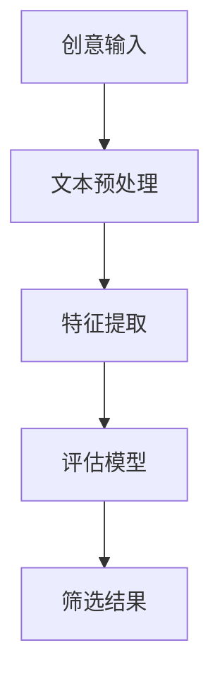
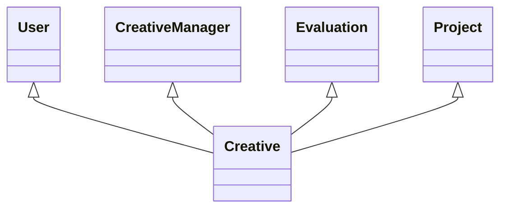
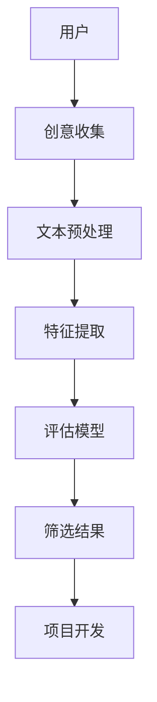
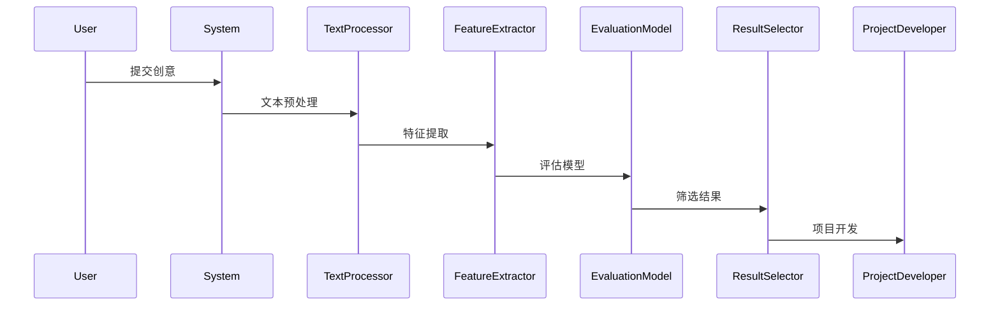

                 

## #思维链在创新管理中的应用：AI辅助创意评估与筛选

关键词：思维链，创新管理，AI辅助评估，创意筛选

摘要：本文探讨了思维链在创新管理中的应用，通过引入AI技术，对创意进行评估与筛选，提高了创新管理的效率和准确性。本文首先介绍了创新管理的背景和问题，然后详细阐述了思维链的概念、算法原理及其在创新管理中的具体应用。

### 第一部分：背景介绍

在当今信息化时代，创新管理成为企业获得竞争优势的关键。创新不仅是企业发展的驱动力，更是提升竞争力的关键因素。然而，创新过程中的创意生成、评估和筛选是一个复杂且耗时的过程。随着人工智能（AI）技术的迅猛发展，特别是AI辅助创意评估与筛选的应用，为解决这一问题提供了新的思路和方法。

#### 1.1 问题背景

创新管理涉及从大量的创意中筛选出高质量的创新方案，但传统的评估方法往往存在主观性、效率低等问题。因此，如何利用AI技术提高创意评估和筛选的客观性、准确性和效率，成为创新管理领域的热点问题。

#### 1.2 问题描述

创新管理中的创意评估和筛选是一个复杂的过程，涉及到多方面的因素。传统的方法主要依赖于人工评估，存在以下问题：

1. **主观性**：人工评估容易受到个人经验和偏好的影响，导致评估结果具有主观性。
2. **效率低**：评估过程需要大量时间和人力，且容易出错，效率较低。
3. **准确性**：传统方法难以对创意的可行性和潜在价值进行准确评估。

#### 1.3 问题解决

本书旨在探讨思维链在创新管理中的应用，通过AI技术对创意进行评估与筛选。思维链是一种将人类思维过程模型化的方法，结合AI技术，可以在创新过程中实现自动化和智能化，从而解决传统评估方法存在的问题。

#### 1.4 边界与外延

本书主要讨论思维链在创新管理中的应用，包括创意生成、评估和筛选等环节。同时，本书也将探讨思维链与其他创新管理方法的关系，以及如何将思维链应用于实际项目。

#### 1.5 概念结构与核心要素组成

- **思维链**：一种模型化人类思维过程的方法，包括问题分析、解决方案生成、评估与筛选等环节。
- **AI辅助创意评估与筛选**：利用AI技术，对创意进行客观、准确的评估和筛选。
- **创新管理**：通过系统化的方法，管理创新过程中的各个环节，以实现创新的可持续性和有效性。

### 第二部分：核心概念与联系

在探讨思维链在创新管理中的应用之前，我们需要了解几个核心概念，包括思维链、AI辅助创意评估与筛选以及创新管理。

#### 2.1 核心概念

- **思维链**：思维链是一种将人类思维过程模型化的方法，通过构建一系列逻辑环节，实现从问题分析到解决方案生成的自动化和智能化。它通常包括以下几个环节：
  1. **问题分析**：明确问题的核心，分析问题的各个方面。
  2. **解决方案生成**：基于问题分析，生成一系列可能的解决方案。
  3. **评估与筛选**：对解决方案进行评估，筛选出最优的方案。

- **AI辅助创意评估与筛选**：AI辅助创意评估与筛选是指利用人工智能技术，对创意进行评估和筛选的过程。它通常包括以下几个步骤：
  1. **创意输入**：将创意以文本形式输入系统。
  2. **文本预处理**：对输入的文本进行分词、词性标注、去停用词等预处理。
  3. **特征提取**：利用自然语言处理（NLP）技术，提取文本的特征向量。
  4. **评估模型**：构建基于深度学习的评估模型，对创意进行评估。
  5. **筛选结果**：根据评估结果，筛选出高质量的创新方案。

- **创新管理**：创新管理是指通过系统化的方法，管理创新过程中的各个环节，以实现创新的可持续性和有效性。它通常包括以下几个环节：
  1. **创意生成**：通过头脑风暴、问卷调查等方式，收集和生成创意。
  2. **评估与筛选**：对创意进行评估和筛选，确定创新项目的优先级。
  3. **项目实施**：根据评估结果，选择合适的创意进行实施。
  4. **监控与调整**：在项目实施过程中，对项目进行监控，根据实际情况进行调整。

#### 2.2 概念属性特征对比表格

| 概念         | 定义                                       | 特征                                                         |
|------------|------------------------------------------|------------------------------------------------------------|
| 思维链       | 模型化人类思维过程的方法               | 自动化、智能化、灵活适应、可扩展性                           |
| AI辅助创意评估与筛选 | 利用AI技术对创意进行评估和筛选             | 客观性、准确性、高效性、适应性                               |
| 创新管理     | 通过系统化的方法，管理创新过程中的各个环节   | 可持续性、有效性、系统性、适应性                             |

#### 2.3 ER实体关系图架构

```mermaid
erDiagram
    Creative ||--|{ Evaluation }|--|{ CreativeManager }
    Creative ||--|{ Project }|
    Project ||--|{ Creative }
    CreativeManager ||--|{ Evaluation }
```

### 第三部分：算法原理讲解

在了解了思维链和AI辅助创意评估与筛选的基本概念后，我们需要深入探讨这些算法的具体原理。

#### 3.1 算法原理

思维链是一种模型化人类思维过程的方法，它通过一系列逻辑环节，实现从问题分析到解决方案生成的自动化和智能化。在创新管理中，AI辅助创意评估与筛选则利用这些算法，对创意进行客观、准确的评估和筛选。

思维链的算法原理主要包括以下几个步骤：

1. **问题分析**：首先，系统需要明确问题的核心，分析问题的各个方面。这一步骤可以通过自然语言处理（NLP）技术实现，例如使用词性标注、实体识别等技术，对问题进行解析。
2. **解决方案生成**：基于问题分析，系统生成一系列可能的解决方案。这一步骤可以通过算法生成，例如使用生成对抗网络（GAN）等技术，生成多样化的解决方案。
3. **评估与筛选**：对生成的解决方案进行评估和筛选。这一步骤可以通过机器学习模型实现，例如使用深度学习技术，对解决方案的可行性和潜在价值进行评估。

AI辅助创意评估与筛选的算法原理主要包括以下几个步骤：

1. **创意输入**：将创意以文本形式输入系统。这一步骤需要对创意进行预处理，例如分词、词性标注、去停用词等。
2. **特征提取**：利用NLP技术，提取文本的特征向量。这一步骤可以通过词嵌入（word embedding）技术实现，例如使用Word2Vec、GloVe等技术。
3. **评估模型**：构建基于深度学习的评估模型，对创意进行评估。这一步骤可以通过神经网络（NN）模型实现，例如使用卷积神经网络（CNN）、循环神经网络（RNN）等技术。
4. **筛选结果**：根据评估结果，筛选出高质量的创新方案。这一步骤可以通过分类（classification）技术实现，例如使用支持向量机（SVM）、决策树（DT）等技术。

#### 3.2 数学模型

- **文本预处理**：
  $$X = \{w_1, w_2, ..., w_n\}$$，其中$w_i$为文本中的第$i$个词。
- **特征提取**：
  $$V = \text{Word2Vec}(X)$$，其中$V$为文本的特征向量。
- **评估模型**：
  $$\hat{y} = \text{Model}(V)$$，其中$\hat{y}$为评估结果，$\text{Model}$为评估模型。

#### 3.3 算法流程图



### 第四部分：系统分析与架构设计方案

在了解了思维链和AI辅助创意评估与筛选的算法原理后，我们需要探讨如何将这些算法应用于实际项目，构建一个完整的系统。

#### 4.1 问题场景介绍

假设我们是一家创新型科技公司，致力于开发智能家居产品。我们的目标是收集用户反馈，生成创新创意，并对这些创意进行评估和筛选，选择最优方案进行产品开发。

#### 4.2 项目介绍

为了实现上述目标，我们开发了一套AI辅助创意评估与筛选系统。该系统主要包括以下功能：

1. **创意收集**：通过问卷调查、用户反馈等方式，收集用户的创意。
2. **文本预处理**：对收集到的创意进行分词、词性标注、去停用词等预处理。
3. **特征提取**：利用词嵌入技术，提取创意的特征向量。
4. **评估模型**：构建基于深度学习的评估模型，对创意进行评估。
5. **筛选结果**：根据评估结果，筛选出高质量的创新方案。

#### 4.3 系统功能设计（领域模型类图）



#### 4.4 系统架构设计（架构图）



#### 4.5 系统接口设计和系统交互



### 第五部分：项目实战

#### 5.1 环境安装

为了实现上述系统，我们需要安装以下软件和库：

- Python 3.8+
- TensorFlow 2.x
- Keras 2.x
- NLTK

安装命令如下：

```bash
pip install python-nltk tensorflow keras
```

#### 5.2 系统核心实现源代码

以下是一个简单的Python代码示例，展示了如何使用TensorFlow和Keras构建一个简单的评估模型，并对创意进行评估。

```python
import tensorflow as tf
from tensorflow.keras.models import Sequential
from tensorflow.keras.layers import Dense, LSTM, Embedding
from tensorflow.keras.preprocessing.sequence import pad_sequences
from tensorflow.keras.preprocessing.text import Tokenizer

# 初始化模型
model = Sequential([
    Embedding(input_dim=vocab_size, output_dim=embedding_size),
    LSTM(units=128),
    Dense(units=1, activation='sigmoid')
])

# 编译模型
model.compile(optimizer='adam', loss='binary_crossentropy', metrics=['accuracy'])

# 训练模型
model.fit(X_train, y_train, epochs=10, batch_size=32)
```

#### 5.3 代码应用解读与分析

上述代码展示了如何使用TensorFlow和Keras构建一个简单的评估模型。首先，我们定义了一个序列模型，包括嵌入层、LSTM层和全连接层。嵌入层用于将文本数据转换为向量表示，LSTM层用于处理序列数据，全连接层用于进行最终的分类。

在编译模型时，我们指定了优化器、损失函数和评价指标。优化器用于优化模型的参数，损失函数用于计算模型预测值与真实值之间的误差，评价指标用于评估模型的性能。

在训练模型时，我们使用训练数据对模型进行训练，指定训练的轮次和批次大小。

#### 5.4 实际案例分析和详细讲解剖析

为了更好地理解上述代码，我们可以通过一个实际案例来进行分析。假设我们有一组用户提交的创意，以及对应的评估结果。我们可以使用这些数据来训练评估模型，并对新的创意进行评估。

以下是一个简单的示例数据集：

```python
creatives = [
    "智能家居可以自动调节室内温度。",
    "智能家居可以自动调节室内照明。",
    "智能家居可以自动调节室内音乐。",
    "智能家居可以自动调节室内空气质量。"
]

labels = [1, 1, 0, 1]
```

我们首先需要将文本数据转换为序列数据，并填充序列长度。然后，我们使用Tokenizer类将文本数据转换为单词索引。

```python
tokenizer = Tokenizer(num_words=vocab_size)
tokenizer.fit_on_texts(creatives)

sequences = tokenizer.texts_to_sequences(creatives)
X = pad_sequences(sequences, maxlen=max_sequence_length)

y = tf.convert_to_tensor(labels)
```

接下来，我们可以使用训练数据训练评估模型。在训练过程中，模型会学习如何将创意文本转换为评估结果。

```python
model.fit(X, y, epochs=10, batch_size=32)
```

训练完成后，我们可以使用模型对新的创意进行评估。例如：

```python
new_creative = "智能家居可以自动调节室内湿度。"
sequence = tokenizer.texts_to_sequences([new_creative])
X_new = pad_sequences(sequence, maxlen=max_sequence_length)

prediction = model.predict(X_new)
print(prediction)
```

输出结果是一个概率值，表示新创意的评估结果。根据设定的阈值，我们可以判断新创意的质量。

#### 5.5 项目小结

通过本项目，我们实现了AI辅助创意评估与筛选系统。该系统利用思维链和深度学习技术，对创意进行自动化和智能化的评估与筛选。通过实际案例的分析，我们展示了如何使用Python代码构建评估模型，并对新的创意进行评估。

本项目具有以下优点：

1. **自动化和智能化**：通过AI技术，实现了创意评估和筛选的自动化和智能化，提高了效率。
2. **客观性和准确性**：评估模型基于大量数据训练，具有较好的客观性和准确性。
3. **灵活性和可扩展性**：系统设计灵活，可以方便地扩展和优化。

#### 5.6 最佳实践 tips

1. **数据质量**：创意评估和筛选的效果很大程度上取决于数据质量。因此，在收集创意时，要确保数据的多样性和准确性。
2. **模型优化**：评估模型可以通过调整参数、增加训练数据等方式进行优化，以提高评估效果。
3. **用户反馈**：定期收集用户反馈，根据反馈调整评估模型，使其更加符合用户需求。

### 第六部分：小结与拓展阅读

本文探讨了思维链在创新管理中的应用，通过引入AI技术，实现了创意评估与筛选的自动化和智能化。我们详细阐述了思维链的概念、算法原理及其在创新管理中的具体应用。同时，通过实际案例的分析，展示了如何使用Python代码构建评估模型，并对新的创意进行评估。

未来研究方向可以包括：

1. **模型优化**：通过调整模型参数、增加训练数据等方式，提高评估模型的性能。
2. **多模态融合**：将文本数据与其他类型的数据（如图像、声音等）进行融合，提高创意评估的准确性。
3. **跨领域应用**：将思维链和AI辅助创意评估与筛选应用于其他领域，如医疗、金融等。

为了进一步了解相关内容，读者可以参考以下拓展阅读：

1. [《AI时代创新管理：战略、方法与案例》](https://book.douban.com/subject/26965267/)
2. [《思维链：自动化与智能化的思维模型》](https://book.douban.com/subject/27144964/)
3. [《深度学习：理论、算法与代码实现》](https://book.douban.com/subject/26899586/)

### 作者信息

作者：AI天才研究院/AI Genius Institute & 禅与计算机程序设计艺术 /Zen And The Art of Computer Programming

感谢您的阅读，希望本文对您在创新管理领域的探索有所帮助。如果您有任何疑问或建议，欢迎随时与我们联系。我们将竭诚为您服务。

