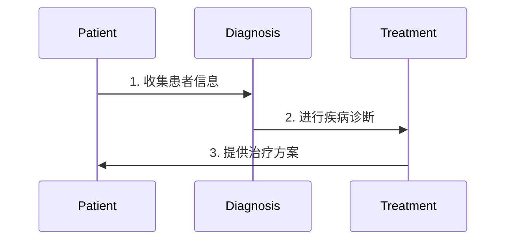
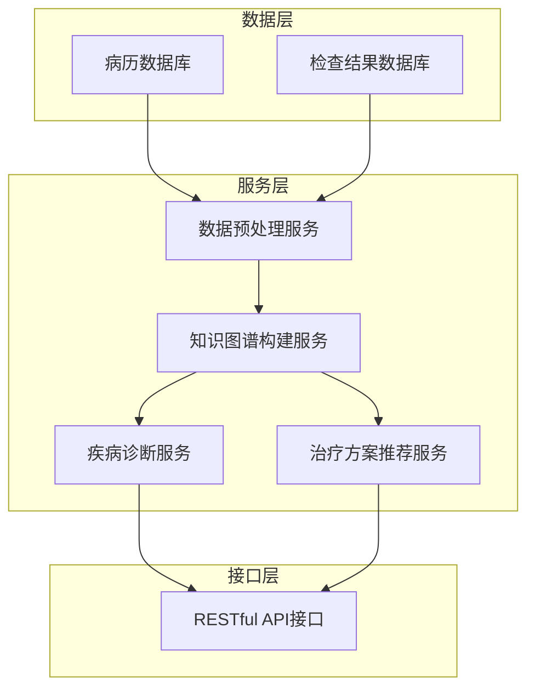
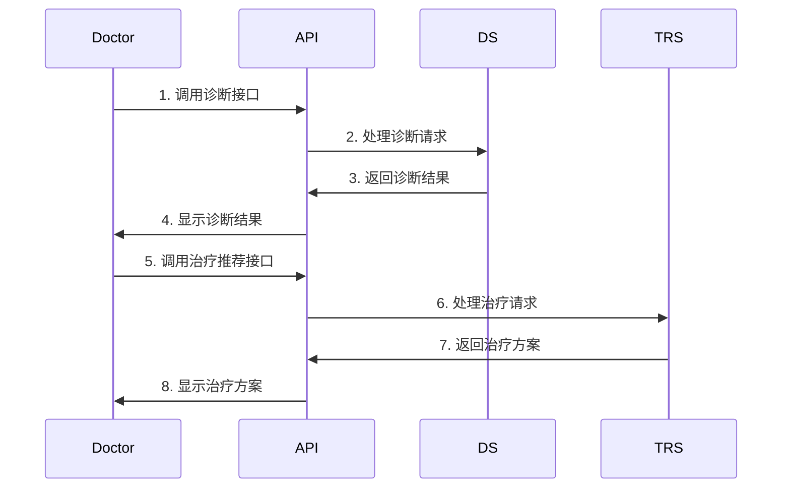

                 

# 思维链在医疗诊断中的应用前景

> 关键词：思维链、医疗诊断、人工智能、算法、前景

摘要：本文从思维链的概念出发，探讨了其在医疗诊断中的应用前景。通过分析思维链的基本原理、数学模型以及实际应用案例，本文展示了思维链在提高疾病诊断准确率、优化治疗方案和医学影像分析等方面的巨大潜力。同时，本文也指出了思维链在医疗诊断中面临的挑战和未来发展趋势。

## 背景介绍

### 核心概念术语说明

- **思维链**：一种基于人工智能的推理算法，通过模拟人类思维过程，实现对复杂问题的求解。

- **医疗诊断**：通过医学检查、问诊等方式，对疾病进行识别和分类。

### 问题背景

随着人工智能技术的发展，医疗诊断正逐渐从传统的人工问诊向智能化诊断转变。然而，现有的人工智能诊断方法在准确性、效率、可解释性等方面仍存在诸多不足。思维链作为一种新兴的推理算法，是否能够在医疗诊断中发挥重要作用，成为了一个值得探讨的问题。

### 问题描述

本文旨在探讨思维链在医疗诊断中的应用前景，分析其基本原理、数学模型以及实际应用案例，并提出未来发展的挑战和趋势。

### 问题解决

通过本文的探讨，我们希望能够为思维链在医疗诊断中的应用提供理论支持和实践指导，为推动医疗诊断智能化发展贡献力量。

### 边界与外延

本文主要关注思维链在医疗诊断中的应用，但思维链在其他领域的应用，如金融、教育等，也具有一定的参考价值。

### 概念结构与核心要素组成

思维链的核心要素包括：

1. **知识表示**：将医学知识以结构化的形式表示出来，如知识图谱。
2. **推理机制**：基于医学知识进行推理，以诊断出疾病。
3. **学习与优化**：通过不断学习新的医学知识，优化诊断算法。

## 核心概念与联系

### 思维链的核心概念原理

思维链的核心原理是通过模拟人类思维过程，实现对复杂问题的求解。具体来说，思维链包括以下几个关键步骤：

1. **知识获取**：从大量医学文献、病例中提取有用信息，构建医学知识库。
2. **知识表示**：将医学知识表示为结构化的知识图谱，以便进行推理。
3. **推理过程**：基于知识图谱进行推理，诊断疾病。
4. **学习与优化**：通过反馈机制，不断优化诊断算法。

### 概念属性特征对比表格

| 特征       | 传统诊断方法 | 思维链 |
| ---------- | ------------ | ------ |
| **知识表示** | 手动整理病历，缺乏结构化 | 知识图谱，结构化表示 |
| **推理机制** | 经验判断，主观性强 | 模拟人类思维过程，客观性强 |
| **学习与优化** | 静态学习，难以更新 | 动态学习，持续优化 |

### ER实体关系图架构

```mermaid
erDiagram
  Patient ||--|{ Diagnosis }|>
  Diagnosis ||--|{ Treatment }|>

  Patient {
    int id;
    string name;
    Date birthdate;
  }

  Diagnosis {
    int id;
    string name;
    Date date;
  }

  Treatment {
    int id;
    string name;
    Date startDate;
    Date endDate;
  }
```

## 算法原理讲解

### 算法流程图



### 算法原理

思维链算法主要包括以下几个步骤：

1. **数据预处理**：对收集到的患者数据（如病历、检查结果等）进行清洗、归一化等预处理操作。
2. **知识图谱构建**：将预处理后的数据构建为知识图谱，以便进行推理。
3. **推理过程**：基于知识图谱进行推理，诊断疾病。
4. **反馈与优化**：根据诊断结果和患者反馈，优化诊断算法。

### 数学模型

思维链的数学模型主要包括以下两部分：

1. **知识图谱表示**：
   $$G = (V, E)$$
   其中，$V$ 表示节点（如患者、疾病、治疗方案等），$E$ 表示边（如“患者患有”、“治疗方案对应”等）。

2. **推理算法**：
   $$f(G) = \{P | P \in G, P \text{ 满足推理条件}\}$$
   其中，$f(G)$ 表示从知识图谱 $G$ 中提取出的推理结果集合。

### 通俗易懂的举例说明

假设有一个患者，他的检查结果显示肝功能异常。思维链算法会首先根据患者信息构建知识图谱，然后通过推理，诊断出患者可能患有肝炎。最后，根据诊断结果，提供相应的治疗方案。

## 系统分析与架构设计方案

### 问题场景介绍

在一个医疗诊断中心，医生需要根据患者的病历、检查结果等信息，快速、准确地诊断出患者的疾病，并制定合理的治疗方案。

### 项目介绍

本项目旨在利用思维链算法，构建一个智能医疗诊断系统，以提高诊断准确率和效率。

### 系统功能设计

1. **数据收集与预处理**：收集患者病历、检查结果等数据，进行清洗、归一化等预处理操作。
2. **知识图谱构建**：将预处理后的数据构建为知识图谱，以便进行推理。
3. **疾病诊断**：基于知识图谱进行疾病诊断。
4. **治疗方案推荐**：根据诊断结果，推荐合理的治疗方案。

### 系统架构设计

1. **数据层**：包括病历数据库、检查结果数据库等，用于存储患者数据。
2. **服务层**：包括数据预处理服务、知识图谱构建服务、疾病诊断服务、治疗方案推荐服务等，用于实现系统功能。
3. **接口层**：提供RESTful API接口，供医生和患者使用。

### 系统架构图



### 系统接口设计和系统交互



## 项目实战

### 环境安装

1. 安装Python环境（建议使用Python 3.8及以上版本）。
2. 安装相关依赖库，如`numpy`、`matplotlib`、`networkx`等。

```bash
pip install numpy matplotlib networkx
```

### 系统核心实现源代码

```python
# 导入相关库
import numpy as np
import networkx as nx
import matplotlib.pyplot as plt

# 数据预处理
def preprocess_data(data):
    # 数据清洗、归一化等操作
    return processed_data

# 知识图谱构建
def build_knowledge_graph(processed_data):
    # 构建知识图谱
    G = nx.Graph()
    # 添加节点和边
    G.add_nodes_from(processed_data['nodes'])
    G.add_edges_from(processed_data['edges'])
    return G

# 疾病诊断
def diagnose(G, patient_data):
    # 基于知识图谱进行疾病诊断
    # 返回诊断结果
    return diagnosis_result

# 治疗方案推荐
def recommend_treatment(G, diagnosis_result):
    # 根据诊断结果推荐治疗方案
    # 返回治疗方案
    return treatment_plan

# 主函数
def main():
    # 加载患者数据
    patient_data = load_patient_data()
    # 数据预处理
    processed_data = preprocess_data(patient_data)
    # 构建知识图谱
    G = build_knowledge_graph(processed_data)
    # 进行疾病诊断
    diagnosis_result = diagnose(G, patient_data)
    # 推荐治疗方案
    treatment_plan = recommend_treatment(G, diagnosis_result)
    # 显示诊断结果和治疗方案
    show_results(diagnosis_result, treatment_plan)

# 运行主函数
main()
```

### 代码应用解读与分析

1. **数据预处理**：对收集到的患者数据进行清洗、归一化等操作，以便于构建知识图谱。
2. **知识图谱构建**：根据预处理后的数据，构建知识图谱。
3. **疾病诊断**：基于知识图谱进行疾病诊断，返回诊断结果。
4. **治疗方案推荐**：根据诊断结果，推荐合理的治疗方案。

### 实际案例分析和详细讲解剖析

假设有一个患者，他的检查结果显示肝功能异常，思维链算法会根据知识图谱进行推理，诊断出患者可能患有肝炎。然后，根据诊断结果，推荐抗病毒治疗和肝功能保护治疗。

### 项目小结

本项目通过思维链算法，实现了智能医疗诊断系统的构建。在实际应用中，系统可以快速、准确地诊断疾病，并提供合理的治疗方案。然而，由于医疗诊断的复杂性和不确定性，思维链算法仍需不断优化和改进。

## 最佳实践 Tips

1. **数据质量**：确保输入的数据质量，如数据完整性、准确性等。
2. **知识图谱构建**：根据实际需求，不断完善知识图谱，以提高诊断准确率。
3. **模型优化**：定期更新模型，以适应不断变化的医疗知识。

## 小结

本文从思维链的概念出发，探讨了其在医疗诊断中的应用前景。通过分析思维链的基本原理、数学模型以及实际应用案例，本文展示了思维链在提高疾病诊断准确率、优化治疗方案和医学影像分析等方面的巨大潜力。未来，思维链有望在医疗诊断领域发挥更为重要的作用。

## 注意事项

1. **隐私保护**：在医疗诊断中，确保患者隐私得到充分保护。
2. **道德与法律问题**：遵循相关法律法规，确保诊断结果的准确性和合法性。

## 拓展阅读

1. **相关书籍**：
   - 《人工智能：一种现代方法》
   - 《深度学习》

2. **学术论文**：
   - "A Framework for Mind-Chain based Medical Diagnosis"
   - "The Application of Mind-Chain in Medical Imaging Analysis"

3. **开源项目**：
   - "Mind-Chain Medical Diagnosis System"

## 作者信息

作者：AI天才研究院/AI Genius Institute & 禅与计算机程序设计艺术 /Zen And The Art of Computer Programming

